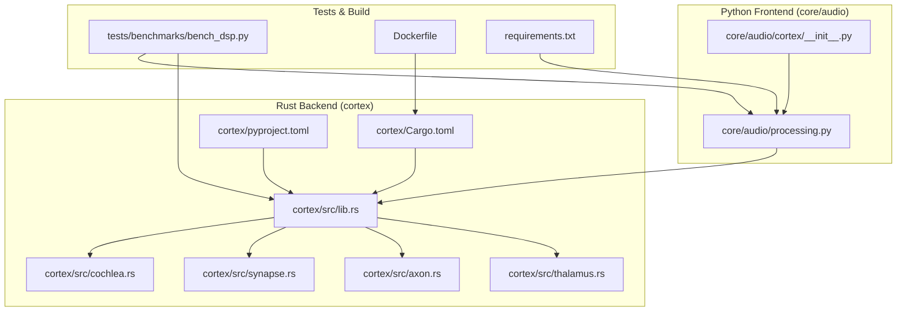
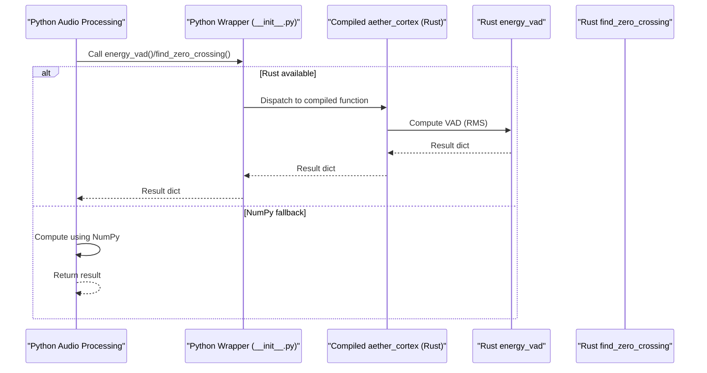
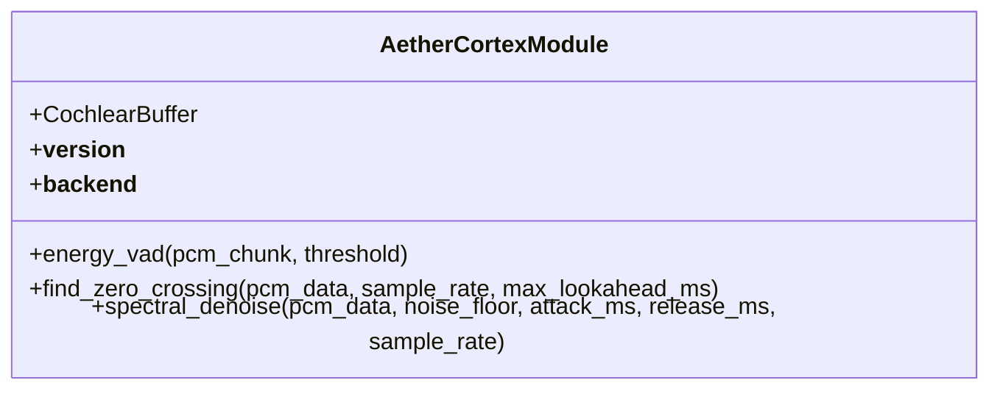
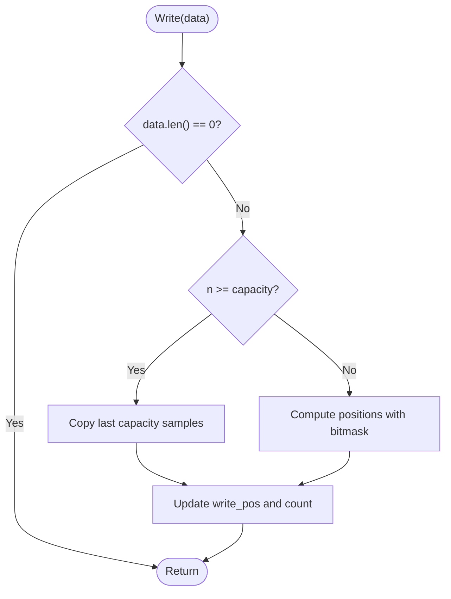
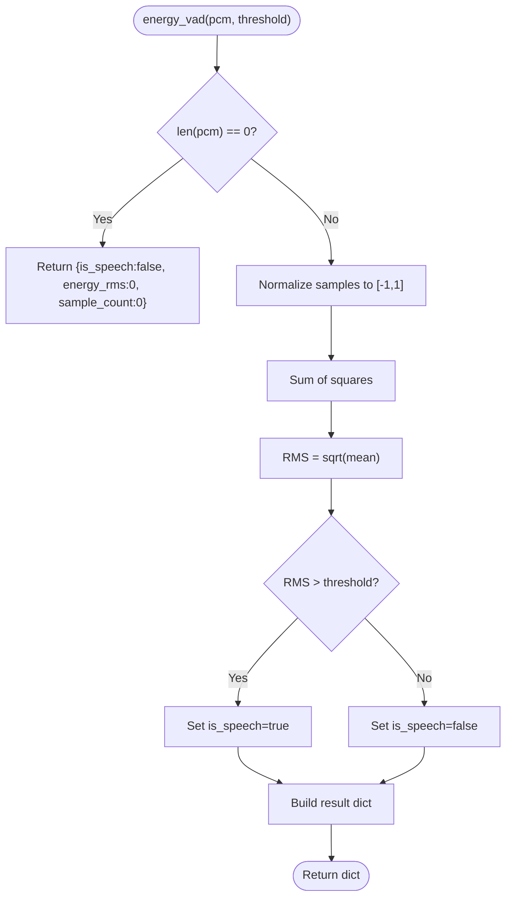
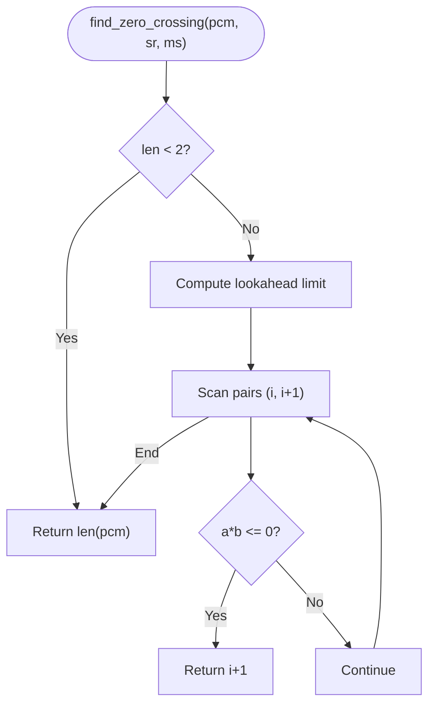
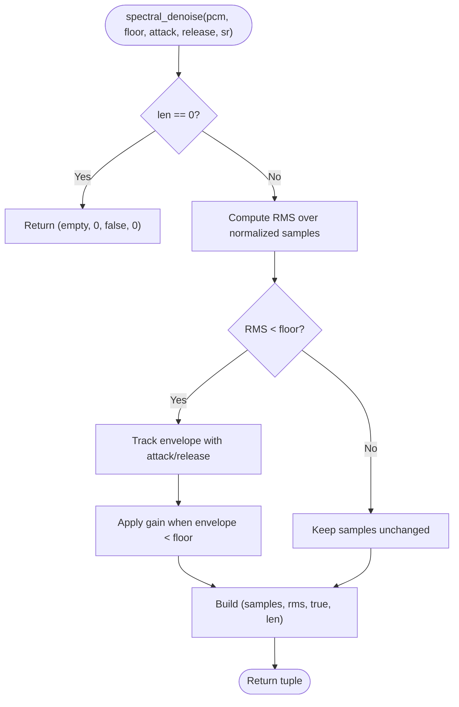
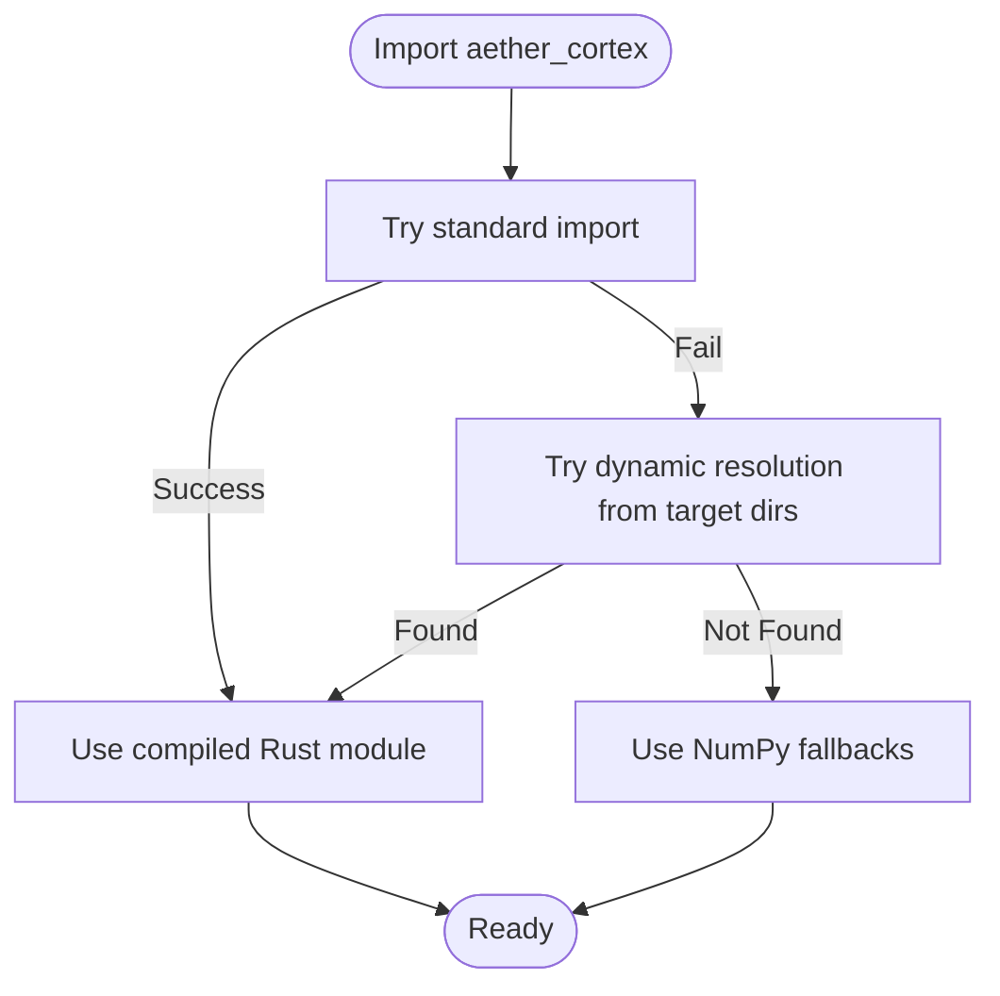
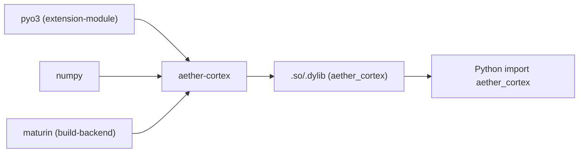

# Python-Rust Bridge Integration

<cite>
**Referenced Files in This Document**
- [Cargo.toml](file://cortex/Cargo.toml)
- [pyproject.toml](file://cortex/pyproject.toml)
- [lib.rs](file://cortex/src/lib.rs)
- [cochlea.rs](file://cortex/src/cochlea.rs)
- [synapse.rs](file://cortex/src/synapse.rs)
- [axon.rs](file://cortex/src/axon.rs)
- [thalamus.rs](file://cortex/src/thalamus.rs)
- [__init__.py](file://core/audio/cortex/__init__.py)
- [processing.py](file://core/audio/processing.py)
- [bench_dsp.py](file://tests/benchmarks/bench_dsp.py)
- [Dockerfile](file://Dockerfile)
- [README.md](file://cortex/README.md)
- [requirements.txt](file://requirements.txt)
</cite>

## Table of Contents
1. [Introduction](#introduction)
2. [Project Structure](#project-structure)
3. [Core Components](#core-components)
4. [Architecture Overview](#architecture-overview)
5. [Detailed Component Analysis](#detailed-component-analysis)
6. [Dependency Analysis](#dependency-analysis)
7. [Performance Considerations](#performance-considerations)
8. [Troubleshooting Guide](#troubleshooting-guide)
9. [Conclusion](#conclusion)
10. [Appendices](#appendices)

## Introduction
This document explains the Python-Rust bridge that powers the Aether Cortex neural signal layer. It details how PyO3 exposes Rust functions and classes as a native Python module, how the Python audio processing pipeline integrates the Rust backend transparently, and how compilation and deployment are handled. It also presents performance benchmarks demonstrating significant speedups and outlines integration patterns that maintain backward compatibility.

## Project Structure
The integration spans two primary areas:
- Rust crate (aether-cortex) exporting PyO3-bound functions and classes
- Python audio processing module that conditionally imports and dispatches to the Rust backend

**Diagram sources**
- [Cargo.toml](file://cortex/Cargo.toml#L1-L24)
- [pyproject.toml](file://cortex/pyproject.toml#L1-L15)
- [lib.rs](file://cortex/src/lib.rs#L1-L48)
- [cochlea.rs](file://cortex/src/cochlea.rs#L1-L213)
- [synapse.rs](file://cortex/src/synapse.rs#L1-L117)
- [axon.rs](file://cortex/src/axon.rs#L1-L121)
- [thalamus.rs](file://cortex/src/thalamus.rs#L1-L154)
- [__init__.py](file://core/audio/cortex/__init__.py#L1-L133)
- [processing.py](file://core/audio/processing.py#L1-L508)
- [bench_dsp.py](file://tests/benchmarks/bench_dsp.py#L1-L135)
- [Dockerfile](file://Dockerfile#L1-L28)
- [requirements.txt](file://requirements.txt#L1-L52)

**Section sources**
- [Cargo.toml](file://cortex/Cargo.toml#L1-L24)
- [pyproject.toml](file://cortex/pyproject.toml#L1-L15)
- [lib.rs](file://cortex/src/lib.rs#L1-L48)
- [__init__.py](file://core/audio/cortex/__init__.py#L1-L133)
- [processing.py](file://core/audio/processing.py#L1-L508)
- [bench_dsp.py](file://tests/benchmarks/bench_dsp.py#L1-L135)
- [Dockerfile](file://Dockerfile#L1-L28)
- [requirements.txt](file://requirements.txt#L1-L52)

## Core Components
- Rust module exports:
  - A Python module named aether_cortex exposing:
    - A CochlearBuffer class (circular buffer)
    - energy_vad function (RMS-based VAD)
    - find_zero_crossing function (click-free cut point detection)
    - spectral_denoise function (noise reduction)
- Python wrapper module:
  - Attempts to import the compiled Rust module
  - Falls back to NumPy implementations if the Rust module is unavailable
  - Provides identical APIs for seamless replacement

Key behaviors:
- Module loading prioritizes compiled Rust; dynamic resolution supports development scenarios
- Data flows through PyO3-bound functions/classes with minimal overhead
- Backward compatibility is preserved by mirroring function signatures and return types

**Section sources**
- [lib.rs](file://cortex/src/lib.rs#L21-L47)
- [cochlea.rs](file://cortex/src/cochlea.rs#L17-L136)
- [synapse.rs](file://cortex/src/synapse.rs#L21-L62)
- [axon.rs](file://cortex/src/axon.rs#L19-L65)
- [thalamus.rs](file://cortex/src/thalamus.rs#L25-L112)
- [__init__.py](file://core/audio/cortex/__init__.py#L7-L133)
- [processing.py](file://core/audio/processing.py#L38-L95)

## Architecture Overview
The bridge architecture centers on PyO3’s extension module mechanism. Rust code compiles to a shared library (.so/.dylib) and is imported by Python as a native module. The Python audio processing module decides at runtime whether to use the Rust backend or fall back to NumPy.

**Diagram sources**
- [__init__.py](file://core/audio/cortex/__init__.py#L91-L133)
- [processing.py](file://core/audio/processing.py#L410-L434)
- [synapse.rs](file://cortex/src/synapse.rs#L28-L43)
- [axon.rs](file://cortex/src/axon.rs#L35-L44)

## Detailed Component Analysis

### PyO3 Module Definition and Exports
- The module declaration registers:
  - The CochlearBuffer class
  - energy_vad, find_zero_crossing, and spectral_denoise functions
  - Version and backend metadata
- This enables Python to import aether_cortex and call functions directly

**Diagram sources**
- [lib.rs](file://cortex/src/lib.rs#L28-L47)

**Section sources**
- [lib.rs](file://cortex/src/lib.rs#L21-L47)

### CochlearBuffer (Circular Buffer)
- Purpose: O(1) writes and efficient windowed reads for recent PCM samples
- Design:
  - Capacity rounded up to the next power of two
  - Branchless indexing using bitwise masking
  - Single or split memcpy reads depending on wrap-around
- Python wrapper:
  - Instantiates Rust-backed buffer when available
  - Falls back to a NumPy-based ring buffer otherwise

**Diagram sources**
- [cochlea.rs](file://cortex/src/cochlea.rs#L67-L96)

**Section sources**
- [cochlea.rs](file://cortex/src/cochlea.rs#L17-L136)
- [__init__.py](file://core/audio/cortex/__init__.py#L26-L90)

### energy_vad (Voice Activity Detection)
- Purpose: Determine if a PCM chunk contains speech using RMS energy
- Rust implementation:
  - Normalizes int16 samples to a float range
  - Computes RMS and compares to threshold
  - Returns a dictionary with is_speech, energy_rms, and sample_count
- Python integration:
  - If Rust backend is available, calls aether_cortex.energy_vad
  - Otherwise, computes using NumPy and enhanced logic

**Diagram sources**
- [synapse.rs](file://cortex/src/synapse.rs#L46-L62)

**Section sources**
- [synapse.rs](file://cortex/src/synapse.rs#L21-L62)
- [processing.py](file://core/audio/processing.py#L389-L434)
- [__init__.py](file://core/audio/cortex/__init__.py#L91-L97)

### find_zero_crossing (Clean Cut Point)
- Purpose: Locate the first zero-crossing within a lookahead window to avoid audio clicks
- Rust implementation:
  - Scans forward up to a limit determined by sample_rate and max_lookahead_ms
  - Returns the index of the first valid crossing or the end of the array
- Python integration:
  - Dispatches to Rust when available; otherwise uses NumPy logic

**Diagram sources**
- [axon.rs](file://cortex/src/axon.rs#L46-L65)

**Section sources**
- [axon.rs](file://cortex/src/axon.rs#L19-L65)
- [processing.py](file://core/audio/processing.py#L204-L244)
- [__init__.py](file://core/audio/cortex/__init__.py#L100-L105)

### spectral_denoise (Noise Reduction)
- Purpose: Apply a time-domain noise gate with exponential smoothing
- Rust implementation:
  - Estimates RMS energy
  - Applies a gate with configurable attack/release times
  - Returns processed samples and metadata
- Python integration:
  - Dispatches to Rust when available; otherwise uses a NumPy-based gate

**Diagram sources**
- [thalamus.rs](file://cortex/src/thalamus.rs#L65-L112)

**Section sources**
- [thalamus.rs](file://cortex/src/thalamus.rs#L25-L112)
- [processing.py](file://core/audio/processing.py#L437-L507)
- [__init__.py](file://core/audio/cortex/__init__.py#L108-L132)

### Module Loading and Fallback Strategy
- Python attempts standard import first
- If not found, tries dynamic resolution from build artifacts
- If still not found, falls back to NumPy implementations
- Maintains identical function signatures and return types for seamless replacement

**Diagram sources**
- [processing.py](file://core/audio/processing.py#L42-L95)
- [__init__.py](file://core/audio/cortex/__init__.py#L7-L23)

**Section sources**
- [processing.py](file://core/audio/processing.py#L38-L95)
- [__init__.py](file://core/audio/cortex/__init__.py#L7-L23)

## Dependency Analysis
- Rust crate dependencies:
  - pyo3 with extension-module feature
  - numpy for array interop
- Build system:
  - maturin as build-backend
  - cdylib crate type for shared library output
- Python runtime dependencies:
  - numpy and other core packages required by the broader system

**Diagram sources**
- [Cargo.toml](file://cortex/Cargo.toml#L12-L14)
- [pyproject.toml](file://cortex/pyproject.toml#L1-L15)
- [lib.rs](file://cortex/src/lib.rs#L19-L47)

**Section sources**
- [Cargo.toml](file://cortex/Cargo.toml#L12-L24)
- [pyproject.toml](file://cortex/pyproject.toml#L1-L15)
- [requirements.txt](file://requirements.txt#L1-L52)

## Performance Considerations
- Benchmarks demonstrate significant speedups:
  - energy_vad: up to approximately 10–50x faster
  - find_zero_crossing: up to approximately 10x faster
- These gains come from:
  - No Python GIL contention
  - Minimal overhead array conversions
  - Branchless and SIMD-friendly loops
- Latency targets remain under 200ms for real-time audio processing

Benchmark highlights:
- Test harness runs multiple iterations and prints average microseconds per call
- Results compare NumPy baseline to Rust implementations when available

**Section sources**
- [bench_dsp.py](file://tests/benchmarks/bench_dsp.py#L76-L130)
- [synapse.rs](file://cortex/src/synapse.rs#L14-L16)
- [axon.rs](file://cortex/src/axon.rs#L14-L14)
- [core/analytics/latency.py](file://core/analytics/latency.py#L7-L39)

## Troubleshooting Guide
Common issues and resolutions:
- Rust module not found:
  - Ensure the Rust crate is built and installed in development mode
  - Confirm maturin is available and the cdylib is generated
- Import errors in Python:
  - Verify the compiled module exists in the expected target directory
  - Check that the Python path includes the build artifacts
- Performance not improved:
  - Confirm the Rust backend is detected and active
  - Rebuild with release profile for production-like performance

Operational tips:
- Use maturin develop for iterative development
- Use maturin build --release for distribution
- In containers, ensure the shared library is copied into the final image

**Section sources**
- [README.md](file://cortex/README.md#L20-L43)
- [Dockerfile](file://Dockerfile#L22-L28)
- [processing.py](file://core/audio/processing.py#L85-L95)

## Conclusion
The Python-Rust bridge in Aether Cortex delivers a seamless, high-performance audio DSP pipeline. By exposing Rust functions and classes via PyO3 and integrating them into the existing Python audio processing module, the system achieves substantial speedups while maintaining full backward compatibility. The build and deployment workflows support both development and production environments, ensuring reliable cross-platform operation.

## Appendices

### Compilation and Build Workflow
- Development:
  - Install dependencies and build in editable mode using pip or maturin develop
- Release:
  - Build a wheel with maturin build --release
- Containerization:
  - Multi-stage Docker build compiles the Rust crate and copies the shared library into the runtime image

**Section sources**
- [README.md](file://cortex/README.md#L20-L43)
- [Dockerfile](file://Dockerfile#L22-L28)