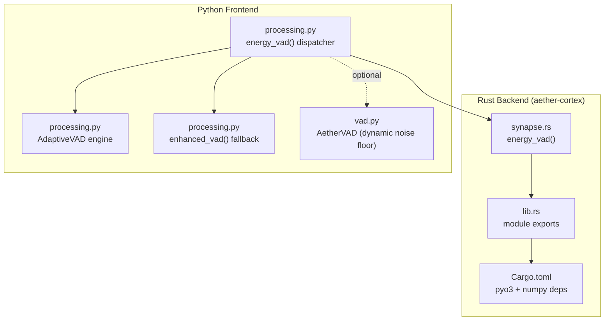
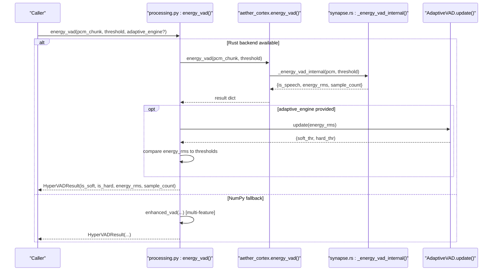
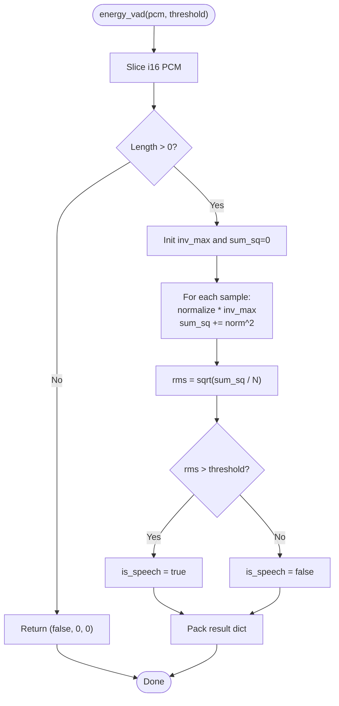
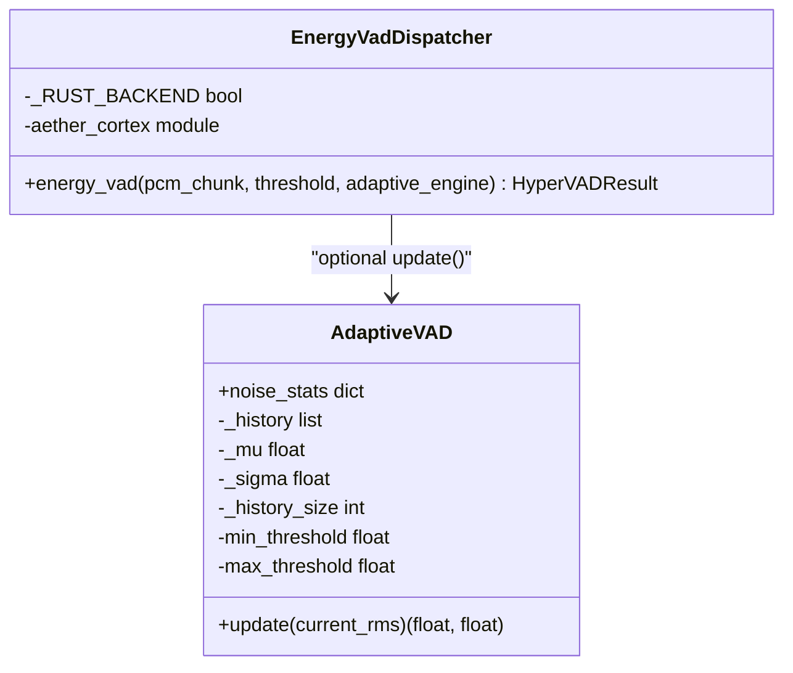
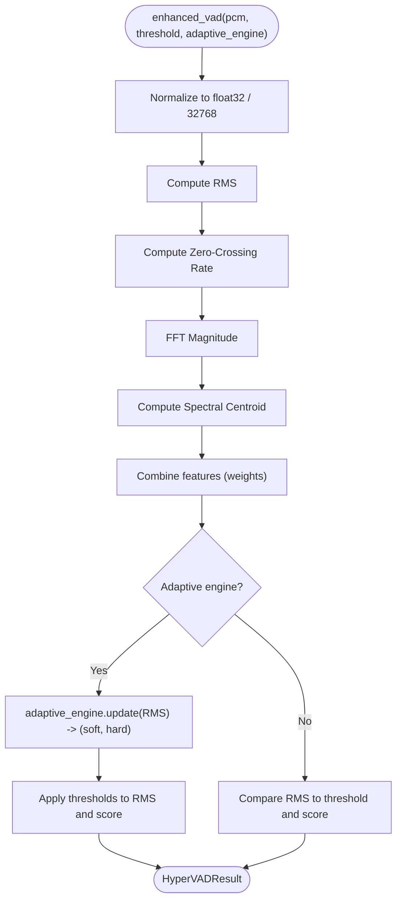
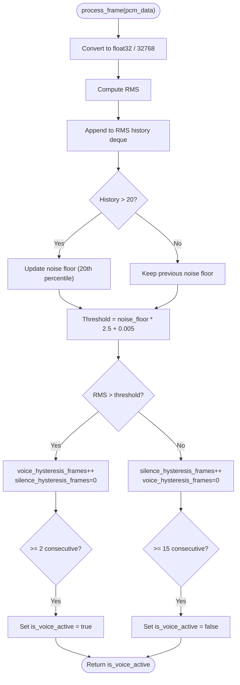
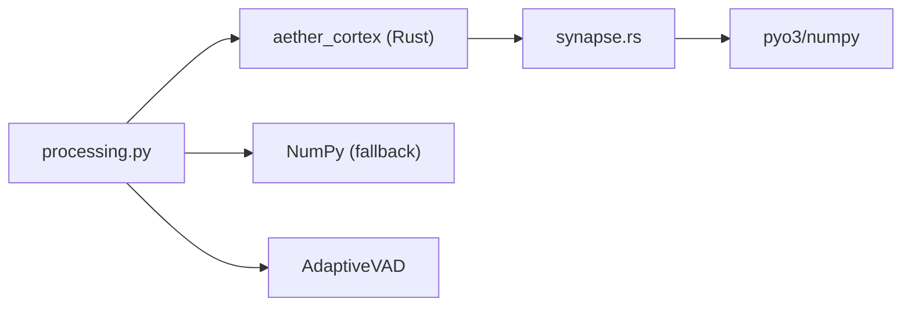

# Synapse Voice Activity Detection

<cite>
**Referenced Files in This Document**
- [synapse.rs](file://cortex/src/synapse.rs)
- [processing.py](file://core/audio/processing.py)
- [vad.py](file://core/audio/vad.py)
- [Cargo.toml](file://cortex/Cargo.toml)
- [lib.rs](file://cortex/src/lib.rs)
- [test_vad.py](file://tests/unit/test_vad.py)
- [bench_dsp.py](file://tests/benchmarks/bench_dsp.py)
- [voice_benchmark_report.json](file://tests/benchmarks/voice_benchmark_report.json)
</cite>

## Table of Contents
1. [Introduction](#introduction)
2. [Project Structure](#project-structure)
3. [Core Components](#core-components)
4. [Architecture Overview](#architecture-overview)
5. [Detailed Component Analysis](#detailed-component-analysis)
6. [Dependency Analysis](#dependency-analysis)
7. [Performance Considerations](#performance-considerations)
8. [Troubleshooting Guide](#troubleshooting-guide)
9. [Conclusion](#conclusion)
10. [Appendices](#appendices)

## Introduction
This document explains the Synapse module that implements neural activation-based Voice Activity Detection (VAD) in the Aether Voice OS. Synapse provides a biologically-inspired energy-based detector modeled on the synaptic firing threshold concept: a signal must exceed a neurotransmitter concentration (activation threshold) to trigger an action potential (speech detection). The module offers:
- A high-performance Rust implementation of RMS energy VAD with PyO3 bindings
- A Python fallback with enhanced multi-feature VAD for environments without the Rust backend
- Optional integration with an adaptive threshold engine for soft/hard detection modes
- Real-time audio processing pipeline integration for UI responsiveness and downstream decisions

The Synapse VAD is designed as a local, low-latency detector for UI reactivity and telemetry, while server-side VADs handle conversation turn detection.

## Project Structure
The Synapse VAD spans two layers:
- Rust layer (aether-cortex): Provides native, ultra-fast energy VAD via PyO3 bindings
- Python layer (core/audio/processing.py): Orchestrates backend selection, dispatches to Rust or NumPy, and optionally applies adaptive thresholds

**Diagram sources**
- [synapse.rs](file://cortex/src/synapse.rs#L1-L117)
- [lib.rs](file://cortex/src/lib.rs#L28-L47)
- [Cargo.toml](file://cortex/Cargo.toml#L12-L21)
- [processing.py](file://core/audio/processing.py#L389-L434)
- [vad.py](file://core/audio/vad.py#L14-L82)

**Section sources**
- [synapse.rs](file://cortex/src/synapse.rs#L1-L117)
- [processing.py](file://core/audio/processing.py#L389-L434)
- [Cargo.toml](file://cortex/Cargo.toml#L12-L21)
- [lib.rs](file://cortex/src/lib.rs#L28-L47)

## Core Components
- Synapse energy_vad (Rust): Computes RMS energy over PCM chunks and compares against a configurable threshold. Returns a dictionary with speech decision, RMS value, and sample count.
- Python energy_vad dispatcher: Detects backend availability, routes to Rust or NumPy, and optionally applies soft/hard thresholds via AdaptiveVAD.
- Enhanced VAD (Python fallback): Multi-feature detector combining RMS, Zero-Crossing Rate (ZCR), and Spectral Centroid for robustness.
- AdaptiveVAD: Estimates noise floor statistics and derives soft/hard thresholds for dynamic sensitivity.
- AetherVAD (dynamic noise floor): Alternative Python VAD with rolling RMS percentile-based noise floor and hysteresis.

Key responsibilities:
- Synapse: Minimal, fast, threshold-based detection
- Python dispatcher: Backend selection, optional adaptive thresholds, and fallback
- Enhanced VAD: Improved discrimination against noise and non-speech artifacts
- AdaptiveVAD: Statistical adaptation for varying acoustic conditions
- AetherVAD: Hysteresis-based state machine for smoother UI transitions

**Section sources**
- [synapse.rs](file://cortex/src/synapse.rs#L28-L62)
- [processing.py](file://core/audio/processing.py#L389-L507)
- [vad.py](file://core/audio/vad.py#L14-L82)

## Architecture Overview
The Synapse VAD sits at the intersection of the Rust neural signal layer and the Python audio processing pipeline. It is invoked by the Python dispatcher, which selects the fastest available backend.

**Diagram sources**
- [processing.py](file://core/audio/processing.py#L410-L434)
- [synapse.rs](file://cortex/src/synapse.rs#L30-L62)
- [processing.py](file://core/audio/processing.py#L437-L507)

## Detailed Component Analysis

### Synapse energy_vad (Rust)
Implements a minimal, high-throughput RMS energy detector:
- Accepts i16 PCM samples and a configurable threshold
- Normalizes samples to [-1, 1] using a constant inverse scale
- Sums squared magnitudes and computes RMS over the chunk
- Compares RMS to threshold to decide speech presence
- Returns a dictionary with is_speech, energy_rms, and sample_count

**Diagram sources**
- [synapse.rs](file://cortex/src/synapse.rs#L30-L62)

**Section sources**
- [synapse.rs](file://cortex/src/synapse.rs#L28-L62)

### Python energy_vad dispatcher and AdaptiveVAD
The Python dispatcher:
- Detects Rust backend availability and routes accordingly
- Calls Rust energy_vad and extracts energy_rms
- Optionally updates AdaptiveVAD thresholds and sets soft/hard flags
- Falls back to enhanced_vad when Rust is unavailable

AdaptiveVAD maintains a sliding window of RMS history to estimate mean and standard deviation, deriving:
- Soft threshold: mean + 1.5 × std
- Hard threshold: mean + 4.0 × std
Clamps thresholds to configured min/max bounds

**Diagram sources**
- [processing.py](file://core/audio/processing.py#L389-L434)
- [processing.py](file://core/audio/processing.py#L256-L317)

**Section sources**
- [processing.py](file://core/audio/processing.py#L389-L434)
- [processing.py](file://core/audio/processing.py#L256-L317)

### Enhanced VAD (Python fallback)
When the Rust backend is unavailable, the dispatcher falls back to enhanced_vad, which:
- Computes RMS energy
- Calculates Zero-Crossing Rate (ZCR) to distinguish speech from noise
- Computes Spectral Centroid to favor speech-like spectra
- Combines these features with weighted scores to produce soft/hard decisions
- Applies adaptive thresholds when provided

**Diagram sources**
- [processing.py](file://core/audio/processing.py#L437-L507)

**Section sources**
- [processing.py](file://core/audio/processing.py#L437-L507)

### AetherVAD (Dynamic Noise Floor with Hysteresis)
A separate Python VAD implementation that:
- Tracks RMS history and recalibrates noise floor using percentiles
- Uses hysteresis counters to stabilize state transitions and avoid chatter
- Produces a binary voice-active flag suitable for UI feedback

**Diagram sources**
- [vad.py](file://core/audio/vad.py#L33-L76)

**Section sources**
- [vad.py](file://core/audio/vad.py#L14-L82)

## Dependency Analysis
- Rust backend dependencies: pyo3 for Python bindings, numpy for array handling
- Python dispatcher depends on:
  - aether_cortex module (Rust) when available
  - NumPy for fallback computations
  - AdaptiveVAD for dynamic thresholds
- Tests validate behavior across Rust and NumPy paths, including soft/hard thresholding and silence/speech classification

**Diagram sources**
- [processing.py](file://core/audio/processing.py#L410-L434)
- [synapse.rs](file://cortex/src/synapse.rs#L18-L19)
- [Cargo.toml](file://cortex/Cargo.toml#L12-L14)

**Section sources**
- [Cargo.toml](file://cortex/Cargo.toml#L12-L21)
- [lib.rs](file://cortex/src/lib.rs#L28-L47)
- [processing.py](file://core/audio/processing.py#L410-L434)

## Performance Considerations
- Backend selection: The dispatcher automatically chooses the Rust backend when available, otherwise falls back to NumPy.
- Throughput and latency:
  - Benchmarks show significant speedup when using the Rust backend for energy_vad and related operations.
  - The Rust implementation targets sub-microsecond per call performance compared to NumPy.
- Real-time pipeline:
  - Synapse is optimized for UI responsiveness and telemetry; server-side VADs handle turn-taking.
  - SilentAnalyzer and AdaptiveVAD complement Synapse by classifying quiet states and adapting thresholds.

Optimization tips:
- Prefer Rust backend for latency-sensitive UI reactions
- Tune chunk sizes to balance latency and throughput
- Use AdaptiveVAD to reduce false positives in noisy environments
- Avoid unnecessary conversions; pass raw i16 buffers to Rust when possible

**Section sources**
- [bench_dsp.py](file://tests/benchmarks/bench_dsp.py#L91-L134)
- [synapse.rs](file://cortex/src/synapse.rs#L14-L16)
- [processing.py](file://core/audio/processing.py#L389-L434)

## Troubleshooting Guide
Common issues and remedies:
- No Rust backend detected:
  - Symptom: Fallback to NumPy observed in logs
  - Action: Install or build aether-cortex wheel; ensure dynamic resolution finds the library
- Incorrect thresholds:
  - Symptom: Missed detections or false positives
  - Action: Adjust base threshold or enable AdaptiveVAD; validate with unit tests
- Hysteresis mismatch:
  - Symptom: Chattering UI or delayed response
  - Action: Use AetherVAD for smoother state transitions; tune hysteresis counters
- Empty or short chunks:
  - Symptom: Immediate non-speech decisions
  - Action: Ensure adequate chunk sizes; Synapse handles empty input gracefully

Validation references:
- Unit tests confirm correct behavior for silence, loud signals, and threshold boundaries
- Benchmark report includes VAD classification accuracy metrics

**Section sources**
- [test_vad.py](file://tests/unit/test_vad.py#L39-L141)
- [voice_benchmark_report.json](file://tests/benchmarks/voice_benchmark_report.json#L86-L93)

## Conclusion
Synapse delivers a biologically-inspired, high-performance energy-based VAD that integrates seamlessly into the Aether Voice OS audio pipeline. Its neural firing threshold concept improves upon naive RMS detection by providing a clean, configurable decision boundary. Combined with the Python dispatcher’s backend selection, optional adaptive thresholds, and complementary modules like AetherVAD and SilentAnalyzer, the system achieves robust, real-time speech detection suited for UI responsiveness and downstream processing.

## Appendices

### Parameter Tuning Guidelines
- Base threshold:
  - Start near 0.02; adjust based on environment and microphone sensitivity
- AdaptiveVAD:
  - Window size: balance responsiveness vs. stability (e.g., 2–5 seconds)
  - Min/max thresholds: constrain soft/hard thresholds to avoid extremes
- AetherVAD:
  - Hysteresis frames: tune to reduce chatter while preserving responsiveness
- Chunk duration:
  - Shorter chunks improve latency; longer chunks improve stability

### Comparative Notes
- Synapse (Rust) vs. Python fallback:
  - Synapse prioritizes speed and simplicity; Python fallback adds robustness via multi-feature fusion
- Hysteresis vs. threshold-only:
  - Hysteresis reduces chattering and improves UI smoothness; threshold-only is simpler and faster
- Adaptive vs. static thresholds:
  - Adaptive thresholds improve accuracy across varying noise conditions; static thresholds are predictable and fast

### Integration Tips
- Use Synapse for UI reactivity and telemetry
- Use AetherVAD for smoother state transitions in UI
- Enable AdaptiveVAD for dynamic environments
- Keep server-side VADs for conversation turn detection