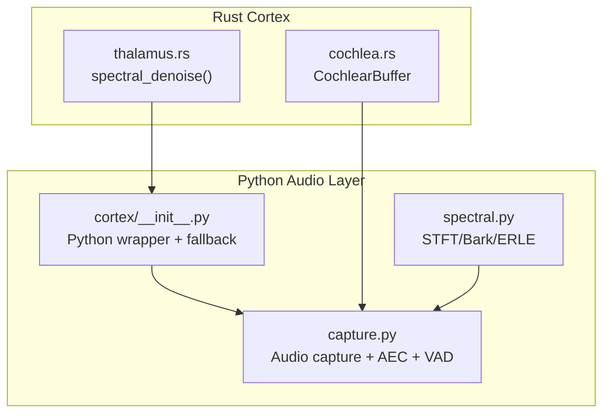
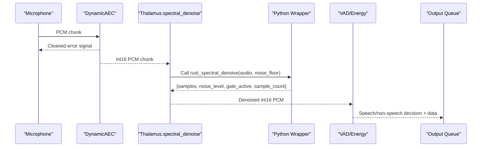
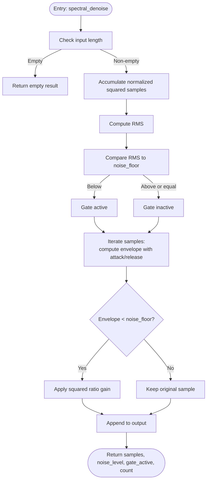
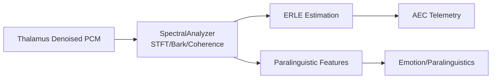
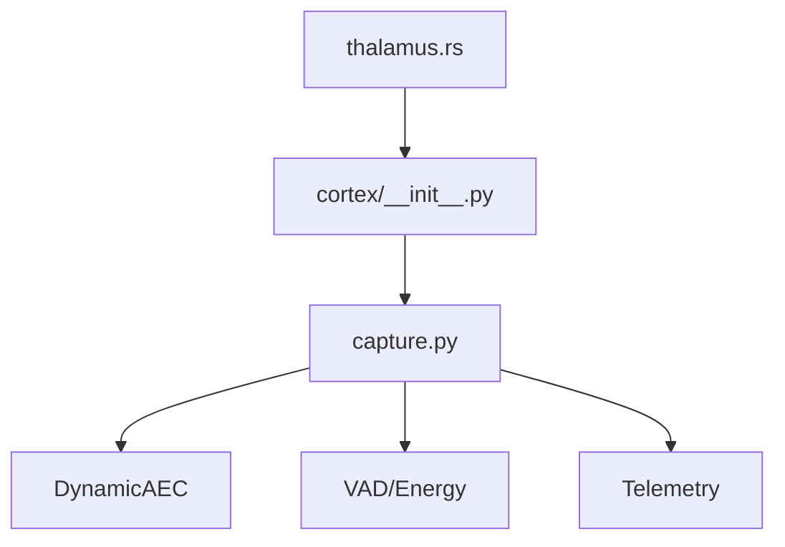

# Thalamus Spectral Denoising

<cite>
**Referenced Files in This Document**
- [thalamus.rs](file://cortex/src/thalamus.rs)
- [cochlea.rs](file://cortex/src/cochlea.rs)
- [cortex/__init__.py](file://core/audio/cortex/__init__.py)
- [capture.py](file://core/audio/capture.py)
- [spectral.py](file://core/audio/spectral.py)
- [Cargo.toml](file://cortex/Cargo.toml)
- [test_thalamic_gate_benchmark.py](file://tests/benchmarks/test_thalamic_gate_benchmark.py)
- [voice_quality_benchmark.py](file://tests/benchmarks/voice_quality_benchmark.py)
</cite>

## Table of Contents
1. [Introduction](#introduction)
2. [Project Structure](#project-structure)
3. [Core Components](#core-components)
4. [Architecture Overview](#architecture-overview)
5. [Detailed Component Analysis](#detailed-component-analysis)
6. [Dependency Analysis](#dependency-analysis)
7. [Performance Considerations](#performance-considerations)
8. [Troubleshooting Guide](#troubleshooting-guide)
9. [Conclusion](#conclusion)
10. [Appendices](#appendices)

## Introduction
This document explains the Thalamus module’s spectral noise reduction capabilities and its role in the audio pipeline. The Thalamus acts as a sensory gating and enhancement stage inspired by the brain’s thalamus: it filters out background noise and preserves meaningful signals before they reach downstream processors. In this codebase, the Thalamus currently provides a time-domain noise gate with exponential smoothing and will evolve toward full spectral subtraction in future iterations. It integrates tightly with the cochlea’s spiral buffer for efficient streaming and with the broader audio capture pipeline to improve signal-to-noise ratio for subsequent stages such as voice activity detection and echo cancellation.

## Project Structure
The Thalamus implementation spans Rust and Python layers:
- Rust layer: Provides the native spectral_denoise function exposed to Python via PyO3 and numpy interoperability.
- Python layer: Wraps the Rust function, falls back to NumPy when Rust is unavailable, and orchestrates integration into the audio capture pipeline.
- Supporting modules: Cochlea buffer for efficient streaming, spectral analysis utilities for psychoacoustic modeling, and benchmarks for latency and performance.

**Diagram sources**
- [thalamus.rs](file://cortex/src/thalamus.rs#L1-L154)
- [cochlea.rs](file://cortex/src/cochlea.rs#L1-L213)
- [cortex/__init__.py](file://core/audio/cortex/__init__.py#L1-L133)
- [capture.py](file://core/audio/capture.py#L350-L549)
- [spectral.py](file://core/audio/spectral.py#L1-L501)

**Section sources**
- [thalamus.rs](file://cortex/src/thalamus.rs#L1-L154)
- [cochlea.rs](file://cortex/src/cochlea.rs#L1-L213)
- [cortex/__init__.py](file://core/audio/cortex/__init__.py#L1-L133)
- [capture.py](file://core/audio/capture.py#L350-L549)
- [spectral.py](file://core/audio/spectral.py#L1-L501)

## Core Components
- Thalamus spectral_denoise: Implements a time-domain noise gate with RMS-based thresholding and exponential smoothing envelope shaping. It estimates the noise level, decides whether to apply gating, and returns processed samples along with metadata.
- Cochlea buffer: A high-throughput circular buffer for PCM samples, optimized for O(1) writes and contiguous reads, enabling low-latency streaming.
- Python wrapper and fallback: Attempts to import the Rust-accelerated functions and gracefully falls back to NumPy implementations when Rust is unavailable.
- Audio capture pipeline: Integrates Thalamus after AEC and before VAD, updating telemetry and state for downstream systems.

Key responsibilities:
- Noise suppression via time-domain gating with smooth attack/release.
- Signal preservation for loud speech segments.
- Lightweight metadata reporting for diagnostics and tuning.

**Section sources**
- [thalamus.rs](file://cortex/src/thalamus.rs#L25-L112)
- [cochlea.rs](file://cortex/src/cochlea.rs#L17-L136)
- [cortex/__init__.py](file://core/audio/cortex/__init__.py#L7-L23)
- [cortex/__init__.py](file://core/audio/cortex/__init__.py#L108-L132)
- [capture.py](file://core/audio/capture.py#L359-L364)

## Architecture Overview
The Thalamus sits in the audio capture pipeline after echo cancellation and before voice activity detection. It receives cleaned PCM chunks, applies spectral denoising, and passes the result downstream. The Rust module exposes a function compatible with the Python wrapper, which ensures integer PCM input and returns a dictionary of results.

**Diagram sources**
- [capture.py](file://core/audio/capture.py#L354-L364)
- [cortex/__init__.py](file://core/audio/cortex/__init__.py#L108-L117)
- [thalamus.rs](file://cortex/src/thalamus.rs#L46-L63)

**Section sources**
- [capture.py](file://core/audio/capture.py#L354-L364)
- [cortex/__init__.py](file://core/audio/cortex/__init__.py#L108-L117)
- [thalamus.rs](file://cortex/src/thalamus.rs#L46-L63)

## Detailed Component Analysis

### Thalamus spectral_denoise Implementation
The function performs:
- RMS estimation across the input PCM segment.
- Threshold comparison to decide gate activation.
- Envelope tracking with separate attack and release coefficients computed from durations and sample rate.
- Per-sample gain application when the envelope is below the noise floor, otherwise pass-through.

Processing logic highlights:
- Normalization to [-1, 1] range using the maximum int16 value.
- Exponential smoothing for smooth transitions and reduced musical noise.
- Return of metadata to support diagnostics and adaptive tuning.

**Diagram sources**
- [thalamus.rs](file://cortex/src/thalamus.rs#L66-L112)

**Section sources**
- [thalamus.rs](file://cortex/src/thalamus.rs#L46-L112)

### Integration with Cochlea’s Spectral Analysis
While the Thalamus currently operates in the time domain, the broader audio stack includes spectral analysis utilities that model psychoacoustic features (e.g., Bark bands) and coherence. These analyses inform downstream decisions such as echo cancellation performance (ERLE) and feature extraction for paralinguistic modeling. The Thalamus’ denoised output improves the signal-to-noise ratio for these computations, indirectly enhancing downstream performance.

**Diagram sources**
- [spectral.py](file://core/audio/spectral.py#L250-L384)
- [capture.py](file://core/audio/capture.py#L354-L382)

**Section sources**
- [spectral.py](file://core/audio/spectral.py#L250-L384)
- [capture.py](file://core/audio/capture.py#L354-L382)

### Parameter Configuration for Different Noise Environments
Recommended configurations derived from the implementation and pipeline:
- noise_floor: Threshold for RMS-based gating. Adjust based on ambient noise; higher values suppress more noise but risk attenuating soft speech.
- attack_ms: Gate opening speed; shorter values respond faster to onset but may increase transient artifacts.
- release_ms: Gate closing speed; longer values reduce musical noise but may leave residual noise.
- sample_rate: Must match capture pipeline framing; affects conversion of time constants to samples.

Operational guidance:
- Quiet environments: Lower noise_floor and moderate attack/release.
- Noisy environments: Higher noise_floor, longer release for smoother noise suppression.
- Speech with wide dynamic range: Shorter attack to preserve transients; longer release to minimize noise leakage.

**Section sources**
- [thalamus.rs](file://cortex/src/thalamus.rs#L31-L36)
- [thalamus.rs](file://cortex/src/thalamus.rs#L87-L90)
- [capture.py](file://core/audio/capture.py#L363-L363)

### Computational Complexity and Real-time Constraints
- Time complexity: O(N) per frame, where N is the number of PCM samples. The dominant cost is RMS accumulation and per-sample envelope updates.
- Memory complexity: O(N) for output allocation; constant additional memory for envelope and coefficients.
- Real-time constraints: The capture pipeline targets sub-millisecond processing per frame. Benchmarks validate that the Thalamic Gate stays under a 2.5 ms average target.

Optimization opportunities:
- Vectorized envelope updates (SIMD) in future Rust iterations.
- Batch processing for multiple frames to amortize fixed costs.
- Adaptive FFT sizes for spectral subtraction when implemented.

**Section sources**
- [test_thalamic_gate_benchmark.py](file://tests/benchmarks/test_thalamic_gate_benchmark.py#L85-L108)
- [voice_quality_benchmark.py](file://tests/benchmarks/voice_quality_benchmark.py#L717-L766)

### Comparative Performance with Python Spectral Processing
- Current Thalamus: Time-domain noise gate with O(N) complexity and minimal overhead.
- Python spectral utilities: Provide STFT, Bark-scale analysis, coherence, and ERLE computation—more computationally intensive but valuable for higher-level perception and echo cancellation diagnostics.
- Impact: Thalamus reduces noise before downstream stages, improving SNR for VAD, coherence estimation, and ERLE calculations.

**Section sources**
- [spectral.py](file://core/audio/spectral.py#L31-L128)
- [spectral.py](file://core/audio/spectral.py#L250-L384)
- [capture.py](file://core/audio/capture.py#L354-L382)

## Dependency Analysis
The Thalamus depends on:
- PyO3 and numpy for Python interoperability.
- The Python wrapper for seamless fallback behavior.
- Integration with the capture pipeline for timing and telemetry.

**Diagram sources**
- [thalamus.rs](file://cortex/src/thalamus.rs#L22-L23)
- [cortex/__init__.py](file://core/audio/cortex/__init__.py#L7-L23)
- [capture.py](file://core/audio/capture.py#L354-L382)

**Section sources**
- [thalamus.rs](file://cortex/src/thalamus.rs#L22-L23)
- [cortex/__init__.py](file://core/audio/cortex/__init__.py#L7-L23)
- [capture.py](file://core/audio/capture.py#L354-L382)

## Performance Considerations
- Latency targets: Sub-2.5 ms average per frame for the Thalamic Gate.
- Throughput: Frame sizes typical in the pipeline (e.g., 512–1600 samples) should remain comfortably within budget.
- Power profile: Time-domain gating is lightweight; future spectral subtraction will require careful FFT/IFFT scheduling.
- Robustness: Ensure thresholds and envelopes adapt to changing conditions to avoid over-suppression or residual noise.

[No sources needed since this section provides general guidance]

## Troubleshooting Guide
Common issues and remedies:
- No Rust module available: The Python wrapper detects missing Rust and falls back to NumPy. Verify installation and build of the Rust library.
- Incorrect sample format: The Rust function expects int16 PCM; ensure upstream conversions are correct.
- Excessive noise suppression: Increase noise_floor or adjust attack/release parameters.
- Musical noise or gating artifacts: Increase release_ms or reduce aggressive gain application.
- Benchmark failures: Confirm hardware and driver latency; re-run benchmarks to validate improvements.

**Section sources**
- [cortex/__init__.py](file://core/audio/cortex/__init__.py#L7-L23)
- [cortex/__init__.py](file://core/audio/cortex/__init__.py#L115-L117)
- [test_thalamic_gate_benchmark.py](file://tests/benchmarks/test_thalamic_gate_benchmark.py#L85-L108)

## Conclusion
The Thalamus module introduces a practical, low-latency noise gating stage that improves audio quality by reducing background noise and preserving speech. Its integration with the capture pipeline and the broader spectral analysis toolkit positions it to enhance downstream performance. As a stepping stone toward full spectral subtraction, the current implementation establishes a solid foundation for real-time, perceptually informed noise reduction.

[No sources needed since this section summarizes without analyzing specific files]

## Appendices

### API Surface and Return Values
- Function: spectral_denoise(audio: ndarray, noise_floor: float)
- Returns: dict with keys:
  - samples: int16 PCM samples (processed)
  - noise_level: RMS estimate used for gating
  - gate_active: boolean indicating if gating was applied
  - sample_count: number of samples processed

**Section sources**
- [cortex/__init__.py](file://core/audio/cortex/__init__.py#L108-L132)
- [thalamus.rs](file://cortex/src/thalamus.rs#L46-L63)

### Build and Runtime Notes
- Release profile enables aggressive optimization and link-time optimization for the Rust library.
- Ensure the Python environment can load the compiled cdylib when deploying.

**Section sources**
- [Cargo.toml](file://cortex/Cargo.toml#L16-L20)