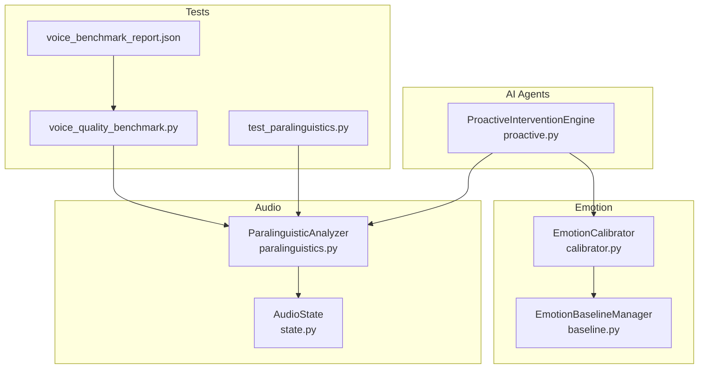
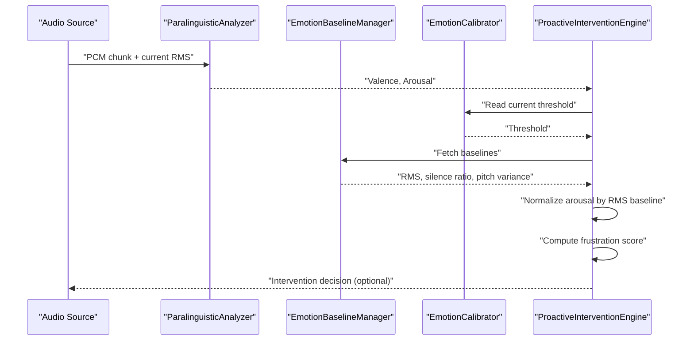
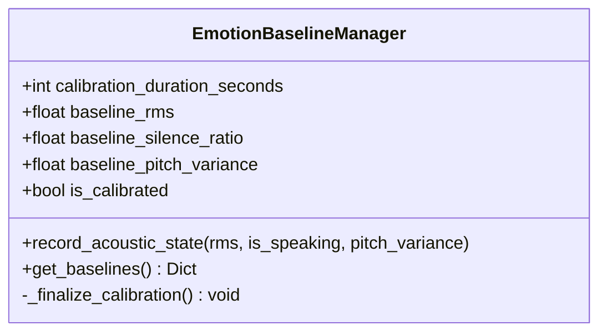
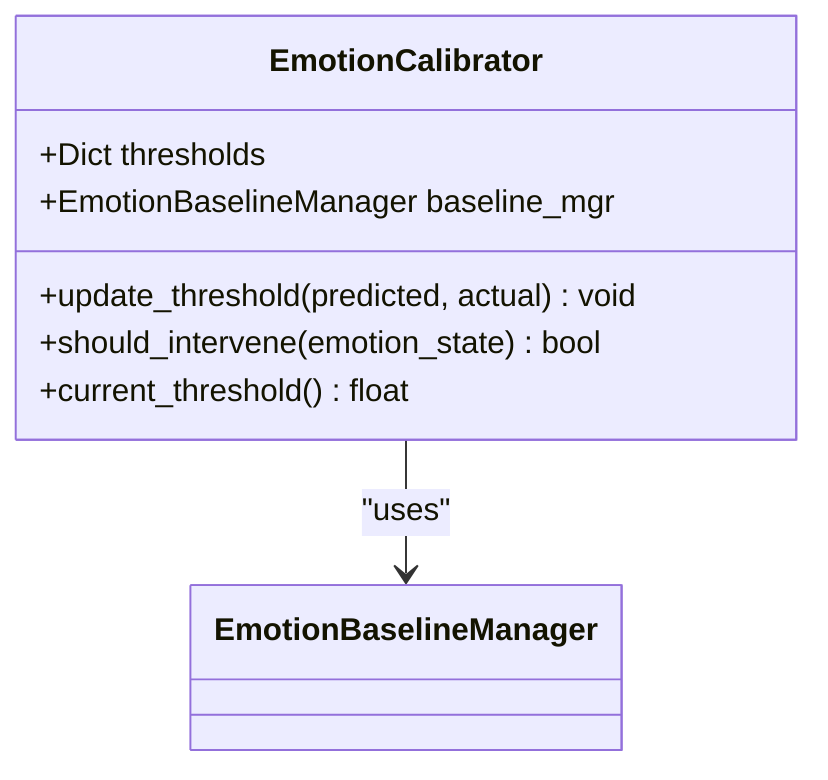
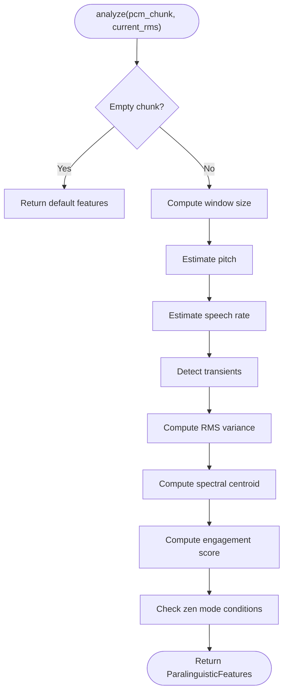
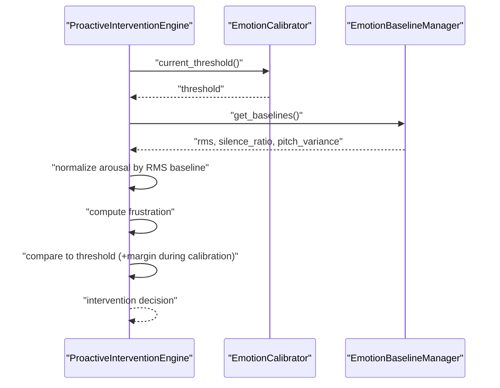
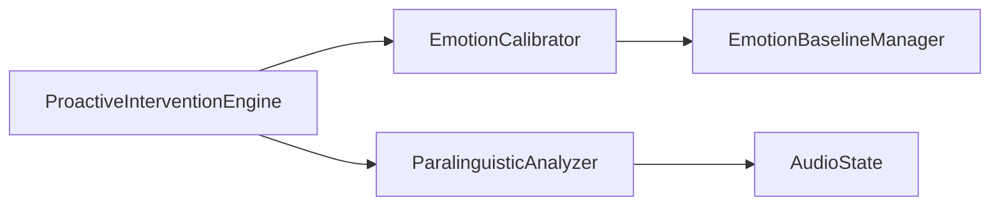

# Emotional Baseline Detection

<cite>
**Referenced Files in This Document**
- [baseline.py](file://core/emotion/baseline.py)
- [calibrator.py](file://core/emotion/calibrator.py)
- [paralinguistics.py](file://core/audio/paralinguistics.py)
- [proactive.py](file://core/ai/agents/proactive.py)
- [state.py](file://core/audio/state.py)
- [voice_benchmark_report.json](file://tests/benchmarks/voice_benchmark_report.json)
- [voice_quality_benchmark.py](file://tests/benchmarks/voice_quality_benchmark.py)
- [test_paralinguistics.py](file://tests/unit/test_paralinguistics.py)
- [aether_runtime_config.json.bak](file://aether_runtime_config.json.bak)
</cite>

## Table of Contents
1. [Introduction](#introduction)
2. [Project Structure](#project-structure)
3. [Core Components](#core-components)
4. [Architecture Overview](#architecture-overview)
5. [Detailed Component Analysis](#detailed-component-analysis)
6. [Dependency Analysis](#dependency-analysis)
7. [Performance Considerations](#performance-considerations)
8. [Troubleshooting Guide](#troubleshooting-guide)
9. [Conclusion](#conclusion)
10. [Appendices](#appendices)

## Introduction
This document describes the emotional baseline detection system that establishes individual user emotional profiles and tracks baseline emotional states over time. It explains how acoustic metrics are collected during a calibration window, how baselines are computed and applied to normalize emotion scores, and how adaptive thresholds learn from user feedback. It also covers the temporal analysis of paralinguistic features, the integration with the broader emotion analysis pipeline, and practical guidance for configuration, calibration, and troubleshooting.

## Project Structure
The emotional baseline system spans three main areas:
- Emotion baseline management and calibration
- Paralinguistic feature extraction from audio
- Proactive intervention logic that consumes valence/arousal and applies baselines and thresholds

**Diagram sources**
- [baseline.py](file://core/emotion/baseline.py#L9-L87)
- [calibrator.py](file://core/emotion/calibrator.py#L8-L65)
- [paralinguistics.py](file://core/audio/paralinguistics.py#L31-L214)
- [proactive.py](file://core/ai/agents/proactive.py#L10-L125)
- [state.py](file://core/audio/state.py#L36-L129)
- [test_paralinguistics.py](file://tests/unit/test_paralinguistics.py#L1-L86)
- [voice_quality_benchmark.py](file://tests/benchmarks/voice_quality_benchmark.py#L547-L666)
- [voice_benchmark_report.json](file://tests/benchmarks/voice_benchmark_report.json#L78-L106)

**Section sources**
- [baseline.py](file://core/emotion/baseline.py#L1-L87)
- [calibrator.py](file://core/emotion/calibrator.py#L1-L65)
- [paralinguistics.py](file://core/audio/paralinguistics.py#L1-L214)
- [proactive.py](file://core/ai/agents/proactive.py#L1-L125)
- [state.py](file://core/audio/state.py#L1-L129)
- [test_paralinguistics.py](file://tests/unit/test_paralinguistics.py#L1-L86)
- [voice_quality_benchmark.py](file://tests/benchmarks/voice_quality_benchmark.py#L547-L666)
- [voice_benchmark_report.json](file://tests/benchmarks/voice_benchmark_report.json#L78-L106)

## Core Components
- EmotionBaselineManager: Maintains a calibration window and computes RMS, silence ratio, and pitch variance baselines from acoustic snapshots.
- EmotionCalibrator: Learns adaptive thresholds for intervention based on user feedback and uses baselines to adjust sensitivity.
- ParalinguisticAnalyzer: Extracts pitch, speech rate, RMS variance, spectral centroid, engagement, and zen mode from PCM chunks.
- ProactiveInterventionEngine: Computes frustration from valence/arousal, normalizes by baselines, and decides whether to intervene using calibrated thresholds.

**Section sources**
- [baseline.py](file://core/emotion/baseline.py#L9-L87)
- [calibrator.py](file://core/emotion/calibrator.py#L8-L65)
- [paralinguistics.py](file://core/audio/paralinguistics.py#L19-L214)
- [proactive.py](file://core/ai/agents/proactive.py#L10-L125)

## Architecture Overview
The system operates in two stages:
- Calibration stage: During the first N seconds, acoustic snapshots are recorded and averaged to form baselines.
- Operational stage: Real-time valence/arousal feeds into the proactive engine, which normalizes arousal against the RMS baseline and compares the frustration score to the learned threshold.

**Diagram sources**
- [paralinguistics.py](file://core/audio/paralinguistics.py#L132-L214)
- [baseline.py](file://core/emotion/baseline.py#L77-L87)
- [calibrator.py](file://core/emotion/calibrator.py#L51-L65)
- [proactive.py](file://core/ai/agents/proactive.py#L30-L83)

## Detailed Component Analysis

### EmotionBaselineManager
Responsibilities:
- Manage a fixed-duration calibration window.
- Record acoustic snapshots (RMS, speaking flag, pitch variance).
- Compute and persist baselines upon completion.
- Provide default baselines until calibration is finalized.

Key behaviors:
- Calibration window length is configurable.
- Metrics history is bounded to support streaming updates.
- On completion, averages are computed and flags calibration as ready.
- Until calibrated, default baselines are returned.

**Diagram sources**
- [baseline.py](file://core/emotion/baseline.py#L9-L87)

**Section sources**
- [baseline.py](file://core/emotion/baseline.py#L9-L87)

### EmotionCalibrator
Responsibilities:
- Maintain a dynamic threshold for intervention.
- Learn from manual triggers and user corrections to adapt sensitivity.
- Adjust threshold during the calibration window to be stricter initially.

Key behaviors:
- Threshold is multiplied by a factor depending on prediction correctness.
- Clamps threshold to a safe range.
- During calibration, adds a strictness margin to the threshold.
- Provides current threshold and a property to access the baseline manager.

**Diagram sources**
- [calibrator.py](file://core/emotion/calibrator.py#L8-L65)

**Section sources**
- [calibrator.py](file://core/emotion/calibrator.py#L8-L65)

### ParalinguisticAnalyzer
Responsibilities:
- Extract core paralinguistic features from PCM audio chunks.
- Maintain rolling windows for temporal analysis.
- Detect transient events (e.g., typing) to infer focus states.

Key behaviors:
- Estimates pitch via autocorrelation and filters out implausible ranges.
- Computes speech rate from envelope peaks.
- Tracks RMS variance over a rolling window to measure expressiveness.
- Computes spectral centroid for brightness.
- Produces an engagement score and a zen mode flag based on thresholds.

**Diagram sources**
- [paralinguistics.py](file://core/audio/paralinguistics.py#L132-L214)

**Section sources**
- [paralinguistics.py](file://core/audio/paralinguistics.py#L31-L214)

### ProactiveInterventionEngine
Responsibilities:
- Convert valence/arousal into a frustration score.
- Normalize arousal using the RMS baseline to reduce false positives from ambient noise.
- Decide whether to intervene based on the learned threshold and cooldown.

Key behaviors:
- Deep frustration overrides (strong negative valence).
- Baseline normalization reduces arousal contribution below a noise floor.
- Uses calibrated threshold and a strictness margin during calibration.
- Enforces a cooldown period between interventions.

**Diagram sources**
- [proactive.py](file://core/ai/agents/proactive.py#L30-L83)
- [calibrator.py](file://core/emotion/calibrator.py#L51-L65)
- [baseline.py](file://core/emotion/baseline.py#L77-L87)

**Section sources**
- [proactive.py](file://core/ai/agents/proactive.py#L10-L125)

## Dependency Analysis
- ProactiveInterventionEngine depends on EmotionCalibrator for threshold and on EmotionBaselineManager for baselines.
- EmotionCalibrator depends on EmotionBaselineManager for calibration state and baselines.
- ParalinguisticAnalyzer produces features consumed by the proactive engine.
- AudioState provides shared audio telemetry and state used by audio processing.

**Diagram sources**
- [proactive.py](file://core/ai/agents/proactive.py#L10-L125)
- [calibrator.py](file://core/emotion/calibrator.py#L8-L65)
- [baseline.py](file://core/emotion/baseline.py#L9-L87)
- [paralinguistics.py](file://core/audio/paralinguistics.py#L31-L214)
- [state.py](file://core/audio/state.py#L36-L129)

**Section sources**
- [proactive.py](file://core/ai/agents/proactive.py#L10-L125)
- [calibrator.py](file://core/emotion/calibrator.py#L8-L65)
- [baseline.py](file://core/emotion/baseline.py#L9-L87)
- [paralinguistics.py](file://core/audio/paralinguistics.py#L31-L214)
- [state.py](file://core/audio/state.py#L36-L129)

## Performance Considerations
- Calibration window duration trades off responsiveness versus stability; shorter windows adapt faster but may be noisy.
- Rolling windows for temporal features balance responsiveness and stability; larger windows smooth estimates but add latency.
- Threshold adaptation uses multiplicative adjustments with clipping to maintain stability under feedback.
- Baseline normalization prevents false positives from ambient noise by scaling arousal against RMS baseline.

[No sources needed since this section provides general guidance]

## Troubleshooting Guide
Common issues and resolutions:
- Baseline not yet established:
  - Symptom: Strict intervention threshold during early sessions.
  - Action: Allow the calibration window to complete; ensure sufficient audio frames are recorded.
  - Evidence: The calibration window is configured and the manager logs completion.
- Low arousal in quiet environments causing missed frustration:
  - Symptom: Interventions not triggering when user is calm but frustrated.
  - Action: Verify RMS baseline reflects ambient noise; ensure arousal normalization is applied.
  - Evidence: The proactive engine normalizes arousal below a noise floor derived from RMS baseline.
- Frequent false positives due to ambient noise:
  - Symptom: Interventions firing in quiet rooms.
  - Action: Increase the noise floor threshold multiplier or widen the calibration window.
  - Evidence: The proactive engine scales arousal when below baseline-derived noise floor.
- Threshold drift over time:
  - Symptom: Threshold becomes too sensitive or too lenient.
  - Action: Provide manual feedback to the calibrator to re-learn appropriate sensitivity.
  - Evidence: The calibrator adjusts thresholds based on predicted vs. actual intervention events.

**Section sources**
- [baseline.py](file://core/emotion/baseline.py#L32-L75)
- [proactive.py](file://core/ai/agents/proactive.py#L30-L83)
- [calibrator.py](file://core/emotion/calibrator.py#L26-L65)

## Conclusion
The emotional baseline detection system combines a short-term acoustic calibration with adaptive threshold learning to produce robust, user-specific emotional interpretations. Paralinguistic feature extraction provides the inputs, baselines normalize for individual acoustic characteristics, and the proactive engine balances sensitivity with stability using feedback-driven threshold tuning.

[No sources needed since this section summarizes without analyzing specific files]

## Appendices

### Configuration Options
- Calibration window duration:
  - Configure the baseline manager’s calibration window to balance responsiveness and stability.
  - Reference: [baseline.py](file://core/emotion/baseline.py#L16-L30)
- Intervention cooldown:
  - Set the minimum interval between interventions to avoid over-interruption.
  - Reference: [proactive.py](file://core/ai/agents/proactive.py#L16-L20)
- Threshold adaptation parameters:
  - Multipliers and bounds for threshold adjustment.
  - Reference: [calibrator.py](file://core/emotion/calibrator.py#L26-L65)
- Zen mode and engagement thresholds:
  - Tunable parameters for transient detection and focus inference.
  - Reference: [paralinguistics.py](file://core/audio/paralinguistics.py#L37-L44), [paralinguistics.py](file://core/audio/paralinguistics.py#L195-L204)

### Privacy and Security Notes
- Baseline data is computed locally and not persisted beyond the session.
- No personal identifiers are stored with baseline metrics.
- Audio processing occurs on-device; no raw PCM is persisted.

[No sources needed since this section provides general guidance]

### Integration with Emotion Pipeline
- Valence/arousal inputs are produced by upstream audio analysis and fed into the proactive engine.
- Paralinguistic features inform both intervention decisions and engagement metrics.
- Audio state telemetry supports AEC and echo cancellation, indirectly improving baseline quality.

**Section sources**
- [paralinguistics.py](file://core/audio/paralinguistics.py#L132-L214)
- [state.py](file://core/audio/state.py#L36-L129)

### Validation and Benchmarks
- Emotion detection F1-score and VAD accuracy benchmarks demonstrate system capability.
- Unit tests validate paralinguistic feature extraction under controlled conditions.

**Section sources**
- [voice_benchmark_report.json](file://tests/benchmarks/voice_benchmark_report.json#L78-L106)
- [voice_quality_benchmark.py](file://tests/benchmarks/voice_quality_benchmark.py#L547-L666)
- [test_paralinguistics.py](file://tests/unit/test_paralinguistics.py#L1-L86)