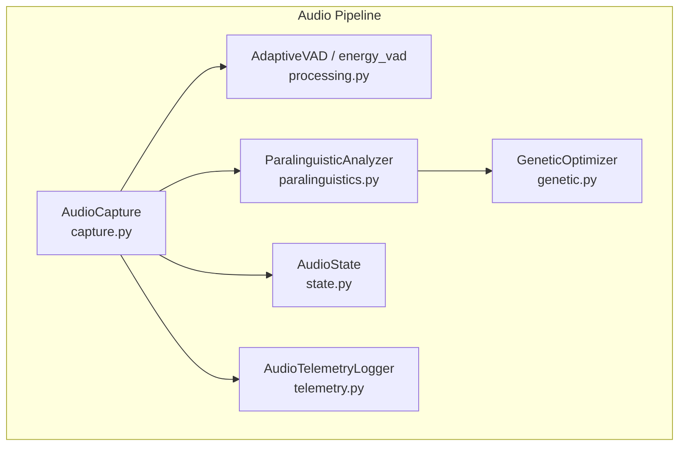
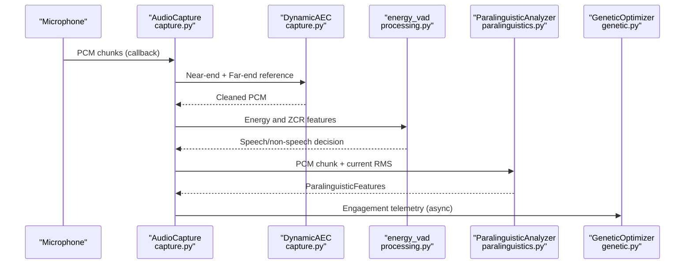
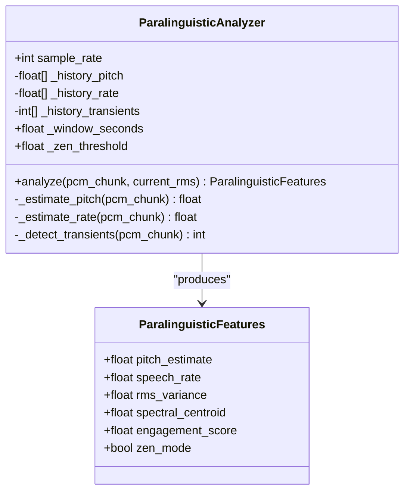
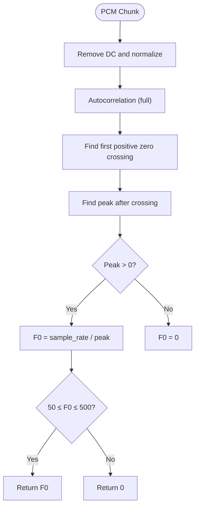
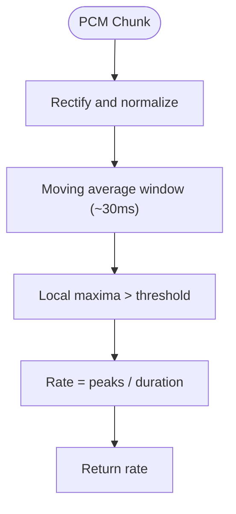
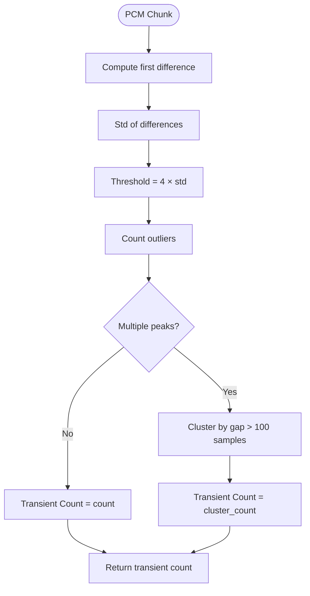
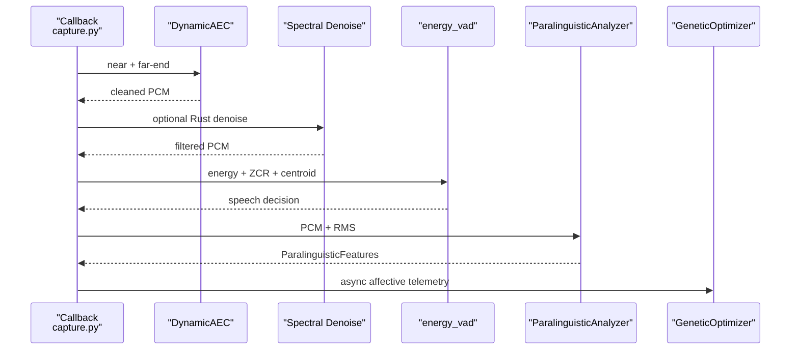
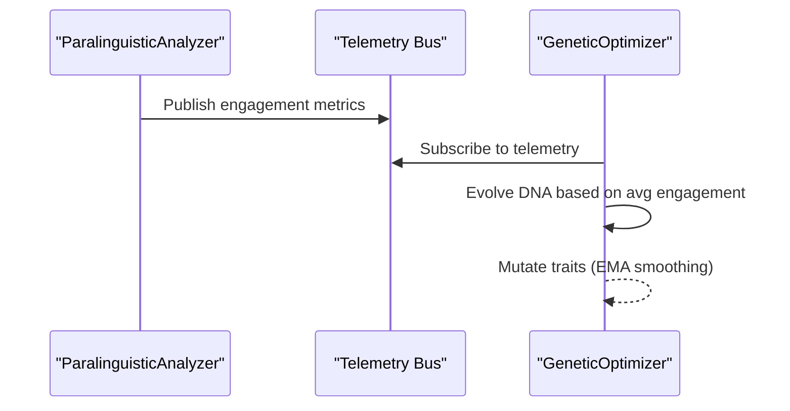
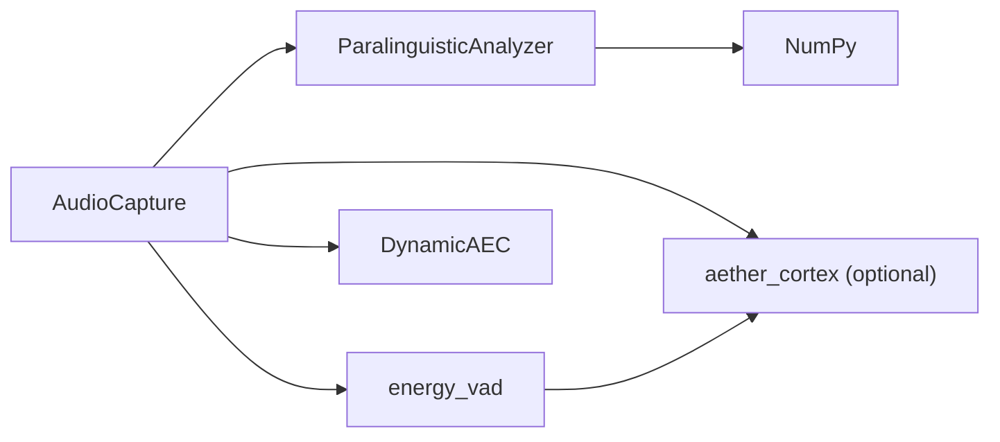

# Paralinguistic Feature Extraction

<cite>
**Referenced Files in This Document**
- [paralinguistics.py](file://core/audio/paralinguistics.py)
- [test_paralinguistics.py](file://tests/unit/test_paralinguistics.py)
- [processing.py](file://core/audio/processing.py)
- [capture.py](file://core/audio/capture.py)
- [genetic.py](file://core/ai/genetic.py)
- [config.py](file://core/infra/config.py)
- [telemetry.py](file://core/audio/telemetry.py)
- [state.py](file://core/audio/state.py)
- [cortex/__init__.py](file://core/audio/cortex/__init__.py)
- [pcm-processor.js](file://apps/portal/public/pcm-processor.js)
</cite>

## Table of Contents
1. [Introduction](#introduction)
2. [Project Structure](#project-structure)
3. [Core Components](#core-components)
4. [Architecture Overview](#architecture-overview)
5. [Detailed Component Analysis](#detailed-component-analysis)
6. [Dependency Analysis](#dependency-analysis)
7. [Performance Considerations](#performance-considerations)
8. [Troubleshooting Guide](#troubleshooting-guide)
9. [Conclusion](#conclusion)
10. [Appendices](#appendices)

## Introduction
This document describes the paralinguistic feature extraction system that analyzes non-verbal speech cues from PCM audio chunks to infer user engagement and mental state. It covers the ParalinguisticFeatures data class and ParalinguisticAnalyzer implementation, the four core features (pitch estimation via autocorrelation, speech rate via envelope peak counting, RMS variance for energy variability, and spectral centroid for voice brightness), the transient detection algorithm for typing and keyboard clicks, the real-time processing pipeline with sub-5ms processing targets, the engagement scoring algorithm, configuration options, and the historical tracking system that feeds the genetic optimizer’s fitness feedback loop.

## Project Structure
The paralinguistic system spans several modules:
- Feature extraction and scoring: core/audio/paralinguistics.py
- Audio capture and gating: core/audio/capture.py
- VAD and silence classification: core/audio/processing.py
- Genetic optimizer and affective feedback: core/ai/genetic.py
- Runtime configuration: core/infra/config.py
- Telemetry and metrics: core/audio/telemetry.py
- Shared audio state: core/audio/state.py
- Rust acceleration bridge: core/audio/cortex/__init__.py
- Web worker PCM encoder: apps/portal/public/pcm-processor.js

**Diagram sources**
- [capture.py](file://core/audio/capture.py#L193-L509)
- [processing.py](file://core/audio/processing.py#L256-L507)
- [paralinguistics.py](file://core/audio/paralinguistics.py#L31-L213)
- [genetic.py](file://core/ai/genetic.py#L81-L182)
- [state.py](file://core/audio/state.py#L36-L128)
- [telemetry.py](file://core/audio/telemetry.py#L151-L394)

**Section sources**
- [paralinguistics.py](file://core/audio/paralinguistics.py#L1-L214)
- [processing.py](file://core/audio/processing.py#L1-L508)
- [capture.py](file://core/audio/capture.py#L1-L575)
- [genetic.py](file://core/ai/genetic.py#L1-L195)
- [config.py](file://core/infra/config.py#L11-L44)
- [telemetry.py](file://core/audio/telemetry.py#L1-L441)
- [state.py](file://core/audio/state.py#L1-L129)
- [cortex/__init__.py](file://core/audio/cortex/__init__.py#L1-L133)
- [pcm-processor.js](file://apps/portal/public/pcm-processor.js#L31-L81)

## Core Components
- ParalinguisticFeatures: A data class encapsulating the four core features plus engagement and zen mode flag.
- ParalinguisticAnalyzer: Extracts and scores features from PCM chunks, maintains rolling histories, and computes engagement.

Key behaviors:
- Sub-5ms processing focus for zero-friction real-time operation.
- Rolling windows for temporal stability (default 2-second window).
- Zen mode detection combining RMS, pitch, and transient rate.

**Section sources**
- [paralinguistics.py](file://core/audio/paralinguistics.py#L19-L29)
- [paralinguistics.py](file://core/audio/paralinguistics.py#L31-L44)
- [paralinguistics.py](file://core/audio/paralinguistics.py#L132-L213)

## Architecture Overview
The real-time pipeline integrates capture, gating, VAD, paralinguistic analysis, and genetic optimization:

**Diagram sources**
- [capture.py](file://core/audio/capture.py#L329-L509)
- [processing.py](file://core/audio/processing.py#L389-L507)
- [paralinguistics.py](file://core/audio/paralinguistics.py#L132-L213)
- [genetic.py](file://core/ai/genetic.py#L91-L148)

## Detailed Component Analysis

### ParalinguisticFeatures Data Class
- Fields: pitch_estimate, speech_rate, rms_variance, spectral_centroid, engagement_score, zen_mode.
- Purpose: Unified container for affective metrics and engagement score.

**Section sources**
- [paralinguistics.py](file://core/audio/paralinguistics.py#L19-L29)

### ParalinguisticAnalyzer
- Responsibilities:
  - Estimate pitch via autocorrelation.
  - Estimate speech rate via envelope peak counting.
  - Compute RMS variance from historical pitch.
  - Compute spectral centroid.
  - Score engagement and detect zen mode.
  - Maintain rolling histories for temporal stability.

Processing logic highlights:
- Pitch estimation: autocorrelation of normalized, zero-mean signal; peak after first zero crossing; human-range filter.
- Rate estimation: rectified and smoothed envelope; local maxima detection; syllable-rate normalization.
- RMS variance: variance of historical pitch estimates.
- Spectral centroid: weighted average of frequency bins.
- Engagement scoring: base score adjusted by pitch, centroid, variance, and rate thresholds.
- Zen mode: triggered by low RMS, low pitch, and elevated transient rate.

**Diagram sources**
- [paralinguistics.py](file://core/audio/paralinguistics.py#L19-L29)
- [paralinguistics.py](file://core/audio/paralinguistics.py#L31-L44)
- [paralinguistics.py](file://core/audio/paralinguistics.py#L132-L213)

**Section sources**
- [paralinguistics.py](file://core/audio/paralinguistics.py#L31-L213)

### Four Core Features

#### Pitch Estimation via Autocorrelation
- Normalizes input and removes DC offset.
- Computes autocorrelation and finds the first positive zero crossing.
- Locates the peak after the first zero crossing to estimate period.
- Converts period to Hz and applies human speech range filtering.

**Diagram sources**
- [paralinguistics.py](file://core/audio/paralinguistics.py#L68-L98)

**Section sources**
- [paralinguistics.py](file://core/audio/paralinguistics.py#L68-L98)

#### Speech Rate via Envelope Peak Counting
- Rectifies and smooths the absolute signal to form an envelope.
- Detects local maxima above a noise threshold.
- Normalizes peak count by frame duration to obtain rate.

**Diagram sources**
- [paralinguistics.py](file://core/audio/paralinguistics.py#L100-L130)

**Section sources**
- [paralinguistics.py](file://core/audio/paralinguistics.py#L100-L130)

#### RMS Variance for Energy Variability
- Maintains a rolling history of pitch estimates.
- Computes variance of pitch history to quantify expressiveness.

**Section sources**
- [paralinguistics.py](file://core/audio/paralinguistics.py#L166-L170)

#### Spectral Centroid for Voice Brightness
- Computes FFT of normalized PCM.
- Calculates centroid as the weighted average of frequencies by magnitude.

**Section sources**
- [paralinguistics.py](file://core/audio/paralinguistics.py#L172-L176)

### Transient Detection for Typing and Keyboard Clicks
- Approximates high-pass filtering via first difference of PCM.
- Computes standard deviation of differences.
- Counts outliers beyond a threshold and clusters separated peaks.
- Tracks transient counts in a rolling window.

**Diagram sources**
- [paralinguistics.py](file://core/audio/paralinguistics.py#L45-L66)

**Section sources**
- [paralinguistics.py](file://core/audio/paralinguistics.py#L45-L66)

### Engagement Scoring Algorithm
- Base engagement starts at a neutral value and is boosted by:
  - High pitch (> threshold).
  - High spectral centroid (> threshold).
  - High RMS variance (> threshold).
  - Elevated speech rate (> threshold).
- Clamped to [0.0, 1.0].

**Section sources**
- [paralinguistics.py](file://core/audio/paralinguistics.py#L178-L193)

### Zen Mode Detection
- Triggered when:
  - Current RMS is low.
  - Pitch is low.
  - Transient rate exceeds a threshold.
- Indicates deep focus or typing cadence.

**Section sources**
- [paralinguistics.py](file://core/audio/paralinguistics.py#L195-L204)

### Historical Tracking System
- Rolling windows maintain recent pitch, rate, and transient counts.
- Window size adapts to frame duration with a minimum bound.
- Enables variance calculations and transient rate estimation.

**Section sources**
- [paralinguistics.py](file://core/audio/paralinguistics.py#L140-L164)

### Real-Time Processing Pipeline
- AudioCapture runs a high-priority callback to:
  - Apply Dynamic AEC and optional Rust spectral denoise.
  - Gate microphone based on AI state and leakage detection.
  - Run VAD and classify silence types.
  - Invoke ParalinguisticAnalyzer when appropriate and forward features to the genetic optimizer asynchronously.
- The pipeline targets sub-5ms processing per chunk for zero-friction operation.

**Diagram sources**
- [capture.py](file://core/audio/capture.py#L329-L509)
- [processing.py](file://core/audio/processing.py#L389-L507)
- [paralinguistics.py](file://core/audio/paralinguistics.py#L132-L213)
- [genetic.py](file://core/ai/genetic.py#L91-L148)

**Section sources**
- [capture.py](file://core/audio/capture.py#L329-L509)
- [processing.py](file://core/audio/processing.py#L389-L507)
- [paralinguistics.py](file://core/audio/paralinguistics.py#L132-L213)
- [genetic.py](file://core/ai/genetic.py#L91-L148)

### Genetic Optimizer Fitness Feedback Loop
- The genetic optimizer consumes affective telemetry (e.g., average engagement) to mutate agent DNA traits.
- Mid-session hot mutations adjust traits like verbosity, empathy, and proactivity based on real-time paralinguistic triggers.

**Diagram sources**
- [paralinguistics.py](file://core/audio/paralinguistics.py#L178-L193)
- [genetic.py](file://core/ai/genetic.py#L91-L148)
- [genetic.py](file://core/ai/genetic.py#L150-L182)

**Section sources**
- [genetic.py](file://core/ai/genetic.py#L53-L78)
- [genetic.py](file://core/ai/genetic.py#L91-L182)

## Dependency Analysis
- ParalinguisticAnalyzer depends on NumPy for numerical operations.
- AudioCapture orchestrates AEC, VAD, and paralinguistic analysis, emitting affective features to the genetic optimizer.
- Rust acceleration (aether_cortex) is conditionally used for VAD and denoise when available.

**Diagram sources**
- [paralinguistics.py](file://core/audio/paralinguistics.py#L13-L14)
- [capture.py](file://core/audio/capture.py#L23-L29)
- [processing.py](file://core/audio/processing.py#L40-L95)
- [cortex/__init__.py](file://core/audio/cortex/__init__.py#L7-L23)

**Section sources**
- [paralinguistics.py](file://core/audio/paralinguistics.py#L13-L14)
- [capture.py](file://core/audio/capture.py#L23-L29)
- [processing.py](file://core/audio/processing.py#L40-L95)
- [cortex/__init__.py](file://core/audio/cortex/__init__.py#L7-L23)

## Performance Considerations
- Sub-5ms processing target: The analyzer avoids heavy allocations and leverages NumPy vectorization.
- Rust-first acceleration: When available, VAD and denoise are executed in Rust for significant speedup.
- Minimal allocations in hot paths: Callbacks avoid async operations and heavy work; complex analysis is deferred to the asyncio loop.
- Queue sizing: Small queues bound latency and prevent backlog growth.

[No sources needed since this section provides general guidance]

## Troubleshooting Guide
Common issues and checks:
- Empty or short PCM chunks: Analyzer returns safe defaults (zero pitch, neutral engagement).
- Very short frames: Rate estimation requires sufficient samples; short frames return zero.
- Edge cases: Tests validate behavior on zero-amplitude and maximum-amplitude inputs.

**Section sources**
- [test_paralinguistics.py](file://tests/unit/test_paralinguistics.py#L72-L86)
- [paralinguistics.py](file://core/audio/paralinguistics.py#L136-L137)
- [paralinguistics.py](file://core/audio/paralinguistics.py#L102-L103)

## Conclusion
The paralinguistic feature extraction system provides a compact, efficient, and robust foundation for real-time affective sensing. By combining pitch, rate, energy variability, and spectral brightness with transient detection and zen mode awareness, it produces a unified engagement score suitable for genetic optimization. The design emphasizes sub-5ms processing, zero-friction operation, and seamless integration with the broader audio pipeline and AI evolution loop.

## Appendices

### Configuration Options
- AudioConfig (core/infra/config.py):
  - Sample rates: send_sample_rate, receive_sample_rate
  - Chunk size and queue limits
  - VAD thresholds and window size
  - Jitter buffer parameters
  - AEC parameters (step size, filter length, convergence threshold)
- ParalinguisticAnalyzer:
  - sample_rate constructor argument
  - _window_seconds (default 2.0)
  - _zen_threshold (default 2.5)

**Section sources**
- [config.py](file://core/infra/config.py#L11-L44)
- [paralinguistics.py](file://core/audio/paralinguistics.py#L37-L44)

### Web Worker PCM Encoding
- The web portal encodes PCM frames in a Web Worker, converting Float32 to Int16 and posting buffers to the main thread for processing.

**Section sources**
- [pcm-processor.js](file://apps/portal/public/pcm-processor.js#L31-L81)