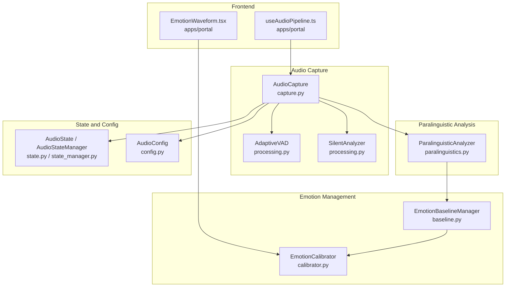
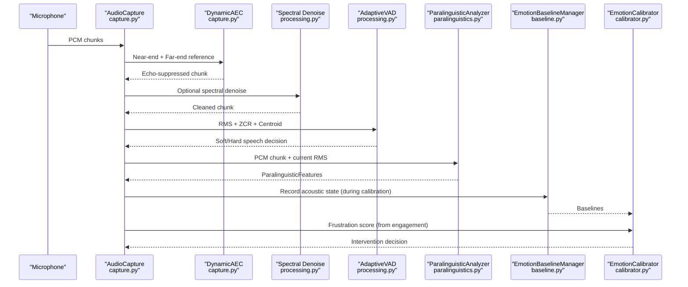
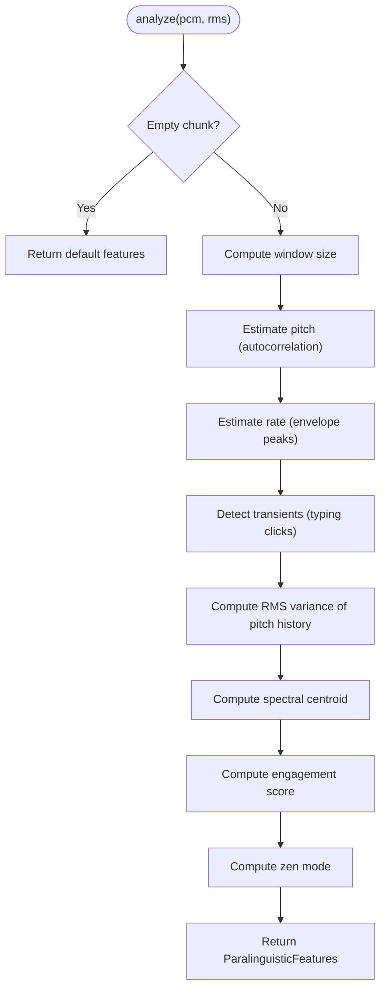
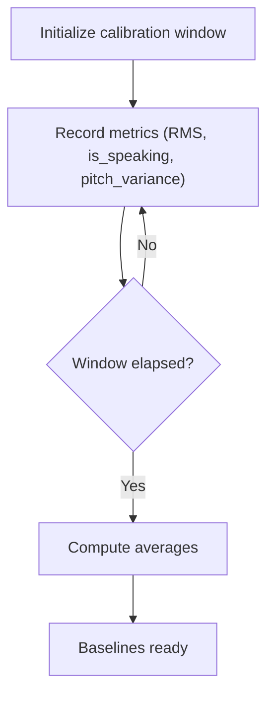
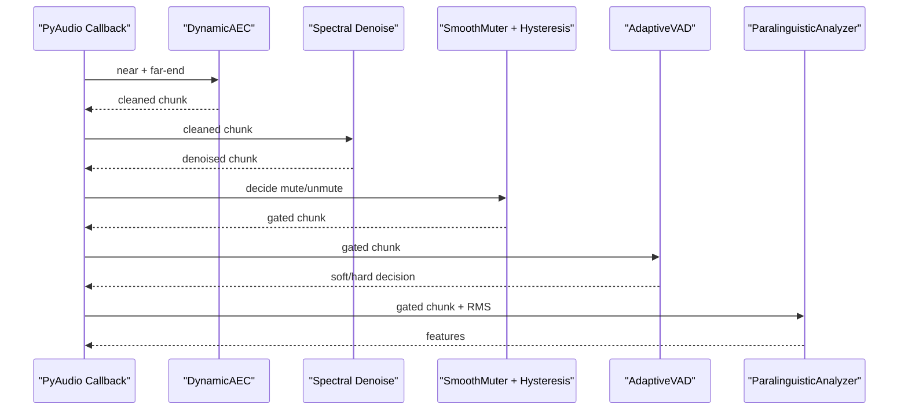
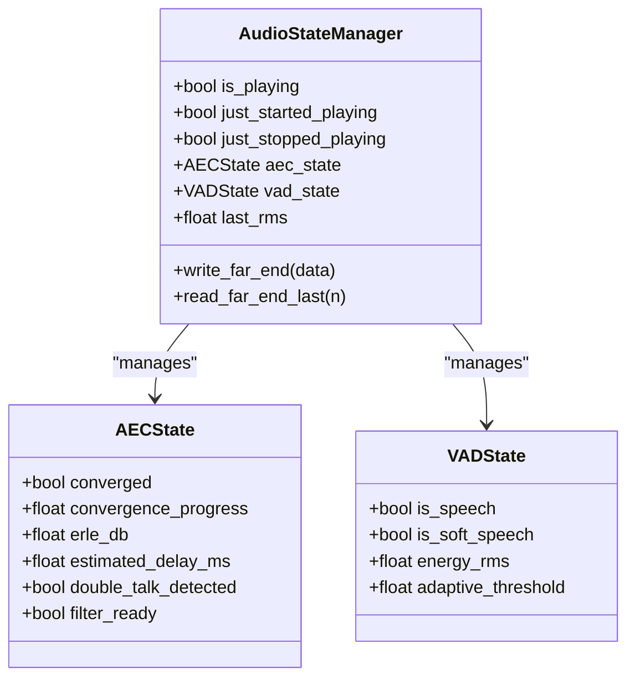
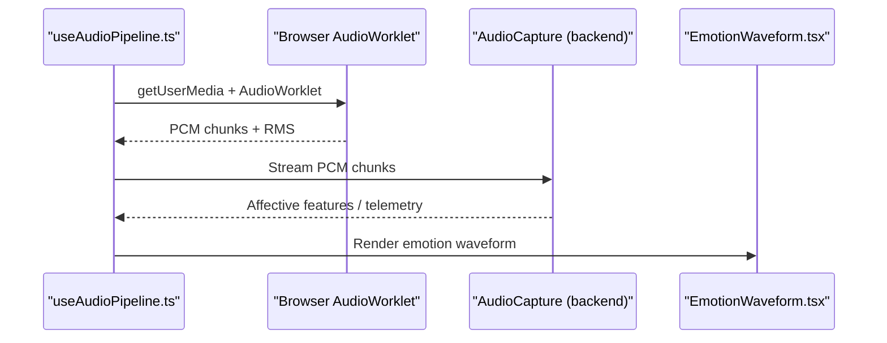
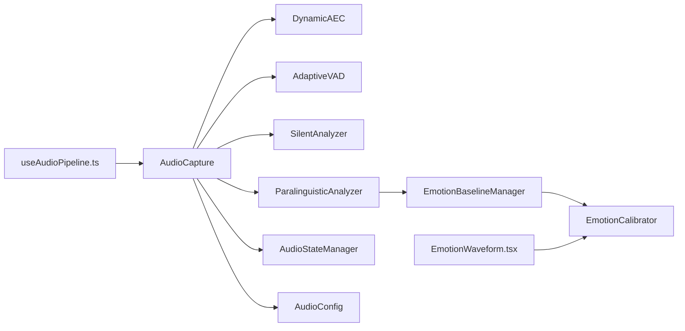

# Paralinguistic and Emotional State Analysis

<cite>
**Referenced Files in This Document**
- [paralinguistics.py](file://core/audio/paralinguistics.py)
- [baseline.py](file://core/emotion/baseline.py)
- [calibrator.py](file://core/emotion/calibrator.py)
- [capture.py](file://core/audio/capture.py)
- [processing.py](file://core/audio/processing.py)
- [state.py](file://core/audio/state.py)
- [state_manager.py](file://core/audio/state_manager.py)
- [vad.py](file://core/audio/vad.py)
- [config.py](file://core/infra/config.py)
- [useAudioPipeline.ts](file://apps/portal/src/hooks/useAudioPipeline.ts)
- [EmotionWaveform.tsx](file://apps/portal/src/dashboard/components/visualizers/EmotionWaveform.tsx)
- [voice_agent.py](file://core/ai/agents/voice_agent.py)
- [engine.py](file://core/engine.py)
- [thalamic.py](file://core/ai/thalamic.py)
</cite>

## Table of Contents
1. [Introduction](#introduction)
2. [Project Structure](#project-structure)
3. [Core Components](#core-components)
4. [Architecture Overview](#architecture-overview)
5. [Detailed Component Analysis](#detailed-component-analysis)
6. [Dependency Analysis](#dependency-analysis)
7. [Performance Considerations](#performance-considerations)
8. [Privacy and Data Handling](#privacy-and-data-handling)
9. [Configuration Options](#configuration-options)
10. [Integration with External Services](#integration-with-external-services)
11. [Troubleshooting Guide](#troubleshooting-guide)
12. [Conclusion](#conclusion)

## Introduction
This document explains the paralinguistic and emotional state analysis capabilities of the system. It covers:
- Paralinguistic feature extraction from speech (pitch, rate, energy variance, spectral centroid, engagement)
- Emotional baseline detection and calibration
- Dynamic threshold calibration for intervention decisions
- Integration with the broader audio processing pipeline
- Real-time emotional state feedback and visualization
- Privacy-preserving processing and storage considerations
- Configuration options, sensitivity tuning, and troubleshooting

## Project Structure
The emotional and paralinguistic analysis spans several modules:
- Audio capture and preprocessing
- Paralinguistic feature extraction
- Emotional baseline and calibration
- Audio state management and VAD
- Frontend visualization and pipeline integration

**Diagram sources**
- [capture.py](file://core/audio/capture.py#L193-L509)
- [processing.py](file://core/audio/processing.py#L256-L507)
- [paralinguistics.py](file://core/audio/paralinguistics.py#L31-L214)
- [baseline.py](file://core/emotion/baseline.py#L9-L87)
- [calibrator.py](file://core/emotion/calibrator.py#L8-L65)
- [state.py](file://core/audio/state.py#L36-L129)
- [state_manager.py](file://core/audio/state_manager.py#L59-L321)
- [config.py](file://core/infra/config.py#L11-L44)
- [useAudioPipeline.ts](file://apps/portal/src/hooks/useAudioPipeline.ts#L27-L247)
- [EmotionWaveform.tsx](file://apps/portal/src/dashboard/components/visualizers/EmotionWaveform.tsx#L11-L89)

**Section sources**
- [capture.py](file://core/audio/capture.py#L1-L575)
- [processing.py](file://core/audio/processing.py#L1-L508)
- [paralinguistics.py](file://core/audio/paralinguistics.py#L1-L214)
- [baseline.py](file://core/emotion/baseline.py#L1-L87)
- [calibrator.py](file://core/emotion/calibrator.py#L1-L65)
- [state.py](file://core/audio/state.py#L1-L129)
- [state_manager.py](file://core/audio/state_manager.py#L1-L321)
- [config.py](file://core/infra/config.py#L1-L175)
- [useAudioPipeline.ts](file://apps/portal/src/hooks/useAudioPipeline.ts#L1-L248)
- [EmotionWaveform.tsx](file://apps/portal/src/dashboard/components/visualizers/EmotionWaveform.tsx#L1-L89)

## Core Components
- ParalinguisticAnalyzer: Extracts pitch, speech rate, RMS variance, spectral centroid, and computes engagement and zen mode flags.
- EmotionBaselineManager: Builds acoustic baselines during a calibration window (e.g., first 30 seconds) to normalize frustration scoring.
- EmotionCalibrator: Dynamically adjusts intervention thresholds based on user feedback and acoustic baselines.
- AudioCapture: Runs AEC, VAD, and paralinguistic analysis in a high-performance callback, emitting telemetry and affective features.
- AudioState and AudioStateManager: Thread-safe state for AEC, VAD, and RMS, enabling cross-module coordination.
- AdaptiveVAD and SilentAnalyzer: Provide dual-threshold VAD and silence classification for cognitive load detection.
- Frontend pipeline and visualization: Browser-side audio pipeline and emotion waveform visualization.

**Section sources**
- [paralinguistics.py](file://core/audio/paralinguistics.py#L19-L214)
- [baseline.py](file://core/emotion/baseline.py#L9-L87)
- [calibrator.py](file://core/emotion/calibrator.py#L8-L65)
- [capture.py](file://core/audio/capture.py#L193-L509)
- [state.py](file://core/audio/state.py#L36-L129)
- [state_manager.py](file://core/audio/state_manager.py#L59-L321)
- [processing.py](file://core/audio/processing.py#L256-L507)
- [useAudioPipeline.ts](file://apps/portal/src/hooks/useAudioPipeline.ts#L27-L247)
- [EmotionWaveform.tsx](file://apps/portal/src/dashboard/components/visualizers/EmotionWaveform.tsx#L11-L89)

## Architecture Overview
The system integrates real-time audio capture, AEC, VAD, paralinguistic feature extraction, and emotional calibration into a cohesive pipeline. The paralinguistic features power an engagement score and zen mode detection, while the baseline and calibrator adapt intervention thresholds to the user and environment.

**Diagram sources**
- [capture.py](file://core/audio/capture.py#L329-L509)
- [processing.py](file://core/audio/processing.py#L256-L507)
- [paralinguistics.py](file://core/audio/paralinguistics.py#L132-L214)
- [baseline.py](file://core/emotion/baseline.py#L41-L87)
- [calibrator.py](file://core/emotion/calibrator.py#L26-L65)

## Detailed Component Analysis

### Paralinguistic Feature Extraction
The ParalinguisticAnalyzer extracts:
- Pitch estimate via autocorrelation with human speech range filtering
- Speech rate via envelope peak counting
- RMS variance over pitch history for expressiveness
- Spectral centroid for brightness
- Engagement score derived from weighted affective features
- Zen mode flag based on low RMS, low pitch, and transient typing cadence

**Diagram sources**
- [paralinguistics.py](file://core/audio/paralinguistics.py#L132-L214)

**Section sources**
- [paralinguistics.py](file://core/audio/paralinguistics.py#L19-L214)

### Emotional Baseline Detection
The EmotionBaselineManager collects acoustic metrics during a calibration window and computes:
- Average RMS
- Silence ratio
- Pitch variance average

These form the acoustic baseline used to normalize frustration scoring.

**Diagram sources**
- [baseline.py](file://core/emotion/baseline.py#L16-L87)

**Section sources**
- [baseline.py](file://core/emotion/baseline.py#L9-L87)

### Dynamic Threshold Calibration
The EmotionCalibrator learns from user feedback:
- Adjusts the frustration threshold based on whether a manual trigger matched prediction
- Tightens threshold on correct predictions, loosens on misses
- Applies bounds to maintain stability
- Uses baselines to be stricter during initial calibration

```mermaid
flowchart TD
Start(["update_threshold(predicted, actual)"]) --> Match{"predicted == actual?"}
Match --> |Yes| Tighten["Multiply threshold by ~0.98"]
Match --> |No| Adjust["Multiply by ~0.90 or ~1.10"]
Adjust --> Clamp["Clip to [0.4, 0.95]"]
Tighten --> Clamp
Clamp --> Done(["Threshold updated"])
```

**Diagram sources**
- [calibrator.py](file://core/emotion/calibrator.py#L26-L65)

**Section sources**
- [calibrator.py](file://core/emotion/calibrator.py#L8-L65)

### Audio Capture and Real-Time Processing
AudioCapture runs:
- Dynamic AEC with jitter buffering for echo cancellation
- Optional Rust-accelerated spectral denoising
- Hysteresis-based gating to avoid microphone clicks
- Dual-threshold VAD and silence classification
- Emits affective features and telemetry

**Diagram sources**
- [capture.py](file://core/audio/capture.py#L329-L509)
- [processing.py](file://core/audio/processing.py#L256-L507)

**Section sources**
- [capture.py](file://core/audio/capture.py#L193-L509)
- [processing.py](file://core/audio/processing.py#L256-L507)

### Audio State and VAD
- AudioState and AudioStateManager centralize AEC state, VAD flags, and RMS for cross-module access.
- AdaptiveVAD maintains rolling RMS statistics and computes soft/hard thresholds.
- SilentAnalyzer classifies silence into void, breathing, and thinking states.

**Diagram sources**
- [state_manager.py](file://core/audio/state_manager.py#L59-L321)

**Section sources**
- [state.py](file://core/audio/state.py#L36-L129)
- [state_manager.py](file://core/audio/state_manager.py#L59-L321)
- [processing.py](file://core/audio/processing.py#L256-L507)
- [vad.py](file://core/audio/vad.py#L14-L82)

### Frontend Integration and Visualization
- useAudioPipeline manages browser-side capture, encoding, and playback scheduling.
- EmotionWaveform provides a visual representation of emotional states (e.g., frustration).

**Diagram sources**
- [useAudioPipeline.ts](file://apps/portal/src/hooks/useAudioPipeline.ts#L27-L247)
- [EmotionWaveform.tsx](file://apps/portal/src/dashboard/components/visualizers/EmotionWaveform.tsx#L11-L89)

**Section sources**
- [useAudioPipeline.ts](file://apps/portal/src/hooks/useAudioPipeline.ts#L27-L247)
- [EmotionWaveform.tsx](file://apps/portal/src/dashboard/components/visualizers/EmotionWaveform.tsx#L11-L89)

## Dependency Analysis
Key dependencies and interactions:
- AudioCapture depends on DynamicAEC, AdaptiveVAD, SilentAnalyzer, and ParalinguisticAnalyzer.
- ParalinguisticAnalyzer feeds into EmotionBaselineManager and EmotionCalibrator.
- AudioStateManager provides shared state for AEC/VAD/RMS.
- Frontend pipeline integrates with backend capture and visualization.

**Diagram sources**
- [capture.py](file://core/audio/capture.py#L193-L509)
- [processing.py](file://core/audio/processing.py#L256-L507)
- [paralinguistics.py](file://core/audio/paralinguistics.py#L31-L214)
- [baseline.py](file://core/emotion/baseline.py#L9-L87)
- [calibrator.py](file://core/emotion/calibrator.py#L8-L65)
- [state_manager.py](file://core/audio/state_manager.py#L59-L321)
- [config.py](file://core/infra/config.py#L11-L44)
- [useAudioPipeline.ts](file://apps/portal/src/hooks/useAudioPipeline.ts#L27-L247)
- [EmotionWaveform.tsx](file://apps/portal/src/dashboard/components/visualizers/EmotionWaveform.tsx#L11-L89)

**Section sources**
- [capture.py](file://core/audio/capture.py#L193-L509)
- [processing.py](file://core/audio/processing.py#L256-L507)
- [paralinguistics.py](file://core/audio/paralinguistics.py#L31-L214)
- [baseline.py](file://core/emotion/baseline.py#L9-L87)
- [calibrator.py](file://core/emotion/calibrator.py#L8-L65)
- [state_manager.py](file://core/audio/state_manager.py#L59-L321)
- [config.py](file://core/infra/config.py#L11-L44)
- [useAudioPipeline.ts](file://apps/portal/src/hooks/useAudioPipeline.ts#L27-L247)
- [EmotionWaveform.tsx](file://apps/portal/src/dashboard/components/visualizers/EmotionWaveform.tsx#L11-L89)

## Performance Considerations
- Sub-5ms processing for paralinguistic analysis to maintain zero-friction responsiveness.
- Rust-accelerated spectral denoising when available; NumPy fallback otherwise.
- Direct callback-to-async injection minimizes latency.
- Jitter buffer stabilizes AEC reference signals.
- Hysteresis gate prevents rapid toggling and clicks.
- Adaptive thresholds reduce false positives in varying environments.

[No sources needed since this section provides general guidance]

## Privacy and Data Handling
- Paralinguistic features and affective metrics are computed locally in the capture callback and are not persisted by default.
- EmotionBaselineManager stores minimal acoustic snapshots only during the calibration window.
- Calibrator maintains threshold adjustments in-memory and does not persist raw audio.
- Frontend visualization renders emotion waveforms locally without transmitting personal data.
- Configuration supports disabling affective dialog and proactive audio features.

[No sources needed since this section provides general guidance]

## Configuration Options
Key tunable parameters:
- AudioConfig (capture/playback)
  - Sample rates, chunk size, channels
  - AEC parameters: step size, filter length, convergence threshold
  - VAD thresholds and soft multiplier
  - Jitter buffer target and max latency
  - Mute/unmute delay samples
- AIConfig
  - Enable affective dialog and proactive audio
  - Model selection and system instructions

These settings influence VAD sensitivity, AEC stability, and real-time responsiveness.

**Section sources**
- [config.py](file://core/infra/config.py#L11-L44)
- [config.py](file://core/infra/config.py#L52-L86)

## Integration with External Services
- Gemini Live/Native Audio integration is controlled by AIConfig, enabling affective dialog and proactive audio.
- Confidence scoring is used in agent behaviors and session contexts.
- The system can route audio to external services for further processing while retaining local paralinguistic analysis.

**Section sources**
- [voice_agent.py](file://core/ai/agents/voice_agent.py#L24-L64)
- [engine.py](file://core/engine.py#L100-L100)
- [thalamic.py](file://core/ai/thalamic.py#L60-L80)
- [config.py](file://core/infra/config.py#L52-L86)

## Troubleshooting Guide
Common issues and remedies:
- Low paralinguistic accuracy
  - Verify adequate chunk size and sample rate in AudioConfig.
  - Ensure AEC convergence and ERLE levels are acceptable.
  - Confirm VAD thresholds are appropriate for the environment.
- Excessive false positives in intervention
  - Increase the frustration threshold via EmotionCalibrator feedback.
  - Adjust VAD soft/hard thresholds and window size.
- Zen mode not detected
  - Lower the zen threshold or adjust RMS and pitch criteria.
  - Verify typing cadence detection and transient clustering logic.
- Frontend audio glitches
  - Inspect jitter buffer settings and latency compensation.
  - Ensure gapless playback scheduling and smooth muting are functioning.

**Section sources**
- [capture.py](file://core/audio/capture.py#L273-L297)
- [processing.py](file://core/audio/processing.py#L256-L507)
- [paralinguistics.py](file://core/audio/paralinguistics.py#L37-L44)
- [calibrator.py](file://core/emotion/calibrator.py#L42-L65)
- [useAudioPipeline.ts](file://apps/portal/src/hooks/useAudioPipeline.ts#L168-L212)

## Conclusion
The system combines robust paralinguistic feature extraction with dynamic emotional baselines and calibration to deliver responsive, user-adapted emotional state feedback. Its integration with the audio pipeline ensures low-latency, privacy-preserving analysis suitable for real-time applications.