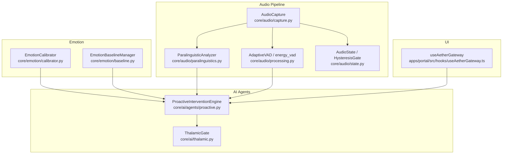
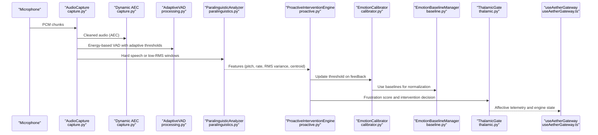
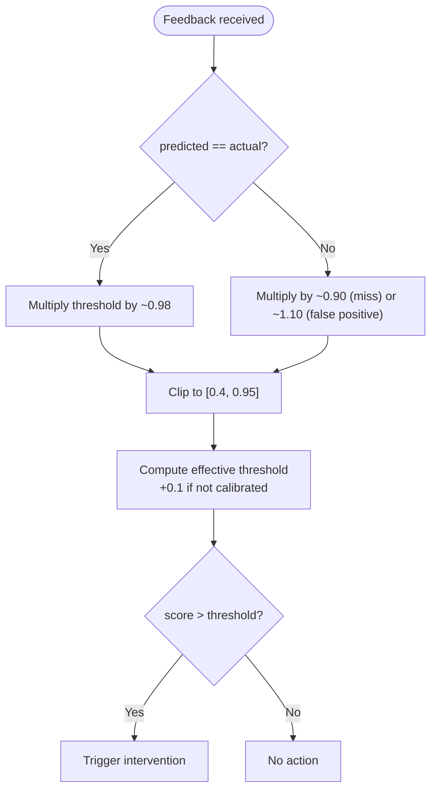
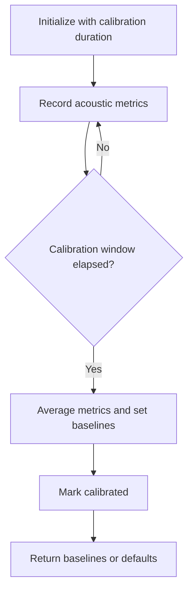
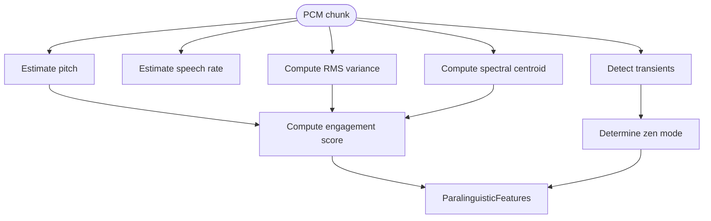
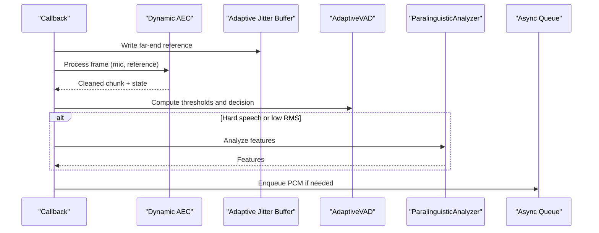
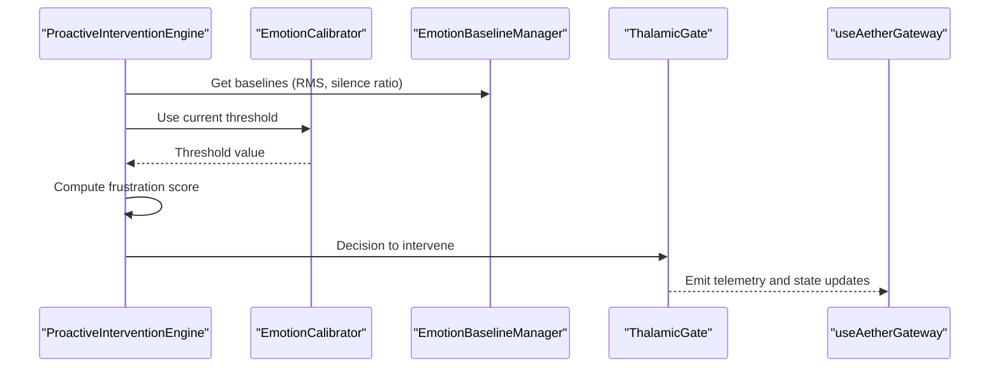
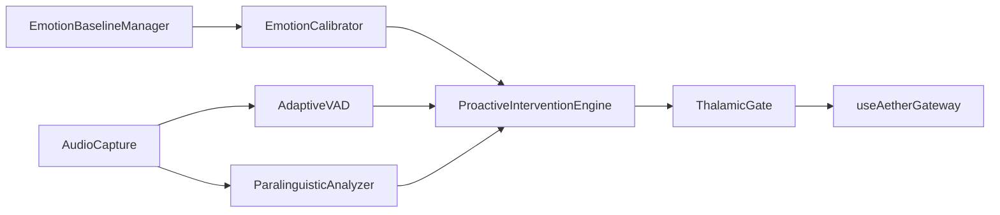
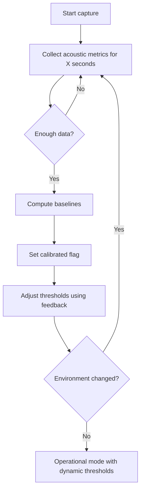

# User Calibration and Adaptation

<cite>
**Referenced Files in This Document**
- [calibrator.py](file://core/emotion/calibrator.py)
- [baseline.py](file://core/emotion/baseline.py)
- [paralinguistics.py](file://core/audio/paralinguistics.py)
- [capture.py](file://core/audio/capture.py)
- [processing.py](file://core/audio/processing.py)
- [state.py](file://core/audio/state.py)
- [config.py](file://core/infra/config.py)
- [proactive.py](file://core/ai/agents/proactive.py)
- [thalamic.py](file://core/ai/thalamic.py)
- [useAetherGateway.ts](file://apps/portal/src/hooks/useAetherGateway.ts)
</cite>

## Table of Contents
1. [Introduction](#introduction)
2. [Project Structure](#project-structure)
3. [Core Components](#core-components)
4. [Architecture Overview](#architecture-overview)
5. [Detailed Component Analysis](#detailed-component-analysis)
6. [Dependency Analysis](#dependency-analysis)
7. [Performance Considerations](#performance-considerations)
8. [Troubleshooting Guide](#troubleshooting-guide)
9. [Conclusion](#conclusion)
10. [Appendices](#appendices)

## Introduction
This document describes the user calibration and adaptation system that tailors emotional analysis to individual users. It explains how the system collects representative speech samples, builds acoustic baselines, and continuously refines thresholds using user feedback. It documents the multi-stage calibration workflow, environmental adaptation, confidence adjustments, integration with the audio pipeline, and the user interface telemetry that surfaces calibration progress and results.

## Project Structure
The calibration and adaptation system spans several modules:
- Emotion calibration and baselines: emotion calibration and acoustic baseline management
- Audio processing and real-time analysis: VAD, silence classification, and paralinguistic feature extraction
- Audio capture and gating: real-time capture, AEC, and gating logic
- AI agents and proactive intervention: frustration scoring and intervention decisions
- Configuration and UI telemetry: runtime parameters and frontend visualization

**Diagram sources**
- [calibrator.py](file://core/emotion/calibrator.py#L8-L65)
- [baseline.py](file://core/emotion/baseline.py#L9-L87)
- [paralinguistics.py](file://core/audio/paralinguistics.py#L31-L214)
- [capture.py](file://core/audio/capture.py#L193-L510)
- [processing.py](file://core/audio/processing.py#L256-L508)
- [state.py](file://core/audio/state.py#L13-L129)
- [proactive.py](file://core/ai/agents/proactive.py#L10-L90)
- [thalamic.py](file://core/ai/thalamic.py#L11-L48)
- [useAetherGateway.ts](file://apps/portal/src/hooks/useAetherGateway.ts#L69-L299)

**Section sources**
- [calibrator.py](file://core/emotion/calibrator.py#L8-L65)
- [baseline.py](file://core/emotion/baseline.py#L9-L87)
- [paralinguistics.py](file://core/audio/paralinguistics.py#L31-L214)
- [capture.py](file://core/audio/capture.py#L193-L510)
- [processing.py](file://core/audio/processing.py#L256-L508)
- [state.py](file://core/audio/state.py#L13-L129)
- [proactive.py](file://core/ai/agents/proactive.py#L10-L90)
- [thalamic.py](file://core/ai/thalamic.py#L11-L48)
- [useAetherGateway.ts](file://apps/portal/src/hooks/useAetherGateway.ts#L69-L299)

## Core Components
- EmotionCalibrator: Adjusts the dynamic threshold for triggering proactive interventions based on user feedback and calibration state.
- EmotionBaselineManager: Builds acoustic baselines during an initial calibration window to normalize emotional scores.
- ParalinguisticAnalyzer: Extracts features (pitch, rate, RMS variance, spectral centroid) used by the AI agents to compute affective metrics.
- AudioCapture: Real-time capture with AEC, gating, and VAD; feeds paralinguistic features to the agents.
- AdaptiveVAD: Environment-adaptive voice activity detection that adjusts thresholds based on recent noise statistics.
- AudioState and HysteresisGate: Thread-safe state and gating logic to stabilize mute/unmute decisions.
- ProactiveInterventionEngine: Computes frustration and decides whether to trigger a helpful intervention.
- ThalamicGate: Central monitoring loop that routes affective signals and coordinates proactive behavior.
- useAetherGateway: Frontend hook that surfaces affective telemetry and engine state to the UI.

**Section sources**
- [calibrator.py](file://core/emotion/calibrator.py#L8-L65)
- [baseline.py](file://core/emotion/baseline.py#L9-L87)
- [paralinguistics.py](file://core/audio/paralinguistics.py#L31-L214)
- [capture.py](file://core/audio/capture.py#L193-L510)
- [processing.py](file://core/audio/processing.py#L256-L508)
- [state.py](file://core/audio/state.py#L13-L129)
- [proactive.py](file://core/ai/agents/proactive.py#L10-L90)
- [thalamic.py](file://core/ai/thalamic.py#L11-L48)
- [useAetherGateway.ts](file://apps/portal/src/hooks/useAetherGateway.ts#L69-L299)

## Architecture Overview
The system integrates real-time audio capture, paralinguistic analysis, and affective scoring to drive proactive interventions. During the initial calibration window, acoustic baselines are collected to normalize emotional scores. After calibration, the system dynamically adjusts thresholds based on user feedback to improve accuracy and reduce false positives/negatives.

**Diagram sources**
- [capture.py](file://core/audio/capture.py#L329-L509)
- [processing.py](file://core/audio/processing.py#L256-L508)
- [paralinguistics.py](file://core/audio/paralinguistics.py#L132-L214)
- [proactive.py](file://core/ai/agents/proactive.py#L10-L90)
- [calibrator.py](file://core/emotion/calibrator.py#L8-L65)
- [baseline.py](file://core/emotion/baseline.py#L9-L87)
- [thalamic.py](file://core/ai/thalamic.py#L11-L48)
- [useAetherGateway.ts](file://apps/portal/src/hooks/useAetherGateway.ts#L69-L299)

## Detailed Component Analysis

### EmotionCalibrator
Responsibilities:
- Maintains a dynamic threshold for triggering interventions.
- Learns from user feedback to tighten or loosen sensitivity.
- Incorporates calibration state to adjust thresholds during the initial window.

Key behaviors:
- Threshold update rule reacts to correct predictions (tighten) versus misses/false positives (adjust accordingly).
- Clamps thresholds to a safe range to prevent runaway sensitivity.
- During calibration, raises the effective threshold to reduce false positives.

**Diagram sources**
- [calibrator.py](file://core/emotion/calibrator.py#L26-L60)

**Section sources**
- [calibrator.py](file://core/emotion/calibrator.py#L8-L65)

### EmotionBaselineManager
Responsibilities:
- Captures acoustic snapshots during a fixed calibration window.
- Computes baselines for RMS, silence ratio, and pitch variance.
- Provides default baselines until calibration completes.

Key behaviors:
- Records metrics history during the calibration duration.
- Finalizes calibration by averaging metrics and marking ready.
- Returns defaults if insufficient data is available.

**Diagram sources**
- [baseline.py](file://core/emotion/baseline.py#L16-L86)

**Section sources**
- [baseline.py](file://core/emotion/baseline.py#L9-L87)

### ParalinguisticAnalyzer
Responsibilities:
- Extracts core features from PCM chunks for affective scoring.
- Estimates pitch, speech rate, transient count, RMS variance, and spectral centroid.
- Computes engagement and zen mode indicators.

Processing logic highlights:
- Pitch estimation via autocorrelation with human speech range filtering.
- Speech rate via envelope peak counting.
- Transient detection for typing cadence.
- RMS variance and spectral centroid for expressiveness and brightness.
- Engagement score derived from weighted affective features.
- Zen mode detection based on low RMS, low pitch, and transient rate.

**Diagram sources**
- [paralinguistics.py](file://core/audio/paralinguistics.py#L132-L214)

**Section sources**
- [paralinguistics.py](file://core/audio/paralinguistics.py#L31-L214)

### AudioCapture and Real-Time Gating
Responsibilities:
- Captures microphone PCM via a high-performance callback.
- Applies Dynamic AEC and smooth muting to reduce echo and clicks.
- Updates VAD and silence classification; pushes audio to downstream consumers.
- Integrates paralinguistic analysis during appropriate windows.

Key behaviors:
- Thalamic Gate callback performs AEC, energy gating, and VAD.
- Uses jitter buffer to stabilize AEC reference signal.
- Calls paralinguistic analyzer when speech or very low RMS conditions are met.
- Emits telemetry and maintains shared audio state.

**Diagram sources**
- [capture.py](file://core/audio/capture.py#L329-L509)
- [processing.py](file://core/audio/processing.py#L256-L508)
- [paralinguistics.py](file://core/audio/paralinguistics.py#L132-L214)

**Section sources**
- [capture.py](file://core/audio/capture.py#L193-L510)
- [processing.py](file://core/audio/processing.py#L256-L508)
- [state.py](file://core/audio/state.py#L13-L129)

### ProactiveInterventionEngine and ThalamicGate
Responsibilities:
- Compute frustration from valence and arousal, normalizing by acoustic baselines.
- Decide whether to trigger a helpful intervention considering cooldowns and calibration state.
- Coordinate monitoring and intervention scheduling.

Key behaviors:
- Frustration score increases with negative valence and arousal, with baseline normalization.
- During calibration, requires a stronger signal to avoid false positives.
- ThalamicGate monitors audio state and triggers the monitoring loop.

**Diagram sources**
- [proactive.py](file://core/ai/agents/proactive.py#L10-L90)
- [calibrator.py](file://core/emotion/calibrator.py#L51-L65)
- [baseline.py](file://core/emotion/baseline.py#L77-L86)
- [thalamic.py](file://core/ai/thalamic.py#L11-L48)
- [useAetherGateway.ts](file://apps/portal/src/hooks/useAetherGateway.ts#L69-L299)

**Section sources**
- [proactive.py](file://core/ai/agents/proactive.py#L10-L90)
- [thalamic.py](file://core/ai/thalamic.py#L11-L48)

## Dependency Analysis
- EmotionCalibrator depends on EmotionBaselineManager for acoustic baselines and uses feedback to adjust thresholds.
- ProactiveInterventionEngine consumes paralinguistic features and VAD decisions to compute frustration and decide interventions.
- AudioCapture integrates VAD, AEC, and paralinguistic analysis; emits telemetry consumed by the UI.
- useAetherGateway receives affective telemetry and engine state, surfacing them to the user.

**Diagram sources**
- [calibrator.py](file://core/emotion/calibrator.py#L8-L65)
- [baseline.py](file://core/emotion/baseline.py#L9-L87)
- [capture.py](file://core/audio/capture.py#L193-L510)
- [processing.py](file://core/audio/processing.py#L256-L508)
- [paralinguistics.py](file://core/audio/paralinguistics.py#L31-L214)
- [proactive.py](file://core/ai/agents/proactive.py#L10-L90)
- [thalamic.py](file://core/ai/thalamic.py#L11-L48)
- [useAetherGateway.ts](file://apps/portal/src/hooks/useAetherGateway.ts#L69-L299)

**Section sources**
- [calibrator.py](file://core/emotion/calibrator.py#L8-L65)
- [baseline.py](file://core/emotion/baseline.py#L9-L87)
- [capture.py](file://core/audio/capture.py#L193-L510)
- [processing.py](file://core/audio/processing.py#L256-L508)
- [paralinguistics.py](file://core/audio/paralinguistics.py#L31-L214)
- [proactive.py](file://core/ai/agents/proactive.py#L10-L90)
- [thalamic.py](file://core/ai/thalamic.py#L11-L48)
- [useAetherGateway.ts](file://apps/portal/src/hooks/useAetherGateway.ts#L69-L299)

## Performance Considerations
- Real-time constraints: The capture callback and VAD operate on sub-5ms windows to maintain zero-friction responsiveness.
- Efficient buffers: Ring buffers and jitter buffers minimize allocations and latency.
- Backend acceleration: Rust-backed DSP routines (when available) significantly reduce latency and improve throughput.
- Adaptive thresholds: Environment-aware VAD reduces false triggers in varying acoustic conditions.
- Calibration window: Short initial calibration period minimizes user burden while collecting sufficient acoustic baselines.

[No sources needed since this section provides general guidance]

## Troubleshooting Guide
Common issues and remedies:
- Poor calibration performance:
  - Ensure adequate acoustic data collection during the calibration window.
  - Verify that the initial 30 seconds capture includes varied speech and silence.
  - Confirm thresholds are within expected bounds after calibration.

- Frequent false positives:
  - Review threshold updates and ensure feedback is consistently applied.
  - Check that the calibration window is not prematurely bypassed.

- Environmental sensitivity problems:
  - Adjust AEC parameters (step size, filter length, convergence threshold) via runtime configuration.
  - Validate VAD thresholds and window size for the current environment.

- UI telemetry anomalies:
  - Confirm that the gateway is receiving affective telemetry and engine state updates.
  - Inspect frontend hooks for proper subscription and rendering of telemetry.

**Section sources**
- [baseline.py](file://core/emotion/baseline.py#L52-L86)
- [calibrator.py](file://core/emotion/calibrator.py#L26-L65)
- [processing.py](file://core/audio/processing.py#L256-L508)
- [config.py](file://core/infra/config.py#L11-L44)
- [useAetherGateway.ts](file://apps/portal/src/hooks/useAetherGateway.ts#L69-L299)

## Conclusion
The calibration and adaptation system combines acoustic baseline modeling, dynamic threshold tuning, and environment-aware VAD to deliver accurate, responsive emotional state detection. By integrating real-time audio capture, paralinguistic analysis, and proactive intervention engines, it continuously improves fidelity to individual users while adapting to diverse acoustic conditions.

[No sources needed since this section summarizes without analyzing specific files]

## Appendices

### Multi-Stage Calibration Workflow
- Initial setup: Start capture and initialize baseline manager with a fixed calibration duration.
- Iterative refinement: Update thresholds based on user feedback; tighten or loosen sensitivity accordingly.
- Periodic re-calibration: Re-run baseline collection when significant environmental or device changes occur.

**Diagram sources**
- [baseline.py](file://core/emotion/baseline.py#L16-L86)
- [calibrator.py](file://core/emotion/calibrator.py#L26-L65)

### Confidence Adjustment Mechanisms
- Calibration window strictness: Temporarily increases threshold to reduce false positives during initial calibration.
- Feedback-driven adaptation: Tightens thresholds after correct predictions; loosens after misses or false positives.
- Baseline normalization: Uses RMS and silence ratios to normalize affective scores across sessions and devices.

**Section sources**
- [calibrator.py](file://core/emotion/calibrator.py#L51-L65)
- [baseline.py](file://core/emotion/baseline.py#L77-L86)
- [proactive.py](file://core/ai/agents/proactive.py#L30-L58)

### Integration with Audio Processing Pipeline
- Capture: AEC, gating, and VAD decisions shape downstream analysis windows.
- Analysis: Paralinguistic features extracted during hard-speech or low-RMS windows inform affective scoring.
- Telemetry: Frontend receives affective telemetry and engine state for user-facing insights.

**Section sources**
- [capture.py](file://core/audio/capture.py#L329-L509)
- [paralinguistics.py](file://core/audio/paralinguistics.py#L132-L214)
- [useAetherGateway.ts](file://apps/portal/src/hooks/useAetherGateway.ts#L151-L170)