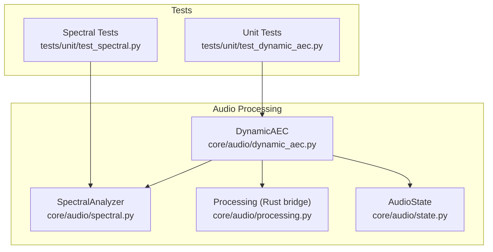
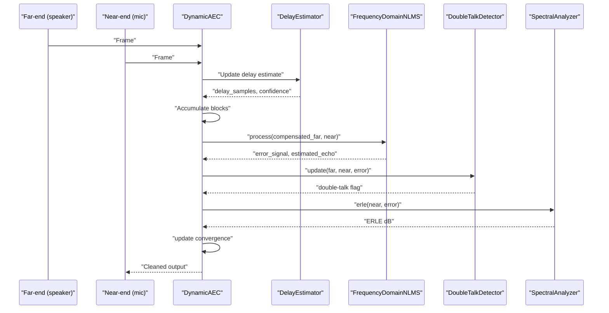
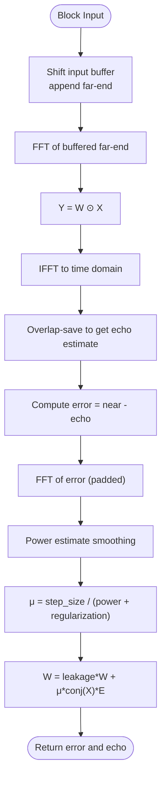
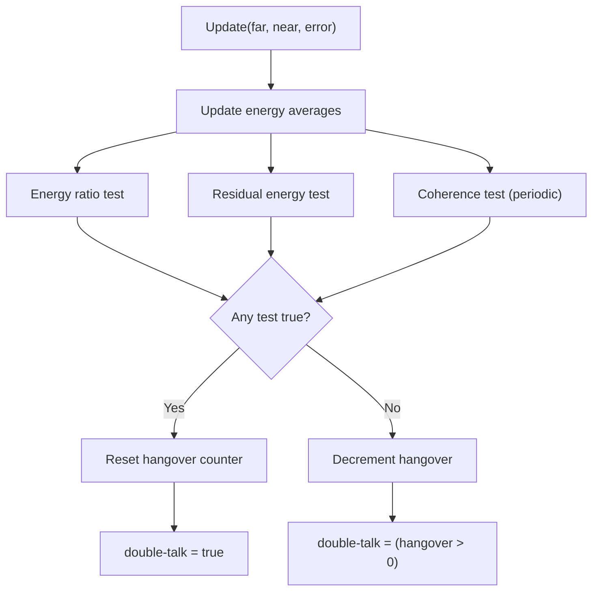
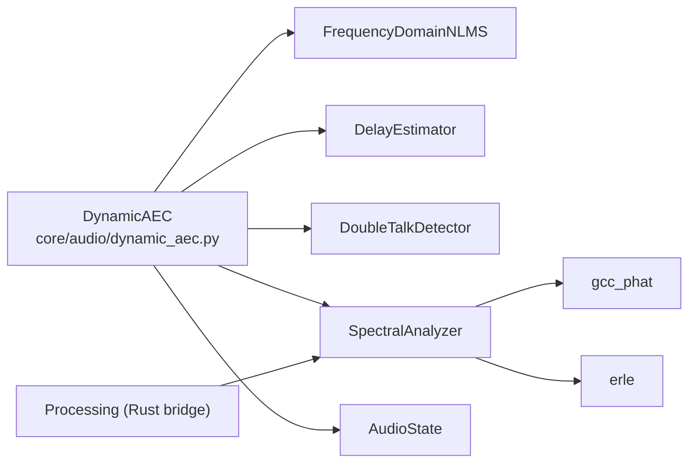

# Acoustic Echo Cancellation (AEC) - Dual-Path LMS

<cite>
**Referenced Files in This Document**
- [dynamic_aec.py](file://core/audio/dynamic_aec.py)
- [spectral.py](file://core/audio/spectral.py)
- [processing.py](file://core/audio/processing.py)
- [state.py](file://core/audio/state.py)
- [test_dynamic_aec.py](file://tests/unit/test_dynamic_aec.py)
- [test_spectral.py](file://tests/unit/test_spectral.py)
</cite>

## Table of Contents
1. [Introduction](#introduction)
2. [Project Structure](#project-structure)
3. [Core Components](#core-components)
4. [Architecture Overview](#architecture-overview)
5. [Detailed Component Analysis](#detailed-component-analysis)
6. [Dependency Analysis](#dependency-analysis)
7. [Performance Considerations](#performance-considerations)
8. [Troubleshooting Guide](#troubleshooting-guide)
9. [Conclusion](#conclusion)
10. [Appendices](#appendices)

## Introduction
This document describes the dual-path LMS AEC algorithm that powers the Thalamic Gate V2 acoustic echo cancellation system. It explains the adaptive filtering implementation, convergence monitoring, step-size adaptation, double-talk detection, delay estimation, and integration with the Cortex Rust acceleration layer. It also documents the mathematical foundations of the frequency-domain NLMS (filtered-x LMS) algorithm, ERLE measurement, and practical tuning guidelines for filter length, convergence thresholds, and real-time adaptation parameters.

## Project Structure
The AEC implementation is centered in the audio processing subsystem with supporting spectral analysis and state management utilities. The Cortex Rust backend is conditionally loaded to accelerate DSP primitives.

**Diagram sources**
- [dynamic_aec.py](file://core/audio/dynamic_aec.py#L490-L855)
- [spectral.py](file://core/audio/spectral.py#L250-L501)
- [processing.py](file://core/audio/processing.py#L37-L96)
- [state.py](file://core/audio/state.py#L36-L129)
- [test_dynamic_aec.py](file://tests/unit/test_dynamic_aec.py#L1-L190)
- [test_spectral.py](file://tests/unit/test_spectral.py#L1-L62)

**Section sources**
- [dynamic_aec.py](file://core/audio/dynamic_aec.py#L1-L855)
- [spectral.py](file://core/audio/spectral.py#L1-L501)
- [processing.py](file://core/audio/processing.py#L1-L508)
- [state.py](file://core/audio/state.py#L1-L129)
- [test_dynamic_aec.py](file://tests/unit/test_dynamic_aec.py#L1-L190)
- [test_spectral.py](file://tests/unit/test_spectral.py#L1-L62)

## Core Components
- DynamicAEC: Orchestrates AEC pipeline, including delay estimation, adaptive filtering, double-talk detection, ERLE computation, and convergence tracking.
- FrequencyDomainNLMS: Implements frequency-domain normalized LMS (filtered-x LMS) with power-normalized step-size and leakage.
- DoubleTalkDetector: Detects double-talk using energy ratios, residual energy, and spectral coherence with hangover logic.
- DelayEstimator: Estimates time delay between far-end and near-end using GCC-PHAT with periodic updates and exponential smoothing.
- SpectralAnalyzer: Provides STFT, Bark bands, spectral features, and coherence computation used by detectors.
- AudioState: Thread-safe global state for AEC telemetry and gating.
- Cortex Rust bridge: Optional acceleration for VAD and zero-crossing routines.

**Section sources**
- [dynamic_aec.py](file://core/audio/dynamic_aec.py#L490-L855)
- [spectral.py](file://core/audio/spectral.py#L250-L501)
- [state.py](file://core/audio/state.py#L36-L129)
- [processing.py](file://core/audio/processing.py#L37-L96)

## Architecture Overview
The AEC system operates in frames, accumulating blocks until a full filter-length segment is available. It estimates delay, compensates the far-end reference, runs the adaptive filter, detects double-talk, computes ERLE, and updates convergence.

**Diagram sources**
- [dynamic_aec.py](file://core/audio/dynamic_aec.py#L579-L711)
- [dynamic_aec.py](file://core/audio/dynamic_aec.py#L100-L196)
- [dynamic_aec.py](file://core/audio/dynamic_aec.py#L253-L372)
- [dynamic_aec.py](file://core/audio/dynamic_aec.py#L374-L488)
- [spectral.py](file://core/audio/spectral.py#L457-L501)

## Detailed Component Analysis

### Dual-Path LMS (Filtered-x NLMS) Implementation
The adaptive filter operates in the frequency domain using overlap-save convolution. The algorithm:
- Maintains a complex frequency-domain weight vector W.
- Uses the far-end reference as the “x” input to compute filter output Y = W · X.
- Converts back to time domain and applies overlap-save to produce the echo estimate.
- Computes error in frequency domain and updates W with a power-normalized step-size μ = μ₀ / (||X||² + ε) and leakage factor.

Key parameters:
- filter_length: Determines FFT size (2×) and block size for overlap-save.
- step_size: Nominal learning rate; effective μ adapts to input power.
- regularization: Prevents numerical issues in power normalization.
- leakage: Sub-exponential weight decay to stabilize long runs.

**Diagram sources**
- [dynamic_aec.py](file://core/audio/dynamic_aec.py#L143-L196)

**Section sources**
- [dynamic_aec.py](file://core/audio/dynamic_aec.py#L100-L221)

### Convergence Monitoring and ERLE
- ERLE is computed per block by averaging mic and error powers over multiple frames and converting to decibels.
- Convergence is tracked as sustained ERLE above a threshold over a fixed number of frames. The progress is normalized to 0–1 and the converged flag is set when the threshold is met.

Practical tuning:
- convergence_threshold_db: Start around 12–18 dB depending on environment; higher values require more suppression.
- convergence_frames_needed: Controls hysteresis; adjust to balance responsiveness vs false positives.

**Section sources**
- [dynamic_aec.py](file://core/audio/dynamic_aec.py#L638-L733)
- [spectral.py](file://core/audio/spectral.py#L457-L501)

### Double-Talk Detection
The detector combines three complementary tests:
- Energy ratio test: near-end dominant energy suggests user speech.
- Residual energy test: high error-to-near ratio implies poor cancellation and likely double-talk.
- Spectral coherence test: low coherence between far-end and near-end indicates mismatched signals.

Each detection triggers a hangover counter to avoid chatter caused by transient mismatches.

**Diagram sources**
- [dynamic_aec.py](file://core/audio/dynamic_aec.py#L294-L361)
- [spectral.py](file://core/audio/spectral.py#L335-L380)

**Section sources**
- [dynamic_aec.py](file://core/audio/dynamic_aec.py#L253-L372)
- [spectral.py](file://core/audio/spectral.py#L335-L380)

### Delay Estimation with GCC-PHAT
- Periodically accumulates far-end and near-end chunks and estimates delay using generalized cross-correlation with phase transform (GCC-PHAT).
- Applies exponential smoothing when confidence exceeds a threshold.
- Provides delayed far-end reference aligned with the near-end for AEC processing.

Parameters:
- max_delay_ms: Upper bound for delay search.
- update_interval_ms: How frequently to re-estimate.
- smoothing_factor: Confidence-weighted smoothing of estimates.

**Section sources**
- [dynamic_aec.py](file://core/audio/dynamic_aec.py#L374-L488)
- [spectral.py](file://core/audio/spectral.py#L387-L454)

### AEC State Management and User Speech Determination
- AECState tracks convergence, ERLE, estimated delay, double-talk, filter energy, and processed frame count.
- AudioState provides thread-safe telemetry and gating flags for playback transitions and AEC metrics.
- During warm-up, a fast far-end/mic energy coherence heuristic distinguishes echo from user speech to prevent early echo leakage.

**Section sources**
- [dynamic_aec.py](file://core/audio/dynamic_aec.py#L87-L100)
- [dynamic_aec.py](file://core/audio/dynamic_aec.py#L734-L775)
- [state.py](file://core/audio/state.py#L36-L129)

### Cortex Rust Acceleration Integration
- The processing module attempts to import a compiled Rust backend (aether-cortex) and routes computationally intensive routines (e.g., zero-crossing, VAD) to Rust when available.
- Falls back to NumPy implementations otherwise, preserving identical APIs.

Implications:
- Significant speedup on supported platforms; identical behavior otherwise.
- AEC core remains CPU-bound; acceleration helps surrounding audio processing.

**Section sources**
- [processing.py](file://core/audio/processing.py#L37-L96)

## Dependency Analysis

**Diagram sources**
- [dynamic_aec.py](file://core/audio/dynamic_aec.py#L490-L855)
- [spectral.py](file://core/audio/spectral.py#L250-L501)
- [processing.py](file://core/audio/processing.py#L37-L96)

**Section sources**
- [dynamic_aec.py](file://core/audio/dynamic_aec.py#L490-L855)
- [spectral.py](file://core/audio/spectral.py#L250-L501)
- [processing.py](file://core/audio/processing.py#L37-L96)

## Performance Considerations
- Frequency-domain processing: FFT sizes are powers of two and at least twice the filter length to support overlap-save convolution efficiently.
- Power-normalized step-size: Reduces sensitivity to input level variations; effective μ decreases with stronger signals.
- Leakage: Small leakage (e.g., 0.999) stabilizes long-term adaptation.
- Buffering and batching: Accumulates blocks to process full filter lengths; reduces overhead and improves convergence.
- Rust acceleration: Enables high-throughput VAD and zero-crossing detection; AEC core remains in Python/NumPy.

[No sources needed since this section provides general guidance]

## Troubleshooting Guide
Common issues and remedies:
- Poor convergence (low ERLE):
  - Increase step_size modestly; verify regularization is appropriate.
  - Ensure adequate filter_length for room impulse response; round to power-of-two multiples of frame_size.
  - Confirm delay_estimator is updating; check confidence and smoothing parameters.
- Double-talk mis-detection:
  - Adjust coherence_threshold and energy_ratio_threshold; increase hangover_frames to reduce chatter.
  - Verify that residual energy test thresholds are suitable for the environment.
- Echo leakage during speech:
  - Use warm-up heuristic to avoid echo leakage before convergence; confirm is_user_speaking logic.
  - Reduce step_size or increase leakage to stabilize during double-talk.
- Instability or divergence:
  - Lower step_size; increase regularization; reduce leakage.
  - Monitor filter_tap_energy via AECState to detect excessive growth.
- Delay estimation drift:
  - Increase update_interval_ms or smoothing_factor; verify max_delay_ms covers expected reverberation.
- Real-time adaptation:
  - Tune convergence_threshold_db and convergence_frames_needed for your latency budget.

Validation references:
- Unit tests demonstrate ERLE improvement, convergence timing, double-talk detection during overlaps, and step-size behavior under varying input power.

**Section sources**
- [test_dynamic_aec.py](file://tests/unit/test_dynamic_aec.py#L70-L190)
- [test_spectral.py](file://tests/unit/test_spectral.py#L28-L62)

## Conclusion
The dual-path LMS AEC integrates adaptive filtering, delay estimation, double-talk detection, and ERLE-based convergence to deliver robust echo cancellation. Its frequency-domain NLMS implementation leverages power-normalized step-size and leakage for stability, while the Rust-accelerated processing layer enhances overall system throughput. Proper tuning of filter length, convergence thresholds, and detection parameters yields reliable performance across diverse acoustic environments.

[No sources needed since this section summarizes without analyzing specific files]

## Appendices

### Mathematical Foundations: Filtered-x LMS
- Input reference: far-end signal x[n].
- Desired response: near-end y[n] (contains echo plus noise).
- Error: e[n] = y[n] − ŷ[n], where ŷ[n] is the filtered echo estimate.
- Update equation: w[n+1] = w[n] + μ · ∇W E[e*e*], with normalized μ based on input power and regularization.

Advantages over time-domain LMS:
- Better numerical conditioning for long filters.
- Efficient convolution via FFT and overlap-save.
- Natural extension to multi-band or perceptual weighting.

[No sources needed since this section provides general guidance]

### Technical Specifications
- Typical operating parameters:
  - sample_rate: 16 kHz
  - frame_size: 256 samples
  - filter_length_ms: 50–200 ms (rounded to power-of-two FFT sizes)
  - step_size: 0.1–1.0 (effective μ adapts)
  - regularization: 1e-4
  - leakage: 0.999
  - coherence_threshold: ~0.65
  - energy_ratio_threshold: ~0.5
  - hangover_frames: ~10
  - convergence_threshold_db: 12–18 dB
- ERLE targets:
  - Quiet rooms: 20–35 dB typical; 40+ dB exceptional.
  - Noisy environments: 15–30 dB; focus on stability and double-talk handling.

[No sources needed since this section provides general guidance]