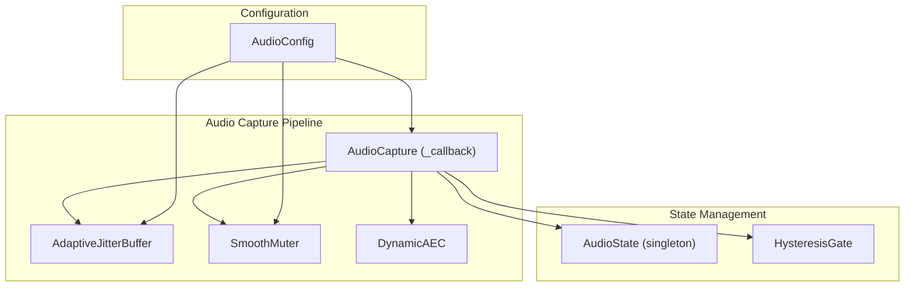
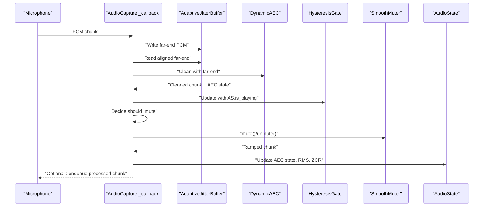
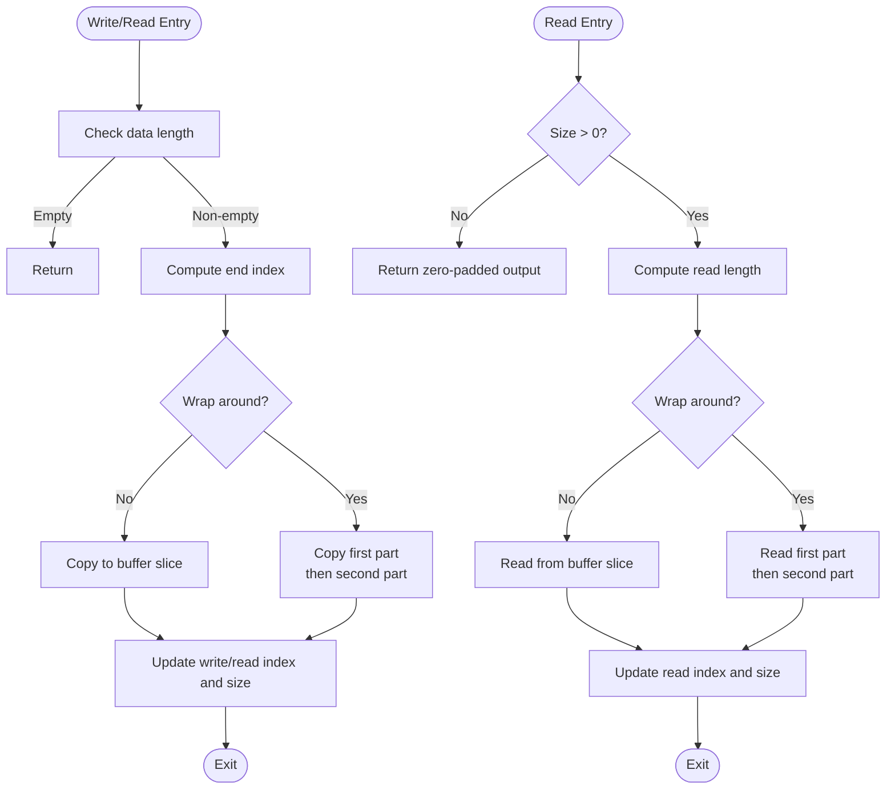
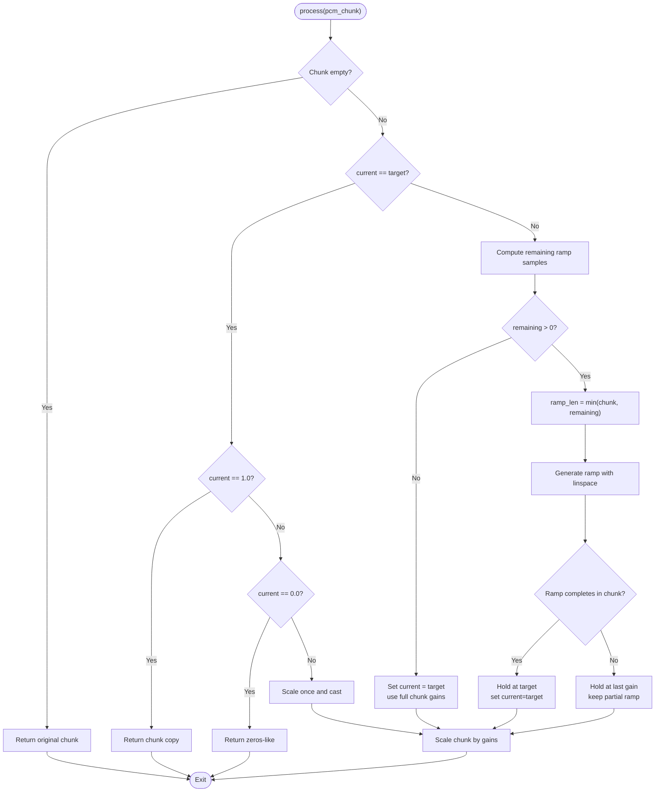
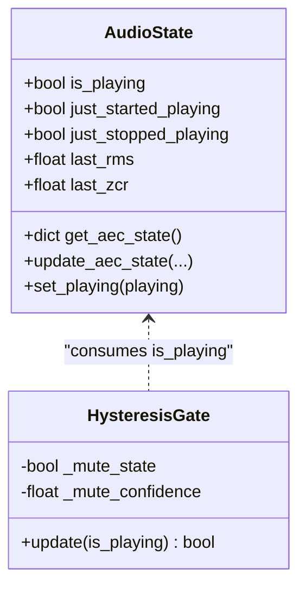
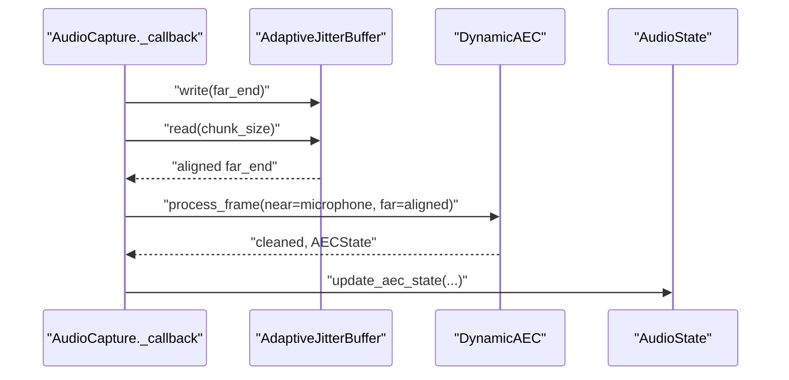
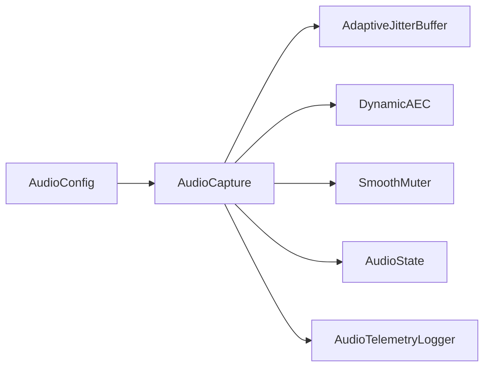

# Adaptive Jitter Buffer and Smooth Muter

<cite>
**Referenced Files in This Document**
- [capture.py](file://core/audio/capture.py)
- [dynamic_aec.py](file://core/audio/dynamic_aec.py)
- [processing.py](file://core/audio/processing.py)
- [state.py](file://core/audio/state.py)
- [config.py](file://core/infra/config.py)
- [telemetry.py](file://core/audio/telemetry.py)
- [test_smooth_muter.py](file://tests/unit/test_smooth_muter.py)
</cite>

## Table of Contents
1. [Introduction](#introduction)
2. [Project Structure](#project-structure)
3. [Core Components](#core-components)
4. [Architecture Overview](#architecture-overview)
5. [Detailed Component Analysis](#detailed-component-analysis)
6. [Dependency Analysis](#dependency-analysis)
7. [Performance Considerations](#performance-considerations)
8. [Troubleshooting Guide](#troubleshooting-guide)
9. [Conclusion](#conclusion)

## Introduction
This document explains the adaptive jitter buffer and smooth muter components that stabilize audio processing and eliminate artifacts. The adaptive jitter buffer smooths bursty far-end (speaker) audio arrivals to provide a stable reference for acoustic echo cancellation (AEC), preventing convergence loss. The smooth muter applies deterministic, ramp-based gain control to avoid clicks and pops during muting/unmuting transitions. Together, they coordinate with the audio state management system and hardware latency compensation to maintain high-quality voice communication.

## Project Structure
The relevant implementation spans the audio capture pipeline, dynamic AEC, ring buffers, and configuration:
- Adaptive jitter buffer: circular buffer for far-end reference alignment
- Smooth muter: linear-gain ramp with deterministic completion
- Audio state: shared singleton for AEC state and gating decisions
- Dynamic AEC: adaptive echo cancellation with delay estimation and double-talk detection
- Configuration: target/max latency, ramp duration, and latency compensation parameters

**Diagram sources**
- [capture.py](file://core/audio/capture.py#L38-L105)
- [capture.py](file://core/audio/capture.py#L106-L191)
- [capture.py](file://core/audio/capture.py#L193-L510)
- [state.py](file://core/audio/state.py#L36-L129)
- [config.py](file://core/infra/config.py#L11-L44)

**Section sources**
- [capture.py](file://core/audio/capture.py#L38-L105)
- [capture.py](file://core/audio/capture.py#L106-L191)
- [capture.py](file://core/audio/capture.py#L193-L510)
- [state.py](file://core/audio/state.py#L36-L129)
- [config.py](file://core/infra/config.py#L11-L44)

## Core Components
- AdaptiveJitterBuffer: circular buffer for far-end PCM aligned to the capture chunk size, enabling stable AEC reference and preventing convergence loss.
- SmoothMuter: linear-gain ramp generator that ensures continuous amplitude envelopes across chunk boundaries, eliminating clicks/pops.
- AudioState: thread-safe singleton tracking playback state, AEC metrics, and gating decisions.
- DynamicAEC: adaptive echo cancellation with GCC-PHAT delay estimation, frequency-domain NLMS filtering, and double-talk detection.
- Configuration: defines target/max jitter buffer latency, ramp duration, and hardware latency compensation.

**Section sources**
- [capture.py](file://core/audio/capture.py#L38-L105)
- [capture.py](file://core/audio/capture.py#L106-L191)
- [state.py](file://core/audio/state.py#L36-L129)
- [dynamic_aec.py](file://core/audio/dynamic_aec.py#L490-L779)
- [config.py](file://core/infra/config.py#L11-L44)

## Architecture Overview
The capture callback integrates jitter buffering, AEC, hysteresis gating, and smooth muting. The far-end reference is written into the jitter buffer and read back aligned to the current chunk size. The AEC cleans the microphone signal using the aligned far-end reference. A hysteresis gate decides whether to mute based on AI playback state and user speech detection. The smooth muter applies a linear gain ramp to avoid transients. Hardware latency compensation adds guard times for mute/unmute transitions.

**Diagram sources**
- [capture.py](file://core/audio/capture.py#L329-L509)
- [capture.py](file://core/audio/capture.py#L106-L191)
- [state.py](file://core/audio/state.py#L13-L34)

**Section sources**
- [capture.py](file://core/audio/capture.py#L329-L509)
- [state.py](file://core/audio/state.py#L13-L34)

## Detailed Component Analysis

### Adaptive Jitter Buffer
Purpose:
- Stabilize far-end reference arrivals to prevent AEC convergence loss caused by bursty or misaligned audio.
- Provide a controlled latency budget via target and maximum latency settings.

Key behaviors:
- Circular buffer with separate read/write indices and size tracking.
- Writes handle wrap-around and overruns; reads return zero-padding on underrun.
- Maintains a fixed capacity to bound memory and latency.

Target and maximum latency:
- Configurable in samples derived from milliseconds and sample rate.
- Target latency sets the desired steady-state depth; maximum latency caps worst-case drift.

Integration:
- Capture writes newly received far-end PCM to the buffer.
- Capture reads exactly the current chunk size for AEC processing.

**Diagram sources**
- [capture.py](file://core/audio/capture.py#L58-L104)

**Section sources**
- [capture.py](file://core/audio/capture.py#L38-L105)
- [config.py](file://core/infra/config.py#L37-L43)

### Smooth Muter
Purpose:
- Eliminate clicks/pops during muting/unmuting by applying a smooth, deterministic linear gain ramp.
- Maintain continuity across chunk boundaries with minimal allocations and branching.

Linear ramp generation:
- Computes remaining ramp samples based on a fixed ramp length in samples for a full 0→1 or 1→0 transition.
- Uses a linear segment over the chunk, then holds at the target or carries forward the last gain.
- Ensures deterministic completion: the ramp lands exactly on the target gain.

Fast-path optimizations:
- If current and target gain are equal, returns a copy or zero-filled buffer when appropriate.
- Avoids unnecessary allocations by generating gains inline and casting once.

**Diagram sources**
- [capture.py](file://core/audio/capture.py#L125-L182)

**Section sources**
- [capture.py](file://core/audio/capture.py#L106-L191)
- [test_smooth_muter.py](file://tests/unit/test_smooth_muter.py#L102-L134)

### Audio State Management and Hysteresis Gate
Role:
- Provides a thread-safe singleton for global audio state, including AEC metrics and playback flags.
- Hysteresis gate prevents rapid toggling of mute decisions, reducing transient clicks.

Integration:
- Capture callback updates AEC state and RMS/ZCR for downstream logic.
- Hysteresis gate consumes the global playback flag to compute a stable mute decision.

**Diagram sources**
- [state.py](file://core/audio/state.py#L36-L129)

**Section sources**
- [state.py](file://core/audio/state.py#L13-L34)
- [state.py](file://core/audio/state.py#L36-L129)
- [capture.py](file://core/audio/capture.py#L387-L419)

### Dynamic AEC Integration
Role:
- Implements adaptive echo cancellation with GCC-PHAT delay estimation, frequency-domain NLMS filtering, and double-talk detection.
- Provides AEC state used by the audio state singleton and capture logic.

Integration:
- Capture reads aligned far-end PCM from the jitter buffer and supplies it to AEC alongside the microphone chunk.
- AEC state updates are broadcast to the audio state singleton for monitoring and gating decisions.

**Diagram sources**
- [capture.py](file://core/audio/capture.py#L344-L373)
- [dynamic_aec.py](file://core/audio/dynamic_aec.py#L579-L668)

**Section sources**
- [capture.py](file://core/audio/capture.py#L344-L373)
- [dynamic_aec.py](file://core/audio/dynamic_aec.py#L490-L779)

## Dependency Analysis
- AudioCapture depends on AdaptiveJitterBuffer for stable far-end alignment, DynamicAEC for echo cancellation, SmoothMuter for artifact-free transitions, and AudioState for gating and telemetry.
- Configuration drives jitter buffer latency targets, ramp duration, and hardware latency compensation.
- Telemetry logs frame-level metrics for latency, AEC performance, and VAD outcomes.

**Diagram sources**
- [config.py](file://core/infra/config.py#L11-L44)
- [capture.py](file://core/audio/capture.py#L202-L267)
- [telemetry.py](file://core/audio/telemetry.py#L151-L276)

**Section sources**
- [config.py](file://core/infra/config.py#L11-L44)
- [capture.py](file://core/audio/capture.py#L202-L267)
- [telemetry.py](file://core/audio/telemetry.py#L151-L276)

## Performance Considerations
- Jitter buffer memory footprint is proportional to maximum latency in samples; choose maximum latency to balance stability and memory usage.
- Smooth muter uses vectorized ramp generation and fast-path branches to minimize CPU overhead per callback.
- Dynamic AEC uses frequency-domain processing with overlap-save; filter length and step size impact convergence speed and computational load.
- Hysteresis gate reduces unnecessary muting transitions, improving perceived audio quality and reducing transients.

[No sources needed since this section provides general guidance]

## Troubleshooting Guide
Common issues and resolutions:
- Audio artifacts during muting/unmuting:
  - Verify ramp duration is sufficient for the chunk size; ensure deterministic completion.
  - Confirm that the ramp is applied consistently across chunk boundaries.
- AEC convergence problems:
  - Check jitter buffer alignment; misalignment can degrade echo cancellation.
  - Monitor AEC ERLE and convergence progress via audio state.
- Buffer under/overflow symptoms:
  - Inspect jitter buffer read/write indices and size; ensure writes do not exceed capacity.
  - Adjust target latency to match typical far-end arrival patterns.
- Performance bottlenecks:
  - Use telemetry to identify latency spikes and frame drops.
  - Tune AEC parameters (step size, filter length) and VAD thresholds.

**Section sources**
- [capture.py](file://core/audio/capture.py#L38-L105)
- [capture.py](file://core/audio/capture.py#L125-L182)
- [state.py](file://core/audio/state.py#L76-L109)
- [telemetry.py](file://core/audio/telemetry.py#L203-L276)

## Conclusion
The adaptive jitter buffer and smooth muter form a robust foundation for stable, artifact-free audio processing. The jitter buffer ensures a consistent far-end reference for AEC, while the smooth muter guarantees seamless transitions without clicks. Combined with hysteresis gating, hardware latency compensation, and comprehensive telemetry, the system maintains high fidelity and responsiveness across diverse audio conditions.