# Real-time Audio Callback and Integration

<cite>
**Referenced Files in This Document**
- [capture.py](file://core/audio/capture.py)
- [state.py](file://core/audio/state.py)
- [processing.py](file://core/audio/processing.py)
- [dynamic_aec.py](file://core/audio/dynamic_aec.py)
- [telemetry.py](file://core/audio/telemetry.py)
- [paralinguistics.py](file://core/audio/paralinguistics.py)
- [echo_guard.py](file://core/audio/echo_guard.py)
- [config.py](file://core/infra/config.py)
- [errors.py](file://core/utils/errors.py)
- [playback.py](file://core/audio/playback.py)
- [pcm-processor.js](file://apps/portal/public/pcm-processor.js)
- [useAudioPipeline.ts](file://apps/portal/src/hooks/useAudioPipeline.ts)
- [test_thalamic_gate_benchmark.py](file://tests/benchmarks/test_thalamic_gate_benchmark.py)
- [test_latency.py](file://tests/unit/test_latency.py)
- [benchmark.py](file://infra/scripts/benchmark.py)
</cite>

## Table of Contents
1. [Introduction](#introduction)
2. [Project Structure](#project-structure)
3. [Core Components](#core-components)
4. [Architecture Overview](#architecture-overview)
5. [Detailed Component Analysis](#detailed-component-analysis)
6. [Dependency Analysis](#dependency-analysis)
7. [Performance Considerations](#performance-considerations)
8. [Troubleshooting Guide](#troubleshooting-guide)
9. [Conclusion](#conclusion)
10. [Appendices](#appendices)

## Introduction
This document explains the real-time audio callback system orchestrating Thalamic Gate V2 components. It details the PyAudio C-callback architecture minimizing latency between echo detection and suppression, the direct asyncio queue injection pattern that avoids thread-hopping overhead, and the callback execution flow across AEC processing, Cortex acceleration, VAD analysis, and gating decisions. It also covers audio state management, telemetry broadcasting, affective feature extraction, performance optimizations, integration with the global audio state system, error handling, device management, fallback mechanisms, timing requirements, chunk size considerations, and coordination with external audio sources like AI playback. Finally, it provides debugging techniques for callback performance, latency measurement, and real-time optimization.

## Project Structure
The real-time audio stack centers on the capture module’s PyAudio C-callback, which integrates tightly with shared audio state, dynamic AEC, VAD, and telemetry. Playback is handled by a separate callback that feeds audio from an asyncio queue. The Cortex Rust extension accelerates spectral denoising and VAD when available. Configuration governs sample rates, chunk sizes, and runtime parameters.

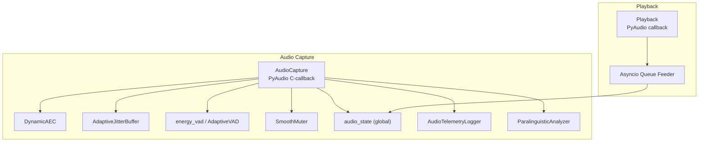

**Diagram sources**
- [capture.py](file://core/audio/capture.py#L329-L509)
- [dynamic_aec.py](file://core/audio/dynamic_aec.py#L579-L668)
- [processing.py](file://core/audio/processing.py#L389-L434)
- [state.py](file://core/audio/state.py#L36-L128)
- [telemetry.py](file://core/audio/telemetry.py#L151-L276)
- [paralinguistics.py](file://core/audio/paralinguistics.py#L31-L213)
- [playback.py](file://core/audio/playback.py#L61-L203)

**Section sources**
- [capture.py](file://core/audio/capture.py#L193-L575)
- [playback.py](file://core/audio/playback.py#L52-L203)
- [state.py](file://core/audio/state.py#L36-L128)
- [processing.py](file://core/audio/processing.py#L1-L508)
- [dynamic_aec.py](file://core/audio/dynamic_aec.py#L490-L800)
- [telemetry.py](file://core/audio/telemetry.py#L151-L394)
- [paralinguistics.py](file://core/audio/paralinguistics.py#L1-L214)

## Core Components
- AudioCapture: Implements the PyAudio C-callback that performs AEC, Cortex acceleration, VAD, gating, and direct injection into an asyncio queue. It manages jitter buffering, smooth muting, and telemetry.
- DynamicAEC: Performs adaptive echo cancellation with GCC-PHAT delay estimation, frequency-domain NLMS filtering, double-talk detection, and ERLE computation.
- Processing Utilities: Provide ring buffers, zero-crossing search, VAD engines (RMS-based with adaptive thresholds and enhanced multi-feature), and silence classification.
- AudioState: Thread-safe global state for AEC metrics, playback flags, RMS/ZCR, and telemetry counters.
- Telemetry: Records per-frame latency and performance metrics and publishes session summaries.
- ParalinguisticAnalyzer: Extracts affective features (pitch, rate, RMS variance, spectral centroid) for backchannel and engagement.
- Playback: PyAudio callback feeding audio from an asyncio queue with gain ducking and optional ambient heartbeat mixing.
- Configuration: Defines sample rates, chunk sizes, AEC/VAD parameters, and jitter buffer settings.
- Error Handling: Structured exceptions for audio device issues, overflow, and transport problems.

**Section sources**
- [capture.py](file://core/audio/capture.py#L193-L575)
- [dynamic_aec.py](file://core/audio/dynamic_aec.py#L490-L800)
- [processing.py](file://core/audio/processing.py#L107-L508)
- [state.py](file://core/audio/state.py#L36-L128)
- [telemetry.py](file://core/audio/telemetry.py#L151-L394)
- [paralinguistics.py](file://core/audio/paralinguistics.py#L19-L214)
- [playback.py](file://core/audio/playback.py#L52-L203)
- [config.py](file://core/infra/config.py#L11-L175)
- [errors.py](file://core/utils/errors.py#L13-L94)

## Architecture Overview
The Thalamic Gate operates in the PyAudio C-callback to minimize latency. The callback:
1) Reads PCM from the microphone.
2) Pulls the far-end reference from the global audio state buffer and writes new far-end data into a jitter buffer.
3) Calls DynamicAEC to produce cleaned audio.
4) Optionally applies Cortex acceleration for spectral denoising.
5) Updates AEC state and records metrics.
6) Determines user speech using AEC heuristics and VAD.
7) Applies hysteresis and smooth muting based on AI playback state.
8) Computes RMS and ZCR, classifies silence, and optionally extracts affective features.
9) Injects processed audio into the asyncio queue for downstream processing.
10) Broadcasts telemetry and updates global audio state.

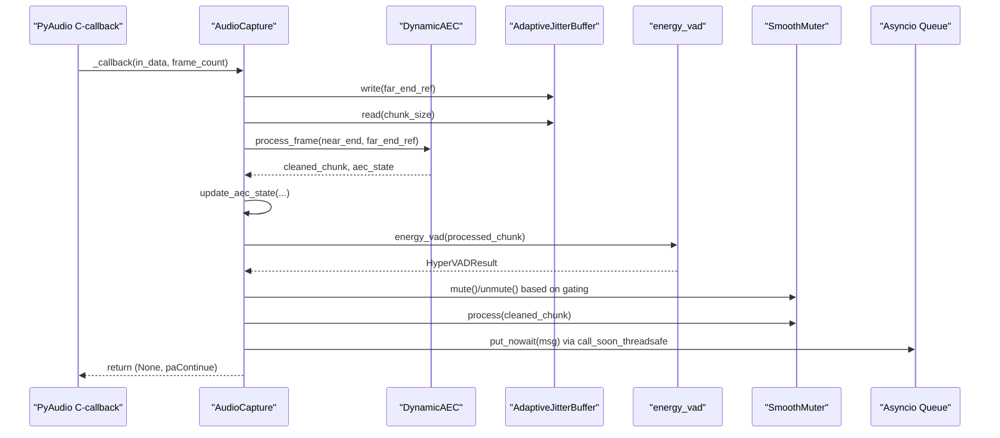

**Diagram sources**
- [capture.py](file://core/audio/capture.py#L329-L509)
- [dynamic_aec.py](file://core/audio/dynamic_aec.py#L579-L668)
- [processing.py](file://core/audio/processing.py#L389-L434)
- [state.py](file://core/audio/state.py#L76-L99)

## Detailed Component Analysis

### AudioCapture: PyAudio C-callback and Direct Async Injection
- Purpose: Minimizes latency by running the entire pipeline in the PyAudio C-thread and injecting directly into the asyncio loop using call_soon_threadsafe.
- Key responsibilities:
  - Read PCM from in_data and convert to int16.
  - Pull far-end reference from audio_state.far_end_pcm and write new far-end to jitter buffer.
  - Call DynamicAEC to clean the microphone signal.
  - Optionally apply Cortex spectral denoising.
  - Update AEC state and telemetry.
  - Determine user speech using AEC heuristics and VAD.
  - Apply hysteresis and smooth muting based on AI playback state.
  - Compute RMS and ZCR, classify silence, and optionally extract affective features.
  - Inject audio into the asyncio queue only when hard speech is detected or AI is silent.
  - Broadcast telemetry and throttle periodic audio telemetry.
- Direct injection: Uses call_soon_threadsafe to push messages into the asyncio queue without crossing threads repeatedly.

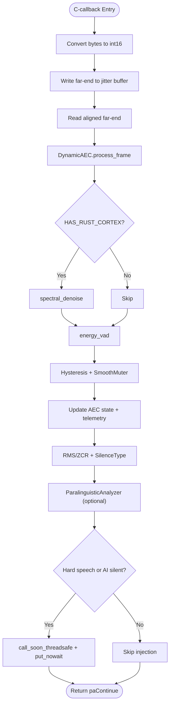

**Diagram sources**
- [capture.py](file://core/audio/capture.py#L329-L509)
- [processing.py](file://core/audio/processing.py#L389-L434)
- [state.py](file://core/audio/state.py#L76-L99)
- [paralinguistics.py](file://core/audio/paralinguistics.py#L132-L213)

**Section sources**
- [capture.py](file://core/audio/capture.py#L193-L575)

### DynamicAEC: Adaptive Echo Cancellation
- Implements GCC-PHAT delay estimation, frequency-domain NLMS filtering, double-talk detection, and ERLE computation.
- Uses ring buffers and bounded accumulators to process blocks efficiently.
- Provides a user-speech heuristic during warm-up using far-end/mic energy coherence.

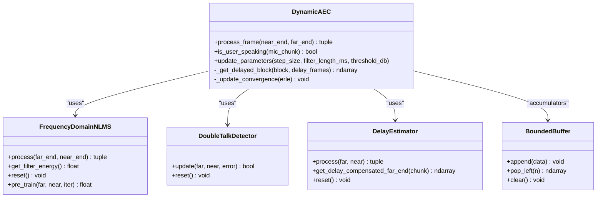

**Diagram sources**
- [dynamic_aec.py](file://core/audio/dynamic_aec.py#L490-L800)

**Section sources**
- [dynamic_aec.py](file://core/audio/dynamic_aec.py#L490-L800)

### Processing Utilities: VAD, RingBuffer, Zero-Crossing
- RingBuffer: Fixed-capacity circular buffer enabling O(1) writes and zero-copy windowed reads for analysis.
- find_zero_crossing: Efficiently finds the first zero-crossing within a lookahead window for clean barge-in cuts.
- energy_vad: Dispatches to Rust backend when available; otherwise uses enhanced multi-feature VAD combining RMS, ZCR, and spectral centroid.
- AdaptiveVAD: Maintains running mean and std of RMS to adapt thresholds dynamically.
- SilentAnalyzer: Classifies silence into void, breathing, or thinking using RMS variance and ZCR.

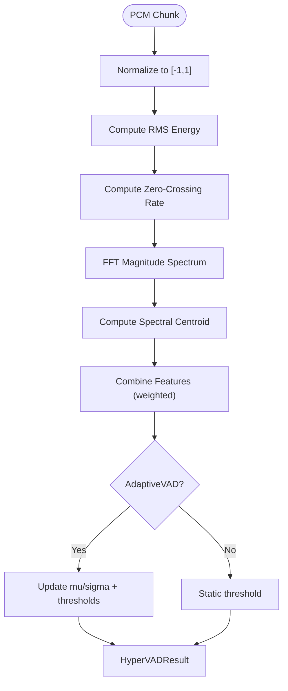

**Diagram sources**
- [processing.py](file://core/audio/processing.py#L437-L507)

**Section sources**
- [processing.py](file://core/audio/processing.py#L107-L508)

### AudioState: Global Audio State Management
- Thread-safe singleton tracking playback state, AEC metrics, RMS/ZCR, silence classification, and telemetry counters.
- Provides atomic updates for AEC state and playback transitions with dedicated locks to avoid race conditions.

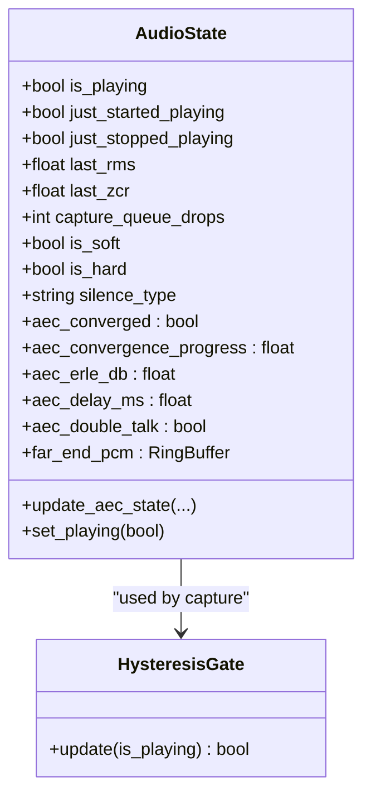

**Diagram sources**
- [state.py](file://core/audio/state.py#L36-L128)

**Section sources**
- [state.py](file://core/audio/state.py#L36-L128)

### Telemetry: Per-Frame Metrics and Session Reports
- AudioTelemetryLogger captures latency, AEC ERLE, convergence, VAD decisions, and queue sizes per frame.
- Aggregates session metrics and publishes real-time stats to the event bus.
- Saves detailed logs to JSON and CSV for offline analysis.

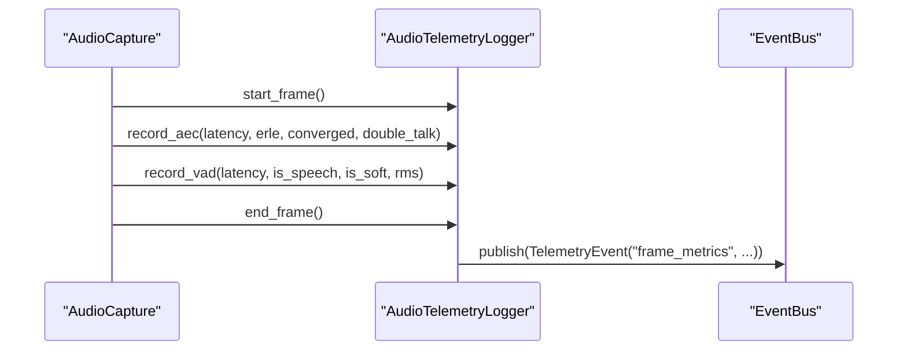

**Diagram sources**
- [telemetry.py](file://core/audio/telemetry.py#L151-L394)
- [capture.py](file://core/audio/capture.py#L329-L509)

**Section sources**
- [telemetry.py](file://core/audio/telemetry.py#L151-L394)

### ParalinguisticAnalyzer: Affective Feature Extraction
- Estimates pitch via autocorrelation, speech rate via envelope peaks, detects transient typing clicks, computes RMS variance, and spectral centroid.
- Produces engagement score and zen mode flag for UI and backchannel logic.

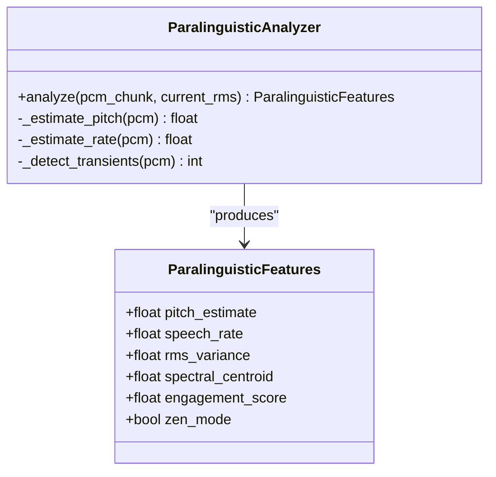

**Diagram sources**
- [paralinguistics.py](file://core/audio/paralinguistics.py#L19-L214)

**Section sources**
- [paralinguistics.py](file://core/audio/paralinguistics.py#L19-L214)

### Playback: Callback and Asyncio Queue Feeding
- PyAudio callback reads from a synchronized buffer and mixes in ambient heartbeat if configured.
- An asyncio feeder pulls audio from the queue and mirrors to UI/WebSocket when connected.
- Provides gain ducking and graceful stopping.

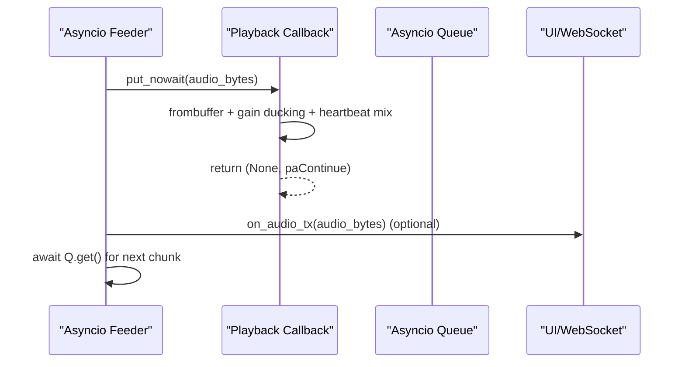

**Diagram sources**
- [playback.py](file://core/audio/playback.py#L61-L203)

**Section sources**
- [playback.py](file://core/audio/playback.py#L52-L203)

### Frontend Integration: Web AudioWorklet and Gapless Playback
- The browser-side PCM encoder converts Float32 to Int16 and posts chunks periodically to the main thread.
- The frontend schedules audio buffer sources gaplessly and tracks active sources for cleanup.

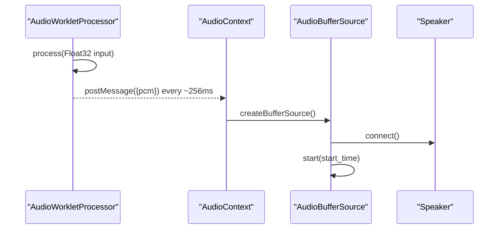

**Diagram sources**
- [pcm-processor.js](file://apps/portal/public/pcm-processor.js#L1-L32)
- [useAudioPipeline.ts](file://apps/portal/src/hooks/useAudioPipeline.ts#L181-L212)

**Section sources**
- [pcm-processor.js](file://apps/portal/public/pcm-processor.js#L1-L32)
- [useAudioPipeline.ts](file://apps/portal/src/hooks/useAudioPipeline.ts#L181-L212)

## Dependency Analysis
- AudioCapture depends on DynamicAEC, AdaptiveJitterBuffer, VAD engines, SmoothMuter, audio_state, and telemetry.
- DynamicAEC depends on frequency-domain NLMS, delay estimation, double-talk detection, and ring buffers.
- Processing utilities depend on numpy and optionally the Rust aether_cortex module.
- Playback depends on asyncio queues and PyAudio.
- Configuration defines runtime parameters for sample rates, chunk sizes, and AEC/VAD tuning.

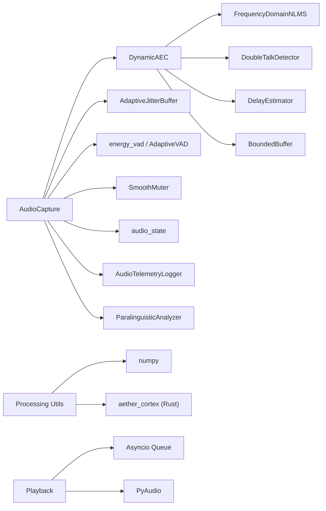

**Diagram sources**
- [capture.py](file://core/audio/capture.py#L193-L575)
- [dynamic_aec.py](file://core/audio/dynamic_aec.py#L490-L800)
- [processing.py](file://core/audio/processing.py#L37-L95)
- [playback.py](file://core/audio/playback.py#L52-L203)

**Section sources**
- [capture.py](file://core/audio/capture.py#L193-L575)
- [dynamic_aec.py](file://core/audio/dynamic_aec.py#L490-L800)
- [processing.py](file://core/audio/processing.py#L37-L95)
- [playback.py](file://core/audio/playback.py#L52-L203)

## Performance Considerations
- Low-allocation calculations:
  - Pre-allocated buffers (RingBuffer, BoundedBuffer) avoid repeated allocations.
  - Vectorized operations using numpy for RMS, ZCR, FFT, and envelope detection.
  - SmoothMuter avoids aliasing by returning new arrays and uses linear ramps.
- Memory-efficient data structures:
  - Circular buffers with fixed capacity and zero-copy reads.
  - Bounded accumulators for AEC block processing.
- Backend dispatch:
  - Automatic Rust backend (aether_cortex) for VAD and zero-crossing when available; NumPy fallback otherwise.
- Timing and chunk sizing:
  - Configurable chunk_size and sample rates balance latency and CPU usage.
  - Jitter buffer compensates for bursty far-end arrivals to stabilize AEC.
- Latency minimization:
  - Direct injection via call_soon_threadsafe eliminates thread-hopping overhead.
  - C-callback executes all stages to reduce scheduling latency.
- Benchmarking:
  - Unit benchmarks measure callback performance targets.
  - Stability and memory growth tests ensure long-running sessions remain healthy.

[No sources needed since this section provides general guidance]

## Troubleshooting Guide
- Device errors:
  - AudioDeviceNotFoundError indicates missing default input device; inspect available devices and retry.
  - Use list_devices() to enumerate and select appropriate indices.
- Queue overflows:
  - _push_to_async_queue drops oldest messages on overflow and increments capture_queue_drops; monitor telemetry counters.
- AEC convergence issues:
  - Monitor aec_convergence_progress and erle_db; adjust filter_length_ms and step_size via update_parameters.
- VAD sensitivity:
  - Tune vad_energy_threshold and adaptive thresholds; consider environment-specific noise floors.
- Latency spikes:
  - Review AudioTelemetryLogger session metrics; investigate frame drops and jitter.
- Frontend audio glitches:
  - Verify Web AudioWorklet chunk sizes and gapless scheduling; ensure proper buffer durations.

**Section sources**
- [errors.py](file://core/utils/errors.py#L35-L41)
- [capture.py](file://core/audio/capture.py#L298-L327)
- [dynamic_aec.py](file://core/audio/dynamic_aec.py#L780-L800)
- [telemetry.py](file://core/audio/telemetry.py#L280-L320)
- [pcm-processor.js](file://apps/portal/public/pcm-processor.js#L1-L32)
- [useAudioPipeline.ts](file://apps/portal/src/hooks/useAudioPipeline.ts#L181-L212)

## Conclusion
The Thalamic Gate V2 real-time audio system achieves sub-20ms latency by running the entire pipeline in the PyAudio C-callback, leveraging direct asyncio injection, and optimizing data structures and DSP operations. Dynamic AEC stabilizes echo cancellation, Cortex acceleration enhances spectral quality, and VAD plus affective analytics power responsive interaction. Robust telemetry, configuration, and error handling ensure reliable operation across diverse environments and extended sessions.

[No sources needed since this section summarizes without analyzing specific files]

## Appendices

### Callback Timing Requirements and Chunk Size Considerations
- chunk_size: Balances latency and CPU usage; smaller chunks reduce latency but increase CPU load.
- sample rates: send_sample_rate for capture and receive_sample_rate for playback should align with AI model expectations.
- jitter buffer: Compensates for variable far-end arrival to maintain stable AEC convergence.

**Section sources**
- [config.py](file://core/infra/config.py#L11-L44)
- [capture.py](file://core/audio/capture.py#L511-L539)

### Coordination with External Audio Sources (AI Playback)
- Far-end PCM is continuously written to audio_state.far_end_pcm; capture reads last N samples to reconstruct the reference.
- Playback callback reads from an asyncio queue and mirrors audio to UI/WebSocket when enabled.

**Section sources**
- [capture.py](file://core/audio/capture.py#L346-L351)
- [playback.py](file://core/audio/playback.py#L139-L192)
- [state.py](file://core/audio/state.py#L72-L73)

### Debugging Techniques
- Use test_thalamic_gate_benchmark to measure callback performance and ensure targets are met.
- Inspect AudioTelemetryLogger real-time stats and session reports for latency and jitter trends.
- Validate configuration via load_config and confirm environment variables are correctly applied.
- Monitor capture_queue_drops and AEC metrics to identify bottlenecks.

**Section sources**
- [test_thalamic_gate_benchmark.py](file://tests/benchmarks/test_thalamic_gate_benchmark.py#L79-L108)
- [telemetry.py](file://core/audio/telemetry.py#L322-L339)
- [config.py](file://core/infra/config.py#L130-L175)
- [test_latency.py](file://tests/unit/test_latency.py#L1-L68)
- [benchmark.py](file://infra/scripts/benchmark.py#L135-L168)