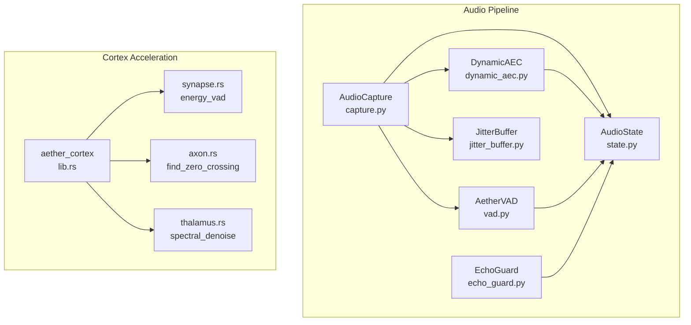
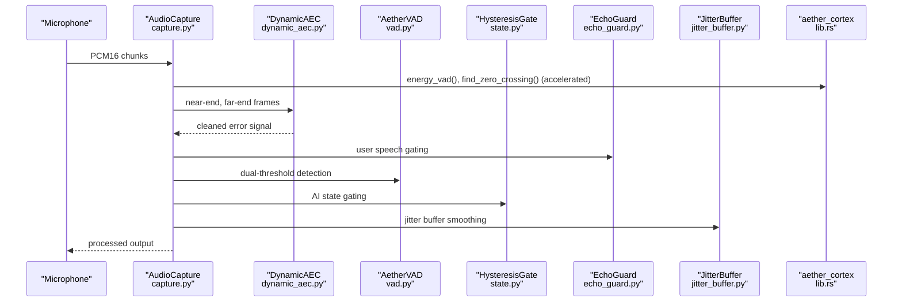
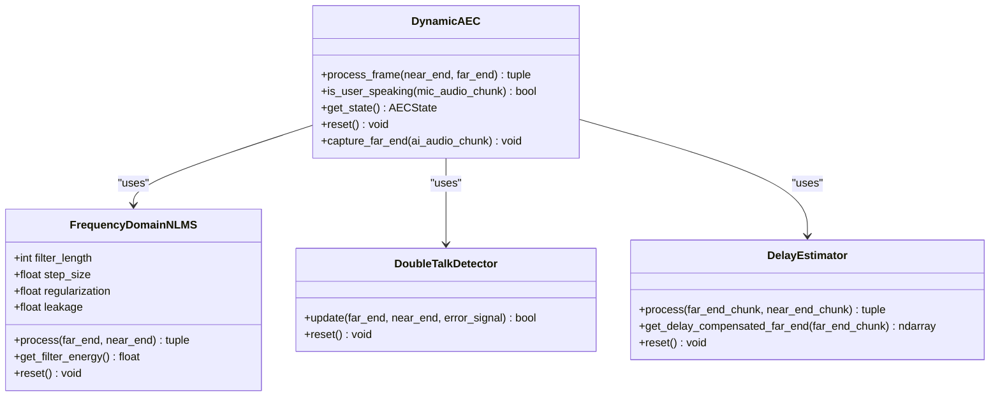
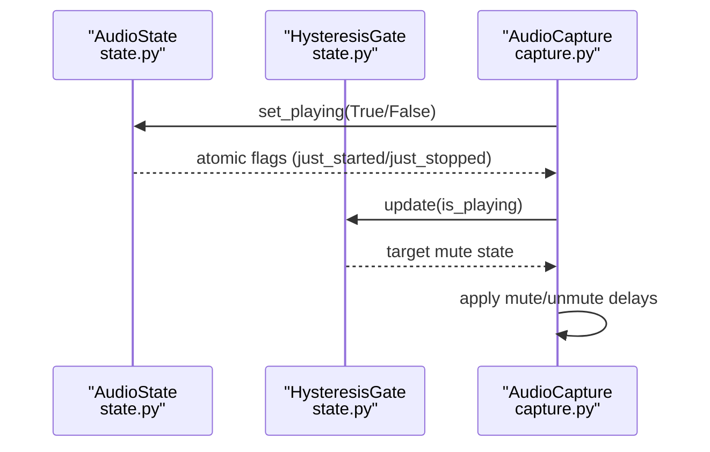
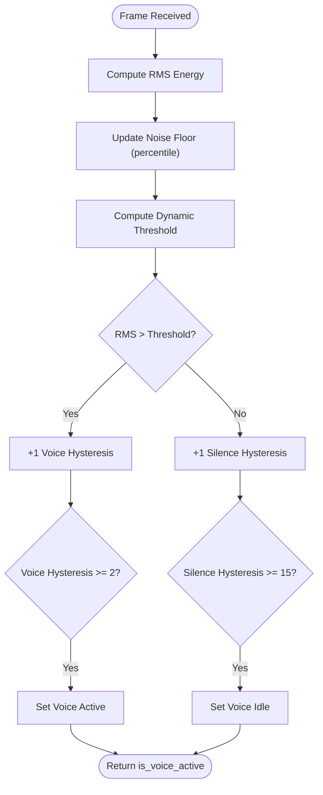
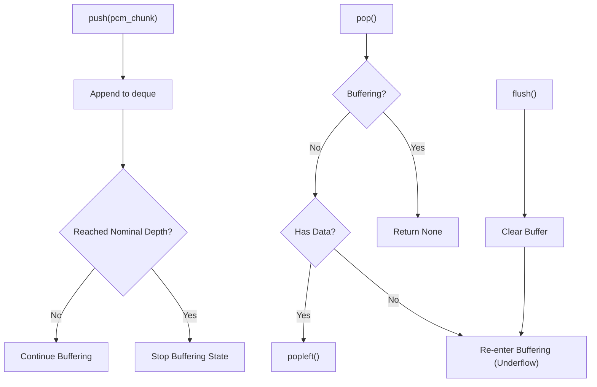
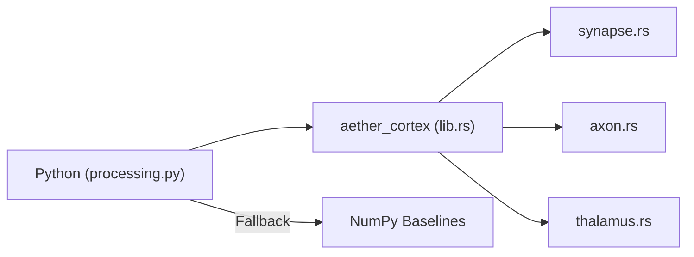
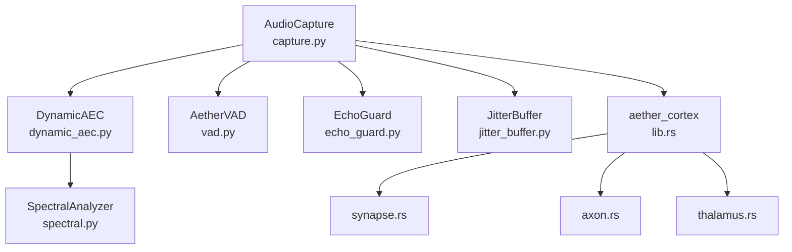

# Thalamic Gate V2 Algorithm

<cite>
**Referenced Files in This Document**
- [dynamic_aec.py](file://core/audio/dynamic_aec.py)
- [spectral.py](file://core/audio/spectral.py)
- [capture.py](file://core/audio/capture.py)
- [processing.py](file://core/audio/processing.py)
- [vad.py](file://core/audio/vad.py)
- [echo_guard.py](file://core/audio/echo_guard.py)
- [state.py](file://core/audio/state.py)
- [jitter_buffer.py](file://core/audio/jitter_buffer.py)
- [lib.rs](file://cortex/src/lib.rs)
- [synapse.rs](file://cortex/src/synapse.rs)
- [axon.rs](file://cortex/src/axon.rs)
- [thalamus.rs](file://cortex/src/thalamus.rs)
- [bench_dsp.py](file://tests/benchmarks/bench_dsp.py)
- [voice_quality_benchmark.py](file://tests/benchmarks/voice_quality_benchmark.py)
- [latency.py](file://core/analytics/latency.py)
- [thalamic.py](file://core/ai/thalamic.py)
</cite>

## Table of Contents
1. [Introduction](#introduction)
2. [Project Structure](#project-structure)
3. [Core Components](#core-components)
4. [Architecture Overview](#architecture-overview)
5. [Detailed Component Analysis](#detailed-component-analysis)
6. [Dependency Analysis](#dependency-analysis)
7. [Performance Considerations](#performance-considerations)
8. [Troubleshooting Guide](#troubleshooting-guide)
9. [Conclusion](#conclusion)
10. [Appendices](#appendices)

## Introduction
This document describes the Thalamic Gate V2 algorithm, the core audio processing engine of Aether Voice OS. It details the software-defined Acoustic Echo Cancellation (AEC) implementation that replaces hardware DSP with advanced adaptive filtering, including the dual-path LMS algorithm with convergence monitoring, step-size adaptation, and double-talk detection. It documents the hysteresis gating mechanism that prevents false triggering during AI playback, including AI state tracking and user speech detection logic. It also covers the RMS energy detection system, zero-crossing rate analysis, and multi-feature VAD implementation, along with the adaptive jitter buffer for smoothing bursty audio arrivals and preventing AEC convergence loss. Finally, it provides technical specifications, integration with the Rust-based Cortex acceleration layer, configuration parameters, troubleshooting guidance, and real-world latency measurements.

## Project Structure
The Thalamic Gate V2 spans several modules:
- Audio processing and AEC: dynamic_aec.py, spectral.py, processing.py, vad.py, echo_guard.py, state.py, jitter_buffer.py
- Cortex acceleration layer: lib.rs, synapse.rs, axon.rs, thalamus.rs
- Pipeline orchestration: capture.py
- Benchmarks and latency tracking: bench_dsp.py, voice_quality_benchmark.py, latency.py
- AI-driven gating: thalamic.py

**Diagram sources**
- [capture.py](file://core/audio/capture.py#L193-L550)
- [dynamic_aec.py](file://core/audio/dynamic_aec.py#L448-L776)
- [vad.py](file://core/audio/vad.py#L14-L82)
- [echo_guard.py](file://core/audio/echo_guard.py#L14-L98)
- [jitter_buffer.py](file://core/audio/jitter_buffer.py#L13-L63)
- [state.py](file://core/audio/state.py#L36-L129)
- [lib.rs](file://cortex/src/lib.rs#L1-L34)
- [synapse.rs](file://cortex/src/synapse.rs#L1-L117)
- [axon.rs](file://cortex/src/axon.rs#L1-L121)
- [thalamus.rs](file://cortex/src/thalamus.rs#L1-L154)

**Section sources**
- [capture.py](file://core/audio/capture.py#L193-L550)
- [dynamic_aec.py](file://core/audio/dynamic_aec.py#L448-L776)
- [processing.py](file://core/audio/processing.py#L37-L96)
- [lib.rs](file://cortex/src/lib.rs#L1-L34)

## Core Components
- Dynamic Acoustic Echo Cancellation (AEC): Frequency-domain NLMS adaptive filter with GCC-PHAT delay estimation, double-talk detection, and ERLE computation.
- Hysteresis Gate: Prevents false triggering during AI playback using AI state tracking and gating logic.
- Voice Activity Detection (VAD): RMS-based with hysteresis and multi-feature enhancements (ZCR, spectral centroid).
- Echo Guard: Spectral identity matching to suppress echo by distinguishing “Self” vs “User.”
- Adaptive Jitter Buffer: Smoothes bursty far-end arrivals to stabilize AEC convergence.
- Cortex Acceleration: Rust-backed primitives for VAD, zero-crossing detection, and spectral denoise.

**Section sources**
- [dynamic_aec.py](file://core/audio/dynamic_aec.py#L100-L210)
- [dynamic_aec.py](file://core/audio/dynamic_aec.py#L211-L330)
- [dynamic_aec.py](file://core/audio/dynamic_aec.py#L332-L446)
- [state.py](file://core/audio/state.py#L13-L34)
- [vad.py](file://core/audio/vad.py#L14-L82)
- [echo_guard.py](file://core/audio/echo_guard.py#L14-L98)
- [jitter_buffer.py](file://core/audio/jitter_buffer.py#L13-L63)
- [processing.py](file://core/audio/processing.py#L37-L96)

## Architecture Overview
The Thalamic Gate V2 integrates real-time audio capture, AEC, VAD, gating, and Cortex acceleration into a cohesive pipeline. The Cortex layer provides high-performance primitives that replace NumPy implementations when available.

**Diagram sources**
- [capture.py](file://core/audio/capture.py#L193-L550)
- [dynamic_aec.py](file://core/audio/dynamic_aec.py#L448-L776)
- [processing.py](file://core/audio/processing.py#L37-L96)
- [vad.py](file://core/audio/vad.py#L14-L82)
- [state.py](file://core/audio/state.py#L13-L34)
- [echo_guard.py](file://core/audio/echo_guard.py#L14-L98)
- [jitter_buffer.py](file://core/audio/jitter_buffer.py#L13-L63)
- [lib.rs](file://cortex/src/lib.rs#L1-L34)

## Detailed Component Analysis

### Dynamic Acoustic Echo Cancellation (AEC)
- Dual-path LMS (frequency-domain NLMS): Overlap-save FFT processing, normalized step-size, leakage factor, and power-normalized adaptation.
- GCC-PHAT delay estimation: Adaptive delay tracking with smoothing and confidence.
- Double-talk detection: Energy ratio, residual energy, and spectral coherence tests with hangover logic.
- ERLE computation: Per-block echo suppression performance tracking.
- Convergence monitoring: Sustained ERLE thresholds and progress tracking.

**Diagram sources**
- [dynamic_aec.py](file://core/audio/dynamic_aec.py#L100-L210)
- [dynamic_aec.py](file://core/audio/dynamic_aec.py#L211-L330)
- [dynamic_aec.py](file://core/audio/dynamic_aec.py#L332-L446)
- [dynamic_aec.py](file://core/audio/dynamic_aec.py#L448-L776)

**Section sources**
- [dynamic_aec.py](file://core/audio/dynamic_aec.py#L100-L210)
- [dynamic_aec.py](file://core/audio/dynamic_aec.py#L211-L330)
- [dynamic_aec.py](file://core/audio/dynamic_aec.py#L332-L446)
- [dynamic_aec.py](file://core/audio/dynamic_aec.py#L448-L776)
- [spectral.py](file://core/audio/spectral.py#L387-L454)
- [spectral.py](file://core/audio/spectral.py#L457-L501)

### Hysteresis Gate and AI State Tracking
- HysteresisGate: Smooth transitions to prevent rapid toggling and clicks.
- AudioState: Thread-safe singleton tracking AI playback state, AEC telemetry, and capture metrics.
- Integration: Base hysteresis update on AI state; delay compensation on start/stop transitions.

**Diagram sources**
- [state.py](file://core/audio/state.py#L13-L34)
- [state.py](file://core/audio/state.py#L36-L129)
- [capture.py](file://core/audio/capture.py#L338-L372)

**Section sources**
- [state.py](file://core/audio/state.py#L13-L34)
- [state.py](file://core/audio/state.py#L36-L129)
- [capture.py](file://core/audio/capture.py#L338-L372)

### Voice Activity Detection (VAD)
- AetherVAD: RMS energy with hysteresis gating and dynamic thresholding based on ambient noise floor.
- Multi-feature VAD: Enhanced multi-feature detector combining RMS, ZCR, and spectral centroid with adaptive thresholds.

**Diagram sources**
- [vad.py](file://core/audio/vad.py#L14-L82)
- [processing.py](file://core/audio/processing.py#L256-L323)
- [processing.py](file://core/audio/processing.py#L389-L507)

**Section sources**
- [vad.py](file://core/audio/vad.py#L14-L82)
- [processing.py](file://core/audio/processing.py#L256-L323)
- [processing.py](file://core/audio/processing.py#L389-L507)

### Echo Guard (Thalamic Filter)
- Acoustic Identity Engine: Caches spectral fingerprints of system output and compares incoming microphone audio to suppress echo.
- Hysteresis and conflict checks: Prevent false gating and handle delay compensation naturally.

**Diagram sources**
- [echo_guard.py](file://core/audio/echo_guard.py#L52-L98)

**Section sources**
- [echo_guard.py](file://core/audio/echo_guard.py#L14-L98)

### Adaptive Jitter Buffer
- Purpose: Smooth bursty far-end arrivals to prevent AEC convergence loss while meeting sub-200ms latency targets.
- Operation: Circular buffer with nominal depth and underflow handling.

**Diagram sources**
- [jitter_buffer.py](file://core/audio/jitter_buffer.py#L13-L63)

**Section sources**
- [jitter_buffer.py](file://core/audio/jitter_buffer.py#L13-L63)

### Cortex Acceleration Layer
- aether_cortex module exposes optimized primitives:
  - energy_vad: RMS-based VAD
  - find_zero_crossing: Click-free cut points
  - spectral_denoise: Noise gate (placeholder)
- Automatic fallback to NumPy when Rust backend is unavailable.

**Diagram sources**
- [lib.rs](file://cortex/src/lib.rs#L1-L34)
- [synapse.rs](file://cortex/src/synapse.rs#L1-L117)
- [axon.rs](file://cortex/src/axon.rs#L1-L121)
- [thalamus.rs](file://cortex/src/thalamus.rs#L1-L154)
- [processing.py](file://core/audio/processing.py#L37-L96)

**Section sources**
- [lib.rs](file://cortex/src/lib.rs#L1-L34)
- [synapse.rs](file://cortex/src/synapse.rs#L1-L117)
- [axon.rs](file://cortex/src/axon.rs#L1-L121)
- [thalamus.rs](file://cortex/src/thalamus.rs#L1-L154)
- [processing.py](file://core/audio/processing.py#L37-L96)

## Dependency Analysis
- DynamicAEC depends on SpectralAnalyzer for coherence and ERLE computations.
- AudioCapture orchestrates AEC, VAD, EchoGuard, JitterBuffer, and Cortex acceleration.
- Cortex backend is conditionally loaded with automatic fallback.

**Diagram sources**
- [dynamic_aec.py](file://core/audio/dynamic_aec.py#L448-L776)
- [spectral.py](file://core/audio/spectral.py#L250-L385)
- [capture.py](file://core/audio/capture.py#L193-L550)
- [vad.py](file://core/audio/vad.py#L14-L82)
- [echo_guard.py](file://core/audio/echo_guard.py#L14-L98)
- [jitter_buffer.py](file://core/audio/jitter_buffer.py#L13-L63)
- [lib.rs](file://cortex/src/lib.rs#L1-L34)

**Section sources**
- [dynamic_aec.py](file://core/audio/dynamic_aec.py#L448-L776)
- [spectral.py](file://core/audio/spectral.py#L250-L385)
- [capture.py](file://core/audio/capture.py#L193-L550)
- [processing.py](file://core/audio/processing.py#L37-L96)

## Performance Considerations
- Latency targets: Sub-200ms end-to-end; measured Thalamic Gate latency benchmark targets < 2 ms per frame.
- Cortex acceleration: Up to 10–50x speedup for VAD and zero-crossing detection versus NumPy.
- Buffering and jitter: Jitter buffer balances smoothness and latency; underflow triggers re-buffering.
- Convergence: ERLE thresholds and sustained progress ensure stable AEC performance.

**Section sources**
- [voice_quality_benchmark.py](file://tests/benchmarks/voice_quality_benchmark.py#L717-L766)
- [bench_dsp.py](file://tests/benchmarks/bench_dsp.py#L1-L134)
- [latency.py](file://core/analytics/latency.py#L7-L39)

## Troubleshooting Guide
Common audio quality issues and remedies:
- Echo persists or unstable convergence
  - Verify ERLE tracking and convergence thresholds; ensure adequate filter length and step size.
  - Confirm double-talk detection is functioning to suspend adaptation during user speech.
- Clicks or pops during AI playback
  - Use SmoothMuter and HysteresisGate to avoid abrupt gain changes.
  - Ensure zero-crossing detection is used for clean cuts during barge-in.
- False gating during AI playback
  - Review AI state flags and hysteresis timing; confirm delay compensation on start/stop.
- Noisy background or low SNR
  - Enable Cortex acceleration for VAD and spectral denoise; adjust thresholds and windows.
  - Use EchoGuard’s identity matching to suppress residual echo.

**Section sources**
- [dynamic_aec.py](file://core/audio/dynamic_aec.py#L670-L733)
- [capture.py](file://core/audio/capture.py#L338-L372)
- [processing.py](file://core/audio/processing.py#L107-L202)
- [echo_guard.py](file://core/audio/echo_guard.py#L52-L98)

## Conclusion
Thalamic Gate V2 delivers a software-defined AEC pipeline that leverages adaptive filtering, double-talk detection, and convergence monitoring to replace hardware DSP. It integrates hysteresis gating, multi-feature VAD, and spectral identity matching to prevent false triggering and echo leakage. The Cortex acceleration layer ensures sub-200ms latency targets, while the adaptive jitter buffer stabilizes AEC performance under bursty conditions. Together, these components form a robust, real-time audio processing engine suitable for live voice applications.

## Appendices

### Technical Specifications
- Sampling rate: 16 kHz
- Frame size: 256–1600 samples (configurable)
- Filter length: 100 ms (rounded to power-of-two, minimum 512 samples)
- Step size: 0.5 (adjustable)
- Convergence threshold: >15 dB ERLE (configurable)
- Double-talk hangover: 10 frames
- Delay estimation: up to 200 ms with smoothing
- Jitter buffer: 500 ms capacity, 100 ms nominal, 20 ms packet size
- Latency target: < 200 ms end-to-end; < 2 ms Thalamic Gate per frame

**Section sources**
- [dynamic_aec.py](file://core/audio/dynamic_aec.py#L458-L536)
- [jitter_buffer.py](file://core/audio/jitter_buffer.py#L19-L26)
- [voice_quality_benchmark.py](file://tests/benchmarks/voice_quality_benchmark.py#L717-L766)

### Configuration Parameters
- DynamicAEC
  - sample_rate: 16000
  - frame_size: 256
  - filter_length_ms: 100
  - step_size: 0.5
  - convergence_threshold_db: 15
- AetherVAD
  - sample_rate: 16000
  - frame_duration_ms: 20
- EchoGuard
  - window_size_sec: 3.0
  - sample_rate: 16000
- JitterBuffer
  - capacity_ms: 500
  - nominal_ms: 100
  - packet_size_ms: 20

**Section sources**
- [dynamic_aec.py](file://core/audio/dynamic_aec.py#L458-L536)
- [vad.py](file://core/audio/vad.py#L20-L22)
- [echo_guard.py](file://core/audio/echo_guard.py#L20-L23)
- [jitter_buffer.py](file://core/audio/jitter_buffer.py#L19-L26)

### Real-World Latency Measurements
- Thalamic Gate latency benchmark: < 2 ms average per frame
- Latency optimizer: Tracks p50, p95, p99 metrics for system-wide latency

**Section sources**
- [voice_quality_benchmark.py](file://tests/benchmarks/voice_quality_benchmark.py#L717-L766)
- [latency.py](file://core/analytics/latency.py#L19-L39)

### AI-Driven Gating
- ThalamicGate monitors audio state and emotional indices to trigger proactive interventions when user frustration is detected.

**Section sources**
- [thalamic.py](file://core/ai/thalamic.py#L11-L121)