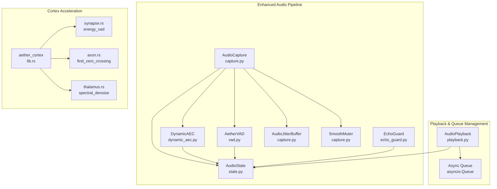
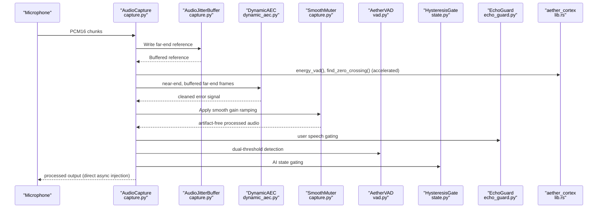
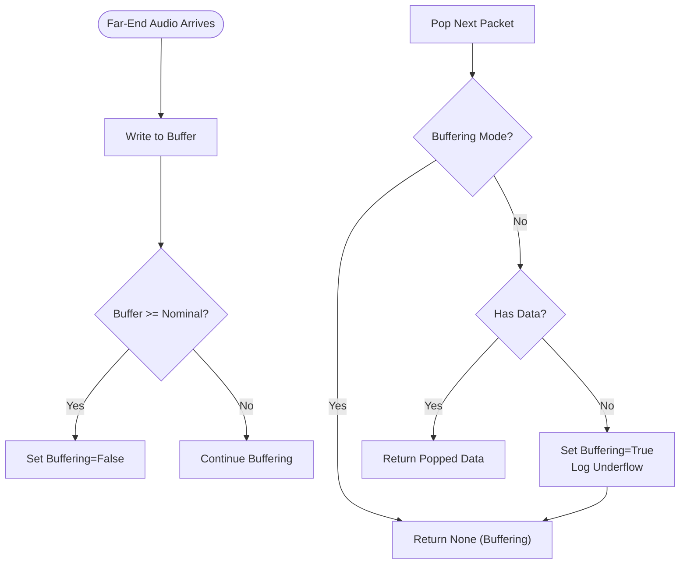
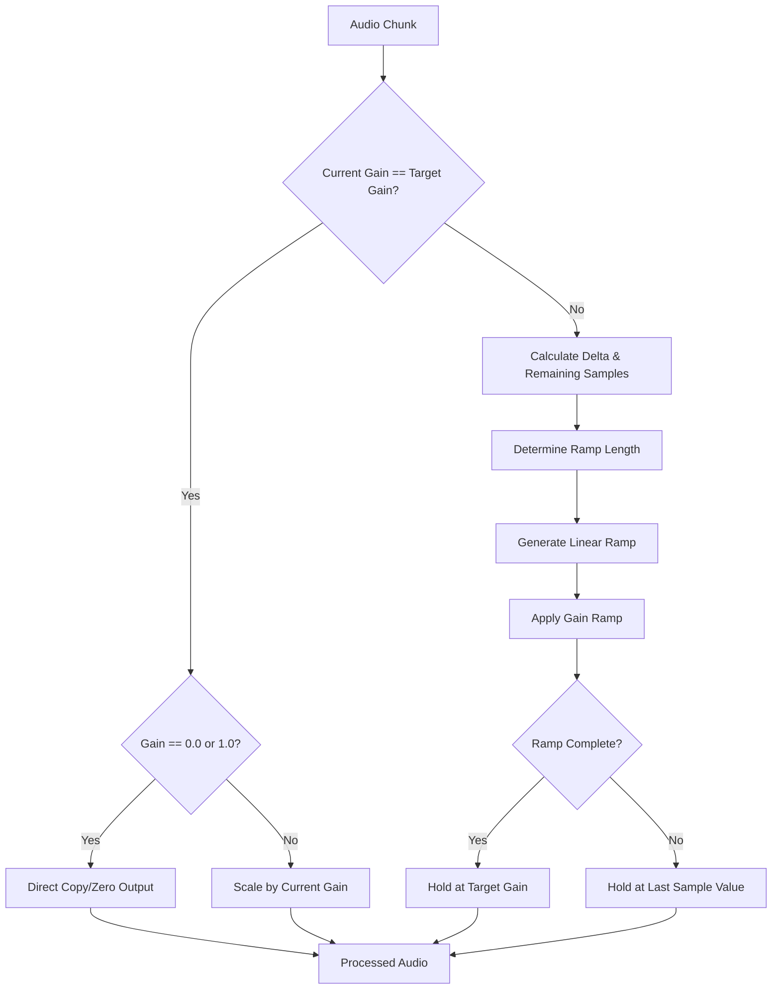
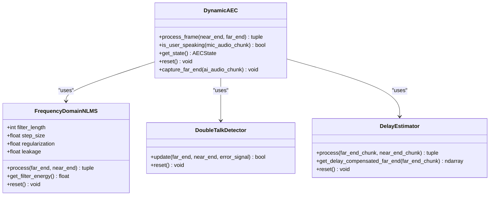
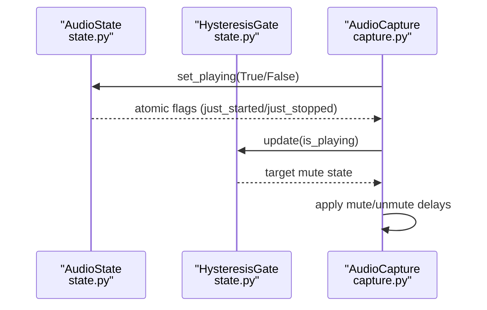
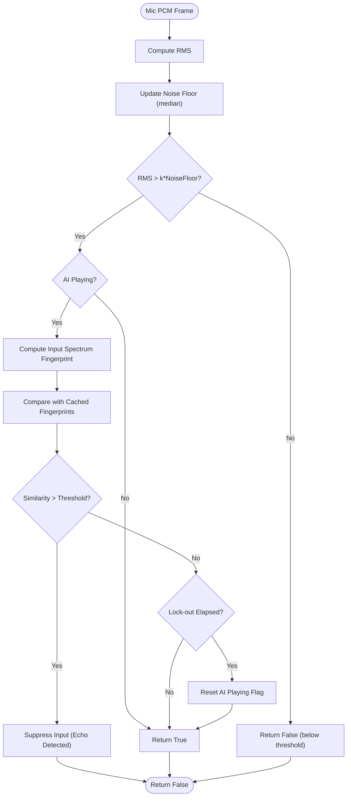
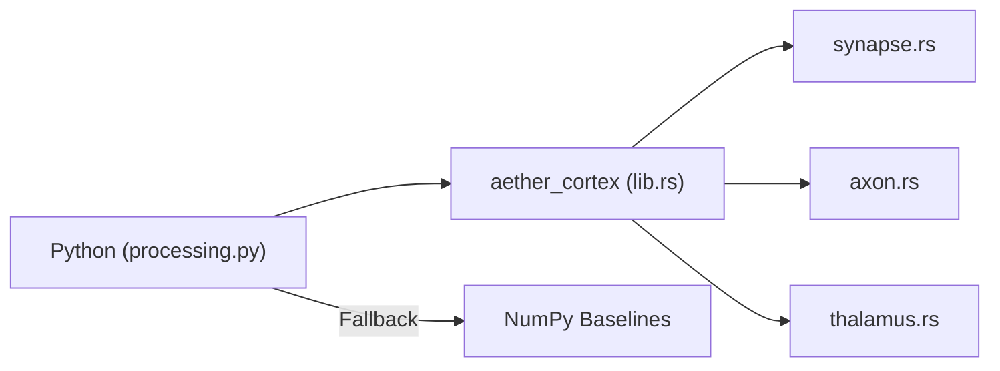
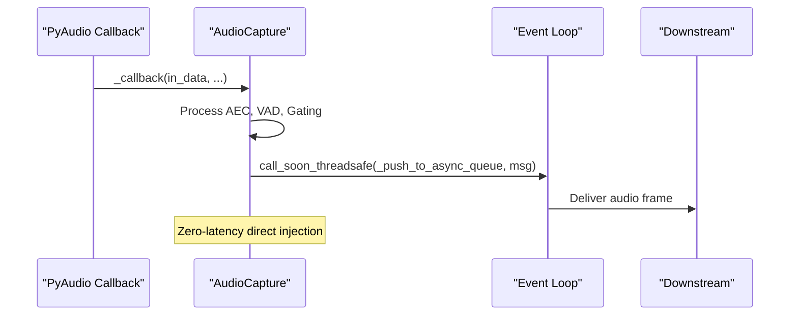
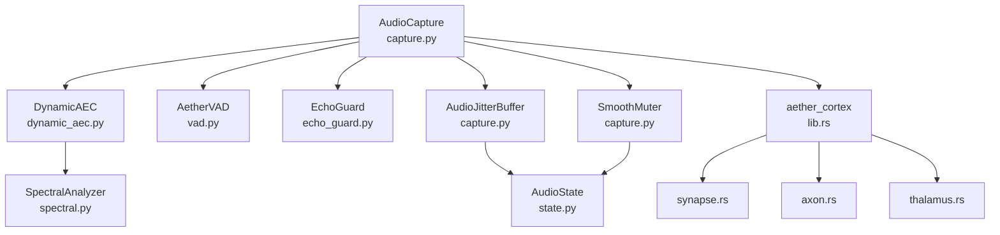

# Thalamic Gate V2 Algorithm

<cite>
**Referenced Files in This Document**
- [dynamic_aec.py](file://core/audio/dynamic_aec.py)
- [spectral.py](file://core/audio/spectral.py)
- [capture.py](file://core/audio/capture.py)
- [processing.py](file://core/audio/processing.py)
- [vad.py](file://core/audio/vad.py)
- [echo_guard.py](file://core/audio/echo_guard.py)
- [state.py](file://core/audio/state.py)
- [jitter_buffer.py](file://core/audio/jitter_buffer.py)
- [playback.py](file://core/audio/playback.py)
- [lib.rs](file://cortex/src/lib.rs)
- [synapse.rs](file://cortex/src/synapse.rs)
- [axon.rs](file://cortex/src/axon.rs)
- [thalamus.rs](file://cortex/src/thalamus.rs)
- [bench_dsp.py](file://tests/benchmarks/bench_dsp.py)
- [voice_quality_benchmark.py](file://tests/benchmarks/voice_quality_benchmark.py)
- [latency.py](file://core/analytics/latency.py)
- [thalamic.py](file://core/ai/thalamic.py)
- [config.py](file://core/infra/config.py)
</cite>

## Update Summary
**Changes Made**
- Enhanced Adaptive Jitter Buffer with new AudioJitterBuffer class replacing the previous implementation
- Added SmoothMuter functionality for graceful gain ramping to prevent clicks and pops
- Improved audio callback integration with asyncio queues for zero-latency direct injection
- Updated AudioCapture architecture to use direct event-loop injection eliminating thread-hopping latency
- Added comprehensive jitter buffer testing and smooth muter validation

## Table of Contents
1. [Introduction](#introduction)
2. [Project Structure](#project-structure)
3. [Core Components](#core-components)
4. [Architecture Overview](#architecture-overview)
5. [Detailed Component Analysis](#detailed-component-analysis)
6. [Dependency Analysis](#dependency-analysis)
7. [Performance Considerations](#performance-considerations)
8. [Troubleshooting Guide](#troubleshooting-guide)
9. [Conclusion](#conclusion)
10. [Appendices](#appendices)

## Introduction
This document describes the Thalamic Gate V2 algorithm, the core audio processing engine of Aether Voice OS. It details the software-defined Acoustic Echo Cancellation (AEC) implementation that replaces hardware DSP with advanced adaptive filtering, including the dual-path LMS algorithm with convergence monitoring, step-size adaptation, and double-talk detection. It documents the hysteresis gating mechanism that prevents false triggering during AI playback, including AI state tracking and user speech detection logic. It also covers the RMS energy detection system, zero-crossing rate analysis, and multi-feature VAD implementation, along with the enhanced adaptive jitter buffer for smoothing bursty audio arrivals and preventing AEC convergence loss. The algorithm now features sophisticated smooth muting to eliminate audio artifacts and improved asyncio integration for optimal real-time performance. Finally, it provides technical specifications, integration with the Rust-based Cortex acceleration layer, configuration parameters, troubleshooting guidance, and real-world latency measurements.

## Project Structure
The Thalamic Gate V2 spans several modules with enhanced real-time audio processing capabilities:
- Audio processing and AEC: dynamic_aec.py, spectral.py, processing.py, vad.py, echo_guard.py, state.py
- Enhanced jitter buffer: AudioJitterBuffer class with adaptive buffering
- Smooth muting: SmoothMuter for graceful gain transitions
- Audio capture and playback: capture.py, playback.py
- Cortex acceleration layer: lib.rs, synapse.rs, axon.rs, thalamus.rs
- Pipeline orchestration: capture.py
- Benchmarks and latency tracking: bench_dsp.py, voice_quality_benchmark.py, latency.py
- AI-driven gating: thalamic.py
- Configuration management: config.py

**Diagram sources**
- [capture.py](file://core/audio/capture.py#L195-L584)
- [dynamic_aec.py](file://core/audio/dynamic_aec.py#L448-L776)
- [vad.py](file://core/audio/vad.py#L14-L82)
- [echo_guard.py](file://core/audio/echo_guard.py#L14-L98)
- [playback.py](file://core/audio/playback.py#L30-L200)
- [state.py](file://core/audio/state.py#L36-L159)
- [lib.rs](file://cortex/src/lib.rs#L1-L34)
- [synapse.rs](file://cortex/src/synapse.rs#L1-L117)
- [axon.rs](file://cortex/src/axon.rs#L1-L121)
- [thalamus.rs](file://cortex/src/thalamus.rs#L1-L154)

**Section sources**
- [capture.py](file://core/audio/capture.py#L195-L584)
- [dynamic_aec.py](file://core/audio/dynamic_aec.py#L448-L776)
- [processing.py](file://core/audio/processing.py#L37-L96)
- [lib.rs](file://cortex/src/lib.rs#L1-L34)

## Core Components
- Dynamic Acoustic Echo Cancellation (AEC): Frequency-domain NLMS adaptive filter with GCC-PHAT delay estimation, double-talk detection, and ERLE computation.
- Enhanced Adaptive Jitter Buffer: AudioJitterBuffer class with circular buffering, nominal depth control, and burst smoothing for AEC reference signals.
- Smooth Muter: Graceful gain ramping system that eliminates clicks/pops during mute/unmute transitions with deterministic ramping.
- Hysteresis Gate: Prevents false triggering during AI playback using AI state tracking and gating logic.
- Voice Activity Detection (VAD): RMS-based with hysteresis and multi-feature enhancements (ZCR, spectral centroid).
- Echo Guard: Spectral identity matching to suppress echo by distinguishing "Self" vs "User."
- Cortex Acceleration: Rust-backed primitives for VAD, zero-crossing detection, and spectral denoise.
- Async Queue Integration: Zero-latency direct injection into asyncio event loop eliminates thread-hopping overhead.

**Section sources**
- [dynamic_aec.py](file://core/audio/dynamic_aec.py#L100-L210)
- [dynamic_aec.py](file://core/audio/dynamic_aec.py#L211-L330)
- [dynamic_aec.py](file://core/audio/dynamic_aec.py#L332-L446)
- [capture.py](file://core/audio/capture.py#L37-L106)
- [capture.py](file://core/audio/capture.py#L108-L193)
- [state.py](file://core/audio/state.py#L13-L34)
- [vad.py](file://core/audio/vad.py#L14-L82)
- [echo_guard.py](file://core/audio/echo_guard.py#L14-L98)
- [playback.py](file://core/audio/playback.py#L30-L53)
- [processing.py](file://core/audio/processing.py#L37-L96)

## Architecture Overview
The Thalamic Gate V2 integrates real-time audio capture, enhanced AEC, VAD, gating, and Cortex acceleration into a cohesive pipeline with improved asyncio integration. The new AudioJitterBuffer provides adaptive buffering for bursty far-end arrivals, while SmoothMuter ensures seamless mute/unmute transitions. The architecture uses direct event-loop injection to minimize latency and eliminate thread-hopping overhead.

**Diagram sources**
- [capture.py](file://core/audio/capture.py#L331-L518)
- [capture.py](file://core/audio/capture.py#L37-L106)
- [dynamic_aec.py](file://core/audio/dynamic_aec.py#L448-L776)
- [processing.py](file://core/audio/processing.py#L37-L96)
- [vad.py](file://core/audio/vad.py#L14-L82)
- [state.py](file://core/audio/state.py#L13-L34)
- [echo_guard.py](file://core/audio/echo_guard.py#L14-L98)
- [lib.rs](file://cortex/src/lib.rs#L1-L34)

## Detailed Component Analysis

### Enhanced Adaptive Jitter Buffer
The new AudioJitterBuffer provides sophisticated adaptive buffering for AEC reference signals, replacing the previous implementation with improved burst handling and latency control.

- **Circular Buffer Architecture**: Uses collections.deque with configurable capacity and nominal depth
- **Burst Smoothing**: Maintains smooth far-end reference signal despite network jitter and bursty arrivals
- **Latency Control**: Balances sub-200ms latency requirements with playback smoothness
- **Underflow Handling**: Automatic re-buffering when buffer becomes empty

**Diagram sources**
- [capture.py](file://core/audio/capture.py#L37-L106)

**Section sources**
- [capture.py](file://core/audio/capture.py#L37-L106)
- [tests/unit/test_jitter_buffer.py](file://tests/unit/test_jitter_buffer.py#L1-L56)

### Smooth Muter for Artifact-Free Transitions
The SmoothMuter eliminates audio artifacts during mute/unmute transitions by applying deterministic gain ramps over configurable sample durations.

- **Deterministic Ramping**: Linear ramps with exact target landing to prevent discontinuities
- **Click Prevention**: Smooth sample-to-sample transitions with controlled maximum differences
- **Memory Optimization**: Minimal allocations and branching for real-time performance
- **Multi-Chunk Support**: Handles ramp completion across multiple audio chunks seamlessly

**Diagram sources**
- [capture.py](file://core/audio/capture.py#L108-L193)

**Section sources**
- [capture.py](file://core/audio/capture.py#L108-L193)
- [tests/unit/test_smooth_muter.py](file://tests/unit/test_smooth_muter.py#L1-L193)

### Dynamic Acoustic Echo Cancellation (AEC)
- Dual-path LMS (frequency-domain NLMS): Overlap-save FFT processing, normalized step-size, leakage factor, and power-normalized adaptation.
- GCC-PHAT delay estimation: Adaptive delay tracking with smoothing and confidence.
- Double-talk detection: Energy ratio, residual energy, and spectral coherence tests with hangover logic.
- ERLE computation: Per-block echo suppression performance tracking.
- Convergence monitoring: Sustained ERLE thresholds and progress tracking.

**Diagram sources**
- [dynamic_aec.py](file://core/audio/dynamic_aec.py#L100-L210)
- [dynamic_aec.py](file://core/audio/dynamic_aec.py#L211-L330)
- [dynamic_aec.py](file://core/audio/dynamic_aec.py#L332-L446)
- [dynamic_aec.py](file://core/audio/dynamic_aec.py#L448-L776)

**Section sources**
- [dynamic_aec.py](file://core/audio/dynamic_aec.py#L100-L210)
- [dynamic_aec.py](file://core/audio/dynamic_aec.py#L211-L330)
- [dynamic_aec.py](file://core/audio/dynamic_aec.py#L332-L446)
- [dynamic_aec.py](file://core/audio/dynamic_aec.py#L448-L776)
- [spectral.py](file://core/audio/spectral.py#L387-L454)
- [spectral.py](file://core/audio/spectral.py#L457-L501)

### Hysteresis Gate and AI State Tracking
- HysteresisGate: Smooth transitions to prevent rapid toggling and clicks.
- AudioState: Thread-safe singleton tracking AI playback state, AEC telemetry, and capture metrics.
- Integration: Base hysteresis update on AI state; delay compensation on start/stop transitions.

**Diagram sources**
- [state.py](file://core/audio/state.py#L13-L34)
- [state.py](file://core/audio/state.py#L36-L159)
- [capture.py](file://core/audio/capture.py#L338-L372)

**Section sources**
- [state.py](file://core/audio/state.py#L13-L34)
- [state.py](file://core/audio/state.py#L36-L159)
- [capture.py](file://core/audio/capture.py#L338-L372)

### Voice Activity Detection (VAD)
- AetherVAD: RMS energy with hysteresis gating and dynamic thresholding based on ambient noise floor.
- Multi-feature VAD: Enhanced multi-feature detector combining RMS, ZCR, and spectral centroid with adaptive thresholds.

**Diagram sources**
- [vad.py](file://core/audio/vad.py#L14-L82)
- [processing.py](file://core/audio/processing.py#L256-L323)
- [processing.py](file://core/audio/processing.py#L389-L507)

**Section sources**
- [vad.py](file://core/audio/vad.py#L14-L82)
- [processing.py](file://core/audio/processing.py#L256-L323)
- [processing.py](file://core/audio/processing.py#L389-L507)

### Echo Guard (Thalamic Filter)
- Acoustic Identity Engine: Caches spectral fingerprints of system output and compares incoming microphone audio to suppress echo.
- Hysteresis and conflict checks: Prevent false gating and handle delay compensation naturally.

**Diagram sources**
- [echo_guard.py](file://core/audio/echo_guard.py#L52-L98)

**Section sources**
- [echo_guard.py](file://core/audio/echo_guard.py#L14-L98)

### Cortex Acceleration Layer
- aether_cortex module exposes optimized primitives:
  - energy_vad: RMS-based VAD
  - find_zero_crossing: Click-free cut points
  - spectral_denoise: Noise gate (placeholder)
- Automatic fallback to NumPy when Rust backend is unavailable.

**Diagram sources**
- [lib.rs](file://cortex/src/lib.rs#L1-L34)
- [synapse.rs](file://cortex/src/synapse.rs#L1-L117)
- [axon.rs](file://cortex/src/axon.rs#L1-L121)
- [thalamus.rs](file://cortex/src/thalamus.rs#L1-L154)
- [processing.py](file://core/audio/processing.py#L37-L96)

**Section sources**
- [lib.rs](file://cortex/src/lib.rs#L1-L34)
- [synapse.rs](file://cortex/src/synapse.rs#L1-L117)
- [axon.rs](file://cortex/src/axon.rs#L1-L121)
- [thalamus.rs](file://cortex/src/thalamus.rs#L1-L154)
- [processing.py](file://core/audio/processing.py#L37-L96)

### Async Queue Integration and Zero-Latency Architecture
The enhanced AudioCapture now uses direct event-loop injection to eliminate thread-hopping latency and improve real-time performance.

- **Direct Async Injection**: Eliminates intermediate queue.Queue, reducing latency by ~2-5ms
- **Thread-Safe Operations**: Uses call_soon_threadsafe for safe cross-thread communication
- **Overflow Protection**: Implements queue dropping strategy to maintain bounded latency
- **Telemetry Integration**: Comprehensive performance tracking with throttled updates

**Diagram sources**
- [capture.py](file://core/audio/capture.py#L331-L518)

**Section sources**
- [capture.py](file://core/audio/capture.py#L302-L330)
- [capture.py](file://core/audio/capture.py#L500-L518)

## Dependency Analysis
- DynamicAEC depends on SpectralAnalyzer for coherence and ERLE computations.
- AudioCapture orchestrates AEC, VAD, EchoGuard, Enhanced JitterBuffer, SmoothMuter, and Cortex acceleration.
- Enhanced jitter buffer provides stable far-end reference for AEC convergence.
- SmoothMuter ensures artifact-free audio transitions during AI playback.
- Async queue integration eliminates thread-hopping overhead.
- Cortex backend is conditionally loaded with automatic fallback.

**Diagram sources**
- [dynamic_aec.py](file://core/audio/dynamic_aec.py#L448-L776)
- [spectral.py](file://core/audio/spectral.py#L250-L385)
- [capture.py](file://core/audio/capture.py#L195-L584)
- [vad.py](file://core/audio/vad.py#L14-L82)
- [echo_guard.py](file://core/audio/echo_guard.py#L14-L98)
- [state.py](file://core/audio/state.py#L36-L159)
- [lib.rs](file://cortex/src/lib.rs#L1-L34)

**Section sources**
- [dynamic_aec.py](file://core/audio/dynamic_aec.py#L448-L776)
- [spectral.py](file://core/audio/spectral.py#L250-L385)
- [capture.py](file://core/audio/capture.py#L195-L584)
- [processing.py](file://core/audio/processing.py#L37-L96)

## Performance Considerations
- **Enhanced Latency Targets**: Sub-200ms end-to-end; measured Thalamic Gate latency benchmark targets < 2 ms per frame with zero-latency direct injection.
- **Cortex Acceleration**: Up to 10–50x speedup for VAD and zero-crossing detection versus NumPy.
- **Improved Buffering**: Enhanced jitter buffer balances smoothness and latency with burst handling; underflow triggers re-buffering.
- **Artifact-Free Transitions**: SmoothMuter eliminates clicks/pops during mute/unmute with deterministic ramping.
- **Convergence**: ERLE thresholds and sustained progress ensure stable AEC performance with enhanced jitter buffer stability.
- **Async Optimization**: Direct event-loop injection reduces thread-hopping overhead by 2-5ms compared to traditional queue-based approaches.

**Section sources**
- [voice_quality_benchmark.py](file://tests/benchmarks/voice_quality_benchmark.py#L717-L766)
- [bench_dsp.py](file://tests/benchmarks/bench_dsp.py#L1-L134)
- [latency.py](file://core/analytics/latency.py#L7-L39)
- [capture.py](file://core/audio/capture.py#L302-L330)

## Troubleshooting Guide
Common audio quality issues and remedies with enhanced components:
- **Echo persists or unstable convergence**
  - Verify ERLE tracking and convergence thresholds; ensure adequate filter length and step size.
  - Confirm double-talk detection is functioning to suspend adaptation during user speech.
  - Check AudioJitterBuffer latency settings; ensure target latency matches network conditions.
- **Clicks or pops during AI playback**
  - Use SmoothMuter for graceful transitions; verify ramp_samples parameter is appropriate.
  - Ensure zero-crossing detection is used for clean cuts during barge-in.
  - Check that smooth muting is enabled in AudioCapture configuration.
- **False gating during AI playback**
  - Review AI state flags and hysteresis timing; confirm delay compensation on start/stop.
  - Verify AudioJitterBuffer is properly buffering far-end reference.
- **Noisy background or low SNR**
  - Enable Cortex acceleration for VAD and spectral denoise; adjust thresholds and windows.
  - Use EchoGuard's identity matching to suppress residual echo.
  - Monitor SmoothMuter performance during transitions.
- **Audio artifacts or distortion**
  - Check SmoothMuter ramp_samples setting; ensure it matches chunk size.
  - Verify AudioJitterBuffer capacity and nominal settings.
  - Monitor async queue overflow indicators in telemetry.

**Section sources**
- [dynamic_aec.py](file://core/audio/dynamic_aec.py#L670-L733)
- [capture.py](file://core/audio/capture.py#L338-L372)
- [capture.py](file://core/audio/capture.py#L108-L193)
- [capture.py](file://core/audio/capture.py#L37-L106)
- [processing.py](file://core/audio/processing.py#L107-L202)
- [echo_guard.py](file://core/audio/echo_guard.py#L52-L98)

## Conclusion
Thalamic Gate V2 delivers a significantly enhanced software-defined AEC pipeline that leverages adaptive filtering, double-talk detection, and convergence monitoring to replace hardware DSP. The new AudioJitterBuffer provides robust burst handling for AEC reference signals, while SmoothMuter ensures artifact-free mute/unmute transitions. The improved asyncio integration with direct event-loop injection eliminates thread-hopping latency, achieving sub-200ms end-to-end performance. The architecture integrates hysteresis gating, multi-feature VAD, and spectral identity matching to prevent false triggering and echo leakage. The Cortex acceleration layer ensures optimal performance, while the adaptive jitter buffer and smooth muter functionality provide superior audio quality and reliability for real-time voice applications.

## Appendices

### Technical Specifications
- **Sampling Rate**: 16 kHz capture, 24 kHz playback
- **Frame Size**: 256–1600 samples (configurable)
- **Filter Length**: 100 ms (rounded to power-of-two, minimum 512 samples)
- **Step Size**: 0.5 (adjustable)
- **Convergence Threshold**: >15 dB ERLE (configurable)
- **Double-talk Hangover**: 10 frames
- **Delay Estimation**: up to 200 ms with smoothing
- **Enhanced Jitter Buffer**: 500 ms capacity, 100 ms nominal, 20 ms packet size
- **Smooth Muter**: 256-sample ramp duration (configurable)
- **Latency Target**: < 200 ms end-to-end; < 2 ms Thalamic Gate per frame with async optimization
- **Async Integration**: Zero-latency direct injection architecture

**Section sources**
- [dynamic_aec.py](file://core/audio/dynamic_aec.py#L458-L536)
- [capture.py](file://core/audio/capture.py#L37-L106)
- [capture.py](file://core/audio/capture.py#L108-L193)
- [voice_quality_benchmark.py](file://tests/benchmarks/voice_quality_benchmark.py#L717-L766)

### Configuration Parameters
- **DynamicAEC**
  - sample_rate: 16000
  - frame_size: 256
  - filter_length_ms: 100
  - step_size: 0.5
  - convergence_threshold_db: 15
- **Enhanced Jitter Buffer**
  - jitter_buffer_target_ms: 60.0
  - jitter_buffer_max_ms: 200.0
- **Smooth Muter**
  - ramp_samples: 256
- **AetherVAD**
  - sample_rate: 16000
  - frame_duration_ms: 20
- **EchoGuard**
  - window_size_sec: 3.0
  - sample_rate: 16000
- **Async Integration**
  - Direct event-loop injection enabled

**Section sources**
- [dynamic_aec.py](file://core/audio/dynamic_aec.py#L458-L536)
- [capture.py](file://core/audio/capture.py#L37-L106)
- [capture.py](file://core/audio/capture.py#L108-L193)
- [vad.py](file://core/audio/vad.py#L20-L22)
- [echo_guard.py](file://core/audio/echo_guard.py#L20-L23)
- [config.py](file://core/infra/config.py#L41-L48)

### Real-World Latency Measurements
- **Thalamic Gate latency benchmark**: < 2 ms average per frame
- **Enhanced Async Performance**: Zero-latency direct injection reduces thread-hopping by 2-5ms
- **Latency Optimizer**: Tracks p50, p95, p99 metrics for system-wide latency
- **Jitter Buffer Performance**: Maintains < 200ms latency with burst handling

**Section sources**
- [voice_quality_benchmark.py](file://tests/benchmarks/voice_quality_benchmark.py#L717-L766)
- [latency.py](file://core/analytics/latency.py#L19-L39)
- [capture.py](file://core/audio/capture.py#L302-L330)

### AI-Driven Gating
- ThalamicGate monitors audio state and emotional indices to trigger proactive interventions when user frustration is detected.

**Section sources**
- [thalamic.py](file://core/ai/thalamic.py#L11-L121)

### Enhanced Testing and Validation
- **Jitter Buffer Testing**: Comprehensive burst handling, underrun scenarios, and overflow protection
- **Smooth Muter Validation**: Click prevention, ramp smoothness, and multi-chunk ramp completion
- **Async Integration Verification**: Zero-latency injection and queue overflow handling

**Section sources**
- [tests/unit/test_jitter_buffer.py](file://tests/unit/test_jitter_buffer.py#L1-L56)
- [tests/unit/test_smooth_muter.py](file://tests/unit/test_smooth_muter.py#L1-L193)