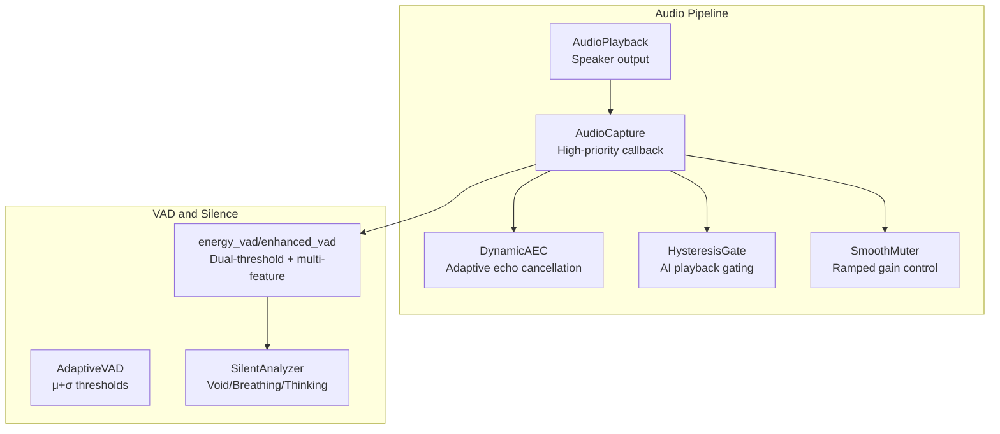
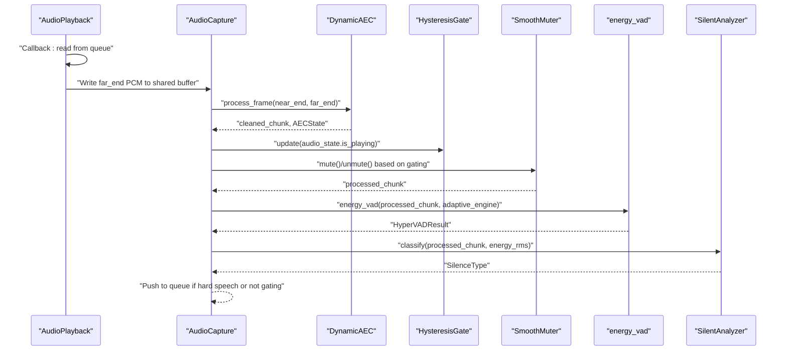
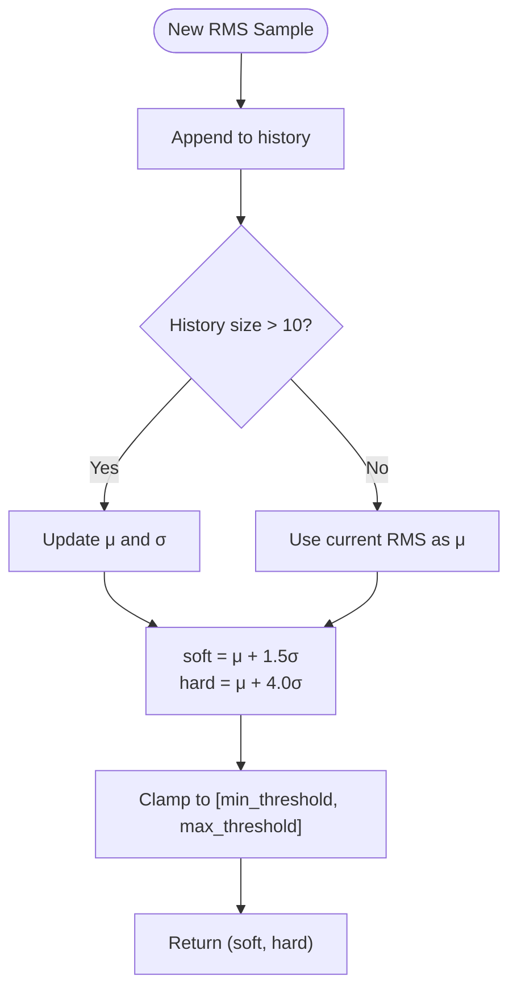
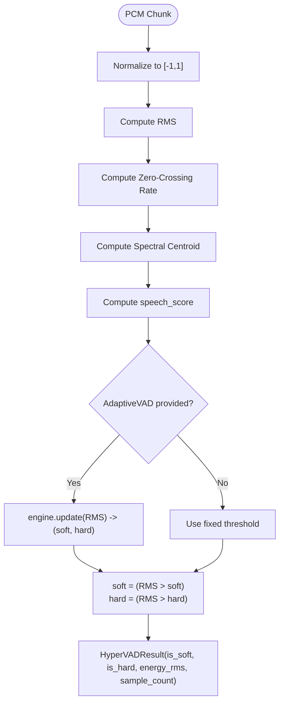
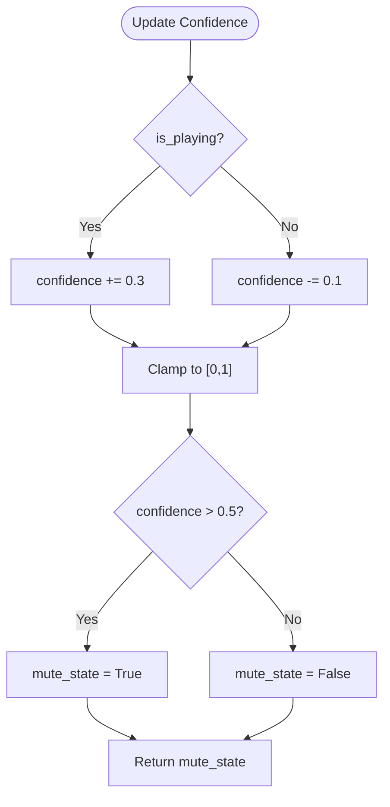
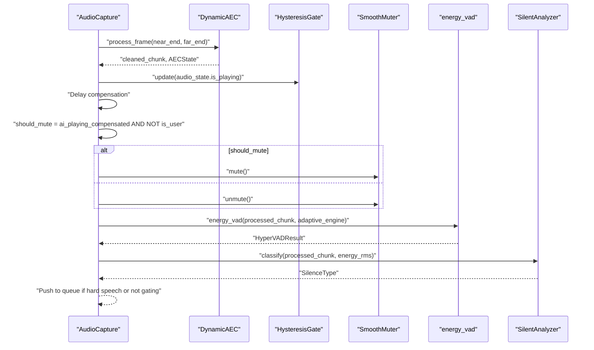
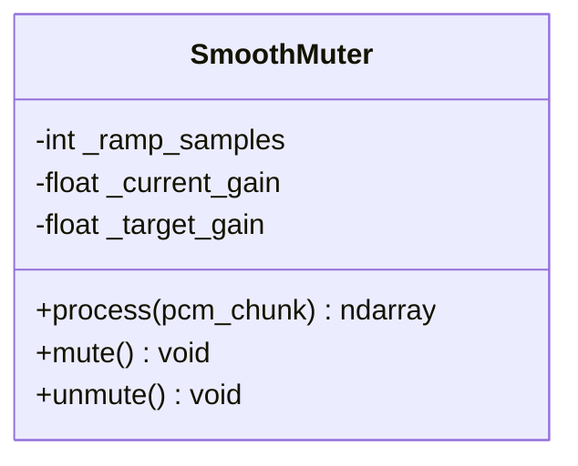
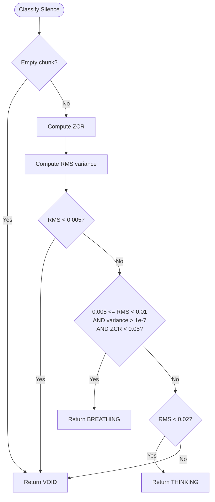
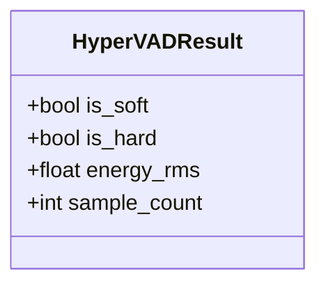
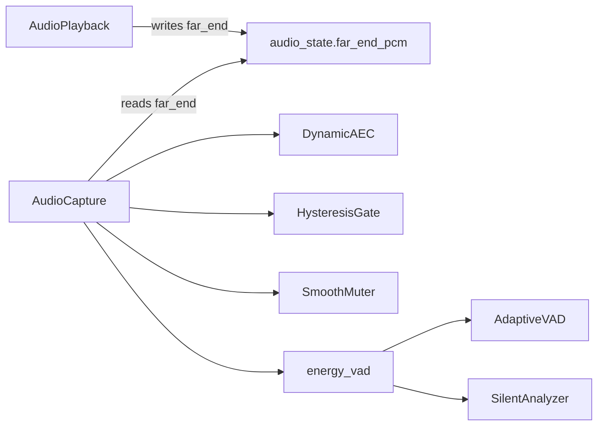

# Voice Activity Detection and Hysteresis Gating

<cite>
**Referenced Files in This Document**
- [vad.py](file://core/audio/vad.py)
- [processing.py](file://core/audio/processing.py)
- [state.py](file://core/audio/state.py)
- [capture.py](file://core/audio/capture.py)
- [playback.py](file://core/audio/playback.py)
- [dynamic_aec.py](file://core/audio/dynamic_aec.py)
- [paralinguistics.py](file://core/audio/paralinguistics.py)
- [config.py](file://core/infra/config.py)
- [test_vad.py](file://tests/unit/test_vad.py)
</cite>

## Table of Contents
1. [Introduction](#introduction)
2. [Project Structure](#project-structure)
3. [Core Components](#core-components)
4. [Architecture Overview](#architecture-overview)
5. [Detailed Component Analysis](#detailed-component-analysis)
6. [Dependency Analysis](#dependency-analysis)
7. [Performance Considerations](#performance-considerations)
8. [Troubleshooting Guide](#troubleshooting-guide)
9. [Conclusion](#conclusion)

## Introduction
This document describes the Voice Activity Detection (VAD) system with hysteresis gating logic that prevents false triggering during AI playback. The system combines:
- Dual-threshold μ+σ adaptive thresholds for soft and hard speech classification
- RMS energy detection and optional multi-feature fusion (ZCR and spectral centroid)
- Hysteresis gating to avoid rapid toggling and clicks
- AI playback detection and user speech confirmation logic
- Smooth muting with ramped gain transitions

It targets robustness against background noise, accurate silence classification, and seamless integration with the audio pipeline for real-time barge-in prevention and responsive UI telemetry.

## Project Structure
The VAD system spans several modules:
- Audio processing and VAD logic
- Hysteresis gate and shared audio state
- Audio capture and playback with gating
- Dynamic AEC for echo cancellation and user speech detection
- Configuration and tests

**Diagram sources**
- [capture.py](file://core/audio/capture.py#L193-L509)
- [dynamic_aec.py](file://core/audio/dynamic_aec.py#L490-L778)
- [state.py](file://core/audio/state.py#L13-L34)
- [processing.py](file://core/audio/processing.py#L256-L507)
- [playback.py](file://core/audio/playback.py#L27-L100)

**Section sources**
- [capture.py](file://core/audio/capture.py#L193-L509)
- [processing.py](file://core/audio/processing.py#L256-L507)
- [state.py](file://core/audio/state.py#L13-L34)
- [playback.py](file://core/audio/playback.py#L27-L100)
- [dynamic_aec.py](file://core/audio/dynamic_aec.py#L490-L778)

## Core Components
- AdaptiveVAD: Maintains rolling statistics (μ and σ) of RMS energy to compute soft and hard thresholds using μ+1.5σ and μ+4.0σ.
- energy_vad/enhanced_vad: RMS-based VAD with optional multi-feature fusion (ZCR and spectral centroid). Returns HyperVADResult with is_soft/is_hard flags and energy_rms.
- HysteresisGate: AI playback state detector with hysteresis to prevent rapid toggling and clicks.
- AudioCapture: High-priority callback that applies AEC, gating, and VAD decisions; integrates with SmoothMuter and telemetry.
- AudioPlayback: Drives speaker output, feeds AEC reference buffer, and sets audio_state.is_playing.
- DynamicAEC: Real-time adaptive echo cancellation with double-talk detection and user speech confirmation logic.
- SilentAnalyzer: Classifies silence into Void, Breathing, or Thinking based on RMS variance and ZCR.

**Section sources**
- [processing.py](file://core/audio/processing.py#L256-L507)
- [state.py](file://core/audio/state.py#L13-L34)
- [capture.py](file://core/audio/capture.py#L193-L509)
- [playback.py](file://core/audio/playback.py#L27-L100)
- [dynamic_aec.py](file://core/audio/dynamic_aec.py#L490-L778)

## Architecture Overview
The system operates in a high-priority callback to minimize latency:
- AudioPlayback pushes PCM to a shared far-end buffer at a lower sample rate for AEC reference.
- AudioCapture receives microphone PCM, runs DynamicAEC, then applies HysteresisGate and SmoothMuter.
- VAD runs to decide soft/hard speech; during AI playback, gating suppresses input to prevent barge-in.
- Telemetry and silence classification feed UI and analytics.

**Diagram sources**
- [playback.py](file://core/audio/playback.py#L61-L99)
- [capture.py](file://core/audio/capture.py#L329-L509)
- [dynamic_aec.py](file://core/audio/dynamic_aec.py#L579-L668)
- [state.py](file://core/audio/state.py#L20-L33)
- [processing.py](file://core/audio/processing.py#L389-L507)

## Detailed Component Analysis

### AdaptiveVAD and Dual-Threshold μ+σ
- Maintains a sliding window of RMS energy to compute mean (μ) and standard deviation (σ).
- Soft threshold: μ + 1.5σ; Hard threshold: μ + 4.0σ.
- Thresholds are clamped to configured min/max bounds to avoid extremes.
- Returns soft/hard thresholds for each energy sample.

**Diagram sources**
- [processing.py](file://core/audio/processing.py#L289-L317)

**Section sources**
- [processing.py](file://core/audio/processing.py#L256-L323)

### energy_vad and enhanced_vad
- energy_vad dispatches to a Rust backend if available; otherwise uses enhanced_vad.
- enhanced_vad computes RMS, ZCR, and spectral centroid, then combines them into a speech score.
- With AdaptiveVAD: soft = (RMS > soft_thr) AND (speech_score > 0.3); hard = (RMS > hard_thr) AND (speech_score > 0.5).
- Without AdaptiveVAD: hard = (RMS > threshold) AND (speech_score > 0.5), soft = hard.

**Diagram sources**
- [processing.py](file://core/audio/processing.py#L437-L507)

**Section sources**
- [processing.py](file://core/audio/processing.py#L389-L507)

### HysteresisGate and AI Playback Detection
- HysteresisGate tracks confidence (0..1) with fast attack (mute quickly) and slow release (unmute gradually).
- Thresholding at 0.5 determines mute state.
- Combined with DynamicAEC’s user speech confirmation, the system decides whether to mute microphone input.

**Diagram sources**
- [state.py](file://core/audio/state.py#L20-L33)

**Section sources**
- [state.py](file://core/audio/state.py#L13-L34)
- [capture.py](file://core/audio/capture.py#L387-L419)
- [dynamic_aec.py](file://core/audio/dynamic_aec.py#L734-L774)

### AudioCapture Thalamic Gate Logic
- Reads far-end reference from shared buffer, runs DynamicAEC, then applies HysteresisGate.
- Applies delay compensation for hardware latency and echo fade-out.
- Final decision: mute if AI is playing AND not user speech; otherwise unmute.
- Integrates VAD and silence classification; pushes to queue only on hard speech or when not gating.

**Diagram sources**
- [capture.py](file://core/audio/capture.py#L329-L509)
- [dynamic_aec.py](file://core/audio/dynamic_aec.py#L579-L668)
- [state.py](file://core/audio/state.py#L20-L33)

**Section sources**
- [capture.py](file://core/audio/capture.py#L329-L509)

### SmoothMuter and Click-Free Gating
- Applies linear gain ramps over a configurable number of samples to avoid clicks.
- Provides mute() and unmute() APIs; process() returns a new int16 array with smooth transitions.

**Diagram sources**
- [capture.py](file://core/audio/capture.py#L106-L191)

**Section sources**
- [capture.py](file://core/audio/capture.py#L106-L191)

### SilentAnalyzer and Silence Classification
- Classifies silence into Void, Breathing, or Thinking based on RMS, RMS variance, and ZCR.
- Void: extremely low RMS.
- Breathing: slight RMS oscillation with low ZCR.
- Thinking: sustained low RMS without void-level quiet.

**Diagram sources**
- [processing.py](file://core/audio/processing.py#L331-L386)

**Section sources**
- [processing.py](file://core/audio/processing.py#L331-L386)

### HyperVADResult and Data Model
- HyperVADResult carries is_soft, is_hard, energy_rms, and sample_count.
- Used by both Rust backend and Python fallback to unify VAD outputs.

**Diagram sources**
- [processing.py](file://core/audio/processing.py#L246-L254)

**Section sources**
- [processing.py](file://core/audio/processing.py#L246-L254)

## Dependency Analysis
Key dependencies and interactions:
- AudioCapture depends on DynamicAEC, HysteresisGate, SmoothMuter, and VAD engines.
- DynamicAEC depends on SpectralAnalyzer and computes AECState used by AudioCapture.
- AudioPlayback feeds far-end PCM into the shared buffer for AEC reference.
- Tests validate AdaptiveVAD adaptation, soft/hard thresholds, and silence classification.

**Diagram sources**
- [playback.py](file://core/audio/playback.py#L85-L92)
- [capture.py](file://core/audio/capture.py#L344-L438)
- [processing.py](file://core/audio/processing.py#L256-L507)

**Section sources**
- [playback.py](file://core/audio/playback.py#L61-L99)
- [capture.py](file://core/audio/capture.py#L329-L509)
- [processing.py](file://core/audio/processing.py#L256-L507)

## Performance Considerations
- Real-time callback: All heavy computations occur in the high-priority callback to minimize latency.
- Backend acceleration: When available, the Rust backend (aether-cortex) is used for VAD and spectral denoise.
- Efficient buffers: Ring buffers and bounded accumulators avoid allocations and reduce GC pressure.
- Hysteresis and ramping: Reduce abrupt changes that could cause clicks and improve perceived stability.
- Adaptive windows: μ+σ windows balance responsiveness and stability; tune window size and thresholds for environment.

[No sources needed since this section provides general guidance]

## Troubleshooting Guide
Common issues and remedies:
- False positives during AI playback:
  - Verify HysteresisGate thresholds and confirm DynamicAEC user speech detection.
  - Check gating logic and delay compensation counters.
- Low sensitivity to user speech:
  - Adjust VAD thresholds and window size; ensure AdaptiveVAD has sufficient history.
- Clicks or pops:
  - Confirm SmoothMuter ramp samples and that mute/unmute transitions are invoked consistently.
- Noisy environments:
  - Increase thresholds and window size; verify AEC convergence and ERLE.

**Section sources**
- [capture.py](file://core/audio/capture.py#L387-L438)
- [dynamic_aec.py](file://core/audio/dynamic_aec.py#L734-L774)
- [processing.py](file://core/audio/processing.py#L256-L323)

## Conclusion
The VAD system combines adaptive thresholds, multi-feature detection, and hysteresis gating to deliver robust voice activity detection while preventing false triggers during AI playback. The integration with DynamicAEC and SmoothMuter ensures clean, low-latency audio with minimal artifacts. Configuration parameters allow tuning for sensitivity, noise robustness, and transition behavior.