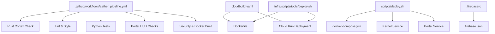
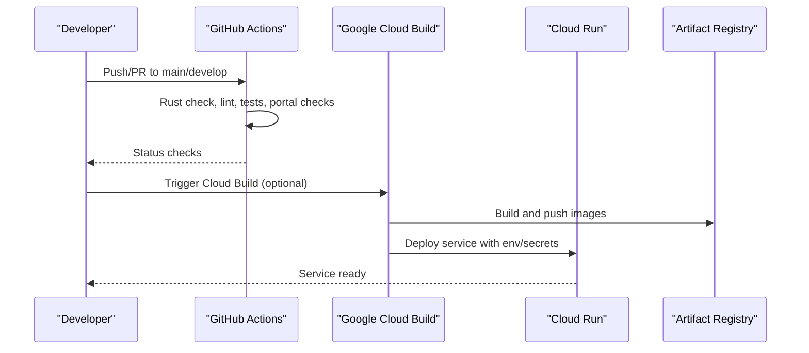
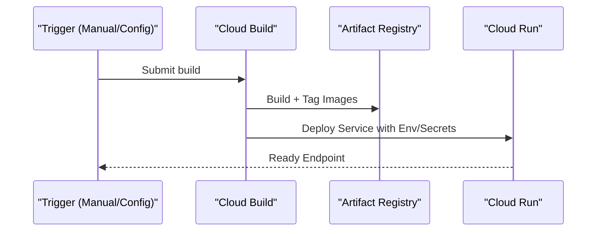
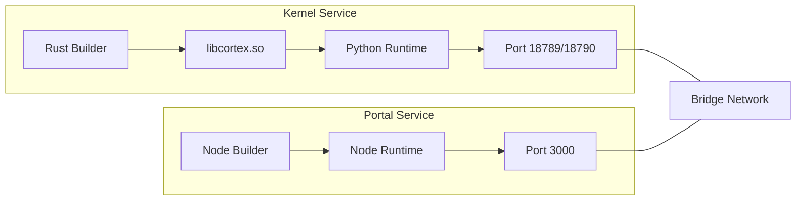
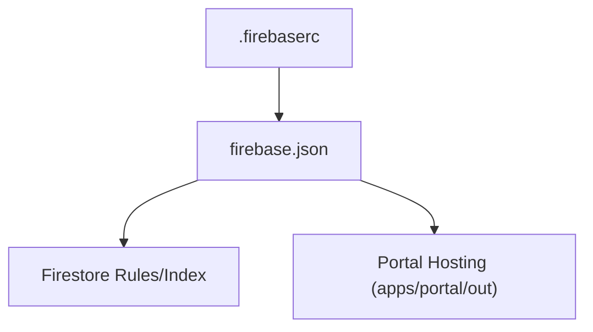
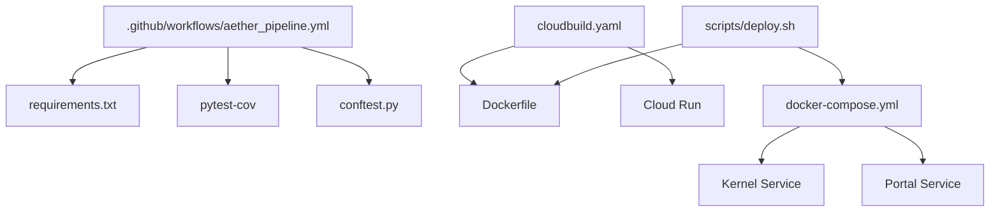

# CI/CD Pipeline and Automated Deployment

<cite>
**Referenced Files in This Document**
- [.github/workflows/aether_pipeline.yml](file://.github/workflows/aether_pipeline.yml)
- [cloudbuild.yaml](file://cloudbuild.yaml)
- [scripts/deploy.sh](file://scripts/deploy.sh)
- [infra/scripts/tools/deploy.sh](file://infra/scripts/tools/deploy.sh)
- [Dockerfile](file://Dockerfile)
- [apps/portal/Dockerfile](file://apps/portal/Dockerfile)
- [docker-compose.yml](file://docker-compose.yml)
- [.firebaserc](file://.firebaserc)
- [firebase.json](file://firebase.json)
- [requirements.txt](file://requirements.txt)
- [conftest.py](file://conftest.py)
</cite>

## Table of Contents
1. [Introduction](#introduction)
2. [Project Structure](#project-structure)
3. [Core Components](#core-components)
4. [Architecture Overview](#architecture-overview)
5. [Detailed Component Analysis](#detailed-component-analysis)
6. [Dependency Analysis](#dependency-analysis)
7. [Performance Considerations](#performance-considerations)
8. [Troubleshooting Guide](#troubleshooting-guide)
9. [Conclusion](#conclusion)
10. [Appendices](#appendices)

## Introduction
This document explains the CI/CD pipeline and automated deployment processes for Aether Voice OS. It covers GitHub Actions workflow configuration, Google Cloud Build automation, deployment scripts, and supporting infrastructure. It also documents testing integration, quality gates, environment-specific deployment targets, rollback procedures, monitoring, failure handling, and guidance for extending the pipeline.

## Project Structure
The repository includes:
- GitHub Actions workflow for multi-stage CI
- Google Cloud Build configuration for containerization and Cloud Run deployment
- Local deployment scripts for containerized environments
- Dockerfiles for the kernel and portal services
- Compose orchestration for local development
- Firebase configuration for hosting and Firestore

**Diagram sources**
- [.github/workflows/aether_pipeline.yml](file://.github/workflows/aether_pipeline.yml#L1-L160)
- [cloudbuild.yaml](file://cloudbuild.yaml#L1-L55)
- [Dockerfile](file://Dockerfile#L1-L76)
- [apps/portal/Dockerfile](file://apps/portal/Dockerfile#L1-L43)
- [docker-compose.yml](file://docker-compose.yml#L1-L37)
- [.firebaserc](file://.firebaserc#L1-L8)
- [firebase.json](file://firebase.json#L1-L16)
- [scripts/deploy.sh](file://scripts/deploy.sh#L1-L37)
- [infra/scripts/tools/deploy.sh](file://infra/scripts/tools/deploy.sh#L1-L44)

**Section sources**
- [.github/workflows/aether_pipeline.yml](file://.github/workflows/aether_pipeline.yml#L1-L160)
- [cloudbuild.yaml](file://cloudbuild.yaml#L1-L55)
- [Dockerfile](file://Dockerfile#L1-L76)
- [apps/portal/Dockerfile](file://apps/portal/Dockerfile#L1-L43)
- [docker-compose.yml](file://docker-compose.yml#L1-L37)
- [.firebaserc](file://.firebaserc#L1-L8)
- [firebase.json](file://firebase.json#L1-L16)
- [scripts/deploy.sh](file://scripts/deploy.sh#L1-L37)
- [infra/scripts/tools/deploy.sh](file://infra/scripts/tools/deploy.sh#L1-L44)

## Core Components
- GitHub Actions CI pipeline orchestrates Rust checks, linting, Python tests, portal checks, and a security plus Docker build verification.
- Google Cloud Build automates building images and deploying to Cloud Run with environment variables and secrets.
- Local deployment scripts support containerized local development via Docker Compose.
- Dockerfiles define multi-stage builds for the kernel and portal services.
- Firebase configuration supports Firestore and static hosting for the portal.

Key pipeline stages:
- Rust Cortex validation
- Lint and style checks
- Python tests across multiple versions with coverage thresholds
- Portal lint and test
- Security scanning and Docker image build verification

Quality gates:
- Coverage threshold enforced during Python tests
- Import verification for core modules
- Security scanning with Bandit and Safety

**Section sources**
- [.github/workflows/aether_pipeline.yml](file://.github/workflows/aether_pipeline.yml#L16-L160)
- [cloudbuild.yaml](file://cloudbuild.yaml#L6-L55)
- [scripts/deploy.sh](file://scripts/deploy.sh#L1-L37)
- [Dockerfile](file://Dockerfile#L1-L76)
- [apps/portal/Dockerfile](file://apps/portal/Dockerfile#L1-L43)
- [requirements.txt](file://requirements.txt#L21-L24)

## Architecture Overview
The CI/CD architecture integrates GitHub Actions for pre-deployment validation and Google Cloud Build for production deployment. Local development leverages Docker Compose to simulate the production environment.

**Diagram sources**
- [.github/workflows/aether_pipeline.yml](file://.github/workflows/aether_pipeline.yml#L7-L12)
- [cloudbuild.yaml](file://cloudbuild.yaml#L6-L47)

## Detailed Component Analysis

### GitHub Actions Workflow (.github/workflows/aether_pipeline.yml)
- Triggers: push to main/develop and pull requests to main/develop.
- Permissions: read access to repository contents.
- Jobs:
  - Rust Cortex check validates the signal processing layer.
  - Lint stage enforces code style and formatting.
  - Python tests run across multiple Python versions with coverage enforcement and import verification.
  - Portal checks validate lint and tests for the Next.js HUD.
  - Security and Docker build verifies Docker image creation and security scanning.

**Diagram sources**
- [.github/workflows/aether_pipeline.yml](file://.github/workflows/aether_pipeline.yml#L16-L160)

**Section sources**
- [.github/workflows/aether_pipeline.yml](file://.github/workflows/aether_pipeline.yml#L7-L12)
- [.github/workflows/aether_pipeline.yml](file://.github/workflows/aether_pipeline.yml#L20-L30)
- [.github/workflows/aether_pipeline.yml](file://.github/workflows/aether_pipeline.yml#L34-L57)
- [.github/workflows/aether_pipeline.yml](file://.github/workflows/aether_pipeline.yml#L61-L101)
- [.github/workflows/aether_pipeline.yml](file://.github/workflows/aether_pipeline.yml#L105-L123)
- [.github/workflows/aether_pipeline.yml](file://.github/workflows/aether_pipeline.yml#L127-L160)

### Google Cloud Build (cloudbuild.yaml)
- Builds a multi-architecture Docker image tagged with commit SHA and latest.
- Pushes images to Artifact Registry.
- Deploys to Cloud Run with region, platform, scaling, timeout, and environment configuration.
- Sets secrets for API keys and exposes the gateway port.

**Diagram sources**
- [cloudbuild.yaml](file://cloudbuild.yaml#L6-L47)

**Section sources**
- [cloudbuild.yaml](file://cloudbuild.yaml#L6-L55)

### Local Deployment Scripts
- scripts/deploy.sh
  - Validates presence of API key via environment or .env.
  - Builds and starts containers with Docker Compose.
  - Exposes kernel, admin API, and portal endpoints.
- infra/scripts/tools/deploy.sh
  - Enables required Google Cloud APIs.
  - Submits build to Cloud Build.
  - Deploys service to Cloud Run with environment variables.

**Diagram sources**
- [scripts/deploy.sh](file://scripts/deploy.sh#L14-L30)

**Section sources**
- [scripts/deploy.sh](file://scripts/deploy.sh#L1-L37)
- [infra/scripts/tools/deploy.sh](file://infra/scripts/tools/deploy.sh#L1-L44)

### Dockerfiles and Compose
- Kernel Dockerfile
  - Multi-stage build: Rust layer produces a shared library, copied into a slim Python runtime.
  - Installs system dependencies for audio and PyAudio.
  - Defines health check and exposes the gateway port.
- Portal Dockerfile
  - Multi-stage Node.js build and runtime.
  - Copies production artifacts and sets non-root user.
- docker-compose.yml
  - Orchestrates kernel and portal services.
  - Shares environment variables and networking.

**Diagram sources**
- [Dockerfile](file://Dockerfile#L11-L76)
- [apps/portal/Dockerfile](file://apps/portal/Dockerfile#L5-L43)
- [docker-compose.yml](file://docker-compose.yml#L2-L32)

**Section sources**
- [Dockerfile](file://Dockerfile#L1-L76)
- [apps/portal/Dockerfile](file://apps/portal/Dockerfile#L1-L43)
- [docker-compose.yml](file://docker-compose.yml#L1-L37)

### Firebase Hosting and Firestore Configuration
- .firebaserc defines the default project identifier.
- firebase.json configures Firestore database, location, rules, and indexes, and sets the portal hosting public directory.

**Diagram sources**
- [.firebaserc](file://.firebaserc#L1-L8)
- [firebase.json](file://firebase.json#L1-L16)

**Section sources**
- [.firebaserc](file://.firebaserc#L1-L8)
- [firebase.json](file://firebase.json#L1-L16)

## Dependency Analysis
- GitHub Actions depends on repository checkout, language toolchains, and test coverage reporting.
- Cloud Build depends on Docker and gcloud SDK to build and deploy images.
- Local deployment depends on Docker Compose and environment variables.
- Testing depends on pytest configuration and coverage thresholds.

**Diagram sources**
- [.github/workflows/aether_pipeline.yml](file://.github/workflows/aether_pipeline.yml#L61-L101)
- [requirements.txt](file://requirements.txt#L21-L24)
- [conftest.py](file://conftest.py#L1-L10)
- [cloudbuild.yaml](file://cloudbuild.yaml#L6-L47)
- [Dockerfile](file://Dockerfile#L1-L76)
- [scripts/deploy.sh](file://scripts/deploy.sh#L26-L30)
- [docker-compose.yml](file://docker-compose.yml#L2-L32)

**Section sources**
- [.github/workflows/aether_pipeline.yml](file://.github/workflows/aether_pipeline.yml#L61-L101)
- [requirements.txt](file://requirements.txt#L21-L24)
- [conftest.py](file://conftest.py#L1-L10)
- [cloudbuild.yaml](file://cloudbuild.yaml#L6-L47)
- [Dockerfile](file://Dockerfile#L1-L76)
- [scripts/deploy.sh](file://scripts/deploy.sh#L26-L30)
- [docker-compose.yml](file://docker-compose.yml#L1-L37)

## Performance Considerations
- Multi-stage Docker builds reduce image size and improve cold-start performance.
- Health checks in the kernel image ensure deployment readiness.
- Cloud Run resource limits and timeouts are configured for voice processing workloads.
- Parallel matrix testing in GitHub Actions improves feedback speed across Python versions.

[No sources needed since this section provides general guidance]

## Troubleshooting Guide
Common issues and resolutions:
- Missing GOOGLE_API_KEY
  - Ensure the environment variable is exported or present in .env before running local deployment scripts.
- Python coverage failures
  - Increase coverage or adjust thresholds in the test job configuration.
- Docker build failures
  - Verify system dependencies and Rust toolchain availability in the build environment.
- Cloud Run deployment errors
  - Confirm required APIs are enabled and secrets are configured in Secret Manager.
- Port conflicts in local environment
  - Change exposed ports in docker-compose.yml if conflicts exist.

**Section sources**
- [scripts/deploy.sh](file://scripts/deploy.sh#L14-L23)
- [.github/workflows/aether_pipeline.yml](file://.github/workflows/aether_pipeline.yml#L90-L95)
- [cloudbuild.yaml](file://cloudbuild.yaml#L30-L47)
- [docker-compose.yml](file://docker-compose.yml#L11-L28)

## Conclusion
The CI/CD pipeline for Aether Voice OS combines GitHub Actions for pre-deployment validation with Google Cloud Build for production deployment. Local development is streamlined via Docker Compose. Quality gates include linting, import verification, coverage thresholds, and security scanning. The architecture supports environment-specific deployments and can be extended to additional environments and deployment strategies.

[No sources needed since this section summarizes without analyzing specific files]

## Appendices

### Pipeline Customization Examples
- Environment-specific deployments
  - Add separate Cloud Build configurations or GitHub Actions jobs per environment.
  - Use branch protection rules to gate merges to protected branches.
- Rollback procedures
  - Cloud Run revisions allow quick rollback; redeploy previous revision tag.
  - For local environments, use docker-compose to pin image tags.
- Manual intervention
  - Add approval gates in GitHub Actions for production deployments.
  - Use Cloud Build triggers with manual activation for controlled releases.

[No sources needed since this section provides general guidance]

### Testing Integration and Quality Gates
- Python tests with coverage thresholds and import verification.
- Linting and formatting enforced via ruff.
- Security scanning with Bandit and Safety.
- Test configuration avoids platform-specific sandbox issues.

**Section sources**
- [.github/workflows/aether_pipeline.yml](file://.github/workflows/aether_pipeline.yml#L61-L101)
- [requirements.txt](file://requirements.txt#L21-L24)
- [conftest.py](file://conftest.py#L1-L10)