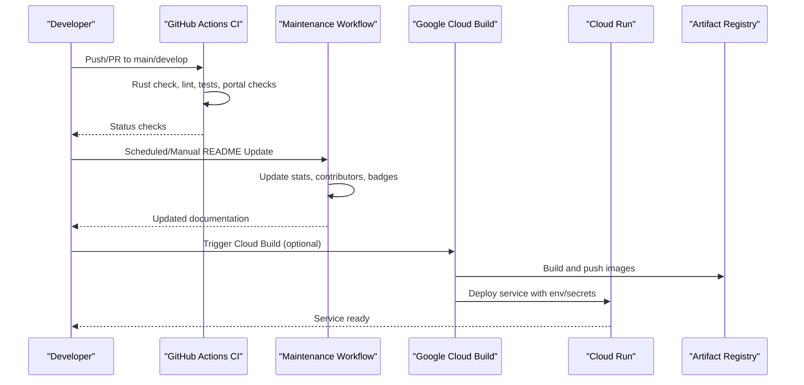
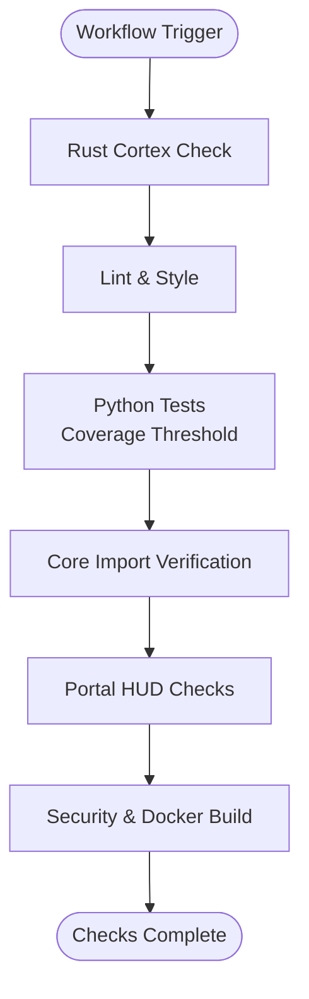
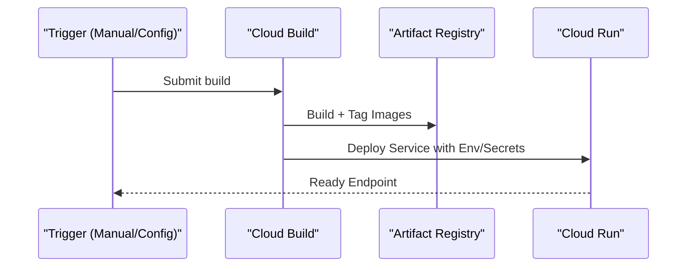
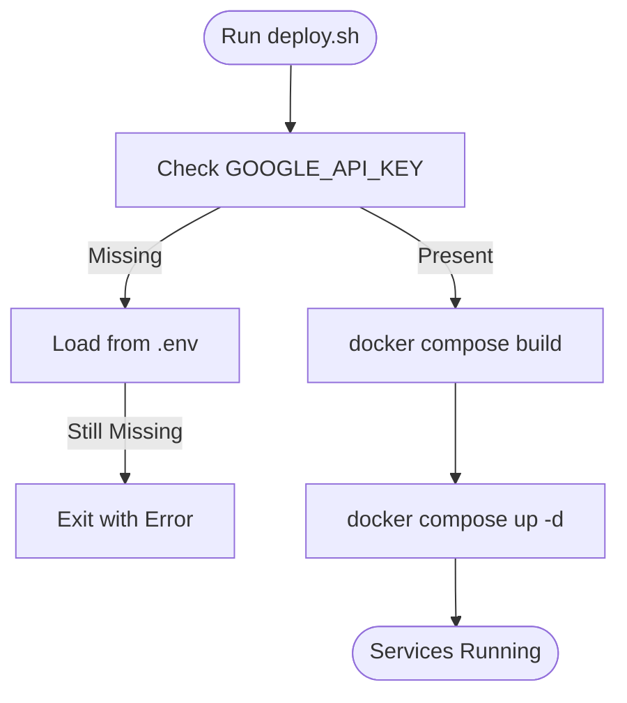
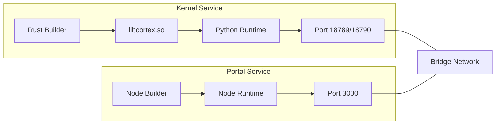
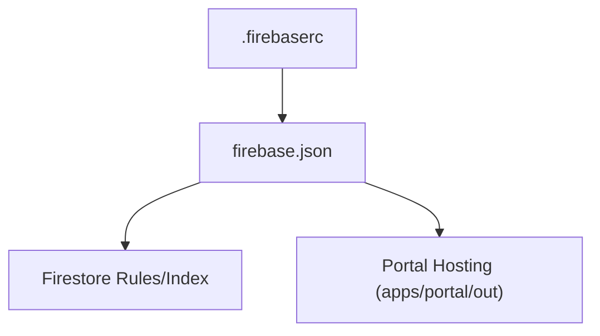
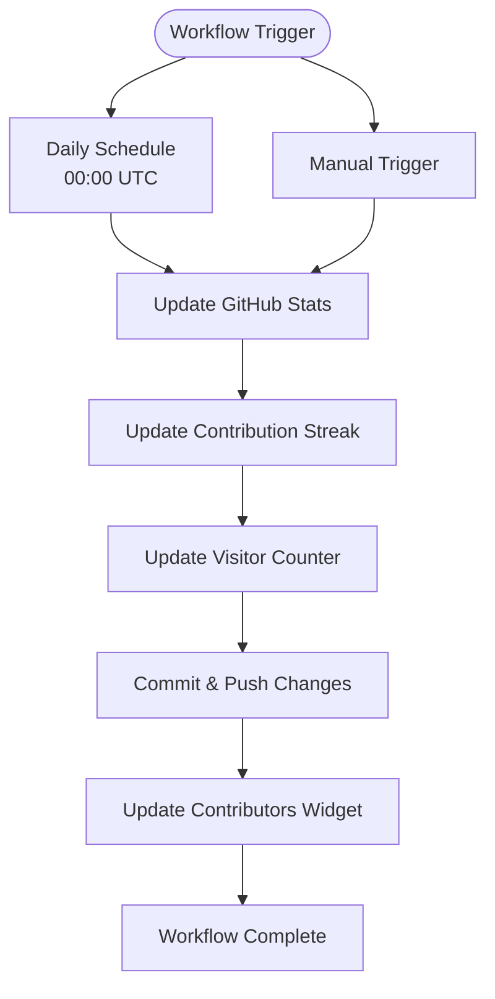
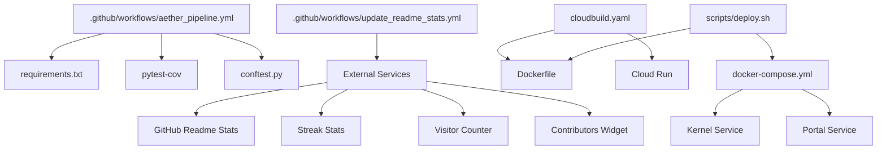

# CI/CD Pipeline and Automated Deployment

<cite>
**Referenced Files in This Document**
- [.github/workflows/aether_pipeline.yml](file://.github/workflows/aether_pipeline.yml)
- [.github/workflows/update_readme_stats.yml](file://.github/workflows/update_readme_stats.yml)
- [.github/workflows/README_WORKFLOW.md](file://.github/workflows/README_WORKFLOW.md)
- [cloudbuild.yaml](file://cloudbuild.yaml)
- [scripts/deploy.sh](file://scripts/deploy.sh)
- [infra/scripts/tools/deploy.sh](file://infra/scripts/tools/deploy.sh)
- [Dockerfile](file://Dockerfile)
- [apps/portal/Dockerfile](file://apps/portal/Dockerfile)
- [docker-compose.yml](file://docker-compose.yml)
- [.firebaserc](file://.firebaserc)
- [firebase.json](file://firebase.json)
- [requirements.txt](file://requirements.txt)
- [conftest.py](file://conftest.py)
- [README.md](file://README.md)
</cite>

## Update Summary
**Changes Made**
- Added comprehensive documentation for the new README statistics update workflow
- Enhanced CI/CD pipeline documentation to include automated maintenance processes
- Updated workflow architecture to reflect dual pipeline approach (development + maintenance)
- Added new section on automated project maintenance and documentation updates

## Table of Contents
1. [Introduction](#introduction)
2. [Project Structure](#project-structure)
3. [Core Components](#core-components)
4. [Architecture Overview](#architecture-overview)
5. [Detailed Component Analysis](#detailed-component-analysis)
6. [Automated Maintenance Workflows](#automated-maintenance-workflows)
7. [Dependency Analysis](#dependency-analysis)
8. [Performance Considerations](#performance-considerations)
9. [Troubleshooting Guide](#troubleshooting-guide)
10. [Conclusion](#conclusion)
11. [Appendices](#appendices)

## Introduction
This document explains the CI/CD pipeline and automated deployment processes for Aether Voice OS. It covers GitHub Actions workflow configuration, Google Cloud Build automation, deployment scripts, and supporting infrastructure. The pipeline now includes comprehensive automated maintenance workflows for README statistics updates, ensuring project documentation stays current without manual intervention. It also documents testing integration, quality gates, environment-specific deployment targets, rollback procedures, monitoring, failure handling, and guidance for extending the pipeline.

## Project Structure
The repository includes:
- GitHub Actions workflow for multi-stage CI pipeline
- GitHub Actions workflow for automated README statistics maintenance
- Google Cloud Build configuration for containerization and Cloud Run deployment
- Local deployment scripts for containerized environments
- Dockerfiles for the kernel and portal services
- Compose orchestration for local development
- Firebase configuration for hosting and Firestore

```mermaid
graph TB
GH[".github/workflows/aether_pipeline.yml"] --> STAGE1["Rust Cortex Check"]
GH --> STAGE2["Lint & Style"]
GH --> STAGE3["Python Tests"]
GH --> STAGE4["Portal HUD Checks"]
GH --> STAGE5["Security & Docker Build"]
GH2[".github/workflows/update_readme_stats.yml"] --> STATS["README Statistics Update"]
GH2 --> CONTRIB["Contributors Widget Update"]
CB["cloudbuild.yaml"] --> DOCKER["Dockerfile"]
CB --> CR["Cloud Run Deployment"]
DS1["scripts/deploy.sh"] --> DC["docker-compose.yml"]
DS1 --> KERN["Kernel Service"]
DS1 --> PORTAL["Portal Service"]
IDS["infra/scripts/tools/deploy.sh"] --> DOCKER
IDS --> CR
FB[".firebaserc"] --> FH["firebase.json"]
```

**Diagram sources**
- [.github/workflows/aether_pipeline.yml](file://.github/workflows/aether_pipeline.yml#L1-L160)
- [.github/workflows/update_readme_stats.yml](file://.github/workflows/update_readme_stats.yml#L1-L62)
- [cloudbuild.yaml](file://cloudbuild.yaml#L1-L55)
- [Dockerfile](file://Dockerfile#L1-L76)
- [apps/portal/Dockerfile](file://apps/portal/Dockerfile#L1-L43)
- [docker-compose.yml](file://docker-compose.yml#L1-L37)
- [.firebaserc](file://.firebaserc#L1-L8)
- [firebase.json](file://firebase.json#L1-L16)
- [scripts/deploy.sh](file://scripts/deploy.sh#L1-L37)
- [infra/scripts/tools/deploy.sh](file://infra/scripts/tools/deploy.sh#L1-L44)

**Section sources**
- [.github/workflows/aether_pipeline.yml](file://.github/workflows/aether_pipeline.yml#L1-L160)
- [.github/workflows/update_readme_stats.yml](file://.github/workflows/update_readme_stats.yml#L1-L62)
- [cloudbuild.yaml](file://cloudbuild.yaml#L1-L55)
- [Dockerfile](file://Dockerfile#L1-L76)
- [apps/portal/Dockerfile](file://apps/portal/Dockerfile#L1-L43)
- [docker-compose.yml](file://docker-compose.yml#L1-L37)
- [.firebaserc](file://.firebaserc#L1-L8)
- [firebase.json](file://firebase.json#L1-L16)
- [scripts/deploy.sh](file://scripts/deploy.sh#L1-L37)
- [infra/scripts/tools/deploy.sh](file://infra/scripts/tools/deploy.sh#L1-L44)

## Core Components
- GitHub Actions CI pipeline orchestrates Rust checks, linting, Python tests, portal checks, and a security plus Docker build verification.
- GitHub Actions maintenance pipeline automatically updates README statistics, contribution widgets, and visitor counters.
- Google Cloud Build automates building images and deploying to Cloud Run with environment variables and secrets.
- Local deployment scripts support containerized local development via Docker Compose.
- Dockerfiles define multi-stage builds for the kernel and portal services.
- Firebase configuration supports Firestore and static hosting for the portal.

Key pipeline stages:
- Rust Cortex validation
- Lint and style checks
- Python tests across multiple versions with coverage thresholds
- Portal lint and test
- Security scanning and Docker image build verification
- Automated README statistics updates (daily and manual triggers)

Quality gates:
- Coverage threshold enforced during Python tests
- Import verification for core modules
- Security scanning with Bandit and Safety
- Automated documentation maintenance with external service integration

**Section sources**
- [.github/workflows/aether_pipeline.yml](file://.github/workflows/aether_pipeline.yml#L16-L160)
- [.github/workflows/update_readme_stats.yml](file://.github/workflows/update_readme_stats.yml#L10-L62)
- [cloudbuild.yaml](file://cloudbuild.yaml#L6-L55)
- [scripts/deploy.sh](file://scripts/deploy.sh#L1-L37)
- [Dockerfile](file://Dockerfile#L1-L76)
- [apps/portal/Dockerfile](file://apps/portal/Dockerfile#L1-L43)
- [requirements.txt](file://requirements.txt#L21-L24)

## Architecture Overview
The CI/CD architecture integrates GitHub Actions for pre-deployment validation and production deployment, while a separate maintenance pipeline handles automated documentation updates. Local development leverages Docker Compose to simulate the production environment.

**Diagram sources**
- [.github/workflows/aether_pipeline.yml](file://.github/workflows/aether_pipeline.yml#L7-L12)
- [.github/workflows/update_readme_stats.yml](file://.github/workflows/update_readme_stats.yml#L3-L9)
- [cloudbuild.yaml](file://cloudbuild.yaml#L6-L47)

## Detailed Component Analysis

### GitHub Actions Workflow (.github/workflows/aether_pipeline.yml)
- Triggers: push to main/develop and pull requests to main/develop.
- Permissions: read access to repository contents.
- Jobs:
  - Rust Cortex check validates the signal processing layer.
  - Lint stage enforces code style and formatting.
  - Python tests run across multiple Python versions with coverage enforcement and import verification.
  - Portal checks validate lint and tests for the Next.js HUD.
  - Security and Docker build verifies Docker image creation and security scanning.

**Diagram sources**
- [.github/workflows/aether_pipeline.yml](file://.github/workflows/aether_pipeline.yml#L16-L160)

**Section sources**
- [.github/workflows/aether_pipeline.yml](file://.github/workflows/aether_pipeline.yml#L7-L12)
- [.github/workflows/aether_pipeline.yml](file://.github/workflows/aether_pipeline.yml#L20-L30)
- [.github/workflows/aether_pipeline.yml](file://.github/workflows/aether_pipeline.yml#L34-L57)
- [.github/workflows/aether_pipeline.yml](file://.github/workflows/aether_pipeline.yml#L61-L101)
- [.github/workflows/aether_pipeline.yml](file://.github/workflows/aether_pipeline.yml#L105-L123)
- [.github/workflows/aether_pipeline.yml](file://.github/workflows/aether_pipeline.yml#L127-L160)

### Google Cloud Build (cloudbuild.yaml)
- Builds a multi-architecture Docker image tagged with commit SHA and latest.
- Pushes images to Artifact Registry.
- Deploys to Cloud Run with region, platform, scaling, timeout, and environment configuration.
- Sets secrets for API keys and exposes the gateway port.

**Diagram sources**
- [cloudbuild.yaml](file://cloudbuild.yaml#L6-L47)

**Section sources**
- [cloudbuild.yaml](file://cloudbuild.yaml#L6-L55)

### Local Deployment Scripts
- scripts/deploy.sh
  - Validates presence of API key via environment or .env.
  - Builds and starts containers with Docker Compose.
  - Exposes kernel, admin API, and portal endpoints.
- infra/scripts/tools/deploy.sh
  - Enables required Google Cloud APIs.
  - Submits build to Cloud Build.
  - Deploys service to Cloud Run with environment variables.

**Diagram sources**
- [scripts/deploy.sh](file://scripts/deploy.sh#L14-L30)

**Section sources**
- [scripts/deploy.sh](file://scripts/deploy.sh#L1-L37)
- [infra/scripts/tools/deploy.sh](file://infra/scripts/tools/deploy.sh#L1-L44)

### Dockerfiles and Compose
- Kernel Dockerfile
  - Multi-stage build: Rust layer produces a shared library, copied into a slim Python runtime.
  - Installs system dependencies for audio and PyAudio.
  - Defines health check and exposes the gateway port.
- Portal Dockerfile
  - Multi-stage Node.js build and runtime.
  - Copies production artifacts and sets non-root user.
- docker-compose.yml
  - Orchestrates kernel and portal services.
  - Shares environment variables and networking.

**Diagram sources**
- [Dockerfile](file://Dockerfile#L11-L76)
- [apps/portal/Dockerfile](file://apps/portal/Dockerfile#L5-L43)
- [docker-compose.yml](file://docker-compose.yml#L2-L32)

**Section sources**
- [Dockerfile](file://Dockerfile#L1-L76)
- [apps/portal/Dockerfile](file://apps/portal/Dockerfile#L1-L43)
- [docker-compose.yml](file://docker-compose.yml#L1-L37)

### Firebase Hosting and Firestore Configuration
- .firebaserc defines the default project identifier.
- firebase.json configures Firestore database, location, rules, and indexes, and sets the portal hosting public directory.

**Diagram sources**
- [.firebaserc](file://.firebaserc#L1-L8)
- [firebase.json](file://firebase.json#L1-L16)

**Section sources**
- [.firebaserc](file://.firebaserc#L1-L8)
- [firebase.json](file://firebase.json#L1-L16)

## Automated Maintenance Workflows

### README Statistics Update Workflow (.github/workflows/update_readme_stats.yml)
- **Purpose**: Automatically maintains README.md statistics, contributor information, and visitor counters.
- **Triggers**: 
  - Scheduled: Runs daily at 00:00 UTC using cron expression `0 0 * * *`
  - Manual: Can be triggered from GitHub Actions interface
- **Jobs**:
  - `update-readme-stats`: Generates GitHub stats, contribution streak, and updates visitor counter
  - `update-contributors`: Updates contributors widget with latest contributor information

**Diagram sources**
- [.github/workflows/update_readme_stats.yml](file://.github/workflows/update_readme_stats.yml#L3-L9)
- [.github/workflows/update_readme_stats.yml](file://.github/workflows/update_readme_stats.yml#L10-L62)

**Section sources**
- [.github/workflows/update_readme_stats.yml](file://.github/workflows/update_readme_stats.yml#L1-L62)
- [.github/workflows/README_WORKFLOW.md](file://.github/workflows/README_WORKFLOW.md#L1-L122)

### External Service Integration
The maintenance workflow integrates with several external services for automated updates:
- **GitHub Readme Stats**: Vercel API for project statistics and language breakdown
- **Contribution Streak Stats**: Heroku app for developer activity visualization  
- **Visitor Counter**: Komarev.com for real-time visitor tracking
- **Contributors Widget**: contrib.rocks for displaying contributor avatars

These services update independently, with some (visitor counter, GitHub stats) updating automatically without workflow intervention.

**Section sources**
- [.github/workflows/update_readme_stats.yml](file://.github/workflows/update_readme_stats.yml#L18-L32)
- [.github/workflows/README_WORKFLOW.md](file://.github/workflows/README_WORKFLOW.md#L88-L94)

### Workflow Configuration and Customization
The maintenance workflow provides flexible scheduling and customization options:

**Schedule Configuration**:
- Default: `0 0 * * *` (daily at midnight UTC)
- Alternative examples:
  - `0 */6 * * *` (every 6 hours)
  - `0 0 * * 1` (weekly on Mondays)
  - Use [crontab.guru](https://crontab.guru/) for custom scheduling

**Manual Execution Process**:
1. Navigate to Actions tab in GitHub
2. Select "🔄 Update README Statistics" workflow
3. Click "Run workflow" button
4. Choose target branch (default: main)
5. Execute workflow

**Section sources**
- [.github/workflows/README_WORKFLOW.md](file://.github/workflows/README_WORKFLOW.md#L37-L58)

## Dependency Analysis
- GitHub Actions CI pipeline depends on repository checkout, language toolchains, and test coverage reporting.
- GitHub Actions maintenance workflow depends on external service APIs and repository write permissions.
- Cloud Build depends on Docker and gcloud SDK to build and deploy images.
- Local deployment depends on Docker Compose and environment variables.
- Testing depends on pytest configuration and coverage thresholds.

**Diagram sources**
- [.github/workflows/aether_pipeline.yml](file://.github/workflows/aether_pipeline.yml#L61-L101)
- [.github/workflows/update_readme_stats.yml](file://.github/workflows/update_readme_stats.yml#L18-L32)
- [requirements.txt](file://requirements.txt#L21-L24)
- [conftest.py](file://conftest.py#L1-L10)
- [cloudbuild.yaml](file://cloudbuild.yaml#L6-L47)
- [Dockerfile](file://Dockerfile#L1-L76)
- [scripts/deploy.sh](file://scripts/deploy.sh#L26-L30)
- [docker-compose.yml](file://docker-compose.yml#L2-L32)

**Section sources**
- [.github/workflows/aether_pipeline.yml](file://.github/workflows/aether_pipeline.yml#L61-L101)
- [.github/workflows/update_readme_stats.yml](file://.github/workflows/update_readme_stats.yml#L18-L32)
- [requirements.txt](file://requirements.txt#L21-L24)
- [conftest.py](file://conftest.py#L1-L10)
- [cloudbuild.yaml](file://cloudbuild.yaml#L6-L47)
- [Dockerfile](file://Dockerfile#L1-L76)
- [scripts/deploy.sh](file://scripts/deploy.sh#L26-L30)
- [docker-compose.yml](file://docker-compose.yml#L1-L37)

## Performance Considerations
- Multi-stage Docker builds reduce image size and improve cold-start performance.
- Health checks in the kernel image ensure deployment readiness.
- Cloud Run resource limits and timeouts are configured for voice processing workloads.
- Parallel matrix testing in GitHub Actions improves feedback speed across Python versions.
- Automated maintenance workflows run during off-peak hours (00:00 UTC) to minimize impact on active development.
- External service caching reduces API call frequency and improves response times.

## Troubleshooting Guide
Common issues and resolutions:
- Missing GOOGLE_API_KEY
  - Ensure the environment variable is exported or present in .env before running local deployment scripts.
- Python coverage failures
  - Increase coverage or adjust thresholds in the test job configuration.
- Docker build failures
  - Verify system dependencies and Rust toolchain availability in the build environment.
- Cloud Run deployment errors
  - Confirm required APIs are enabled and secrets are configured in Secret Manager.
- Port conflicts in local environment
  - Change exposed ports in docker-compose.yml if conflicts exist.
- README maintenance workflow failures
  - Check external service availability (GitHub API, Vercel, Heroku)
  - Verify GITHUB_TOKEN permissions are set correctly
  - Monitor workflow run logs for specific error messages
- Merge conflicts in automated updates
  - The workflow includes graceful handling for no-changes scenarios
  - Use `[skip ci]` in commit messages to prevent workflow loops

**Section sources**
- [scripts/deploy.sh](file://scripts/deploy.sh#L14-L23)
- [.github/workflows/aether_pipeline.yml](file://.github/workflows/aether_pipeline.yml#L90-L95)
- [cloudbuild.yaml](file://cloudbuild.yaml#L30-L47)
- [docker-compose.yml](file://docker-compose.yml#L11-L28)
- [.github/workflows/update_readme_stats.yml](file://.github/workflows/update_readme_stats.yml#L34-L42)
- [.github/workflows/README_WORKFLOW.md](file://.github/workflows/README_WORKFLOW.md#L73-L87)

## Conclusion
The CI/CD pipeline for Aether Voice OS combines GitHub Actions for pre-deployment validation with Google Cloud Build for production deployment. The addition of automated maintenance workflows ensures project documentation stays current without manual intervention. Local development is streamlined via Docker Compose. Quality gates include linting, import verification, coverage thresholds, and security scanning. The architecture supports environment-specific deployments and can be extended to additional environments and deployment strategies. The dual pipeline approach (development + maintenance) enhances project sustainability and reduces administrative overhead.

## Appendices

### Pipeline Customization Examples
- Environment-specific deployments
  - Add separate Cloud Build configurations or GitHub Actions jobs per environment.
  - Use branch protection rules to gate merges to protected branches.
- Rollback procedures
  - Cloud Run revisions allow quick rollback; redeploy previous revision tag.
  - For local environments, use docker-compose to pin image tags.
- Manual intervention
  - Add approval gates in GitHub Actions for production deployments.
  - Use Cloud Build triggers with manual activation for controlled releases.
- Maintenance workflow customization
  - Adjust cron schedule based on project activity patterns
  - Modify contributor widget settings (image size, columns per row)
  - Configure external service integration preferences

### Testing Integration and Quality Gates
- Python tests with coverage thresholds and import verification.
- Linting and formatting enforced via ruff.
- Security scanning with Bandit and Safety.
- Test configuration avoids platform-specific sandbox issues.
- Automated documentation maintenance with external service integration.

**Section sources**
- [.github/workflows/aether_pipeline.yml](file://.github/workflows/aether_pipeline.yml#L61-L101)
- [.github/workflows/update_readme_stats.yml](file://.github/workflows/update_readme_stats.yml#L18-L32)
- [requirements.txt](file://requirements.txt#L21-L24)
- [conftest.py](file://conftest.py#L1-L10)

### External Service Management
The maintenance workflow relies on several external services that require minimal maintenance:
- **GitHub Readme Stats**: Vercel API with automatic caching
- **Contribution Streak Stats**: Heroku app with daily cache refresh
- **Visitor Counter**: Komarev.com with real-time updates
- **Contributors Widget**: contrib.rocks with automated contributor fetching

These services provide reliable, low-maintenance solutions for keeping project documentation current.

**Section sources**
- [.github/workflows/README_WORKFLOW.md](file://.github/workflows/README_WORKFLOW.md#L88-L94)
- [.github/workflows/update_readme_stats.yml](file://.github/workflows/update_readme_stats.yml#L18-L32)