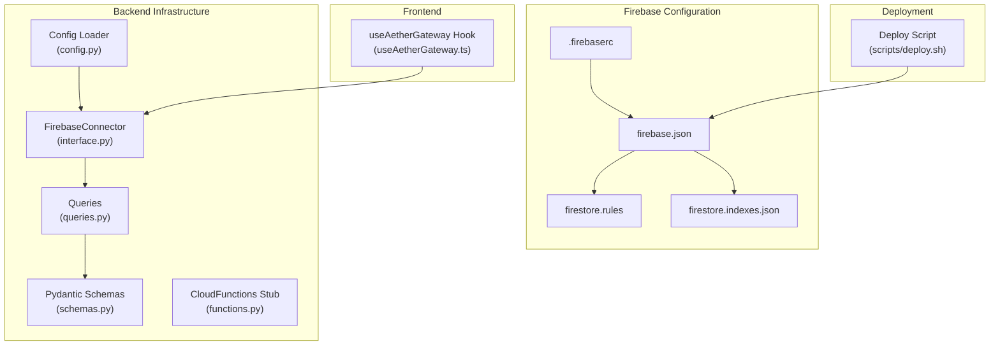
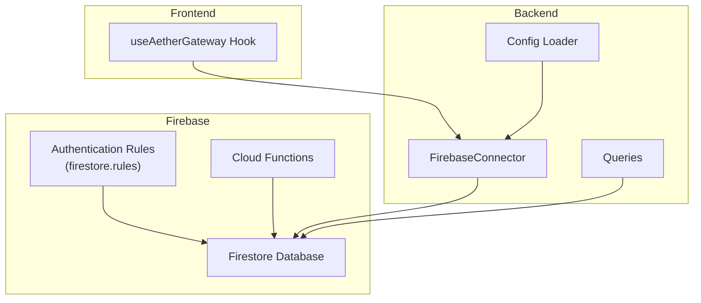
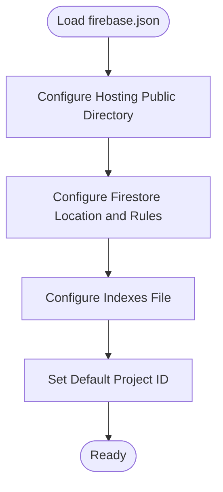
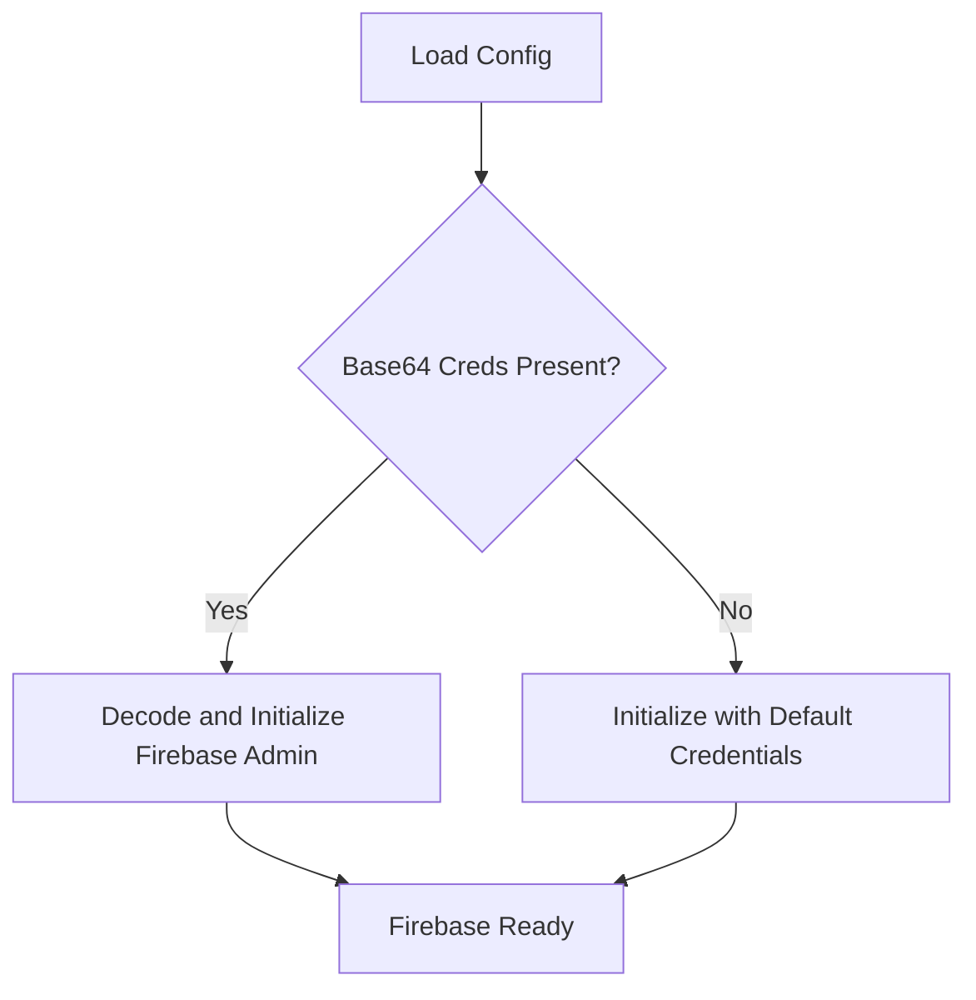
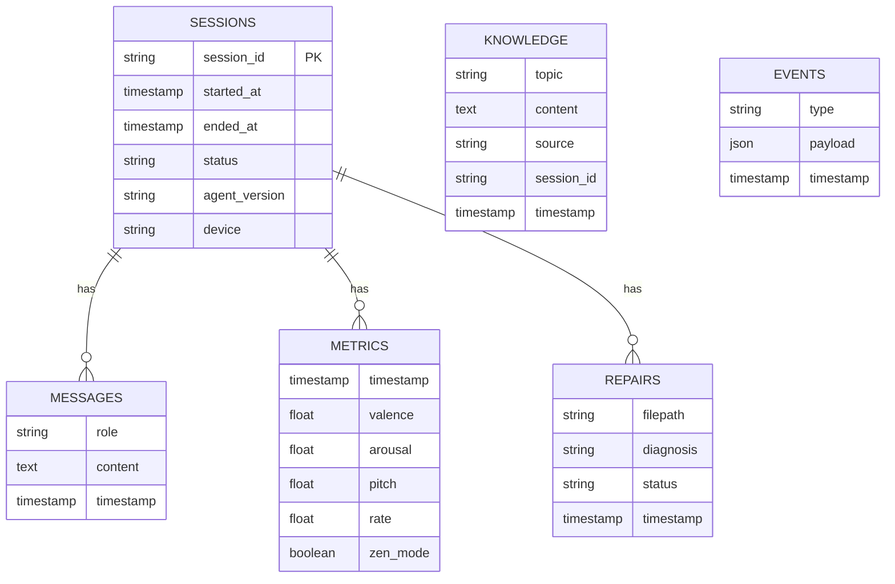
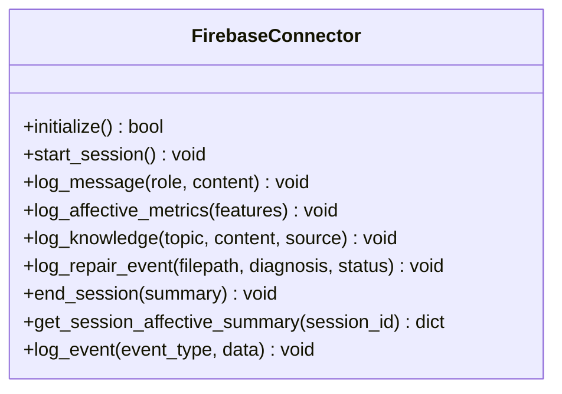
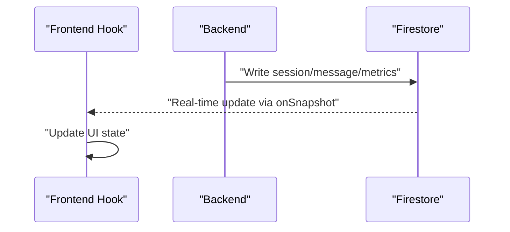
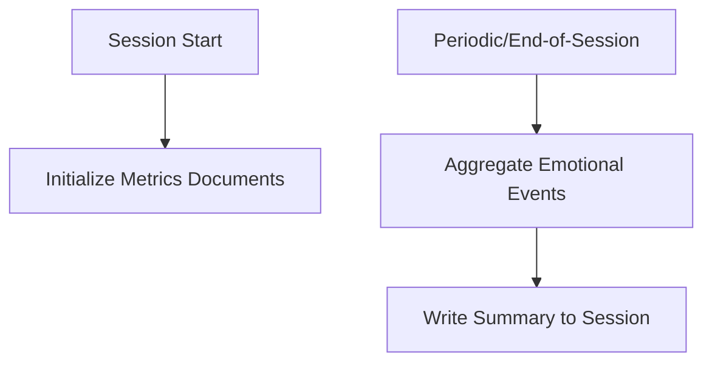
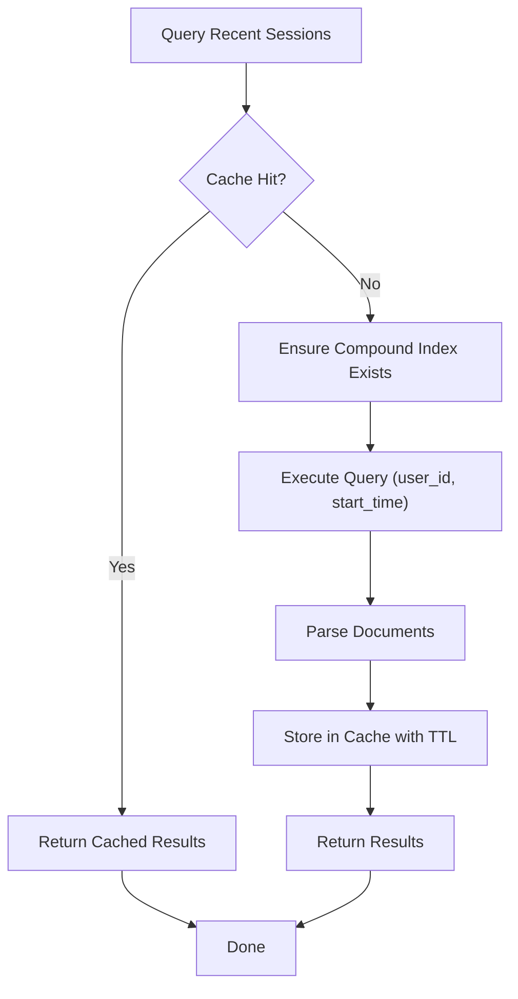
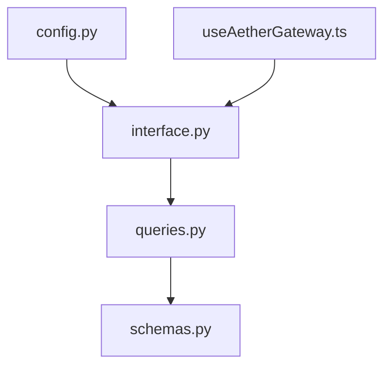

# Cloud Services and Firebase Integration

<cite>
**Referenced Files in This Document**
- [firebase.json](file://firebase.json)
- [.firebaserc](file://.firebaserc)
- [firestore.rules](file://firestore.rules)
- [firestore.indexes.json](file://firestore.indexes.json)
- [interface.py](file://core/infra/cloud/firebase/interface.py)
- [queries.py](file://core/infra/cloud/firebase/queries.py)
- [schemas.py](file://core/infra/cloud/firebase/schemas.py)
- [functions.py](file://core/infra/cloud/functions.py)
- [config.py](file://core/infra/config.py)
- [useAetherGateway.ts](file://apps/portal/src/hooks/useAetherGateway.ts)
- [deploy.sh](file://scripts/deploy.sh)
</cite>

## Table of Contents
1. [Introduction](#introduction)
2. [Project Structure](#project-structure)
3. [Core Components](#core-components)
4. [Architecture Overview](#architecture-overview)
5. [Detailed Component Analysis](#detailed-component-analysis)
6. [Dependency Analysis](#dependency-analysis)
7. [Performance Considerations](#performance-considerations)
8. [Troubleshooting Guide](#troubleshooting-guide)
9. [Conclusion](#conclusion)
10. [Appendices](#appendices)

## Introduction
This document explains the cloud services and Firebase integration in Aether Voice OS. It covers Firebase project configuration (hosting, database rules, and security policies), the Firebase interface implementation for cloud storage, real-time updates, and authentication integration, the Firestore database schema and indexing strategies, Firebase CLI configuration and deployment targets, and environment management. It also provides examples of cloud function integration, real-time data synchronization, backup procedures, security best practices, performance monitoring, cost optimization, and guidance for customizing Firebase services and integrating additional cloud providers.

## Project Structure
Aether Voice OS organizes Firebase-related configuration and code under:
- Firebase project configuration files at the repository root
- Firebase persistence and query logic under core infrastructure
- Frontend integration for real-time updates under the portal application
- Deployment orchestration scripts

**Diagram sources**
- [firebase.json](file://firebase.json#L1-L16)
- [.firebaserc](file://.firebaserc#L1-L8)
- [firestore.rules](file://firestore.rules#L1-L10)
- [firestore.indexes.json](file://firestore.indexes.json#L1-L52)
- [interface.py](file://core/infra/cloud/firebase/interface.py#L15-L259)
- [queries.py](file://core/infra/cloud/firebase/queries.py#L20-L74)
- [schemas.py](file://core/infra/cloud/firebase/schemas.py#L30-L38)
- [config.py](file://core/infra/config.py#L102-L175)
- [functions.py](file://core/infra/cloud/functions.py#L6-L45)
- [useAetherGateway.ts](file://apps/portal/src/hooks/useAetherGateway.ts#L1-L299)
- [deploy.sh](file://scripts/deploy.sh#L1-L37)

**Section sources**
- [firebase.json](file://firebase.json#L1-L16)
- [.firebaserc](file://.firebaserc#L1-L8)
- [firestore.rules](file://firestore.rules#L1-L10)
- [firestore.indexes.json](file://firestore.indexes.json#L1-L52)
- [interface.py](file://core/infra/cloud/firebase/interface.py#L15-L259)
- [queries.py](file://core/infra/cloud/firebase/queries.py#L20-L74)
- [schemas.py](file://core/infra/cloud/firebase/schemas.py#L30-L38)
- [config.py](file://core/infra/config.py#L102-L175)
- [functions.py](file://core/infra/cloud/functions.py#L6-L45)
- [useAetherGateway.ts](file://apps/portal/src/hooks/useAetherGateway.ts#L1-L299)
- [deploy.sh](file://scripts/deploy.sh#L1-L37)

## Core Components
- FirebaseConnector: Provides asynchronous initialization, session lifecycle, message logging, affective metrics logging, knowledge logging, repair event logging, session completion, affective summary aggregation, and generic event logging. It initializes the Firebase Admin SDK with Base64-encoded service account credentials when available, otherwise falls back to default credentials.
- Queries: Implements a cached query for recent sessions with a compound index requirement and in-memory caching to reduce Firestore reads.
- Pydantic Schemas: Defines structured models for session metadata and related telemetry.
- CloudFunctions: A stub for Firebase Cloud Functions that would handle triggers such as session start and emotion aggregation.
- Config Loader: Loads runtime configuration including Base64-encoded Firebase credentials and environment variables.
- Frontend Hook: Manages the local gateway connection and real-time event handling; while not directly Firebase, it integrates with backend components that use Firebase.

**Section sources**
- [interface.py](file://core/infra/cloud/firebase/interface.py#L15-L259)
- [queries.py](file://core/infra/cloud/firebase/queries.py#L20-L74)
- [schemas.py](file://core/infra/cloud/firebase/schemas.py#L30-L38)
- [functions.py](file://core/infra/cloud/functions.py#L6-L45)
- [config.py](file://core/infra/config.py#L102-L175)
- [useAetherGateway.ts](file://apps/portal/src/hooks/useAetherGateway.ts#L1-L299)

## Architecture Overview
The system architecture connects the frontend to the backend, which persists data to Firestore and optionally triggers cloud functions. Authentication is enforced at the database level, and the frontend subscribes to real-time updates.

**Diagram sources**
- [useAetherGateway.ts](file://apps/portal/src/hooks/useAetherGateway.ts#L1-L299)
- [config.py](file://core/infra/config.py#L102-L175)
- [interface.py](file://core/infra/cloud/firebase/interface.py#L15-L259)
- [queries.py](file://core/infra/cloud/firebase/queries.py#L20-L74)
- [firestore.rules](file://firestore.rules#L1-L10)

## Detailed Component Analysis

### Firebase Project Configuration
- Hosting: The portal’s static build is served from the configured public directory, with ignored paths to avoid uploading unnecessary files.
- Firestore: The Firestore database location and rules file are defined, along with the indexes file.
- Project Target: The default project is identified by a project ID.

**Diagram sources**
- [firebase.json](file://firebase.json#L1-L16)
- [.firebaserc](file://.firebaserc#L1-L8)

**Section sources**
- [firebase.json](file://firebase.json#L1-L16)
- [.firebaserc](file://.firebaserc#L1-L8)

### Security Policies and Authentication
- Database Rules: Requests require an authenticated user for read/write operations.
- Credential Management: The backend decodes Base64-encoded service account credentials for secure initialization; otherwise it falls back to default credentials.

**Diagram sources**
- [config.py](file://core/infra/config.py#L161-L175)
- [firestore.rules](file://firestore.rules#L1-L10)

**Section sources**
- [firestore.rules](file://firestore.rules#L1-L10)
- [config.py](file://core/infra/config.py#L161-L175)

### Firestore Schema and Indexing Strategies
- Collections and Subcollections:
  - sessions: top-level collection for session metadata
  - sessions/{id}/messages: subcollection for chat logs
  - sessions/{id}/metrics: subcollection for affective telemetry
  - sessions/{id}/repairs: subcollection for autonomous repair events
  - knowledge: top-level collection for scraped context
  - events: top-level collection for generic events
- Indexing:
  - The indexes file is currently empty; compound indexes are required for queries like recent sessions filtered by user and ordered by start time.
  - The queries module documents the required compound index and caching strategy.

**Diagram sources**
- [interface.py](file://core/infra/cloud/firebase/interface.py#L62-L203)
- [queries.py](file://core/infra/cloud/firebase/queries.py#L24-L74)

**Section sources**
- [interface.py](file://core/infra/cloud/firebase/interface.py#L62-L203)
- [queries.py](file://core/infra/cloud/firebase/queries.py#L24-L74)
- [firestore.indexes.json](file://firestore.indexes.json#L1-L52)

### Firebase Interface Implementation
- Initialization: Establishes Firestore client with Base64 credentials or default credentials.
- Session Lifecycle: Creates a session document, logs messages to the messages subcollection, logs affective metrics to the metrics subcollection, logs knowledge to the knowledge collection, logs repair events to the repairs subcollection, and updates session status on completion.
- Analytics: Aggregates affective metrics for genetic optimizer fitness and logs generic events.

**Diagram sources**
- [interface.py](file://core/infra/cloud/firebase/interface.py#L15-L259)

**Section sources**
- [interface.py](file://core/infra/cloud/firebase/interface.py#L15-L259)

### Real-Time Data Synchronization
- Frontend Integration: The frontend hook manages WebSocket communication with the local gateway and handles real-time broadcasts. While not directly Firebase, it coordinates with backend components that persist and synchronize data via Firestore.
- Backend-to-Frontend Flow: Backend writes to Firestore; the frontend subscribes to Firestore collections/subcollections for real-time updates.

**Diagram sources**
- [useAetherGateway.ts](file://apps/portal/src/hooks/useAetherGateway.ts#L1-L299)
- [interface.py](file://core/infra/cloud/firebase/interface.py#L85-L140)

**Section sources**
- [useAetherGateway.ts](file://apps/portal/src/hooks/useAetherGateway.ts#L1-L299)
- [interface.py](file://core/infra/cloud/firebase/interface.py#L85-L140)

### Cloud Function Integration
- Stub Behavior: The CloudFunctions class simulates triggers for session start and emotion aggregation. In a real environment, these would be implemented as actual Firebase Cloud Functions to operate on Firestore documents.

**Diagram sources**
- [functions.py](file://core/infra/cloud/functions.py#L6-L45)

**Section sources**
- [functions.py](file://core/infra/cloud/functions.py#L6-L45)

### Query Optimization and Caching
- Compound Index Requirement: The recent sessions query requires a compound index on user_id ascending and start_time descending.
- In-Memory Cache: A simple cache with TTL reduces repeated reads for recent sessions.

**Diagram sources**
- [queries.py](file://core/infra/cloud/firebase/queries.py#L24-L74)

**Section sources**
- [queries.py](file://core/infra/cloud/firebase/queries.py#L24-L74)
- [firestore.indexes.json](file://firestore.indexes.json#L1-L52)

### Backup Procedures
- Firestore Backups: Use automated exports to Cloud Storage or take snapshots via the Firebase Console. Schedule regular backups and validate restore procedures.
- Configuration Backups: Keep copies of firebase.json, .firebaserc, and security rules in version control with appropriate access controls.

[No sources needed since this section provides general guidance]

### Firebase CLI Configuration and Environment Management
- CLI Targets: Configure project defaults and targets in .firebaserc. Use firebase.json to define hosting and Firestore settings.
- Environment Variables: Store sensitive credentials as Base64-encoded service account JSON in environment variables for CI/CD and production deployments.
- Deployment: Use the provided deployment script to orchestrate containerized deployment; ensure Firebase CLI is installed and authenticated for manual deployments.

**Section sources**
- [.firebaserc](file://.firebaserc#L1-L8)
- [firebase.json](file://firebase.json#L1-L16)
- [config.py](file://core/infra/config.py#L161-L175)
- [deploy.sh](file://scripts/deploy.sh#L1-L37)

## Dependency Analysis
The Firebase integration centers around the FirebaseConnector and supporting modules. The connector depends on the configuration loader for credentials and uses Firestore client APIs. Queries depend on Firestore client and Pydantic schemas for typed results. The frontend hook coordinates with backend components that use Firebase.

**Diagram sources**
- [config.py](file://core/infra/config.py#L102-L175)
- [interface.py](file://core/infra/cloud/firebase/interface.py#L15-L259)
- [queries.py](file://core/infra/cloud/firebase/queries.py#L20-L74)
- [schemas.py](file://core/infra/cloud/firebase/schemas.py#L30-L38)
- [useAetherGateway.ts](file://apps/portal/src/hooks/useAetherGateway.ts#L1-L299)

**Section sources**
- [config.py](file://core/infra/config.py#L102-L175)
- [interface.py](file://core/infra/cloud/firebase/interface.py#L15-L259)
- [queries.py](file://core/infra/cloud/firebase/queries.py#L20-L74)
- [schemas.py](file://core/infra/cloud/firebase/schemas.py#L30-L38)
- [useAetherGateway.ts](file://apps/portal/src/hooks/useAetherGateway.ts#L1-L299)

## Performance Considerations
- Real-time Updates: Use onSnapshot listeners judiciously; batch writes and avoid excessive subcollections to minimize bandwidth and latency.
- Query Patterns: Design queries to leverage compound indexes; prefer equality filters followed by range filters to reduce read operations.
- Caching: Apply in-memory caching for frequently accessed data with TTL to reduce Firestore reads.
- Cost Optimization: Monitor read/write units and adjust indexing strategy; use composite indexes sparingly and remove unused ones.
- Monitoring: Track Firestore metrics, function invocations, and network latency; set alerts for unusual spikes.

[No sources needed since this section provides general guidance]

## Troubleshooting Guide
- Initialization Failures: If Firebase fails to initialize, verify Base64 credentials decoding and environment variable presence. Check logs for offline mode fallback.
- Authentication Errors: Ensure requests originate from authenticated clients; review database rules for read/write conditions.
- Query Errors: Confirm compound indexes exist for queries requiring ordering and filtering; validate cache keys and TTL.
- Real-time Sync Issues: Verify Firestore listeners are attached after initialization and that session IDs are set before writing subcollection documents.

**Section sources**
- [interface.py](file://core/infra/cloud/firebase/interface.py#L31-L60)
- [queries.py](file://core/infra/cloud/firebase/queries.py#L32-L74)
- [firestore.rules](file://firestore.rules#L1-L10)

## Conclusion
Aether Voice OS integrates Firebase to support real-time collaboration, persistent session data, and telemetry. The FirebaseConnector encapsulates initialization, session lifecycle, and data logging, while the Queries module optimizes access patterns with caching and compound indexes. Security is enforced via authenticated access, and the frontend synchronizes updates via Firestore. Proper indexing, monitoring, and backup procedures ensure reliability and performance.

[No sources needed since this section summarizes without analyzing specific files]

## Appendices

### Best Practices Checklist
- Enforce authentication and least privilege access
- Design efficient queries with proper indexes
- Implement caching for hot-path reads
- Monitor costs and optimize read/write patterns
- Automate backups and disaster recovery drills
- Secure service account credentials and rotate regularly

[No sources needed since this section provides general guidance]