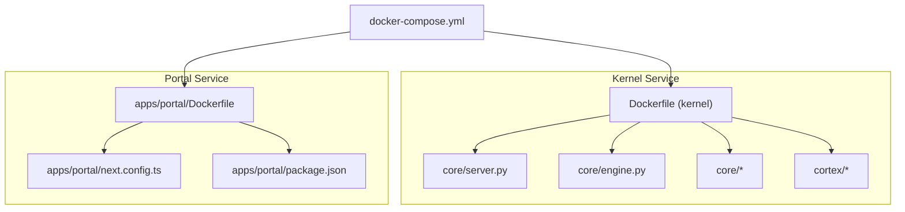
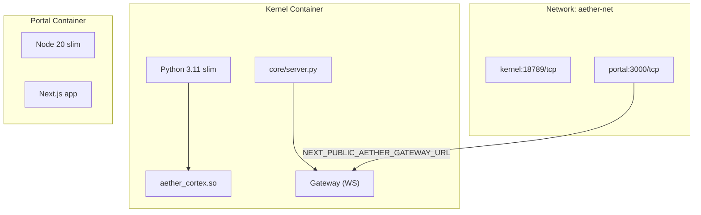
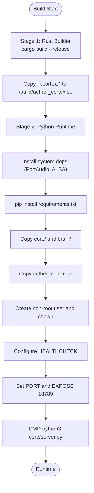
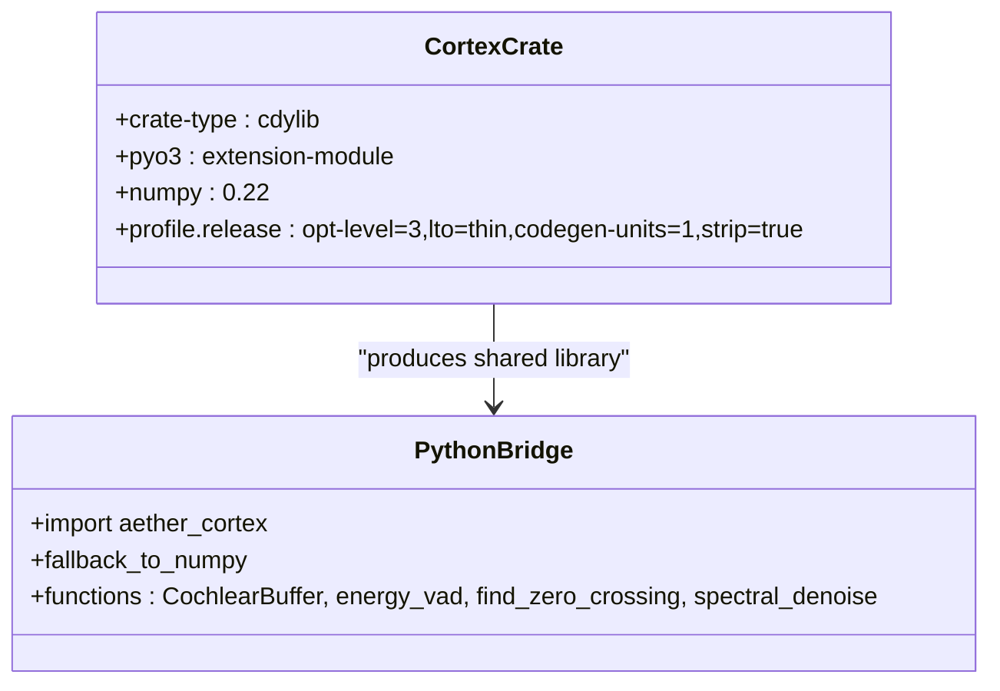
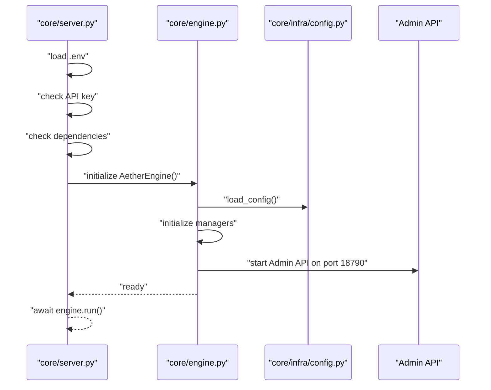
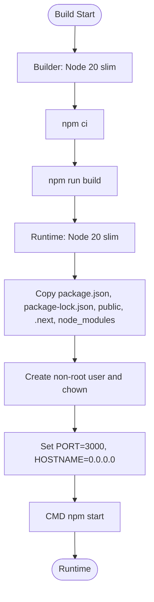
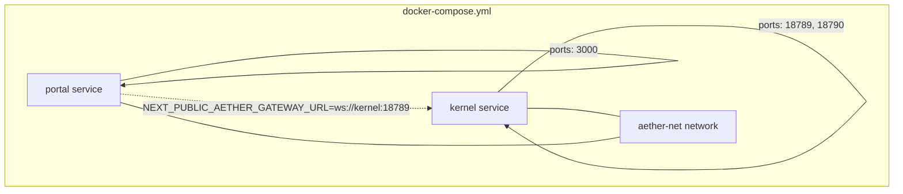
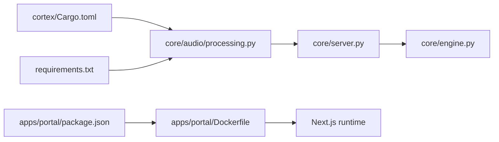

# Containerization and Docker Configuration

<cite>
**Referenced Files in This Document**
- [Dockerfile](file://Dockerfile)
- [docker-compose.yml](file://docker-compose.yml)
- [apps/portal/Dockerfile](file://apps/portal/Dockerfile)
- [.dockerignore](file://.dockerignore)
- [requirements.txt](file://requirements.txt)
- [core/server.py](file://core/server.py)
- [core/engine.py](file://core/engine.py)
- [core/infra/config.py](file://core/infra/config.py)
- [cortex/Cargo.toml](file://cortex/Cargo.toml)
- [cortex/pyproject.toml](file://cortex/pyproject.toml)
- [cortex/src/lib.rs](file://cortex/src/lib.rs)
- [core/audio/processing.py](file://core/audio/processing.py)
- [apps/portal/package.json](file://apps/portal/package.json)
- [apps/portal/next.config.ts](file://apps/portal/next.config.ts)
</cite>

## Table of Contents
1. [Introduction](#introduction)
2. [Project Structure](#project-structure)
3. [Core Components](#core-components)
4. [Architecture Overview](#architecture-overview)
5. [Detailed Component Analysis](#detailed-component-analysis)
6. [Dependency Analysis](#dependency-analysis)
7. [Performance Considerations](#performance-considerations)
8. [Troubleshooting Guide](#troubleshooting-guide)
9. [Conclusion](#conclusion)
10. [Appendices](#appendices)

## Introduction
This document explains the containerization and Docker configuration for Aether Voice OS. It covers the multi-stage Docker build process for the Rust-based audio processing library (cortex) and the Python runtime, the container architecture with separate build and runtime stages, security considerations with non-root users, health checks, and the frontend Docker configuration for the Next.js application. It also documents the docker-compose orchestration for multi-container deployment, environment customization, optimization techniques, and production deployment considerations.

## Project Structure
Aether Voice OS uses a dual-service Docker composition:
- Kernel service: Python runtime container hosting the Aether Voice OS engine and gateway.
- Portal service: Next.js frontend container providing the web dashboard and HUD.

**Diagram sources**
- [Dockerfile](file://Dockerfile#L1-L76)
- [core/server.py](file://core/server.py#L1-L149)
- [core/engine.py](file://core/engine.py#L1-L240)
- [cortex/Cargo.toml](file://cortex/Cargo.toml#L1-L24)
- [apps/portal/Dockerfile](file://apps/portal/Dockerfile#L1-L43)
- [apps/portal/next.config.ts](file://apps/portal/next.config.ts#L1-L16)
- [apps/portal/package.json](file://apps/portal/package.json#L1-L53)
- [docker-compose.yml](file://docker-compose.yml#L1-L37)

**Section sources**
- [Dockerfile](file://Dockerfile#L1-L76)
- [apps/portal/Dockerfile](file://apps/portal/Dockerfile#L1-L43)
- [docker-compose.yml](file://docker-compose.yml#L1-L37)

## Core Components
- Kernel container (Python runtime)
  - Multi-stage build: Rust stage compiles the cortex audio DSP library into a shared object; Python stage installs dependencies and runs the server entrypoint.
  - Security: runs as a non-root user.
  - Health check: probes the gateway WebSocket port.
  - Ports: exposes the gateway port used by the frontend.
- Portal container (Next.js)
  - Multi-stage build: Node builder stage compiles the frontend; runtime stage serves static assets.
  - Security: runs as a non-root user.
  - Ports: exposes the Next.js port.
- docker-compose orchestration
  - Defines two services, environment variables, port mappings, and a shared network.

**Section sources**
- [Dockerfile](file://Dockerfile#L11-L76)
- [apps/portal/Dockerfile](file://apps/portal/Dockerfile#L5-L43)
- [docker-compose.yml](file://docker-compose.yml#L1-L37)

## Architecture Overview
The container architecture separates concerns across build and runtime stages, ensuring minimal image size and secure execution. The kernel container hosts the Aether Voice OS engine and the gateway, while the portal container hosts the Next.js dashboard. Communication occurs over a shared network with explicit port mappings.

**Diagram sources**
- [Dockerfile](file://Dockerfile#L31-L76)
- [apps/portal/Dockerfile](file://apps/portal/Dockerfile#L19-L43)
- [docker-compose.yml](file://docker-compose.yml#L18-L32)

## Detailed Component Analysis

### Kernel Container (Dockerfile)
- Multi-stage build
  - Rust stage builds the cortex crate as a cdylib and produces a shared library artifact copied to the runtime stage.
  - Python stage installs system dependencies, Python dependencies, copies application code, and places the compiled Rust library into the runtime.
- System dependencies
  - Includes build-essential, PortAudio, and ALSA development headers for PyAudio and audio device access.
- Environment variables and port exposure
  - Sets the runtime port via an environment variable and exposes the port.
- Health check
  - Validates connectivity to the gateway WebSocket port from inside the container.
- Security
  - Creates a non-root user and switches to it for the runtime.
- Entry point
  - Starts the server entrypoint that initializes the engine and admin API.

**Diagram sources**
- [Dockerfile](file://Dockerfile#L11-L76)
- [requirements.txt](file://requirements.txt#L1-L52)

**Section sources**
- [Dockerfile](file://Dockerfile#L11-L76)
- [requirements.txt](file://requirements.txt#L1-L52)

### Cortex Audio DSP Library (Rust)
- Crate configuration
  - Builds a cdylib with optimized release profile and PyO3 extension features.
  - Declares Python binding metadata and module name.
- Python integration
  - The Python audio processing module dynamically loads the compiled shared library and falls back to NumPy implementations if unavailable.
- Module exports
  - Provides ring buffer, VAD, zero-crossing detection, and spectral denoise functions mapped to the Rust implementation.

**Diagram sources**
- [cortex/Cargo.toml](file://cortex/Cargo.toml#L1-L24)
- [cortex/pyproject.toml](file://cortex/pyproject.toml#L1-L15)
- [cortex/src/lib.rs](file://cortex/src/lib.rs#L28-L47)
- [core/audio/processing.py](file://core/audio/processing.py#L42-L95)

**Section sources**
- [cortex/Cargo.toml](file://cortex/Cargo.toml#L1-L24)
- [cortex/pyproject.toml](file://cortex/pyproject.toml#L1-L15)
- [cortex/src/lib.rs](file://cortex/src/lib.rs#L28-L47)
- [core/audio/processing.py](file://core/audio/processing.py#L42-L95)

### Python Runtime Entrypoint and Engine
- Entrypoint
  - Loads environment variables from a .env file if available, validates API keys, checks dependencies, and starts the engine.
- Engine initialization
  - Initializes managers for audio, gateway, infrastructure, and admin API; sets up logging and vector store.
- Admin API
  - Runs on a separate port for health and diagnostics.

**Diagram sources**
- [core/server.py](file://core/server.py#L105-L149)
- [core/engine.py](file://core/engine.py#L26-L120)
- [core/infra/config.py](file://core/infra/config.py#L113-L142)

**Section sources**
- [core/server.py](file://core/server.py#L105-L149)
- [core/engine.py](file://core/engine.py#L26-L120)
- [core/infra/config.py](file://core/infra/config.py#L113-L142)

### Portal Container (Next.js)
- Multi-stage build
  - Builder stage installs Node dependencies and builds the Next.js app.
  - Runtime stage copies production artifacts and runs the production server.
- Security
  - Creates a non-root user and sets ownership.
- Networking
  - Exposes the Next.js port and binds to all interfaces for container access.

**Diagram sources**
- [apps/portal/Dockerfile](file://apps/portal/Dockerfile#L5-L43)
- [apps/portal/package.json](file://apps/portal/package.json#L1-L53)
- [apps/portal/next.config.ts](file://apps/portal/next.config.ts#L1-L16)

**Section sources**
- [apps/portal/Dockerfile](file://apps/portal/Dockerfile#L5-L43)
- [apps/portal/package.json](file://apps/portal/package.json#L1-L53)
- [apps/portal/next.config.ts](file://apps/portal/next.config.ts#L1-L16)

### docker-compose Orchestration
- Services
  - kernel: builds from the root Dockerfile, exposes gateway and admin ports, passes API key environment, and connects to the shared network.
  - portal: builds from the portal Dockerfile, exposes the Next.js port, sets frontend environment variables pointing to the kernel gateway URL, and depends on kernel.
- Network
  - Shared bridge network for inter-service communication.

**Diagram sources**
- [docker-compose.yml](file://docker-compose.yml#L1-L37)

**Section sources**
- [docker-compose.yml](file://docker-compose.yml#L1-L37)

## Dependency Analysis
- Kernel container dependencies
  - Python runtime depends on the compiled Rust library placed under the audio module path.
  - System dependencies include PortAudio and ALSA for audio I/O.
- Frontend dependencies
  - Next.js application dependencies are declared in the portal’s package manifest.
- Build-time dependencies
  - Rust toolchain and system compilers for the cortex crate.
  - Node toolchain for the Next.js build.

**Diagram sources**
- [cortex/Cargo.toml](file://cortex/Cargo.toml#L1-L24)
- [core/audio/processing.py](file://core/audio/processing.py#L42-L95)
- [requirements.txt](file://requirements.txt#L1-L52)
- [core/server.py](file://core/server.py#L105-L149)
- [core/engine.py](file://core/engine.py#L26-L120)
- [apps/portal/package.json](file://apps/portal/package.json#L1-L53)
- [apps/portal/Dockerfile](file://apps/portal/Dockerfile#L5-L43)

**Section sources**
- [cortex/Cargo.toml](file://cortex/Cargo.toml#L1-L24)
- [core/audio/processing.py](file://core/audio/processing.py#L42-L95)
- [requirements.txt](file://requirements.txt#L1-L52)
- [apps/portal/package.json](file://apps/portal/package.json#L1-L53)
- [apps/portal/Dockerfile](file://apps/portal/Dockerfile#L5-L43)

## Performance Considerations
- Multi-stage builds
  - Keep builder images lean; only copy necessary artifacts to the runtime stage to reduce attack surface and image size.
- Release builds
  - Rust release profile enables aggressive optimizations for the cortex library.
- Python dependency caching
  - Copy requirements.txt before installing to leverage Docker layer caching.
- Static asset delivery
  - Next.js export mode reduces runtime overhead for the portal container.
- Resource limits
  - Configure CPU/memory limits per service in production orchestration platforms to prevent noisy-neighbor issues.
- Portability
  - Use environment variables for ports and endpoints to simplify deployments across platforms.

[No sources needed since this section provides general guidance]

## Troubleshooting Guide
- Missing API key
  - The server entrypoint enforces presence of an API key before starting the engine.
- Dependency validation
  - The server entrypoint checks for required Python packages and exits with guidance if missing.
- Health check failures
  - The kernel container health check attempts to connect to the gateway port; verify port exposure and service readiness.
- Audio device access
  - Ensure system dependencies for audio devices are present in the runtime container.
- Frontend connectivity
  - Confirm the portal environment variable for the gateway URL points to the kernel service and port.

**Section sources**
- [core/server.py](file://core/server.py#L62-L102)
- [Dockerfile](file://Dockerfile#L66-L68)
- [apps/portal/Dockerfile](file://apps/portal/Dockerfile#L33-L35)

## Conclusion
Aether Voice OS employs a robust multi-stage Docker configuration that cleanly separates the Rust audio DSP build from the Python runtime, hardens the containers with non-root users, and integrates a health check for operational reliability. The docker-compose setup orchestrates the kernel and portal services with explicit networking and environment configuration. These practices support efficient builds, secure runtime execution, and straightforward production deployments.

[No sources needed since this section summarizes without analyzing specific files]

## Appendices

### Building and Running Containers
- Build the kernel container
  - Use the root Dockerfile to build the kernel image.
- Build the portal container
  - Use the portal Dockerfile to build the Next.js image.
- Run with docker-compose
  - Define the API key environment variable and bring up the stack; the portal will connect to the kernel gateway URL.

**Section sources**
- [Dockerfile](file://Dockerfile#L1-L76)
- [apps/portal/Dockerfile](file://apps/portal/Dockerfile#L1-L43)
- [docker-compose.yml](file://docker-compose.yml#L1-L37)

### Customization Examples
- Environment variables
  - Set the API key via the compose environment or platform secrets.
  - Adjust the gateway port by overriding the environment variable and exposing the appropriate port.
- Ports
  - Modify port mappings in docker-compose to suit your deployment needs.
- Image customization
  - Add or remove Python dependencies in the requirements file.
  - Switch the base images to distroless variants for further hardening (ensure runtime compatibility).

**Section sources**
- [docker-compose.yml](file://docker-compose.yml#L8-L14)
- [Dockerfile](file://Dockerfile#L70-L72)
- [requirements.txt](file://requirements.txt#L1-L52)

### Production Deployment Considerations
- Non-root execution
  - Both containers run as non-root users; maintain this posture in production.
- Health checks
  - Use the existing health check to integrate with platform health probes.
- Resource limits
  - Apply CPU and memory constraints per service to ensure predictable performance.
- Secrets management
  - Pass sensitive configuration via environment variables or secret mounts rather than baking into images.
- Networking
  - Keep the shared network for internal communication; avoid exposing unnecessary ports publicly.

**Section sources**
- [Dockerfile](file://Dockerfile#L62-L64)
- [apps/portal/Dockerfile](file://apps/portal/Dockerfile#L33-L35)
- [docker-compose.yml](file://docker-compose.yml#L14-L16)