# Deployment and Operations

<cite>
**Referenced Files in This Document**
- [cloudbuild.yaml](file://cloudbuild.yaml)
- [Dockerfile](file://Dockerfile)
- [docker-compose.yml](file://docker-compose.yml)
- [firebase.json](file://firebase.json)
- [.firebaserc](file://.firebaserc)
- [firestore.rules](file://firestore.rules)
- [firestore.indexes.json](file://firestore.indexes.json)
- [core/infra/config.py](file://core/infra/config.py)
- [core/server.py](file://core/server.py)
- [apps/portal/Dockerfile](file://apps/portal/Dockerfile)
- [scripts/deploy.sh](file://scripts/deploy.sh)
- [infra/scripts/tools/deploy.sh](file://infra/scripts/tools/deploy.sh)
- [core/infra/cloud/firebase/interface.py](file://core/infra/cloud/firebase/interface.py)
- [core/infra/cloud/firebase/queries.py](file://core/infra/cloud/firebase/queries.py)
- [.github/workflows/aether_pipeline.yml](file://.github/workflows/aether_pipeline.yml)
</cite>

## Table of Contents
1. [Introduction](#introduction)
2. [Project Structure](#project-structure)
3. [Core Components](#core-components)
4. [Architecture Overview](#architecture-overview)
5. [Detailed Component Analysis](#detailed-component-analysis)
6. [Dependency Analysis](#dependency-analysis)
7. [Performance Considerations](#performance-considerations)
8. [Troubleshooting Guide](#troubleshooting-guide)
9. [Conclusion](#conclusion)
10. [Appendices](#appendices)

## Introduction
This document provides comprehensive guidance for deploying and operating Aether Voice OS in production. It covers containerization strategies for backend and frontend, CI/CD pipelines, Firebase integration, environment configuration, secrets management, infrastructure provisioning, monitoring and logging, performance tuning, scaling, maintenance, rollback, disaster recovery, and operational best practices.

## Project Structure
Aether Voice OS is organized into:
- Backend kernel (Python) with a Rust audio processing layer (compiled to a shared library)
- Frontend portal (Next.js) for the HUD and dashboard
- Firebase hosting and Firestore for persistence and hosting
- CI/CD via GitHub Actions and Google Cloud Build
- Docker-based containerization for local development and cloud deployment

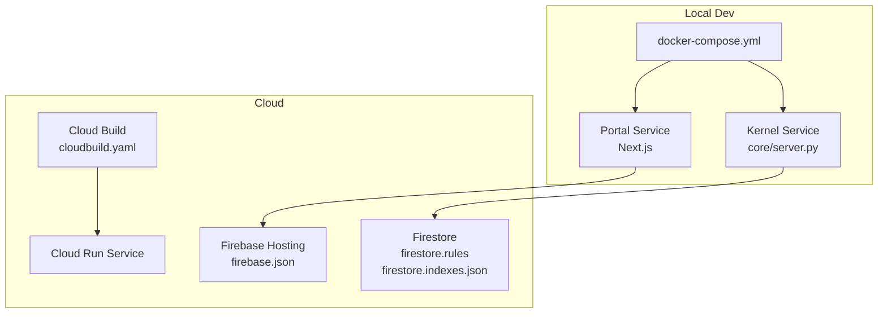

**Diagram sources**
- [docker-compose.yml](file://docker-compose.yml#L1-L37)
- [cloudbuild.yaml](file://cloudbuild.yaml#L1-L55)
- [firebase.json](file://firebase.json#L1-L16)
- [firestore.rules](file://firestore.rules#L1-L10)
- [firestore.indexes.json](file://firestore.indexes.json#L1-L52)

**Section sources**
- [docker-compose.yml](file://docker-compose.yml#L1-L37)
- [cloudbuild.yaml](file://cloudbuild.yaml#L1-L55)
- [firebase.json](file://firebase.json#L1-L16)

## Core Components
- Backend kernel containerizes the Python engine and Rust audio layer, exposes a WebSocket gateway, and integrates with Firebase for persistence.
- Frontend portal containerizes the Next.js HUD and dashboard, connects to the kernel via WebSocket, and is hosted via Firebase.
- CI/CD automates linting, testing, security scanning, and Docker image building for both local and cloud deployment.
- Firebase provides Firestore-backed persistence and static hosting for the portal.

Key configuration and runtime behaviors are driven by environment variables and settings loaded at startup.

**Section sources**
- [Dockerfile](file://Dockerfile#L1-L76)
- [apps/portal/Dockerfile](file://apps/portal/Dockerfile#L1-L43)
- [core/infra/config.py](file://core/infra/config.py#L1-L158)
- [core/server.py](file://core/server.py#L1-L149)
- [core/infra/cloud/firebase/interface.py](file://core/infra/cloud/firebase/interface.py#L1-L259)

## Architecture Overview
The deployment architecture supports two primary modes:
- Local development with Docker Compose (kernel and portal containers plus networking)
- Cloud deployment via Google Cloud Build to Cloud Run for the kernel, with the portal hosted on Firebase

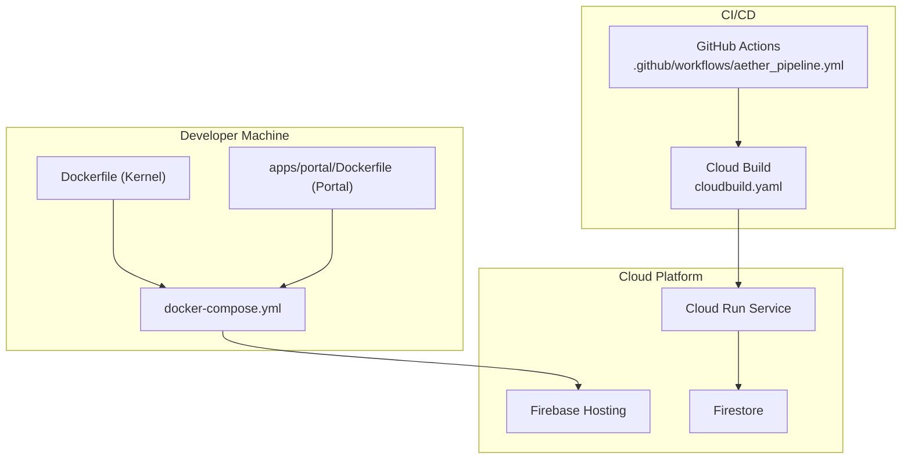

**Diagram sources**
- [Dockerfile](file://Dockerfile#L1-L76)
- [apps/portal/Dockerfile](file://apps/portal/Dockerfile#L1-L43)
- [docker-compose.yml](file://docker-compose.yml#L1-L37)
- [.github/workflows/aether_pipeline.yml](file://.github/workflows/aether_pipeline.yml#L1-L160)
- [cloudbuild.yaml](file://cloudbuild.yaml#L1-L55)
- [firebase.json](file://firebase.json#L1-L16)

## Detailed Component Analysis

### Backend Kernel Containerization
The kernel container:
- Builds the Rust audio layer (shared library) and copies it into the Python runtime
- Installs Python dependencies and copies application code
- Runs the server entrypoint with a non-root user
- Exposes the WebSocket gateway port and includes a health check against the gateway

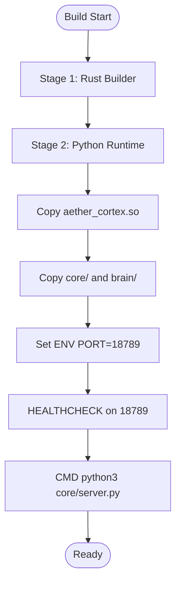

**Diagram sources**
- [Dockerfile](file://Dockerfile#L1-L76)

**Section sources**
- [Dockerfile](file://Dockerfile#L1-L76)
- [core/server.py](file://core/server.py#L105-L149)

### Frontend Portal Containerization
The portal container:
- Uses a multi-stage build to compile and optimize the Next.js app
- Runs in production mode with a non-root user
- Exposes port 3000 and binds to 0.0.0.0

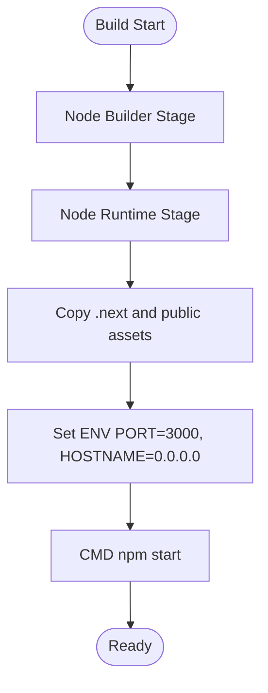

**Diagram sources**
- [apps/portal/Dockerfile](file://apps/portal/Dockerfile#L1-L43)

**Section sources**
- [apps/portal/Dockerfile](file://apps/portal/Dockerfile#L1-L43)

### Local Development with Docker Compose
Docker Compose orchestrates:
- Kernel service with environment variables for API keys and ports
- Portal service depending on the kernel and connecting via WebSocket
- A shared network for inter-service communication

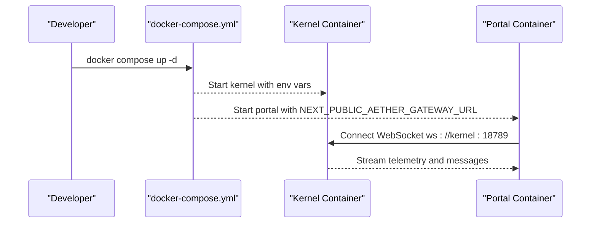

**Diagram sources**
- [docker-compose.yml](file://docker-compose.yml#L1-L37)

**Section sources**
- [docker-compose.yml](file://docker-compose.yml#L1-L37)

### Cloud Deployment with Cloud Build and Cloud Run
Cloud Build:
- Builds images tagged with commit SHA and latest
- Pushes images to Container Registry
- Deploys to Cloud Run with resource limits, concurrency, timeout, and environment variables
- Sets secrets for API keys

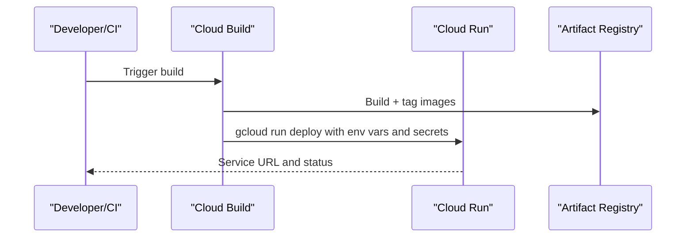

**Diagram sources**
- [cloudbuild.yaml](file://cloudbuild.yaml#L1-L55)

**Section sources**
- [cloudbuild.yaml](file://cloudbuild.yaml#L1-L55)

### CI/CD Pipeline with GitHub Actions
The unified CI pipeline:
- Rust check for the Cortex layer
- Lint and style checks for Python
- Multi-Python tests with coverage thresholds
- Next.js lint and test for the portal
- Security scanning (SAST and dependency checks)
- Docker build verification

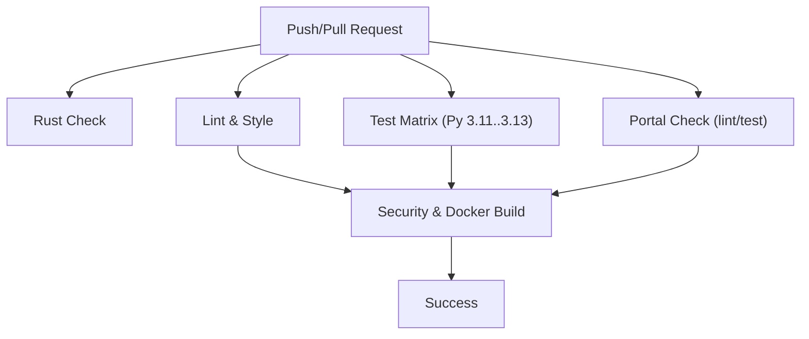

**Diagram sources**
- [.github/workflows/aether_pipeline.yml](file://.github/workflows/aether_pipeline.yml#L1-L160)

**Section sources**
- [.github/workflows/aether_pipeline.yml](file://.github/workflows/aether_pipeline.yml#L1-L160)

### Firebase Integration
Firebase configuration:
- Firestore database location and rules
- Hosting public directory and ignore patterns
- Project targeting via .firebaserc

Firestore persistence layer:
- Session, messages, metrics, knowledge, repairs, events collections
- Initialization with Base64-encoded service account credentials or default credentials
- Asynchronous logging helpers for messages, affective metrics, knowledge, repairs, and events
- Query helpers with in-memory caching for recent sessions

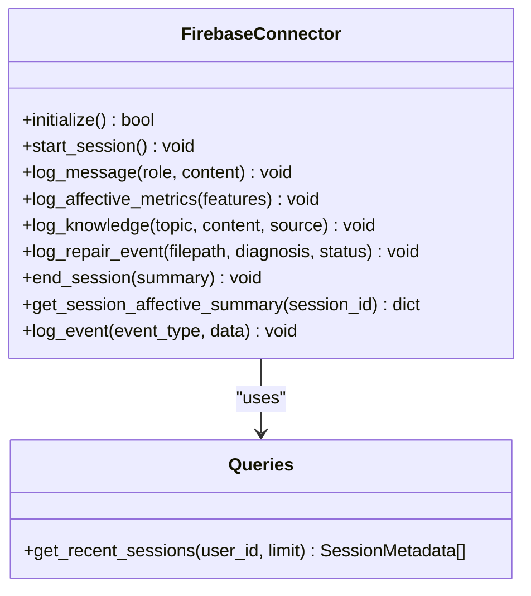

**Diagram sources**
- [core/infra/cloud/firebase/interface.py](file://core/infra/cloud/firebase/interface.py#L1-L259)
- [core/infra/cloud/firebase/queries.py](file://core/infra/cloud/firebase/queries.py#L1-L74)

**Section sources**
- [firebase.json](file://firebase.json#L1-L16)
- [.firebaserc](file://.firebaserc#L1-L8)
- [firestore.rules](file://firestore.rules#L1-L10)
- [firestore.indexes.json](file://firestore.indexes.json#L1-L52)
- [core/infra/cloud/firebase/interface.py](file://core/infra/cloud/firebase/interface.py#L1-L259)
- [core/infra/cloud/firebase/queries.py](file://core/infra/cloud/firebase/queries.py#L1-L74)

### Configuration and Environment Variables
Configuration is loaded from environment variables with a fallback mechanism:
- AI settings (model, API key, affective/proactive features)
- Audio I/O settings
- Gateway parameters (host, port, heartbeat)
- Firebase credentials passed as a Base64-encoded JSON string
- Logging level and package directory

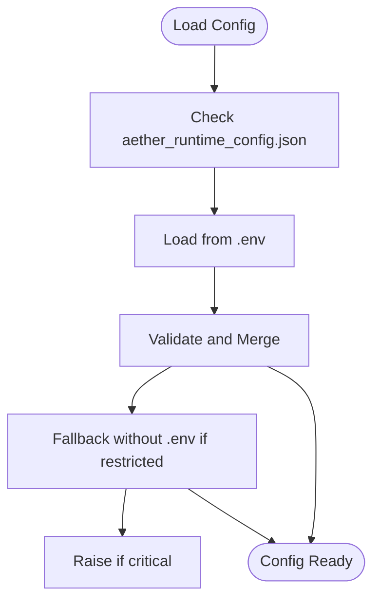

**Diagram sources**
- [core/infra/config.py](file://core/infra/config.py#L113-L158)

**Section sources**
- [core/infra/config.py](file://core/infra/config.py#L1-L158)

### Operational Scripts
- Local deployment script validates API keys, builds images, and starts services
- Cloud deployment script enables required APIs, builds with Cloud Build, and deploys to Cloud Run

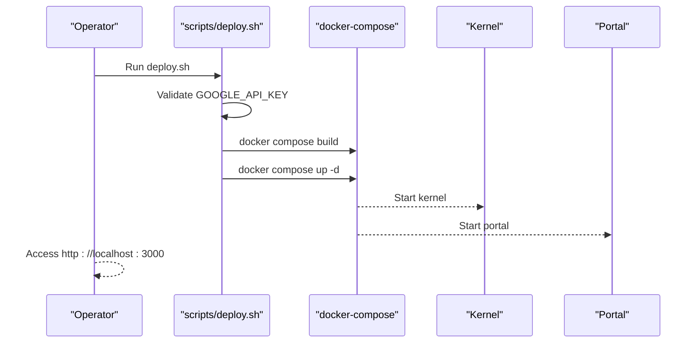

**Diagram sources**
- [scripts/deploy.sh](file://scripts/deploy.sh#L1-L37)
- [docker-compose.yml](file://docker-compose.yml#L1-L37)

**Section sources**
- [scripts/deploy.sh](file://scripts/deploy.sh#L1-L37)
- [infra/scripts/tools/deploy.sh](file://infra/scripts/tools/deploy.sh#L1-L44)

## Dependency Analysis
- Backend kernel depends on:
  - Rust audio layer compiled to a shared library
  - Python runtime and dependencies
  - Firebase admin SDK for persistence
- Frontend portal depends on:
  - Next.js runtime and static assets
  - Environment variables for gateway URL and API keys
- CI/CD depends on:
  - GitHub Actions for linting, testing, security, and Docker build
  - Cloud Build for image building and Cloud Run deployment

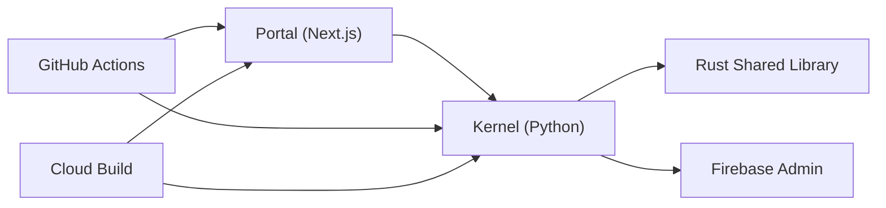

**Diagram sources**
- [Dockerfile](file://Dockerfile#L1-L76)
- [apps/portal/Dockerfile](file://apps/portal/Dockerfile#L1-L43)
- [.github/workflows/aether_pipeline.yml](file://.github/workflows/aether_pipeline.yml#L1-L160)
- [cloudbuild.yaml](file://cloudbuild.yaml#L1-L55)

**Section sources**
- [Dockerfile](file://Dockerfile#L1-L76)
- [apps/portal/Dockerfile](file://apps/portal/Dockerfile#L1-L43)
- [.github/workflows/aether_pipeline.yml](file://.github/workflows/aether_pipeline.yml#L1-L160)
- [cloudbuild.yaml](file://cloudbuild.yaml#L1-L55)

## Performance Considerations
- Container sizing and autoscaling:
  - Cloud Run deployment sets CPU and memory resources, min/max instances, and timeout to support sustained voice workloads.
- Audio pipeline:
  - Audio configuration defines sample rates, chunk sizes, and queue depths to minimize latency.
- Caching:
  - Firestore query caching reduces repeated reads for recent sessions.
- Health checks:
  - Kernel container health check monitors the gateway port to ensure readiness.

Recommendations:
- Monitor Cloud Run CPU and memory utilization; adjust resources based on observed load.
- Tune audio chunk sizes and sample rates for target hardware.
- Use Firestore composite indexes for frequent queries to reduce cold starts and latency.

**Section sources**
- [cloudbuild.yaml](file://cloudbuild.yaml#L28-L47)
- [core/infra/config.py](file://core/infra/config.py#L11-L27)
- [core/infra/cloud/firebase/queries.py](file://core/infra/cloud/firebase/queries.py#L15-L17)

## Troubleshooting Guide
Common issues and resolutions:
- Missing API key:
  - Ensure GOOGLE_API_KEY is present in environment or .env; the server performs a pre-flight check.
- Configuration errors:
  - The server prints guidance and exits if required keys are missing.
- Firebase connectivity:
  - The connector attempts initialization with Base64 credentials or default credentials; logs indicate offline mode if initialization fails.
- Port conflicts:
  - Verify that ports 18789, 18790, and 3000 are free locally or mapped appropriately.
- CI failures:
  - Review GitHub Actions logs for lint/styling, test coverage, security scans, and Docker build steps.

Operational checks:
- Confirm kernel health via the exposed gateway port and admin API.
- Validate Firestore rules and indexes for expected queries.
- Inspect Cloud Run logs for runtime exceptions and slow startup.

**Section sources**
- [core/server.py](file://core/server.py#L62-L85)
- [core/infra/cloud/firebase/interface.py](file://core/infra/cloud/firebase/interface.py#L31-L61)
- [cloudbuild.yaml](file://cloudbuild.yaml#L52-L55)

## Conclusion
Aether Voice OS provides a robust, container-first deployment model with strong CI/CD automation and Firebase integration. By leveraging Docker Compose for local development, Cloud Build for cloud deployment, and Firestore for real-time persistence, teams can operate reliably at scale. Adhering to the configuration patterns, secrets management practices, and monitoring recommendations outlined here ensures production-grade reliability and operability.

## Appendices

### Environment Variables Reference
- GOOGLE_API_KEY: API key for AI provider
- PORT: Kernel gateway port (default 18789)
- AETHER_GW_PORT: Gateway port for Cloud Run environment
- FIREBASE_CREDENTIALS_BASE64: Base64-encoded Firebase service account JSON
- LOG_LEVEL: Logging verbosity
- NEXT_PUBLIC_AETHER_GATEWAY_URL: Portal’s gateway WebSocket URL
- NEXT_PUBLIC_GEMINI_KEY: Portal’s public API key

**Section sources**
- [core/infra/config.py](file://core/infra/config.py#L35-L110)
- [docker-compose.yml](file://docker-compose.yml#L8-L26)
- [cloudbuild.yaml](file://cloudbuild.yaml#L45-L46)

### Secrets Management
- Cloud Run:
  - Secrets mounted via Cloud Secret Manager and passed as environment variables.
- Local:
  - Use .env files or exported environment variables; avoid committing secrets.

**Section sources**
- [cloudbuild.yaml](file://cloudbuild.yaml#L46-L46)
- [core/infra/config.py](file://core/infra/config.py#L94-L99)

### Infrastructure Provisioning
- Cloud:
  - Enable required APIs (Cloud Run, Firestore, Secret Manager, Cloud Build).
  - Submit build artifacts and deploy the service.
- Local:
  - Use the provided deployment script to orchestrate containers.

**Section sources**
- [infra/scripts/tools/deploy.sh](file://infra/scripts/tools/deploy.sh#L17-L38)
- [scripts/deploy.sh](file://scripts/deploy.sh#L14-L30)

### Monitoring and Logging
- Kernel:
  - Health check probes the gateway port.
  - Logs indicate Firebase initialization and session activity.
- Cloud Run:
  - Use platform logs and metrics for latency, throughput, and error rates.
- Firestore:
  - Monitor query performance and apply recommended indexes.

**Section sources**
- [Dockerfile](file://Dockerfile#L66-L68)
- [core/infra/cloud/firebase/interface.py](file://core/infra/cloud/firebase/interface.py#L40-L60)
- [firestore.indexes.json](file://firestore.indexes.json#L1-L52)

### Scaling and Maintenance
- Horizontal scaling:
  - Adjust min/max instances and CPU/memory in Cloud Run based on observed load.
- Vertical scaling:
  - Increase resources for CPU-intensive audio processing or AI sessions.
- Maintenance:
  - Rotate secrets, update base images periodically, and validate indexes after schema changes.

**Section sources**
- [cloudbuild.yaml](file://cloudbuild.yaml#L39-L43)

### Rollback and Disaster Recovery
- Rollback:
  - Cloud Run: Redeploy previous image tag or use revision rollback.
- Disaster Recovery:
  - Firestore backups and point-in-time recovery; maintain a minimal backup strategy for ephemeral telemetry.
  - Retain recent images in Artifact Registry for quick restoration.

**Section sources**
- [cloudbuild.yaml](file://cloudbuild.yaml#L12-L26)

### Best Practices for Production
- Security:
  - Store secrets in Secret Manager; restrict IAM policies; use least-privilege credentials.
- Observability:
  - Enable structured logging, metrics, and distributed tracing.
- Reliability:
  - Use health checks, readiness probes, and graceful shutdowns.
- Cost:
  - Right-size Cloud Run resources; monitor cold starts; leverage caching.

[No sources needed since this section provides general guidance]