# Monitoring and Operational Logging

<cite>
**Referenced Files in This Document**
- [apps/portal/src/hooks/useTelemetry.tsx](file://apps/portal/src/hooks/useTelemetry.tsx)
- [apps/portal/src/components/TelemetryFeed.tsx](file://apps/portal/src/components/TelemetryFeed.tsx)
- [apps/portal/src/components/HUD/SystemAnalytics.tsx](file://apps/portal/src/components/HUD/SystemAnalytics.tsx)
- [apps/portal/src/components/HUD/SystemFailure.tsx](file://apps/portal/src/components/HUD/SystemFailure.tsx)
- [apps/portal/src/components/HUD/HUDContainer.tsx](file://apps/portal/src/components/HUD/HUDContainer.tsx)
- [apps/portal/src/components/HUDCards.tsx](file://apps/portal/src/components/HUDCards.tsx)
- [apps/portal/src/store/useAetherStore.ts](file://apps/portal/src/store/useAetherStore.ts)
- [apps/portal/src/dashboard/app/page.tsx](file://apps/portal/src/dashboard/app/page.tsx)
- [apps/portal/src/hooks/useEngineTelemetry.ts](file://apps/portal/src/hooks/useEngineTelemetry.ts)
- [apps/portal/src-tauri/gen/schemas/desktop-schema.json](file://apps/portal/src-tauri/gen/schemas/desktop-schema.json)
- [apps/portal/src-tauri/gen/schemas/macOS-schema.json](file://apps/portal/src-tauri/gen/schemas/macOS-schema.json)
- [core/infra/telemetry.py](file://core/infra/telemetry.py)
- [core/infra/event_bus.py](file://core/infra/event_bus.py)
- [core/audio/telemetry.py](file://core/audio/telemetry.py)
- [core/analytics/latency.py](file://core/analytics/latency.py)
- [core/analytics/demo_metrics.py](file://core/analytics/demo_metrics.py)
- [core/ai/handover_telemetry.py](file://core/ai/handover_telemetry.py)
- [core/services/watchdog.py](file://core/services/watchdog.py)
- [tools/dashboard_generator.py](file://tools/dashboard_generator.py)
</cite>

## Table of Contents
1. [Introduction](#introduction)
2. [Project Structure](#project-structure)
3. [Core Components](#core-components)
4. [Architecture Overview](#architecture-overview)
5. [Detailed Component Analysis](#detailed-component-analysis)
6. [Dependency Analysis](#dependency-analysis)
7. [Performance Considerations](#performance-considerations)
8. [Troubleshooting Guide](#troubleshooting-guide)
9. [Conclusion](#conclusion)
10. [Appendices](#appendices)

## Introduction
This document describes the monitoring and operational logging architecture of Aether Voice OS. It covers telemetry collection for performance metrics, audio processing statistics, and system health indicators; the logging architecture with structured logging, log levels, and retention; the analytics framework for latency measurement, system performance tracking, and user behavior analysis; and the frontend HUD analytics display and real-time monitoring interfaces. It also provides practical guidance for setting up monitoring dashboards, alerting configurations, performance baselines, log aggregation and correlation, troubleshooting workflows, and extending the telemetry system.

## Project Structure
Aether Voice OS separates observability concerns across:
- Backend telemetry and analytics modules under core/, including audio telemetry, latency analytics, and OpenTelemetry integration.
- Frontend HUD and dashboard components under apps/portal/ that visualize telemetry and system state.
- A centralized event bus that routes telemetry and system events with strict latency budgets.
- A watchdog service that monitors logs and orchestrates autonomous healing.

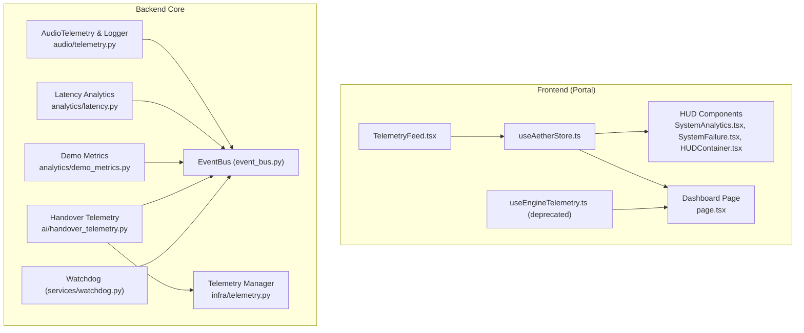

**Diagram sources**
- [apps/portal/src/store/useAetherStore.ts](file://apps/portal/src/store/useAetherStore.ts#L200-L440)
- [apps/portal/src/components/HUD/SystemAnalytics.tsx](file://apps/portal/src/components/HUD/SystemAnalytics.tsx#L36-L67)
- [apps/portal/src/components/HUD/SystemFailure.tsx](file://apps/portal/src/components/HUD/SystemFailure.tsx#L1-L34)
- [apps/portal/src/components/HUD/HUDContainer.tsx](file://apps/portal/src/components/HUD/HUDContainer.tsx#L39-L79)
- [apps/portal/src/dashboard/app/page.tsx](file://apps/portal/src/dashboard/app/page.tsx#L9-L112)
- [apps/portal/src/hooks/useEngineTelemetry.ts](file://apps/portal/src/hooks/useEngineTelemetry.ts#L1-L33)
- [apps/portal/src/components/TelemetryFeed.tsx](file://apps/portal/src/components/TelemetryFeed.tsx#L1-L40)
- [core/infra/event_bus.py](file://core/infra/event_bus.py#L69-L152)
- [core/audio/telemetry.py](file://core/audio/telemetry.py#L21-L93)
- [core/analytics/latency.py](file://core/analytics/latency.py#L7-L40)
- [core/analytics/demo_metrics.py](file://core/analytics/demo_metrics.py#L9-L50)
- [core/ai/handover_telemetry.py](file://core/ai/handover_telemetry.py#L295-L314)
- [core/infra/telemetry.py](file://core/infra/telemetry.py#L14-L130)
- [core/services/watchdog.py](file://core/services/watchdog.py#L39-L105)

**Section sources**
- [core/infra/event_bus.py](file://core/infra/event_bus.py#L69-L152)
- [core/audio/telemetry.py](file://core/audio/telemetry.py#L21-L93)
- [core/analytics/latency.py](file://core/analytics/latency.py#L7-L40)
- [core/analytics/demo_metrics.py](file://core/analytics/demo_metrics.py#L9-L50)
- [core/ai/handover_telemetry.py](file://core/ai/handover_telemetry.py#L295-L314)
- [core/infra/telemetry.py](file://core/infra/telemetry.py#L14-L130)
- [apps/portal/src/store/useAetherStore.ts](file://apps/portal/src/store/useAetherStore.ts#L200-L440)
- [apps/portal/src/components/HUD/SystemAnalytics.tsx](file://apps/portal/src/components/HUD/SystemAnalytics.tsx#L36-L67)
- [apps/portal/src/components/HUD/SystemFailure.tsx](file://apps/portal/src/components/HUD/SystemFailure.tsx#L1-L34)
- [apps/portal/src/components/HUD/HUDContainer.tsx](file://apps/portal/src/components/HUD/HUDContainer.tsx#L39-L79)
- [apps/portal/src/dashboard/app/page.tsx](file://apps/portal/src/dashboard/app/page.tsx#L9-L112)
- [apps/portal/src/hooks/useEngineTelemetry.ts](file://apps/portal/src/hooks/useEngineTelemetry.ts#L1-L33)
- [apps/portal/src/components/TelemetryFeed.tsx](file://apps/portal/src/components/TelemetryFeed.tsx#L1-L40)
- [core/services/watchdog.py](file://core/services/watchdog.py#L39-L105)

## Core Components
- Telemetry ingestion and routing via a tiered event bus with strict deadlines.
- Audio telemetry and performance logging capturing frame-level latency, AEC metrics, VAD states, and jitter.
- Latency analytics for p50/p95/p99 metrics and demo-focused accuracy and intervention latency.
- OpenTelemetry integration exporting traces to Arize/Phoenix via OTLP.
- Frontend telemetry UI and HUD analytics for real-time diagnostics.
- Watchdog service for log-based failure detection and autonomous healing.

**Section sources**
- [core/infra/event_bus.py](file://core/infra/event_bus.py#L69-L152)
- [core/audio/telemetry.py](file://core/audio/telemetry.py#L151-L394)
- [core/analytics/latency.py](file://core/analytics/latency.py#L7-L40)
- [core/analytics/demo_metrics.py](file://core/analytics/demo_metrics.py#L9-L50)
- [core/infra/telemetry.py](file://core/infra/telemetry.py#L14-L130)
- [apps/portal/src/components/TelemetryFeed.tsx](file://apps/portal/src/components/TelemetryFeed.tsx#L1-L40)
- [apps/portal/src/components/HUD/SystemAnalytics.tsx](file://apps/portal/src/components/HUD/SystemAnalytics.tsx#L36-L67)
- [core/services/watchdog.py](file://core/services/watchdog.py#L39-L105)

## Architecture Overview
The monitoring architecture integrates backend telemetry producers, a central event bus, and frontend consumers. Telemetry producers emit structured events with latency budgets; the event bus enforces priority lanes and expiration; frontend components subscribe to state and telemetry to render HUD analytics and dashboards.

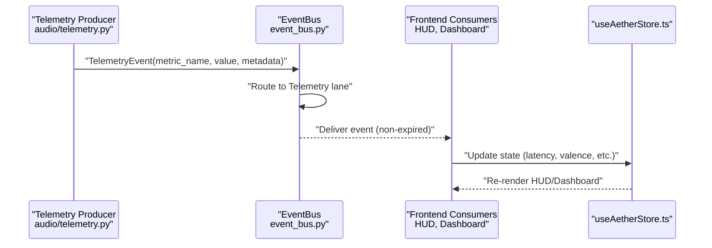

**Diagram sources**
- [core/audio/telemetry.py](file://core/audio/telemetry.py#L77-L88)
- [core/infra/event_bus.py](file://core/infra/event_bus.py#L90-L101)
- [apps/portal/src/store/useAetherStore.ts](file://apps/portal/src/store/useAetherStore.ts#L336-L342)
- [apps/portal/src/components/HUD/SystemAnalytics.tsx](file://apps/portal/src/components/HUD/SystemAnalytics.tsx#L36-L67)
- [apps/portal/src/dashboard/app/page.tsx](file://apps/portal/src/dashboard/app/page.tsx#L15-L18)

## Detailed Component Analysis

### Telemetry Ingestion and Event Bus
- SystemEvent defines a timestamp, source, and latency_budget enforced by is_expired().
- EventBus routes events to three tiers: Audio, Control, and Telemetry, with workers that drop expired events in higher-priority lanes.
- TelemetryEvent carries metric_name, value, and metadata for downstream analytics.

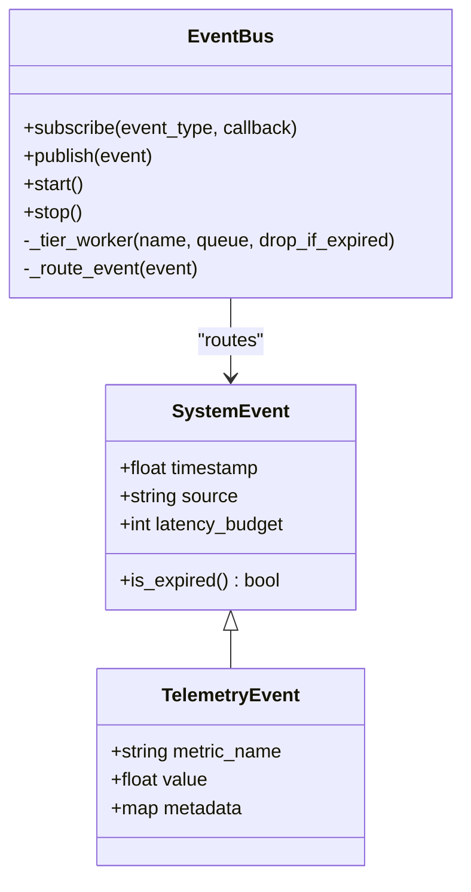

**Diagram sources**
- [core/infra/event_bus.py](file://core/infra/event_bus.py#L15-L61)
- [core/infra/event_bus.py](file://core/infra/event_bus.py#L69-L152)

**Section sources**
- [core/infra/event_bus.py](file://core/infra/event_bus.py#L15-L61)
- [core/infra/event_bus.py](file://core/infra/event_bus.py#L69-L152)

### Audio Telemetry and Performance Logging
- AudioTelemetry periodically computes RMS, pitch, and spectral centroid from PCM buffers and publishes TelemetryEvent.
- AudioTelemetryLogger tracks frame-level latency, AEC ERLE, convergence, VAD states, and queue sizes; aggregates session metrics and exposes real-time stats.
- Benchmarks and detailed CSV logs are supported for performance evaluation.

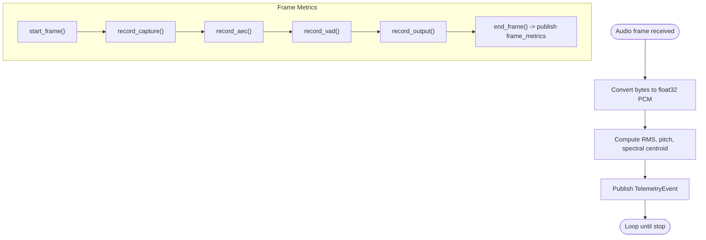

**Diagram sources**
- [core/audio/telemetry.py](file://core/audio/telemetry.py#L53-L93)
- [core/audio/telemetry.py](file://core/audio/telemetry.py#L203-L277)

**Section sources**
- [core/audio/telemetry.py](file://core/audio/telemetry.py#L21-L93)
- [core/audio/telemetry.py](file://core/audio/telemetry.py#L151-L394)

### Latency Analytics and Demo Metrics
- LatencyOptimizer maintains a sliding window of latency samples and computes p50/p95/p99 and average.
- DemoMetrics captures intervention latency and accuracy for demos and generates a report.

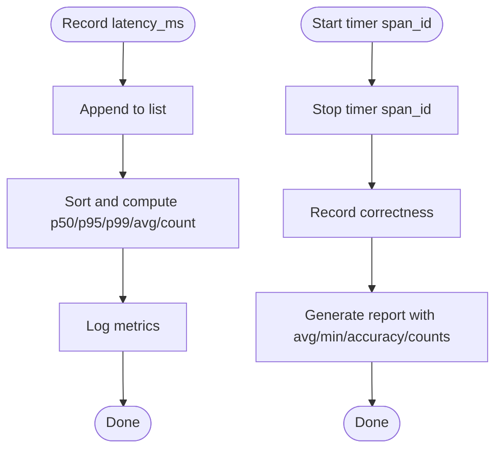

**Diagram sources**
- [core/analytics/latency.py](file://core/analytics/latency.py#L16-L40)
- [core/analytics/demo_metrics.py](file://core/analytics/demo_metrics.py#L23-L50)

**Section sources**
- [core/analytics/latency.py](file://core/analytics/latency.py#L7-L40)
- [core/analytics/demo_metrics.py](file://core/analytics/demo_metrics.py#L9-L50)

### OpenTelemetry Integration and Usage Tracking
- TelemetryManager initializes an OpenTelemetry TracerProvider and exports spans via OTLP to Arize/Phoenix, with environment-driven configuration.
- record_usage attaches token usage and estimated cost to the current span.

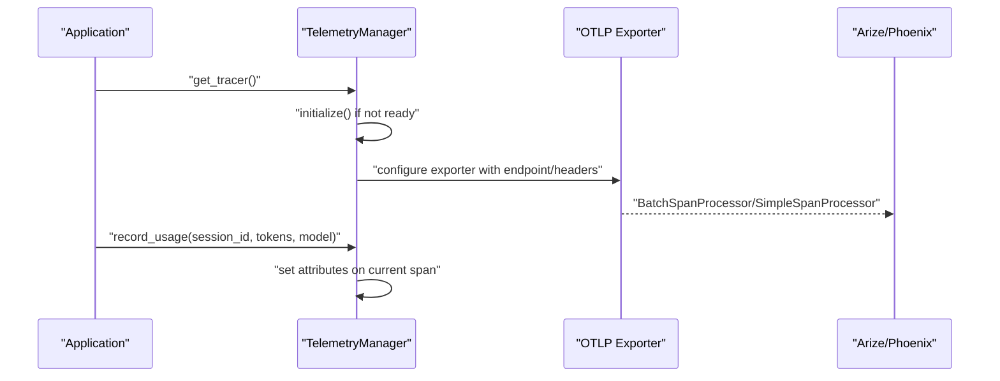

**Diagram sources**
- [core/infra/telemetry.py](file://core/infra/telemetry.py#L35-L76)
- [core/infra/telemetry.py](file://core/infra/telemetry.py#L77-L108)

**Section sources**
- [core/infra/telemetry.py](file://core/infra/telemetry.py#L14-L130)

### Handover Telemetry and Analytics
- HandoverTelemetry tracks handover operations with outcomes, performance metrics, and failure categories; supports filtering, summaries, and reports.
- Integrates with OpenTelemetry spans for tracing and status.

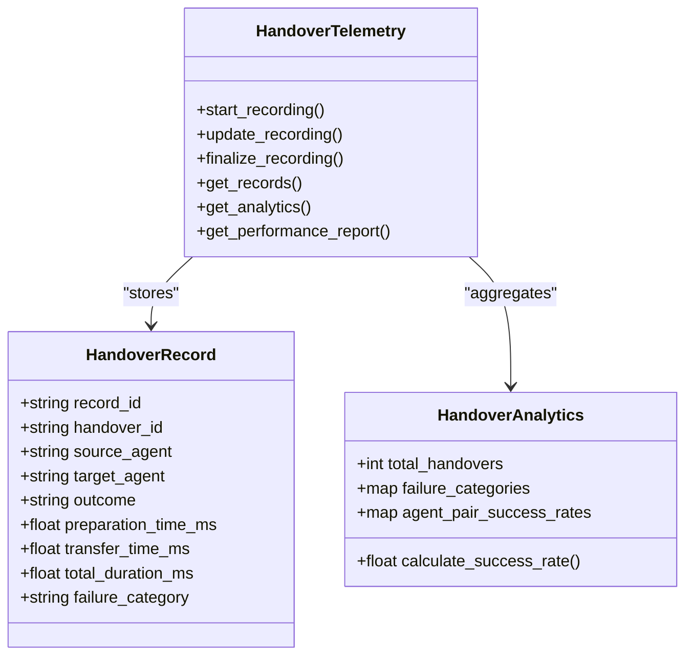

**Diagram sources**
- [core/ai/handover_telemetry.py](file://core/ai/handover_telemetry.py#L97-L171)
- [core/ai/handover_telemetry.py](file://core/ai/handover_telemetry.py#L173-L292)
- [core/ai/handover_telemetry.py](file://core/ai/handover_telemetry.py#L295-L314)

**Section sources**
- [core/ai/handover_telemetry.py](file://core/ai/handover_telemetry.py#L295-L314)
- [core/ai/handover_telemetry.py](file://core/ai/handover_telemetry.py#L533-L606)

### Frontend HUD Analytics and Telemetry UI
- useAetherStore holds telemetry-derived state (latency, valence, arousal, engagement, pitch, spectral centroid) and system logs.
- SystemAnalytics renders “Neural Flux” and “Temporal Sync” visualizations using store state.
- TelemetryFeed displays a capped list of system logs with timestamps and optional sources.
- HUDContainer provides the visual overlay for HUD elements.
- The dashboard page composes visualizers and displays system logs and engine state.

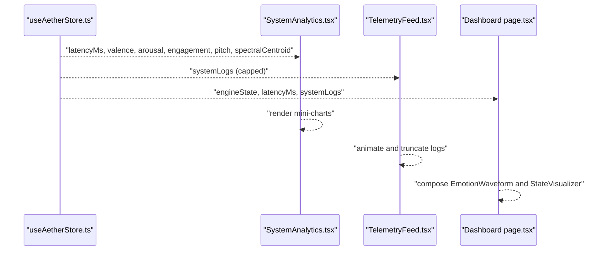

**Diagram sources**
- [apps/portal/src/store/useAetherStore.ts](file://apps/portal/src/store/useAetherStore.ts#L216-L226)
- [apps/portal/src/store/useAetherStore.ts](file://apps/portal/src/store/useAetherStore.ts#L336-L342)
- [apps/portal/src/components/HUD/SystemAnalytics.tsx](file://apps/portal/src/components/HUD/SystemAnalytics.tsx#L36-L67)
- [apps/portal/src/components/TelemetryFeed.tsx](file://apps/portal/src/components/TelemetryFeed.tsx#L13-L40)
- [apps/portal/src/dashboard/app/page.tsx](file://apps/portal/src/dashboard/app/page.tsx#L15-L18)

**Section sources**
- [apps/portal/src/store/useAetherStore.ts](file://apps/portal/src/store/useAetherStore.ts#L200-L440)
- [apps/portal/src/components/HUD/SystemAnalytics.tsx](file://apps/portal/src/components/HUD/SystemAnalytics.tsx#L36-L67)
- [apps/portal/src/components/TelemetryFeed.tsx](file://apps/portal/src/components/TelemetryFeed.tsx#L1-L40)
- [apps/portal/src/components/HUD/HUDContainer.tsx](file://apps/portal/src/components/HUD/HUDContainer.tsx#L39-L79)
- [apps/portal/src/dashboard/app/page.tsx](file://apps/portal/src/dashboard/app/page.tsx#L9-L112)

### Watchdog and Autonomous Healing
- SREWatchdog installs a custom logging handler to intercept ERROR-level logs from non-watchdog modules and triggers alerts.
- It runs periodic health checks and coordinates autonomous repairs via the Global State Bus.

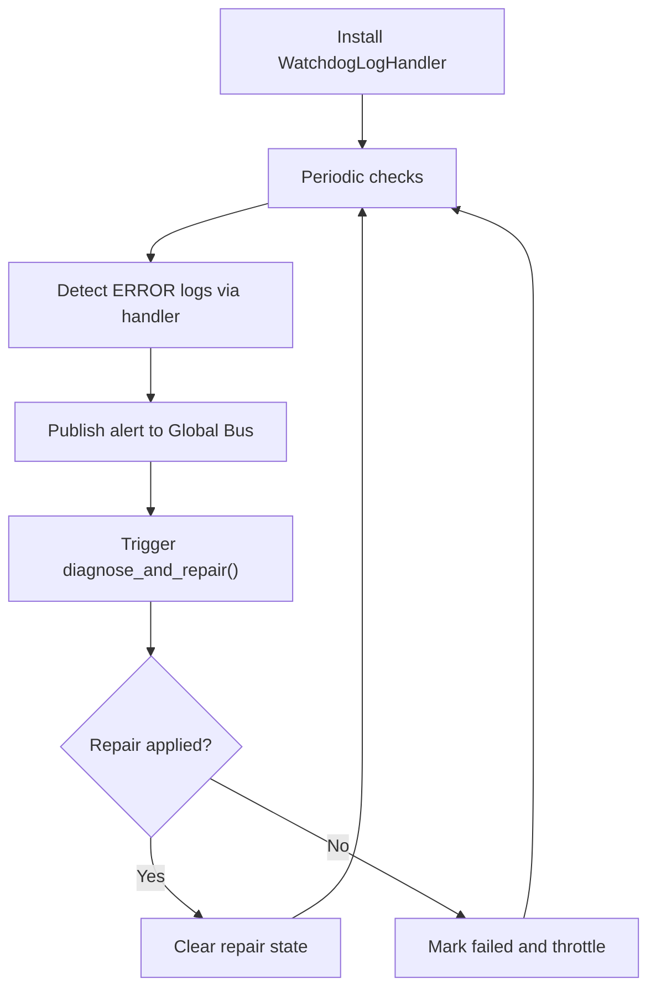

**Diagram sources**
- [core/services/watchdog.py](file://core/services/watchdog.py#L21-L37)
- [core/services/watchdog.py](file://core/services/watchdog.py#L74-L105)

**Section sources**
- [core/services/watchdog.py](file://core/services/watchdog.py#L39-L105)

### Telemetry Data Model and Storage
- TelemetryEvent carries metric_name, value, and metadata for flexible analytics.
- AudioTelemetryLogger persists session metrics to JSON and detailed frame logs to CSV for offline analysis.

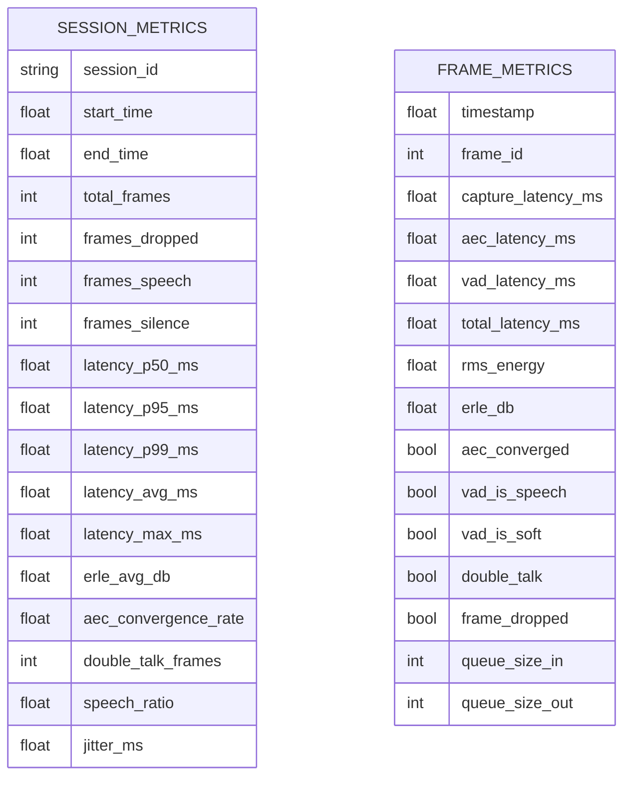

**Diagram sources**
- [core/audio/telemetry.py](file://core/audio/telemetry.py#L121-L149)
- [core/audio/telemetry.py](file://core/audio/telemetry.py#L151-L320)

**Section sources**
- [core/audio/telemetry.py](file://core/audio/telemetry.py#L121-L149)
- [core/audio/telemetry.py](file://core/audio/telemetry.py#L280-L320)

## Dependency Analysis
- Event-driven architecture: Producers emit TelemetryEvent; EventBus routes and dispatches; consumers update store and render UI.
- OpenTelemetry: TelemetryManager encapsulates provider and exporter configuration; record_usage enriches current spans.
- Handover telemetry: Uses Pydantic models and enums; integrates OTLP spans for tracing.
- Frontend state: useAetherStore centralizes telemetry-derived state; HUD and dashboard components depend on it.

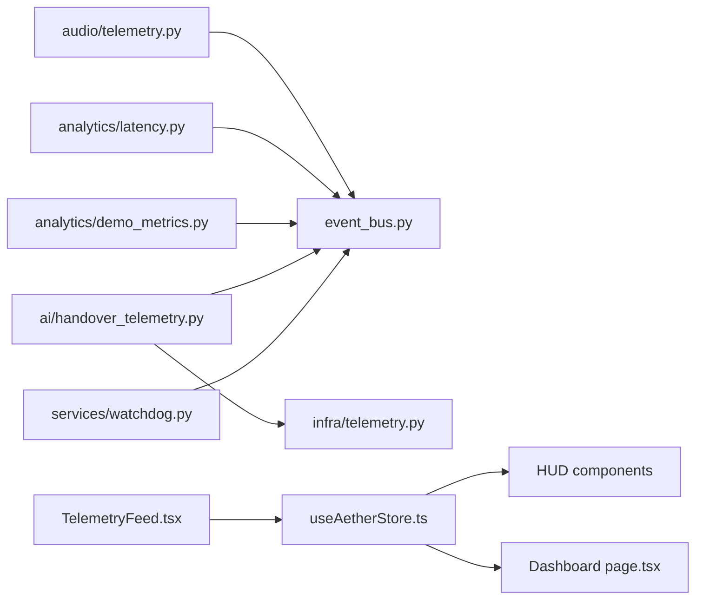

**Diagram sources**
- [core/audio/telemetry.py](file://core/audio/telemetry.py#L77-L88)
- [core/infra/event_bus.py](file://core/infra/event_bus.py#L90-L101)
- [core/analytics/latency.py](file://core/analytics/latency.py#L16-L40)
- [core/analytics/demo_metrics.py](file://core/analytics/demo_metrics.py#L23-L50)
- [core/ai/handover_telemetry.py](file://core/ai/handover_telemetry.py#L334-L404)
- [core/infra/telemetry.py](file://core/infra/telemetry.py#L63-L76)
- [apps/portal/src/store/useAetherStore.ts](file://apps/portal/src/store/useAetherStore.ts#L336-L342)
- [apps/portal/src/components/HUD/SystemAnalytics.tsx](file://apps/portal/src/components/HUD/SystemAnalytics.tsx#L36-L67)
- [apps/portal/src/dashboard/app/page.tsx](file://apps/portal/src/dashboard/app/page.tsx#L15-L18)
- [apps/portal/src/components/TelemetryFeed.tsx](file://apps/portal/src/components/TelemetryFeed.tsx#L13-L40)
- [core/services/watchdog.py](file://core/services/watchdog.py#L74-L86)

**Section sources**
- [core/infra/event_bus.py](file://core/infra/event_bus.py#L69-L152)
- [core/infra/telemetry.py](file://core/infra/telemetry.py#L14-L130)
- [core/ai/handover_telemetry.py](file://core/ai/handover_telemetry.py#L295-L314)
- [apps/portal/src/store/useAetherStore.ts](file://apps/portal/src/store/useAetherStore.ts#L200-L440)

## Performance Considerations
- Latency budgets: SystemEvent enforces deadlines; EventBus workers drop expired events in higher-priority lanes to prevent starvation.
- Audio telemetry cadence: AudioTelemetry runs at approximately 15 Hz to balance CPU and responsiveness.
- Real-time vs. batch: TelemetryEvent is designed to be droppable; critical metrics are prioritized in separate lanes.
- Export throughput: TelemetryManager uses BatchSpanProcessor in production and SimpleSpanProcessor in debug mode to tune overhead.

[No sources needed since this section provides general guidance]

## Troubleshooting Guide
- Log-based detection: Watchdog intercepts ERROR logs from non-watchdog modules and publishes alerts; review logs and system state to identify recurring issues.
- Telemetry UI: Use TelemetryFeed to inspect recent system logs and HUD diagnostics to confirm latency and affective states.
- Autonomic healing: SystemFailure HUD indicates autonomous healing status; successful repairs clear automatically after a delay.
- Deprecated telemetry hook: useEngineTelemetry is deprecated; telemetry now flows through the main gateway hook; remove imports and rely on useAetherStore for state.

**Section sources**
- [core/services/watchdog.py](file://core/services/watchdog.py#L21-L37)
- [apps/portal/src/components/TelemetryFeed.tsx](file://apps/portal/src/components/TelemetryFeed.tsx#L13-L40)
- [apps/portal/src/components/HUD/SystemFailure.tsx](file://apps/portal/src/components/HUD/SystemFailure.tsx#L15-L23)
- [apps/portal/src/hooks/useEngineTelemetry.ts](file://apps/portal/src/hooks/useEngineTelemetry.ts#L1-L33)

## Conclusion
Aether Voice OS employs a robust, event-driven monitoring stack combining backend telemetry producers, a tiered event bus with strict latency enforcement, OpenTelemetry tracing, and a rich frontend HUD and dashboard for real-time diagnostics. The architecture supports audio-centric metrics, latency analytics, handover performance tracking, and autonomous log-based failure detection. Operators can leverage the provided components to build dashboards, configure alerting, establish baselines, and extend telemetry with new endpoints and integrations.

[No sources needed since this section summarizes without analyzing specific files]

## Appendices

### Setting Up Monitoring Dashboards
- Use the built-in dashboard page to visualize engine state, logs, and emotion waveform.
- For HTML dashboards, use the generator script to produce static dashboards with metrics such as interrupt latency, EventBus throughput, neural lead time, DNA stability EMA, and memory growth.

**Section sources**
- [apps/portal/src/dashboard/app/page.tsx](file://apps/portal/src/dashboard/app/page.tsx#L9-L112)
- [tools/dashboard_generator.py](file://tools/dashboard_generator.py#L17-L165)

### Alerting Configurations
- Configure environment variables for TelemetryManager to route to Arize/Phoenix.
- Use Watchdog’s log handler to trigger alerts on ERROR-level logs; adjust throttling and alert intervals as needed.

**Section sources**
- [core/infra/telemetry.py](file://core/infra/telemetry.py#L28-L61)
- [core/services/watchdog.py](file://core/services/watchdog.py#L21-L37)

### Performance Baselines
- Target sub-200 ms real-time audio guarantees; monitor p50/p95/p99 latency percentiles from AudioTelemetryLogger.
- Track AEC ERLE and convergence rate; monitor speech ratio and double-talk frames to assess acoustic conditions.

**Section sources**
- [core/audio/telemetry.py](file://core/audio/telemetry.py#L280-L320)

### Log Aggregation and Correlation
- Use TelemetryFeed to correlate recent logs with HUD analytics.
- Export session reports and frame logs from AudioTelemetryLogger for offline correlation and regression analysis.

**Section sources**
- [apps/portal/src/components/TelemetryFeed.tsx](file://apps/portal/src/components/TelemetryFeed.tsx#L13-L40)
- [core/audio/telemetry.py](file://core/audio/telemetry.py#L355-L394)

### Customizing Monitoring Metrics and Adding New Telemetry Endpoints
- Define new TelemetryEvent payloads in the backend and publish via EventBus.
- Extend useAetherStore to expose new state fields and render them in HUD components or dashboards.
- Integrate new metrics with OpenTelemetry spans using TelemetryManager for centralized export.

**Section sources**
- [core/infra/event_bus.py](file://core/infra/event_bus.py#L46-L56)
- [apps/portal/src/store/useAetherStore.ts](file://apps/portal/src/store/useAetherStore.ts#L216-L226)
- [core/infra/telemetry.py](file://core/infra/telemetry.py#L109-L112)

### Integrating with External Monitoring Systems
- Configure TelemetryManager endpoint and credentials for Arize/Phoenix.
- Use OTLP exporter headers and processor selection to match your backend observability stack.

**Section sources**
- [core/infra/telemetry.py](file://core/infra/telemetry.py#L28-L61)

### Frontend Telemetry UI Controls
- Enable/disable telemetry display via user preferences in useAetherStore.
- HUD cards and containers provide visual scaffolding for telemetry overlays.

**Section sources**
- [apps/portal/src/store/useAetherStore.ts](file://apps/portal/src/store/useAetherStore.ts#L88-L104)
- [apps/portal/src/components/HUDCards.tsx](file://apps/portal/src/components/HUDCards.tsx#L142-L167)
- [apps/portal/src/components/HUD/HUDContainer.tsx](file://apps/portal/src/components/HUD/HUDContainer.tsx#L39-L79)

### Administrative Access Controls (Desktop and macOS)
- Review capability schemas for log command permissions to manage administrative access to telemetry-related commands.

**Section sources**
- [apps/portal/src-tauri/gen/schemas/desktop-schema.json](file://apps/portal/src-tauri/gen/schemas/desktop-schema.json#L2218-L2231)
- [apps/portal/src-tauri/gen/schemas/macOS-schema.json](file://apps/portal/src-tauri/gen/schemas/macOS-schema.json#L2218-L2231)