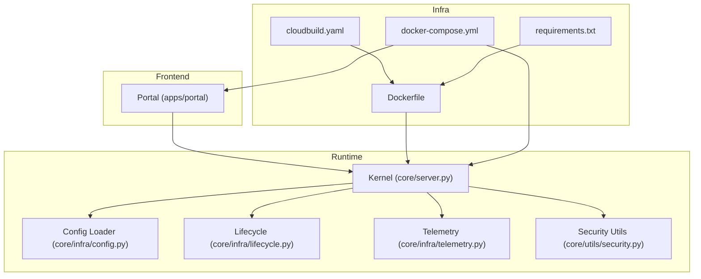
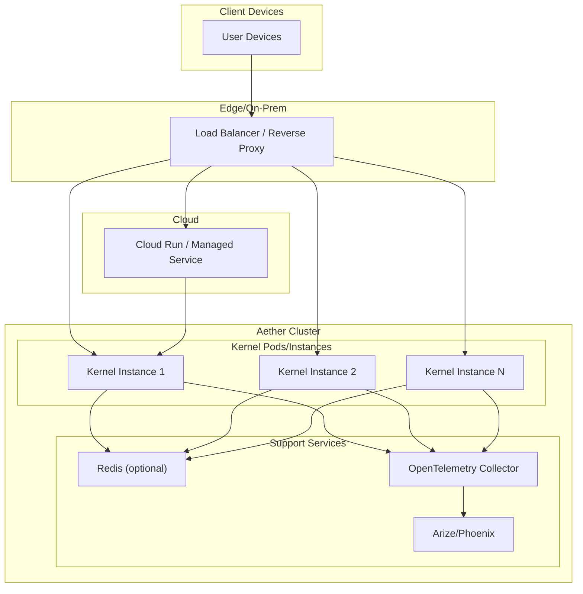
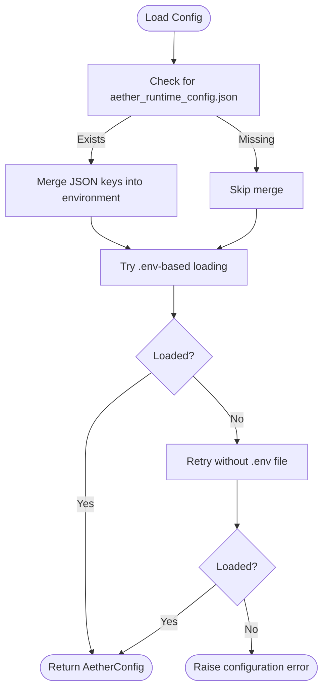
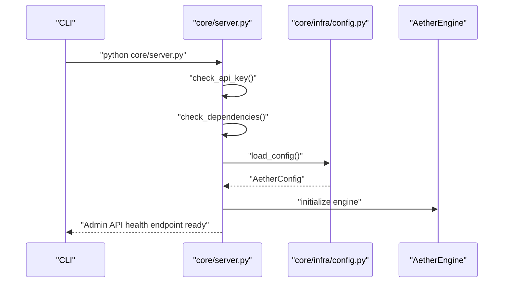
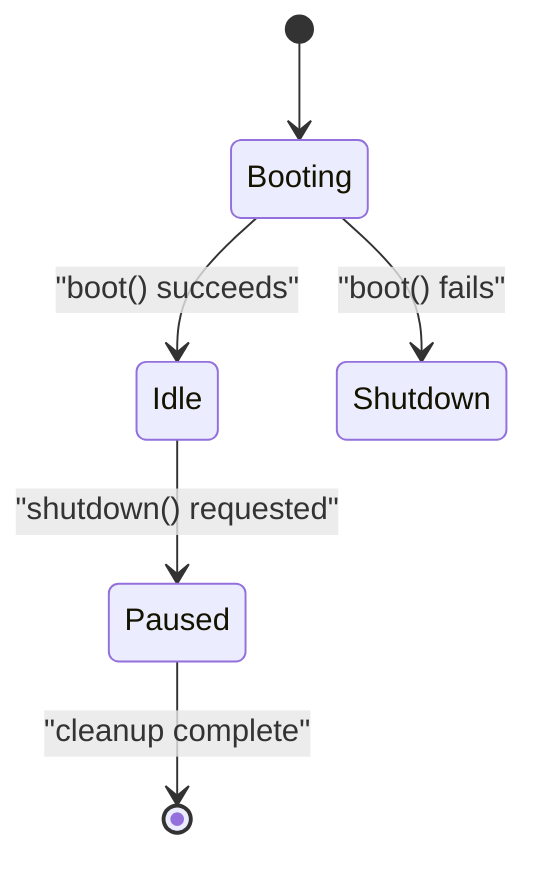
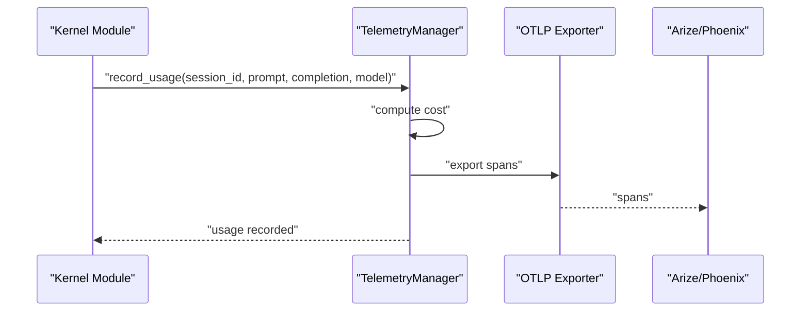
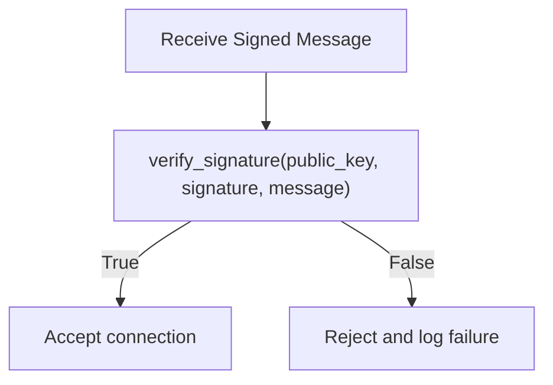
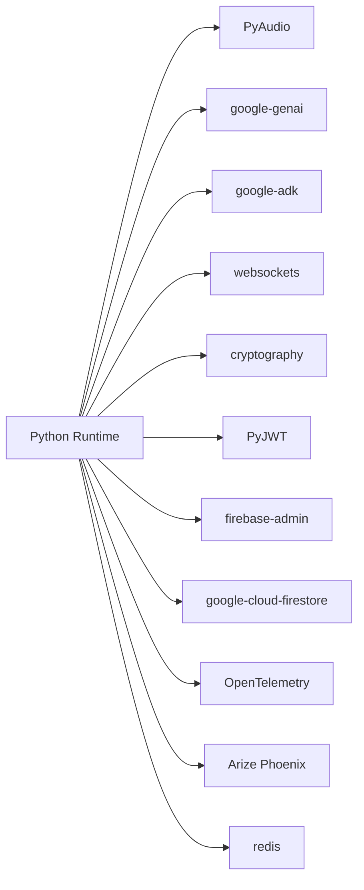

# Production Deployment and Configuration

<cite>
**Referenced Files in This Document**
- [README.md](file://README.md)
- [Dockerfile](file://Dockerfile)
- [docker-compose.yml](file://docker-compose.yml)
- [cloudbuild.yaml](file://cloudbuild.yaml)
- [requirements.txt](file://requirements.txt)
- [pyproject.toml](file://pyproject.toml)
- [core/infra/config.py](file://core/infra/config.py)
- [core/server.py](file://core/server.py)
- [core/infra/lifecycle.py](file://core/infra/lifecycle.py)
- [core/infra/telemetry.py](file://core/infra/telemetry.py)
- [core/utils/security.py](file://core/utils/security.py)
- [scripts/deploy.sh](file://scripts/deploy.sh)
- [infra/scripts/tools/deploy.sh](file://infra/scripts/tools/deploy.sh)
- [aether_runtime_config.json.bak](file://aether_runtime_config.json.bak)
</cite>

## Table of Contents
1. [Introduction](#introduction)
2. [Project Structure](#project-structure)
3. [Core Components](#core-components)
4. [Architecture Overview](#architecture-overview)
5. [Detailed Component Analysis](#detailed-component-analysis)
6. [Dependency Analysis](#dependency-analysis)
7. [Performance Considerations](#performance-considerations)
8. [Security Hardening and Compliance](#security-hardening-and-compliance)
9. [Production Requirements](#production-requirements)
10. [Deployment Best Practices](#deployment-best-practices)
11. [Scaling and High Availability](#scaling-and-high-availability)
12. [Load Balancing and Network Configuration](#load-balancing-and-network-configuration)
13. [Configuration Management](#configuration-management)
14. [Monitoring, Observability, and Audit Logging](#monitoring-observability-and-audit-logging)
15. [Disaster Recovery and Backup Strategies](#disaster-recovery-and-backup-strategies)
16. [Incident Response Procedures](#incident-response-procedures)
17. [Troubleshooting Guide](#troubleshooting-guide)
18. [Conclusion](#conclusion)

## Introduction
This document provides comprehensive guidance for deploying and operating Aether Voice OS in production. It covers environment-specific configurations, security hardening, performance tuning, dependency management, deployment strategies (including zero-downtime and blue-green), scaling and high availability, load balancing, monitoring and auditing, disaster recovery, and incident response. The content is grounded in the repository’s configuration, containerization, orchestration, telemetry, and lifecycle management components.

## Project Structure
Aether Voice OS is a monorepo with:
- A Python backend (core engine, audio processing, AI orchestration, gateway, telemetry, lifecycle)
- A Next.js frontend (portal) with Tauri desktop packaging
- Infrastructure and CI/CD artifacts (Dockerfiles, docker-compose, cloudbuild)
- Scripts for local and cloud deployment

**Diagram sources**
- [core/server.py](file://core/server.py#L1-L149)
- [core/infra/config.py](file://core/infra/config.py#L1-L175)
- [core/infra/lifecycle.py](file://core/infra/lifecycle.py#L1-L109)
- [core/infra/telemetry.py](file://core/infra/telemetry.py#L1-L130)
- [core/utils/security.py](file://core/utils/security.py#L1-L71)
- [Dockerfile](file://Dockerfile#L1-L76)
- [docker-compose.yml](file://docker-compose.yml#L1-L37)
- [cloudbuild.yaml](file://cloudbuild.yaml#L1-L55)
- [requirements.txt](file://requirements.txt#L1-L52)

**Section sources**
- [README.md](file://README.md#L1-L291)
- [Dockerfile](file://Dockerfile#L1-L76)
- [docker-compose.yml](file://docker-compose.yml#L1-L37)
- [cloudbuild.yaml](file://cloudbuild.yaml#L1-L55)
- [requirements.txt](file://requirements.txt#L1-L52)

## Core Components
- Configuration system: Loads environment variables and JSON fallback, supports nested keys and Base64-encoded Firebase credentials.
- Server entry point: Validates API keys, checks dependencies, initializes engine, exposes admin health endpoint.
- Lifecycle manager: Orchestrates boot/shutdown sequences and signal handling.
- Telemetry: OpenTelemetry-based tracing with Arize/Phoenix export and usage cost accounting.
- Security utilities: Ed25519 signature verification and keypair generation for gateway protocol.
- Containerization and orchestration: Multi-stage Docker build, health checks, Cloud Run deployment, docker-compose stack.

**Section sources**
- [core/infra/config.py](file://core/infra/config.py#L1-L175)
- [core/server.py](file://core/server.py#L1-L149)
- [core/infra/lifecycle.py](file://core/infra/lifecycle.py#L1-L109)
- [core/infra/telemetry.py](file://core/infra/telemetry.py#L1-L130)
- [core/utils/security.py](file://core/utils/security.py#L1-L71)
- [Dockerfile](file://Dockerfile#L1-L76)
- [docker-compose.yml](file://docker-compose.yml#L1-L37)
- [cloudbuild.yaml](file://cloudbuild.yaml#L1-L55)

## Architecture Overview
Aether Voice OS runs a kernel service (backend) and a portal (frontend). The kernel exposes:
- A WebSocket gateway for audio streaming and control
- An admin API for health and diagnostics
- Optional Redis-backed global state bus (via dependencies)

[No sources needed since this diagram shows conceptual architecture, not a direct code mapping]

## Detailed Component Analysis

### Configuration Management System
The configuration system loads environment variables with pydantic settings, supports nested keys, and falls back to a JSON runtime config file if present. It also decodes Base64-encoded Firebase credentials for secure service account injection.

**Diagram sources**
- [core/infra/config.py](file://core/infra/config.py#L130-L159)

**Section sources**
- [core/infra/config.py](file://core/infra/config.py#L1-L175)
- [aether_runtime_config.json.bak](file://aether_runtime_config.json.bak#L1-L8)

### Server Startup and Admin API
The server validates the presence of an API key, checks for required dependencies, prints a banner, and starts the engine. It also exposes an admin health endpoint for diagnostics.

**Diagram sources**
- [core/server.py](file://core/server.py#L62-L145)
- [core/infra/config.py](file://core/infra/config.py#L130-L159)

**Section sources**
- [core/server.py](file://core/server.py#L1-L149)

### Lifecycle and Graceful Shutdown
The lifecycle manager coordinates boot and shutdown sequences, transitions system state, and handles OS signals for graceful termination.

**Diagram sources**
- [core/infra/lifecycle.py](file://core/infra/lifecycle.py#L10-L103)

**Section sources**
- [core/infra/lifecycle.py](file://core/infra/lifecycle.py#L1-L109)

### Telemetry and Usage Accounting
Telemetry exports traces to Arize/Phoenix via OTLP and records token usage with estimated costs. It conditionally uses batch or simple processors based on environment.

**Diagram sources**
- [core/infra/telemetry.py](file://core/infra/telemetry.py#L77-L112)

**Section sources**
- [core/infra/telemetry.py](file://core/infra/telemetry.py#L1-L130)

### Security Utilities and Gateway Protocol
Ed25519 signatures are verified for the gateway handshake. Key pairs can be generated for agent identities.

**Diagram sources**
- [core/utils/security.py](file://core/utils/security.py#L18-L56)

**Section sources**
- [core/utils/security.py](file://core/utils/security.py#L1-L71)

## Dependency Analysis
The runtime depends on:
- Audio and DSP: PyAudio, NumPy
- AI/LLM: google-genai, google-adk
- Transport: websockets, cryptography, PyJWT
- Persistence/Cloud: firebase-admin, google-cloud-firestore
- Observability: OpenTelemetry, Arize Phoenix
- State bus: redis (optional)

**Diagram sources**
- [requirements.txt](file://requirements.txt#L1-L52)

**Section sources**
- [requirements.txt](file://requirements.txt#L1-L52)
- [pyproject.toml](file://pyproject.toml#L1-L21)

## Performance Considerations
- Audio pipeline tuning: Adjust chunk size, sample rates, jitter buffer targets, and VAD thresholds to balance latency and robustness.
- Model selection: Choose appropriate Gemini models and versions to meet latency and quality targets.
- Container sizing: Use CPU/memory allocation appropriate for audio processing and concurrent sessions.
- Telemetry overhead: Prefer batch processors in production and disable debug exporters in high-throughput environments.
- Dependency compilation: Ensure PyAudio C extensions are compiled for optimal performance.

[No sources needed since this section provides general guidance]

## Security Hardening and Compliance
- Secret management: Pass API keys and service account credentials via environment variables or secret managers; avoid embedding secrets in images or configs.
- Gateway security: Use Ed25519-based handshake and enforce strict TLS for WebSocket connections.
- Least privilege: Run containers as non-root; restrict filesystem permissions.
- Audit logging: Record telemetry spans and usage metrics; centralize logs for compliance.
- Data protection: Encrypt sensitive payloads and limit retention per policy.

[No sources needed since this section provides general guidance]

## Production Requirements
- Hardware: Multi-core CPU, sufficient RAM for concurrent audio streams and model inference; low-latency audio devices.
- Operating system: Linux/macOS/Windows with proper audio drivers; container runtime support.
- Networking: Stable internet connectivity; firewall rules allowing WebSocket traffic on the gateway port; DNS resolution for external services.
- Dependencies: Verified installation of PyAudio C extensions; compatible Python version; Redis for optional global state bus.

[No sources needed since this section provides general guidance]

## Deployment Best Practices
- Zero-downtime deployments: Use rolling updates with readiness probes; drain connections before restarts.
- Blue-green deployments: Maintain two identical environments; switch traffic after validation.
- Canary releases: Gradually shift traffic to new versions; monitor latency and error rates.
- Immutable artifacts: Build images with reproducible steps; tag releases with commit SHAs.
- Health checks: Configure container health probes aligned with the gateway port and admin endpoints.

[No sources needed since this section provides general guidance]

## Scaling and High Availability
- Horizontal scaling: Run multiple kernel instances behind a load balancer; ensure session affinity if required.
- Auto-scaling: Configure CPU/memory autoscaling on managed platforms; set min/max instance limits.
- State isolation: Avoid shared mutable state; use Redis only if centralized coordination is necessary.
- Retry and timeouts: Configure client-side retries and request timeouts for resilience.

[No sources needed since this section provides general guidance]

## Load Balancing and Network Configuration
- Gateway exposure: Expose the WebSocket gateway port and admin API port; configure reverse proxy for TLS termination.
- Network policies: Restrict inbound traffic to necessary ports; segment kernel and portal services.
- DNS and routing: Use stable DNS names for managed services; configure health checks for load balancers.

[No sources needed since this section provides general guidance]

## Configuration Management
Environment variables and secrets:
- API keys: GOOGLE_API_KEY (and aliases)
- Model and API version: AETHER_AI_MODEL, AETHER_AI_API_VERSION
- Gateway: AETHER_GW_PORT, AETHER_GW_HOST
- Firebase credentials: FIREBASE_CREDENTIALS_BASE64 (Base64-encoded service account JSON)
- Logging and observability: LOG_LEVEL, ARIZE_ENDPOINT, ARIZE_SPACE_ID, ARIZE_API_KEY
- Runtime overrides: aether_runtime_config.json (merged into environment)

Local and containerized deployment:
- Local: Use docker-compose to run kernel and portal; expose ports and set environment variables.
- Cloud: Build with cloudbuild and deploy to managed runtimes; inject secrets via secret managers.

**Section sources**
- [core/infra/config.py](file://core/infra/config.py#L52-L127)
- [aether_runtime_config.json.bak](file://aether_runtime_config.json.bak#L1-L8)
- [docker-compose.yml](file://docker-compose.yml#L8-L16)
- [cloudbuild.yaml](file://cloudbuild.yaml#L45-L46)
- [core/server.py](file://core/server.py#L62-L84)

## Monitoring, Observability, and Audit Logging
- Tracing: Initialize OpenTelemetry provider and export spans to Arize/Phoenix; use batch processors in production.
- Metrics: Track token usage and estimated cost per session; surface latency and error rates.
- Logs: Centralize container logs; include structured entries for audit trails.
- Dashboards: Visualize telemetry in Phoenix; alert on latency spikes and cost anomalies.

**Section sources**
- [core/infra/telemetry.py](file://core/infra/telemetry.py#L14-L112)

## Disaster Recovery and Backup Strategies
- Artifact backups: Store container images in a registry; maintain tagged releases.
- Secrets rotation: Rotate API keys and service account credentials; update secret managers.
- Data preservation: Back up Firestore indexes and rules; retain telemetry data per retention policy.
- Recovery drills: Practice failover scenarios; validate restore procedures regularly.

[No sources needed since this section provides general guidance]

## Incident Response Procedures
- Immediate actions: Isolate failing nodes, drain traffic, and rollback to previous stable versions.
- Investigation: Review telemetry spans, logs, and usage metrics; correlate with recent changes.
- Mitigation: Scale out, adjust timeouts, or disable problematic features; reconfigure models if necessary.
- Postmortem: Document root causes, remediation steps, and preventive measures.

[No sources needed since this section provides general guidance]

## Troubleshooting Guide
Common issues and remedies:
- Missing API key: Ensure GOOGLE_API_KEY is set in environment or .env; server startup will fail without it.
- Missing dependencies: Install PyAudio, google-genai, and pydantic-settings; verify C extensions are present.
- Audio device problems: Set input/output device indices; verify device permissions.
- Firebase degradation: Provide service account credentials via FIREBASE_CREDENTIALS_BASE64; degrade gracefully if unavailable.
- High CPU usage: Confirm PyAudio compiled extensions; reduce frontend visualizer load.

**Section sources**
- [core/server.py](file://core/server.py#L62-L120)
- [README.md](file://README.md#L244-L249)

## Conclusion
Aether Voice OS provides a robust foundation for production-grade voice AI services. By leveraging containerization, managed runtimes, secure configuration management, telemetry-driven operations, and resilient deployment practices, teams can achieve low-latency, high-quality voice experiences at scale while maintaining strong security and compliance posture.