# Developer Guide

<cite>
**Referenced Files in This Document**
- [README.md](file://README.md)
- [docs/README_IMPROVEMENTS.md](file://docs/README_IMPROVEMENTS.md)
- [docs/architecture.md](file://docs/architecture.md)
- [docs/sdk_guide.md](file://docs/sdk_guide.md)
- [docs/ath_package_spec.md](file://docs/ath_package_spec.md)
- [tools/dependency_analyzer.py](file://tools/dependency_analyzer.py)
- [tools/ast_extractor.py](file://tools/ast_extractor.py)
- [core/tools/code_indexer.py](file://core/tools/code_indexer.py)
- [tools/test_ast.py](file://tools/test_ast.py)
- [docs/generated/dependency_stats.md](file://docs/generated/dependency_stats.md)
- [.github/workflows/update_readme_stats.yml](file://.github/workflows/update_readme_stats.yml)
- [.github/workflows/README_WORKFLOW.md](file://.github/workflows/README_WORKFLOW.md)
- [Dockerfile](file://Dockerfile)
- [docker-compose.yml](file://docker-compose.yml)
- [requirements.txt](file://requirements.txt)
- [pyproject.toml](file://pyproject.toml)
- [core/server.py](file://core/server.py)
- [core/engine.py](file://core/engine.py)
- [core/audio/capture.py](file://core/audio/capture.py)
- [core/audio/state.py](file://core/audio/state.py)
- [core/tools/router.py](file://core/tools/router.py)
- [core/infra/config.py](file://core/infra/config.py)
- [core/services/admin_api.py](file://core/services/admin_api.py)
- [core/identity/package.py](file://core/identity/package.py)
- [apps/portal/package.json](file://apps/portal/package.json)
</cite>

## Update Summary
**Changes Made**
- Added comprehensive documentation for new development tools: dependency analyzer, AST extractor, and enhanced code indexing capabilities
- Updated development workflow section with new automated code analysis tools
- Enhanced project statistics tracking system documentation with new dependency visualization
- Expanded architecture overview to include semantic code indexing capabilities
- Added new section on automated code analysis and dependency management

## Table of Contents
1. [Introduction](#introduction)
2. [Project Structure](#project-structure)
3. [Core Components](#core-components)
4. [Architecture Overview](#architecture-overview)
5. [Detailed Component Analysis](#detailed-component-analysis)
6. [Enhanced Code Analysis Tools](#enhanced-code-analysis-tools)
7. [Dependency Analysis](#dependency-analysis)
8. [Performance Considerations](#performance-considerations)
9. [Troubleshooting Guide](#troubleshooting-guide)
10. [Development Workflow](#development-workflow)
11. [README Documentation Improvements](#readme-documentation-improvements)
12. [Workflow Automation System](#workflow-automation-system)
13. [SDK Guide](#sdk-guide)
14. [Aether Pack (.ath) Specification](#aether-pack-ath-specification)
15. [Coding Standards and Contribution Guidelines](#coding-standards-and-contribution-guidelines)
16. [Testing Requirements](#testing-requirements)
17. [Deployment and Operations](#deployment-and-operations)
18. [Conclusion](#conclusion)

## Introduction
Aether Voice OS is a real-time, voice-first AI operating system designed to minimize friction in human-AI interaction. It integrates a custom-built Thalamic Gate audio pipeline, Gemini Live native audio, and a modular tool ecosystem to deliver sub-200ms latency, empathetic affective computing, and proactive assistance. This guide covers development environment setup, architecture, SDK extension, .ath packaging, coding standards, testing, operational practices, and comprehensive documentation improvements including automated README statistics tracking, enhanced code analysis tools, and semantic code indexing capabilities.

## Project Structure
The repository follows a monorepo layout:
- core/: Python backend orchestrating audio, AI, transport, tools, and infrastructure
- apps/portal/: Next.js frontend and Tauri desktop shell
- brain/: Agent personas, skills, and knowledge hubs
- cortex/: Rust DSP acceleration (mirrored by Python fallbacks)
- docs/: Official specifications and guides
- tests/: Pytest suites for unit, integration, and end-to-end scenarios
- infra/: CI/CD, scripts, and operational helpers
- skills/: Example skills and integrations
- tools/: Development utilities including dependency analyzer, AST extractor, and code indexer
- .github/workflows/: Automated documentation and statistics tracking

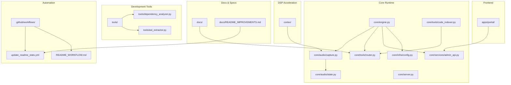

**Diagram sources**
- [core/engine.py](file://core/engine.py#L26-L71)
- [core/infra/config.py](file://core/infra/config.py#L85-L111)
- [core/audio/capture.py](file://core/audio/capture.py#L193-L270)
- [core/audio/state.py](file://core/audio/state.py#L36-L75)
- [core/tools/router.py](file://core/tools/router.py#L120-L140)
- [core/services/admin_api.py](file://core/services/admin_api.py#L88-L117)
- [core/tools/code_indexer.py](file://core/tools/code_indexer.py#L1-L220)
- [tools/dependency_analyzer.py](file://tools/dependency_analyzer.py#L1-L179)
- [tools/ast_extractor.py](file://tools/ast_extractor.py#L1-L237)
- [apps/portal/package.json](file://apps/portal/package.json#L1-L53)
- [.github/workflows/update_readme_stats.yml](file://.github/workflows/update_readme_stats.yml#L1-L62)
- [.github/workflows/README_WORKFLOW.md](file://.github/workflows/README_WORKFLOW.md#L1-L122)

**Section sources**
- [README.md](file://README.md#L132-L160)
- [best_practices.md](file://best_practices.md#L6-L33)

## Core Components
- AetherEngine: Orchestrates managers, audio, gateway, admin API, and cognitive scheduling.
- AudioCapture: Real-time microphone capture with Thalamic Gate AEC, VAD, and affective telemetry.
- ToolRouter: Neural dispatcher for Gemini function calls with biometric middleware and performance profiling.
- AdminAPIServer: Local dashboard REST API for telemetry and system state.
- Config loader: Pydantic settings for audio, AI, and gateway parameters.
- .ath Package Loader: Validates manifests, computes checksums, and loads agent identities.
- **Enhanced**: Code Indexer: Semantic codebase indexing with vector embeddings for AI-assisted development.
- **Updated**: README Statistics Automation: GitHub Actions workflow for automatic README updates.

**Section sources**
- [core/engine.py](file://core/engine.py#L26-L71)
- [core/audio/capture.py](file://core/audio/capture.py#L193-L270)
- [core/tools/router.py](file://core/tools/router.py#L120-L140)
- [core/services/admin_api.py](file://core/services/admin_api.py#L88-L117)
- [core/infra/config.py](file://core/infra/config.py#L85-L111)
- [core/identity/package.py](file://core/identity/package.py#L72-L139)
- [core/tools/code_indexer.py](file://core/tools/code_indexer.py#L1-L220)
- [.github/workflows/update_readme_stats.yml](file://.github/workflows/update_readme_stats.yml#L1-L62)

## Architecture Overview
Aether OS employs a unified neural pipeline with four layers:
- Perceptual Layer: Mic capture, windowing, and DSP acceleration
- Cognitive Layer: Gemini Live native audio session with multimodal context
- Executive Layer: ToolRouter dispatch and async execution
- Persistence Layer: Firebase connector, gateway, and broadcast system

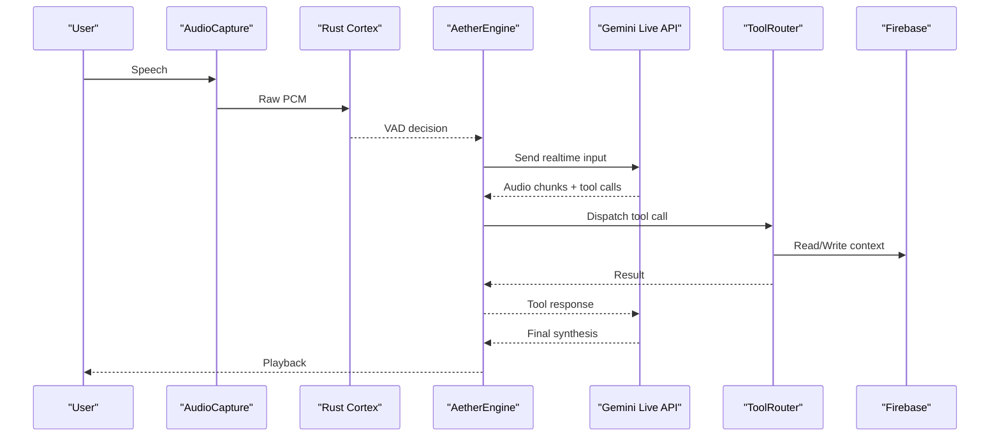

**Diagram sources**
- [docs/architecture.md](file://docs/architecture.md#L39-L60)
- [core/audio/capture.py](file://core/audio/capture.py#L305-L487)
- [core/engine.py](file://core/engine.py#L189-L225)
- [core/tools/router.py](file://core/tools/router.py#L234-L356)

**Section sources**
- [docs/architecture.md](file://docs/architecture.md#L1-L67)

## Detailed Component Analysis

### Audio Capture and Thalamic Gate
The capture pipeline implements:
- Direct callback injection into asyncio queues to eliminate thread-hop latency
- Dynamic AEC with jitter buffering and Rust-accelerated bridge
- Hysteresis gating and smooth muting to prevent audio artifacts
- VAD, ZCR, and affective telemetry broadcasting

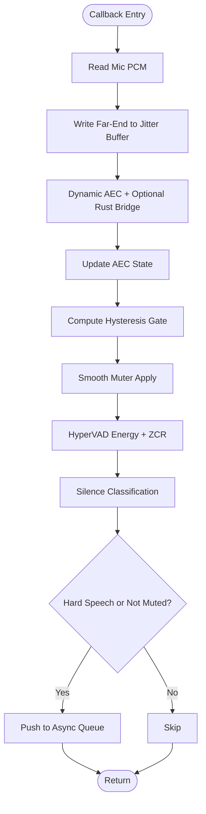

**Diagram sources**
- [core/audio/capture.py](file://core/audio/capture.py#L305-L487)
- [core/audio/state.py](file://core/audio/state.py#L13-L34)

**Section sources**
- [core/audio/capture.py](file://core/audio/capture.py#L193-L553)
- [core/audio/state.py](file://core/audio/state.py#L36-L129)

### Tool Router and Biometric Middleware
The ToolRouter:
- Registers tools with function declarations and handlers
- Supports async/sync handlers and semantic recovery via vector store
- Enforces biometric middleware for sensitive tools
- Profiles execution latency and wraps results with A2A metadata

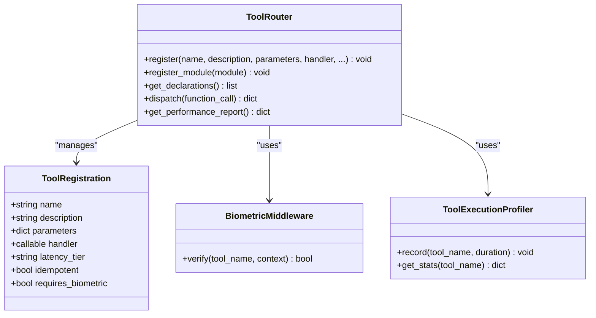

**Diagram sources**
- [core/tools/router.py](file://core/tools/router.py#L33-L85)
- [core/tools/router.py](file://core/tools/router.py#L120-L140)
- [core/tools/router.py](file://core/tools/router.py#L234-L356)

**Section sources**
- [core/tools/router.py](file://core/tools/router.py#L120-L360)

### Configuration and Environment
Configuration is validated via Pydantic settings with support for:
- Audio capture/playback parameters
- AI model selection and system instructions
- Gateway binding and heartbeat parameters
- Firebase credentials via base64-encoded environment variable

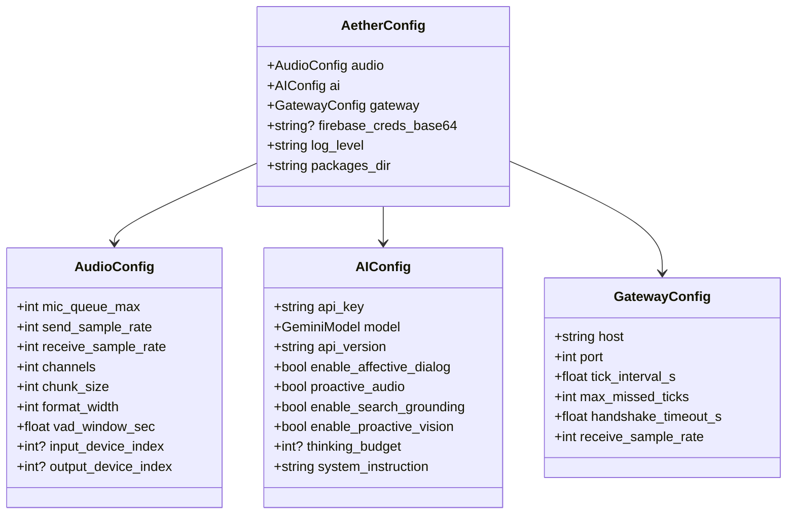

**Diagram sources**
- [core/infra/config.py](file://core/infra/config.py#L11-L27)
- [core/infra/config.py](file://core/infra/config.py#L35-L61)
- [core/infra/config.py](file://core/infra/config.py#L71-L83)
- [core/infra/config.py](file://core/infra/config.py#L85-L111)

**Section sources**
- [core/infra/config.py](file://core/infra/config.py#L113-L158)

### Admin API Server
The AdminAPIServer exposes a lightweight REST interface for the dashboard:
- Endpoints for sessions, synapse, status, tools, hive, and telemetry
- CORS-enabled GET endpoints with JSON responses
- Falls back to dynamic port allocation if the configured port is busy

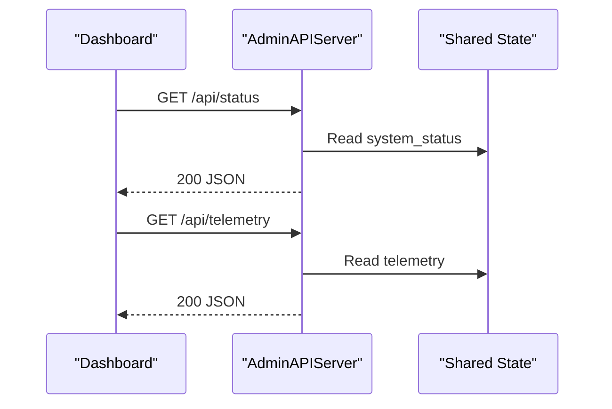

**Diagram sources**
- [core/services/admin_api.py](file://core/services/admin_api.py#L26-L82)
- [core/services/admin_api.py](file://core/services/admin_api.py#L88-L117)

**Section sources**
- [core/services/admin_api.py](file://core/services/admin_api.py#L1-L117)

### .ath Package Loader
The .ath package loader validates manifests, enforces capability constraints, and verifies integrity via SHA256 checksums.

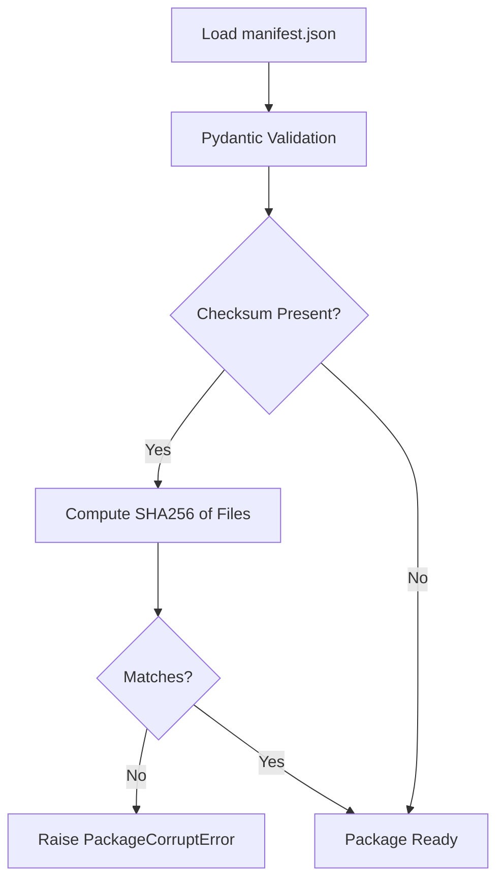

**Diagram sources**
- [core/identity/package.py](file://core/identity/package.py#L86-L139)

**Section sources**
- [core/identity/package.py](file://core/identity/package.py#L72-L166)

## Enhanced Code Analysis Tools

**New** Aether Voice OS now includes comprehensive code analysis tools designed to enhance development workflow, maintain code quality, and provide insights into the codebase structure.

### Dependency Analyzer
The dependency analyzer builds a directed graph of Python dependencies, detects circular imports, and generates interactive HTML visualizations:

- **AST-based Import Analysis**: Parses Python files to extract import statements and module relationships
- **Circular Dependency Detection**: Uses NetworkX to identify circular import chains that could cause runtime issues
- **Interactive Visualization**: Generates HTML graphs with color-coded nodes by subsystem (audio, AI, infrastructure)
- **Comprehensive Reporting**: Creates JSON and Markdown reports with dependency statistics

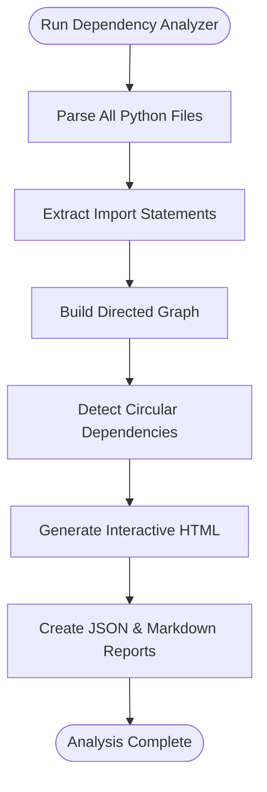

**Diagram sources**
- [tools/dependency_analyzer.py](file://tools/dependency_analyzer.py#L43-L88)
- [tools/dependency_analyzer.py](file://tools/dependency_analyzer.py#L91-L100)
- [tools/dependency_analyzer.py](file://tools/dependency_analyzer.py#L102-L132)

### AST Extractor
The AST extractor provides comprehensive metadata extraction from Python files:

- **Function Metadata**: Captures function names, line numbers, arguments, return types, decorators, and docstrings
- **Class Information**: Extracts class definitions, inheritance hierarchies, methods, and attributes
- **Import Analysis**: Documents both regular and from-import statements
- **Type Hint Extraction**: Parses and stores type annotations for better IDE support and static analysis
- **Async Function Detection**: Identifies coroutine functions for proper async handling

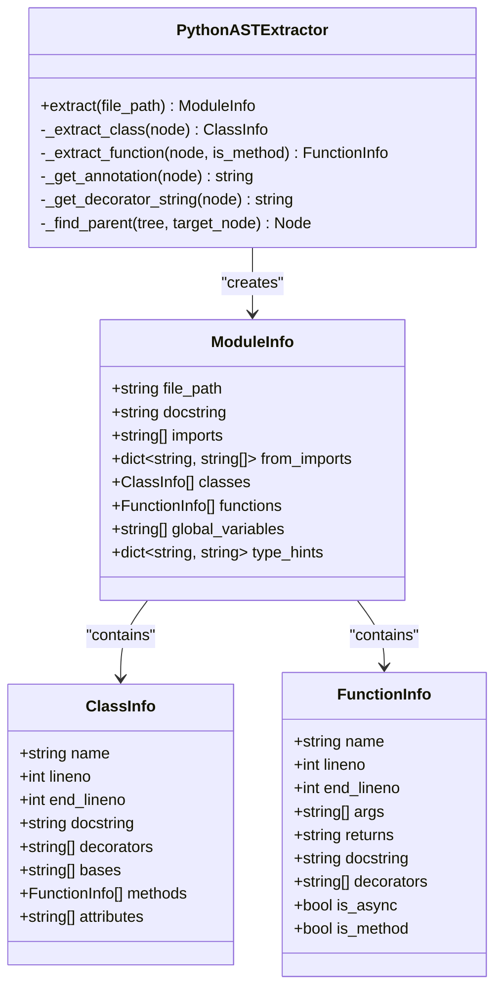

**Diagram sources**
- [tools/ast_extractor.py](file://tools/ast_extractor.py#L50-L122)
- [tools/ast_extractor.py](file://tools/ast_extractor.py#L123-L159)
- [tools/ast_extractor.py](file://tools/ast_extractor.py#L160-L191)

### Enhanced Code Indexer
The code indexer extends the basic AST extraction with semantic indexing capabilities:

- **Multi-language Support**: Processes Python, Rust, TypeScript, and Markdown files
- **Semantic Chunking**: Splits code into overlapping chunks for better vector search
- **Vector Embeddings**: Generates embeddings using Firestore Vector Store for AI-assisted development
- **Backup System**: Creates local backups of indexed content for offline access
- **Parallel Processing**: Uses asyncio and semaphores for efficient concurrent processing

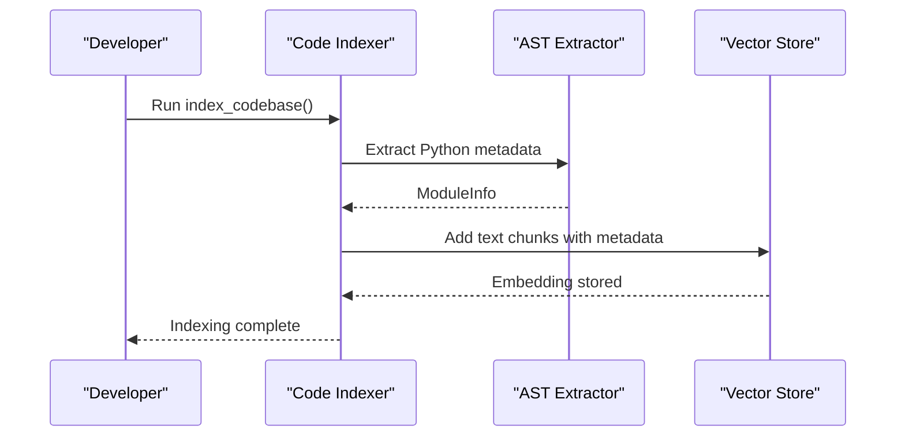

**Diagram sources**
- [core/tools/code_indexer.py](file://core/tools/code_indexer.py#L90-L120)
- [core/tools/code_indexer.py](file://core/tools/code_indexer.py#L122-L205)

**Section sources**
- [tools/dependency_analyzer.py](file://tools/dependency_analyzer.py#L1-L179)
- [tools/ast_extractor.py](file://tools/ast_extractor.py#L1-L237)
- [core/tools/code_indexer.py](file://core/tools/code_indexer.py#L1-L220)
- [tools/test_ast.py](file://tools/test_ast.py#L1-L15)

## Dependency Analysis
Key runtime dependencies include:
- google-genai, pyaudio, numpy, pydantic, websockets, cryptography, watchdog
- firebase-admin, redis, opentelemetry
- playwright, curl_cffi, scikit-learn for tooling and orchestration
- **New**: networkx, pyvis for dependency visualization and analysis

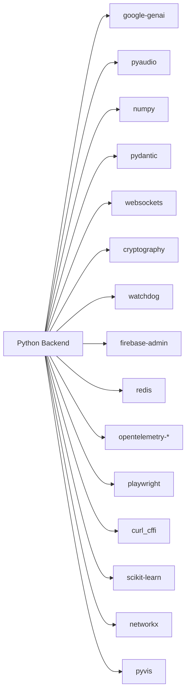

**Diagram sources**
- [requirements.txt](file://requirements.txt#L1-L57)

**Section sources**
- [requirements.txt](file://requirements.txt#L1-L57)

## Performance Considerations
- Real-time constraints: Callbacks must be non-blocking, low-allocation, and predictably fast
- Bounded queues and overflow policies to maintain latency bounds
- Structured concurrency with asyncio TaskGroups and signal-driven shutdown
- Rust acceleration for DSP where available, with graceful Python fallbacks
- Deterministic telemetry counters and throttled broadcasts to avoid hot-path overhead
- **Enhanced**: Parallel processing for code analysis tools using semaphores and asyncio
- **New**: Vector store operations optimized for batch processing and memory efficiency

**Section sources**
- [best_practices.md](file://best_practices.md#L50-L116)
- [docs/architecture.md](file://docs/architecture.md#L62-L67)
- [core/tools/code_indexer.py](file://core/tools/code_indexer.py#L118-L120)

## Troubleshooting Guide
Common issues and remedies:
- Missing API key: Ensure GOOGLE_API_KEY is set; the server checks early and exits with guidance
- Missing dependencies: The server validates pyaudio, google-genai, and pydantic-settings before launching
- No microphone on Linux: Set AETHER_AUDIO_INPUT_DEVICE to the correct index
- Firebase unavailable: The system degrades gracefully; configure GOOGLE_APPLICATION_CREDENTIALS if persistent memory is required
- High CPU usage: Verify PyAudio C extensions, reduce frontend visualizer FPS, and confirm Rust acceleration is enabled
- **New**: Dependency analyzer failures: Install networkx and pyvis packages for full dependency analysis functionality
- **New**: Code indexer errors: Ensure GOOGLE_API_KEY is set in .env file for vector store operations

**Section sources**
- [core/server.py](file://core/server.py#L62-L120)
- [README.md](file://README.md#L244-L249)
- [tools/dependency_analyzer.py](file://tools/dependency_analyzer.py#L11-L18)
- [core/tools/code_indexer.py](file://core/tools/code_indexer.py#L92-L98)

## Development Workflow
Local development:
- Backend: Create a virtual environment, install requirements, set GOOGLE_API_KEY, and run the server entrypoint
- Frontend: From apps/portal, install dependencies and run the dev server; Tauri CLI is available for desktop builds
- Docker: Use docker-compose to spin up kernel and portal containers; health checks expose the gateway port
- **Enhanced**: Code Analysis: Use tools/dependency_analyzer.py to analyze dependencies and detect circular imports
- **Enhanced**: AST Inspection: Use tools/ast_extractor.py to analyze Python code structure and metadata
- **Enhanced**: Code Indexing: Use core/tools/code_indexer.py to create semantic indexes for AI-assisted development

CI/CD pipeline:
- Rust check for cortex
- Linting with Ruff (style and formatting)
- Multi-version Python tests with coverage thresholds
- Frontend lint and test
- Security scans (Bandit, Safety) and Docker image build verification
- **New**: Automated dependency analysis in CI for circular import detection

**Updated**: README Statistics Automation:
- GitHub Actions workflow runs daily at midnight UTC to update README statistics
- Automatically generates GitHub stats, contribution streak, and visitor counters
- Updates contributors widget with latest avatar list
- Includes manual trigger capability for immediate updates

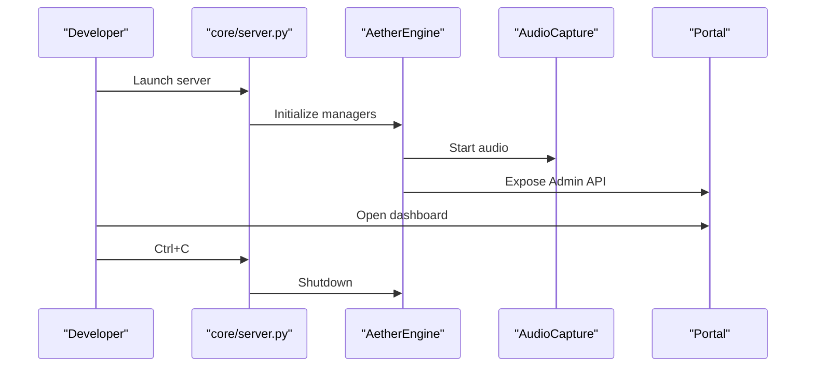

**Diagram sources**
- [core/server.py](file://core/server.py#L105-L149)
- [core/engine.py](file://core/engine.py#L189-L240)

**Section sources**
- [README.md](file://README.md#L184-L210)
- [.github/workflows/aether_pipeline.yml](file://.github/workflows/aether_pipeline.yml#L1-L160)
- [docker-compose.yml](file://docker-compose.yml#L1-L37)
- [.github/workflows/update_readme_stats.yml](file://.github/workflows/update_readme_stats.yml#L1-L62)
- [tools/dependency_analyzer.py](file://tools/dependency_analyzer.py#L134-L175)
- [core/tools/code_indexer.py](file://core/tools/code_indexer.py#L218-L220)

## README Documentation Improvements

**Updated** The README has undergone comprehensive improvements to enhance discoverability, engagement, and professional presentation.

### Dynamic Statistics and Badges System
The README now features an extensive collection of dynamic badges and statistics:
- Visitor counter powered by Komarev service
- GitHub statistics including Stars, Forks, Watchers, Issues, Release, and Last Commit
- Performance metrics badges showing latency (180ms avg), emotion AI accuracy (92%), CPU usage (<2%), and RAM usage (<50MB)
- Animated quantum neural avatar with CSS pulse effect for visual engagement

### Enhanced Navigation and Structure
- Quick navigation table with badge buttons for rapid access to major sections
- Organized sections with clear visual hierarchy using emojis and color coding
- Comprehensive table of contents for improved accessibility

### Advanced Visual Diagrams
Five detailed Mermaid diagrams provide comprehensive system visualization:
- Audio Processing Pipeline flowchart showing the complete audio journey
- Thalamic Gate Algorithm deep dive with detailed algorithm breakdown
- Complete System Architecture diagram with four-layer neural pipeline
- Data Flow Sequence showing end-to-end system interaction
- Performance benchmark charts including latency comparison and emotion detection accuracy

### Interactive Elements and Community Features
- Experiment Corner with clickable demo buttons for live trials
- Feature Status Matrix with roadmap and progress indicators
- Achievement badges section highlighting project milestones
- Contributors widget that auto-updates with latest contributors
- Social media links to Twitter, LinkedIn, Discord, YouTube, and GitHub
- Support and sponsorship section with multiple engagement options

### Documentation Access and Professional Presentation
- Quick access links to key documentation files
- API Reference, Architecture, Deployment, and Security documentation
- Enhanced footer with multiple sections including "Made with ❤️" badge
- Professional branding with cyberpunk theme and consistent styling

**Section sources**
- [README.md](file://README.md#L1-L592)
- [docs/README_IMPROVEMENTS.md](file://docs/README_IMPROVEMENTS.md#L1-L169)

## Workflow Automation System

**New** A comprehensive GitHub Actions workflow system has been implemented for automated README maintenance and statistics tracking.

### Update README Statistics Workflow
The workflow runs automatically every 24 hours at midnight UTC and includes:

**Job 1: update-readme-stats**
- Generates fresh GitHub Readme Stats using GitHub API
- Updates contribution streak visualization with daily calendar
- Commits changes with automated commit messages
- Uses GitHub Actions bot credentials for seamless updates

**Job 2: update-contributors**
- Fetches latest contributors list from GitHub
- Updates contrib.rocks widget with latest avatar images
- Ensures all contributors are properly displayed
- Handles edge cases with graceful error handling

### Workflow Features and Benefits
- **Automatic Updates**: Daily statistics refresh without manual intervention
- **Manual Trigger**: Ability to run workflow manually from GitHub Actions tab
- **Robust Error Handling**: Includes `|| exit 0` to handle cases where no changes exist
- **External Service Integration**: Leverages Komarev, Vercel, and Heroku services for real-time updates
- **Version Control**: Workflow file is properly versioned for tracking changes

### Configuration and Customization
The workflow uses standard cron scheduling:
- `0 0 * * *` = Daily at midnight UTC (24-hour cycle)
- Can be customized for different frequencies using crontab.guru format
- Includes comprehensive documentation in README_WORKFLOW.md

### Maintenance and Monitoring
- **Weekly**: Check workflow run success and review new contributors
- **Monthly**: Update feature status matrix and verify all links work
- **Quarterly**: Review analytics and refresh performance benchmarks
- **Ongoing**: Monitor workflow runs in Actions tab for error detection

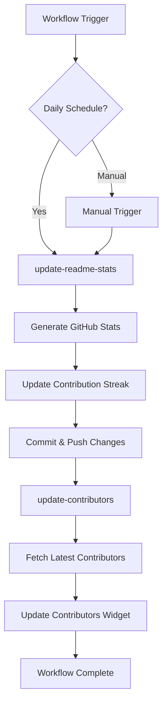

**Diagram sources**
- [.github/workflows/update_readme_stats.yml](file://.github/workflows/update_readme_stats.yml#L10-L43)

**Section sources**
- [.github/workflows/update_readme_stats.yml](file://.github/workflows/update_readme_stats.yml#L1-L62)
- [.github/workflows/README_WORKFLOW.md](file://.github/workflows/README_WORKFLOW.md#L1-L122)

## SDK Guide
Build custom tools using the Neural Dispatcher pattern:
- Define a tool module with get_tools() returning declarations and handlers
- Handlers must be async; return structured dictionaries with a status field
- Register tools in the engine's tool router
- Dry-run tools via ToolRouter dispatch without a live session

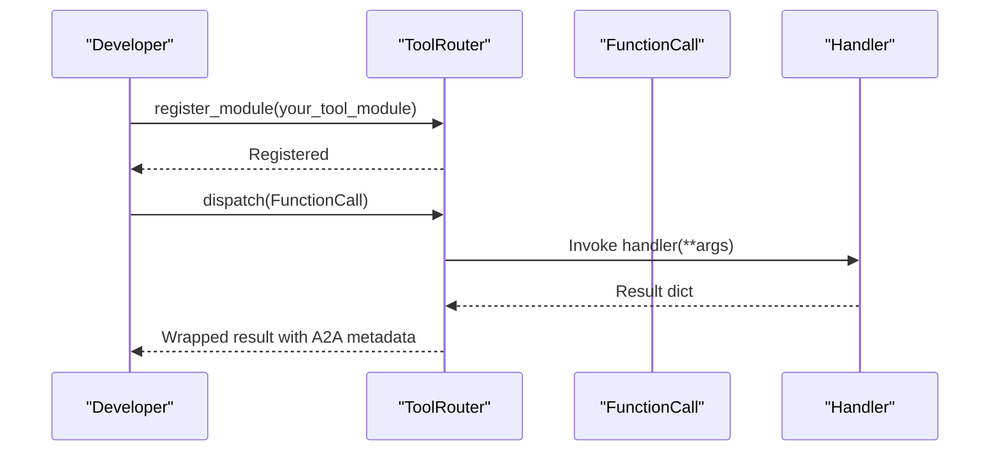

**Diagram sources**
- [docs/sdk_guide.md](file://docs/sdk_guide.md#L47-L73)
- [core/tools/router.py](file://core/tools/router.py#L183-L200)
- [core/tools/router.py](file://core/tools/router.py#L234-L356)

**Section sources**
- [docs/sdk_guide.md](file://docs/sdk_guide.md#L1-L81)
- [core/tools/router.py](file://core/tools/router.py#L120-L360)

## Aether Pack (.ath) Specification
The .ath package encapsulates agent identity, capabilities, and autonomous behaviors:
- Directory structure with manifest.json, Soul.md, Skills.md, heartbeat.md, optional assets
- manifest.json fields include name, version, persona, voice_id, language, capabilities, expertise, and optional public_key/checksum
- Integrity verification via deterministic SHA256 hashing of all files excluding manifest.json
- Capability matrix defines risk levels for audio, tool execution, memory, and UI permissions

```mermaid
erDiagram
ATH_PACKAGE {
string name PK
string version
string persona
string voice_id
string language
string[] capabilities
map expertise
string? public_key
string? checksum
}
FILE_ENTRY {
path path PK
string hash
}
ATH_PACKAGE ||--o{ FILE_ENTRY : "contains"
```

**Diagram sources**
- [docs/ath_package_spec.md](file://docs/ath_package_spec.md#L10-L23)
- [docs/ath_package_spec.md](file://docs/ath_package_spec.md#L26-L43)
- [core/identity/package.py](file://core/identity/package.py#L86-L139)

**Section sources**
- [docs/ath_package_spec.md](file://docs/ath_package_spec.md#L1-L100)
- [core/identity/package.py](file://core/identity/package.py#L72-L166)

## Coding Standards and Contribution Guidelines
- Code style: Ruff linting and formatting; isort for imports; black-compatible formatting
- Type hints: Use explicit return types and NumPy dtypes
- Async/threading: Avoid blocking in callbacks; use loop.call_soon_threadsafe; prefer bounded queues
- Naming: snake_case for modules, PascalCase for classes, snake_case for functions, UPPER_SNAKE_CASE for constants
- Documentation: Module docstrings for runtime constraints; short comments for DSP logic
- Error handling: Domain-specific exceptions; best-effort telemetry counters in hot paths
- Common patterns: Hot-path vs cold-path separation; fallback strategy; queue overflow policy
- **Enhanced**: Code analysis: Use AST extractor for code structure analysis; dependency analyzer for circular import detection

**Section sources**
- [best_practices.md](file://best_practices.md#L50-L116)
- [pyproject.toml](file://pyproject.toml#L6-L21)

## Testing Requirements
- Framework: pytest with pytest-asyncio
- Test layout: unit/, integration/, e2e/; prefer synthetic signals for DSP tests
- Mocking: External I/O and SDKs; deterministic randomness via numpy random generators
- Coverage: Target >80% on audio pipeline modules
- CI: Multi-version Python tests with coverage thresholds; linting; security scans; Docker build verification
- **New**: Code analysis testing: Include AST extractor and dependency analyzer in test suite

**Section sources**
- [best_practices.md](file://best_practices.md#L34-L49)
- [.github/workflows/aether_pipeline.yml](file://.github/workflows/aether_pipeline.yml#L61-L101)

## Deployment and Operations
- Docker: Multi-stage build with Rust DSP acceleration; health checks on gateway port; non-root user
- docker-compose: Orchestrates kernel and portal; environment variables for keys and ports
- Frontend: Next.js with PWA and Tauri; scripts for dev, build, lint, and tests
- **Enhanced**: Code analysis: Automated dependency analysis during build process
- **Enhanced**: Vector store: Firestore-based semantic indexing for AI-assisted development

**Section sources**
- [Dockerfile](file://Dockerfile#L1-L76)
- [docker-compose.yml](file://docker-compose.yml#L1-L37)
- [apps/portal/package.json](file://apps/portal/package.json#L5-L15)

## Conclusion
Aether Voice OS provides a robust foundation for voice-first AI systems with real-time audio processing, multimodal AI orchestration, and extensible tooling. The comprehensive documentation improvements including automated README statistics tracking, workflow automation, enhanced project presentation, and new development tools significantly improve developer experience and project discoverability. 

The addition of dependency analyzer, AST extractor, and enhanced code indexing capabilities provides developers with powerful tools for code analysis, dependency management, and semantic understanding of the codebase. These tools integrate seamlessly with the existing architecture and development workflow, supporting both automated analysis and manual inspection of the code structure.

By following the development workflow, adhering to coding standards, leveraging the SDK and .ath packaging, utilizing the automated documentation system, and taking advantage of the new code analysis tools, contributors can build reliable, performant integrations that meet the project's latency and empathy goals while maintaining professional presentation standards and code quality.