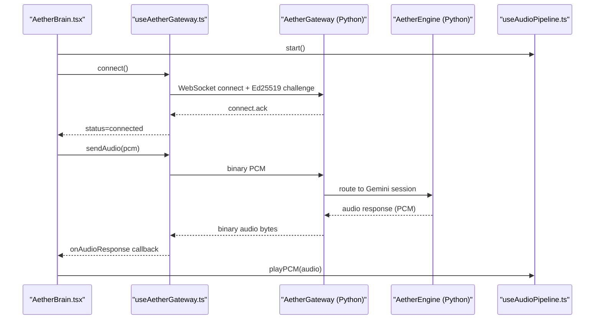
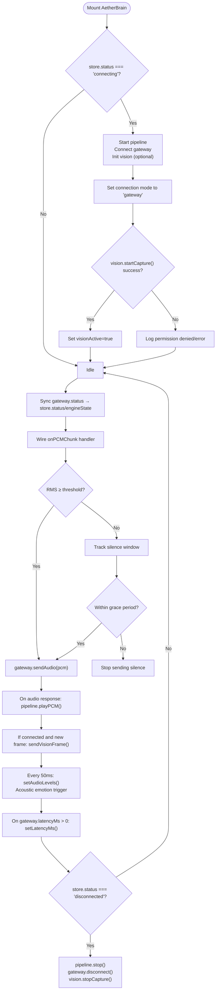
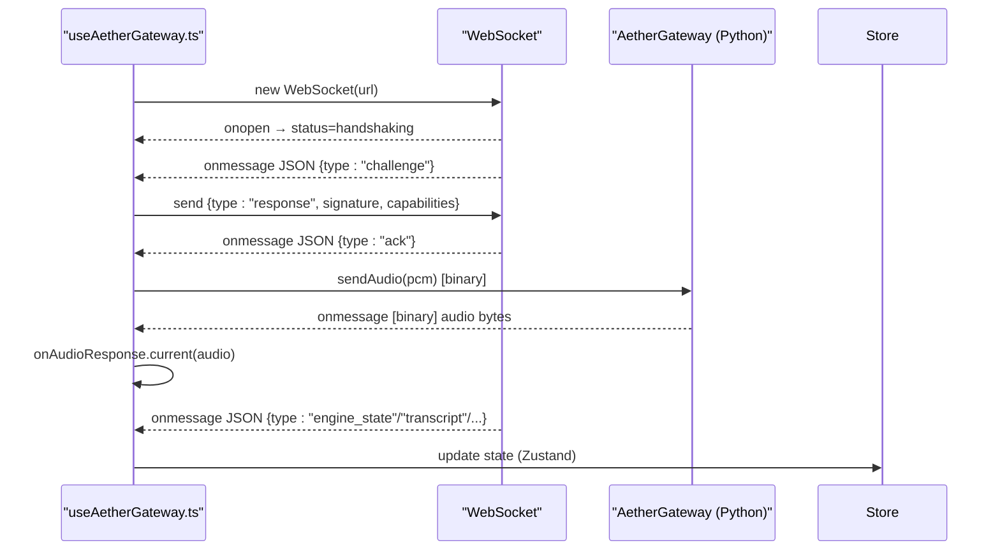
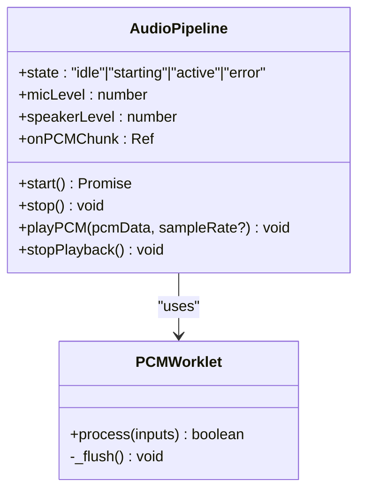
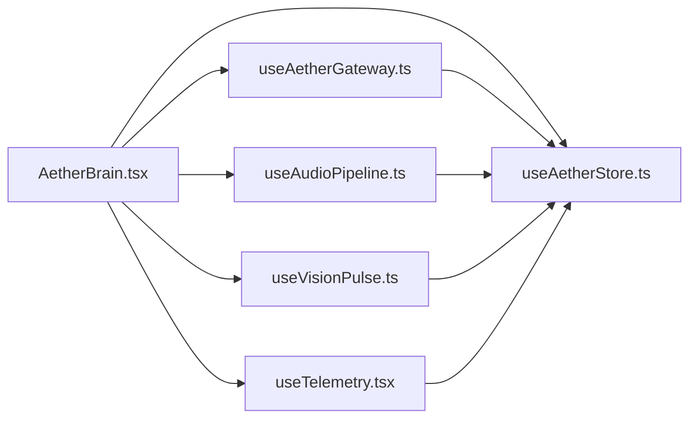

# Aether Brain Component

<cite>
**Referenced Files in This Document**
- [AetherBrain.tsx](file://apps/portal/src/components/AetherBrain.tsx)
- [useAetherGateway.ts](file://apps/portal/src/hooks/useAetherGateway.ts)
- [useAudioPipeline.ts](file://apps/portal/src/hooks/useAudioPipeline.ts)
- [useVisionPulse.ts](file://apps/portal/src/hooks/useVisionPulse.ts)
- [useTelemetry.tsx](file://apps/portal/src/hooks/useTelemetry.tsx)
- [useAetherStore.ts](file://apps/portal/src/store/useAetherStore.ts)
- [pcm-processor.js](file://apps/portal/public/pcm-processor.js)
- [layout.tsx](file://apps/portal/src/app/layout.tsx)
- [gateway.py](file://core/infra/transport/gateway.py)
- [engine.py](file://core/engine.py)
- [SystemAnalytics.tsx](file://apps/portal/src/components/HUD/SystemAnalytics.tsx)
- [SystemFailure.tsx](file://apps/portal/src/components/HUD/SystemFailure.tsx)
</cite>

## Table of Contents
1. [Introduction](#introduction)
2. [Project Structure](#project-structure)
3. [Core Components](#core-components)
4. [Architecture Overview](#architecture-overview)
5. [Detailed Component Analysis](#detailed-component-analysis)
6. [Dependency Analysis](#dependency-analysis)
7. [Performance Considerations](#performance-considerations)
8. [Troubleshooting Guide](#troubleshooting-guide)
9. [Conclusion](#conclusion)

## Introduction
Aether Brain is the invisible conductor of the Aether Voice OS multimodal pipeline. It orchestrates real-time audio capture, client-side voice activity detection (VAD), secure WebSocket communication with the local Aether Gateway, gapless audio playback, proactive vision pulses, acoustic emotion detection, and telemetry synchronization. Built as a React component that renders nothing, Aether Brain wires together the frontend hooks and stores to deliver a seamless, low-latency voice experience.

## Project Structure
Aether Brain lives in the portal application and coordinates with several hooks and stores:
- AetherBrain.tsx: The central orchestration component
- useAetherGateway.ts: Secure WebSocket connection and event routing
- useAudioPipeline.ts: Browser audio I/O, VAD gating, and gapless playback
- useVisionPulse.ts: 1 FPS screen capture and JPEG compression
- useTelemetry.tsx: In-memory telemetry stream provider
- useAetherStore.ts: Global state container for UI and system state
- pcm-processor.js: AudioWorklet encoder for efficient PCM streaming
- layout.tsx: Mounts AetherBrain and TelemetryProvider at the root
- Backend: gateway.py (Python WebSocket server) and engine.py (orchestrator)

```mermaid
graph TB
subgraph "Portal Frontend"
AB["AetherBrain.tsx"]
GAP["useAetherGateway.ts"]
AUD["useAudioPipeline.ts"]
VSN["useVisionPulse.ts"]
TLM["useTelemetry.tsx"]
STO["useAetherStore.ts"]
LYT["layout.tsx"]
PCM["pcm-processor.js"]
end
subgraph "Backend"
ENG["engine.py"]
GW["gateway.py"]
end
LYT --> AB
AB --> GAP
AB --> AUD
AB --> VSN
AB --> TLM
AB --> STO
AUD --> PCM
GAP <- --> GW
ENG --> GW
```

**Diagram sources**
- [AetherBrain.tsx](file://apps/portal/src/components/AetherBrain.tsx#L35-L227)
- [useAetherGateway.ts](file://apps/portal/src/hooks/useAetherGateway.ts#L69-L299)
- [useAudioPipeline.ts](file://apps/portal/src/hooks/useAudioPipeline.ts#L27-L248)
- [useVisionPulse.ts](file://apps/portal/src/hooks/useVisionPulse.ts#L45-L225)
- [useTelemetry.tsx](file://apps/portal/src/hooks/useTelemetry.tsx#L24-L54)
- [useAetherStore.ts](file://apps/portal/src/store/useAetherStore.ts#L289-L440)
- [pcm-processor.js](file://apps/portal/public/pcm-processor.js#L18-L82)
- [layout.tsx](file://apps/portal/src/app/layout.tsx#L42-L57)
- [gateway.py](file://core/infra/transport/gateway.py#L320-L800)
- [engine.py](file://core/engine.py#L26-L240)

**Section sources**
- [AetherBrain.tsx](file://apps/portal/src/components/AetherBrain.tsx#L35-L227)
- [layout.tsx](file://apps/portal/src/app/layout.tsx#L42-L57)

## Core Components
- AetherBrain orchestrates lifecycle, audio/VAD routing, playback, vision pulses, emotion triggers, and telemetry sync.
- useAetherGateway manages the Ed25519 challenge-response handshake, binary audio routing, heartbeat/tick latency, and all backend broadcasts.
- useAudioPipeline handles getUserMedia, AudioWorklet PCM encoding, real-time level monitoring, gapless playback, and instant barge-in.
- useVisionPulse captures screen at 1 FPS, compresses to JPEG, applies change detection, and emits base64 frames.
- useTelemetry provides a lightweight telemetry stream for UI feedback.
- useAetherStore is the global state container for connection, engine state, audio levels, telemetry metrics, transcripts, and system logs.

**Section sources**
- [AetherBrain.tsx](file://apps/portal/src/components/AetherBrain.tsx#L35-L227)
- [useAetherGateway.ts](file://apps/portal/src/hooks/useAetherGateway.ts#L69-L299)
- [useAudioPipeline.ts](file://apps/portal/src/hooks/useAudioPipeline.ts#L27-L248)
- [useVisionPulse.ts](file://apps/portal/src/hooks/useVisionPulse.ts#L45-L225)
- [useTelemetry.tsx](file://apps/portal/src/hooks/useTelemetry.tsx#L24-L54)
- [useAetherStore.ts](file://apps/portal/src/store/useAetherStore.ts#L289-L440)

## Architecture Overview
Aether Brain connects the frontend audio pipeline to the backend via a secure WebSocket. The backend (engine.py) owns the AetherGateway (gateway.py) which manages sessions, routes audio and vision, and broadcasts telemetry and system events to the frontend.



**Diagram sources**
- [AetherBrain.tsx](file://apps/portal/src/components/AetherBrain.tsx#L53-L97)
- [useAetherGateway.ts](file://apps/portal/src/hooks/useAetherGateway.ts#L77-L135)
- [gateway.py](file://core/infra/transport/gateway.py#L529-L548)
- [engine.py](file://core/engine.py#L189-L240)

## Detailed Component Analysis

### AetherBrain Orchestration
Responsibilities:
- Lifecycle boot: starts audio pipeline, connects gateway, initializes vision pulse, sets session start time, and logs system events.
- Status synchronization: maps gateway statuses to global store states.
- Audio gating: client-side VAD gate to reduce API quota usage.
- Playback: routes audio responses to gapless playback.
- Vision pulses: forwards 1 FPS frames to the gateway when connected.
- Emotion sensing: detects acoustic frustration patterns and injects priority vision frames.
- Telemetry sync: updates latency and audio levels.
- Cleanup: stops pipeline, disconnects gateway, halts vision capture on disconnect.



**Diagram sources**
- [AetherBrain.tsx](file://apps/portal/src/components/AetherBrain.tsx#L53-L223)

**Section sources**
- [AetherBrain.tsx](file://apps/portal/src/components/AetherBrain.tsx#L53-L223)

### useAetherGateway: Secure WebSocket and Event Routing
Responsibilities:
- Establishes WebSocket connection to the local gateway URL.
- Performs Ed25519 challenge-response handshake and capability negotiation.
- Routes binary audio to the backend and receives audio responses via callbacks.
- Parses and dispatches all backend broadcast events to the global store (engine_state, transcript, telemetry, neural events, vision pulses, mutations, tool results, soul handoffs).
- Tracks latency via heartbeat ticks and exposes it to the frontend.



**Diagram sources**
- [useAetherGateway.ts](file://apps/portal/src/hooks/useAetherGateway.ts#L77-L266)
- [gateway.py](file://core/infra/transport/gateway.py#L529-L548)

**Section sources**
- [useAetherGateway.ts](file://apps/portal/src/hooks/useAetherGateway.ts#L69-L299)
- [gateway.py](file://core/infra/transport/gateway.py#L529-L617)

### useAudioPipeline: Browser Audio I/O and Gapless Playback
Responsibilities:
- Creates two AudioContexts: one for capture (16 kHz) and one for playback (native rate).
- Captures microphone via getUserMedia with echo cancellation, noise suppression, and AGC.
- Uses an AudioWorklet to encode Float32 PCM chunks to Int16 and periodically posts them to the main thread.
- Monitors real-time RMS and gain for visualization.
- Schedules audio chunks gaplessly using AudioBufferSourceNode and maintains a playback cursor to avoid gaps.
- Supports instant barge-in by stopping all queued sources.



**Diagram sources**
- [useAudioPipeline.ts](file://apps/portal/src/hooks/useAudioPipeline.ts#L27-L248)
- [pcm-processor.js](file://apps/portal/public/pcm-processor.js#L18-L82)

**Section sources**
- [useAudioPipeline.ts](file://apps/portal/src/hooks/useAudioPipeline.ts#L27-L248)
- [pcm-processor.js](file://apps/portal/public/pcm-processor.js#L18-L82)

### useVisionPulse: 1 FPS Screen Capture and Compression
Responsibilities:
- Starts screen capture via getDisplayMedia and renders frames to an off-screen canvas.
- Compresses frames to JPEG at 0.4 quality and scales to 50% resolution for speed.
- Applies change detection to skip unchanged frames (threshold 5% size delta).
- Emits the latest base64 JPEG string for injection into the Gemini WebSocket.

**Section sources**
- [useVisionPulse.ts](file://apps/portal/src/hooks/useVisionPulse.ts#L45-L225)

### useTelemetry: In-Memory Telemetry Stream
Responsibilities:
- Provides a context provider for a rolling telemetry log with timestamped entries.
- Enforces a cap of 50 recent logs and supports clearing.

**Section sources**
- [useTelemetry.tsx](file://apps/portal/src/hooks/useTelemetry.tsx#L24-L54)

### useAetherStore: Global State Container
Responsibilities:
- Maintains connection status, engine state, audio levels, telemetry metrics, transcripts, neural events, system logs, silent hints, vision state, and repair state.
- Exposes actions to update these fields and persists selected preferences.

**Section sources**
- [useAetherStore.ts](file://apps/portal/src/store/useAetherStore.ts#L289-L440)

## Dependency Analysis
Aether Brain depends on:
- useAetherGateway for secure transport and event routing
- useAudioPipeline for capture, VAD gating, and playback
- useVisionPulse for proactive screen context
- useTelemetry for UI telemetry
- useAetherStore for state synchronization



**Diagram sources**
- [AetherBrain.tsx](file://apps/portal/src/components/AetherBrain.tsx#L35-L227)
- [useAetherGateway.ts](file://apps/portal/src/hooks/useAetherGateway.ts#L69-L299)
- [useAudioPipeline.ts](file://apps/portal/src/hooks/useAudioPipeline.ts#L27-L248)
- [useVisionPulse.ts](file://apps/portal/src/hooks/useVisionPulse.ts#L45-L225)
- [useTelemetry.tsx](file://apps/portal/src/hooks/useTelemetry.tsx#L24-L54)
- [useAetherStore.ts](file://apps/portal/src/store/useAetherStore.ts#L289-L440)

**Section sources**
- [AetherBrain.tsx](file://apps/portal/src/components/AetherBrain.tsx#L35-L227)
- [useAetherGateway.ts](file://apps/portal/src/hooks/useAetherGateway.ts#L69-L299)
- [useAudioPipeline.ts](file://apps/portal/src/hooks/useAudioPipeline.ts#L27-L248)
- [useVisionPulse.ts](file://apps/portal/src/hooks/useVisionPulse.ts#L45-L225)
- [useTelemetry.tsx](file://apps/portal/src/hooks/useTelemetry.tsx#L24-L54)
- [useAetherStore.ts](file://apps/portal/src/store/useAetherStore.ts#L289-L440)

## Performance Considerations
- AudioWorklet encoding: Pre-allocated ring buffer and zero-copy transfers minimize GC pressure and reduce WS overhead.
- VAD gating: Suppresses sending silence to save API quota and bandwidth.
- Gapless playback: Scheduling ensures no gaps between audio chunks for natural voice output.
- 1 FPS vision pulses: JPEG compression at 0.4 quality and change detection reduce payload size.
- Latency measurement: Heartbeat ticks enable real-time latency updates.
- State updates: Zustand mutations avoid unnecessary re-renders; transient telemetry updates use getState() to prevent render loops.

[No sources needed since this section provides general guidance]

## Troubleshooting Guide
Common issues and remedies:
- Connection fails during handshake
  - Verify gateway is running locally on the expected port.
  - Check browser console for handshake errors and network connectivity.
  - Confirm the Ed25519 keypair is persisted in sessionStorage.
  - Review backend logs for signature verification failures.

- No audio output
  - Ensure the audio pipeline started successfully and state is active.
  - Check that onAudioResponse is wired and playPCM is invoked.
  - Verify playback context is not suspended and gain is set.

- Excessive silence or no speech detected
  - Adjust VAD RMS threshold and silence grace period.
  - Confirm microphone permissions and device selection.

- Vision pulse not sending frames
  - Confirm screen capture permission and startCapture() success.
  - Ensure gateway is connected before sending frames.
  - Check change detection thresholds to allow frame transmission.

- High latency spikes
  - Monitor gateway latencyMs updates and backend tick intervals.
  - Inspect CPU usage and AudioWorklet scheduling.

- System failure overlay appears
  - Review repairState logs and messages.
  - Acknowledge and override if necessary; monitor auto-dismiss behavior.

**Section sources**
- [useAetherGateway.ts](file://apps/portal/src/hooks/useAetherGateway.ts#L251-L265)
- [useAudioPipeline.ts](file://apps/portal/src/hooks/useAudioPipeline.ts#L130-L134)
- [AetherBrain.tsx](file://apps/portal/src/components/AetherBrain.tsx#L167-L201)
- [SystemFailure.tsx](file://apps/portal/src/components/HUD/SystemFailure.tsx#L11-L23)

## Conclusion
Aether Brain serves as the central coordinator for the Aether Voice OS pipeline. By combining client-side VAD gating, gapless playback, secure WebSocket transport, and proactive telemetry, it delivers a responsive, low-latency voice experience. Its modular design leverages hooks and a global store to maintain high performance and clear separation of concerns.