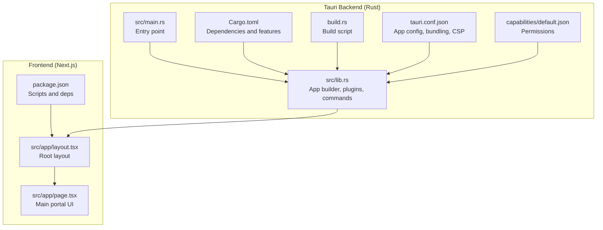
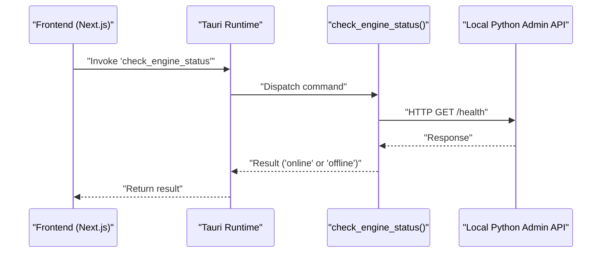
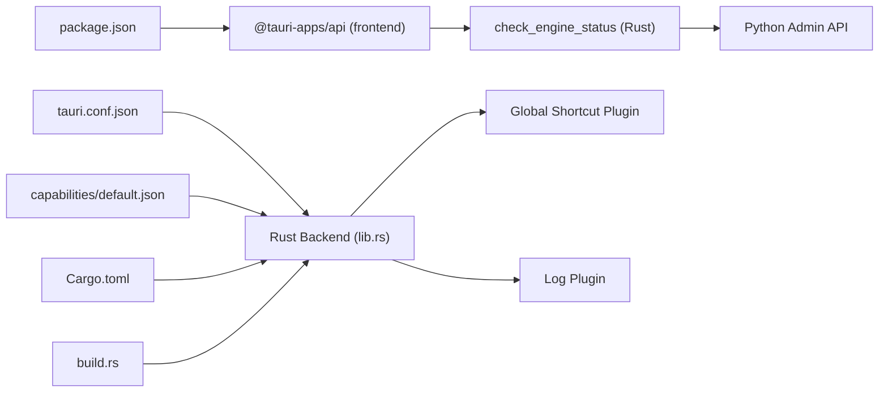

# Desktop Integration (Tauri)

<cite>
**Referenced Files in This Document**
- [tauri.conf.json](file://apps/portal/src-tauri/tauri.conf.json)
- [Cargo.toml](file://apps/portal/src-tauri/Cargo.toml)
- [lib.rs](file://apps/portal/src-tauri/src/lib.rs)
- [main.rs](file://apps/portal/src-tauri/src/main.rs)
- [build.rs](file://apps/portal/src-tauri/build.rs)
- [default.json](file://apps/portal/src-tauri/capabilities/default.json)
- [package.json](file://apps/portal/package.json)
- [layout.tsx](file://apps/portal/src/app/layout.tsx)
- [page.tsx](file://apps/portal/src/app/page.tsx)
</cite>

## Table of Contents
1. [Introduction](#introduction)
2. [Project Structure](#project-structure)
3. [Core Components](#core-components)
4. [Architecture Overview](#architecture-overview)
5. [Detailed Component Analysis](#detailed-component-analysis)
6. [Dependency Analysis](#dependency-analysis)
7. [Performance Considerations](#performance-considerations)
8. [Troubleshooting Guide](#troubleshooting-guide)
9. [Conclusion](#conclusion)
10. [Appendices](#appendices)

## Introduction
This document explains the Tauri desktop integration for Aether Voice OS, focusing on how the Rust backend communicates with the Next.js/React frontend, how the desktop shell is configured for overlay-like behavior, and how permissions and plugins are managed. It also covers platform-specific considerations for Windows, macOS, and Linux, and provides troubleshooting guidance for common desktop integration issues.

## Project Structure
The desktop integration spans three primary areas:
- Tauri configuration and build: defines app metadata, bundling, and window defaults.
- Rust backend: initializes Tauri, registers plugins, exposes commands, and manages window behavior.
- Frontend integration: Next.js app that renders the Aether Voice OS UI and interacts with Tauri commands.

**Diagram sources**
- [main.rs](file://apps/portal/src-tauri/src/main.rs#L1-L7)
- [lib.rs](file://apps/portal/src-tauri/src/lib.rs#L1-L69)
- [Cargo.toml](file://apps/portal/src-tauri/Cargo.toml#L1-L28)
- [build.rs](file://apps/portal/src-tauri/build.rs#L1-L4)
- [tauri.conf.json](file://apps/portal/src-tauri/tauri.conf.json#L1-L41)
- [default.json](file://apps/portal/src-tauri/capabilities/default.json#L1-L12)
- [package.json](file://apps/portal/package.json#L1-L53)
- [layout.tsx](file://apps/portal/src/app/layout.tsx#L1-L58)
- [page.tsx](file://apps/portal/src/app/page.tsx#L1-L96)

**Section sources**
- [tauri.conf.json](file://apps/portal/src-tauri/tauri.conf.json#L1-L41)
- [Cargo.toml](file://apps/portal/src-tauri/Cargo.toml#L1-L28)
- [lib.rs](file://apps/portal/src-tauri/src/lib.rs#L1-L69)
- [main.rs](file://apps/portal/src-tauri/src/main.rs#L1-L7)
- [build.rs](file://apps/portal/src-tauri/build.rs#L1-L4)
- [default.json](file://apps/portal/src-tauri/capabilities/default.json#L1-L12)
- [package.json](file://apps/portal/package.json#L1-L53)
- [layout.tsx](file://apps/portal/src/app/layout.tsx#L1-L58)
- [page.tsx](file://apps/portal/src/app/page.tsx#L1-L96)

## Core Components
- Tauri configuration: Defines product metadata, build pipeline, window defaults, and bundling targets.
- Rust backend: Initializes Tauri, registers plugins, exposes a command to check the local engine health, and sets up always-on-top behavior.
- Capability system: Grants the app permission to access the main window and core capabilities.
- Frontend integration: Renders the Aether Voice OS UI and integrates with Tauri commands and APIs.

Key implementation references:
- Window defaults and CSP: [tauri.conf.json](file://apps/portal/src-tauri/tauri.conf.json#L12-L29)
- Plugin and command registration: [lib.rs](file://apps/portal/src-tauri/src/lib.rs#L14-L68)
- Capability definition: [default.json](file://apps/portal/src-tauri/capabilities/default.json#L1-L12)
- Build and dependencies: [Cargo.toml](file://apps/portal/src-tauri/Cargo.toml#L17-L27), [build.rs](file://apps/portal/src-tauri/build.rs#L1-L4)
- Frontend scripts and Tauri CLI: [package.json](file://apps/portal/package.json#L5-L14)

**Section sources**
- [tauri.conf.json](file://apps/portal/src-tauri/tauri.conf.json#L12-L29)
- [lib.rs](file://apps/portal/src-tauri/src/lib.rs#L14-L68)
- [default.json](file://apps/portal/src-tauri/capabilities/default.json#L1-L12)
- [Cargo.toml](file://apps/portal/src-tauri/Cargo.toml#L17-L27)
- [build.rs](file://apps/portal/src-tauri/build.rs#L1-L4)
- [package.json](file://apps/portal/package.json#L5-L14)

## Architecture Overview
The desktop architecture connects the Next.js frontend to the Tauri backend via IPC. The Rust backend exposes commands and plugins, while the frontend invokes commands and manages UI rendering.

**Diagram sources**
- [lib.rs](file://apps/portal/src-tauri/src/lib.rs#L4-L12)
- [package.json](file://apps/portal/package.json#L37-L38)

**Section sources**
- [lib.rs](file://apps/portal/src-tauri/src/lib.rs#L4-L12)
- [package.json](file://apps/portal/package.json#L37-L38)

## Detailed Component Analysis

### Tauri Configuration (tauri.conf.json)
- Product and build:
  - Product name, version, identifier, and build pipeline (frontend dist, dev URL, pre-dev/build commands).
- App window defaults:
  - Title, size, resizable flag, fullscreen toggle, transparency, decorations, and always-on-top behavior.
- Security:
  - Content Security Policy disabled for development flexibility.
- Bundling:
  - Targets all platforms and includes icons for multiple formats.

Desktop shell setup highlights:
- Transparency and decorations off enable overlay-like visuals.
- Always-on-top ensures the window stays above other apps.
- Fullscreen disabled allows multi-window/multi-monitor scenarios.

Platform note:
- macOS private API enabled to unlock advanced window behaviors.

**Section sources**
- [tauri.conf.json](file://apps/portal/src-tauri/tauri.conf.json#L1-L41)

### Rust Backend (src/lib.rs)
Responsibilities:
- Initialize Tauri runtime with default builder.
- Register plugins:
  - Global shortcut plugin for desktop hotkeys.
  - Optional logging plugin in debug builds.
- Expose a command:
  - check_engine_status: pings a local Python Admin API endpoint and returns online/offline.
- Setup logic:
  - Retrieve the main webview window and set always-on-top.
  - Register a macOS-specific hotkey (Cmd+Shift+Space) to toggle visibility and focus.

Hotkey behavior:
- On press, toggles visibility of the main window and brings it into focus when shown.

Security and permissions:
- Uses the capability system to grant access to the main window and core permissions.

**Section sources**
- [lib.rs](file://apps/portal/src-tauri/src/lib.rs#L14-L68)

### Cargo.toml and Build Pipeline
- Dependencies:
  - tauri, tauri-plugin-log, tauri-plugin-global-shortcut, reqwest, serde, log.
  - macOS private API feature enabled for Tauri.
- Build dependencies:
  - tauri-build.
- Build script:
  - Delegates to tauri_build::build.

**Section sources**
- [Cargo.toml](file://apps/portal/src-tauri/Cargo.toml#L17-L27)
- [build.rs](file://apps/portal/src-tauri/build.rs#L1-L4)

### Capability System (capabilities/default.json)
- Identifier and description for default permissions.
- Grants access to the main window and core permissions.

**Section sources**
- [default.json](file://apps/portal/src-tauri/capabilities/default.json#L1-L12)

### Frontend Integration (Next.js)
- Root layout and page composition:
  - Root layout wraps the app with telemetry provider and AetherBrain.
  - Main page composes HUD, realms, command bar, and overlays.
- Scripts and tooling:
  - Dev/build scripts and Tauri CLI integration via package.json.

Desktop-specific usage patterns:
- The frontend can call Tauri commands exposed by the backend (e.g., engine status checks).
- The UI remains responsive while the Rust backend manages window behavior and global shortcuts.

**Section sources**
- [layout.tsx](file://apps/portal/src/app/layout.tsx#L1-L58)
- [page.tsx](file://apps/portal/src/app/page.tsx#L1-L96)
- [package.json](file://apps/portal/package.json#L5-L14)

### Desktop Shell: Transparency, Always-on-Top, and Click-Through
- Transparency and decorations:
  - Configured in tauri.conf.json to achieve a glass-like overlay appearance.
- Always-on-top:
  - Set via window.set_always_on_top(true) during setup.
- Click-through:
  - Not explicitly configured in the current codebase. If needed, platform-specific window attributes would be required to implement click-through behavior.

Overlay behavior implications:
- Transparent, decorationless, always-on-top windows are ideal for HUDs and floating overlays.
- Ensure the frontend avoids blocking clicks unintentionally to maintain overlay functionality.

**Section sources**
- [tauri.conf.json](file://apps/portal/src-tauri/tauri.conf.json#L21-L23)
- [lib.rs](file://apps/portal/src-tauri/src/lib.rs#L28-L31)

### Global Shortcuts and System Integration
- Plugin:
  - tauri-plugin-global-shortcut registered in the backend.
- Hotkey:
  - macOS: Cmd+Shift+Space toggles the main window visibility and focus.
- Cross-platform:
  - The hotkey is defined for macOS; other platforms would require separate definitions.

Integration points:
- The handler responds to shortcut presses and toggles window visibility and focus.

**Section sources**
- [lib.rs](file://apps/portal/src-tauri/src/lib.rs#L42-L62)

### Window Management and Multi-Monitor Support
- Window defaults:
  - Fixed size with resizable flag enabled.
  - Fullscreen disabled to support multi-monitor setups.
- Multi-monitor:
  - The current configuration does not specify monitor targeting or positioning logic.
  - To implement per-monitor placement, additional window APIs would be required.

**Section sources**
- [tauri.conf.json](file://apps/portal/src-tauri/tauri.conf.json#L17-L20)

### Platform-Specific Considerations
- macOS:
  - macOS private API enabled in Tauri configuration.
  - Hotkey uses SUPER modifier (Cmd).
  - Additional window behaviors may leverage private APIs if extended.
- Windows:
  - Console subsystem configured in main.rs to prevent extra console windows in release.
  - Global shortcuts and window behavior supported via Tauri.
- Linux:
  - Tauri supports Linux; ensure distribution-specific window manager compatibility for always-on-top and transparency.

**Section sources**
- [tauri.conf.json](file://apps/portal/src-tauri/tauri.conf.json#L13-L13)
- [lib.rs](file://apps/portal/src-tauri/src/lib.rs#L42-L62)
- [main.rs](file://apps/portal/src-tauri/src/main.rs#L1-L2)

### Rust Backend to TypeScript Frontend Communication
- Commands:
  - The backend exposes check_engine_status as a Tauri command.
  - The frontend can invoke this command using @tauri-apps/api/core invoke.
- Plugins:
  - Global shortcut plugin is available to the frontend via @tauri-apps/plugin-global-shortcut.

**Section sources**
- [lib.rs](file://apps/portal/src-tauri/src/lib.rs#L4-L12)
- [package.json](file://apps/portal/package.json#L20-L38)

## Dependency Analysis
The desktop integration depends on:
- Tauri runtime and plugins for window management and global shortcuts.
- Logging plugin for diagnostics in debug builds.
- HTTP client for backend-to-engine health checks.
- Frontend dependencies for UI and Tauri integration.

**Diagram sources**
- [lib.rs](file://apps/portal/src-tauri/src/lib.rs#L14-L68)
- [tauri.conf.json](file://apps/portal/src-tauri/tauri.conf.json#L1-L41)
- [default.json](file://apps/portal/src-tauri/capabilities/default.json#L1-L12)
- [Cargo.toml](file://apps/portal/src-tauri/Cargo.toml#L17-L27)
- [build.rs](file://apps/portal/src-tauri/build.rs#L1-L4)
- [package.json](file://apps/portal/package.json#L20-L38)

**Section sources**
- [lib.rs](file://apps/portal/src-tauri/src/lib.rs#L14-L68)
- [tauri.conf.json](file://apps/portal/src-tauri/tauri.conf.json#L1-L41)
- [default.json](file://apps/portal/src-tauri/capabilities/default.json#L1-L12)
- [Cargo.toml](file://apps/portal/src-tauri/Cargo.toml#L17-L27)
- [build.rs](file://apps/portal/src-tauri/build.rs#L1-L4)
- [package.json](file://apps/portal/package.json#L20-L38)

## Performance Considerations
- Keep the overlay window transparent and decorationless to minimize rendering overhead.
- Avoid heavy animations or frequent repaints in the overlay layer.
- Use always-on-top judiciously; excessive z-order manipulation can impact performance.
- Limit network calls in commands; cache results when appropriate.
- Disable logging plugin in production builds to reduce I/O overhead.

[No sources needed since this section provides general guidance]

## Troubleshooting Guide
Common desktop integration issues and resolutions:
- Window not staying on top:
  - Verify always-on-top is set during setup and that the window handle exists.
  - Confirm platform-specific window manager policies.
- Global shortcut not working:
  - Ensure the global shortcut plugin is loaded and the shortcut is registered.
  - Check platform-specific modifier keys (e.g., Cmd vs Ctrl).
- Engine status command fails:
  - Confirm the local Python Admin API is reachable at the expected port.
  - Validate network/firewall settings and CORS if applicable.
- Transparency or decorations issues:
  - Review tauri.conf.json window settings and platform-specific limitations.
- Build failures:
  - Ensure tauri-build is present and build.rs delegates to tauri_build::build.
  - Verify Cargo.toml dependencies and versions.

**Section sources**
- [lib.rs](file://apps/portal/src-tauri/src/lib.rs#L28-L62)
- [tauri.conf.json](file://apps/portal/src-tauri/tauri.conf.json#L17-L23)
- [Cargo.toml](file://apps/portal/src-tauri/Cargo.toml#L17-L27)
- [build.rs](file://apps/portal/src-tauri/build.rs#L1-L4)

## Conclusion
Aether Voice OS leverages Tauri to deliver a high-performance, overlay-ready desktop application. The Rust backend exposes essential commands and plugins, while the Next.js frontend renders the immersive UI. With transparency, always-on-top behavior, and global shortcuts, the desktop shell supports a premium, unobtrusive experience. Extending platform-specific features and optimizing performance will further enhance the desktop integration.

[No sources needed since this section summarizes without analyzing specific files]

## Appendices
- Example desktop features to implement:
  - Window positioning and multi-monitor awareness via window APIs.
  - Click-through configuration for overlay interactivity.
  - System tray integration using Tauri’s tray APIs.
- Reference paths:
  - Command invocation: [lib.rs](file://apps/portal/src-tauri/src/lib.rs#L4-L12)
  - Hotkey registration: [lib.rs](file://apps/portal/src-tauri/src/lib.rs#L42-L62)
  - Window defaults: [tauri.conf.json](file://apps/portal/src-tauri/tauri.conf.json#L17-L23)
  - Capabilities: [default.json](file://apps/portal/src-tauri/capabilities/default.json#L1-L12)

[No sources needed since this section aggregates previously cited references]