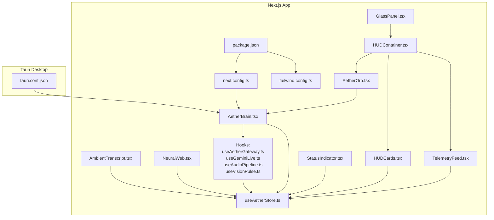
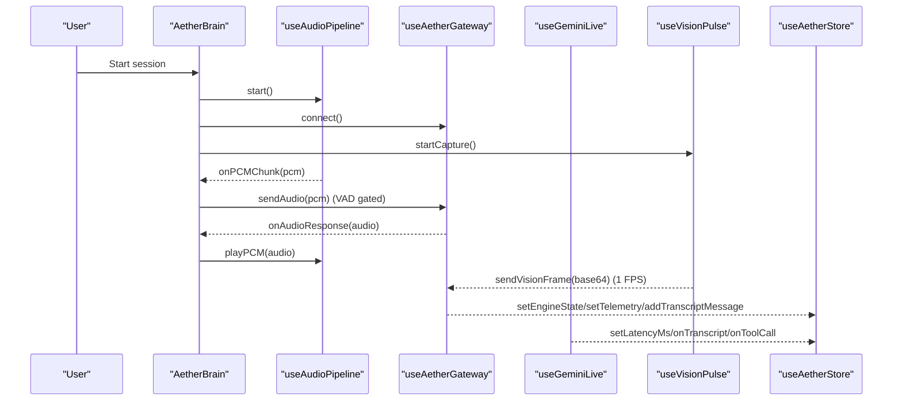
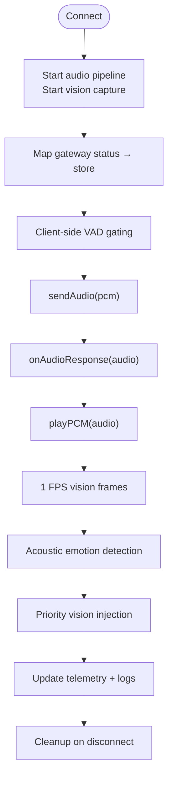
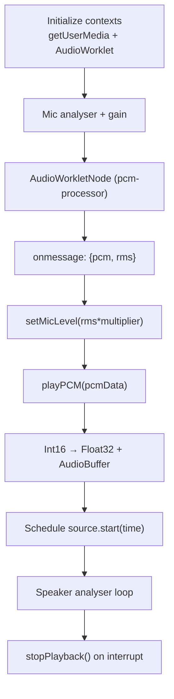
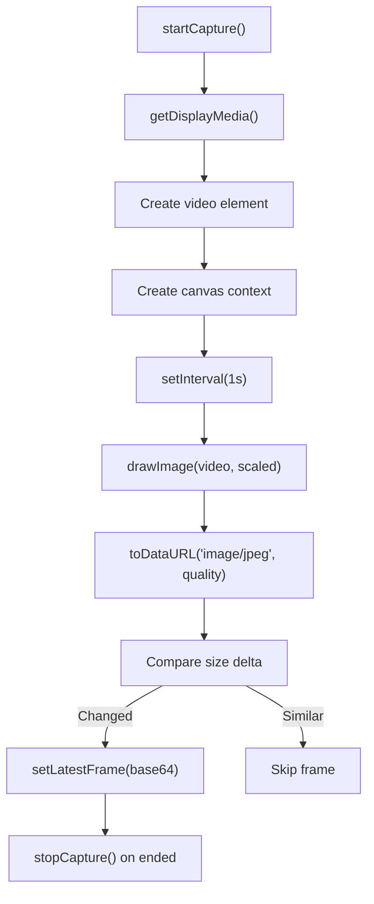
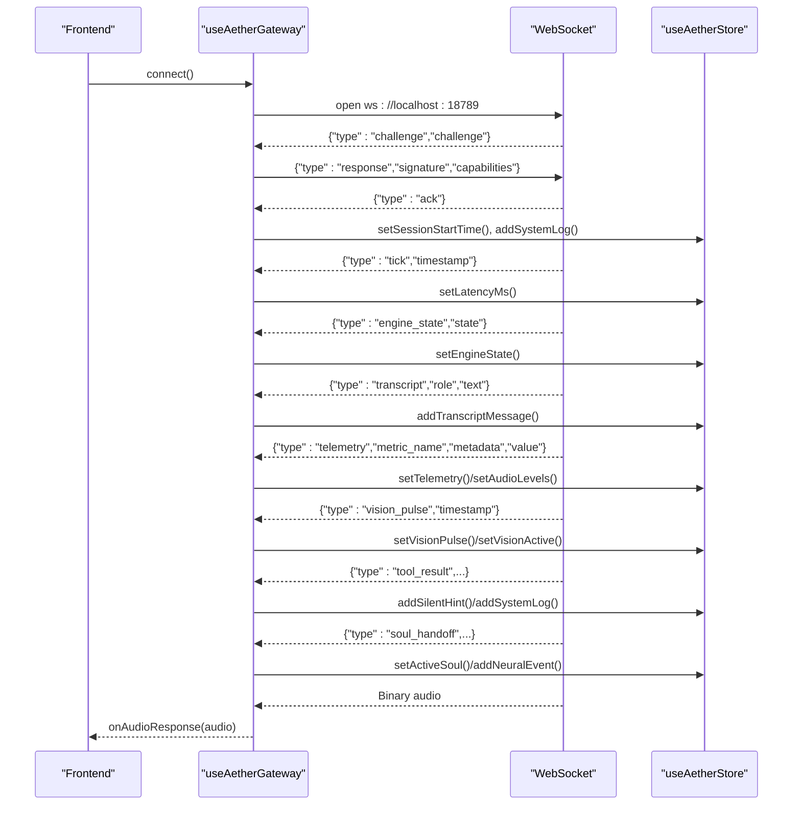
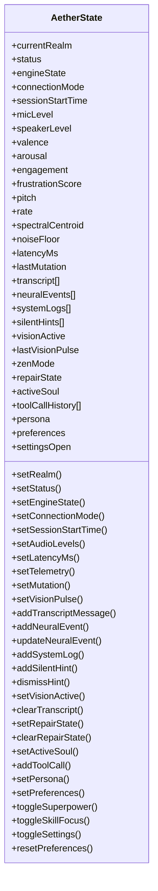
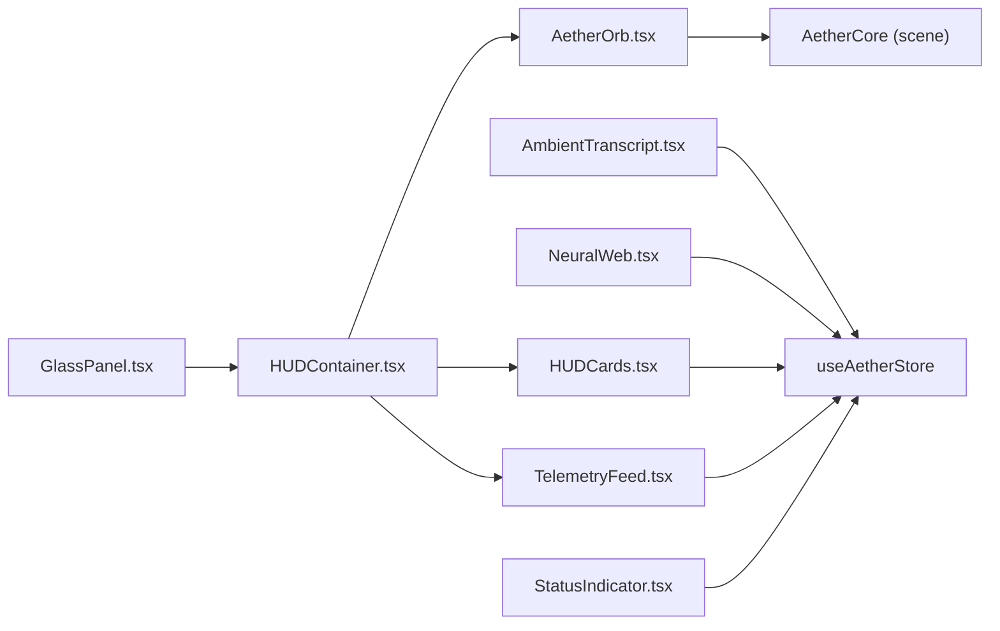
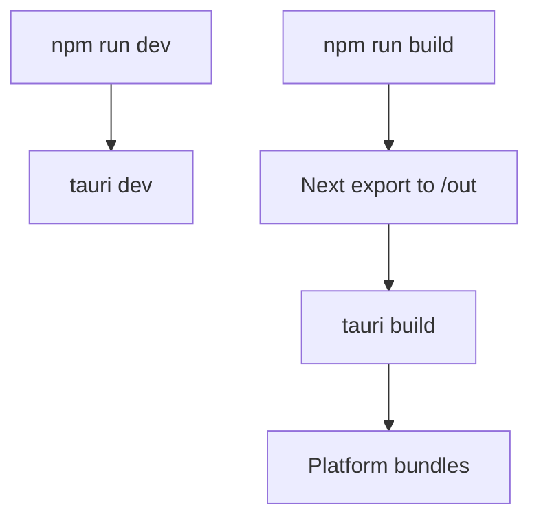
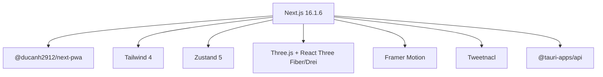

# Frontend Application

<cite>
**Referenced Files in This Document**
- [package.json](file://apps/portal/package.json)
- [next.config.ts](file://apps/portal/next.config.ts)
- [tailwind.config.ts](file://apps/portal/tailwind.config.ts)
- [useAetherStore.ts](file://apps/portal/src/store/useAetherStore.ts)
- [useAetherGateway.ts](file://apps/portal/src/hooks/useAetherGateway.ts)
- [useGeminiLive.ts](file://apps/portal/src/hooks/useGeminiLive.ts)
- [useAudioPipeline.ts](file://apps/portal/src/hooks/useAudioPipeline.ts)
- [useVisionPulse.ts](file://apps/portal/src/hooks/useVisionPulse.ts)
- [AetherBrain.tsx](file://apps/portal/src/components/AetherBrain.tsx)
- [AetherOrb.tsx](file://apps/portal/src/components/core/AetherOrb.tsx)
- [AmbientTranscript.tsx](file://apps/portal/src/components/AmbientTranscript.tsx)
- [NeuralWeb.tsx](file://apps/portal/src/components/NeuralWeb.tsx)
- [GlassPanel.tsx](file://apps/portal/src/components/shared/GlassPanel.tsx)
- [HUDContainer.tsx](file://apps/portal/src/components/HUD/HUDContainer.tsx)
- [HUDCards.tsx](file://apps/portal/src/components/HUDCards.tsx)
- [TelemetryFeed.tsx](file://apps/portal/src/components/TelemetryFeed.tsx)
- [StatusIndicator.tsx](file://apps/portal/src/components/StatusIndicator.tsx)
- [tauri.conf.json](file://apps/portal/src-tauri/tauri.conf.json)
</cite>

## Table of Contents
1. [Introduction](#introduction)
2. [Project Structure](#project-structure)
3. [Core Components](#core-components)
4. [Architecture Overview](#architecture-overview)
5. [Detailed Component Analysis](#detailed-component-analysis)
6. [Dependency Analysis](#dependency-analysis)
7. [Performance Considerations](#performance-considerations)
8. [Troubleshooting Guide](#troubleshooting-guide)
9. [Conclusion](#conclusion)
10. [Appendices](#appendices)

## Introduction
This document describes the Aether Voice OS frontend built with Next.js and Tauri. It explains the application’s architecture, state management with Zustand, the central Aether Brain orchestrator, real-time audio and vision pipelines, and the glassmorphism UI ecosystem. It also covers desktop integration via Tauri, custom hooks for audio processing and telemetry, and guidance for customization, responsiveness, accessibility, and performance.

## Project Structure
The frontend is organized as a Next.js application under apps/portal with:
- Pages and app routing
- Components grouped by domain (core, HUD, realms, shared)
- Hooks for audio, vision, telemetry, and state
- Zustand store for global state
- Tauri configuration for desktop packaging and window behavior



**Diagram sources**
- [package.json](file://apps/portal/package.json#L1-L53)
- [next.config.ts](file://apps/portal/next.config.ts#L1-L16)
- [tailwind.config.ts](file://apps/portal/tailwind.config.ts#L1-L26)
- [useAetherStore.ts](file://apps/portal/src/store/useAetherStore.ts#L1-L440)
- [useAetherGateway.ts](file://apps/portal/src/hooks/useAetherGateway.ts#L1-L299)
- [useGeminiLive.ts](file://apps/portal/src/hooks/useGeminiLive.ts#L1-L485)
- [useAudioPipeline.ts](file://apps/portal/src/hooks/useAudioPipeline.ts#L1-L248)
- [useVisionPulse.ts](file://apps/portal/src/hooks/useVisionPulse.ts#L1-L226)
- [AetherBrain.tsx](file://apps/portal/src/components/AetherBrain.tsx#L1-L227)
- [AetherOrb.tsx](file://apps/portal/src/components/core/AetherOrb.tsx#L1-L75)
- [AmbientTranscript.tsx](file://apps/portal/src/components/AmbientTranscript.tsx#L1-L88)
- [NeuralWeb.tsx](file://apps/portal/src/components/NeuralWeb.tsx#L1-L229)
- [HUDContainer.tsx](file://apps/portal/src/components/HUD/HUDContainer.tsx#L1-L79)
- [HUDCards.tsx](file://apps/portal/src/components/HUDCards.tsx#L1-L168)
- [GlassPanel.tsx](file://apps/portal/src/components/shared/GlassPanel.tsx#L1-L32)
- [TelemetryFeed.tsx](file://apps/portal/src/components/TelemetryFeed.tsx#L1-L58)
- [StatusIndicator.tsx](file://apps/portal/src/components/StatusIndicator.tsx#L1-L34)
- [tauri.conf.json](file://apps/portal/src-tauri/tauri.conf.json#L1-L41)

**Section sources**
- [package.json](file://apps/portal/package.json#L1-L53)
- [next.config.ts](file://apps/portal/next.config.ts#L1-L16)
- [tailwind.config.ts](file://apps/portal/tailwind.config.ts#L1-L26)

## Core Components
- Aether Brain: Central orchestrator coordinating audio capture, real-time streaming, vision pulses, telemetry, and state synchronization.
- Aether Orb: 3D neural visualization container with animated glow and realm transitions.
- Ambient Transcript: Floating captions for user and agent speech with layered fade animations.
- Neural Web: Dynamic 3D network visualization of agent handoffs and cognitive mesh activity.
- HUD Container: CRT-style overlay with scanning lines, corner markers, and grid textures.
- HUD Cards: Floating telemetry cards (latency, session timer, mode, engine state, vision) and silent hints.
- Glass Panel: Reusable glassmorphism panel component.
- Telemetry Feed: Monospace log stream overlay.
- Status Indicator: Glowing status dot with labels.
- Hooks: useAetherGateway, useGeminiLive, useAudioPipeline, useVisionPulse, and others for audio, vision, and telemetry.

**Section sources**
- [AetherBrain.tsx](file://apps/portal/src/components/AetherBrain.tsx#L1-L227)
- [AetherOrb.tsx](file://apps/portal/src/components/core/AetherOrb.tsx#L1-L75)
- [AmbientTranscript.tsx](file://apps/portal/src/components/AmbientTranscript.tsx#L1-L88)
- [NeuralWeb.tsx](file://apps/portal/src/components/NeuralWeb.tsx#L1-L229)
- [HUDContainer.tsx](file://apps/portal/src/components/HUD/HUDContainer.tsx#L1-L79)
- [HUDCards.tsx](file://apps/portal/src/components/HUDCards.tsx#L1-L168)
- [GlassPanel.tsx](file://apps/portal/src/components/shared/GlassPanel.tsx#L1-L32)
- [TelemetryFeed.tsx](file://apps/portal/src/components/TelemetryFeed.tsx#L1-L58)
- [StatusIndicator.tsx](file://apps/portal/src/components/StatusIndicator.tsx#L1-L34)
- [useAetherGateway.ts](file://apps/portal/src/hooks/useAetherGateway.ts#L1-L299)
- [useGeminiLive.ts](file://apps/portal/src/hooks/useGeminiLive.ts#L1-L485)
- [useAudioPipeline.ts](file://apps/portal/src/hooks/useAudioPipeline.ts#L1-L248)
- [useVisionPulse.ts](file://apps/portal/src/hooks/useVisionPulse.ts#L1-L226)

## Architecture Overview
The frontend integrates three major subsystems:
- Audio pipeline: microphone capture, client-side VAD gating, gapless playback, and barge-in.
- Vision pipeline: screen capture at 1 FPS with change detection and JPEG compression.
- Backend connectivity: Aether Gateway (local Python backend) or Gemini Live WebSocket.



**Diagram sources**
- [AetherBrain.tsx](file://apps/portal/src/components/AetherBrain.tsx#L35-L227)
- [useAudioPipeline.ts](file://apps/portal/src/hooks/useAudioPipeline.ts#L27-L248)
- [useAetherGateway.ts](file://apps/portal/src/hooks/useAetherGateway.ts#L69-L299)
- [useGeminiLive.ts](file://apps/portal/src/hooks/useGeminiLive.ts#L65-L485)
- [useVisionPulse.ts](file://apps/portal/src/hooks/useVisionPulse.ts#L45-L226)
- [useAetherStore.ts](file://apps/portal/src/store/useAetherStore.ts#L202-L440)

## Detailed Component Analysis

### Aether Brain (Central Orchestrator)
AetherBrain wires the entire pipeline:
- Boots audio and vision on session start.
- Maps gateway status to global state.
- Applies client-side VAD gating to reduce bandwidth.
- Routes audio responses to gapless playback.
- Injects priority vision frames on acoustic emotion spikes.
- Updates latency and telemetry into the store.



**Diagram sources**
- [AetherBrain.tsx](file://apps/portal/src/components/AetherBrain.tsx#L52-L227)

**Section sources**
- [AetherBrain.tsx](file://apps/portal/src/components/AetherBrain.tsx#L35-L227)

### Audio Pipeline Hook (useAudioPipeline)
Manages:
- Microphone capture at 16 kHz with echo/noise suppression.
- AudioWorklet PCM encoding and RMS energy calculation.
- Gapless playback scheduling across an independent playback context.
- Real-time speaker level monitoring for visualization.
- Instant barge-in interruption.



**Diagram sources**
- [useAudioPipeline.ts](file://apps/portal/src/hooks/useAudioPipeline.ts#L48-L248)

**Section sources**
- [useAudioPipeline.ts](file://apps/portal/src/hooks/useAudioPipeline.ts#L27-L248)

### Vision Pulse Hook (useVisionPulse)
Captures screen at 1 FPS:
- Uses getDisplayMedia with muted video to draw frames off-DOM.
- Renders to an off-screen canvas and encodes to JPEG with adjustable quality.
- Implements change detection to skip near-identical frames.
- Tracks totals for diagnostics.



**Diagram sources**
- [useVisionPulse.ts](file://apps/portal/src/hooks/useVisionPulse.ts#L122-L226)

**Section sources**
- [useVisionPulse.ts](file://apps/portal/src/hooks/useVisionPulse.ts#L45-L226)

### Aether Gateway Hook (useAetherGateway)
Handles:
- WebSocket lifecycle and challenge-response handshake (Ed25519).
- Binary PCM routing and heartbeat/tick latency measurement.
- Dispatch of backend broadcasts to the store (engine state, transcript, telemetry, tool results, neural events, vision pulses, mutations, soul handoffs).



**Diagram sources**
- [useAetherGateway.ts](file://apps/portal/src/hooks/useAetherGateway.ts#L77-L299)
- [useAetherStore.ts](file://apps/portal/src/store/useAetherStore.ts#L202-L440)

**Section sources**
- [useAetherGateway.ts](file://apps/portal/src/hooks/useAetherGateway.ts#L69-L299)

### Gemini Live Hook (useGeminiLive)
Manages:
- WebSocket connection to Gemini Live API with setup and tool declarations.
- Real-time PCM streaming and vision frame injection.
- Latency measurement via rolling average.
- Auto-reconnection with exponential backoff.
- Tool call dispatch and transcript extraction.

```mermaid
sequenceDiagram
participant Client as "Frontend"
participant GL as "useGeminiLive"
participant WS as "Gemini WS"
participant Store as "useAetherStore"
Client->>GL : connect()
GL->>WS : open wss : //...?key=...
GL->>WS : {"setup" : {model,generation_config,tools}}
WS-->>GL : {"setupComplete" : true}
GL->>Store : setStatus("listening")
Client->>GL : sendAudio(pcm)
GL->>WS : {"realtimeInput" : {"mediaChunks" : [{"mimeType" : "audio/pcm;rate=16000","data" : b64}]}}
WS-->>GL : Binary audio
GL->>Store : measureLatency() + onAudioResponse(audio)
WS-->>GL : {"serverContent" : {"modelTurn" : {"parts" : [{"text" : "..."}, ...]}}}
GL->>Store : onTranscript(text, "ai")
WS-->>GL : {"toolCall" : {"functionCalls" : [{...}]}}
GL->>Store : onToolCall(call)
GL->>WS : {"toolResponse" : {"functionResponses" : [{...}]}}
```

**Diagram sources**
- [useGeminiLive.ts](file://apps/portal/src/hooks/useGeminiLive.ts#L90-L485)

**Section sources**
- [useGeminiLive.ts](file://apps/portal/src/hooks/useGeminiLive.ts#L65-L485)

### State Management with Zustand (useAetherStore)
Global state includes:
- Connection and engine state
- Audio levels and latency
- Telemetry metrics (valence, arousal, engagement, frustration, pitch, rate, spectral centroid, noise floor)
- Transcript, neural events, system logs, silent hints
- Vision activity and pulse timestamps
- Multi-agent soul handoff and tool call history
- Persona and user preferences (persisted)

Actions cover realm switching, connection lifecycle, audio telemetry, data append/update/clear, multi-agent coordination, persona/preferences toggles, and settings.



**Diagram sources**
- [useAetherStore.ts](file://apps/portal/src/store/useAetherStore.ts#L202-L440)

**Section sources**
- [useAetherStore.ts](file://apps/portal/src/store/useAetherStore.ts#L1-L440)

### Visual Interface Components
- Aether Orb: Animated 3D scene container with glow and realm transitions.
- Ambient Transcript: Floating captions with spring animations and fade effects.
- Neural Web: 3D network visualization with pulsing nodes, synapses, and scanline overlays.
- HUD Container: CRT-style overlay with scanning lines, corner markers, vignette, and grid.
- HUD Cards: Floating cards for latency, session timer, mode, engine state, vision, and silent hints.
- Glass Panel: Reusable glassmorphism panel with optional hover glow.
- Telemetry Feed: Monospace log stream overlay with fading entries.
- Status Indicator: Glowing dot with labels for online/offline/connecting.



**Diagram sources**
- [AetherOrb.tsx](file://apps/portal/src/components/core/AetherOrb.tsx#L20-L75)
- [AmbientTranscript.tsx](file://apps/portal/src/components/AmbientTranscript.tsx#L16-L88)
- [NeuralWeb.tsx](file://apps/portal/src/components/NeuralWeb.tsx#L147-L229)
- [HUDContainer.tsx](file://apps/portal/src/components/HUD/HUDContainer.tsx#L39-L79)
- [HUDCards.tsx](file://apps/portal/src/components/HUDCards.tsx#L27-L168)
- [GlassPanel.tsx](file://apps/portal/src/components/shared/GlassPanel.tsx#L13-L32)
- [TelemetryFeed.tsx](file://apps/portal/src/components/TelemetryFeed.tsx#L13-L58)
- [StatusIndicator.tsx](file://apps/portal/src/components/StatusIndicator.tsx#L18-L34)
- [useAetherStore.ts](file://apps/portal/src/store/useAetherStore.ts#L202-L440)

**Section sources**
- [AetherOrb.tsx](file://apps/portal/src/components/core/AetherOrb.tsx#L20-L75)
- [AmbientTranscript.tsx](file://apps/portal/src/components/AmbientTranscript.tsx#L16-L88)
- [NeuralWeb.tsx](file://apps/portal/src/components/NeuralWeb.tsx#L147-L229)
- [HUDContainer.tsx](file://apps/portal/src/components/HUD/HUDContainer.tsx#L39-L79)
- [HUDCards.tsx](file://apps/portal/src/components/HUDCards.tsx#L27-L168)
- [GlassPanel.tsx](file://apps/portal/src/components/shared/GlassPanel.tsx#L13-L32)
- [TelemetryFeed.tsx](file://apps/portal/src/components/TelemetryFeed.tsx#L13-L58)
- [StatusIndicator.tsx](file://apps/portal/src/components/StatusIndicator.tsx#L18-L34)

### Desktop Integration with Tauri
Tauri configuration enables:
- Transparent window with decorations disabled.
- Always-on-top behavior.
- Window size and resizability.
- Build targets and frontend distribution path.
- Security policy allowing null CSP.



**Diagram sources**
- [tauri.conf.json](file://apps/portal/src-tauri/tauri.conf.json#L6-L25)

**Section sources**
- [tauri.conf.json](file://apps/portal/src-tauri/tauri.conf.json#L1-L41)

## Dependency Analysis
External libraries and integrations:
- Next.js 16.1.6 with PWA plugin for offline caching and service worker registration.
- Tailwind 4 with custom neon/carbon color tokens and extended content paths.
- Zustand v5 for global state with persistence middleware.
- Three.js and React Three Fiber/Drei for 3D neural visualization.
- Framer Motion for animations and layout transitions.
- Tweetnacl for Ed25519 handshake in gateway.
- Tauri APIs for desktop integration.



**Diagram sources**
- [package.json](file://apps/portal/package.json#L16-L33)
- [next.config.ts](file://apps/portal/next.config.ts#L1-L16)
- [tailwind.config.ts](file://apps/portal/tailwind.config.ts#L1-L26)

**Section sources**
- [package.json](file://apps/portal/package.json#L1-L53)

## Performance Considerations
- Audio
  - Use client-side VAD gating to minimize unnecessary audio transmission.
  - Prefer gapless playback scheduling to avoid audible gaps.
  - Keep playback context separate from capture context for native sample rates.
- Vision
  - Limit capture to 1 FPS and apply change detection to reduce payload.
  - Downscale frames to balance quality and throughput.
  - Avoid DOM manipulation during capture; render off-DOM.
- Network
  - Measure latency via gateway ticks and rolling averages for Gemini.
  - Implement exponential backoff for reconnection.
- Rendering
  - Use CSS backdrop blur and additive blending judiciously; profile on lower-end GPUs.
  - Limit particle counts and line segments in 3D scenes.
- State
  - Persist only essential preferences to localStorage to reduce store size.
  - Slice arrays (transcript, logs, tool calls) to bounded sizes.

[No sources needed since this section provides general guidance]

## Troubleshooting Guide
- Audio pipeline fails to start
  - Ensure microphone permissions are granted.
  - Verify AudioWorklet module is served and loaded.
  - Confirm contexts are resumed after user gesture.
- Gateway connection errors
  - Check local backend availability and port binding.
  - Review handshake logs and fatal error messages.
  - Validate capability negotiation and session start timestamps.
- Vision capture blocked
  - Confirm screen sharing permission prompt was accepted.
  - Ensure getDisplayMedia constraints are supported by the platform.
  - Watch for “ended” events indicating user termination.
- Telemetry not updating
  - Verify gateway tick messages and latencyMs propagation.
  - Check telemetry broadcasts for paralinguistics and noise floor metrics.
- Desktop window issues
  - Confirm transparency and always-on-top flags are enabled.
  - Validate window size and decoration settings.
  - Rebuild with tauri build after configuration changes.

**Section sources**
- [useAudioPipeline.ts](file://apps/portal/src/hooks/useAudioPipeline.ts#L48-L134)
- [useAetherGateway.ts](file://apps/portal/src/hooks/useAetherGateway.ts#L251-L265)
- [useVisionPulse.ts](file://apps/portal/src/hooks/useVisionPulse.ts#L169-L174)
- [tauri.conf.json](file://apps/portal/src-tauri/tauri.conf.json#L21-L23)

## Conclusion
The Aether Voice OS frontend composes a robust, real-time audio-visual experience with a clear separation of concerns. AetherBrain orchestrates the audio and vision pipelines while delegating backend communication to dedicated hooks. Zustand centralizes state with persistence, and the glassmorphism UI delivers an immersive, low-impacting overlay. Tauri enables a transparent, always-on-top desktop presence. The modular architecture supports customization, performance tuning, and cross-platform deployment.

[No sources needed since this section summarizes without analyzing specific files]

## Appendices

### Customization Examples
- Modify accent color and wave style
  - Update persisted preferences in the store and use the color tokens in Tailwind.
- Adjust transcript modes
  - Switch between whisper, persistent, and hidden modes to alter overlay behavior.
- Toggle superpowers
  - Enable/disable vision pulse, silent hints, emotion sense, auto-heal, code search, context scrape, and zen shield.
- Customize HUD cards
  - Add new card entries with label/value/icon and position them in the curved arc.
- Extend 3D visuals
  - Adjust NeuralWeb node count, thresholds, and materials for different aesthetic or performance profiles.

**Section sources**
- [useAetherStore.ts](file://apps/portal/src/store/useAetherStore.ts#L82-L104)
- [HUDCards.tsx](file://apps/portal/src/components/HUDCards.tsx#L56-L96)
- [NeuralWeb.tsx](file://apps/portal/src/components/NeuralWeb.tsx#L21-L145)

### Responsive Design and Accessibility
- Responsive breakpoints
  - Use Tailwind utilities to adapt HUD and panels for small/large screens.
- Accessibility
  - Provide sufficient contrast for neon accents against dark backgrounds.
  - Avoid relying solely on color for status; pair with icons and labels.
  - Ensure interactive elements (settings, cards) are keyboard focusable and operable.

[No sources needed since this section provides general guidance]