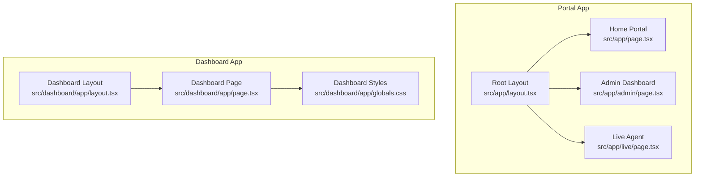
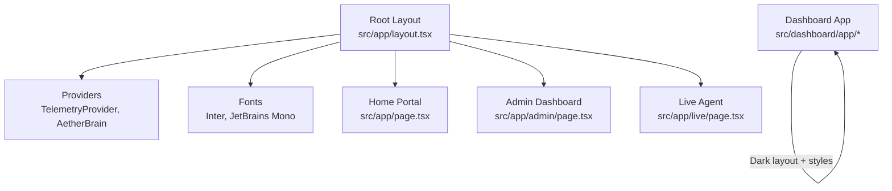
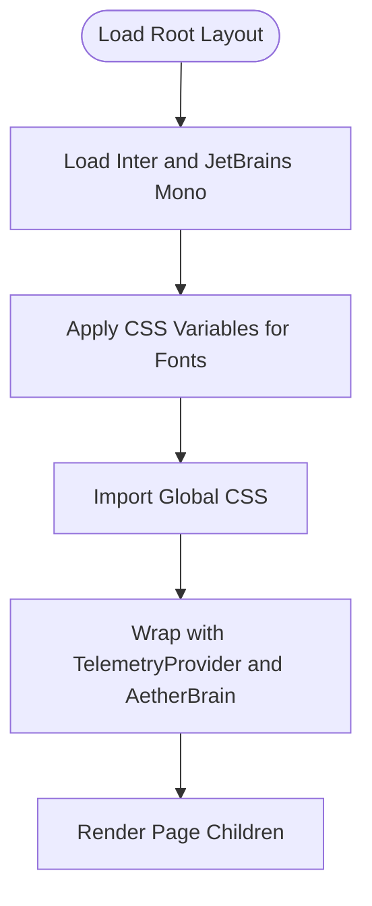
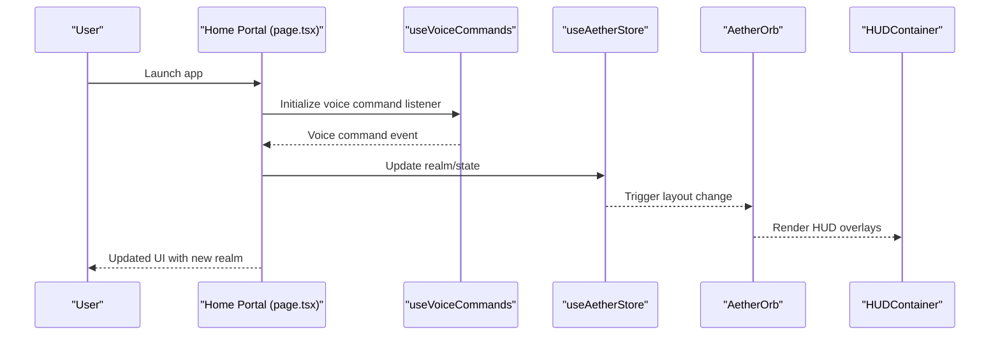
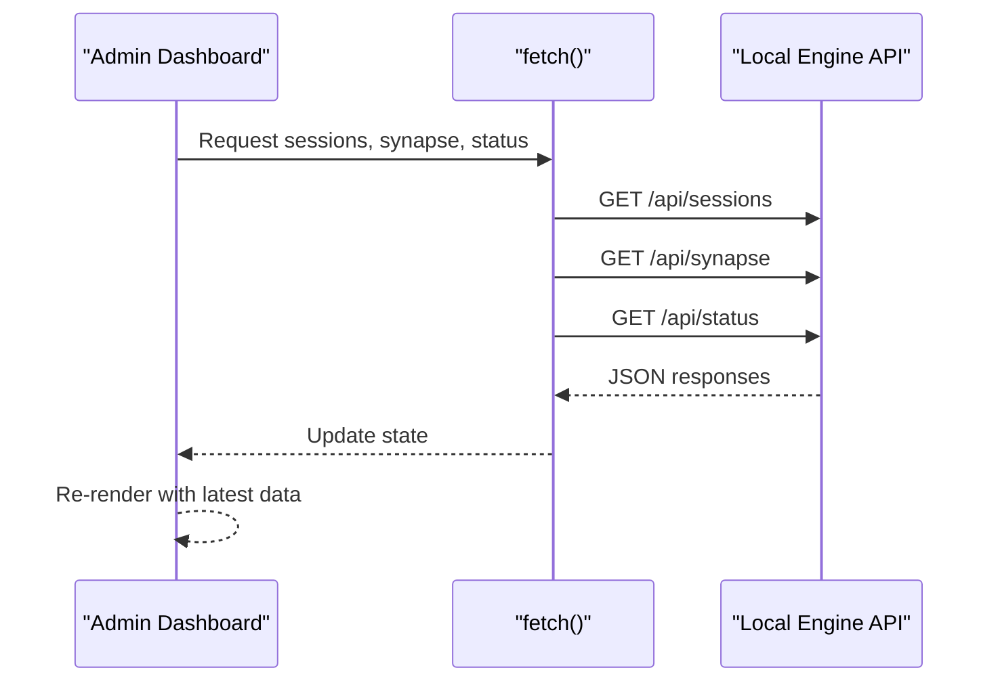
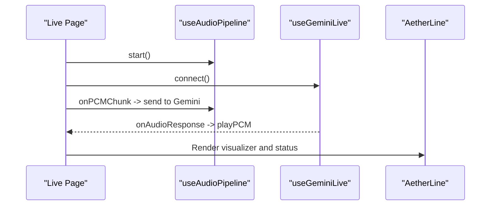
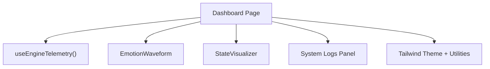
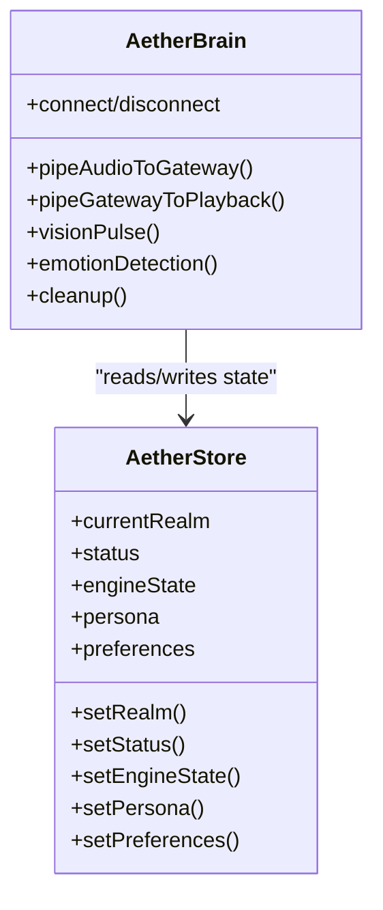

# Next.js Application Structure

<cite>
**Referenced Files in This Document**
- [package.json](file://apps/portal/package.json)
- [next.config.ts](file://apps/portal/next.config.ts)
- [tsconfig.json](file://apps/portal/tsconfig.json)
- [next-env.d.ts](file://apps/portal/next-env.d.ts)
- [tailwind.config.ts](file://apps/portal/tailwind.config.ts)
- [postcss.config.mjs](file://apps/portal/postcss.config.mjs)
- [src/app/layout.tsx](file://apps/portal/src/app/layout.tsx)
- [src/app/page.tsx](file://apps/portal/src/app/page.tsx)
- [src/app/admin/page.tsx](file://apps/portal/src/app/admin/page.tsx)
- [src/app/live/page.tsx](file://apps/portal/src/app/live/page.tsx)
- [src/dashboard/app/layout.tsx](file://apps/portal/src/dashboard/app/layout.tsx)
- [src/dashboard/app/page.tsx](file://apps/portal/src/dashboard/app/page.tsx)
- [src/dashboard/app/globals.css](file://apps/portal/src/dashboard/app/globals.css)
- [src/components/AetherBrain.tsx](file://apps/portal/src/components/AetherBrain.tsx)
- [src/store/useAetherStore.ts](file://apps/portal/src/store/useAetherStore.ts)
</cite>

## Table of Contents
1. [Introduction](#introduction)
2. [Project Structure](#project-structure)
3. [Core Components](#core-components)
4. [Architecture Overview](#architecture-overview)
5. [Detailed Component Analysis](#detailed-component-analysis)
6. [Dependency Analysis](#dependency-analysis)
7. [Performance Considerations](#performance-considerations)
8. [Troubleshooting Guide](#troubleshooting-guide)
9. [Conclusion](#conclusion)
10. [Appendices](#appendices)

## Introduction
This document explains the Next.js application structure for the Aether Voice OS frontend. It covers root layout configuration, metadata settings, font loading, global CSS imports, routing for the main pages (home portal, admin dashboard, and live agent), application configuration (Next.js version, build settings, environment variables), project conventions, and practical guidance for extending the app with new pages, configuring SEO metadata, and managing global styles. It also includes performance optimization techniques and deployment considerations tailored to the Aether Voice OS frontend.

## Project Structure
The application follows Next.js App Router conventions with a strict file-based routing model under the src/app directory. The portal application is organized into:
- Root app shell with global layout, fonts, and providers
- Pages for the home portal, admin dashboard, and live agent
- A separate dashboard app with its own layout and styles
- Shared components, hooks, stores, and utilities



**Diagram sources**
- [src/app/layout.tsx](file://apps/portal/src/app/layout.tsx#L1-L58)
- [src/app/page.tsx](file://apps/portal/src/app/page.tsx#L1-L96)
- [src/app/admin/page.tsx](file://apps/portal/src/app/admin/page.tsx#L1-L201)
- [src/app/live/page.tsx](file://apps/portal/src/app/live/page.tsx#L1-L228)
- [src/dashboard/app/layout.tsx](file://apps/portal/src/dashboard/app/layout.tsx#L1-L35)
- [src/dashboard/app/page.tsx](file://apps/portal/src/dashboard/app/page.tsx#L1-L112)
- [src/dashboard/app/globals.css](file://apps/portal/src/dashboard/app/globals.css#L1-L52)

**Section sources**
- [src/app/layout.tsx](file://apps/portal/src/app/layout.tsx#L1-L58)
- [src/app/page.tsx](file://apps/portal/src/app/page.tsx#L1-L96)
- [src/app/admin/page.tsx](file://apps/portal/src/app/admin/page.tsx#L1-L201)
- [src/app/live/page.tsx](file://apps/portal/src/app/live/page.tsx#L1-L228)
- [src/dashboard/app/layout.tsx](file://apps/portal/src/dashboard/app/layout.tsx#L1-L35)
- [src/dashboard/app/page.tsx](file://apps/portal/src/dashboard/app/page.tsx#L1-L112)
- [src/dashboard/app/globals.css](file://apps/portal/src/dashboard/app/globals.css#L1-L52)

## Core Components
- Root layout and metadata: Defines global fonts, provider wrappers, and site-wide metadata.
- Home portal page: Single-page experience orchestrating realms and HUD.
- Admin dashboard: Real-time system telemetry and session monitoring.
- Live agent page: Fullscreen voice agent with audio pipeline and Gemini integration.
- Dashboard app: Dark-themed telemetry and state visualization.
- Global store: Centralized state for UI, telemetry, and agent configuration.
- AetherBrain: Orchestrates audio, vision, telemetry, and gateway connections.

Key configuration highlights:
- Next.js version and dependencies are defined in the package manifest.
- Build output is configured for static export with PWA support.
- Tailwind CSS is configured with a custom theme and content paths.
- TypeScript path mapping enables clean imports via @/.

**Section sources**
- [package.json](file://apps/portal/package.json#L1-L53)
- [next.config.ts](file://apps/portal/next.config.ts#L1-L16)
- [tailwind.config.ts](file://apps/portal/tailwind.config.ts#L1-L26)
- [tsconfig.json](file://apps/portal/tsconfig.json#L1-L42)
- [src/app/layout.tsx](file://apps/portal/src/app/layout.tsx#L1-L58)
- [src/store/useAetherStore.ts](file://apps/portal/src/store/useAetherStore.ts#L1-L440)
- [src/components/AetherBrain.tsx](file://apps/portal/src/components/AetherBrain.tsx#L1-L227)

## Architecture Overview
The application architecture centers around a root layout that injects providers and global fonts, and a set of pages that render distinct experiences. The home portal integrates a 3D orb and HUD with realm switching. The live agent page runs a continuous audio pipeline and interacts with the Gemini Live API via a gateway. The admin dashboard monitors system health and sessions. The dashboard app provides a dark-themed telemetry view.



**Diagram sources**
- [src/app/layout.tsx](file://apps/portal/src/app/layout.tsx#L1-L58)
- [src/app/page.tsx](file://apps/portal/src/app/page.tsx#L1-L96)
- [src/app/admin/page.tsx](file://apps/portal/src/app/admin/page.tsx#L1-L201)
- [src/app/live/page.tsx](file://apps/portal/src/app/live/page.tsx#L1-L228)
- [src/dashboard/app/layout.tsx](file://apps/portal/src/dashboard/app/layout.tsx#L1-L35)

## Detailed Component Analysis

### Root Layout and Metadata
- Font loading: Inter and JetBrains Mono are loaded via next/font/google and applied as CSS variables for responsive theming.
- Providers: TelemetryProvider wraps the app to enable telemetry collection and state synchronization.
- Global imports: A global CSS file is imported at the root level to apply base styles and theme tokens.
- Metadata: Site-wide metadata includes title, description, icons, Open Graph, and Twitter settings.



**Diagram sources**
- [src/app/layout.tsx](file://apps/portal/src/app/layout.tsx#L1-L58)

**Section sources**
- [src/app/layout.tsx](file://apps/portal/src/app/layout.tsx#L1-L58)

### Home Portal Page
- Purpose: Single-page voice portal with realm switching and HUD overlays.
- Behavior: Uses voice commands to navigate between realms, adjusts accent color and glow intensity dynamically, and renders background effects and HUD components.
- Dependencies: RealmController, AetherOrb, HUD components, and voice/command hooks.



**Diagram sources**
- [src/app/page.tsx](file://apps/portal/src/app/page.tsx#L1-L96)
- [src/store/useAetherStore.ts](file://apps/portal/src/store/useAetherStore.ts#L1-L440)

**Section sources**
- [src/app/page.tsx](file://apps/portal/src/app/page.tsx#L1-L96)
- [src/store/useAetherStore.ts](file://apps/portal/src/store/useAetherStore.ts#L1-L440)

### Admin Dashboard
- Purpose: Mission control and analytics for the Aether engine.
- Features: Real-time polling of sessions, synapse status, and engine status; formatted timestamps; animated lists; and status indicators.
- Data sources: Local engine endpoints polled at intervals.



**Diagram sources**
- [src/app/admin/page.tsx](file://apps/portal/src/app/admin/page.tsx#L1-L201)

**Section sources**
- [src/app/admin/page.tsx](file://apps/portal/src/app/admin/page.tsx#L1-L201)

### Live Agent Page
- Purpose: Fullscreen voice agent experience with automatic initialization and audio feedback.
- Behavior: Initializes audio pipeline and connects to Gemini; wires PCM chunks to audio output; displays status and visualizer.
- Dependencies: Audio pipeline and Gemini hooks.



**Diagram sources**
- [src/app/live/page.tsx](file://apps/portal/src/app/live/page.tsx#L1-L228)

**Section sources**
- [src/app/live/page.tsx](file://apps/portal/src/app/live/page.tsx#L1-L228)

### Dashboard App
- Purpose: Dark-themed telemetry and state visualization for the neural engine.
- Features: Emotion waveform, state machine visualization, logs panel, and safety overrides.
- Theming: Uses Tailwind theme tokens and custom utilities for glass panels and glow effects.



**Diagram sources**
- [src/dashboard/app/page.tsx](file://apps/portal/src/dashboard/app/page.tsx#L1-L112)
- [src/dashboard/app/layout.tsx](file://apps/portal/src/dashboard/app/layout.tsx#L1-L35)
- [src/dashboard/app/globals.css](file://apps/portal/src/dashboard/app/globals.css#L1-L52)

**Section sources**
- [src/dashboard/app/page.tsx](file://apps/portal/src/dashboard/app/page.tsx#L1-L112)
- [src/dashboard/app/layout.tsx](file://apps/portal/src/dashboard/app/layout.tsx#L1-L35)
- [src/dashboard/app/globals.css](file://apps/portal/src/dashboard/app/globals.css#L1-L52)

### Global Store and Brain
- Store: Centralized state for realms, connection status, telemetry, persona, and preferences with persistence.
- Brain: Orchestrates audio capture, VAD gating, gateway communication, vision pulses, emotion detection, and telemetry updates.



**Diagram sources**
- [src/store/useAetherStore.ts](file://apps/portal/src/store/useAetherStore.ts#L1-L440)
- [src/components/AetherBrain.tsx](file://apps/portal/src/components/AetherBrain.tsx#L1-L227)

**Section sources**
- [src/store/useAetherStore.ts](file://apps/portal/src/store/useAetherStore.ts#L1-L440)
- [src/components/AetherBrain.tsx](file://apps/portal/src/components/AetherBrain.tsx#L1-L227)

## Dependency Analysis
- Next.js version and related packages are pinned in the package manifest.
- PWA plugin is configured with output export and development guard.
- Tailwind is configured with PostCSS and content globs targeting app, components, and pages.
- TypeScript path mapping simplifies imports via @/.

```mermaid
graph LR
Pkg["package.json"] --> Next["next@16.1.6"]
Pkg --> PWA["@ducanh2912/next-pwa"]
Pkg --> UI["@react-three/fiber", "framer-motion", "lucide-react"]
NextCfg["next.config.ts"] --> PWA
TS["tsconfig.json"] --> Paths["@/*"]
Tailwind["tailwind.config.ts"] --> Content["content globs"]
PostCSS["postcss.config.mjs"] --> Tailwind
```

**Diagram sources**
- [package.json](file://apps/portal/package.json#L1-L53)
- [next.config.ts](file://apps/portal/next.config.ts#L1-L16)
- [tsconfig.json](file://apps/portal/tsconfig.json#L1-L42)
- [tailwind.config.ts](file://apps/portal/tailwind.config.ts#L1-L26)
- [postcss.config.mjs](file://apps/portal/postcss.config.mjs#L1-L6)

**Section sources**
- [package.json](file://apps/portal/package.json#L1-L53)
- [next.config.ts](file://apps/portal/next.config.ts#L1-L16)
- [tsconfig.json](file://apps/portal/tsconfig.json#L1-L42)
- [tailwind.config.ts](file://apps/portal/tailwind.config.ts#L1-L26)
- [postcss.config.mjs](file://apps/portal/postcss.config.mjs#L1-L6)

## Performance Considerations
- Static export: The build targets static export, enabling fast cold starts and CDN-friendly deployments.
- PWA caching: Progressive Web App configuration improves offline readiness and reduces load times.
- Client-side VAD gating: Reduces unnecessary API calls by filtering silence in the audio pipeline.
- Emotion-triggered priority vision: Injects context-sensitive data only when user frustration is detected, optimizing bandwidth and responsiveness.
- Tailwind utilities: Prefer utility classes to minimize custom CSS and leverage JIT compilation.
- Hydration guards: Prevent hydration mismatches in dashboard components.

[No sources needed since this section provides general guidance]

## Troubleshooting Guide
- Missing environment variables: Ensure NODE_ENV and any runtime environment variables are set appropriately for development vs production.
- PWA registration: Verify service worker registration and export output in production builds.
- Hydration warnings: Confirm client directives and hydration guards in dashboard components.
- Audio permissions: Confirm microphone access and proper error handling in the audio pipeline.
- Gateway connectivity: Monitor gateway status and logs to diagnose connection issues.

**Section sources**
- [next.config.ts](file://apps/portal/next.config.ts#L1-L16)
- [src/dashboard/app/page.tsx](file://apps/portal/src/dashboard/app/page.tsx#L1-L112)
- [src/components/AetherBrain.tsx](file://apps/portal/src/components/AetherBrain.tsx#L1-L227)

## Conclusion
The Aether Voice OS frontend leverages Next.js App Router to deliver a modular, performance-conscious voice-first experience. The root layout centralizes fonts, providers, and metadata, while distinct pages serve specialized roles. The global store and brain orchestrate complex audio, vision, and telemetry flows. With static export and PWA support, the application is optimized for rapid delivery and resilient operation.

[No sources needed since this section summarizes without analyzing specific files]

## Appendices

### Adding a New Page
- Create a new route segment under src/app/<route>/page.tsx.
- Optionally add a layout.tsx in the same directory to inherit providers and metadata.
- Import and render components as needed; use the global store for state and telemetry.

**Section sources**
- [src/app/layout.tsx](file://apps/portal/src/app/layout.tsx#L1-L58)
- [src/app/page.tsx](file://apps/portal/src/app/page.tsx#L1-L96)

### Configuring SEO Metadata
- Define metadata in the root layout or per-route layout.
- Include title, description, icons, Open Graph, and Twitter settings for social previews.

**Section sources**
- [src/app/layout.tsx](file://apps/portal/src/app/layout.tsx#L19-L40)

### Managing Application-Wide Styles
- Import global CSS in the root layout.
- Extend Tailwind theme tokens and utilities for consistent design.
- Use CSS variables for dynamic theming (e.g., accent colors and glow intensity).

**Section sources**
- [src/app/layout.tsx](file://apps/portal/src/app/layout.tsx#L5-L5)
- [src/dashboard/app/globals.css](file://apps/portal/src/dashboard/app/globals.css#L1-L52)
- [tailwind.config.ts](file://apps/portal/tailwind.config.ts#L8-L22)

### Deployment Considerations
- Build output is configured for static export; ensure hosting supports SPA fallbacks.
- PWA registration is disabled in development; verify service worker behavior in production.
- Environment variables should be set for production runtime behavior.

**Section sources**
- [next.config.ts](file://apps/portal/next.config.ts#L10-L13)
- [package.json](file://apps/portal/package.json#L5-L14)