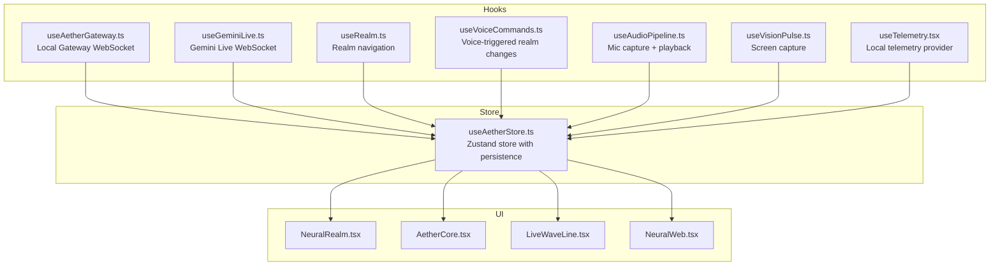
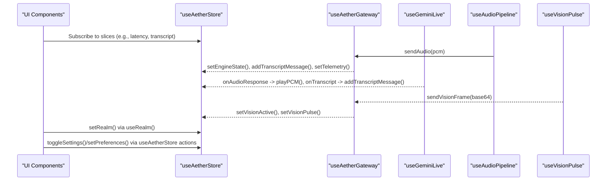
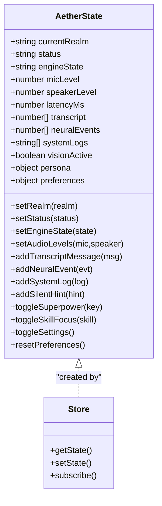
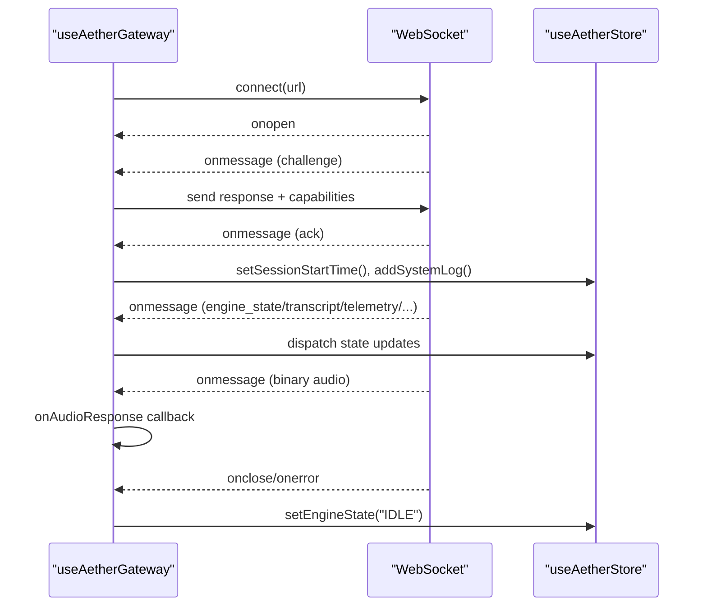
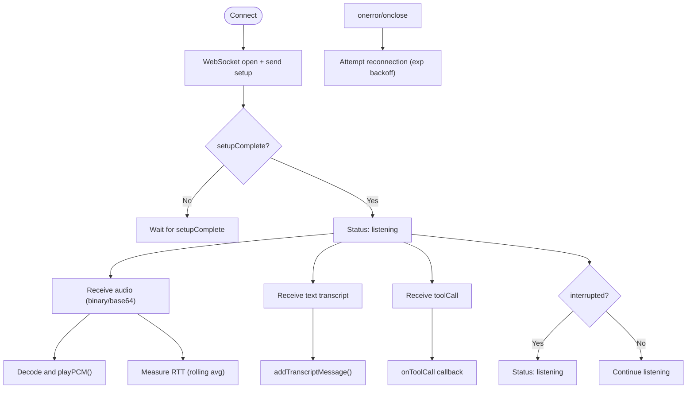
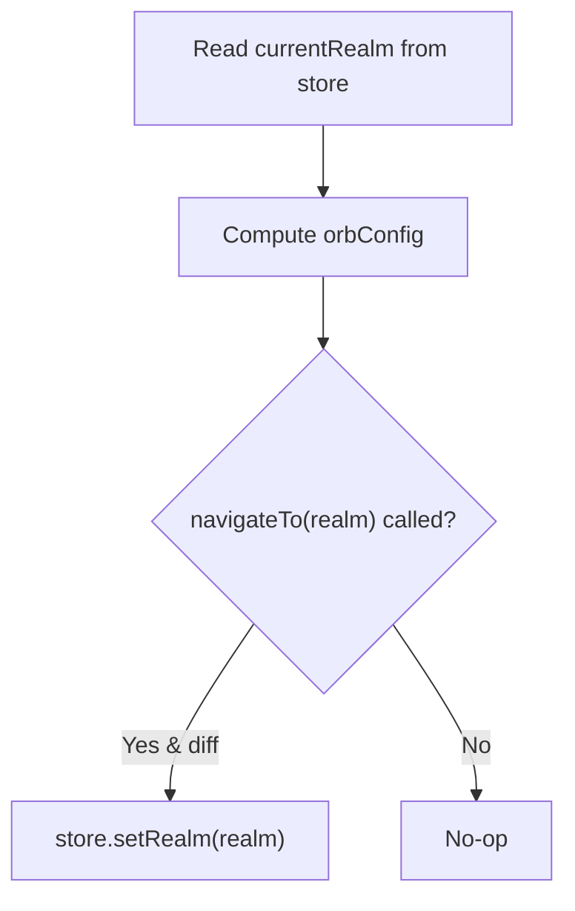
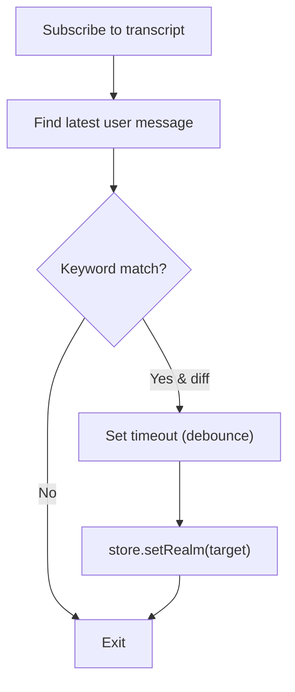
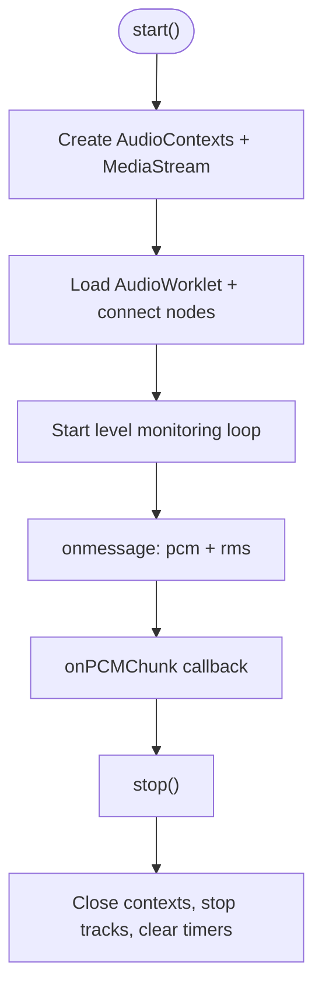
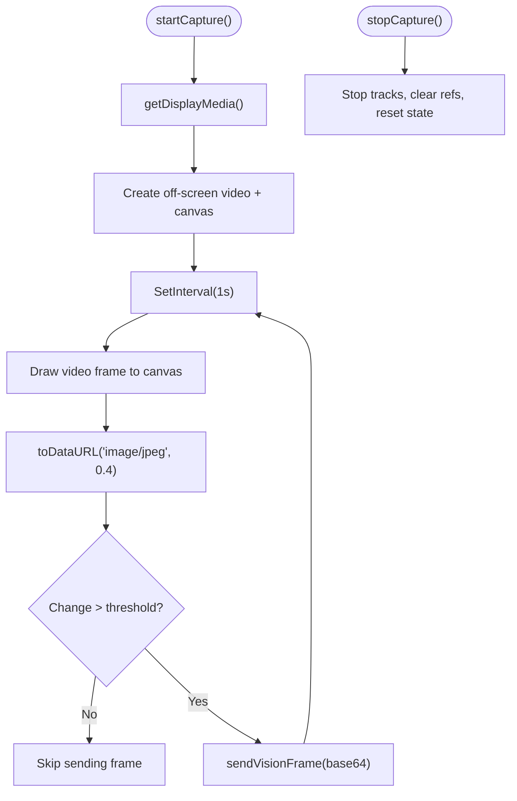
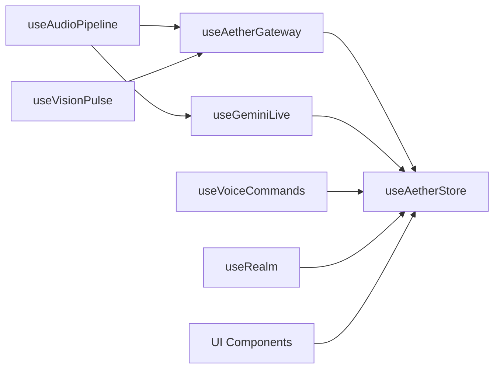

# State Management and Hooks

<cite>
**Referenced Files in This Document**
- [useAetherStore.ts](file://apps/portal/src/store/useAetherStore.ts)
- [useAetherGateway.ts](file://apps/portal/src/hooks/useAetherGateway.ts)
- [useGeminiLive.ts](file://apps/portal/src/hooks/useGeminiLive.ts)
- [useRealm.ts](file://apps/portal/src/hooks/useRealm.ts)
- [useVoiceCommands.ts](file://apps/portal/src/hooks/useVoiceCommands.ts)
- [useEngineTelemetry.ts](file://apps/portal/src/hooks/useEngineTelemetry.ts)
- [useAudioPipeline.ts](file://apps/portal/src/hooks/useAudioPipeline.ts)
- [useVisionPulse.ts](file://apps/portal/src/hooks/useVisionPulse.ts)
- [useTelemetry.tsx](file://apps/portal/src/hooks/useTelemetry.tsx)
- [useAetherStore.test.ts](file://apps/portal/src/__tests__/useAetherStore.test.ts)
- [geminiLive.integration.test.ts](file://apps/portal/src/__tests__/geminiLive.integration.test.ts)
- [NeuralRealm.tsx](file://apps/portal/src/components/realms/NeuralRealm.tsx)
- [AetherCore.tsx](file://apps/portal/src/components/AetherCore.tsx)
- [LiveWaveLine.tsx](file://apps/portal/src/components/LiveWaveLine.tsx)
- [NeuralWeb.tsx](file://apps/portal/src/components/NeuralWeb.tsx)
- [frontend_os.md](file://docs/frontend_os.md)
</cite>

## Table of Contents
1. [Introduction](#introduction)
2. [Project Structure](#project-structure)
3. [Core Components](#core-components)
4. [Architecture Overview](#architecture-overview)
5. [Detailed Component Analysis](#detailed-component-analysis)
6. [Dependency Analysis](#dependency-analysis)
7. [Performance Considerations](#performance-considerations)
8. [Troubleshooting Guide](#troubleshooting-guide)
9. [Conclusion](#conclusion)
10. [Appendices](#appendices)

## Introduction
This document explains the state management system and custom hooks that power the Aether Live Agent frontend. The system centers on a single global store built with Zustand for reactive UI updates, and a suite of hooks that encapsulate networking, audio, vision, and UI state transitions. It covers:
- Global state shape and persistence
- Hook ecosystems for WebSocket communication, AI sessions, realm navigation, voice commands, telemetry, audio pipeline, and vision capture
- State synchronization patterns, subscriptions, and performance optimizations
- Examples of hook composition, state persistence, error handling, and memory management
- Guidance for extending the system with new features

## Project Structure
The state and hooks live under the portal application’s frontend:
- Global store: apps/portal/src/store/useAetherStore.ts
- Hooks: apps/portal/src/hooks/*
- UI components that consume the store: apps/portal/src/components/*

**Diagram sources**
- [useAetherStore.ts](file://apps/portal/src/store/useAetherStore.ts#L289-L440)
- [useAetherGateway.ts](file://apps/portal/src/hooks/useAetherGateway.ts#L69-L299)
- [useGeminiLive.ts](file://apps/portal/src/hooks/useGeminiLive.ts#L65-L485)
- [useRealm.ts](file://apps/portal/src/hooks/useRealm.ts#L37-L59)
- [useVoiceCommands.ts](file://apps/portal/src/hooks/useVoiceCommands.ts#L28-L61)
- [useAudioPipeline.ts](file://apps/portal/src/hooks/useAudioPipeline.ts#L27-L248)
- [useVisionPulse.ts](file://apps/portal/src/hooks/useVisionPulse.ts#L45-L226)
- [useTelemetry.tsx](file://apps/portal/src/hooks/useTelemetry.tsx#L24-L54)
- [NeuralRealm.tsx](file://apps/portal/src/components/realms/NeuralRealm.tsx#L115-L128)
- [AetherCore.tsx](file://apps/portal/src/components/AetherCore.tsx#L1-L32)
- [LiveWaveLine.tsx](file://apps/portal/src/components/LiveWaveLine.tsx#L43-L130)
- [NeuralWeb.tsx](file://apps/portal/src/components/NeuralWeb.tsx#L41-L127)

**Section sources**
- [frontend_os.md](file://docs/frontend_os.md#L1-L66)

## Core Components
- Global store (Zustand):
  - Provides strongly typed state for connection, engine state, audio telemetry, transcripts, neural events, system logs, persona/preferences, and multi-agent context.
  - Persists user preferences to storage while keeping the rest of state in-memory.
  - Exposes actions to mutate state and maintain bounded lists (e.g., logs, hints).
- Hook ecosystem:
  - useAetherGateway: Local gateway WebSocket with Ed25519 handshake, binary audio routing, and broadcast event ingestion.
  - useGeminiLive: Remote Gemini Live WebSocket with tool calls, barge-in, and latency tracking.
  - useRealm: Realm selection and navigation with orbital positioning.
  - useVoiceCommands: Voice-triggered realm transitions with debouncing.
  - useAudioPipeline: Browser audio I/O with gapless playback and real-time level meters.
  - useVisionPulse: Screen capture at 1 FPS with change detection and compression.
  - useTelemetry: Local telemetry provider for UI logs.

**Section sources**
- [useAetherStore.ts](file://apps/portal/src/store/useAetherStore.ts#L202-L286)
- [useAetherStore.ts](file://apps/portal/src/store/useAetherStore.ts#L289-L440)
- [useAetherGateway.ts](file://apps/portal/src/hooks/useAetherGateway.ts#L69-L299)
- [useGeminiLive.ts](file://apps/portal/src/hooks/useGeminiLive.ts#L65-L485)
- [useRealm.ts](file://apps/portal/src/hooks/useRealm.ts#L37-L59)
- [useVoiceCommands.ts](file://apps/portal/src/hooks/useVoiceCommands.ts#L28-L61)
- [useAudioPipeline.ts](file://apps/portal/src/hooks/useAudioPipeline.ts#L27-L248)
- [useVisionPulse.ts](file://apps/portal/src/hooks/useVisionPulse.ts#L45-L226)
- [useTelemetry.tsx](file://apps/portal/src/hooks/useTelemetry.tsx#L24-L54)

## Architecture Overview
The frontend uses a hybrid architecture:
- Zustand store as the single source of truth for reactive UI.
- Two WebSocket pathways:
  - Local gateway (secure, binary audio, backend broadcasts).
  - Gemini Live (cloud multimodal audio/vision, tool calls).
- UI components subscribe to store slices for rendering and reactive visuals.

**Diagram sources**
- [useAetherStore.ts](file://apps/portal/src/store/useAetherStore.ts#L289-L440)
- [useAetherGateway.ts](file://apps/portal/src/hooks/useAetherGateway.ts#L77-L299)
- [useGeminiLive.ts](file://apps/portal/src/hooks/useGeminiLive.ts#L90-L485)
- [useAudioPipeline.ts](file://apps/portal/src/hooks/useAudioPipeline.ts#L168-L247)
- [useVisionPulse.ts](file://apps/portal/src/hooks/useVisionPulse.ts#L179-L226)

## Detailed Component Analysis

### useAetherStore: Global Zustand Store
- Purpose: Centralized reactive state for connection, engine state, audio telemetry, transcripts, neural events, system logs, persona, preferences, and multi-agent context.
- Persistence: Only user preferences are persisted; other state remains in-memory.
- Notable actions:
  - Connection/engine state transitions
  - Audio levels and latency updates
  - Transcript, neural events, system logs, silent hints management
  - Multi-agent tool call history
  - Persona and preferences toggles and resets

**Diagram sources**
- [useAetherStore.ts](file://apps/portal/src/store/useAetherStore.ts#L202-L286)
- [useAetherStore.ts](file://apps/portal/src/store/useAetherStore.ts#L289-L440)

**Section sources**
- [useAetherStore.ts](file://apps/portal/src/store/useAetherStore.ts#L202-L286)
- [useAetherStore.ts](file://apps/portal/src/store/useAetherStore.ts#L289-L440)
- [useAetherStore.test.ts](file://apps/portal/src/__tests__/useAetherStore.test.ts#L1-L205)

### useAetherGateway: Local Gateway WebSocket
- Responsibilities:
  - Secure handshake using Ed25519 (challenge-response) with persistent keypair storage.
  - Binary PCM streaming and audio response callbacks.
  - Heartbeat/tick synchronization and latency measurement.
  - Broadcast ingestion: engine_state, transcript, affective/audio telemetry, neural events, vision pulses, tool results, soul handoffs, and repair state.
- Patterns:
  - Uses callback refs to wire audio responses without causing extra re-renders.
  - Updates Zustand state for UI and telemetry.
  - Graceful error handling and disconnection cleanup.

**Diagram sources**
- [useAetherGateway.ts](file://apps/portal/src/hooks/useAetherGateway.ts#L77-L299)
- [useAetherStore.ts](file://apps/portal/src/store/useAetherStore.ts#L336-L344)

**Section sources**
- [useAetherGateway.ts](file://apps/portal/src/hooks/useAetherGateway.ts#L69-L299)

### useGeminiLive: Gemini Live WebSocket
- Responsibilities:
  - Connects to Gemini’s multimodal live API with model configuration and tool declarations.
  - Streams PCM audio and extracts text transcripts.
  - Handles tool calls and responds with tool results.
  - Implements barge-in detection and rolling latency averaging.
  - Auto-reconnection with exponential backoff.
- Patterns:
  - Uses callback refs to avoid unnecessary re-renders.
  - Encodes PCM chunks to base64 in chunks to avoid stack overflow.
  - Tracks waitingForResponse and measures RTT for latency.

**Diagram sources**
- [useGeminiLive.ts](file://apps/portal/src/hooks/useGeminiLive.ts#L90-L485)

**Section sources**
- [useGeminiLive.ts](file://apps/portal/src/hooks/useGeminiLive.ts#L65-L485)
- [geminiLive.integration.test.ts](file://apps/portal/src/__tests__/geminiLive.integration.test.ts#L1-L263)

### useRealm: Realm Navigation
- Responsibilities:
  - Provides current realm and navigation helper to switch realms.
  - Supplies orbital configuration (size, position, glow) per realm.
- Pattern:
  - Reads current realm from store and delegates navigation to a setter action.

**Diagram sources**
- [useRealm.ts](file://apps/portal/src/hooks/useRealm.ts#L37-L59)
- [useAetherStore.ts](file://apps/portal/src/store/useAetherStore.ts#L324-L326)

**Section sources**
- [useRealm.ts](file://apps/portal/src/hooks/useRealm.ts#L37-L59)

### useVoiceCommands: Voice-Triggered Navigation
- Responsibilities:
  - Watches the latest user transcript and matches keywords to trigger realm transitions.
  - Debounces rapid switches to avoid oscillation.
- Pattern:
  - Subscribes to transcript and current realm; uses a ref to track last processed message and a timer for debounce.

**Diagram sources**
- [useVoiceCommands.ts](file://apps/portal/src/hooks/useVoiceCommands.ts#L28-L61)

**Section sources**
- [useVoiceCommands.ts](file://apps/portal/src/hooks/useVoiceCommands.ts#L28-L61)

### useEngineTelemetry: Deprecated Telemetry Hook
- Status: Deprecated. All telemetry now flows through the gateway hook.
- Behavior: No-op stub with warnings.

**Section sources**
- [useEngineTelemetry.ts](file://apps/portal/src/hooks/useEngineTelemetry.ts#L21-L33)

### useAudioPipeline: Browser Audio I/O
- Responsibilities:
  - Captures microphone at 16 kHz via AudioWorklet and encodes PCM.
  - Plays audio back with gapless scheduling to prevent barge-in artifacts.
  - Computes real-time RMS and speaker energy levels.
- Patterns:
  - Uses separate audio contexts for capture and playback.
  - Tracks active sources and stops them instantly for barge-in.
  - Cleans up resources on unmount.

**Diagram sources**
- [useAudioPipeline.ts](file://apps/portal/src/hooks/useAudioPipeline.ts#L48-L161)
- [useAudioPipeline.ts](file://apps/portal/src/hooks/useAudioPipeline.ts#L168-L247)

**Section sources**
- [useAudioPipeline.ts](file://apps/portal/src/hooks/useAudioPipeline.ts#L27-L248)

### useVisionPulse: Screen Capture
- Responsibilities:
  - Captures screen at 1 FPS using getDisplayMedia.
  - Renders frames to an off-screen canvas and compresses to JPEG.
  - Applies change detection to skip near-identical frames.
  - Starts/stops capture and cleans up all resources.
- Patterns:
  - Off-screen video and canvas to avoid DOM manipulation.
  - Interval-based capture with throttling.

**Diagram sources**
- [useVisionPulse.ts](file://apps/portal/src/hooks/useVisionPulse.ts#L122-L208)

**Section sources**
- [useVisionPulse.ts](file://apps/portal/src/hooks/useVisionPulse.ts#L45-L226)

### useTelemetry: Local Telemetry Provider
- Responsibilities:
  - Provides a context for UI telemetry logs with addLog and clearLogs.
  - Maintains a capped list of recent logs.
- Pattern:
  - Context provider with local state; consumers use a custom hook to access.

**Section sources**
- [useTelemetry.tsx](file://apps/portal/src/hooks/useTelemetry.tsx#L24-L54)

## Dependency Analysis
- Store dependencies:
  - UI components depend on store slices for rendering.
  - Hooks write to the store to reflect external events (gateway, Gemini, audio pipeline, vision).
- Hook interdependencies:
  - useAudioPipeline feeds PCM to useAetherGateway or useGeminiLive.
  - useVisionPulse feeds frames to useAetherGateway.
  - useVoiceCommands triggers realm changes that UI reacts to.
- External integrations:
  - Local gateway (Python backend) via WebSocket.
  - Gemini Live API via WebSocket.

**Diagram sources**
- [useAetherGateway.ts](file://apps/portal/src/hooks/useAetherGateway.ts#L69-L299)
- [useGeminiLive.ts](file://apps/portal/src/hooks/useGeminiLive.ts#L65-L485)
- [useAudioPipeline.ts](file://apps/portal/src/hooks/useAudioPipeline.ts#L27-L248)
- [useVisionPulse.ts](file://apps/portal/src/hooks/useVisionPulse.ts#L45-L226)
- [useAetherStore.ts](file://apps/portal/src/store/useAetherStore.ts#L289-L440)

**Section sources**
- [useAetherGateway.ts](file://apps/portal/src/hooks/useAetherGateway.ts#L69-L299)
- [useGeminiLive.ts](file://apps/portal/src/hooks/useGeminiLive.ts#L65-L485)
- [useAudioPipeline.ts](file://apps/portal/src/hooks/useAudioPipeline.ts#L27-L248)
- [useVisionPulse.ts](file://apps/portal/src/hooks/useVisionPulse.ts#L45-L226)
- [useAetherStore.ts](file://apps/portal/src/store/useAetherStore.ts#L289-L440)

## Performance Considerations
- Subscription patterns:
  - Prefer slice selectors to minimize re-renders (e.g., components subscribe to specific fields).
  - For transient updates that should not trigger re-renders, use getState() to mutate state directly (as demonstrated in tests).
- Memory management:
  - Hooks clean up intervals, timers, media tracks, and audio contexts on unmount.
  - Store actions cap arrays (e.g., logs, hints) to bounded sizes.
- Audio encoding:
  - PCM chunks are encoded in fixed-size chunks to avoid stack overflow.
- Rendering:
  - UI components compute derived values efficiently and avoid unnecessary recomputation.
- Backpressure and reconnection:
  - Gemini hook implements exponential backoff and barge-in detection to reduce latency and improve responsiveness.

[No sources needed since this section provides general guidance]

## Troubleshooting Guide
- Gateway handshake failures:
  - Verify Ed25519 keypair initialization and challenge-response flow.
  - Confirm backend is reachable and port is correct.
- Audio pipeline errors:
  - Check microphone permissions and device availability.
  - Ensure AudioWorklet module loads and contexts resume.
- Vision capture issues:
  - Confirm screen sharing permissions and browser support.
  - Validate change detection thresholds and compression quality.
- Store state anomalies:
  - Use unit tests to validate actions (e.g., transcript addition, log capping, hint limits).
- Telemetry deprecation:
  - Replace useEngineTelemetry with useAetherGateway for all telemetry needs.

**Section sources**
- [useAetherGateway.ts](file://apps/portal/src/hooks/useAetherGateway.ts#L77-L126)
- [useAudioPipeline.ts](file://apps/portal/src/hooks/useAudioPipeline.ts#L130-L134)
- [useVisionPulse.ts](file://apps/portal/src/hooks/useVisionPulse.ts#L169-L174)
- [useAetherStore.test.ts](file://apps/portal/src/__tests__/useAetherStore.test.ts#L162-L173)
- [useEngineTelemetry.ts](file://apps/portal/src/hooks/useEngineTelemetry.ts#L21-L33)

## Conclusion
The Aether frontend employs a robust, single-source-of-truth state management system centered on Zustand, complemented by specialized hooks for networking, audio, vision, and UI navigation. The design emphasizes:
- Clear separation of concerns
- Efficient subscription and mutation patterns
- Strong typing and persistence for user preferences
- Comprehensive error handling and resource cleanup
- Extensibility through modular hooks and store actions

## Appendices

### Hook Composition Examples
- Audio pipeline to gateway:
  - useAudioPipeline.onPCMChunk emits PCM → useAetherGateway.sendAudio forwards to backend.
- Vision to gateway:
  - useVisionPulse.latestFrame → useAetherGateway.sendVisionFrame.
- Gemini to UI:
  - useGeminiLive.onAudioResponse → playPCM → store.setAudioLevels.
- Voice commands to realm:
  - useVoiceCommands detects keyword → store.setRealm navigates UI.

**Section sources**
- [useAudioPipeline.ts](file://apps/portal/src/hooks/useAudioPipeline.ts#L104-L110)
- [useAetherGateway.ts](file://apps/portal/src/hooks/useAetherGateway.ts#L268-L282)
- [useVisionPulse.ts](file://apps/portal/src/hooks/useVisionPulse.ts#L161-L166)
- [useGeminiLive.ts](file://apps/portal/src/hooks/useGeminiLive.ts#L197-L203)
- [useVoiceCommands.ts](file://apps/portal/src/hooks/useVoiceCommands.ts#L48-L57)

### State Persistence and Defaults
- Persistence: Only user preferences are persisted; defaults are applied at initialization.
- Defaults: Persona, superpowers, and preferences have sensible defaults.

**Section sources**
- [useAetherStore.ts](file://apps/portal/src/store/useAetherStore.ts#L432-L438)
- [useAetherStore.ts](file://apps/portal/src/store/useAetherStore.ts#L153-L190)

### UI Bindings and Derived State
- Components subscribe to store slices for rendering:
  - NeuralRealm binds latency, transcripts, neural events, and affective stats.
  - AetherCore, LiveWaveLine, and NeuralWeb react to engine state and telemetry.

**Section sources**
- [NeuralRealm.tsx](file://apps/portal/src/components/realms/NeuralRealm.tsx#L115-L128)
- [AetherCore.tsx](file://apps/portal/src/components/AetherCore.tsx#L16-L22)
- [LiveWaveLine.tsx](file://apps/portal/src/components/LiveWaveLine.tsx#L43-L72)
- [NeuralWeb.tsx](file://apps/portal/src/components/NeuralWeb.tsx#L41-L60)