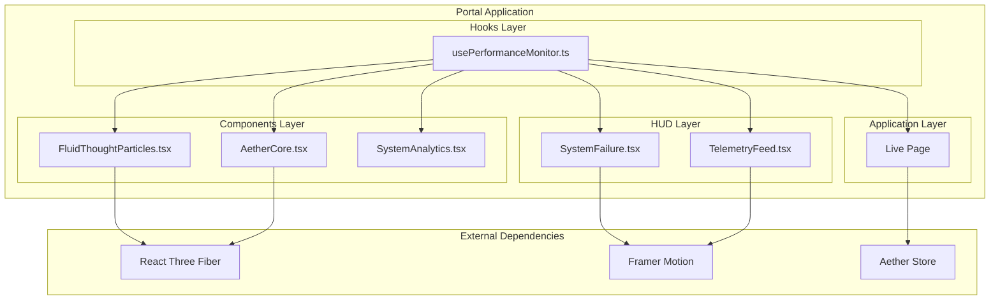
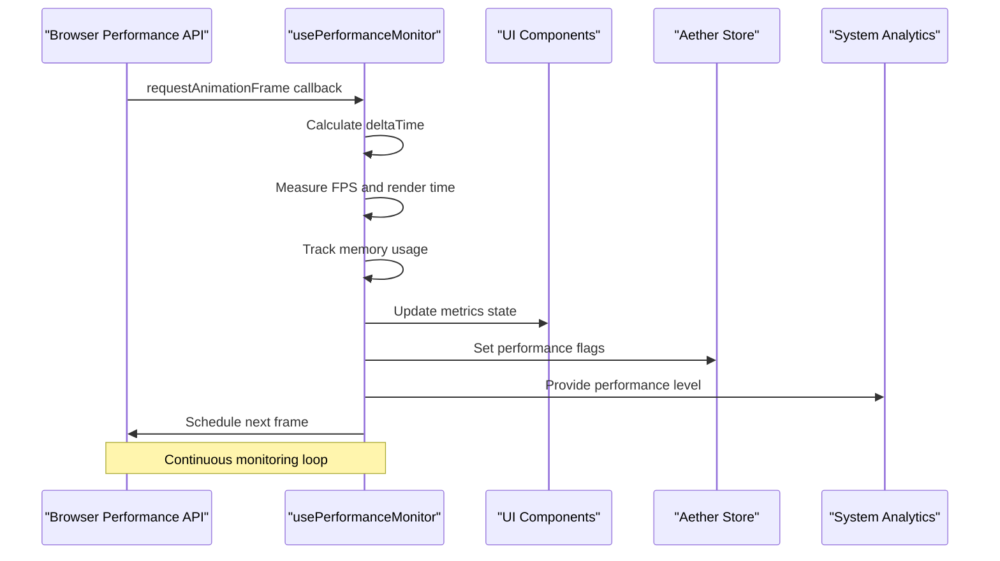
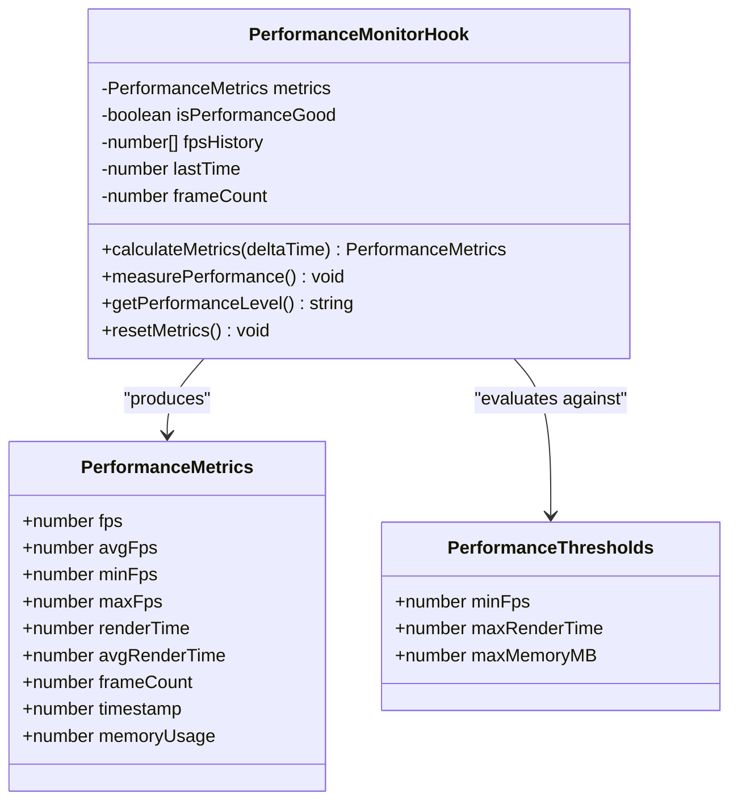
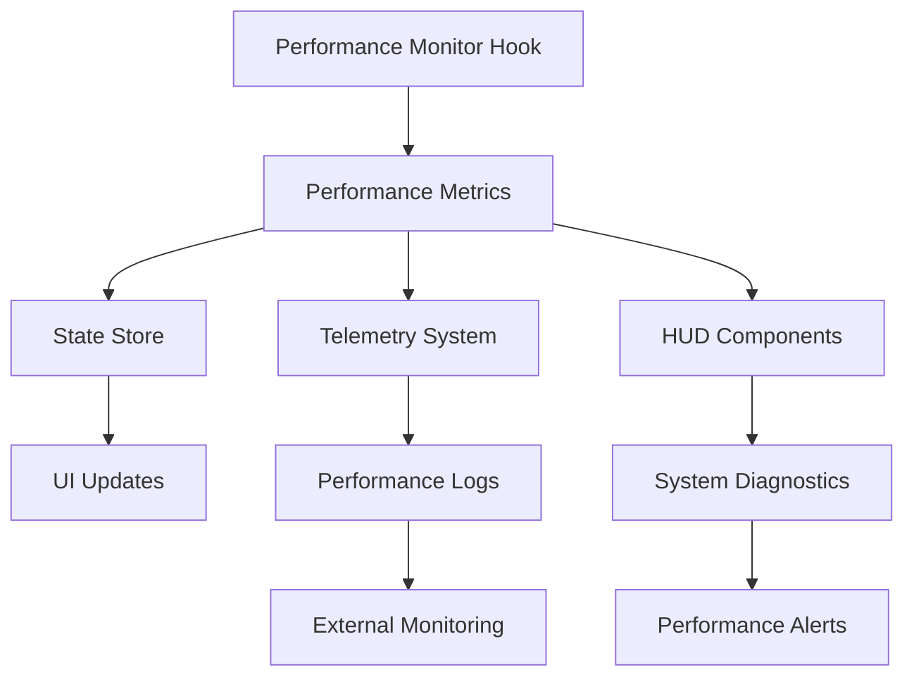
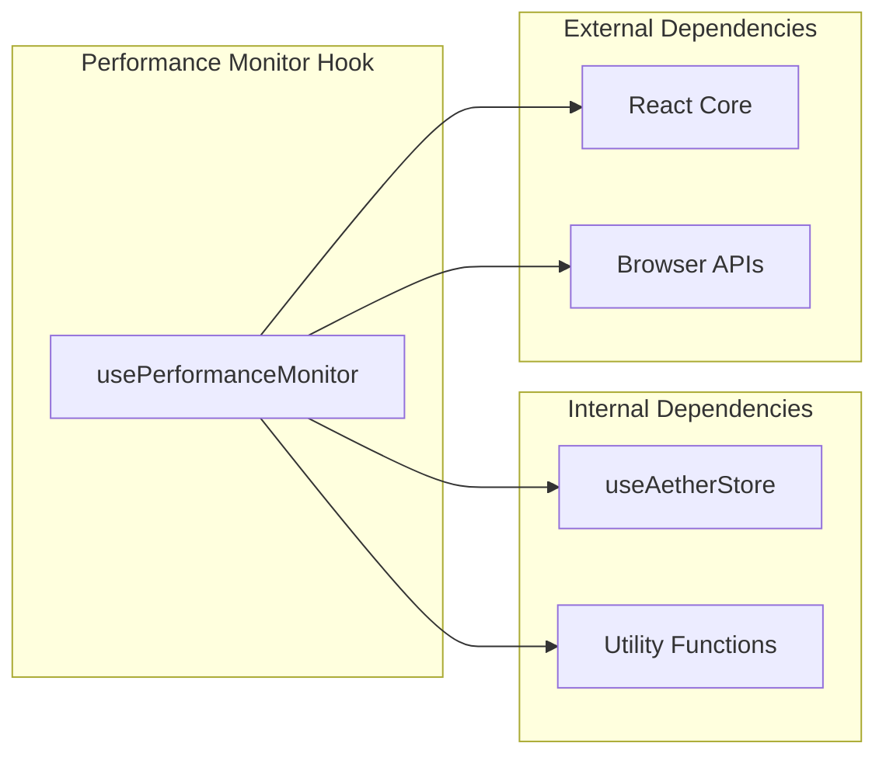

# Performance Monitor Hook

<cite>
**Referenced Files in This Document**
- [usePerformanceMonitor.ts](file://apps/portal/src/hooks/usePerformanceMonitor.ts)
- [FluidThoughtParticles.tsx](file://apps/portal/src/components/FluidThoughtParticles.tsx)
- [AetherCore.tsx](file://apps/portal/src/components/AetherCore.tsx)
- [SystemAnalytics.tsx](file://apps/portal/src/components/HUD/SystemAnalytics.tsx)
- [TelemetryFeed.tsx](file://apps/portal/src/components/TelemetryFeed.tsx)
- [useTelemetry.tsx](file://apps/portal/src/hooks/useTelemetry.tsx)
- [page.tsx](file://apps/portal/src/app/live/page.tsx)
</cite>

## Table of Contents
1. [Introduction](#introduction)
2. [Project Structure](#project-structure)
3. [Core Components](#core-components)
4. [Architecture Overview](#architecture-overview)
5. [Detailed Component Analysis](#detailed-component-analysis)
6. [Dependency Analysis](#dependency-analysis)
7. [Performance Considerations](#performance-considerations)
8. [Troubleshooting Guide](#troubleshooting-guide)
9. [Conclusion](#conclusion)

## Introduction

The Performance Monitor Hook is a sophisticated React hook designed to track and analyze real-time performance metrics for the Aether Live Agent application. This comprehensive monitoring solution provides developers and system administrators with critical insights into application performance, enabling proactive optimization and maintenance of the voice-enabled AI experience.

The hook monitors multiple performance indicators including frames per second (FPS), render times, memory usage, and provides configurable threshold-based performance assessment. It serves as a foundational component for maintaining optimal user experience in the complex 3D audio-visual environment of the Aether Voice Operating System.

## Project Structure

The Performance Monitor Hook is strategically positioned within the portal application's architecture, serving as a cross-cutting concern that integrates with various UI components and systems. The hook follows a modular design pattern, allowing selective activation and customization across different application contexts.

**Diagram sources**
- [usePerformanceMonitor.ts](file://apps/portal/src/hooks/usePerformanceMonitor.ts#L1-L163)
- [FluidThoughtParticles.tsx](file://apps/portal/src/components/FluidThoughtParticles.tsx#L1-L200)
- [AetherCore.tsx](file://apps/portal/src/components/AetherCore.tsx#L1-L128)

**Section sources**
- [usePerformanceMonitor.ts](file://apps/portal/src/hooks/usePerformanceMonitor.ts#L1-L163)
- [FluidThoughtParticles.tsx](file://apps/portal/src/components/FluidThoughtParticles.tsx#L1-L200)

## Core Components

The Performance Monitor Hook consists of several key components that work together to provide comprehensive performance monitoring:

### PerformanceMetrics Interface
Defines the structure for collected performance data, including instantaneous and averaged metrics across multiple time periods.

### PerformanceThresholds Configuration
Provides customizable performance criteria for determining system health and triggering alerts or optimizations.

### Real-time Monitoring Engine
Implements continuous performance measurement using browser performance APIs and requestAnimationFrame for precise timing measurements.

### Memory Usage Tracking
Monitors JavaScript heap usage through the Performance API, providing insights into memory consumption patterns during intensive audio processing.

**Section sources**
- [usePerformanceMonitor.ts](file://apps/portal/src/hooks/usePerformanceMonitor.ts#L13-L35)

## Architecture Overview

The Performance Monitor Hook operates as a centralized monitoring service that integrates seamlessly with the application's rendering pipeline and state management systems. Its architecture supports both passive monitoring and active performance optimization scenarios.

**Diagram sources**
- [usePerformanceMonitor.ts](file://apps/portal/src/hooks/usePerformanceMonitor.ts#L98-L118)

The hook's architecture ensures minimal performance impact while providing comprehensive monitoring capabilities. It leverages React's efficient state updates and integrates with the application's existing component hierarchy.

## Detailed Component Analysis

### usePerformanceMonitor Hook Implementation

The core hook implements a sophisticated performance monitoring system with the following key features:

#### Metric Collection Pipeline
The hook establishes a continuous measurement cycle using requestAnimationFrame callbacks to capture precise timing data. Each frame iteration calculates FPS, render times, and memory usage metrics.

#### Threshold-Based Performance Assessment
Configurable performance thresholds enable automatic detection of performance degradation. The system evaluates FPS against minimum thresholds, render times against maximum acceptable durations, and memory usage against configured limits.

#### Performance Level Classification
The hook provides granular performance classification ranging from "excellent" to "poor" based on comprehensive metric analysis, enabling targeted optimization strategies.

**Diagram sources**
- [usePerformanceMonitor.ts](file://apps/portal/src/hooks/usePerformanceMonitor.ts#L13-L54)

#### Memory Usage Monitoring
The hook implements optional memory usage tracking through the browser's Performance API, converting raw byte measurements to megabyte values for human-readable analysis. This feature is particularly valuable for detecting memory leaks during extended audio processing sessions.

#### Performance History Management
The implementation maintains rolling averages using a configurable sample window, enabling trend analysis and identification of performance degradation patterns over time.

**Section sources**
- [usePerformanceMonitor.ts](file://apps/portal/src/hooks/usePerformanceMonitor.ts#L62-L96)

### Component Integration Patterns

The Performance Monitor Hook integrates with multiple application components through well-defined interfaces:

#### FluidThoughtParticles Integration
The fluid particle system utilizes performance metrics to dynamically adjust particle count and complexity based on detected performance levels, ensuring smooth visual effects even under varying system loads.

#### AetherCore Integration
The 3D neural orb component responds to performance feedback by adjusting rendering complexity and animation intensity, maintaining visual fidelity while preventing system overload.

#### System Analytics Integration
Performance metrics feed into the holographic diagnostic displays, providing real-time visual feedback about system health and resource utilization.

**Section sources**
- [FluidThoughtParticles.tsx](file://apps/portal/src/components/FluidThoughtParticles.tsx#L1-L200)
- [AetherCore.tsx](file://apps/portal/src/components/AetherCore.tsx#L1-L128)
- [SystemAnalytics.tsx](file://apps/portal/src/components/HUD/SystemAnalytics.tsx#L1-L88)

### Telemetry and Logging Integration

The performance monitoring system integrates with the application's telemetry infrastructure, providing contextual performance data alongside operational logs and system events.

**Diagram sources**
- [usePerformanceMonitor.ts](file://apps/portal/src/hooks/usePerformanceMonitor.ts#L156-L162)
- [useTelemetry.tsx](file://apps/portal/src/hooks/useTelemetry.tsx#L24-L45)

**Section sources**
- [useTelemetry.tsx](file://apps/portal/src/hooks/useTelemetry.tsx#L1-L54)
- [TelemetryFeed.tsx](file://apps/portal/src/components/TelemetryFeed.tsx#L1-L58)

## Dependency Analysis

The Performance Monitor Hook exhibits minimal external dependencies while providing comprehensive monitoring capabilities through native browser APIs and React's built-in performance measurement tools.

**Diagram sources**
- [usePerformanceMonitor.ts](file://apps/portal/src/hooks/usePerformanceMonitor.ts#L11-L11)
- [FluidThoughtParticles.tsx](file://apps/portal/src/components/FluidThoughtParticles.tsx#L1-L200)

The hook's dependency profile ensures compatibility across different React environments while maintaining optimal performance characteristics. Its reliance on browser-native performance APIs eliminates the need for additional third-party dependencies.

**Section sources**
- [usePerformanceMonitor.ts](file://apps/portal/src/hooks/usePerformanceMonitor.ts#L1-L163)

## Performance Considerations

The Performance Monitor Hook is designed with several optimization strategies to minimize overhead while maximizing monitoring effectiveness:

### Efficient Timing Measurement
The hook utilizes requestAnimationFrame for precise timing measurements, reducing CPU overhead compared to setInterval or setTimeout approaches. This ensures accurate performance data collection with minimal impact on application responsiveness.

### Configurable Sampling Rate
The implementation supports adjustable monitoring intervals and sample sizes, allowing developers to balance accuracy against performance impact based on specific use case requirements.

### Memory-Efficient Data Structures
Performance metrics are stored using optimized array structures with automatic cleanup mechanisms, preventing memory accumulation during extended monitoring sessions.

### Conditional Monitoring
The hook supports runtime enable/disable functionality, allowing performance monitoring to be activated only when needed or during specific operational phases.

## Troubleshooting Guide

Common issues and solutions when working with the Performance Monitor Hook:

### Performance Degradation Detection
When performance metrics indicate degradation, the hook automatically sets performance flags that can trigger component-level optimizations or user notifications.

### Memory Leak Prevention
The monitoring system includes safeguards against memory accumulation through automatic cleanup of historical data and proper resource disposal during component unmounting.

### Integration Issues
When integrating with custom components, ensure proper initialization of the hook with appropriate threshold configurations and handle the returned metrics appropriately within component state management.

**Section sources**
- [usePerformanceMonitor.ts](file://apps/portal/src/hooks/usePerformanceMonitor.ts#L107-L118)
- [usePerformanceMonitor.ts](file://apps/portal/src/hooks/usePerformanceMonitor.ts#L126-L131)

## Conclusion

The Performance Monitor Hook represents a sophisticated approach to real-time performance monitoring in complex, resource-intensive applications. By providing comprehensive metrics collection, configurable threshold evaluation, and seamless integration with the application's component architecture, it enables proactive performance management and optimization.

The hook's design prioritizes both accuracy and efficiency, ensuring that monitoring activities themselves do not compromise the user experience. Its modular architecture and flexible configuration options make it adaptable to various performance monitoring scenarios while maintaining optimal resource utilization.

Through strategic integration with UI components, telemetry systems, and state management, the Performance Monitor Hook contributes significantly to the overall reliability and maintainability of the Aether Live Agent platform, supporting the demanding requirements of real-time audio-visual processing and AI-driven interactions.