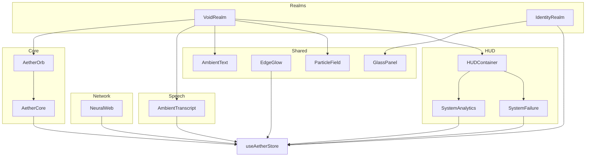
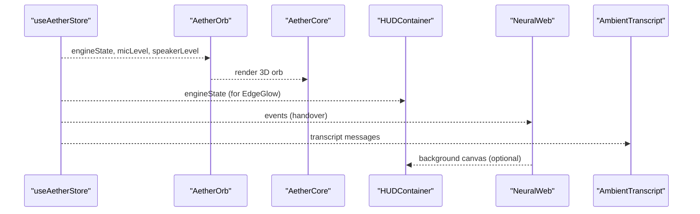
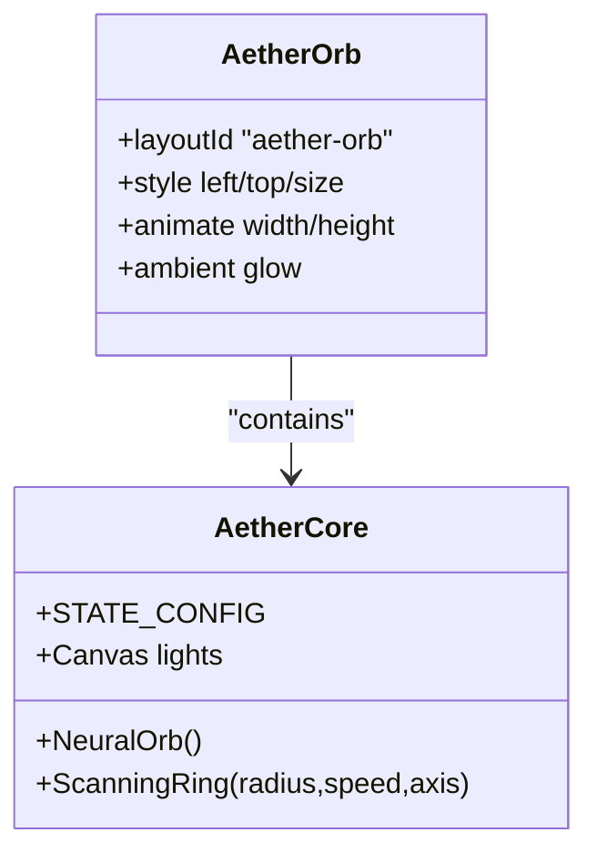
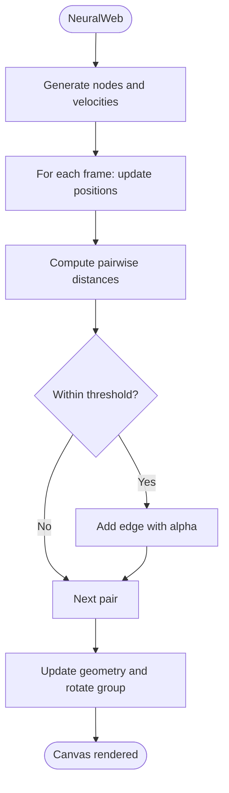
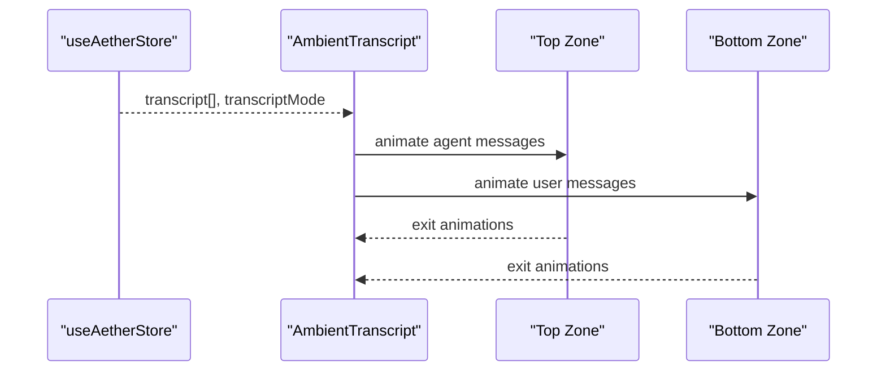
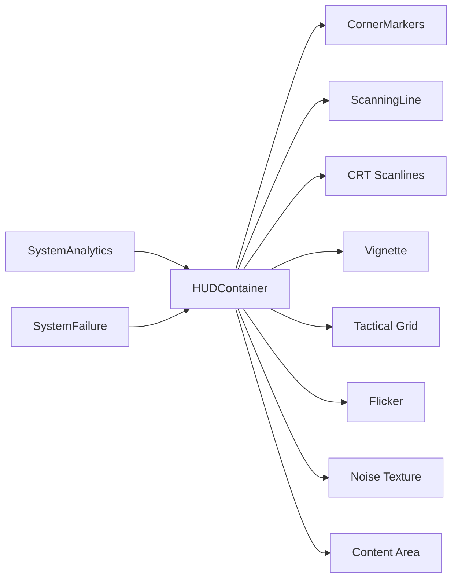
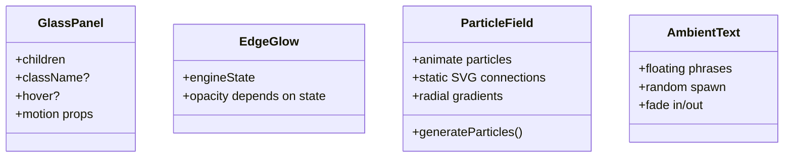
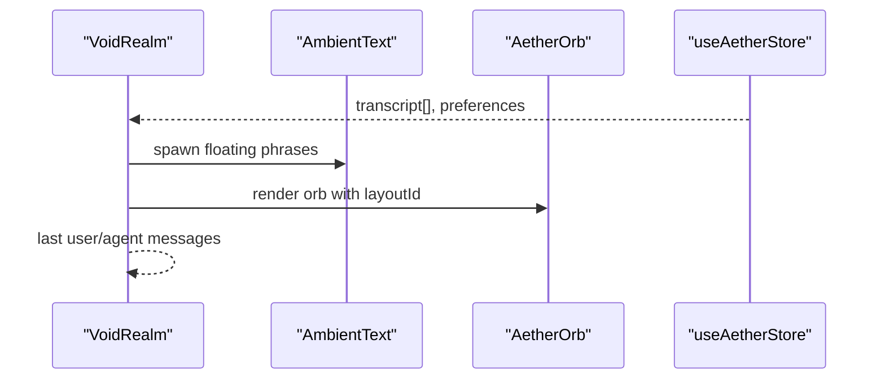
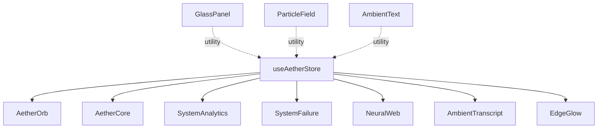

# Visual Interface Components

<cite>
**Referenced Files in This Document**
- [AetherOrb.tsx](file://apps/portal/src/components/core/AetherOrb.tsx)
- [AetherCore.tsx](file://apps/portal/src/components/AetherCore.tsx)
- [NeuralWeb.tsx](file://apps/portal/src/components/NeuralWeb.tsx)
- [AmbientTranscript.tsx](file://apps/portal/src/components/AmbientTranscript.tsx)
- [HUDContainer.tsx](file://apps/portal/src/components/HUD/HUDContainer.tsx)
- [SystemAnalytics.tsx](file://apps/portal/src/components/HUD/SystemAnalytics.tsx)
- [SystemFailure.tsx](file://apps/portal/src/components/HUD/SystemFailure.tsx)
- [GlassPanel.tsx](file://apps/portal/src/components/shared/GlassPanel.tsx)
- [EdgeGlow.tsx](file://apps/portal/src/components/shared/EdgeGlow.tsx)
- [ParticleField.tsx](file://apps/portal/src/components/shared/ParticleField.tsx)
- [AmbientText.tsx](file://apps/portal/src/components/shared/AmbientText.tsx)
- [VoidRealm.tsx](file://apps/portal/src/components/realms/VoidRealm.tsx)
- [IdentityRealm.tsx](file://apps/portal/src/components/realms/IdentityRealm.tsx)
- [useAetherStore.ts](file://apps/portal/src/store/useAetherStore.ts)
- [utils.ts](file://apps/portal/src/lib/utils.ts)
</cite>

## Table of Contents
1. [Introduction](#introduction)
2. [Project Structure](#project-structure)
3. [Core Components](#core-components)
4. [Architecture Overview](#architecture-overview)
5. [Detailed Component Analysis](#detailed-component-analysis)
6. [Dependency Analysis](#dependency-analysis)
7. [Performance Considerations](#performance-considerations)
8. [Troubleshooting Guide](#troubleshooting-guide)
9. [Conclusion](#conclusion)
10. [Appendices](#appendices)

## Introduction
This document details the visual interface components that deliver an immersive, futuristic user experience. It covers:
- Aether Orb visualization with particle systems, glow effects, and real-time state representation
- Neural Web for connection patterns and data flow visualization
- Ambient Transcript for real-time speech-to-text display with formatting and highlighting
- HUD system including HUDContainer, System Analytics, and System Failure overlays
- Shared UI components such as GlassPanel, EdgeGlow, and ParticleField
- Styling customization, animation parameters, responsive design, composition examples, theme customization, and accessibility features

## Project Structure
The visual system is organized by feature domains:
- Core 3D visualization: AetherOrb and AetherCore
- Network visualization: NeuralWeb
- Speech UI: AmbientTranscript and related realm integrations
- Heads-Up Display: HUDContainer, SystemAnalytics, SystemFailure
- Shared components: GlassPanel, EdgeGlow, ParticleField, AmbientText
- State management: useAetherStore
- Utilities: cn helper

**Diagram sources**
- [VoidRealm.tsx](file://apps/portal/src/components/realms/VoidRealm.tsx#L1-L63)
- [IdentityRealm.tsx](file://apps/portal/src/components/realms/IdentityRealm.tsx#L1-L222)
- [AetherOrb.tsx](file://apps/portal/src/components/core/AetherOrb.tsx#L1-L75)
- [AetherCore.tsx](file://apps/portal/src/components/AetherCore.tsx#L1-L128)
- [HUDContainer.tsx](file://apps/portal/src/components/HUD/HUDContainer.tsx#L1-L79)
- [SystemAnalytics.tsx](file://apps/portal/src/components/HUD/SystemAnalytics.tsx#L1-L88)
- [SystemFailure.tsx](file://apps/portal/src/components/HUD/SystemFailure.tsx#L1-L152)
- [NeuralWeb.tsx](file://apps/portal/src/components/NeuralWeb.tsx#L1-L229)
- [AmbientTranscript.tsx](file://apps/portal/src/components/AmbientTranscript.tsx#L1-L88)
- [GlassPanel.tsx](file://apps/portal/src/components/shared/GlassPanel.tsx#L1-L32)
- [EdgeGlow.tsx](file://apps/portal/src/components/shared/EdgeGlow.tsx#L1-L15)
- [ParticleField.tsx](file://apps/portal/src/components/shared/ParticleField.tsx#L1-L104)
- [AmbientText.tsx](file://apps/portal/src/components/shared/AmbientText.tsx#L1-L75)
- [useAetherStore.ts](file://apps/portal/src/store/useAetherStore.ts#L1-L440)

**Section sources**
- [AetherOrb.tsx](file://apps/portal/src/components/core/AetherOrb.tsx#L1-L75)
- [AetherCore.tsx](file://apps/portal/src/components/AetherCore.tsx#L1-L128)
- [NeuralWeb.tsx](file://apps/portal/src/components/NeuralWeb.tsx#L1-L229)
- [AmbientTranscript.tsx](file://apps/portal/src/components/AmbientTranscript.tsx#L1-L88)
- [HUDContainer.tsx](file://apps/portal/src/components/HUD/HUDContainer.tsx#L1-L79)
- [SystemAnalytics.tsx](file://apps/portal/src/components/HUD/SystemAnalytics.tsx#L1-L88)
- [SystemFailure.tsx](file://apps/portal/src/components/HUD/SystemFailure.tsx#L1-L152)
- [GlassPanel.tsx](file://apps/portal/src/components/shared/GlassPanel.tsx#L1-L32)
- [EdgeGlow.tsx](file://apps/portal/src/components/shared/EdgeGlow.tsx#L1-L15)
- [ParticleField.tsx](file://apps/portal/src/components/shared/ParticleField.tsx#L1-L104)
- [AmbientText.tsx](file://apps/portal/src/components/shared/AmbientText.tsx#L1-L75)
- [VoidRealm.tsx](file://apps/portal/src/components/realms/VoidRealm.tsx#L1-L63)
- [IdentityRealm.tsx](file://apps/portal/src/components/realms/IdentityRealm.tsx#L1-L222)
- [useAetherStore.ts](file://apps/portal/src/store/useAetherStore.ts#L1-L440)
- [utils.ts](file://apps/portal/src/lib/utils.ts#L1-L7)

## Core Components
- Aether Orb: 3D neural heart with dynamic distortion, scanning rings, and ambient glow; orchestrated by AetherOrb for layout transitions and AetherCore for WebGL rendering.
- Neural Web: Three.js-based dynamic mesh of nodes and synapses with pulsing core and grid overlays; displays active handover events.
- Ambient Transcript: Floating, typographic speech display with role-based zones and spring animations.
- HUD System: HUDContainer for scanlines and tactical overlays; SystemAnalytics for mini-charts and telemetry; SystemFailure for critical alerts and healing states.
- Shared UI: GlassPanel for glassmorphic panels; EdgeGlow for ambient border; ParticleField for quantum-topology background; AmbientText for floating phrases.

**Section sources**
- [AetherOrb.tsx](file://apps/portal/src/components/core/AetherOrb.tsx#L1-L75)
- [AetherCore.tsx](file://apps/portal/src/components/AetherCore.tsx#L1-L128)
- [NeuralWeb.tsx](file://apps/portal/src/components/NeuralWeb.tsx#L1-L229)
- [AmbientTranscript.tsx](file://apps/portal/src/components/AmbientTranscript.tsx#L1-L88)
- [HUDContainer.tsx](file://apps/portal/src/components/HUD/HUDContainer.tsx#L1-L79)
- [SystemAnalytics.tsx](file://apps/portal/src/components/HUD/SystemAnalytics.tsx#L1-L88)
- [SystemFailure.tsx](file://apps/portal/src/components/HUD/SystemFailure.tsx#L1-L152)
- [GlassPanel.tsx](file://apps/portal/src/components/shared/GlassPanel.tsx#L1-L32)
- [EdgeGlow.tsx](file://apps/portal/src/components/shared/EdgeGlow.tsx#L1-L15)
- [ParticleField.tsx](file://apps/portal/src/components/shared/ParticleField.tsx#L1-L104)
- [AmbientText.tsx](file://apps/portal/src/components/shared/AmbientText.tsx#L1-L75)

## Architecture Overview
The visual architecture centers on reactive state from useAetherStore driving multiple UI subsystems:
- Realms orchestrate layout and content (e.g., VoidRealm hosts ambient text and transcripts).
- Core 3D and HUD components render state-driven visuals.
- Shared components provide reusable, themable building blocks.

**Diagram sources**
- [useAetherStore.ts](file://apps/portal/src/store/useAetherStore.ts#L202-L286)
- [AetherOrb.tsx](file://apps/portal/src/components/core/AetherOrb.tsx#L20-L75)
- [AetherCore.tsx](file://apps/portal/src/components/AetherCore.tsx#L48-L128)
- [HUDContainer.tsx](file://apps/portal/src/components/HUD/HUDContainer.tsx#L39-L79)
- [NeuralWeb.tsx](file://apps/portal/src/components/NeuralWeb.tsx#L147-L229)
- [AmbientTranscript.tsx](file://apps/portal/src/components/AmbientTranscript.tsx#L16-L88)

## Detailed Component Analysis

### Aether Orb and Core
- AetherOrb wraps AetherCore with layoutId for smooth realm transitions and adds ambient glow with animated radial gradient and blur.
- AetherCore renders a WebGL sphere with MeshDistortMaterial, dynamic distortion and speed based on engine state, and rotating scanning rings. Lighting and background glow sync with engine state.

**Diagram sources**
- [AetherOrb.tsx](file://apps/portal/src/components/core/AetherOrb.tsx#L20-L75)
- [AetherCore.tsx](file://apps/portal/src/components/AetherCore.tsx#L16-L128)

**Section sources**
- [AetherOrb.tsx](file://apps/portal/src/components/core/AetherOrb.tsx#L1-L75)
- [AetherCore.tsx](file://apps/portal/src/components/AetherCore.tsx#L1-L128)
- [useAetherStore.ts](file://apps/portal/src/store/useAetherStore.ts#L16-L22)

### Neural Web
- NeuralMesh generates nodes with boundary-bounce physics, dynamically computes edges within a distance threshold, and renders additive materials for a neon glow.
- The component includes a pulsing core, grid overlays, and a content panel showing active handover events with spring animations.

**Diagram sources**
- [NeuralWeb.tsx](file://apps/portal/src/components/NeuralWeb.tsx#L21-L145)

**Section sources**
- [NeuralWeb.tsx](file://apps/portal/src/components/NeuralWeb.tsx#L1-L229)
- [useAetherStore.ts](file://apps/portal/src/store/useAetherStore.ts#L49-L55)

### Ambient Transcript
- Displays recent messages in two zones: AI at the top fading down, user at the bottom fading up. Modes include hidden, whisper, persistent. Uses AnimatePresence for popLayout and spring transitions.

**Diagram sources**
- [AmbientTranscript.tsx](file://apps/portal/src/components/AmbientTranscript.tsx#L16-L88)
- [useAetherStore.ts](file://apps/portal/src/store/useAetherStore.ts#L32-L37)

**Section sources**
- [AmbientTranscript.tsx](file://apps/portal/src/components/AmbientTranscript.tsx#L1-L88)
- [VoidRealm.tsx](file://apps/portal/src/components/realms/VoidRealm.tsx#L14-L62)

### HUD System
- HUDContainer provides corner markers, scanning lines, CRT scanlines, vignette, tactical grid, flicker, and noise overlays; content area is pointer-events-enabled.
- SystemAnalytics shows mini-charts for neural flux and signal integrity, plus telemetry labels aligned to accent color.
- SystemFailure overlays critical states with glitch noise, scanlines, and auto-dismiss timers; supports acknowledgment button.

**Diagram sources**
- [HUDContainer.tsx](file://apps/portal/src/components/HUD/HUDContainer.tsx#L39-L79)
- [SystemAnalytics.tsx](file://apps/portal/src/components/HUD/SystemAnalytics.tsx#L36-L88)
- [SystemFailure.tsx](file://apps/portal/src/components/HUD/SystemFailure.tsx#L11-L152)

**Section sources**
- [HUDContainer.tsx](file://apps/portal/src/components/HUD/HUDContainer.tsx#L1-L79)
- [SystemAnalytics.tsx](file://apps/portal/src/components/HUD/SystemAnalytics.tsx#L1-L88)
- [SystemFailure.tsx](file://apps/portal/src/components/HUD/SystemFailure.tsx#L1-L152)
- [EdgeGlow.tsx](file://apps/portal/src/components/shared/EdgeGlow.tsx#L1-L15)

### Shared UI Components
- GlassPanel: Glassmorphism container with optional hover elevation and backdrop blur; composes motion props.
- EdgeGlow: Chromatic border visible during SPEAKING state; toggled by engine state.
- ParticleField: Ambient floating particles with CSS-friendly animations and static SVG connections; layered with radial gradients for depth.
- AmbientText: Floating phrases around the orb with random spawn and fade-in/out.

**Diagram sources**
- [GlassPanel.tsx](file://apps/portal/src/components/shared/GlassPanel.tsx#L13-L32)
- [EdgeGlow.tsx](file://apps/portal/src/components/shared/EdgeGlow.tsx#L9-L14)
- [ParticleField.tsx](file://apps/portal/src/components/shared/ParticleField.tsx#L34-L104)
- [AmbientText.tsx](file://apps/portal/src/components/shared/AmbientText.tsx#L26-L75)

**Section sources**
- [GlassPanel.tsx](file://apps/portal/src/components/shared/GlassPanel.tsx#L1-L32)
- [EdgeGlow.tsx](file://apps/portal/src/components/shared/EdgeGlow.tsx#L1-L15)
- [ParticleField.tsx](file://apps/portal/src/components/shared/ParticleField.tsx#L1-L104)
- [AmbientText.tsx](file://apps/portal/src/components/shared/AmbientText.tsx#L1-L75)

### Realm Integrations
- VoidRealm: Hosts AmbientText, last user/agent messages above/below the orb; respects transcriptMode preferences.
- IdentityRealm: Slides up a persona panel with segmented controls, accent color swatches, and superpower toggles; integrates with store for persistence.

**Diagram sources**
- [VoidRealm.tsx](file://apps/portal/src/components/realms/VoidRealm.tsx#L14-L62)
- [AmbientText.tsx](file://apps/portal/src/components/shared/AmbientText.tsx#L26-L75)
- [AetherOrb.tsx](file://apps/portal/src/components/core/AetherOrb.tsx#L20-L75)
- [useAetherStore.ts](file://apps/portal/src/store/useAetherStore.ts#L82-L104)

**Section sources**
- [VoidRealm.tsx](file://apps/portal/src/components/realms/VoidRealm.tsx#L1-L63)
- [IdentityRealm.tsx](file://apps/portal/src/components/realms/IdentityRealm.tsx#L1-L222)
- [useAetherStore.ts](file://apps/portal/src/store/useAetherStore.ts#L82-L104)

## Dependency Analysis
- State-driven rendering: All major components subscribe to useAetherStore for engine state, telemetry, and UI preferences.
- Component coupling:
  - AetherOrb depends on AetherCore and realm configuration.
  - HUDContainer is a passive overlay container; SystemAnalytics and SystemFailure depend on store-derived telemetry.
  - NeuralWeb depends on event arrays from the store.
  - Shared components (GlassPanel, EdgeGlow, ParticleField, AmbientText) are standalone and reusable.
- External libraries: Framer Motion for animations, @react-three/fiber and three.js for 3D, clsx/tailwind-merge for class merging.

**Diagram sources**
- [useAetherStore.ts](file://apps/portal/src/store/useAetherStore.ts#L202-L286)
- [AetherOrb.tsx](file://apps/portal/src/components/core/AetherOrb.tsx#L20-L75)
- [AetherCore.tsx](file://apps/portal/src/components/AetherCore.tsx#L48-L128)
- [SystemAnalytics.tsx](file://apps/portal/src/components/HUD/SystemAnalytics.tsx#L36-L88)
- [SystemFailure.tsx](file://apps/portal/src/components/HUD/SystemFailure.tsx#L11-L152)
- [NeuralWeb.tsx](file://apps/portal/src/components/NeuralWeb.tsx#L147-L229)
- [AmbientTranscript.tsx](file://apps/portal/src/components/AmbientTranscript.tsx#L16-L88)
- [EdgeGlow.tsx](file://apps/portal/src/components/shared/EdgeGlow.tsx#L9-L14)
- [GlassPanel.tsx](file://apps/portal/src/components/shared/GlassPanel.tsx#L13-L32)
- [ParticleField.tsx](file://apps/portal/src/components/shared/ParticleField.tsx#L34-L104)
- [AmbientText.tsx](file://apps/portal/src/components/shared/AmbientText.tsx#L26-L75)

**Section sources**
- [useAetherStore.ts](file://apps/portal/src/store/useAetherStore.ts#L1-L440)
- [utils.ts](file://apps/portal/src/lib/utils.ts#L1-L7)

## Performance Considerations
- 3D rendering: Keep geometry and materials optimized; avoid excessive draw calls; use additive blending judiciously.
- Animations: Prefer hardware-accelerated CSS transforms and opacity; limit DOM thrash by batching updates.
- Particle systems: Control particle counts and animation durations; use memoized particle sets.
- Store subscriptions: Subscribe only to necessary slices to minimize re-renders.
- Canvas overlays: NeuralWeb’s Canvas should be sized appropriately; consider resolution scaling for high-DPI displays.
- Accessibility: Ensure sufficient contrast, avoid seizure triggers, and provide alternatives for motion-sensitive users.

[No sources needed since this section provides general guidance]

## Troubleshooting Guide
- HUD flicker or scanlines not appearing: Verify z-index stacking and background textures; confirm accent color variables are set.
- EdgeGlow not visible: Confirm engine state transitions to SPEAKING; check CSS variable availability.
- Ambient Transcript not showing: Ensure transcriptMode is not hidden; verify recent messages exist in the store.
- Neural Web inactive: Confirm events array has entries; check distance thresholds and node counts.
- GlassPanel lacks blur: Ensure Tailwind backdrop utilities are available and browser supports backdrop-filter.
- ParticleField not animating: Verify motion keys and transition configurations; reduce count for low-power devices.

**Section sources**
- [HUDContainer.tsx](file://apps/portal/src/components/HUD/HUDContainer.tsx#L39-L79)
- [EdgeGlow.tsx](file://apps/portal/src/components/shared/EdgeGlow.tsx#L9-L14)
- [AmbientTranscript.tsx](file://apps/portal/src/components/AmbientTranscript.tsx#L16-L88)
- [NeuralWeb.tsx](file://apps/portal/src/components/NeuralWeb.tsx#L147-L229)
- [GlassPanel.tsx](file://apps/portal/src/components/shared/GlassPanel.tsx#L13-L32)
- [ParticleField.tsx](file://apps/portal/src/components/shared/ParticleField.tsx#L34-L104)

## Conclusion
The visual interface combines 3D state-driven rendering, dynamic network visualization, ambient speech display, and a cohesive HUD system to create an immersive, responsive experience. Shared components enable consistent theming and performance, while store-driven state ensures real-time responsiveness across realms and modes.

[No sources needed since this section summarizes without analyzing specific files]

## Appendices

### Styling Customization Options
- Accent color palette: Configure via preferences; affects glow, borders, and highlights.
- Transcript modes: whisper, persistent, hidden; controlled by store preferences.
- Wave style and emotion display: Available in preferences for telemetry visuals.
- Superpowers and persona settings: IdentityRealm allows toggling capabilities and appearance.

**Section sources**
- [useAetherStore.ts](file://apps/portal/src/store/useAetherStore.ts#L82-L104)
- [IdentityRealm.tsx](file://apps/portal/src/components/realms/IdentityRealm.tsx#L81-L222)

### Animation Parameters
- Orb glow: duration, repeat, easing; scale and opacity oscillation.
- Orb core: distortion and speed lerped by audio energy; rotation.
- HUD scanning line: infinite linear loop; flicker and noise overlays.
- Transcript: spring stiffness and damping; popLayout transitions.
- Analytics charts: randomized bar heights and infinite repeats.
- System failure: spring-based modal entrance; auto-dismiss progress bar.

**Section sources**
- [AetherOrb.tsx](file://apps/portal/src/components/core/AetherOrb.tsx#L38-L54)
- [AetherCore.tsx](file://apps/portal/src/components/AetherCore.tsx#L58-L82)
- [HUDContainer.tsx](file://apps/portal/src/components/HUD/HUDContainer.tsx#L31-L37)
- [AmbientTranscript.tsx](file://apps/portal/src/components/AmbientTranscript.tsx#L36-L57)
- [SystemAnalytics.tsx](file://apps/portal/src/components/HUD/SystemAnalytics.tsx#L12-L34)
- [SystemFailure.tsx](file://apps/portal/src/components/HUD/SystemFailure.tsx#L138-L147)

### Responsive Design Considerations
- Layout containers use percentage-based positioning and viewport units.
- Typography scales with rem/em; monospace sizing uses fixed multiples.
- Panels and HUD elements adapt to breakpoints; some HUD elements hide on smaller screens.
- Canvas sizes are set per component; ensure aspect ratios remain stable.

**Section sources**
- [HUDContainer.tsx](file://apps/portal/src/components/HUD/HUDContainer.tsx#L39-L79)
- [NeuralWeb.tsx](file://apps/portal/src/components/NeuralWeb.tsx#L147-L229)
- [VoidRealm.tsx](file://apps/portal/src/components/realms/VoidRealm.tsx#L14-L62)

### Component Composition Examples
- Realm composition: VoidRealm composes AmbientText, AetherOrb, and last message zones.
- HUD composition: HUDContainer composes corner markers, scanning lines, CRT overlays, and content area; SystemAnalytics and SystemFailure are layered atop.
- IdentityRealm composes GlassPanel with segmented controls, swatches, and superpower cards.

**Section sources**
- [VoidRealm.tsx](file://apps/portal/src/components/realms/VoidRealm.tsx#L14-L62)
- [HUDContainer.tsx](file://apps/portal/src/components/HUD/HUDContainer.tsx#L39-L79)
- [IdentityRealm.tsx](file://apps/portal/src/components/realms/IdentityRealm.tsx#L81-L222)

### Theme Customization
- Accent color switching updates CSS variables consumed by glow, borders, and highlights.
- Utility helper: cn merges Tailwind classes safely.

**Section sources**
- [useAetherStore.ts](file://apps/portal/src/store/useAetherStore.ts#L107-L115)
- [utils.ts](file://apps/portal/src/lib/utils.ts#L4-L6)

### Accessibility Features
- Motion preferences: Prefer reduced motion; ensure animations are not essential for comprehension.
- Contrast: Maintain sufficient luminance ratios for text and overlays.
- Focus management: HUD and panels should not trap focus; ensure keyboard navigation.
- Alternatives: Hidden transcript mode accommodates users who prefer minimal overlays.

[No sources needed since this section provides general guidance]