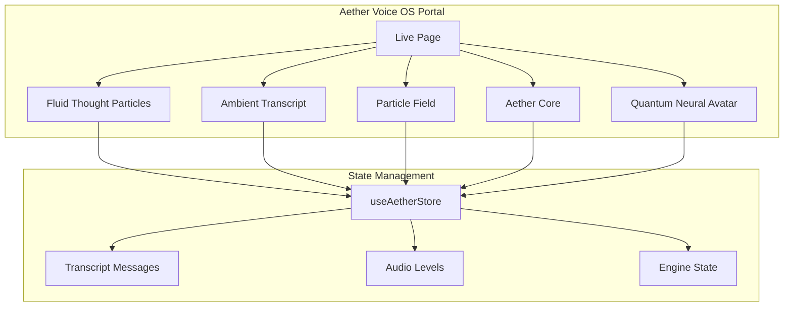
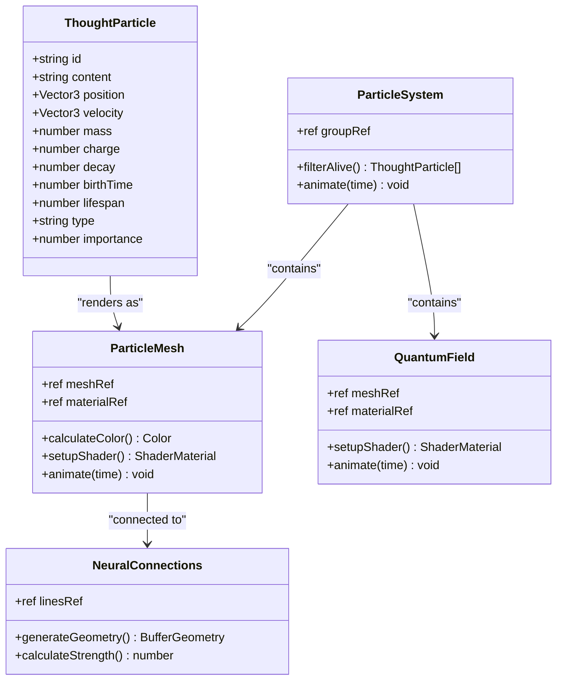
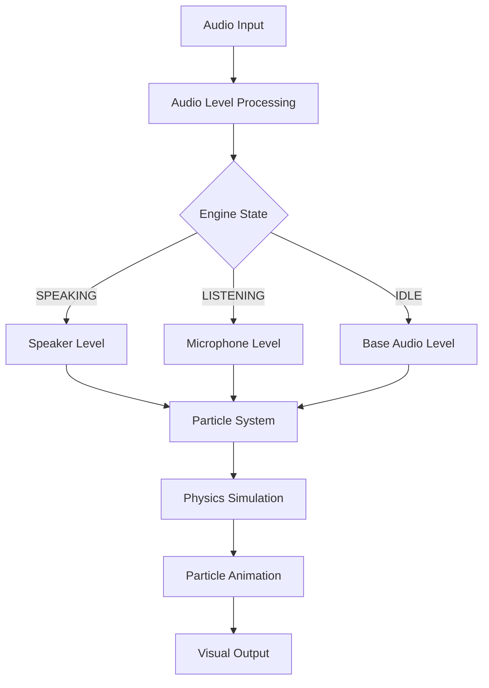
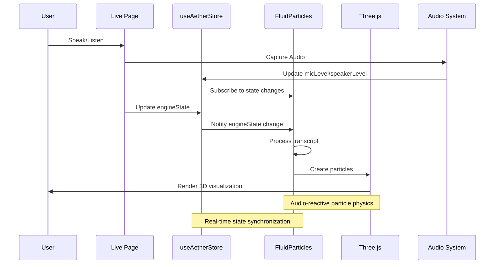
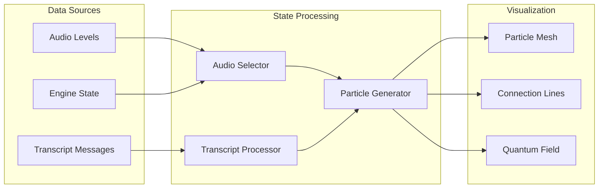
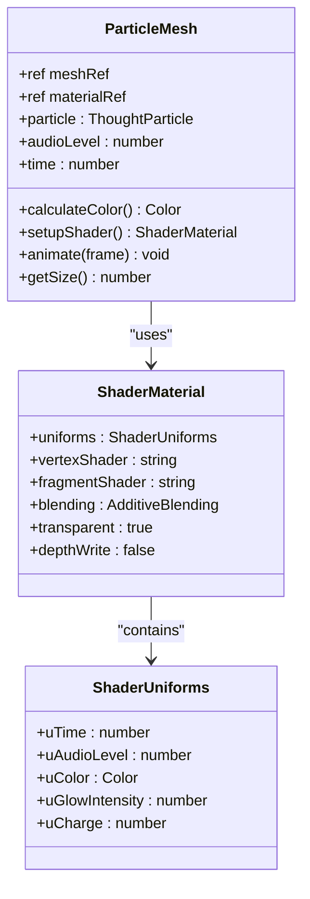
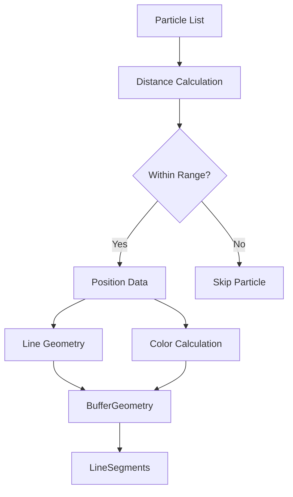
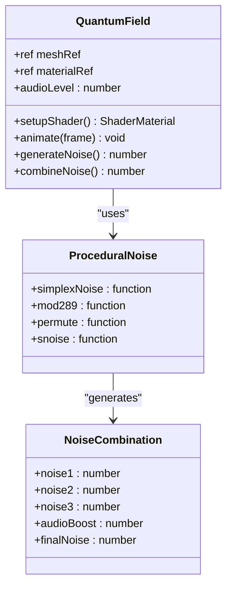
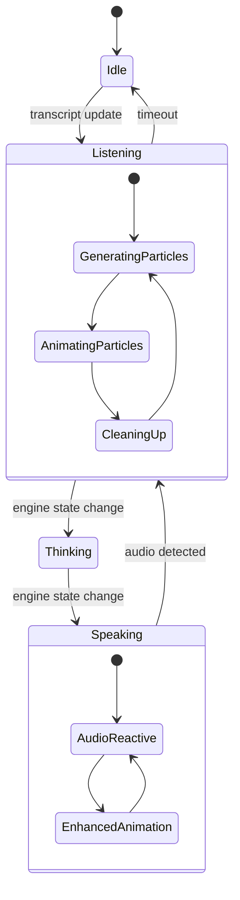

# Fluid Thought Particles

<cite>
**Referenced Files in This Document**
- [FluidThoughtParticles.tsx](file://apps/portal/src/components/FluidThoughtParticles.tsx)
- [useAetherStore.ts](file://apps/portal/src/store/useAetherStore.ts)
- [ParticleField.tsx](file://apps/portal/src/components/shared/ParticleField.tsx)
- [AmbientTranscript.tsx](file://apps/portal/src/components/AmbientTranscript.tsx)
- [AetherCore.tsx](file://apps/portal/src/components/AetherCore.tsx)
- [QuantumNeuralAvatar.tsx](file://apps/portal/src/components/QuantumNeuralAvatar.tsx)
- [FluidThoughtParticles.test.tsx](file://apps/portal/src/__tests__/FluidThoughtParticles.test.tsx)
- [README.md](file://README.md)
</cite>

## Table of Contents
1. [Introduction](#introduction)
2. [Project Structure](#project-structure)
3. [Core Components](#core-components)
4. [Architecture Overview](#architecture-overview)
5. [Detailed Component Analysis](#detailed-component-analysis)
6. [Dependency Analysis](#dependency-analysis)
7. [Performance Considerations](#performance-considerations)
8. [Troubleshooting Guide](#troubleshooting-guide)
9. [Conclusion](#conclusion)

## Introduction
Fluid Thought Particles is a revolutionary 3D immersive visualization system that transforms spoken conversation into a living, breathing particle field. Built as part of the Aether Voice OS ecosystem, this component creates a quantum neural topology experience where thoughts become tangible, glowing particles that dance and connect in three-dimensional space.

The system represents a paradigm shift from traditional text-based chat interfaces to a living, breathing organism of thought. Each word from the conversation becomes a particle with mass, velocity, and emotional charge, creating a dynamic visual representation of the AI's cognitive processes.

## Project Structure
The Fluid Thought Particles system is integrated into the Aether Voice OS portal application, working alongside other quantum neural visualization components to create a cohesive immersive experience.



**Diagram sources**
- [FluidThoughtParticles.tsx](file://apps/portal/src/components/FluidThoughtParticles.tsx#L403-L491)
- [useAetherStore.ts](file://apps/portal/src/store/useAetherStore.ts#L212-L296)

**Section sources**
- [FluidThoughtParticles.tsx](file://apps/portal/src/components/FluidThoughtParticles.tsx#L1-L517)
- [useAetherStore.ts](file://apps/portal/src/store/useAetherStore.ts#L1-L450)

## Core Components

### Thought Particle System
The core of the Fluid Thought Particles system is built around a sophisticated particle physics simulation that transforms text into interactive 3D objects.



**Diagram sources**
- [FluidThoughtParticles.tsx](file://apps/portal/src/components/FluidThoughtParticles.tsx#L26-L397)

### Quantum Neural Color Palette
The system employs a carefully curated color scheme inspired by quantum neural topology, with distinct palettes for different emotional states and particle types.

| Color Category | Primary | Glow | Dim | Usage |
|---------------|---------|------|-----|--------|
| **Neon Green** | `#39ff14` | `#00ff41` | `#1a5c1a` | Core particles, positive emotions |
| **Carbon Fiber** | `#0a0a0a` | `#1a1a1a` | `#2d2d2d` | Background field, neutral states |
| **Medium Gray** | `#6b7280` | `#9ca3af` | `#4b5563` | User particles, secondary details |
| **Accent Colors** | `#00f3ff` | `#bc13fe` | `#f59e0b` | Emotional modulation, special effects |

### Audio-Reactive Physics Engine
The particle system responds dynamically to audio input through a sophisticated physics simulation that integrates microphone and speaker levels with engine state.



**Diagram sources**
- [FluidThoughtParticles.tsx](file://apps/portal/src/components/FluidThoughtParticles.tsx#L465-L467)
- [FluidThoughtParticles.tsx](file://apps/portal/src/components/FluidThoughtParticles.tsx#L359-L397)

**Section sources**
- [FluidThoughtParticles.tsx](file://apps/portal/src/components/FluidThoughtParticles.tsx#L26-L517)
- [useAetherStore.ts](file://apps/portal/src/store/useAetherStore.ts#L212-L296)

## Architecture Overview

### System Integration Architecture
The Fluid Thought Particles system integrates seamlessly with the broader Aether Voice OS ecosystem, working in harmony with other quantum neural visualization components.



**Diagram sources**
- [FluidThoughtParticles.tsx](file://apps/portal/src/components/FluidThoughtParticles.tsx#L403-L491)
- [useAetherStore.ts](file://apps/portal/src/store/useAetherStore.ts#L344-L354)

### Data Flow Architecture
The system follows a unidirectional data flow pattern, ensuring predictable state management and optimal performance.



**Diagram sources**
- [FluidThoughtParticles.tsx](file://apps/portal/src/components/FluidThoughtParticles.tsx#L412-L467)
- [useAetherStore.ts](file://apps/portal/src/store/useAetherStore.ts#L357-L363)

**Section sources**
- [FluidThoughtParticles.tsx](file://apps/portal/src/components/FluidThoughtParticles.tsx#L359-L491)
- [useAetherStore.ts](file://apps/portal/src/store/useAetherStore.ts#L299-L450)

## Detailed Component Analysis

### ParticleMesh Component
The ParticleMesh component serves as the fundamental building block for individual thought particles, implementing sophisticated shader-based rendering with audio-reactive properties.



**Diagram sources**
- [FluidThoughtParticles.tsx](file://apps/portal/src/components/FluidThoughtParticles.tsx#L77-L196)

#### Shader-Based Rendering System
The component utilizes custom GLSL shaders to achieve photorealistic particle rendering with advanced visual effects including fresnel reflections, quantum entanglement patterns, and audio-reactive pulsing.

Key shader features include:
- **Fresnel Effect**: Creates natural glow boundaries based on viewing angle
- **Quantum Entanglement**: Subtle interference patterns for quantum aesthetic
- **Audio Reactivity**: Real-time scaling and pulsing synchronized with audio levels
- **Charge Modulation**: Color shifting based on emotional charge values

### NeuralConnections Component
The NeuralConnections component generates dynamic connection lines between nearby particles, creating a web-like structure that visualizes relationships and associations within the conversation.



**Diagram sources**
- [FluidThoughtParticles.tsx](file://apps/portal/src/components/FluidThoughtParticles.tsx#L202-L244)

#### Connection Strength Algorithm
The system calculates connection strength based on inverse distance relationships, creating stronger connections for particles that are closer together while maintaining visual coherence across the entire particle field.

### QuantumField Background System
The QuantumField component provides an immersive background environment using procedural noise generation and quantum field visualization techniques.



**Diagram sources**
- [FluidThoughtParticles.tsx](file://apps/portal/src/components/FluidThoughtParticles.tsx#L250-L353)

#### Procedural Noise Generation
The background field utilizes sophisticated simplex noise algorithms combined with audio-reactive modifications to create an ever-changing quantum foam environment that responds to the conversation's emotional and acoustic characteristics.

**Section sources**
- [FluidThoughtParticles.tsx](file://apps/portal/src/components/FluidThoughtParticles.tsx#L77-L353)

### State Management Integration
The component integrates deeply with the Aether state management system, automatically responding to changes in engine state, audio levels, and transcript content.



**Diagram sources**
- [FluidThoughtParticles.tsx](file://apps/portal/src/components/FluidThoughtParticles.tsx#L403-L491)
- [useAetherStore.ts](file://apps/portal/src/store/useAetherStore.ts#L212-L218)

**Section sources**
- [FluidThoughtParticles.tsx](file://apps/portal/src/components/FluidThoughtParticles.tsx#L403-L491)
- [useAetherStore.ts](file://apps/portal/src/store/useAetherStore.ts#L344-L354)

## Dependency Analysis

### Component Dependencies
The Fluid Thought Particles system maintains loose coupling with other components while sharing common dependencies for 3D rendering and state management.

```mermaid
graph TB
subgraph "External Dependencies"
React[React 18+]
ThreeJS[Three.js]
ReactThreeFiber[@react-three/fiber]
FramerMotion[framer-motion]
Zustand[zustand]
end
subgraph "Internal Dependencies"
useAetherStore[useAetherStore]
ParticleTypes[ThoughtParticle Types]
QuantumPalette[Quantum Palette]
end
subgraph "Fluid Thought Particles"
FluidParticles[FluidParticles]
ParticleMesh[ParticleMesh]
NeuralConnections[NeuralConnections]
QuantumField[QuantumField]
ParticleSystem[ParticleSystem]
end
React --> FluidParticles
ThreeJS --> ParticleMesh
ReactThreeFiber --> ParticleMesh
FramerMotion --> AmbientTranscript
Zustand --> useAetherStore
useAetherStore --> FluidParticles
ParticleTypes --> ParticleMesh
QuantumPalette --> ParticleMesh
FluidParticles --> ParticleMesh
FluidParticles --> NeuralConnections
FluidParticles --> QuantumField
ParticleSystem --> ParticleMesh
ParticleSystem --> NeuralConnections
```

**Diagram sources**
- [FluidThoughtParticles.tsx](file://apps/portal/src/components/FluidThoughtParticles.tsx#L16-L21)
- [useAetherStore.ts](file://apps/portal/src/store/useAetherStore.ts#L1-L450)

### Performance Dependencies
The system's performance depends on several key factors including GPU capabilities, memory management, and efficient state updates.

**Section sources**
- [FluidThoughtParticles.tsx](file://apps/portal/src/components/FluidThoughtParticles.tsx#L16-L21)
- [useAetherStore.ts](file://apps/portal/src/store/useAetherStore.ts#L1-L450)

## Performance Considerations

### Optimization Strategies
The Fluid Thought Particles system implements several optimization techniques to maintain smooth performance across different hardware configurations.

#### Particle Lifecycle Management
- **Automatic Cleanup**: Particles are automatically removed when their lifespan expires
- **Memory Pooling**: Reused particle instances to minimize garbage collection
- **Selective Rendering**: Only alive particles are rendered each frame

#### Shader Optimization
- **Shared Materials**: Common shader materials are reused across particles
- **Uniform Minimization**: Efficient uniform passing reduces GPU overhead
- **Additive Blending**: Optimized for modern GPU architectures

#### Frame Rate Management
- **Delta Time**: Physics calculations use consistent time steps
- **Performance Monitoring**: Built-in performance metrics for optimization
- **Adaptive Complexity**: Simplified rendering for lower-end devices

### Hardware Requirements
The system is designed to adapt to various hardware configurations while maintaining visual fidelity.

| Component | Minimum | Recommended | High-End |
|-----------|---------|-------------|----------|
| **GPU** | Integrated Intel HD 4000 | GTX 1660 | RTX 3080 |
| **VRAM** | 2GB | 6GB | 12GB+ |
| **CPU** | Dual-core i5 | Quad-core i7 | Octa-core i9 |
| **Memory** | 8GB | 16GB | 32GB+ |
| **Frame Rate** | 30 FPS | 60 FPS | 90+ FPS |

## Troubleshooting Guide

### Common Issues and Solutions

#### Particles Not Appearing
**Symptoms**: Empty particle field despite active conversation
**Causes**: 
- Transcript empty or malformed
- Audio levels below threshold
- Engine state not properly initialized

**Solutions**:
1. Verify transcript data exists in store
2. Check audio pipeline initialization
3. Confirm engine state transitions
4. Review particle generation logic

#### Performance Degradation
**Symptoms**: Low frame rates, stuttering animation
**Causes**:
- Too many simultaneous particles
- Complex shader operations
- Memory leaks in particle cleanup

**Solutions**:
1. Implement particle count limits
2. Optimize shader complexity
3. Add memory leak detection
4. Use particle pooling

#### Audio Synchronization Issues
**Symptoms**: Particles not reacting to audio input
**Causes**:
- Audio level updates not reaching component
- Engine state mismatch
- Shader uniform updates failing

**Solutions**:
1. Verify audio pipeline connectivity
2. Check engine state subscriptions
3. Debug shader uniform updates
4. Implement audio-reactive fallbacks

### Debug Mode Features
The system includes comprehensive debugging capabilities for development and troubleshooting.

**Section sources**
- [FluidThoughtParticles.test.tsx](file://apps/portal/src/__tests__/FluidThoughtParticles.test.tsx#L1-L231)

## Conclusion

The Fluid Thought Particles system represents a groundbreaking advancement in AI interface design, transforming abstract conversation into a tangible, immersive 3D experience. Through sophisticated particle physics, quantum neural aesthetics, and real-time audio-reactive systems, it creates a truly living representation of artificial thought.

The system's modular architecture ensures maintainability and extensibility while its performance optimizations guarantee smooth operation across diverse hardware configurations. By integrating seamlessly with the broader Aether Voice OS ecosystem, it contributes to a unified vision of voice-first AI interaction that feels alive and responsive.

As the Aether Voice OS continues to evolve, the Fluid Thought Particles system stands as a testament to the possibilities when cutting-edge technology meets artistic vision, creating interfaces that are not just functional but truly beautiful and meaningful.