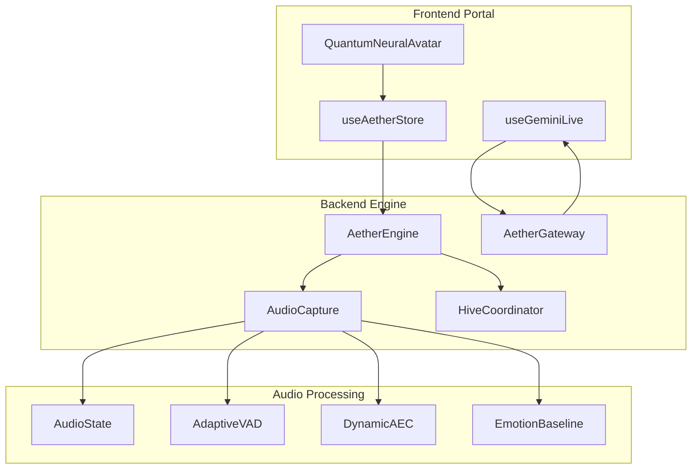
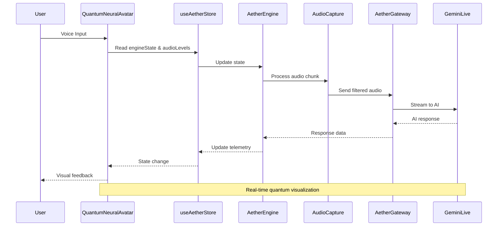
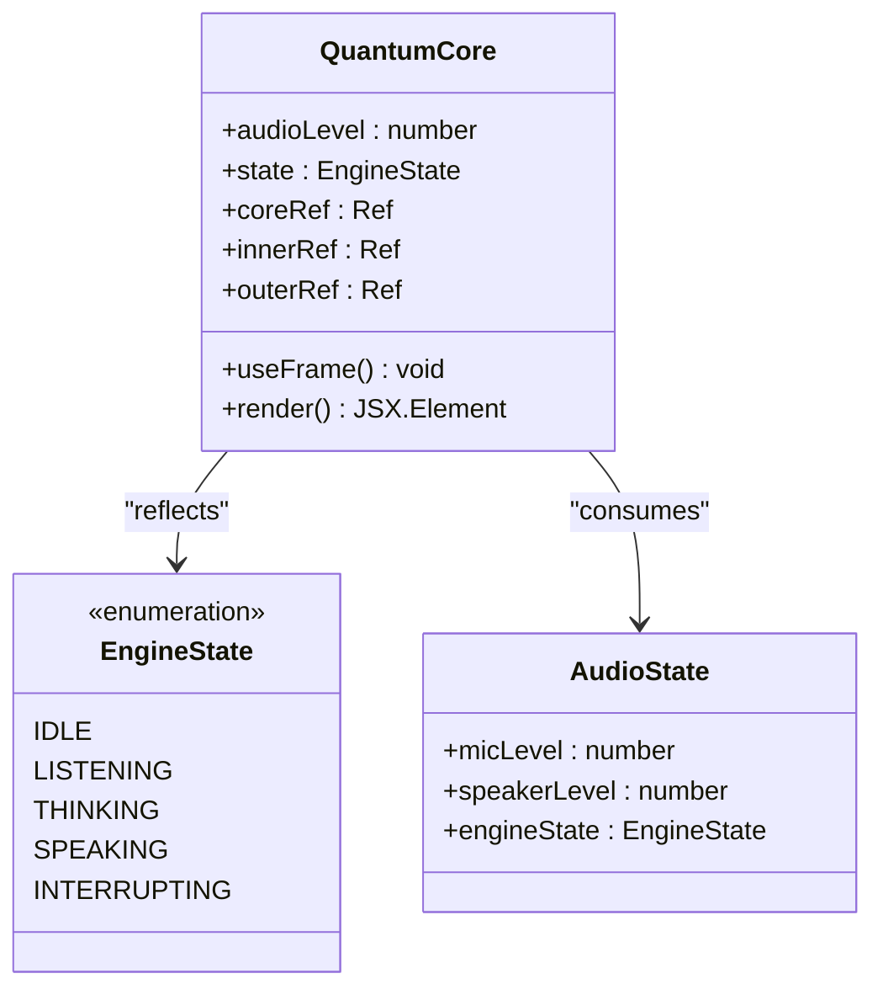
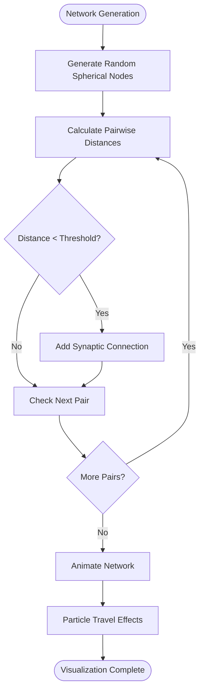
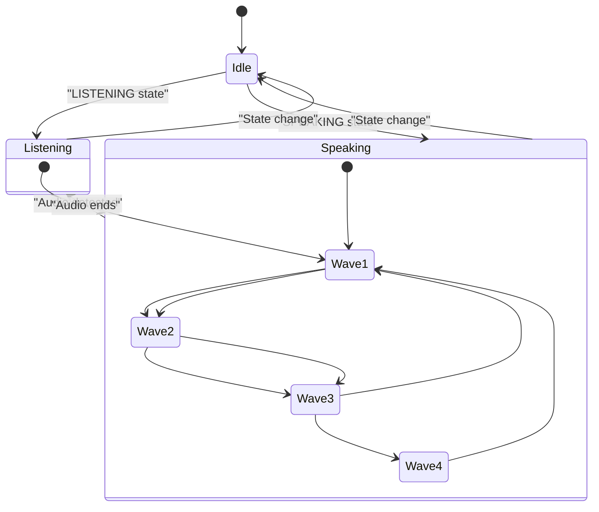
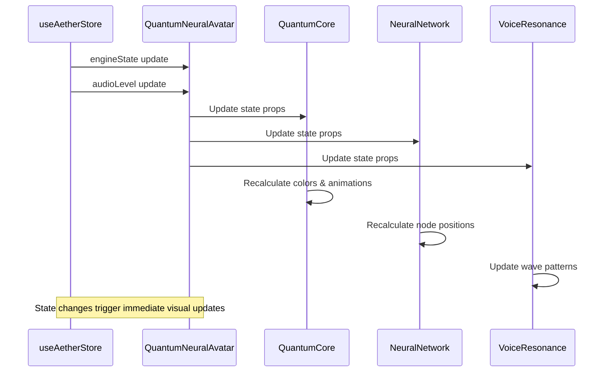

# Quantum Neural Avatar

<cite>
**Referenced Files in This Document**
- [README.md](file://README.md)
- [QuantumNeuralAvatar.tsx](file://apps/portal/src/components/QuantumNeuralAvatar.tsx)
- [useAetherStore.ts](file://apps/portal/src/store/useAetherStore.ts)
- [useGeminiLive.ts](file://apps/portal/src/hooks/useGeminiLive.ts)
- [engine.py](file://core/engine.py)
- [server.py](file://core/server.py)
- [gateway.py](file://core/infra/transport/gateway.py)
- [capture.py](file://core/audio/capture.py)
- [state.py](file://core/audio/state.py)
- [processing.py](file://core/audio/processing.py)
- [router.py](file://core/ai/router.py)
- [hive.py](file://core/ai/hive.py)
- [vector_store.py](file://core/tools/vector_store.py)
- [baseline.py](file://core/emotion/baseline.py)
</cite>

## Table of Contents
1. [Introduction](#introduction)
2. [Project Structure](#project-structure)
3. [Core Components](#core-components)
4. [Architecture Overview](#architecture-overview)
5. [Detailed Component Analysis](#detailed-component-analysis)
6. [Dependency Analysis](#dependency-analysis)
7. [Performance Considerations](#performance-considerations)
8. [Troubleshooting Guide](#troubleshooting-guide)
9. [Conclusion](#conclusion)

## Introduction
The Quantum Neural Avatar is a 3D visualization component representing Aether's neural voice interface. Built with React Three Fiber and Three.js, it provides an immersive, state-responsive avatar that reflects the AI's cognitive states through dynamic lighting, pulsating effects, and quantum-inspired visual metaphors. The avatar serves as both a visual feedback mechanism and an artistic representation of the underlying audio processing pipeline, emotion detection, and multi-agent orchestration.

## Project Structure
The Quantum Neural Avatar resides in the frontend portal application and integrates with the backend audio processing pipeline and AI orchestration systems. The key components include:

- **Avatar Rendering**: 3D scene with core, neural network mesh, and resonance waves
- **State Management**: Integration with the Aether state store for real-time audio levels and engine states
- **Audio Pipeline**: Connection to the backend audio capture and processing systems
- **Multi-Agent Integration**: Visual feedback for agent handoffs and neural events



**Diagram sources**
- [QuantumNeuralAvatar.tsx](file://apps/portal/src/components/QuantumNeuralAvatar.tsx#L1-L588)
- [useAetherStore.ts](file://apps/portal/src/store/useAetherStore.ts#L1-L450)
- [engine.py](file://core/engine.py#L1-L240)
- [gateway.py](file://core/infra/transport/gateway.py#L1-L828)

**Section sources**
- [README.md](file://README.md#L244-L353)
- [QuantumNeuralAvatar.tsx](file://apps/portal/src/components/QuantumNeuralAvatar.tsx#L1-L588)

## Core Components
The Quantum Neural Avatar consists of several interconnected components that work together to create a responsive, state-aware visualization:

### Quantum Core
The central quantum core represents the AI's consciousness with:
- Distorted sphere geometry with emissive materials
- Dynamic pulsation based on audio levels
- State-dependent color transitions (LISTENING, THINKING, SPEAKING)
- Orbiting ring structures for visual depth

### Neural Network Mesh
A dynamic network of interconnected nodes that:
- Generates randomized node positions in a spherical pattern
- Creates synaptic connections based on proximity
- Responds to audio levels with particle animations
- Rotates slowly to indicate neural activity

### Voice Resonance Waves
Visual waveforms that appear during:
- SPEAKING state: concentric ring animations
- LISTENING state: subtle ambient effects
- Scale and opacity modulation based on audio intensity

### State Management Integration
The avatar integrates with the Aether state store to reflect:
- Engine state transitions (IDLE, LISTENING, THINKING, SPEAKING)
- Audio level indicators (micLevel vs speakerLevel)
- Connection status and session states

**Section sources**
- [QuantumNeuralAvatar.tsx](file://apps/portal/src/components/QuantumNeuralAvatar.tsx#L209-L305)
- [QuantumNeuralAvatar.tsx](file://apps/portal/src/components/QuantumNeuralAvatar.tsx#L311-L386)
- [QuantumNeuralAvatar.tsx](file://apps/portal/src/components/QuantumNeuralAvatar.tsx#L392-L428)
- [useAetherStore.ts](file://apps/portal/src/store/useAetherStore.ts#L212-L296)

## Architecture Overview
The Quantum Neural Avatar operates within Aether's distributed architecture, connecting frontend visualization to backend audio processing and AI orchestration:



**Diagram sources**
- [QuantumNeuralAvatar.tsx](file://apps/portal/src/components/QuantumNeuralAvatar.tsx#L477-L563)
- [useAetherStore.ts](file://apps/portal/src/store/useAetherStore.ts#L300-L450)
- [engine.py](file://core/engine.py#L189-L240)
- [gateway.py](file://core/infra/transport/gateway.py#L320-L507)

The avatar serves as a visual representation of the underlying audio processing pipeline, emotion detection, and multi-agent coordination that makes Aether's voice interface feel alive and responsive.

## Detailed Component Analysis

### Quantum Core Component
The Quantum Core is the central visual element that responds to AI states and audio activity:



**Diagram sources**
- [QuantumNeuralAvatar.tsx](file://apps/portal/src/components/QuantumNeuralAvatar.tsx#L210-L305)
- [useAetherStore.ts](file://apps/portal/src/store/useAetherStore.ts#L7-L19)

The core implements sophisticated animation logic:
- **State-based coloring**: Different colors for each engine state
- **Dynamic scaling**: Pulsation synchronized with audio levels
- **Rotational patterns**: Speed variations based on cognitive states
- **Light emission**: Intensity modulation for visual feedback

### Neural Network Mesh
The neural network creates a complex web of connections that visualizes AI processing:



**Diagram sources**
- [QuantumNeuralAvatar.tsx](file://apps/portal/src/components/QuantumNeuralAvatar.tsx#L316-L386)

The mesh system includes:
- **Node generation**: Randomized 3D positioning with spherical distribution
- **Connection logic**: Proximity-based linking with probabilistic weighting
- **Animation system**: Continuous rotation and state-responsive scaling
- **Particle effects**: Animated points traveling along connection paths

### Voice Resonance System
The resonance waves provide temporal visual feedback for audio activity:



**Diagram sources**
- [QuantumNeuralAvatar.tsx](file://apps/portal/src/components/QuantumNeuralAvatar.tsx#L392-L428)

The resonance system features:
- **Ring geometry**: Multiple concentric rings with varying radii
- **Scale animation**: Smooth expansion and contraction based on audio levels
- **Opacity modulation**: Fade effects for depth perception
- **Timing synchronization**: Wave propagation synchronized with audio pulses

### State Transition System
The avatar responds to real-time state changes through the Aether state store:



**Diagram sources**
- [useAetherStore.ts](file://apps/portal/src/store/useAetherStore.ts#L337-L354)
- [QuantumNeuralAvatar.tsx](file://apps/portal/src/components/QuantumNeuralAvatar.tsx#L477-L563)

**Section sources**
- [QuantumNeuralAvatar.tsx](file://apps/portal/src/components/QuantumNeuralAvatar.tsx#L76-L131)
- [QuantumNeuralAvatar.tsx](file://apps/portal/src/components/QuantumNeuralAvatar.tsx#L137-L204)
- [QuantumNeuralAvatar.tsx](file://apps/portal/src/components/QuantumNeuralAvatar.tsx#L209-L305)
- [QuantumNeuralAvatar.tsx](file://apps/portal/src/components/QuantumNeuralAvatar.tsx#L311-L428)

## Dependency Analysis
The Quantum Neural Avatar has several key dependencies and integration points:

```mermaid
graph TB
subgraph "External Dependencies"
React[React 18+]
ThreeJS[Three.js]
ReactThreeFiber[@react-three/fiber]
Drei[@react-three/drei]
Zustand[zustand]
end
subgraph "Internal Dependencies"
Store[useAetherStore]
EngineState[EngineState enum]
AudioLevels[Audio Level Props]
end
subgraph "Avatar Components"
Core[QuantumCore]
Network[NeuralNetwork]
Resonance[VoiceResonance]
Node[NeuralNode]
Connection[SynapticConnection]
end
React --> Core
ThreeJS --> Core
ReactThreeFiber --> Core
Drei --> Core
Zustand --> Store
Store --> EngineState
Store --> AudioLevels
Core --> Network
Core --> Resonance
Network --> Node
Network --> Connection
Resonance --> Core
```

**Diagram sources**
- [QuantumNeuralAvatar.tsx](file://apps/portal/src/components/QuantumNeuralAvatar.tsx#L18-L22)
- [useAetherStore.ts](file://apps/portal/src/store/useAetherStore.ts#L1-L4)

The component architecture demonstrates:
- **Minimal external dependencies**: Core functionality relies on essential libraries
- **Internal state integration**: Deep integration with Aether's state management
- **Component composition**: Modular design with clear separation of concerns
- **Performance optimization**: Efficient rendering with memoization and optimized geometries

**Section sources**
- [QuantumNeuralAvatar.tsx](file://apps/portal/src/components/QuantumNeuralAvatar.tsx#L1-L588)
- [useAetherStore.ts](file://apps/portal/src/store/useAetherStore.ts#L1-L450)

## Performance Considerations
The Quantum Neural Avatar is designed with performance optimization in mind:

### Rendering Optimizations
- **Geometry reuse**: Shared geometries and materials across instances
- **Memoization**: useMemo for expensive calculations and object creation
- **Frame-based updates**: useFrame hook for efficient animation loops
- **Conditional rendering**: Components only render when state changes

### Memory Management
- **Reference-based updates**: useRef for DOM manipulation without triggering re-renders
- **Efficient animations**: Single animation loop managing multiple visual elements
- **Resource pooling**: Minimal object creation during animation frames

### Integration Performance
- **State subscription**: Selective state updates avoiding unnecessary re-renders
- **Lazy loading**: Component-level lazy loading for heavy 3D assets
- **Responsive sizing**: Adaptive rendering based on container dimensions

**Section sources**
- [QuantumNeuralAvatar.tsx](file://apps/portal/src/components/QuantumNeuralAvatar.tsx#L80-L131)
- [QuantumNeuralAvatar.tsx](file://apps/portal/src/components/QuantumNeuralAvatar.tsx#L150-L204)

## Troubleshooting Guide

### Common Issues and Solutions

#### Avatar Not Responding to State Changes
**Symptoms**: Avatar remains static despite audio input
**Causes**: 
- State store not updating properly
- Audio levels not being transmitted
- Component not subscribed to state changes

**Solutions**:
- Verify useAetherStore state updates in development tools
- Check audio processing pipeline for proper level reporting
- Ensure component is properly subscribed to state changes

#### Performance Degradation
**Symptoms**: Frame rate drops during complex animations
**Causes**:
- Too many simultaneous animations
- Excessive geometry complexity
- Memory leaks in animation frames

**Solutions**:
- Reduce particle counts in neural networks
- Simplify geometry for lower-end devices
- Implement proper cleanup in useEffect hooks

#### Visual Artifacts
**Symptoms**: Incorrect colors or lighting issues
**Causes**:
- Material property conflicts
- Lighting configuration problems
- State synchronization delays

**Solutions**:
- Verify color palette consistency
- Check lighting setup in scene
- Ensure state updates are atomic

### Debugging Tools
The avatar includes built-in debugging capabilities:
- **Console logging**: Animation frame timing and state changes
- **Performance monitoring**: Frame rate and memory usage tracking
- **State inspection**: Real-time state variable monitoring

**Section sources**
- [QuantumNeuralAvatar.tsx](file://apps/portal/src/components/QuantumNeuralAvatar.tsx#L442-L471)
- [useAetherStore.ts](file://apps/portal/src/store/useAetherStore.ts#L346-L354)

## Conclusion
The Quantum Neural Avatar represents a sophisticated blend of art and engineering, transforming Aether's complex audio processing pipeline into an intuitive, visually compelling interface. Through its responsive design, state-aware animations, and seamless integration with the backend systems, it provides users with immediate feedback about the AI's cognitive states and processing activities.

The component's modular architecture ensures maintainability while its performance optimizations guarantee smooth operation across different hardware configurations. As Aether continues to evolve with advanced emotion detection, multi-agent coordination, and enhanced audio processing capabilities, the Quantum Neural Avatar will serve as both a functional interface and a testament to the possibilities of human-AI collaboration through innovative visual design.