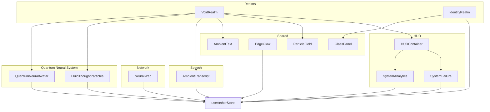
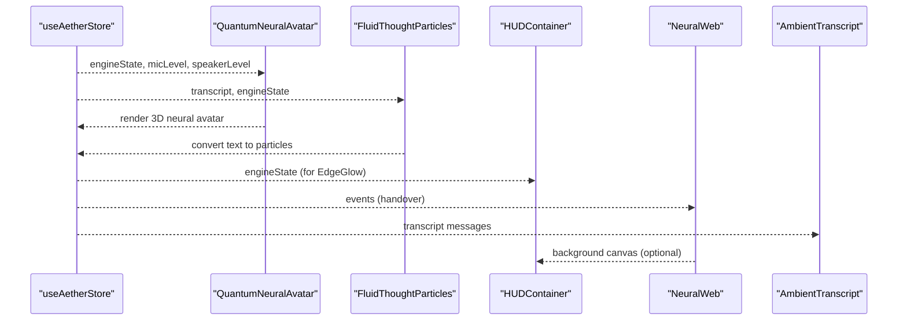
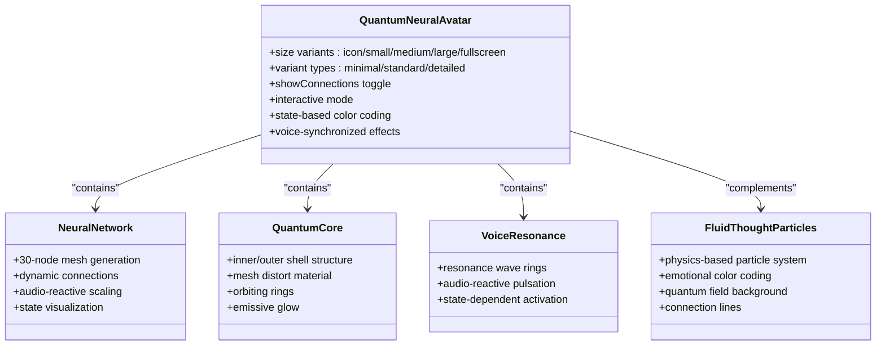
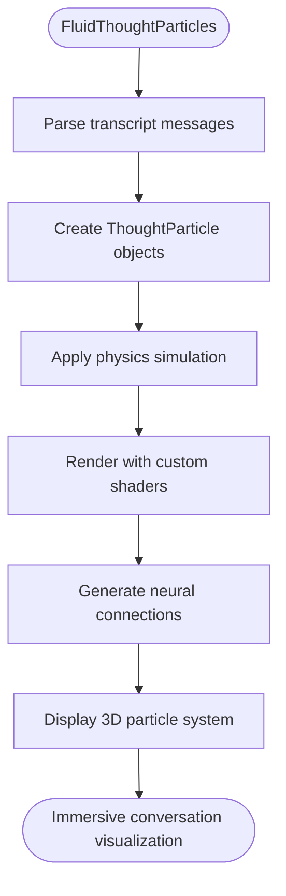
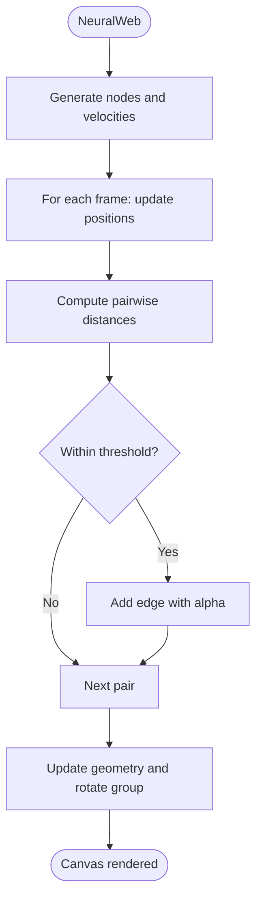
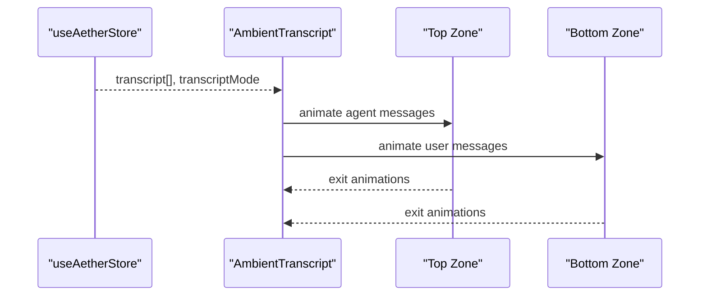
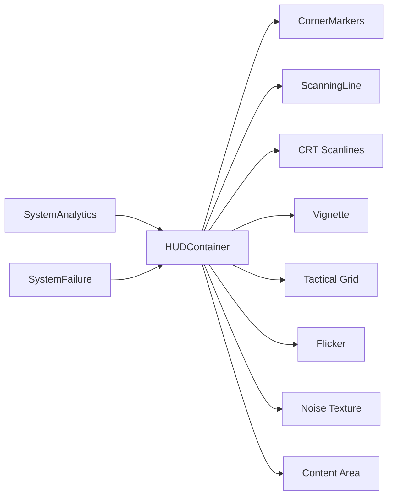
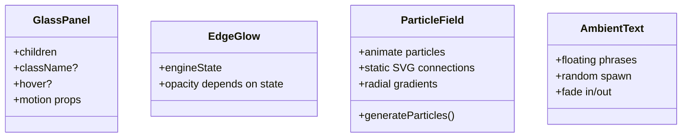
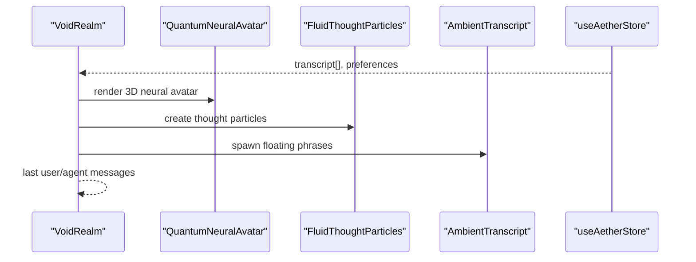
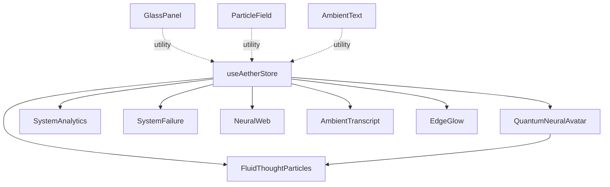

# Visual Interface Components

<cite>
**Referenced Files in This Document**
- [QuantumNeuralAvatar.tsx](file://apps/portal/src/components/QuantumNeuralAvatar.tsx)
- [FluidThoughtParticles.tsx](file://apps/portal/src/components/FluidThoughtParticles.tsx)
- [AetherOrb.tsx](file://apps/portal/src/components/AetherOrb.tsx)
- [AetherCore.tsx](file://apps/portal/src/components/AetherCore.tsx)
- [NeuralWeb.tsx](file://apps/portal/src/components/NeuralWeb.tsx)
- [AmbientTranscript.tsx](file://apps/portal/src/components/AmbientTranscript.tsx)
- [HUDContainer.tsx](file://apps/portal/src/components/HUD/HUDContainer.tsx)
- [SystemAnalytics.tsx](file://apps/portal/src/components/HUD/SystemAnalytics.tsx)
- [SystemFailure.tsx](file://apps/portal/src/components/HUD/SystemFailure.tsx)
- [GlassPanel.tsx](file://apps/portal/src/components/shared/GlassPanel.tsx)
- [EdgeGlow.tsx](file://apps/portal/src/components/shared/EdgeGlow.tsx)
- [ParticleField.tsx](file://apps/portal/src/components/shared/ParticleField.tsx)
- [AmbientText.tsx](file://apps/portal/src/components/shared/AmbientText.tsx)
- [VoidRealm.tsx](file://apps/portal/src/components/realms/VoidRealm.tsx)
- [IdentityRealm.tsx](file://apps/portal/src/components/realms/IdentityRealm.tsx)
- [useAetherStore.ts](file://apps/portal/src/store/useAetherStore.ts)
- [utils.ts](file://apps/portal/src/lib/utils.ts)
</cite>

## Update Summary
**Changes Made**
- Complete replacement of AetherOrb system with Quantum Neural Avatar implementation
- Added comprehensive documentation for new 3D neural mesh visualization system
- Documented state-based color coding and voice-synchronized effects
- Added Fluid Thought Particles system for immersive 3D conversation visualization
- Updated component architecture to reflect new Quantum Neural Topology paradigm
- Maintained existing HUD, shared UI, and realm integration documentation

## Table of Contents
1. [Introduction](#introduction)
2. [Project Structure](#project-structure)
3. [Core Components](#core-components)
4. [Architecture Overview](#architecture-overview)
5. [Detailed Component Analysis](#detailed-component-analysis)
6. [Dependency Analysis](#dependency-analysis)
7. [Performance Considerations](#performance-considerations)
8. [Troubleshooting Guide](#troubleshooting-guide)
9. [Conclusion](#conclusion)
10. [Appendices](#appendices)

## Introduction
This document details the visual interface components that deliver an immersive, futuristic user experience. The system has evolved from the legacy AetherOrb to a sophisticated Quantum Neural Avatar ecosystem featuring:
- Quantum Neural Avatar: 3D neural mesh visualization with state-based color coding and voice-synchronized effects
- Fluid Thought Particles: Physics-based 3D particle system transforming text into immersive floating entities
- Enhanced Neural Web for connection patterns and data flow visualization
- Ambient Transcript for real-time speech-to-text display with formatting and highlighting
- HUD system including HUDContainer, System Analytics, and System Failure overlays
- Shared UI components such as GlassPanel, EdgeGlow, and ParticleField
- Styling customization, animation parameters, responsive design, composition examples, theme customization, and accessibility features

**Updated** The AetherOrb system has been completely replaced by the Quantum Neural Avatar, which provides a more sophisticated 3D neural mesh visualization with advanced state synchronization and particle effects.

## Project Structure
The visual system is organized by feature domains with the new Quantum Neural Avatar at its core:
- Quantum Neural Avatar: 3D neural mesh with state-based visualization and voice synchronization
- Fluid Thought Particles: Physics-based 3D particle system for text visualization
- Network visualization: NeuralWeb with enhanced connectivity patterns
- Speech UI: AmbientTranscript and related realm integrations
- Heads-Up Display: HUDContainer, SystemAnalytics, SystemFailure
- Shared components: GlassPanel, EdgeGlow, ParticleField, AmbientText
- State management: useAetherStore
- Utilities: cn helper

**Diagram sources**
- [VoidRealm.tsx](file://apps/portal/src/components/realms/VoidRealm.tsx#L1-L63)
- [IdentityRealm.tsx](file://apps/portal/src/components/realms/IdentityRealm.tsx#L1-L222)
- [QuantumNeuralAvatar.tsx](file://apps/portal/src/components/QuantumNeuralAvatar.tsx#L1-L588)
- [FluidThoughtParticles.tsx](file://apps/portal/src/components/FluidThoughtParticles.tsx#L1-L517)
- [HUDContainer.tsx](file://apps/portal/src/components/HUD/HUDContainer.tsx#L1-L79)
- [SystemAnalytics.tsx](file://apps/portal/src/components/HUD/SystemAnalytics.tsx#L1-L88)
- [SystemFailure.tsx](file://apps/portal/src/components/HUD/SystemFailure.tsx#L1-L152)
- [NeuralWeb.tsx](file://apps/portal/src/components/NeuralWeb.tsx#L1-L229)
- [AmbientTranscript.tsx](file://apps/portal/src/components/AmbientTranscript.tsx#L1-L88)
- [GlassPanel.tsx](file://apps/portal/src/components/shared/GlassPanel.tsx#L1-L32)
- [EdgeGlow.tsx](file://apps/portal/src/components/shared/EdgeGlow.tsx#L1-L15)
- [ParticleField.tsx](file://apps/portal/src/components/shared/ParticleField.tsx#L1-L104)
- [AmbientText.tsx](file://apps/portal/src/components/shared/AmbientText.tsx#L1-L75)
- [useAetherStore.ts](file://apps/portal/src/store/useAetherStore.ts#L1-L440)

**Section sources**
- [QuantumNeuralAvatar.tsx](file://apps/portal/src/components/QuantumNeuralAvatar.tsx#L1-L588)
- [FluidThoughtParticles.tsx](file://apps/portal/src/components/FluidThoughtParticles.tsx#L1-L517)
- [AetherOrb.tsx](file://apps/portal/src/components/AetherOrb.tsx#L1-L258)
- [AetherCore.tsx](file://apps/portal/src/components/AetherCore.tsx#L1-L128)
- [NeuralWeb.tsx](file://apps/portal/src/components/NeuralWeb.tsx#L1-L229)
- [AmbientTranscript.tsx](file://apps/portal/src/components/AmbientTranscript.tsx#L1-L88)
- [HUDContainer.tsx](file://apps/portal/src/components/HUD/HUDContainer.tsx#L1-L79)
- [SystemAnalytics.tsx](file://apps/portal/src/components/HUD/SystemAnalytics.tsx#L1-L88)
- [SystemFailure.tsx](file://apps/portal/src/components/HUD/SystemFailure.tsx#L1-L152)
- [GlassPanel.tsx](file://apps/portal/src/components/shared/GlassPanel.tsx#L1-L32)
- [EdgeGlow.tsx](file://apps/portal/src/components/shared/EdgeGlow.tsx#L1-L15)
- [ParticleField.tsx](file://apps/portal/src/components/shared/ParticleField.tsx#L1-L104)
- [AmbientText.tsx](file://apps/portal/src/components/shared/AmbientText.tsx#L1-L75)
- [VoidRealm.tsx](file://apps/portal/src/components/realms/VoidRealm.tsx#L1-L63)
- [IdentityRealm.tsx](file://apps/portal/src/components/realms/IdentityRealm.tsx#L1-L222)
- [useAetherStore.ts](file://apps/portal/src/store/useAetherStore.ts#L1-L440)
- [utils.ts](file://apps/portal/src/lib/utils.ts#L1-L7)

## Core Components
- Quantum Neural Avatar: Advanced 3D neural mesh with state-based color coding, voice-synchronized pulsation, orbital rings, and quantum field effects; replaces legacy AetherOrb with superior 3D visualization and real-time audio synchronization.
- Fluid Thought Particles: Physics-based 3D particle system that transforms text messages into floating entities with emotional color coding, mass-based sizing, and quantum entanglement visual effects.
- Neural Web: Enhanced three.js-based dynamic mesh with improved connectivity patterns and state visualization.
- Ambient Transcript: Floating, typographic speech display with role-based zones and spring animations.
- HUD System: HUDContainer for scanlines and tactical overlays; SystemAnalytics for mini-charts and telemetry; SystemFailure for critical alerts and healing states.
- Shared UI: GlassPanel for glassmorphic panels; EdgeGlow for ambient border; ParticleField for quantum-topology background; AmbientText for floating phrases.

**Updated** The Quantum Neural Avatar replaces the legacy AetherOrb with a sophisticated 3D neural mesh system featuring state-based color coding, voice synchronization, and quantum field effects.

**Section sources**
- [QuantumNeuralAvatar.tsx](file://apps/portal/src/components/QuantumNeuralAvatar.tsx#L1-L588)
- [FluidThoughtParticles.tsx](file://apps/portal/src/components/FluidThoughtParticles.tsx#L1-L517)
- [AetherOrb.tsx](file://apps/portal/src/components/AetherOrb.tsx#L1-L258)
- [AetherCore.tsx](file://apps/portal/src/components/AetherCore.tsx#L1-L128)
- [NeuralWeb.tsx](file://apps/portal/src/components/NeuralWeb.tsx#L1-L229)
- [AmbientTranscript.tsx](file://apps/portal/src/components/AmbientTranscript.tsx#L1-L88)
- [HUDContainer.tsx](file://apps/portal/src/components/HUD/HUDContainer.tsx#L1-L79)
- [SystemAnalytics.tsx](file://apps/portal/src/components/HUD/SystemAnalytics.tsx#L1-L88)
- [SystemFailure.tsx](file://apps/portal/src/components/HUD/SystemFailure.tsx#L1-L152)
- [GlassPanel.tsx](file://apps/portal/src/components/shared/GlassPanel.tsx#L1-L32)
- [EdgeGlow.tsx](file://apps/portal/src/components/shared/EdgeGlow.tsx#L1-L15)
- [ParticleField.tsx](file://apps/portal/src/components/shared/ParticleField.tsx#L1-L104)
- [AmbientText.tsx](file://apps/portal/src/components/shared/AmbientText.tsx#L1-L75)

## Architecture Overview
The visual architecture centers on reactive state from useAetherStore driving multiple UI subsystems with the new Quantum Neural Avatar at its core:
- Realms orchestrate layout and content with enhanced Quantum Neural Avatar integration.
- Core 3D components render state-driven visuals with advanced neural mesh and particle systems.
- Fluid Thought Particles provide immersive text-to-particle conversion with physics-based simulation.
- Shared components provide reusable, themable building blocks.

**Diagram sources**
- [useAetherStore.ts](file://apps/portal/src/store/useAetherStore.ts#L202-L286)
- [QuantumNeuralAvatar.tsx](file://apps/portal/src/components/QuantumNeuralAvatar.tsx#L477-L588)
- [FluidThoughtParticles.tsx](file://apps/portal/src/components/FluidThoughtParticles.tsx#L403-L491)
- [HUDContainer.tsx](file://apps/portal/src/components/HUD/HUDContainer.tsx#L39-L79)
- [NeuralWeb.tsx](file://apps/portal/src/components/NeuralWeb.tsx#L147-L229)
- [AmbientTranscript.tsx](file://apps/portal/src/components/AmbientTranscript.tsx#L16-L88)

## Detailed Component Analysis

### Quantum Neural Avatar System
- QuantumNeuralAvatar serves as the central 3D representation of Aether's neural voice interface with multiple size variants and state-based visualization.
- Features advanced neural mesh generation, voice-synchronized pulsation, orbital resonance waves, and quantum field backgrounds.
- Implements state-based color coding: LISTENING (neon green), THINKING (bright neon green), SPEAKING (glowing neon green), INTERRUPTING (red), and IDLE (dim neon green).
- Includes Carbon Fiber texture overlay and status indicators for compact variants.

**Diagram sources**
- [QuantumNeuralAvatar.tsx](file://apps/portal/src/components/QuantumNeuralAvatar.tsx#L28-L588)
- [FluidThoughtParticles.tsx](file://apps/portal/src/components/FluidThoughtParticles.tsx#L26-L517)

**Section sources**
- [QuantumNeuralAvatar.tsx](file://apps/portal/src/components/QuantumNeuralAvatar.tsx#L1-L588)
- [useAetherStore.ts](file://apps/portal/src/store/useAetherStore.ts#L16-L22)

### Fluid Thought Particles System
- Converts text messages into physics-based 3D particles with mass, velocity, and emotional charge properties.
- Features custom shader materials with fresnel glow effects, quantum entanglement visualizations, and voice-synced pulsation.
- Implements neural connection lines between nearby particles, creating dynamic network visualizations.
- Includes quantum field background with animated noise patterns and audio-reactive color modulation.

**Diagram sources**
- [FluidThoughtParticles.tsx](file://apps/portal/src/components/FluidThoughtParticles.tsx#L403-L491)

**Section sources**
- [FluidThoughtParticles.tsx](file://apps/portal/src/components/FluidThoughtParticles.tsx#L1-L517)
- [useAetherStore.ts](file://apps/portal/src/store/useAetherStore.ts#L32-L37)

### Legacy AetherOrb System (Deprecated)
- AetherOrb provided a 2D canvas-based visualization with state-specific animations and particle effects.
- Features included radial gradient cores, atmospheric mist effects, mic-energy ripples, and thinking swirl particles.
- Replaced by Quantum Neural Avatar for superior 3D visualization and real-time synchronization.

**Updated** The legacy AetherOrb system has been completely superseded by the Quantum Neural Avatar implementation.

**Section sources**
- [AetherOrb.tsx](file://apps/portal/src/components/AetherOrb.tsx#L1-L258)

### Neural Web
- NeuralMesh generates nodes with boundary-bounce physics, dynamically computes edges within a distance threshold, and renders additive materials for a neon glow.
- The component includes a pulsing core, grid overlays, and a content panel showing active handover events with spring animations.

**Diagram sources**
- [NeuralWeb.tsx](file://apps/portal/src/components/NeuralWeb.tsx#L21-L145)

**Section sources**
- [NeuralWeb.tsx](file://apps/portal/src/components/NeuralWeb.tsx#L1-L229)
- [useAetherStore.ts](file://apps/portal/src/store/useAetherStore.ts#L49-L55)

### Ambient Transcript
- Displays recent messages in two zones: AI at the top fading down, user at the bottom fading up. Modes include hidden, whisper, persistent. Uses AnimatePresence for popLayout and spring transitions.

**Diagram sources**
- [AmbientTranscript.tsx](file://apps/portal/src/components/AmbientTranscript.tsx#L16-L88)
- [useAetherStore.ts](file://apps/portal/src/store/useAetherStore.ts#L32-L37)

**Section sources**
- [AmbientTranscript.tsx](file://apps/portal/src/components/AmbientTranscript.tsx#L1-L88)
- [VoidRealm.tsx](file://apps/portal/src/components/realms/VoidRealm.tsx#L14-L62)

### HUD System
- HUDContainer provides corner markers, scanning lines, CRT scanlines, vignette, tactical grid, flicker, and noise overlays; content area is pointer-events-enabled.
- SystemAnalytics shows mini-charts for neural flux and signal integrity, plus telemetry labels aligned to accent color.
- SystemFailure overlays critical states with glitch noise, scanlines, and auto-dismiss timers; supports acknowledgment button.

**Diagram sources**
- [HUDContainer.tsx](file://apps/portal/src/components/HUD/HUDContainer.tsx#L39-L79)
- [SystemAnalytics.tsx](file://apps/portal/src/components/HUD/SystemAnalytics.tsx#L36-L88)
- [SystemFailure.tsx](file://apps/portal/src/components/HUD/SystemFailure.tsx#L11-L152)

**Section sources**
- [HUDContainer.tsx](file://apps/portal/src/components/HUD/HUDContainer.tsx#L1-L79)
- [SystemAnalytics.tsx](file://apps/portal/src/components/HUD/SystemAnalytics.tsx#L1-L88)
- [SystemFailure.tsx](file://apps/portal/src/components/HUD/SystemFailure.tsx#L1-L152)
- [EdgeGlow.tsx](file://apps/portal/src/components/shared/EdgeGlow.tsx#L1-L15)

### Shared UI Components
- GlassPanel: Glassmorphism container with optional hover elevation and backdrop blur; composes motion props.
- EdgeGlow: Chromatic border visible during SPEAKING state; toggled by engine state.
- ParticleField: Ambient floating particles with CSS-friendly animations and static SVG connections; layered with radial gradients for depth.
- AmbientText: Floating phrases around the orb with random spawn and fade-in/out.

**Diagram sources**
- [GlassPanel.tsx](file://apps/portal/src/components/shared/GlassPanel.tsx#L13-L32)
- [EdgeGlow.tsx](file://apps/portal/src/components/shared/EdgeGlow.tsx#L9-L14)
- [ParticleField.tsx](file://apps/portal/src/components/shared/ParticleField.tsx#L34-L104)
- [AmbientText.tsx](file://apps/portal/src/components/shared/AmbientText.tsx#L26-L75)

**Section sources**
- [GlassPanel.tsx](file://apps/portal/src/components/shared/GlassPanel.tsx#L1-L32)
- [EdgeGlow.tsx](file://apps/portal/src/components/shared/EdgeGlow.tsx#L1-L15)
- [ParticleField.tsx](file://apps/portal/src/components/shared/ParticleField.tsx#L1-L104)
- [AmbientText.tsx](file://apps/portal/src/components/shared/AmbientText.tsx#L1-L75)

### Realm Integrations
- VoidRealm: Hosts Quantum Neural Avatar, Fluid Thought Particles, AmbientText, last user/agent messages above/below the orb; respects transcriptMode preferences.
- IdentityRealm: Slides up a persona panel with segmented controls, accent color swatches, and superpower toggles; integrates with store for persistence.

**Diagram sources**
- [VoidRealm.tsx](file://apps/portal/src/components/realms/VoidRealm.tsx#L14-L62)
- [QuantumNeuralAvatar.tsx](file://apps/portal/src/components/QuantumNeuralAvatar.tsx#L477-L588)
- [FluidThoughtParticles.tsx](file://apps/portal/src/components/FluidThoughtParticles.tsx#L403-L491)
- [AmbientText.tsx](file://apps/portal/src/components/shared/AmbientText.tsx#L26-L75)
- [useAetherStore.ts](file://apps/portal/src/store/useAetherStore.ts#L82-L104)

**Section sources**
- [VoidRealm.tsx](file://apps/portal/src/components/realms/VoidRealm.tsx#L1-L63)
- [IdentityRealm.tsx](file://apps/portal/src/components/realms/IdentityRealm.tsx#L1-L222)
- [useAetherStore.ts](file://apps/portal/src/store/useAetherStore.ts#L82-L104)

## Dependency Analysis
- State-driven rendering: All major components subscribe to useAetherStore for engine state, telemetry, and UI preferences.
- Component coupling:
  - QuantumNeuralAvatar depends on useAetherStore for state and audio levels; integrates with FluidThoughtParticles for complementary visualization.
  - FluidThoughtParticles depends on transcript data and engine state for particle generation and visualization.
  - HUDContainer is a passive overlay container; SystemAnalytics and SystemFailure depend on store-derived telemetry.
  - NeuralWeb depends on event arrays from the store.
  - Shared components (GlassPanel, EdgeGlow, ParticleField, AmbientText) are standalone and reusable.
- External libraries: Framer Motion for animations, @react-three/fiber and three.js for 3D, clsx/tailwind-merge for class merging.

**Diagram sources**
- [useAetherStore.ts](file://apps/portal/src/store/useAetherStore.ts#L202-L286)
- [QuantumNeuralAvatar.tsx](file://apps/portal/src/components/QuantumNeuralAvatar.tsx#L477-L588)
- [FluidThoughtParticles.tsx](file://apps/portal/src/components/FluidThoughtParticles.tsx#L403-L491)
- [SystemAnalytics.tsx](file://apps/portal/src/components/HUD/SystemAnalytics.tsx#L36-L88)
- [SystemFailure.tsx](file://apps/portal/src/components/HUD/SystemFailure.tsx#L11-L152)
- [NeuralWeb.tsx](file://apps/portal/src/components/NeuralWeb.tsx#L147-L229)
- [AmbientTranscript.tsx](file://apps/portal/src/components/AmbientTranscript.tsx#L16-L88)
- [EdgeGlow.tsx](file://apps/portal/src/components/shared/EdgeGlow.tsx#L9-L14)
- [GlassPanel.tsx](file://apps/portal/src/components/shared/GlassPanel.tsx#L13-L32)
- [ParticleField.tsx](file://apps/portal/src/components/shared/ParticleField.tsx#L34-L104)
- [AmbientText.tsx](file://apps/portal/src/components/shared/AmbientText.tsx#L26-L75)

**Section sources**
- [useAetherStore.ts](file://apps/portal/src/store/useAetherStore.ts#L1-L440)
- [utils.ts](file://apps/portal/src/lib/utils.ts#L1-L7)

## Performance Considerations
- 3D rendering: Keep geometry optimized; use efficient materials and limit draw calls; implement proper culling for particle systems.
- Physics simulation: Optimize particle calculations and collision detection; consider LOD (Level of Detail) for distant particles.
- Animations: Prefer hardware-accelerated CSS transforms and opacity; limit DOM thrash by batching updates.
- Particle systems: Control particle counts and animation durations; use memoized particle sets and efficient geometry updates.
- Store subscriptions: Subscribe only to necessary slices to minimize re-renders.
- Canvas overlays: NeuralWeb's Canvas should be sized appropriately; consider resolution scaling for high-DPI displays.
- Accessibility: Ensure sufficient contrast, avoid seizure triggers, and provide alternatives for motion-sensitive users.

**Updated** Added performance considerations for the new Quantum Neural Avatar and Fluid Thought Particles systems, including 3D optimization and physics simulation guidelines.

## Troubleshooting Guide
- HUD flicker or scanlines not appearing: Verify z-index stacking and background textures; confirm accent color variables are set.
- EdgeGlow not visible: Confirm engine state transitions to SPEAKING; check CSS variable availability.
- Ambient Transcript not showing: Ensure transcriptMode is not hidden; verify recent messages exist in the store.
- Neural Web inactive: Confirm events array has entries; check distance thresholds and node counts.
- GlassPanel lacks blur: Ensure Tailwind backdrop utilities are available and browser supports backdrop-filter.
- ParticleField not animating: Verify motion keys and transition configurations; reduce count for low-power devices.
- Quantum Neural Avatar not rendering: Check WebGL support and three.js dependencies; verify useAetherStore subscription.
- Fluid Thought Particles not appearing: Ensure transcript has content; verify particle creation and shader compilation.

**Updated** Added troubleshooting guidance for the new Quantum Neural Avatar and Fluid Thought Particles components.

**Section sources**
- [HUDContainer.tsx](file://apps/portal/src/components/HUD/HUDContainer.tsx#L39-L79)
- [EdgeGlow.tsx](file://apps/portal/src/components/shared/EdgeGlow.tsx#L9-L14)
- [AmbientTranscript.tsx](file://apps/portal/src/components/AmbientTranscript.tsx#L16-L88)
- [NeuralWeb.tsx](file://apps/portal/src/components/NeuralWeb.tsx#L147-L229)
- [GlassPanel.tsx](file://apps/portal/src/components/shared/GlassPanel.tsx#L13-L32)
- [ParticleField.tsx](file://apps/portal/src/components/shared/ParticleField.tsx#L34-L104)
- [QuantumNeuralAvatar.tsx](file://apps/portal/src/components/QuantumNeuralAvatar.tsx#L477-L588)
- [FluidThoughtParticles.tsx](file://apps/portal/src/components/FluidThoughtParticles.tsx#L403-L491)

## Conclusion
The visual interface has evolved into a sophisticated Quantum Neural Avatar ecosystem that combines 3D state-driven rendering, physics-based particle visualization, dynamic network connectivity, ambient speech display, and a cohesive HUD system. The new Quantum Neural Avatar provides superior immersive experiences through advanced neural mesh visualization, voice synchronization, and quantum field effects, while Fluid Thought Particles offer an innovative approach to text-to-particle conversion. Shared components enable consistent theming and performance, while store-driven state ensures real-time responsiveness across realms and modes.

**Updated** The visual interface now centers on the Quantum Neural Avatar and Fluid Thought Particles systems, providing a more immersive and technically sophisticated user experience.

## Appendices

### Styling Customization Options
- Accent color palette: Configure via preferences; affects glow, borders, and highlights.
- Transcript modes: whisper, persistent, hidden; controlled by store preferences.
- Wave style and emotion display: Available in preferences for telemetry visuals.
- Superpowers and persona settings: IdentityRealm allows toggling capabilities and appearance.
- Quantum Neural Avatar variants: Choose from icon, small, medium, large, and fullscreen sizes with different connection visibility and interaction modes.

**Updated** Added Quantum Neural Avatar variant options to styling customization.

**Section sources**
- [useAetherStore.ts](file://apps/portal/src/store/useAetherStore.ts#L82-L104)
- [IdentityRealm.tsx](file://apps/portal/src/components/realms/IdentityRealm.tsx#L81-L222)
- [QuantumNeuralAvatar.tsx](file://apps/portal/src/components/QuantumNeuralAvatar.tsx#L477-L588)

### Animation Parameters
- Quantum Neural Avatar: Complex state-based animations with voice synchronization, orbital rotations, and pulsating effects.
- Fluid Thought Particles: Physics-based particle movement with custom shaders, quantum field animations, and connection line rendering.
- Orb glow: duration, repeat, easing; scale and opacity oscillation.
- Orb core: distortion and speed lerped by audio energy; rotation.
- HUD scanning line: infinite linear loop; flicker and noise overlays.
- Transcript: spring stiffness and damping; popLayout transitions.
- Analytics charts: randomized bar heights and infinite repeats.
- System failure: spring-based modal entrance; auto-dismiss progress bar.

**Updated** Added animation parameters for the new Quantum Neural Avatar and Fluid Thought Particles systems.

**Section sources**
- [QuantumNeuralAvatar.tsx](file://apps/portal/src/components/QuantumNeuralAvatar.tsx#L38-L54)
- [FluidThoughtParticles.tsx](file://apps/portal/src/components/FluidThoughtParticles.tsx#L104-L158)
- [AetherCore.tsx](file://apps/portal/src/components/AetherCore.tsx#L58-L82)
- [HUDContainer.tsx](file://apps/portal/src/components/HUD/HUDContainer.tsx#L31-L37)
- [AmbientTranscript.tsx](file://apps/portal/src/components/AmbientTranscript.tsx#L36-L57)
- [SystemAnalytics.tsx](file://apps/portal/src/components/HUD/SystemAnalytics.tsx#L12-L34)
- [SystemFailure.tsx](file://apps/portal/src/components/HUD/SystemFailure.tsx#L138-L147)

### Responsive Design Considerations
- Layout containers use percentage-based positioning and viewport units.
- Typography scales with rem/em; monospace sizing uses fixed multiples.
- Panels and HUD elements adapt to breakpoints; some HUD elements hide on smaller screens.
- Canvas sizes are set per component; ensure aspect ratios remain stable.
- Quantum Neural Avatar adapts size automatically based on variant selection and device constraints.

**Updated** Added responsive design considerations for the new Quantum Neural Avatar system.

**Section sources**
- [HUDContainer.tsx](file://apps/portal/src/components/HUD/HUDContainer.tsx#L39-L79)
- [NeuralWeb.tsx](file://apps/portal/src/components/NeuralWeb.tsx#L147-L229)
- [VoidRealm.tsx](file://apps/portal/src/components/realms/VoidRealm.tsx#L14-L62)
- [QuantumNeuralAvatar.tsx](file://apps/portal/src/components/QuantumNeuralAvatar.tsx#L490-L508)

### Component Composition Examples
- Realm composition: VoidRealm composes Quantum Neural Avatar, Fluid Thought Particles, AmbientText, and last message zones.
- HUD composition: HUDContainer composes corner markers, scanning lines, CRT overlays, and content area; SystemAnalytics and SystemFailure are layered atop.
- IdentityRealm composes GlassPanel with segmented controls, swatches, and superpower cards.
- Quantum Neural Avatar composition: Core neural mesh with state-based coloring, voice resonance waves, and optional connection visualization.

**Updated** Added component composition examples for the new Quantum Neural Avatar and Fluid Thought Particles systems.

**Section sources**
- [VoidRealm.tsx](file://apps/portal/src/components/realms/VoidRealm.tsx#L14-L62)
- [HUDContainer.tsx](file://apps/portal/src/components/HUD/HUDContainer.tsx#L39-L79)
- [IdentityRealm.tsx](file://apps/portal/src/components/realms/IdentityRealm.tsx#L81-L222)
- [QuantumNeuralAvatar.tsx](file://apps/portal/src/components/QuantumNeuralAvatar.tsx#L434-L471)

### Theme Customization
- Accent color switching updates CSS variables consumed by glow, borders, and highlights.
- Quantum Neural Avatar uses predefined color palette with state-based variations.
- Utility helper: cn merges Tailwind classes safely.

**Updated** Added theme customization information for the new Quantum Neural Avatar system.

**Section sources**
- [useAetherStore.ts](file://apps/portal/src/store/useAetherStore.ts#L107-L115)
- [utils.ts](file://apps/portal/src/lib/utils.ts#L4-L6)
- [QuantumNeuralAvatar.tsx](file://apps/portal/src/components/QuantumNeuralAvatar.tsx#L53-L70)

### Accessibility Features
- Motion preferences: Prefer reduced motion; ensure animations are not essential for comprehension.
- Contrast: Maintain sufficient luminance ratios for text and overlays.
- Focus management: HUD and panels should not trap focus; ensure keyboard navigation.
- Alternatives: Hidden transcript mode accommodates users who prefer minimal overlays.
- 3D content: Provide alternatives for users sensitive to 3D visual effects; include option to disable particle systems.

**Updated** Added accessibility considerations for the new 3D Quantum Neural Avatar and Fluid Thought Particles systems.