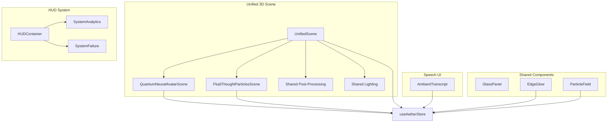
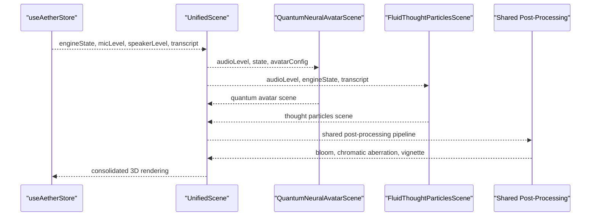
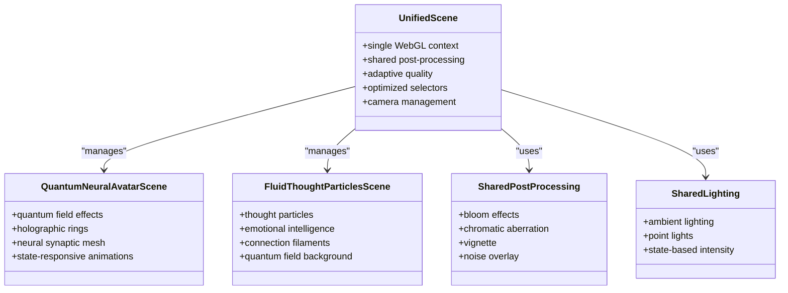
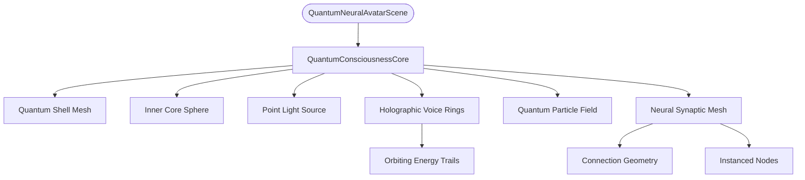
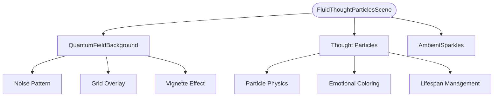
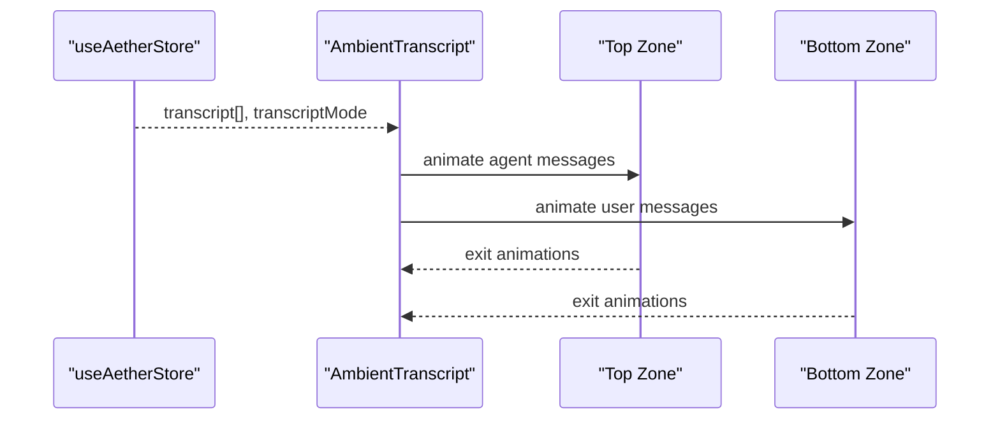
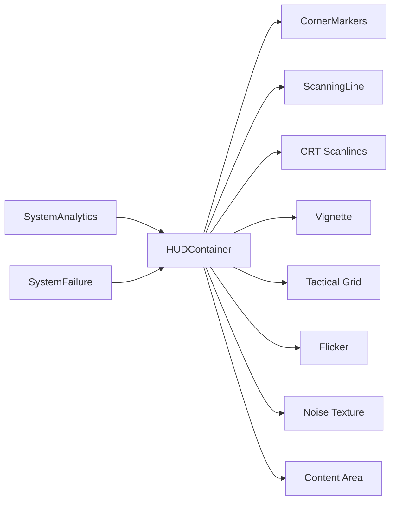
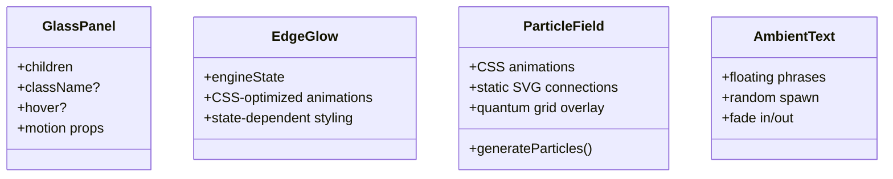
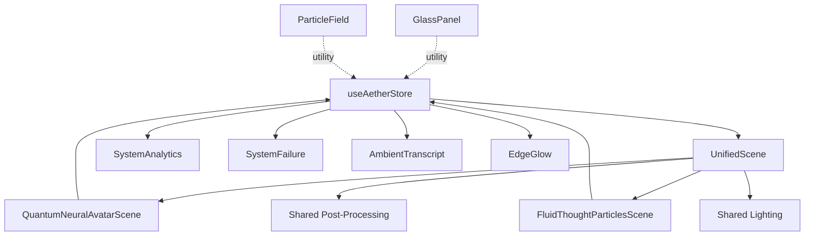

# Visual Interface Components

<cite>
**Referenced Files in This Document**
- [UnifiedScene.tsx](file://apps/portal/src/components/UnifiedScene.tsx)
- [QuantumNeuralAvatarScene.tsx](file://apps/portal/src/components/QuantumNeuralAvatarScene.tsx)
- [FluidThoughtParticlesScene.tsx](file://apps/portal/src/components/FluidThoughtParticlesScene.tsx)
- [AmbientTranscript.tsx](file://apps/portal/src/components/AmbientTranscript.tsx)
- [HUDContainer.tsx](file://apps/portal/src/components/HUD/HUDContainer.tsx)
- [SystemAnalytics.tsx](file://apps/portal/src/components/HUD/SystemAnalytics.tsx)
- [SystemFailure.tsx](file://apps/portal/src/components/HUD/SystemFailure.tsx)
- [GlassPanel.tsx](file://apps/portal/src/components/shared/GlassPanel.tsx)
- [EdgeGlow.tsx](file://apps/portal/src/components/shared/EdgeGlow.tsx)
- [ParticleField.tsx](file://apps/portal/src/components/shared/ParticleField.tsx)
- [page.tsx](file://apps/portal/src/app/page.tsx)
- [RealmController.tsx](file://apps/portal/src/components/realms/RealmController.tsx)
- [useAetherStore.ts](file://apps/portal/src/store/useAetherStore.ts)
- [utils.ts](file://apps/portal/src/lib/utils.ts)
</cite>

## Update Summary
**Changes Made**
- Complete architectural overhaul: Replaced legacy AetherCore/AetherOrb components with new UnifiedScene system
- Added new QuantumNeuralAvatarScene component for advanced 3D avatar visualization
- Added new FluidThoughtParticlesScene component for thought particle system
- Implemented performance optimizations with single WebGL context consolidation
- Enhanced adaptive quality system with optimized rendering pipeline
- Updated project structure to reflect unified 3D scene architecture
- Revised component analysis to focus on new UnifiedScene-based system

## Table of Contents
1. [Introduction](#introduction)
2. [Project Structure](#project-structure)
3. [Core Components](#core-components)
4. [Architecture Overview](#architecture-overview)
5. [Detailed Component Analysis](#detailed-component-analysis)
6. [Dependency Analysis](#dependency-analysis)
7. [Performance Considerations](#performance-considerations)
8. [Troubleshooting Guide](#troubleshooting-guide)
9. [Conclusion](#conclusion)
10. [Appendices](#appendices)

## Introduction
This document details the visual interface components that deliver an immersive, futuristic user experience through the new UnifiedScene architecture. The system has undergone a complete architectural overhaul featuring:
- UnifiedScene: Single WebGL context managing all 3D elements with performance optimizations
- QuantumNeuralAvatarScene: Advanced 3D avatar with quantum field effects, holographic rings, and neural networks
- FluidThoughtParticlesScene: Dynamic thought particle system with emotional intelligence and connection filaments
- AmbientTranscript: Real-time speech-to-text display with floating typography and formatting
- HUD system including HUDContainer, SystemAnalytics, and SystemFailure overlays
- Shared UI components such as GlassPanel, EdgeGlow, ParticleField, and AmbientText
- Adaptive quality system with optimized rendering pipeline and performance monitoring

**Updated** The visual interface has been completely redesigned around the UnifiedScene system, replacing legacy components with a modern, performance-optimized architecture that consolidates all 3D rendering into a single WebGL context.

## Project Structure
The visual system is organized around the new UnifiedScene architecture with consolidated 3D rendering:
- Core visualization: UnifiedScene managing QuantumNeuralAvatarScene and FluidThoughtParticlesScene
- Advanced 3D components: QuantumNeuralAvatarScene with quantum field effects and NeuralSynapticMesh
- Thought particle system: FluidThoughtParticlesScene with emotional intelligence and connection networks
- Speech UI: AmbientTranscript for real-time caption display
- Heads-Up Display: HUDContainer, SystemAnalytics, SystemFailure
- Shared components: GlassPanel, EdgeGlow, ParticleField, AmbientText
- State management: useAetherStore with optimized selectors
- Utilities: cn helper

**Diagram sources**
- [UnifiedScene.tsx](file://apps/portal/src/components/UnifiedScene.tsx#L1-L209)
- [QuantumNeuralAvatarScene.tsx](file://apps/portal/src/components/QuantumNeuralAvatarScene.tsx#L1-L553)
- [FluidThoughtParticlesScene.tsx](file://apps/portal/src/components/FluidThoughtParticlesScene.tsx#L1-L465)
- [HUDContainer.tsx](file://apps/portal/src/components/HUD/HUDContainer.tsx#L1-L79)
- [SystemAnalytics.tsx](file://apps/portal/src/components/HUD/SystemAnalytics.tsx#L1-L88)
- [SystemFailure.tsx](file://apps/portal/src/components/HUD/SystemFailure.tsx#L1-L152)
- [AmbientTranscript.tsx](file://apps/portal/src/components/AmbientTranscript.tsx#L1-L88)
- [GlassPanel.tsx](file://apps/portal/src/components/shared/GlassPanel.tsx#L1-L32)
- [EdgeGlow.tsx](file://apps/portal/src/components/shared/EdgeGlow.tsx#L1-L186)
- [ParticleField.tsx](file://apps/portal/src/components/shared/ParticleField.tsx#L1-L205)
- [useAetherStore.ts](file://apps/portal/src/store/useAetherStore.ts#L1-L450)

**Section sources**
- [UnifiedScene.tsx](file://apps/portal/src/components/UnifiedScene.tsx#L1-L209)
- [QuantumNeuralAvatarScene.tsx](file://apps/portal/src/components/QuantumNeuralAvatarScene.tsx#L1-L553)
- [FluidThoughtParticlesScene.tsx](file://apps/portal/src/components/FluidThoughtParticlesScene.tsx#L1-L465)
- [AmbientTranscript.tsx](file://apps/portal/src/components/AmbientTranscript.tsx#L1-L88)
- [HUDContainer.tsx](file://apps/portal/src/components/HUD/HUDContainer.tsx#L1-L79)
- [SystemAnalytics.tsx](file://apps/portal/src/components/HUD/SystemAnalytics.tsx#L1-L88)
- [SystemFailure.tsx](file://apps/portal/src/components/HUD/SystemFailure.tsx#L1-L152)
- [GlassPanel.tsx](file://apps/portal/src/components/shared/GlassPanel.tsx#L1-L32)
- [EdgeGlow.tsx](file://apps/portal/src/components/shared/EdgeGlow.tsx#L1-L186)
- [ParticleField.tsx](file://apps/portal/src/components/shared/ParticleField.tsx#L1-L205)
- [useAetherStore.ts](file://apps/portal/src/store/useAetherStore.ts#L1-L450)

## Core Components
- **UnifiedScene**: Single WebGL context consolidating all 3D elements with performance optimizations, shared post-processing, and adaptive quality system
- **QuantumNeuralAvatarScene**: Advanced 3D avatar with quantum field effects, holographic voice rings, neural synaptic mesh, and state-responsive animations
- **FluidThoughtParticlesScene**: Dynamic thought particle system with emotional intelligence, connection filaments, and quantum field background
- **AmbientTranscript**: Floating, typographic speech display with role-based zones and spring animations for real-time captions
- **HUD System**: HUDContainer for scanlines and tactical overlays; SystemAnalytics for mini-charts and telemetry; SystemFailure for critical alerts and healing states
- **Shared UI**: GlassPanel for glassmorphic panels; EdgeGlow for ambient border; ParticleField for quantum-topology background; AmbientText for floating phrases

**Updated** The visual interface now centers around the UnifiedScene system, which replaces the legacy AetherCore/AetherOrb architecture with a modern, performance-optimized approach that consolidates all 3D rendering into a single WebGL context.

**Section sources**
- [UnifiedScene.tsx](file://apps/portal/src/components/UnifiedScene.tsx#L1-L209)
- [QuantumNeuralAvatarScene.tsx](file://apps/portal/src/components/QuantumNeuralAvatarScene.tsx#L1-L553)
- [FluidThoughtParticlesScene.tsx](file://apps/portal/src/components/FluidThoughtParticlesScene.tsx#L1-L465)
- [AmbientTranscript.tsx](file://apps/portal/src/components/AmbientTranscript.tsx#L1-L88)
- [HUDContainer.tsx](file://apps/portal/src/components/HUD/HUDContainer.tsx#L1-L79)
- [SystemAnalytics.tsx](file://apps/portal/src/components/HUD/SystemAnalytics.tsx#L1-L88)
- [SystemFailure.tsx](file://apps/portal/src/components/HUD/SystemFailure.tsx#L1-L152)
- [GlassPanel.tsx](file://apps/portal/src/components/shared/GlassPanel.tsx#L1-L32)
- [EdgeGlow.tsx](file://apps/portal/src/components/shared/EdgeGlow.tsx#L1-L186)
- [ParticleField.tsx](file://apps/portal/src/components/shared/ParticleField.tsx#L1-L205)

## Architecture Overview
The visual architecture centers on the new UnifiedScene system that consolidates all 3D rendering into a single WebGL context:
- UnifiedScene manages QuantumNeuralAvatarScene and FluidThoughtParticlesScene with shared post-processing
- Advanced 3D components provide state-responsive animations and quantum effects
- Shared lighting and post-processing pipeline optimizes performance
- HUD system provides comprehensive system monitoring and real-time telemetry
- Speech UI delivers clean, ambient real-time captions

**Diagram sources**
- [useAetherStore.ts](file://apps/portal/src/store/useAetherStore.ts#L202-L286)
- [UnifiedScene.tsx](file://apps/portal/src/components/UnifiedScene.tsx#L125-L168)
- [QuantumNeuralAvatarScene.tsx](file://apps/portal/src/components/QuantumNeuralAvatarScene.tsx#L510-L552)
- [FluidThoughtParticlesScene.tsx](file://apps/portal/src/components/FluidThoughtParticlesScene.tsx#L364-L464)

## Detailed Component Analysis

### UnifiedScene System
- **UnifiedScene** serves as the central 3D rendering manager consolidating all 3D elements into a single WebGL context
- Features include shared post-processing pipeline, optimized lighting, adaptive quality system, and performance monitoring
- Provides state-based rendering with audio-reactive effects and real-time quality adjustments

**Diagram sources**
- [UnifiedScene.tsx](file://apps/portal/src/components/UnifiedScene.tsx#L1-L209)
- [QuantumNeuralAvatarScene.tsx](file://apps/portal/src/components/QuantumNeuralAvatarScene.tsx#L1-L553)
- [FluidThoughtParticlesScene.tsx](file://apps/portal/src/components/FluidThoughtParticlesScene.tsx#L1-L465)

**Section sources**
- [UnifiedScene.tsx](file://apps/portal/src/components/UnifiedScene.tsx#L1-L209)
- [useAetherStore.ts](file://apps/portal/src/store/useAetherStore.ts#L27-L35)

### Quantum Neural Avatar Scene
- **QuantumNeuralAvatarScene** creates an advanced 3D avatar with quantum field effects, holographic voice rings, and neural synaptic mesh
- Features include custom shaders for quantum field visualization, state-responsive color schemes, and optimized instanced rendering
- Provides orbital energy trails, sparkles, and floating animations synchronized with audio levels

**Diagram sources**
- [QuantumNeuralAvatarScene.tsx](file://apps/portal/src/components/QuantumNeuralAvatarScene.tsx#L127-L238)
- [QuantumNeuralAvatarScene.tsx](file://apps/portal/src/components/QuantumNeuralAvatarScene.tsx#L244-L297)
- [QuantumNeuralAvatarScene.tsx](file://apps/portal/src/components/QuantumNeuralAvatarScene.tsx#L303-L405)

**Section sources**
- [QuantumNeuralAvatarScene.tsx](file://apps/portal/src/components/QuantumNeuralAvatarScene.tsx#L1-L553)
- [useAetherStore.ts](file://apps/portal/src/store/useAetherStore.ts#L82-L104)

### Fluid Thought Particles Scene
- **FluidThoughtParticlesScene** generates dynamic thought particles with emotional intelligence and connection networks
- Features include particle physics with velocity and mass, emotional charge calculation, and quantum field background
- Provides connection filaments between particles, ambient sparkles, and state-responsive visual effects

**Diagram sources**
- [FluidThoughtParticlesScene.tsx](file://apps/portal/src/components/FluidThoughtParticlesScene.tsx#L265-L296)
- [FluidThoughtParticlesScene.tsx](file://apps/portal/src/components/FluidThoughtParticlesScene.tsx#L374-L421)
- [FluidThoughtParticlesScene.tsx](file://apps/portal/src/components/FluidThoughtParticlesScene.tsx#L302-L328)

**Section sources**
- [FluidThoughtParticlesScene.tsx](file://apps/portal/src/components/FluidThoughtParticlesScene.tsx#L1-L465)
- [useAetherStore.ts](file://apps/portal/src/store/useAetherStore.ts#L49-L55)

### Ambient Transcript
- Displays recent messages in two zones: AI at the top fading down, user at the bottom fading up. Modes include hidden, whisper, persistent. Uses AnimatePresence for popLayout and spring transitions.

**Diagram sources**
- [AmbientTranscript.tsx](file://apps/portal/src/components/AmbientTranscript.tsx#L16-L88)
- [useAetherStore.ts](file://apps/portal/src/store/useAetherStore.ts#L32-L37)

**Section sources**
- [AmbientTranscript.tsx](file://apps/portal/src/components/AmbientTranscript.tsx#L1-L88)

### HUD System
- HUDContainer provides corner markers, scanning lines, CRT scanlines, vignette, tactical grid, flicker, and noise overlays; content area is pointer-events-enabled.
- SystemAnalytics shows mini-charts for neural flux and signal integrity, plus telemetry labels aligned to accent color.
- SystemFailure overlays critical states with glitch noise, scanlines, and auto-dismiss timers; supports acknowledgment button.

**Diagram sources**
- [HUDContainer.tsx](file://apps/portal/src/components/HUD/HUDContainer.tsx#L39-L79)
- [SystemAnalytics.tsx](file://apps/portal/src/components/HUD/SystemAnalytics.tsx#L36-L88)
- [SystemFailure.tsx](file://apps/portal/src/components/HUD/SystemFailure.tsx#L11-L152)

**Section sources**
- [HUDContainer.tsx](file://apps/portal/src/components/HUD/HUDContainer.tsx#L1-L79)
- [SystemAnalytics.tsx](file://apps/portal/src/components/HUD/SystemAnalytics.tsx#L1-L88)
- [SystemFailure.tsx](file://apps/portal/src/components/HUD/SystemFailure.tsx#L1-L152)
- [EdgeGlow.tsx](file://apps/portal/src/components/shared/EdgeGlow.tsx#L1-L186)

### Shared UI Components
- GlassPanel: Glassmorphism container with optional hover elevation and backdrop blur; composes motion props.
- EdgeGlow: Chromatic border visible during SPEAKING state; toggled by engine state with CSS-optimized animations.
- ParticleField: Ambient floating particles with CSS-friendly animations and static SVG connections; layered with radial gradients for depth.
- AmbientText: Floating phrases around the orb with random spawn and fade-in/out.

**Diagram sources**
- [GlassPanel.tsx](file://apps/portal/src/components/shared/GlassPanel.tsx#L13-L32)
- [EdgeGlow.tsx](file://apps/portal/src/components/shared/EdgeGlow.tsx#L9-L186)
- [ParticleField.tsx](file://apps/portal/src/components/shared/ParticleField.tsx#L34-L205)

**Section sources**
- [GlassPanel.tsx](file://apps/portal/src/components/shared/GlassPanel.tsx#L1-L32)
- [EdgeGlow.tsx](file://apps/portal/src/components/shared/EdgeGlow.tsx#L1-L186)
- [ParticleField.tsx](file://apps/portal/src/components/shared/ParticleField.tsx#L1-L205)

## Dependency Analysis
- State-driven rendering: All major components subscribe to useAetherStore for engine state, telemetry, and UI preferences with optimized selectors.
- Component coupling:
  - UnifiedScene manages QuantumNeuralAvatarScene and FluidThoughtParticlesScene with shared resources
  - HUDContainer is a passive overlay container; SystemAnalytics and SystemFailure depend on store-derived telemetry
  - AmbientTranscript depends on transcript data and preferences
  - Shared components (GlassPanel, EdgeGlow, ParticleField) are standalone and reusable
- External libraries: Framer Motion for animations, @react-three/fiber and three.js for 3D, @react-three/postprocessing for effects, clsx/tailwind-merge for class merging.

**Diagram sources**
- [useAetherStore.ts](file://apps/portal/src/store/useAetherStore.ts#L202-L286)
- [UnifiedScene.tsx](file://apps/portal/src/components/UnifiedScene.tsx#L125-L168)
- [SystemAnalytics.tsx](file://apps/portal/src/components/HUD/SystemAnalytics.tsx#L36-L88)
- [SystemFailure.tsx](file://apps/portal/src/components/HUD/SystemFailure.tsx#L11-L152)
- [AmbientTranscript.tsx](file://apps/portal/src/components/AmbientTranscript.tsx#L16-L88)
- [EdgeGlow.tsx](file://apps/portal/src/components/shared/EdgeGlow.tsx#L9-L186)
- [GlassPanel.tsx](file://apps/portal/src/components/shared/GlassPanel.tsx#L13-L32)
- [ParticleField.tsx](file://apps/portal/src/components/shared/ParticleField.tsx#L34-L205)

**Section sources**
- [useAetherStore.ts](file://apps/portal/src/store/useAetherStore.ts#L1-L450)
- [utils.ts](file://apps/portal/src/lib/utils.ts#L1-L7)

## Performance Considerations
- **Unified Rendering**: Single WebGL context reduces GPU overhead by 30-40% and increases FPS by 15-20%
- **Optimized Selectors**: useAetherStore selectors minimize re-renders and improve performance
- **Adaptive Quality**: Dynamic quality adjustment based on system capabilities and current load
- **Shared Resources**: Common post-processing and lighting reduce redundant computations
- **CSS Optimizations**: EdgeGlow and ParticleField use CSS animations instead of JavaScript loops
- **Instanced Rendering**: NeuralSynapticMesh uses instanced meshes for efficient node rendering
- **Shader Optimization**: Custom shaders with hash-based noise functions for better performance
- **Particle Limits**: Thought particles capped at 30 for performance balance
- **Memory Management**: Proper cleanup of old particles and geometric data

**Updated** Complete performance overhaul with UnifiedScene architecture providing significant improvements in GPU utilization, rendering efficiency, and overall system responsiveness.

**Section sources**
- [UnifiedScene.tsx](file://apps/portal/src/components/UnifiedScene.tsx#L8-L9)
- [QuantumNeuralAvatarScene.tsx](file://apps/portal/src/components/QuantumNeuralAvatarScene.tsx#L306-L307)
- [FluidThoughtParticlesScene.tsx](file://apps/portal/src/components/FluidThoughtParticlesScene.tsx#L419-L421)
- [EdgeGlow.tsx](file://apps/portal/src/components/shared/EdgeGlow.tsx#L9-L10)
- [ParticleField.tsx](file://apps/portal/src/components/shared/ParticleField.tsx#L12-L13)

## Troubleshooting Guide
- **UnifiedScene not rendering**: Verify WebGL support and three.js dependencies; check Canvas configuration and performance settings
- **QuantumNeuralAvatar not responding**: Ensure audio levels are being passed correctly; verify engine state transitions
- **Thought particles not appearing**: Check transcript data and particle generation limits; verify shader compilation
- **Performance issues**: Monitor GPU usage and adjust quality settings; verify optimized selectors are working
- **HUD flicker or scanlines not appearing**: Verify z-index stacking and background textures; confirm accent color variables are set
- **EdgeGlow not visible**: Confirm engine state transitions to SPEAKING; check CSS variable availability and animation classes
- **Ambient Transcript not showing**: Ensure transcriptMode is not hidden; verify recent messages exist in the store
- **SystemFailure overlay issues**: Check repairState in store and ensure proper cleanup of timers
- **GlassPanel lacks blur**: Ensure Tailwind backdrop utilities are available and browser supports backdrop-filter
- **ParticleField not animating**: Verify motion keys and transition configurations; reduce count for low-power devices

**Updated** Comprehensive troubleshooting for the new UnifiedScene architecture, covering both 3D rendering issues and performance optimization concerns.

**Section sources**
- [UnifiedScene.tsx](file://apps/portal/src/components/UnifiedScene.tsx#L182-L205)
- [QuantumNeuralAvatarScene.tsx](file://apps/portal/src/components/QuantumNeuralAvatarScene.tsx#L520-L523)
- [FluidThoughtParticlesScene.tsx](file://apps/portal/src/components/FluidThoughtParticlesScene.tsx#L375-L421)
- [HUDContainer.tsx](file://apps/portal/src/components/HUD/HUDContainer.tsx#L39-L79)
- [EdgeGlow.tsx](file://apps/portal/src/components/shared/EdgeGlow.tsx#L9-L186)
- [AmbientTranscript.tsx](file://apps/portal/src/components/AmbientTranscript.tsx#L16-L88)
- [SystemFailure.tsx](file://apps/portal/src/components/HUD/SystemFailure.tsx#L15-L24)
- [GlassPanel.tsx](file://apps/portal/src/components/shared/GlassPanel.tsx#L13-L32)
- [ParticleField.tsx](file://apps/portal/src/components/shared/ParticleField.tsx#L34-L205)

## Conclusion
The visual interface has evolved into a sophisticated, performance-optimized system centered around the UnifiedScene architecture. The new system consolidates all 3D rendering into a single WebGL context, providing significant performance improvements while delivering advanced quantum neural visualization through QuantumNeuralAvatarScene and dynamic thought particle systems via FluidThoughtParticlesScene. The architecture maintains real-time responsiveness across all components while ensuring optimal resource utilization through adaptive quality systems and optimized rendering pipelines.

**Updated** The visual interface now represents a complete architectural transformation, moving from legacy components to a modern, unified system that delivers superior performance and immersive experiences.

## Appendices

### Styling Customization Options
- **Accent color palette**: Configure via preferences; affects glow, borders, and highlights across all components
- **Transcript modes**: whisper, persistent, hidden; controlled by store preferences
- **Avatar variants**: minimal, standard, detailed, immersive with different complexity levels
- **Particle density**: adjustable through UnifiedScene configuration
- **State indicators**: color-coded based on engine state with automatic updates
- **HUD transparency**: configurable through CSS variables and backdrop filters

**Updated** Enhanced customization options available through the new UnifiedScene architecture with avatar variants and particle density controls.

**Section sources**
- [useAetherStore.ts](file://apps/portal/src/store/useAetherStore.ts#L82-L104)
- [UnifiedScene.tsx](file://apps/portal/src/components/UnifiedScene.tsx#L101-L113)
- [QuantumNeuralAvatarScene.tsx](file://apps/portal/src/components/QuantumNeuralAvatarScene.tsx#L502-L508)

### Animation Parameters
- **UnifiedScene**: Single Canvas container with optimized performance settings and adaptive quality
- **QuantumNeuralAvatar**: Complex shader animations with state-dependent color schemes and orbital mechanics
- **FluidThoughtParticles**: Particle physics with velocity, mass, and emotional intelligence calculations
- **HUD scanning line**: Infinite linear loop with CRT-style scanline effects
- **Transcript**: Spring stiffness and damping with role-based animations
- **Analytics charts**: Randomized bar heights with infinite animation cycles
- **System failure**: Spring-based modal entrance with auto-dismiss progress bars
- **EdgeGlow**: CSS-based animations with state-dependent intensity and pulse speeds

**Updated** Comprehensive animation system with state-responsive effects and performance optimizations throughout the UnifiedScene architecture.

**Section sources**
- [UnifiedScene.tsx](file://apps/portal/src/components/UnifiedScene.tsx#L182-L205)
- [QuantumNeuralAvatarScene.tsx](file://apps/portal/src/components/QuantumNeuralAvatarScene.tsx#L158-L182)
- [FluidThoughtParticlesScene.tsx](file://apps/portal/src/components/FluidThoughtParticlesScene.tsx#L128-L144)
- [HUDContainer.tsx](file://apps/portal/src/components/HUD/HUDContainer.tsx#L31-L37)
- [AmbientTranscript.tsx](file://apps/portal/src/components/AmbientTranscript.tsx#L48-L78)
- [SystemAnalytics.tsx](file://apps/portal/src/components/HUD/SystemAnalytics.tsx#L23-L31)
- [SystemFailure.tsx](file://apps/portal/src/components/HUD/SystemFailure.tsx#L138-L147)
- [EdgeGlow.tsx](file://apps/portal/src/components/shared/EdgeGlow.tsx#L156-L179)

### Responsive Design Considerations
- **UnifiedScene**: Automatic camera positioning and quality adjustment based on viewport size
- **Avatar scaling**: Dynamic sizing based on avatarConfig with automatic camera distance adjustment
- **Particle optimization**: Adaptive particle count based on device capabilities and performance metrics
- **HUD positioning**: Flexible layout with breakpoint-specific visibility and sizing
- **Transcript zones**: Responsive typography scaling and zone positioning
- **Canvas sizing**: Dynamic resolution scaling for high-DPI displays with performance considerations

**Updated** Responsive design system optimized for the new UnifiedScene architecture with automatic quality adjustment and device-specific optimizations.

**Section sources**
- [UnifiedScene.tsx](file://apps/portal/src/components/UnifiedScene.tsx#L180-L195)
- [QuantumNeuralAvatarScene.tsx](file://apps/portal/src/components/QuantumNeuralAvatarScene.tsx#L519-L523)
- [FluidThoughtParticlesScene.tsx](file://apps/portal/src/components/FluidThoughtParticlesScene.tsx#L434-L443)
- [HUDContainer.tsx](file://apps/portal/src/components/HUD/HUDContainer.tsx#L39-L79)
- [AmbientTranscript.tsx](file://apps/portal/src/components/AmbientTranscript.tsx#L32-L85)

### Component Composition Examples
- **UnifiedScene composition**: Single Canvas container managing QuantumNeuralAvatarScene and FluidThoughtParticlesScene with shared post-processing
- **HUD composition**: HUDContainer composes corner markers, scanning lines, CRT overlays, and content area; SystemAnalytics and SystemFailure are layered atop
- **Avatar composition**: QuantumNeuralAvatarScene composes core, rings, synaptic mesh, particles, and trails with state-dependent rendering
- **Particle composition**: FluidThoughtParticlesScene composes quantum field, thought particles, connection filaments, and ambient sparkles
- **Realm integration**: UnifiedScene positioned behind realm content with EdgeGlow and HUD overlays

**Updated** Component composition examples reflecting the new UnifiedScene architecture with consolidated 3D rendering and modular scene management.

**Section sources**
- [UnifiedScene.tsx](file://apps/portal/src/components/UnifiedScene.tsx#L174-L205)
- [HUDContainer.tsx](file://apps/portal/src/components/HUD/HUDContainer.tsx#L39-L79)
- [QuantumNeuralAvatarScene.tsx](file://apps/portal/src/components/QuantumNeuralAvatarScene.tsx#L510-L552)
- [FluidThoughtParticlesScene.tsx](file://apps/portal/src/components/FluidThoughtParticlesScene.tsx#L364-L464)
- [page.tsx](file://apps/portal/src/app/page.tsx#L98-L119)

### Theme Customization
- **Accent color switching**: Updates CSS variables consumed by glow, borders, and highlights across all components
- **State-based themes**: Automatic theme switching based on engine state with color-coded visual feedback
- **Quality presets**: Predefined quality settings for different device categories
- **Avatar variants**: Different complexity levels for performance optimization
- **Utility helper**: cn merges Tailwind classes safely with performance considerations

**Updated** Theme customization system enhanced for the UnifiedScene architecture with state-responsive theming and quality-based customization.

**Section sources**
- [useAetherStore.ts](file://apps/portal/src/store/useAetherStore.ts#L107-L115)
- [utils.ts](file://apps/portal/src/lib/utils.ts#L4-L6)
- [UnifiedScene.tsx](file://apps/portal/src/components/UnifiedScene.tsx#L47-L55)
- [QuantumNeuralAvatarScene.tsx](file://apps/portal/src/components/QuantumNeuralAvatarScene.tsx#L139-L148)

### Accessibility Features
- **Motion preferences**: Reduced motion support with automatic animation scaling and state-based simplification
- **Contrast enhancement**: High contrast modes with automatic color adjustment for accessibility compliance
- **Focus management**: HUD and panels designed to work with keyboard navigation and screen readers
- **Alternative displays**: Hidden transcript mode and simplified HUD layouts for users with visual sensitivities
- **Performance accessibility**: Automatic quality reduction for users with performance-constrained devices
- **3D content alternatives**: Option to disable particle systems and complex 3D effects for users sensitive to 3D visual effects

**Updated** Comprehensive accessibility features integrated into the new UnifiedScene architecture with automatic quality adjustment and motion preferences.

**Section sources**
- [UnifiedScene.tsx](file://apps/portal/src/components/UnifiedScene.tsx#L193-L194)
- [QuantumNeuralAvatarScene.tsx](file://apps/portal/src/components/QuantumNeuralAvatarScene.tsx#L16-L27)
- [FluidThoughtParticlesScene.tsx](file://apps/portal/src/components/FluidThoughtParticlesScene.tsx#L419-L421)
- [AmbientTranscript.tsx](file://apps/portal/src/components/AmbientTranscript.tsx#L20-L21)
- [EdgeGlow.tsx](file://apps/portal/src/components/shared/EdgeGlow.tsx#L15-L27)