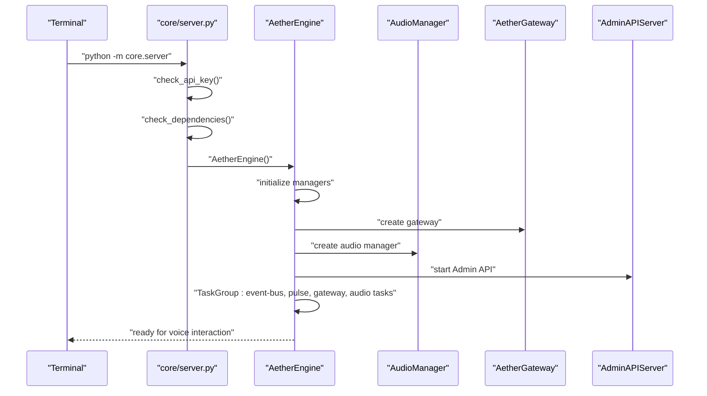
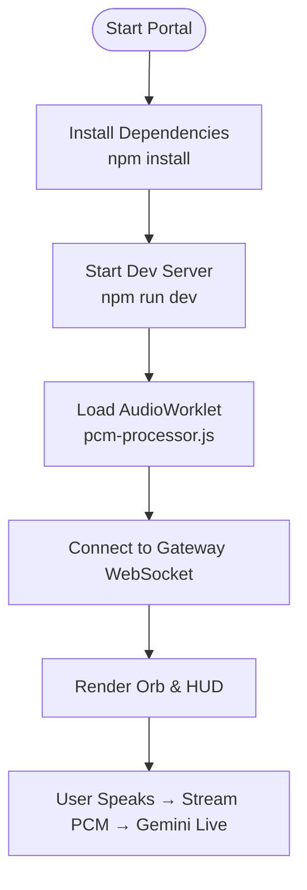

# Getting Started

<cite>
**Referenced Files in This Document**
- [README.md](file://README.md)
- [requirements.txt](file://requirements.txt)
- [pyproject.toml](file://pyproject.toml)
- [Dockerfile](file://Dockerfile)
- [docker-compose.yml](file://docker-compose.yml)
- [core/infra/config.py](file://core/infra/config.py)
- [core/server.py](file://core/server.py)
- [core/engine.py](file://core/engine.py)
- [core/logic/managers/audio.py](file://core/logic/managers/audio.py)
- [core/infra/cloud/firebase/interface.py](file://core/infra/cloud/firebase/interface.py)
- [apps/portal/package.json](file://apps/portal/package.json)
- [apps/portal/next.config.ts](file://apps/portal/next.config.ts)
- [apps/portal/public/pcm-processor.js](file://apps/portal/public/pcm-processor.js)
- [infra/scripts/generate_creds.py](file://infra/scripts/generate_creds.py)
- [docs/SKILL.md](file://docs/SKILL.md)
</cite>

## Table of Contents
1. [Introduction](#introduction)
2. [System Requirements](#system-requirements)
3. [Installation](#installation)
4. [Essential Configuration](#essential-configuration)
5. [First Run and Initial Testing](#first-run-and-initial-testing)
6. [Running the Core Engine](#running-the-core-engine)
7. [Starting the Frontend Portal](#starting-the-frontend-portal)
8. [Platform-Specific Considerations](#platform-specific-considerations)
9. [Verification Steps](#verification-steps)
10. [Troubleshooting Guide](#troubleshooting-guide)
11. [Conclusion](#conclusion)

## Introduction
This guide helps you install, configure, and run Aether Voice OS locally on Windows, macOS, and Linux. It covers:
- System requirements for Python, Node.js, and hardware
- Step-by-step installation for backend and frontend
- Environment configuration, API keys, audio devices, and optional Firebase integration
- First-run procedures, initial testing, and common troubleshooting
- Platform-specific tips and verification steps

## System Requirements
- Python: 3.11, 3.12, or 3.13
- Node.js: Required for the frontend (Next.js)
- Operating systems: Windows, macOS, Linux
- Hardware: Microphone and speakers/headphones for full experience
- Optional: Firebase credentials for persistent memory and telemetry

Key indicators from the repository:
- Python versions supported are explicitly listed in the project README badges.
- Backend dependencies include PyAudio, NumPy, Pydantic, websockets, cryptography, redis, and others.
- Frontend uses Next.js and React; the package.json lists required dependencies and scripts.
- Docker images show Python 3.11 slim base and build-time Rust toolchain for the audio DSP layer.

**Section sources**
- [README.md](file://README.md#L22-L24)
- [requirements.txt](file://requirements.txt#L1-L52)
- [apps/portal/package.json](file://apps/portal/package.json#L16-L51)
- [Dockerfile](file://Dockerfile#L32-L39)

## Installation
Follow these steps to install both backend and frontend components.

### Backend (Python)
1. Create and activate a virtual environment
   - Create: python -m venv venv
   - Activate:
     - On macOS/Linux: source venv/bin/activate
     - On Windows: venv\Scripts\activate
2. Install Python dependencies
   - pip install -r requirements.txt
3. Prepare environment configuration
   - Create a .env file with your Gemini API key
   - Example: echo 'GOOGLE_API_KEY="your_api_key"' > .env

Notes:
- The backend entrypoint script validates the presence of the API key and prints helpful instructions if missing.
- The server script loads .env automatically before importing other modules.

**Section sources**
- [README.md](file://README.md#L188-L201)
- [core/server.py](file://core/server.py#L31-L37)
- [core/server.py](file://core/server.py#L62-L84)

### Frontend (Node.js)
1. Navigate to the portal directory
   - cd apps/portal
2. Install dependencies
   - npm install
3. Start the development server
   - npm run dev

Notes:
- The frontend uses Next.js 16.1.6 and Tailwind CSS.
- The PWA plugin is configured for production builds.

**Section sources**
- [README.md](file://README.md#L203-L208)
- [apps/portal/package.json](file://apps/portal/package.json#L5-L14)
- [apps/portal/next.config.ts](file://apps/portal/next.config.ts#L1-L16)

### Optional: Docker Compose (Alternative)
- Build and run both kernel and portal containers
  - docker-compose up --build
- Exposed ports:
  - Backend: 18789 (WebSocket gateway)
  - Frontend: 3000 (Next.js dev server)
- Environment variables are passed via docker-compose for API keys and gateway URL.

**Section sources**
- [docker-compose.yml](file://docker-compose.yml#L1-L37)
- [Dockerfile](file://Dockerfile#L74-L76)

## Essential Configuration
Configure the following to run Aether Voice OS:

### API Key Setup
- Set GOOGLE_API_KEY in your environment (.env or exported)
- The server pre-flight check requires a valid API key; otherwise it exits with instructions.

**Section sources**
- [README.md](file://README.md#L196-L197)
- [core/server.py](file://core/server.py#L62-L84)

### Audio Device Configuration
- Default behavior uses the system’s default microphone and speaker.
- If you encounter “No default input device found,” set the input device index via environment variables as shown in the troubleshooting section.
- Audio sampling rates and queue sizes are defined in configuration; adjust if needed for your hardware.

**Section sources**
- [core/infra/config.py](file://core/infra/config.py#L11-L27)
- [core/logic/managers/audio.py](file://core/logic/managers/audio.py#L18-L58)
- [README.md](file://README.md#L246-L248)

### Optional Firebase Integration
- To enable persistent memory and telemetry:
  - Option A: Provide FIREBASE_CREDENTIALS_BASE64 by converting your service account JSON to Base64 using the provided script
  - Option B: Use GOOGLE_APPLICATION_CREDENTIALS pointing to your service account JSON
- The Firebase connector initializes with either method and falls back to offline mode if unavailable.

**Section sources**
- [core/infra/cloud/firebase/interface.py](file://core/infra/cloud/firebase/interface.py#L31-L61)
- [core/infra/config.py](file://core/infra/config.py#L94-L99)
- [infra/scripts/generate_creds.py](file://infra/scripts/generate_creds.py#L1-L32)

### Environment Variables Reference
- GOOGLE_API_KEY: Required for Gemini Live
- FIREBASE_CREDENTIALS_BASE64: Optional; Base64-encoded Firebase service account
- GOOGLE_APPLICATION_CREDENTIALS: Optional; path to service account JSON for Firebase
- AETHER_AUDIO_INPUT_DEVICE: Optional; override default input device index
- Additional AI and audio tuning variables are documented in the project docs

**Section sources**
- [docs/SKILL.md](file://docs/SKILL.md#L65-L77)
- [core/infra/config.py](file://core/infra/config.py#L35-L68)

## First Run and Initial Testing
After completing installation and configuration:

1. Start the backend engine
   - python -m core.server
2. Start the frontend
   - cd apps/portal && npm run dev
3. Open the browser to http://localhost:3000
4. Allow microphone permissions when prompted
5. Speak into your microphone; the portal should display ambient transcripts and the orb should react to voice energy

Verification highlights:
- Backend prints a startup banner and indicates readiness
- Frontend loads the Next.js app and registers the PCM encoder worklet for audio streaming
- Audio capture opens the default microphone and starts streaming to the gateway

**Section sources**
- [core/server.py](file://core/server.py#L40-L60)
- [apps/portal/public/pcm-processor.js](file://apps/portal/public/pcm-processor.js#L1-L17)

## Running the Core Engine
- Standalone engine entrypoint:
  - python -m core.server
- The server performs:
  - API key validation
  - Dependency checks
  - Starts the AetherEngine orchestration, Admin API, and audio subsystems

**Diagram sources**
- [core/server.py](file://core/server.py#L105-L149)
- [core/engine.py](file://core/engine.py#L26-L71)
- [core/engine.py](file://core/engine.py#L189-L225)

**Section sources**
- [core/server.py](file://core/server.py#L105-L149)
- [core/engine.py](file://core/engine.py#L189-L225)

## Starting the Frontend Portal
- From the repository root:
  - cd apps/portal
  - npm install
  - npm run dev
- The frontend:
  - Uses Next.js 16.1.6
  - Registers a Web AudioWorklet to encode PCM chunks and stream them to the gateway
  - Provides a voice-first UI with an orb, ambient transcript, and HUD

**Diagram sources**
- [apps/portal/package.json](file://apps/portal/package.json#L5-L14)
- [apps/portal/public/pcm-processor.js](file://apps/portal/public/pcm-processor.js#L1-L17)

**Section sources**
- [README.md](file://README.md#L203-L208)
- [apps/portal/public/pcm-processor.js](file://apps/portal/public/pcm-processor.js#L1-L17)

## Platform-Specific Considerations
- Windows
  - Ensure Python virtual environment is activated before installing dependencies
  - If microphone permission prompts appear, grant access in the browser and OS settings
- macOS
  - If no default input device is found, set AETHER_AUDIO_INPUT_DEVICE to the correct device index
  - The audio capture module lists available devices on error to aid selection
- Linux
  - If no microphone is detected, set AETHER_AUDIO_INPUT_DEVICE to the correct index
  - Install system audio development libraries if building PyAudio from source

Supporting evidence:
- Linux troubleshooting mentions setting AETHER_AUDIO_INPUT_DEVICE
- Audio capture raises a specific error when no default input device is found and lists available devices

**Section sources**
- [README.md](file://README.md#L246-L248)
- [core/audio/capture.py](file://core/audio/capture.py#L453-L482)
- [core/audio/capture.py](file://core/audio/capture.py#L509-L516)

## Verification Steps
Perform these checks to confirm a successful setup:

- Backend
  - Confirm the server prints the startup banner and “Engine: State Ready”
  - Verify the Admin API health endpoint is reachable at http://localhost:18790/health
- Frontend
  - Open http://localhost:3000 and accept microphone permissions
  - Observe the orb pulsing and HUD updating with audio telemetry
- Audio
  - Ensure microphone input opens without errors
  - Speak and verify PCM chunks are posted to the main thread in the worklet

**Section sources**
- [core/server.py](file://core/server.py#L40-L60)
- [core/server.py](file://core/server.py#L134-L136)
- [apps/portal/public/pcm-processor.js](file://apps/portal/public/pcm-processor.js#L53-L78)

## Troubleshooting Guide
Common issues and resolutions:

- Missing API Key
  - Symptom: Server exits with instructions to set GOOGLE_API_KEY
  - Fix: Add GOOGLE_API_KEY to .env or export it in the shell

- No Microphone Detected (Linux/macOS)
  - Symptom: “No default input device found” error
  - Fix: Set AETHER_AUDIO_INPUT_DEVICE to the correct device index; list devices via the error context

- High CPU Usage
  - Symptom: Elevated CPU consumption
  - Fix: Ensure PyAudio C extensions are compiled; reduce frontend visualizer FPS

- Firebase Not Configured
  - Symptom: Persistent memory features unavailable
  - Fix: Provide FIREBASE_CREDENTIALS_BASE64 or GOOGLE_APPLICATION_CREDENTIALS; use the provided script to generate Base64 credentials

- Port Conflicts
  - Symptom: Cannot start backend or frontend on default ports
  - Fix: Change PORT or NEXT_PUBLIC_AETHER_GATEWAY_URL in environment variables and docker-compose if applicable

**Section sources**
- [core/server.py](file://core/server.py#L62-L84)
- [README.md](file://README.md#L246-L248)
- [core/audio/capture.py](file://core/audio/capture.py#L459-L465)
- [infra/scripts/generate_creds.py](file://infra/scripts/generate_creds.py#L1-L32)

## Conclusion
You now have the fundamentals to install, configure, and run Aether Voice OS locally. Start with the backend engine, then launch the frontend portal, and iterate on audio and Firebase configuration as needed. Use the verification steps and troubleshooting guide to resolve common issues quickly.