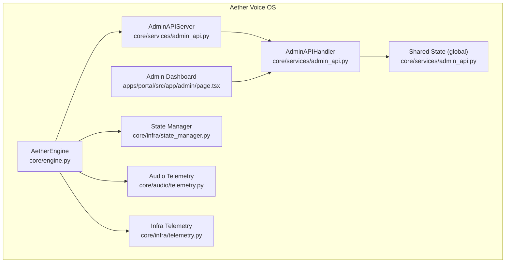
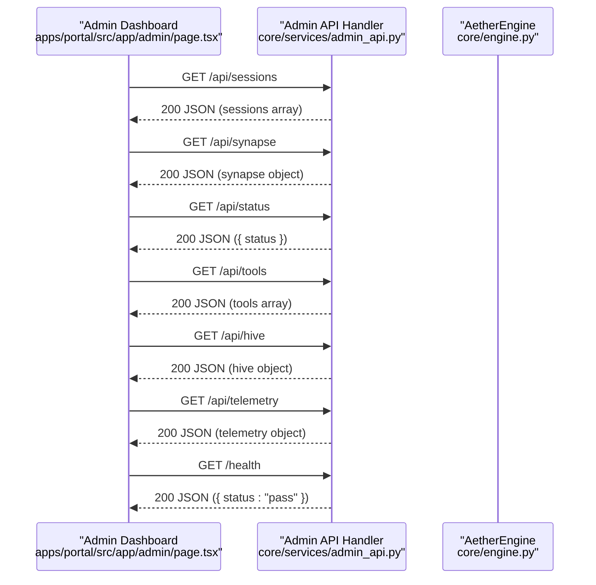
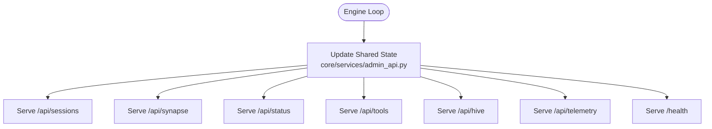
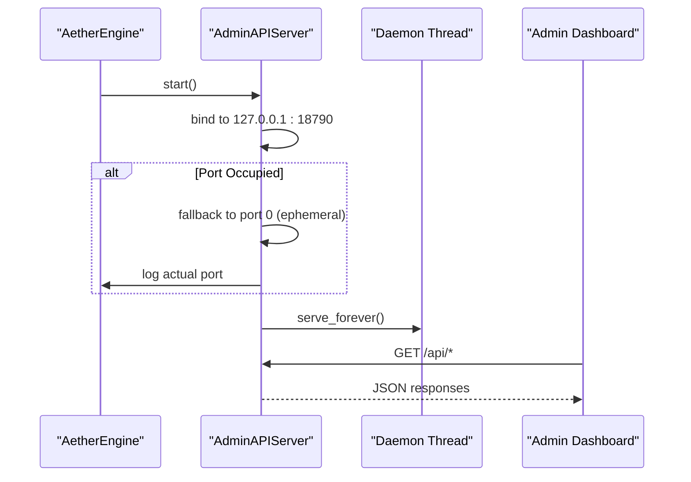
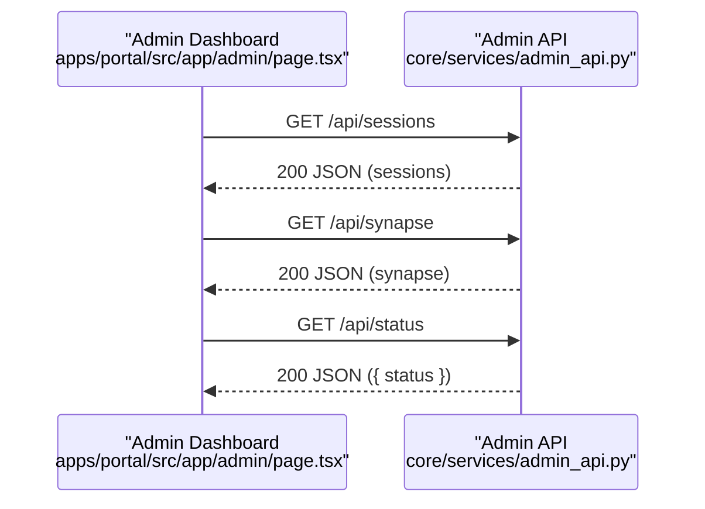
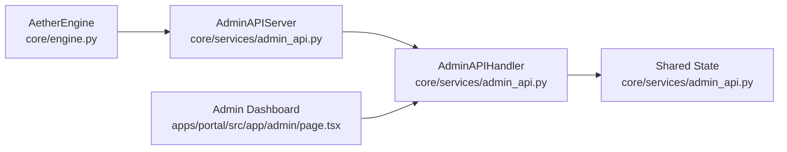

# Admin API

<cite>
**Referenced Files in This Document**
- [admin_api.py](file://core/services/admin_api.py)
- [engine.py](file://core/engine.py)
- [page.tsx](file://apps/portal/src/app/admin/page.tsx)
- [server.py](file://core/server.py)
- [state_manager.py](file://core/infra/state_manager.py)
- [telemetry.py](file://core/audio/telemetry.py)
- [telemetry.py](file://core/infra/telemetry.py)
- [useAetherGateway.ts](file://apps/portal/src/hooks/useAetherGateway.ts)
</cite>

## Table of Contents
1. [Introduction](#introduction)
2. [Project Structure](#project-structure)
3. [Core Components](#core-components)
4. [Architecture Overview](#architecture-overview)
5. [Detailed Component Analysis](#detailed-component-analysis)
6. [Dependency Analysis](#dependency-analysis)
7. [Performance Considerations](#performance-considerations)
8. [Troubleshooting Guide](#troubleshooting-guide)
9. [Conclusion](#conclusion)
10. [Appendices](#appendices)

## Introduction
This document provides comprehensive API documentation for the Admin API service in Aether Voice OS. It covers the REST endpoints exposed by the Admin API, their HTTP methods, request/response formats, and the shared state model that feeds the admin interface. It also documents CORS configuration, error handling, the health check endpoint, threading model, port allocation, fallback mechanisms, security considerations, rate limiting, operational monitoring, integration patterns, and troubleshooting guidance.

## Project Structure
The Admin API is a lightweight HTTP server embedded in the Aether Voice OS engine. It runs locally on the loopback interface and serves JSON data consumed by the Next.js Admin Dashboard.

**Diagram sources**
- [admin_api.py](file://core/services/admin_api.py#L88-L117)
- [engine.py](file://core/engine.py#L59-L205)
- [page.tsx](file://apps/portal/src/app/admin/page.tsx#L12-L37)
- [state_manager.py](file://core/infra/state_manager.py#L46-L99)
- [telemetry.py](file://core/audio/telemetry.py#L21-L93)
- [telemetry.py](file://core/infra/telemetry.py#L14-L130)

**Section sources**
- [admin_api.py](file://core/services/admin_api.py#L1-L117)
- [engine.py](file://core/engine.py#L59-L205)
- [page.tsx](file://apps/portal/src/app/admin/page.tsx#L12-L37)

## Core Components
- Admin API HTTP server: A minimal HTTP server that exposes endpoints for sessions, synapse, status, tools, hive, telemetry, and health.
- Shared state: A global dictionary holding the latest snapshots of runtime data served by the Admin API.
- Admin API handler: A BaseHTTPRequestHandler subclass implementing GET routes and CORS headers.
- Admin API server: A wrapper around the HTTP server with threading and fallback port allocation.
- Engine integration: The AetherEngine initializes and starts the Admin API during startup.

Key behaviors:
- All endpoints return JSON and include Access-Control-Allow-Origin: * for GET and OPTIONS.
- The health endpoint returns a simple pass/fail indicator.
- The server listens on localhost only and does not implement rate limiting or authentication.

**Section sources**
- [admin_api.py](file://core/services/admin_api.py#L15-L82)
- [admin_api.py](file://core/services/admin_api.py#L88-L117)
- [engine.py](file://core/engine.py#L59-L205)

## Architecture Overview
The Admin API is a thin layer that serves pre-populated shared state to the Admin Dashboard. The engine periodically updates the shared state, which the Admin API simply reflects back to clients.

**Diagram sources**
- [admin_api.py](file://core/services/admin_api.py#L37-L73)
- [page.tsx](file://apps/portal/src/app/admin/page.tsx#L12-L37)

## Detailed Component Analysis

### Endpoint Definitions and Contracts

- Endpoint: /api/sessions
  - Method: GET
  - Response: JSON array representing recent sessions
  - Notes: Consumed by the Admin Dashboard to render session cards.

- Endpoint: /api/synapse
  - Method: GET
  - Response: JSON object containing synapse metadata (e.g., status, counts, last heartbeat)
  - Notes: Used by the Admin Dashboard to display L2 Synapse node status.

- Endpoint: /api/status
  - Method: GET
  - Response: JSON object with a single status field
  - Notes: Indicates engine/system status for the dashboard header.

- Endpoint: /api/tools
  - Method: GET
  - Response: JSON array listing tools
  - Notes: Provides tool inventory for administrative visibility.

- Endpoint: /api/hive
  - Method: GET
  - Response: JSON object representing hive state
  - Notes: Reflects hive memory and agent-related state.

- Endpoint: /api/telemetry
  - Method: GET
  - Response: JSON object containing telemetry data
  - Notes: Supplies telemetry snapshots for analytics panels.

- Endpoint: /health
  - Method: GET
  - Response: JSON object indicating health status
  - Notes: Used by monitoring systems to verify service availability.

**Section sources**
- [admin_api.py](file://core/services/admin_api.py#L37-L73)
- [page.tsx](file://apps/portal/src/app/admin/page.tsx#L12-L37)

### Shared State Management
The Admin API relies on a global shared state dictionary that is populated by the engine. The engine coordinates subsystems and updates the shared state snapshot at intervals. The Admin API handler simply returns whatever is currently in the shared state.

**Diagram sources**
- [admin_api.py](file://core/services/admin_api.py#L15-L23)
- [admin_api.py](file://core/services/admin_api.py#L37-L73)

**Section sources**
- [admin_api.py](file://core/services/admin_api.py#L15-L23)
- [admin_api.py](file://core/services/admin_api.py#L37-L73)

### CORS Configuration
The Admin API sets the following headers for all responses:
- Access-Control-Allow-Origin: *
- Access-Control-Allow-Methods: GET, OPTIONS
- Content-Type: application/json

This enables browser-based dashboards to consume the API without cross-origin restrictions.

**Section sources**
- [admin_api.py](file://core/services/admin_api.py#L27-L31)

### Error Handling
- Not Found: Any path other than the documented endpoints returns HTTP 404 with a JSON error body.
- Health: The /health endpoint returns a simple pass/fail JSON body.
- Logging: The handler suppresses default HTTP logging to reduce noise.

**Section sources**
- [admin_api.py](file://core/services/admin_api.py#L75-L81)
- [admin_api.py](file://core/services/admin_api.py#L70-L73)
- [admin_api.py](file://core/services/admin_api.py#L66-L69)

### Threading Model and Port Allocation
- Threading: The Admin API server runs in a dedicated daemon thread, allowing the main loop to continue without blocking.
- Port: Defaults to 18790. If the port is already in use, the server falls back to a dynamically allocated ephemeral port and logs the actual port used.
- Binding: The server binds to 127.0.0.1 only (localhost), ensuring no external exposure.

**Diagram sources**
- [admin_api.py](file://core/services/admin_api.py#L94-L109)
- [engine.py](file://core/engine.py#L204-L205)

**Section sources**
- [admin_api.py](file://core/services/admin_api.py#L88-L117)
- [engine.py](file://core/engine.py#L204-L205)

### Security Considerations
- Scope: The Admin API is designed for local administration only and listens on localhost.
- Authentication: No authentication or authorization is implemented.
- Rate Limiting: Not implemented.
- Recommendations:
  - Keep the Admin API bound to localhost.
  - Do not expose it to untrusted networks.
  - Consider adding basic auth or token-based auth if exposing externally.
  - Apply network-level controls (e.g., firewall rules) to restrict access.

**Section sources**
- [admin_api.py](file://core/services/admin_api.py#L96-L103)

### Operational Monitoring
- Health endpoint: /health returns a pass/fail indicator suitable for uptime checks.
- Logging: The handler disables default HTTP logging to reduce noise; engine-level logs indicate startup and port allocation.
- Telemetry: While not part of the Admin API itself, the engine integrates audio and infrastructure telemetry that can be correlated with Admin API usage.

**Section sources**
- [admin_api.py](file://core/services/admin_api.py#L66-L69)
- [admin_api.py](file://core/services/admin_api.py#L75-L81)
- [engine.py](file://core/engine.py#L134-L136)

### Integration Patterns
- Admin Dashboard consumption:
  - The dashboard performs concurrent fetches to /api/sessions, /api/synapse, and /api/status.
  - It polls at a fixed interval and updates UI state accordingly.
- Gateway integration:
  - The Admin Dashboard also consumes a separate WebSocket-based gateway for real-time audio and telemetry, distinct from the Admin API.

**Diagram sources**
- [page.tsx](file://apps/portal/src/app/admin/page.tsx#L12-L37)
- [admin_api.py](file://core/services/admin_api.py#L37-L51)

**Section sources**
- [page.tsx](file://apps/portal/src/app/admin/page.tsx#L12-L37)
- [useAetherGateway.ts](file://apps/portal/src/hooks/useAetherGateway.ts#L67-L119)

## Dependency Analysis
The Admin API is decoupled from most engine internals. It depends on:
- A shared state dictionary updated by the engine loop.
- The Python standard library’s HTTP server for serving requests.

**Diagram sources**
- [engine.py](file://core/engine.py#L59-L205)
- [admin_api.py](file://core/services/admin_api.py#L88-L117)
- [page.tsx](file://apps/portal/src/app/admin/page.tsx#L12-L37)

**Section sources**
- [engine.py](file://core/engine.py#L59-L205)
- [admin_api.py](file://core/services/admin_api.py#L88-L117)

## Performance Considerations
- Polling cadence: The Admin Dashboard polls endpoints every 2 seconds. Adjust polling based on UI responsiveness needs and server load.
- JSON serialization: Responses are simple JSON dumps of the shared state. Keep shared state structures lean to minimize payload sizes.
- Concurrency: The Admin API handler is single-threaded. For higher concurrency, consider a proper web framework with async support.
- Logging: Default HTTP logging is disabled to reduce overhead.

[No sources needed since this section provides general guidance]

## Troubleshooting Guide
Common issues and resolutions:
- Port already in use:
  - Symptom: Startup warning about port 18790 being occupied.
  - Resolution: The server falls back to an ephemeral port; check logs for the actual port used.
- No data in dashboard:
  - Symptom: Empty sessions, synapse, or telemetry panels.
  - Resolution: Verify the engine is running and populating shared state; confirm the Admin API is started.
- CORS errors in browsers:
  - Symptom: Cross-origin request blocked.
  - Resolution: The Admin API sets permissive CORS headers; ensure the client is fetching from the expected origin/port.
- Health check failures:
  - Symptom: Monitoring systems report failing health.
  - Resolution: Confirm the /health endpoint responds with a 200 status and JSON body.

Operational tips:
- Review engine logs for port allocation and Admin API startup messages.
- Validate that the Admin Dashboard is polling the correct localhost port.

**Section sources**
- [admin_api.py](file://core/services/admin_api.py#L96-L103)
- [admin_api.py](file://core/services/admin_api.py#L66-L69)
- [server.py](file://core/server.py#L134-L136)

## Conclusion
The Admin API provides a simple, local-only REST interface for the Aether Voice OS Admin Dashboard. It serves pre-populated shared state with minimal overhead and no built-in authentication or rate limiting. Proper operation depends on the engine keeping the shared state current and the Admin Dashboard polling the endpoints at a suitable cadence.

[No sources needed since this section summarizes without analyzing specific files]

## Appendices

### Endpoint Reference Summary
- GET /api/sessions: Returns sessions array
- GET /api/synapse: Returns synapse object
- GET /api/status: Returns { status }
- GET /api/tools: Returns tools array
- GET /api/hive: Returns hive object
- GET /api/telemetry: Returns telemetry object
- GET /health: Returns { status: "pass" }

**Section sources**
- [admin_api.py](file://core/services/admin_api.py#L37-L73)

### Example API Consumption (Integration)
- Admin Dashboard fetches multiple endpoints concurrently and updates UI state on success.
- The gateway integration uses a separate WebSocket channel for real-time audio and telemetry.

**Section sources**
- [page.tsx](file://apps/portal/src/app/admin/page.tsx#L12-L37)
- [useAetherGateway.ts](file://apps/portal/src/hooks/useAetherGateway.ts#L67-L119)