# Infrastructure and Services

<cite>
**Referenced Files in This Document**
- [config.py](file://core/infra/config.py)
- [admin_api.py](file://core/services/admin_api.py)
- [watchdog.py](file://core/services/watchdog.py)
- [lifecycle.py](file://core/infra/lifecycle.py)
- [state_manager.py](file://core/infra/state_manager.py)
- [interface.py](file://core/infra/cloud/firebase/interface.py)
- [telemetry.py](file://core/infra/telemetry.py)
- [event_bus.py](file://core/infra/event_bus.py)
- [gateway.py](file://core/infra/transport/gateway.py)
- [bus.py](file://core/infra/transport/bus.py)
- [session_state.py](file://core/infra/transport/session_state.py)
- [messages.py](file://core/infra/transport/messages.py)
- [registry.py](file://core/services/registry.py)
- [infra.py](file://core/logic/managers/infra.py)
- [engine.py](file://core/engine.py)
</cite>

## Table of Contents
1. [Introduction](#introduction)
2. [Project Structure](#project-structure)
3. [Core Components](#core-components)
4. [Architecture Overview](#architecture-overview)
5. [Detailed Component Analysis](#detailed-component-analysis)
6. [Dependency Analysis](#dependency-analysis)
7. [Performance Considerations](#performance-considerations)
8. [Troubleshooting Guide](#troubleshooting-guide)
9. [Conclusion](#conclusion)
10. [Appendices](#appendices)

## Introduction
This document describes the infrastructure and services layer of Aether Voice OS. It covers configuration management, cloud integration, transport and gateway services, event bus and state management, telemetry and observability, watchdog-based health monitoring and recovery, lifecycle orchestration, and operational guidance for deployment, scaling, and maintenance.

## Project Structure
The infrastructure and services layer spans several modules:
- Configuration and environment handling
- Transport and gateway for client connections
- Event bus and state machines for coordination
- Cloud persistence and telemetry
- Admin API for monitoring and control
- Watchdog for autonomous health checks and recovery
- Lifecycle manager for startup/shutdown orchestration
- Package registry for dynamic skill loading

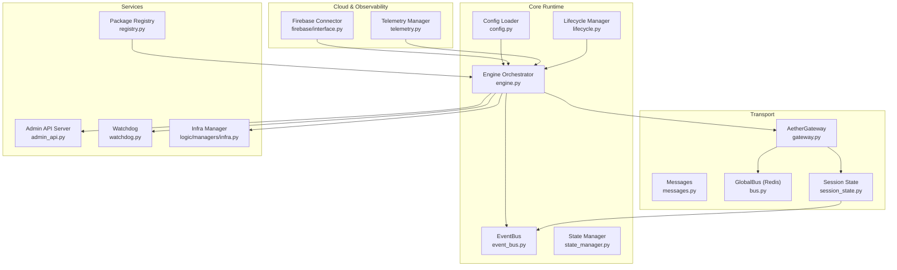

**Diagram sources**
- [engine.py](file://core/engine.py#L26-L110)
- [config.py](file://core/infra/config.py#L85-L110)
- [event_bus.py](file://core/infra/event_bus.py#L69-L152)
- [gateway.py](file://core/infra/transport/gateway.py#L69-L153)
- [bus.py](file://core/infra/transport/bus.py#L25-L200)
- [session_state.py](file://core/infra/transport/session_state.py#L71-L120)
- [interface.py](file://core/infra/cloud/firebase/interface.py#L15-L61)
- [telemetry.py](file://core/infra/telemetry.py#L14-L76)
- [admin_api.py](file://core/services/admin_api.py#L88-L117)
- [watchdog.py](file://core/services/watchdog.py#L39-L94)
- [registry.py](file://core/services/registry.py#L44-L125)
- [infra.py](file://core/logic/managers/infra.py#L11-L47)
- [lifecycle.py](file://core/infra/lifecycle.py#L10-L86)

**Section sources**
- [engine.py](file://core/engine.py#L26-L110)
- [config.py](file://core/infra/config.py#L85-L110)
- [gateway.py](file://core/infra/transport/gateway.py#L69-L153)
- [bus.py](file://core/infra/transport/bus.py#L25-L200)
- [session_state.py](file://core/infra/transport/session_state.py#L71-L120)
- [interface.py](file://core/infra/cloud/firebase/interface.py#L15-L61)
- [telemetry.py](file://core/infra/telemetry.py#L14-L76)
- [admin_api.py](file://core/services/admin_api.py#L88-L117)
- [watchdog.py](file://core/services/watchdog.py#L39-L94)
- [registry.py](file://core/services/registry.py#L44-L125)
- [infra.py](file://core/logic/managers/infra.py#L11-L47)
- [lifecycle.py](file://core/infra/lifecycle.py#L10-L86)

## Core Components
- Configuration and Environment
  - Centralized configuration loader with environment-backed settings, nested keys, and JSON fallback.
  - Firebase credentials decoding for secure cloud connectivity.
- Transport and Gateway
  - WebSocket-based gateway with challenge-response authentication, capability negotiation, heartbeat, and session lifecycle management.
  - Session state machine with atomic transitions and persistence to the Global Bus.
- Event Bus and State Management
  - Tiered event bus with audio/control/telemetry lanes, expiration-aware routing, and subscriber dispatch.
  - System state machine enforcing allowed transitions and broadcasting control events.
- Cloud Integration and Telemetry
  - Firebase connector for sessions, messages, metrics, knowledge, and repair logs.
  - Telemetry sink exporting traces via OTLP to Arize/Phoenix with token usage recording.
- Admin API and Watchdog
  - Local Admin API server exposing system state and telemetry for the admin dashboard.
  - Autonomous watchdog monitoring logs and triggering healing actions.
- Lifecycle Orchestration
  - Deterministic boot and shutdown sequences with signal handling and graceful teardown.
- Package Registry
  - Dynamic discovery and hot-reload of .ath packages with semantic indexing.

**Section sources**
- [config.py](file://core/infra/config.py#L113-L158)
- [gateway.py](file://core/infra/transport/gateway.py#L320-L507)
- [session_state.py](file://core/infra/transport/session_state.py#L71-L120)
- [event_bus.py](file://core/infra/event_bus.py#L69-L152)
- [state_manager.py](file://core/infra/state_manager.py#L46-L95)
- [interface.py](file://core/infra/cloud/firebase/interface.py#L15-L61)
- [telemetry.py](file://core/infra/telemetry.py#L14-L76)
- [admin_api.py](file://core/services/admin_api.py#L88-L117)
- [watchdog.py](file://core/services/watchdog.py#L39-L94)
- [lifecycle.py](file://core/infra/lifecycle.py#L10-L86)
- [registry.py](file://core/services/registry.py#L44-L125)

## Architecture Overview
The system is built around an event-driven architecture with a central EventBus and a Global Bus for distributed state and pub/sub. The AetherGateway manages client sessions, integrates with the Global Bus for multi-node synchronization, and coordinates with the State Manager and Session State Manager. Cloud services (Firebase) provide persistence and telemetry, while the Admin API and Watchdog support monitoring and autonomous recovery.

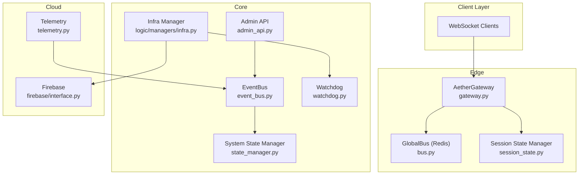

**Diagram sources**
- [gateway.py](file://core/infra/transport/gateway.py#L320-L507)
- [bus.py](file://core/infra/transport/bus.py#L25-L200)
- [session_state.py](file://core/infra/transport/session_state.py#L71-L120)
- [event_bus.py](file://core/infra/event_bus.py#L69-L152)
- [state_manager.py](file://core/infra/state_manager.py#L46-L95)
- [infra.py](file://core/logic/managers/infra.py#L11-L47)
- [watchdog.py](file://core/services/watchdog.py#L39-L94)
- [admin_api.py](file://core/services/admin_api.py#L88-L117)
- [interface.py](file://core/infra/cloud/firebase/interface.py#L15-L61)
- [telemetry.py](file://core/infra/telemetry.py#L14-L76)

## Detailed Component Analysis

### Configuration Management
- Loads environment variables with nested keys and JSON fallback.
- Provides typed configuration models for audio, AI, and gateway settings.
- Handles Base64-encoded Firebase credentials for secure cloud integration.

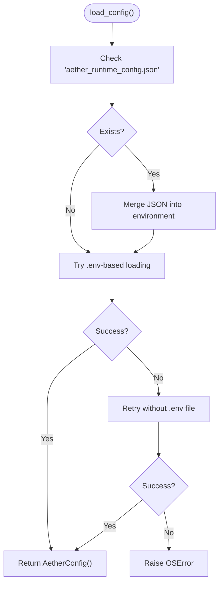

**Diagram sources**
- [config.py](file://core/infra/config.py#L113-L158)

**Section sources**
- [config.py](file://core/infra/config.py#L85-L158)

### Transport and Gateway
- Implements WebSocket handshake with Ed25519 or JWT verification.
- Manages audio input/output queues and routes binary chunks to the session.
- Maintains session state machine with transitions and persistence to Redis via Global Bus.
- Broadcasts ticks and health signals to clients; prunes dead connections.

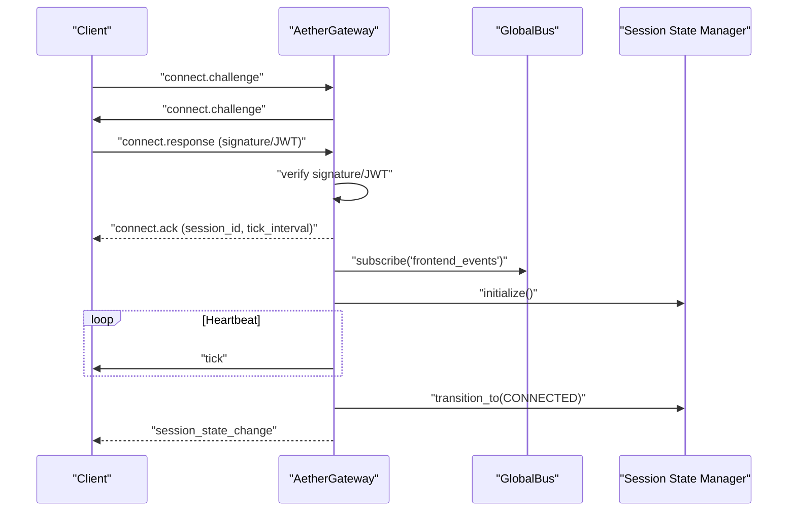

**Diagram sources**
- [gateway.py](file://core/infra/transport/gateway.py#L529-L617)
- [messages.py](file://core/infra/transport/messages.py#L16-L80)
- [bus.py](file://core/infra/transport/bus.py#L110-L128)
- [session_state.py](file://core/infra/transport/session_state.py#L120-L162)

**Section sources**
- [gateway.py](file://core/infra/transport/gateway.py#L529-L617)
- [messages.py](file://core/infra/transport/messages.py#L16-L80)
- [session_state.py](file://core/infra/transport/session_state.py#L120-L162)
- [bus.py](file://core/infra/transport/bus.py#L110-L128)

### Event Bus and State Machines
- EventBus routes events by tier, enforces deadlines, and dispatches to subscribers concurrently.
- System State Manager validates transitions and publishes control events.
- Session State Manager ensures atomic state changes, persists snapshots to Redis, and supports recovery.

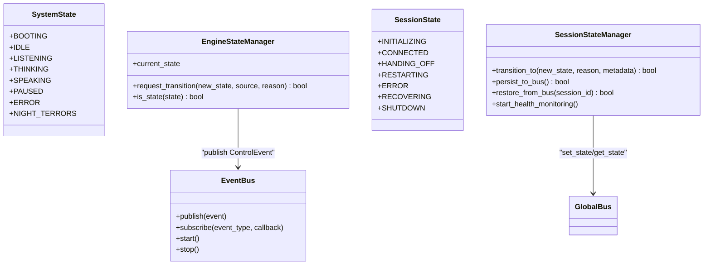

**Diagram sources**
- [event_bus.py](file://core/infra/event_bus.py#L69-L152)
- [state_manager.py](file://core/infra/state_manager.py#L46-L95)
- [session_state.py](file://core/infra/transport/session_state.py#L71-L120)

**Section sources**
- [event_bus.py](file://core/infra/event_bus.py#L69-L152)
- [state_manager.py](file://core/infra/state_manager.py#L46-L95)
- [session_state.py](file://core/infra/transport/session_state.py#L71-L120)

### Cloud Integration and Telemetry
- FirebaseConnector initializes app with Base64 credentials or default credentials, starts sessions, logs messages and metrics, and records repairs.
- TelemetryManager exports traces via OTLP to Arize/Phoenix, sets usage attributes, and provides a global singleton.

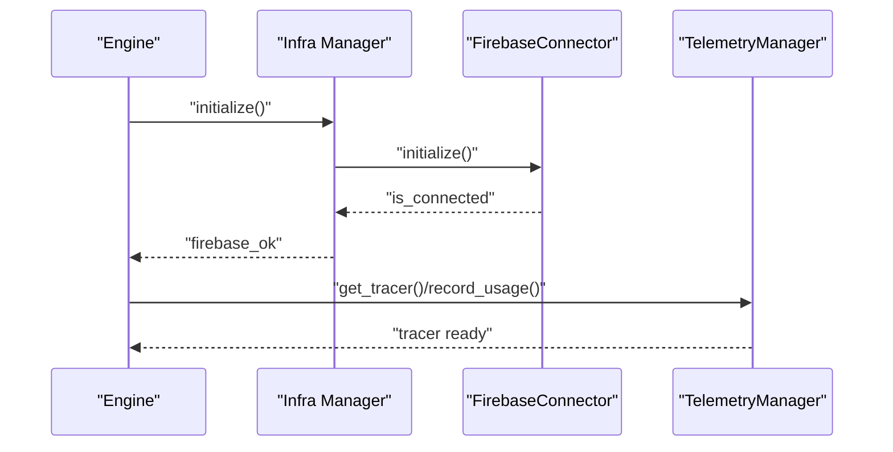

**Diagram sources**
- [infra.py](file://core/logic/managers/infra.py#L22-L31)
- [interface.py](file://core/infra/cloud/firebase/interface.py#L31-L60)
- [telemetry.py](file://core/infra/telemetry.py#L35-L76)

**Section sources**
- [interface.py](file://core/infra/cloud/firebase/interface.py#L31-L60)
- [telemetry.py](file://core/infra/telemetry.py#L35-L76)
- [infra.py](file://core/logic/managers/infra.py#L22-L31)

### Admin API and Monitoring
- AdminAPIServer exposes a lightweight REST API on localhost for the admin dashboard, serving shared state snapshots.
- AdminAPIHandler routes endpoints for sessions, synapse, status, tools, hive, telemetry, and health checks.

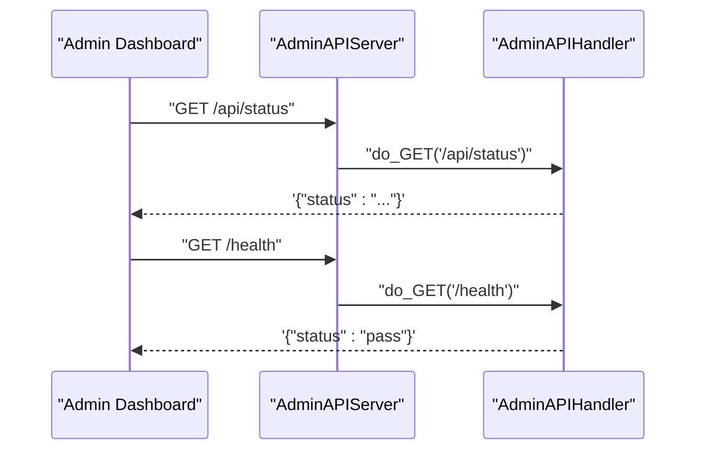

**Diagram sources**
- [admin_api.py](file://core/services/admin_api.py#L26-L82)

**Section sources**
- [admin_api.py](file://core/services/admin_api.py#L26-L82)

### Watchdog and Health Monitoring
- SREWatchdog installs a logging handler to intercept ERROR+ logs, throttles alerts, publishes health alerts to the Global Bus, and executes healing actions.
- Healing registry maps failure patterns to recovery routines (e.g., bus reconnect, system failure diagnosis).

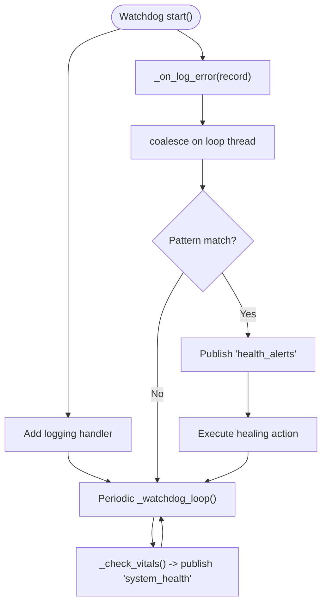

**Diagram sources**
- [watchdog.py](file://core/services/watchdog.py#L74-L168)
- [bus.py](file://core/infra/transport/bus.py#L96-L108)

**Section sources**
- [watchdog.py](file://core/services/watchdog.py#L74-L168)
- [bus.py](file://core/infra/transport/bus.py#L96-L108)

### Lifecycle Management
- LifecycleManager orchestrates boot and shutdown sequences, initializes the EventBus and state manager, and handles OS signals.

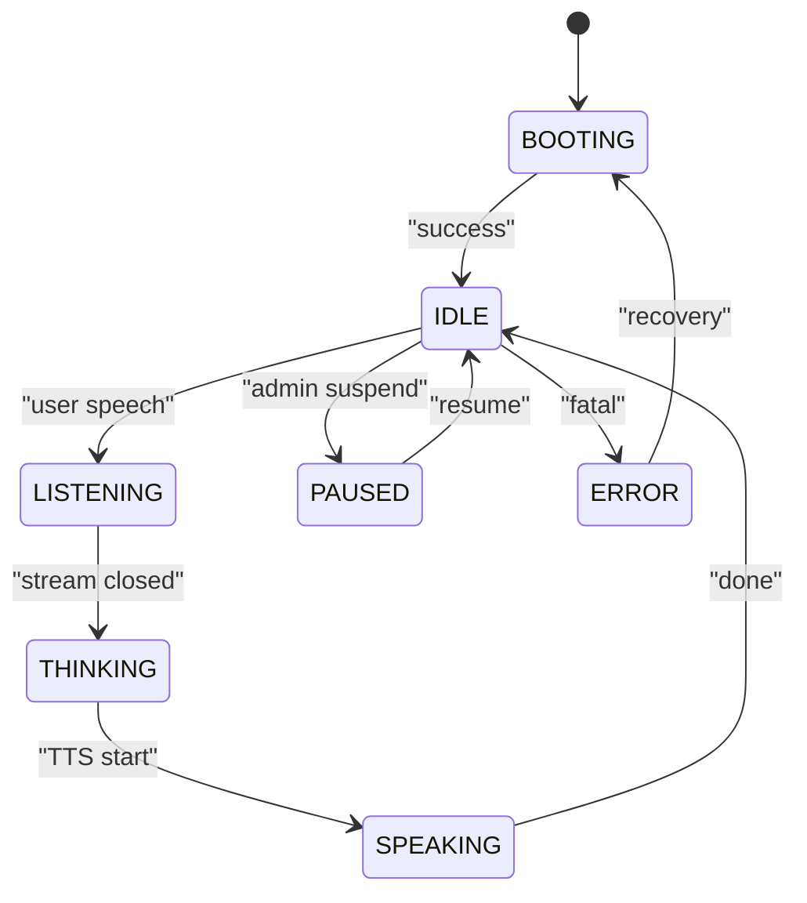

**Diagram sources**
- [lifecycle.py](file://core/infra/lifecycle.py#L21-L86)
- [state_manager.py](file://core/infra/state_manager.py#L14-L38)

**Section sources**
- [lifecycle.py](file://core/infra/lifecycle.py#L21-L86)
- [state_manager.py](file://core/infra/state_manager.py#L14-L38)

### Package Registry and Extension
- AetherRegistry scans a packages directory, validates manifests, supports hot-reload via watchdog, and provides semantic search for experts.

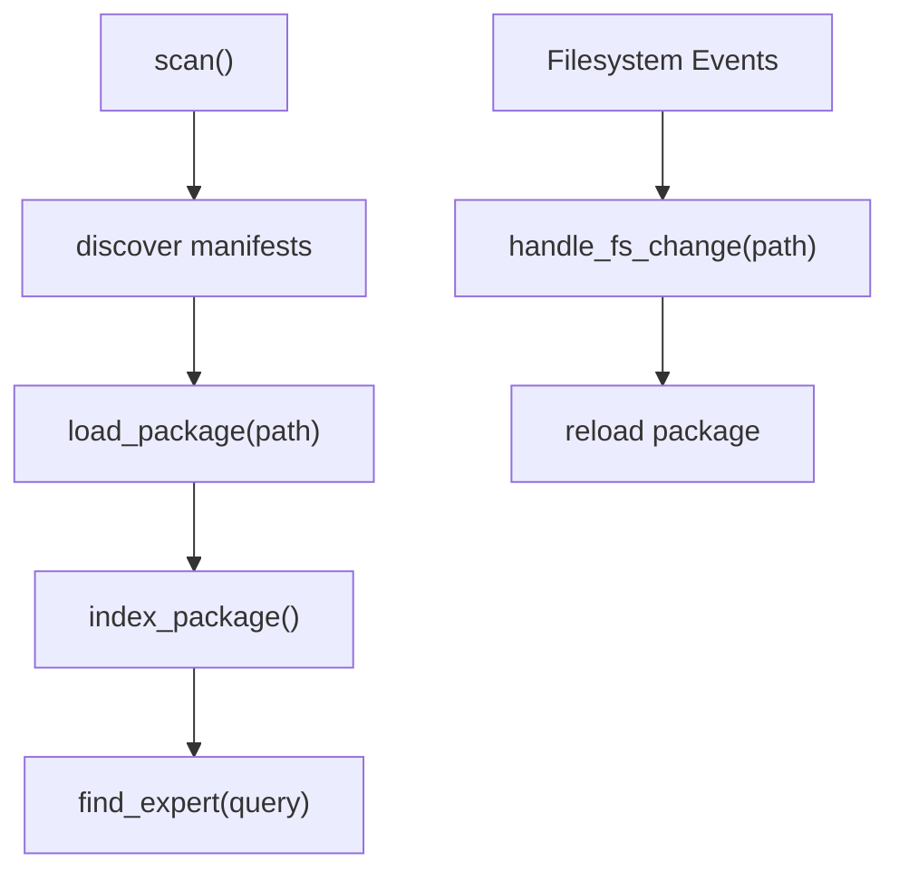

**Diagram sources**
- [registry.py](file://core/services/registry.py#L64-L125)
- [registry.py](file://core/services/registry.py#L202-L246)

**Section sources**
- [registry.py](file://core/services/registry.py#L64-L125)
- [registry.py](file://core/services/registry.py#L202-L246)

## Dependency Analysis
- Coupling
  - Gateway depends on GlobalBus for distributed state and pub/sub, and on Session State Manager for lifecycle control.
  - Infra Manager depends on FirebaseConnector and SREWatchdog.
  - Engine orchestrates EventBus, Gateway, Admin API, Watchdog, Infra Manager, and lifecycle.
- Cohesion
  - Each module encapsulates a focused responsibility: transport, state, cloud, telemetry, monitoring, lifecycle, and registry.
- External Dependencies
  - Redis for Global Bus, Firebase Admin SDK for cloud persistence, OpenTelemetry for tracing, websockets for transport.

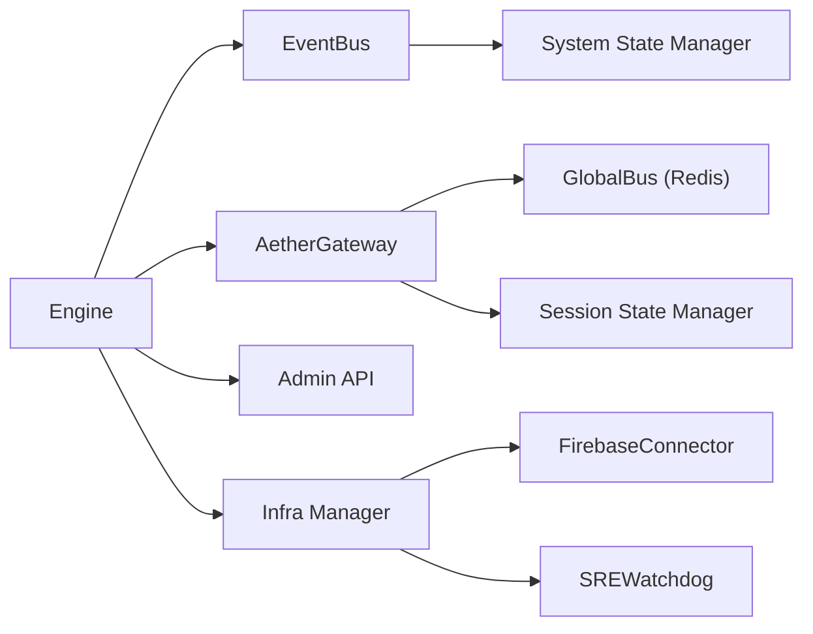

**Diagram sources**
- [engine.py](file://core/engine.py#L26-L110)
- [gateway.py](file://core/infra/transport/gateway.py#L69-L153)
- [bus.py](file://core/infra/transport/bus.py#L25-L200)
- [session_state.py](file://core/infra/transport/session_state.py#L71-L120)
- [event_bus.py](file://core/infra/event_bus.py#L69-L152)
- [state_manager.py](file://core/infra/state_manager.py#L46-L95)
- [infra.py](file://core/logic/managers/infra.py#L11-L47)
- [interface.py](file://core/infra/cloud/firebase/interface.py#L15-L61)
- [watchdog.py](file://core/services/watchdog.py#L39-L94)
- [admin_api.py](file://core/services/admin_api.py#L88-L117)

**Section sources**
- [engine.py](file://core/engine.py#L26-L110)
- [gateway.py](file://core/infra/transport/gateway.py#L69-L153)
- [bus.py](file://core/infra/transport/bus.py#L25-L200)
- [session_state.py](file://core/infra/transport/session_state.py#L71-L120)
- [event_bus.py](file://core/infra/event_bus.py#L69-L152)
- [state_manager.py](file://core/infra/state_manager.py#L46-L95)
- [infra.py](file://core/logic/managers/infra.py#L11-L47)
- [interface.py](file://core/infra/cloud/firebase/interface.py#L15-L61)
- [watchdog.py](file://core/services/watchdog.py#L39-L94)
- [admin_api.py](file://core/services/admin_api.py#L88-L117)

## Performance Considerations
- Event Bus
  - Three-tier queues prevent priority inversion; dropping expired events preserves responsiveness.
- Gateway
  - Heartbeat pruning prevents resource leaks; binary routing avoids blocking.
- Telemetry
  - BatchSpanProcessor in production reduces overhead; SimpleSpanProcessor for development.
- Cloud
  - Async I/O and thread-offloaded writes minimize latency; Base64 credentials reduce config complexity.
- State Persistence
  - Snapshots and TTL-based keys ensure timely cleanup and recovery.

[No sources needed since this section provides general guidance]

## Troubleshooting Guide
- Admin API Port Occupancy
  - The Admin API attempts dynamic port allocation if the configured port is taken.
  - Verify the actual port in logs after startup.
- Firebase Connectivity
  - If credentials are missing or invalid, Firebase initializes in offline mode; sessions are not persisted.
  - Confirm Base64 credentials and environment variables.
- Watchdog Alerts
  - Excessive alerts may be throttled; inspect logs for recurring patterns.
  - Healing actions include bus reconnection and autonomous diagnosis; verify Global Bus availability.
- Gateway Handshake Failures
  - Validate JWT secret or Ed25519 public key; ensure client capability negotiation aligns with server expectations.
- Session State Stalls
  - Health monitor transitions to recovery or shutdown after repeated errors; check logs for root cause.
- Telemetry Export
  - Ensure Arize endpoint and credentials are set; fallback to no-op tracer if export fails.

**Section sources**
- [admin_api.py](file://core/services/admin_api.py#L94-L109)
- [interface.py](file://core/infra/cloud/firebase/interface.py#L31-L60)
- [watchdog.py](file://core/services/watchdog.py#L128-L168)
- [gateway.py](file://core/infra/transport/gateway.py#L559-L617)
- [session_state.py](file://core/infra/transport/session_state.py#L378-L426)
- [telemetry.py](file://core/infra/telemetry.py#L35-L76)

## Conclusion
Aether Voice OS infrastructure combines a robust event-driven core, resilient transport and state management, cloud-native persistence and telemetry, autonomous monitoring, and lifecycle orchestration. The modular design enables extension, monitoring, and reliable operation across diverse deployment scenarios.

[No sources needed since this section summarizes without analyzing specific files]

## Appendices

### Deployment Considerations
- Environment Variables
  - Configure logging level, package directory, and cloud credentials via environment or JSON fallback.
  - Set Redis host/port for Global Bus and Arize endpoint/API key for telemetry.
- Scaling Strategies
  - Horizontal scale Gateways behind a load balancer; use Redis for state synchronization.
  - Separate Admin API and Watchdog into dedicated processes or containers.
- Operational Best Practices
  - Monitor Admin API health endpoint and Watchdog logs.
  - Enable telemetry in production; use batch processors for throughput.
  - Maintain package registry directory with proper permissions for hot-reload.

[No sources needed since this section provides general guidance]