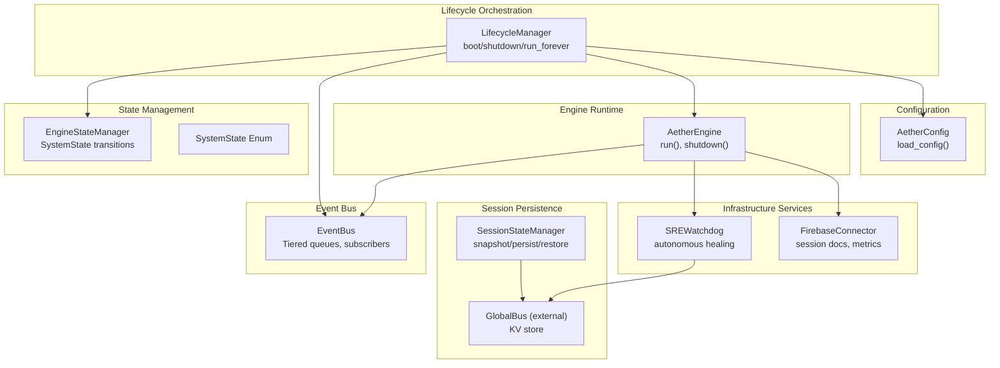
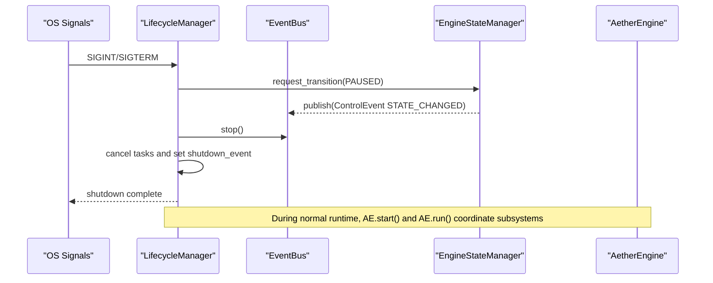
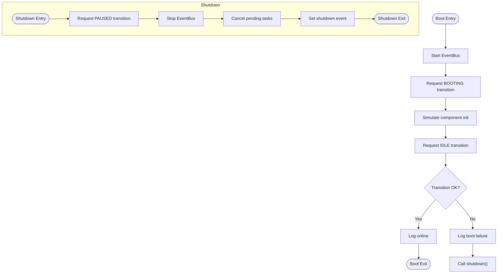
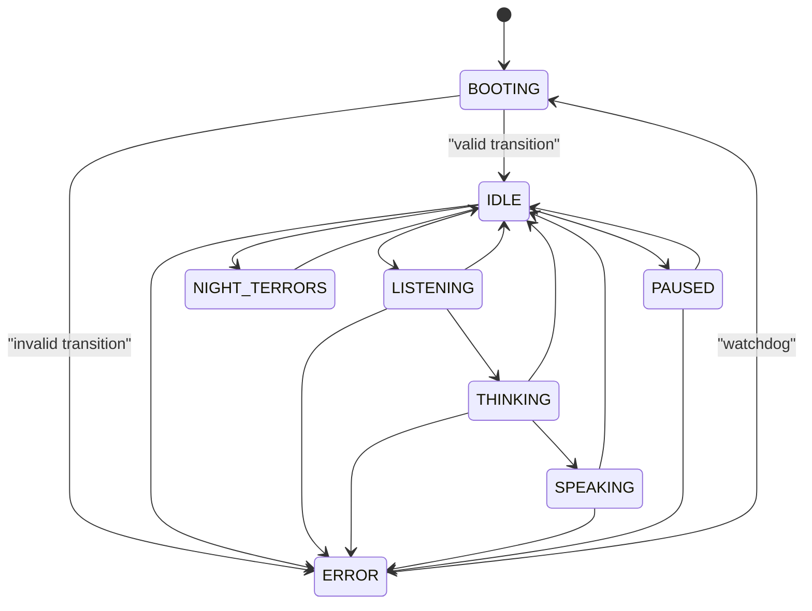
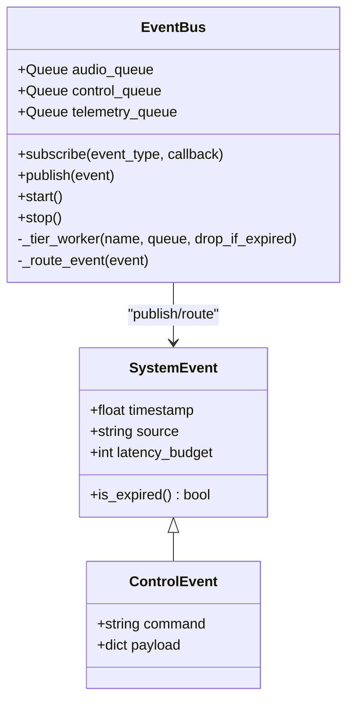
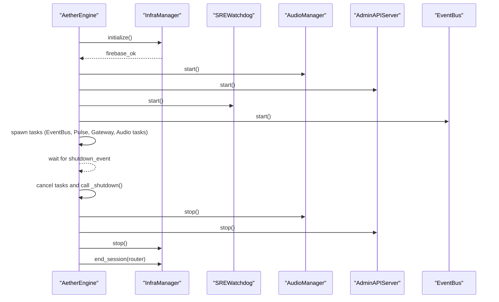
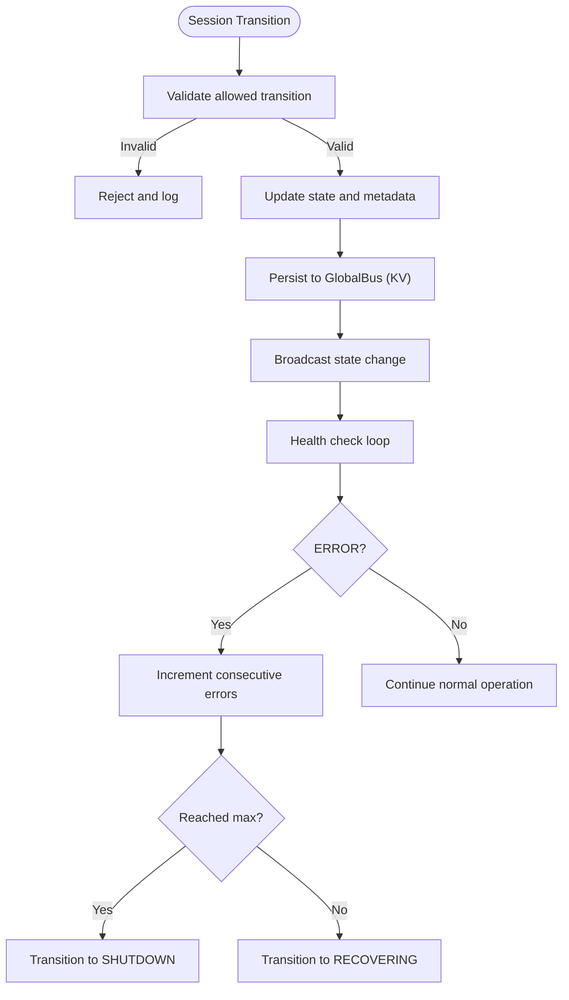
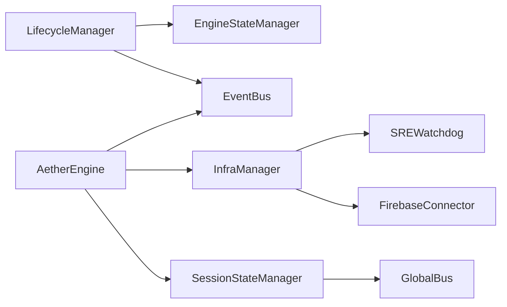

# Lifecycle Management

<cite>
**Referenced Files in This Document**
- [lifecycle.py](file://core/infra/lifecycle.py)
- [state_manager.py](file://core/infra/state_manager.py)
- [event_bus.py](file://core/infra/event_bus.py)
- [engine.py](file://core/engine.py)
- [server.py](file://core/server.py)
- [config.py](file://core/infra/config.py)
- [session_state.py](file://core/infra/transport/session_state.py)
- [watchdog.py](file://core/services/watchdog.py)
- [infra.py](file://core/logic/managers/infra.py)
- [interface.py](file://core/infra/cloud/firebase/interface.py)
</cite>

## Update Summary
**Changes Made**
- Fixed constructor call patterns for EventBus and EngineStateManager instances
- Corrected class name typo in state transition event creation
- Updated documentation to reflect proper initialization sequences

## Table of Contents
1. [Introduction](#introduction)
2. [Project Structure](#project-structure)
3. [Core Components](#core-components)
4. [Architecture Overview](#architecture-overview)
5. [Detailed Component Analysis](#detailed-component-analysis)
6. [Dependency Analysis](#dependency-analysis)
7. [Performance Considerations](#performance-considerations)
8. [Troubleshooting Guide](#troubleshooting-guide)
9. [Conclusion](#conclusion)
10. [Appendices](#appendices)

## Introduction
This document describes the system lifecycle management component responsible for startup, shutdown, and state persistence operations. It explains the initialization sequence, dependency resolution, graceful shutdown procedures, state persistence mechanisms, checkpoint creation, and recovery from failures. It also covers integration with external systems during lifecycle transitions, lifecycle hooks, custom initialization procedures, shutdown cleanup processes, configuration management, service coordination, error handling, rollback procedures, and recovery strategies. Practical troubleshooting guidance and best practices for extending lifecycle operations are included.

## Project Structure
The lifecycle management spans several modules:
- Lifecycle orchestration and signal handling
- State machine enforcement and event broadcasting
- Event bus for decoupled communication
- Engine bootstrap and coordinated shutdown
- Configuration management and environment loading
- Session state persistence and recovery
- Infrastructure services (watchdog and cloud persistence)
- Entry point server for pre-flight checks and startup

**Diagram sources**
- [lifecycle.py](file://core/infra/lifecycle.py#L10-L108)
- [state_manager.py](file://core/infra/state_manager.py#L14-L100)
- [event_bus.py](file://core/infra/event_bus.py#L69-L152)
- [engine.py](file://core/engine.py#L26-L240)
- [config.py](file://core/infra/config.py#L102-L175)
- [session_state.py](file://core/infra/transport/session_state.py#L71-L463)
- [watchdog.py](file://core/services/watchdog.py#L39-L228)
- [interface.py](file://core/infra/cloud/firebase/interface.py#L15-L259)

**Section sources**
- [lifecycle.py](file://core/infra/lifecycle.py#L10-L108)
- [state_manager.py](file://core/infra/state_manager.py#L14-L100)
- [event_bus.py](file://core/infra/event_bus.py#L69-L152)
- [engine.py](file://core/engine.py#L26-L240)
- [config.py](file://core/infra/config.py#L102-L175)
- [session_state.py](file://core/infra/transport/session_state.py#L71-L463)
- [watchdog.py](file://core/services/watchdog.py#L39-L228)
- [interface.py](file://core/infra/cloud/firebase/interface.py#L15-L259)

## Core Components
- LifecycleManager: Orchestrates master boot and shutdown sequences, coordinates state transitions, and handles OS signals.
- EngineStateManager: Enforces a strict state machine for the kernel, validates transitions, and broadcasts control events.
- EventBus: Tiered event bus for audio frames, control commands, and telemetry; ensures deterministic delivery and expiration handling.
- AetherEngine: High-level runtime orchestrator that initializes managers, starts subsystems, and performs graceful shutdown.
- AetherConfig: Loads and validates configuration from environment and JSON fallback, including Firebase credentials.
- SessionStateManager: Manages Gemini Live session lifecycle with atomic transitions, snapshots, persistence, and recovery.
- SREWatchdog: Autonomous monitoring and healing with pattern-based actions and frontend notifications.
- FirebaseConnector: Cloud persistence layer for sessions, messages, metrics, and repair logs.

**Section sources**
- [lifecycle.py](file://core/infra/lifecycle.py#L10-L108)
- [state_manager.py](file://core/infra/state_manager.py#L46-L100)
- [event_bus.py](file://core/infra/event_bus.py#L69-L152)
- [engine.py](file://core/engine.py#L26-L240)
- [config.py](file://core/infra/config.py#L102-L175)
- [session_state.py](file://core/infra/transport/session_state.py#L71-L463)
- [watchdog.py](file://core/services/watchdog.py#L39-L228)
- [interface.py](file://core/infra/cloud/firebase/interface.py#L15-L259)

## Architecture Overview
The lifecycle architecture follows a deterministic boot and shutdown sequence:
- Startup: LifecycleManager boots the EventBus, requests a state transition to IDLE, and proceeds to runtime.
- Runtime: AetherEngine coordinates subsystems (audio, gateway, admin API, watchdog) under a TaskGroup and reacts to shutdown signals.
- Shutdown: LifecycleManager requests a PAUSED transition, stops the EventBus, cancels lingering tasks, and marks shutdown complete.
- Persistence: SessionStateManager persists snapshots to a global key-value store and restores them on demand; FirebaseConnector logs session telemetry and repair actions.

**Diagram sources**
- [lifecycle.py](file://core/infra/lifecycle.py#L58-L102)
- [state_manager.py](file://core/infra/state_manager.py#L60-L95)
- [event_bus.py](file://core/infra/event_bus.py#L115-L124)
- [engine.py](file://core/engine.py#L189-L240)

## Detailed Component Analysis

### LifecycleManager
Responsibilities:
- Boot sequence: start EventBus, request BOOTING, simulate component init, transition to IDLE, and handle boot failure by invoking shutdown.
- Shutdown sequence: request PAUSED, stop EventBus, cancel tasks, and set shutdown event.
- Signal handling: register handlers for SIGINT/SIGTERM to trigger shutdown.
- Error handling: log critical kernel panics and ensure cleanup.

Key behaviors:
- Uses EngineStateManager to enforce allowed transitions.
- Uses EventBus to broadcast state changes.
- Maintains a list of background tasks to cancel on shutdown.

**Updated** Fixed constructor call patterns for EventBus and EngineStateManager instances to ensure proper initialization order and dependency injection.

**Diagram sources**
- [lifecycle.py](file://core/infra/lifecycle.py#L21-L85)
- [state_manager.py](file://core/infra/state_manager.py#L60-L95)

**Section sources**
- [lifecycle.py](file://core/infra/lifecycle.py#L10-L108)

### EngineStateManager and SystemState
Responsibilities:
- Define the allowed state transitions and enforce them via request_transition.
- Broadcast ControlEvent on state changes to subscribers.
- Provide synchronous is_state checks for fast logic gates.

State machine:
- BOOTING → IDLE or ERROR
- IDLE → LISTENING, PAUSED, ERROR, NIGHT_TERRORS
- LISTENING → THINKING, IDLE, ERROR
- THINKING → SPEAKING, IDLE, ERROR
- SPEAKING → IDLE, ERROR
- PAUSED → IDLE, ERROR
- NIGHT_TERRORS → IDLE
- ERROR → BOOTING (watchdog recovery)

**Updated** Fixed class name typo from `Controlevent` to `ControlEvent` in state transition event creation.

**Diagram sources**
- [state_manager.py](file://core/infra/state_manager.py#L14-L38)
- [state_manager.py](file://core/infra/state_manager.py#L60-L95)

**Section sources**
- [state_manager.py](file://core/infra/state_manager.py#L14-L100)

### EventBus
Responsibilities:
- Maintain three tiered queues: Audio, Control, and Telemetry.
- Route events to subscribers concurrently and drop expired events based on latency budgets.
- Start workers per tier and stop gracefully by cancelling tasks.

Integration:
- EngineStateManager publishes ControlEvent on state transitions.
- AetherEngine subscribes to events for coordination.

**Diagram sources**
- [event_bus.py](file://core/infra/event_bus.py#L69-L152)
- [state_manager.py](file://core/infra/state_manager.py#L82-L94)

**Section sources**
- [event_bus.py](file://core/infra/event_bus.py#L69-L152)

### AetherEngine
Responsibilities:
- Load configuration and initialize managers (AgentManager, AetherGateway, AudioManager, InfraManager, AdminAPIServer, PulseManager, CognitiveScheduler).
- Run subsystems concurrently under a TaskGroup and handle shutdown via signal.
- Perform graceful shutdown by stopping audio, gateway, watchers, infrastructure, and ending the session.

Integration:
- Depends on EventBus for inter-module communication.
- Starts watchdog and admin API.
- Coordinates with InfraManager for Firebase and watchdog lifecycle.

**Diagram sources**
- [engine.py](file://core/engine.py#L189-L240)
- [infra.py](file://core/logic/managers/infra.py#L22-L47)
- [watchdog.py](file://core/services/watchdog.py#L74-L94)

**Section sources**
- [engine.py](file://core/engine.py#L26-L240)
- [infra.py](file://core/logic/managers/infra.py#L11-L47)

### Configuration Management
Responsibilities:
- Load AetherConfig from environment with JSON fallback.
- Support Base64-encoded Firebase credentials.
- Provide logging configuration and runtime settings.

Integration:
- AetherEngine loads configuration during initialization.
- FirebaseConnector uses decoded credentials for secure initialization.

**Section sources**
- [config.py](file://core/infra/config.py#L102-L175)
- [interface.py](file://core/infra/cloud/firebase/interface.py#L31-L61)

### Session State Persistence and Recovery
Responsibilities:
- Manage Gemini Live session lifecycle with atomic transitions and validation.
- Persist snapshots to a global key-value store and restore them on demand.
- Monitor health and trigger recovery or shutdown based on error thresholds.

Integration:
- Uses GlobalBus for KV persistence and global state synchronization.
- Notifies clients and the gateway of state changes.

**Diagram sources**
- [session_state.py](file://core/infra/transport/session_state.py#L197-L272)
- [session_state.py](file://core/infra/transport/session_state.py#L378-L427)

**Section sources**
- [session_state.py](file://core/infra/transport/session_state.py#L71-L463)

### Watchdog and Recovery
Responsibilities:
- Intercept ERROR-level logs and trigger autonomous healing actions.
- Publish health alerts and repair state to the bus and frontend.
- Reconnect or diagnose-and-repair based on failure patterns.

Integration:
- Hooked into system logging and driven by asyncio loop.
- Uses FirebaseConnector to log repair events and maintain audit trails.

**Section sources**
- [watchdog.py](file://core/services/watchdog.py#L21-L228)
- [interface.py](file://core/infra/cloud/firebase/interface.py#L163-L186)

## Dependency Analysis
- LifecycleManager depends on EventBus and EngineStateManager for orchestration.
- EngineStateManager depends on EventBus for broadcasting control events.
- AetherEngine depends on configuration, managers, and services for runtime coordination.
- SessionStateManager depends on GlobalBus for persistence and synchronization.
- InfraManager depends on SREWatchdog and FirebaseConnector for infrastructure services.
- FirebaseConnector depends on configuration for credentials and session management.

**Diagram sources**
- [lifecycle.py](file://core/infra/lifecycle.py#L15-L19)
- [state_manager.py](file://core/infra/state_manager.py#L51-L54)
- [engine.py](file://core/engine.py#L29-L65)
- [session_state.py](file://core/infra/transport/session_state.py#L103-L118)
- [infra.py](file://core/logic/managers/infra.py#L14-L20)
- [watchdog.py](file://core/services/watchdog.py#L47-L57)
- [interface.py](file://core/infra/cloud/firebase/interface.py#L25-L30)

**Section sources**
- [lifecycle.py](file://core/infra/lifecycle.py#L15-L19)
- [state_manager.py](file://core/infra/state_manager.py#L51-L54)
- [engine.py](file://core/engine.py#L29-L65)
- [session_state.py](file://core/infra/transport/session_state.py#L103-L118)
- [infra.py](file://core/logic/managers/infra.py#L14-L20)
- [watchdog.py](file://core/services/watchdog.py#L47-L57)
- [interface.py](file://core/infra/cloud/firebase/interface.py#L25-L30)

## Performance Considerations
- Event bus tiers prevent priority inversion and bound latency via deadlines.
- Atomic state transitions minimize race conditions and ensure consistent control flow.
- Concurrency with TaskGroup and explicit cancellation reduces shutdown latency.
- Snapshot persistence uses TTL to bound storage overhead and stale data retention.
- Logging-based watchdog avoids tight loops and centralizes failure detection.

## Troubleshooting Guide
Common issues and resolutions:
- Stuck startup
  - Verify EventBus started successfully and state transitions to IDLE.
  - Check configuration loading and environment variables.
  - Review logs for boot failure and automatic shutdown invocation.
  - References: [lifecycle.py](file://core/infra/lifecycle.py#L21-L57), [config.py](file://core/infra/config.py#L130-L175)

- Incomplete shutdown
  - Ensure signal handlers registered and shutdown event awaited.
  - Confirm all tasks cancelled and EventBus stopped.
  - References: [lifecycle.py](file://core/infra/lifecycle.py#L87-L102), [event_bus.py](file://core/infra/event_bus.py#L115-L124)

- State transition rejected
  - Validate current state and allowed transitions.
  - Check reason and source of transition request.
  - References: [state_manager.py](file://core/infra/state_manager.py#L60-L95)

- Session persistence failures
  - Confirm GlobalBus connectivity and KV store availability.
  - Inspect snapshot creation and restoration logic.
  - References: [session_state.py](file://core/infra/transport/session_state.py#L273-L291), [session_state.py](file://core/infra/transport/session_state.py#L435-L463)

- Watchdog not triggering
  - Verify logging handler attached and ERROR logs captured.
  - Check pattern registry and healing actions.
  - References: [watchdog.py](file://core/services/watchdog.py#L74-L94), [watchdog.py](file://core/services/watchdog.py#L119-L168)

- Firebase session issues
  - Validate Base64 credentials decoding and initialization.
  - Confirm session document creation and repair logging.
  - References: [interface.py](file://core/infra/cloud/firebase/interface.py#L31-L61), [interface.py](file://core/infra/cloud/firebase/interface.py#L163-L186)

**Section sources**
- [lifecycle.py](file://core/infra/lifecycle.py#L21-L102)
- [state_manager.py](file://core/infra/state_manager.py#L60-L95)
- [session_state.py](file://core/infra/transport/session_state.py#L273-L291)
- [watchdog.py](file://core/services/watchdog.py#L74-L168)
- [interface.py](file://core/infra/cloud/firebase/interface.py#L31-L61)

## Conclusion
The lifecycle management system enforces deterministic boot and shutdown sequences, coordinates subsystems via an event-driven state machine, and integrates with external systems for persistence and monitoring. Robust error handling, snapshot-based recovery, and autonomous watchdog healing ensure resilience. Extensibility is achieved through modular components, lifecycle hooks, and standardized state transitions.

## Appendices

### Best Practices for Extending Lifecycle Operations
- Encapsulate new subsystems behind managers and integrate via AetherEngine initialization.
- Use EngineStateManager.request_transition for all state changes to preserve consistency.
- Register EventBus subscribers for control and telemetry to react to lifecycle events.
- Implement custom shutdown cleanup in AetherEngine._shutdown to ensure resource release.
- Add lifecycle hooks for pre/post boot and shutdown stages.
- Use SessionStateManager snapshots for crash recovery and session continuity.
- Configure watchdog patterns for targeted healing actions.

### Constructor Call Patterns
**Updated** Proper initialization patterns for lifecycle components:

- **EventBus Initialization**: `EventBus()` creates a new event bus instance with three tiered queues
- **EngineStateManager Initialization**: `EngineStateManager(event_bus_instance)` requires a valid EventBus instance for event broadcasting
- **LifecycleManager Initialization**: Creates both EventBus and EngineStateManager instances with proper dependency injection

These constructor patterns ensure proper initialization order and dependency resolution across the lifecycle management system.