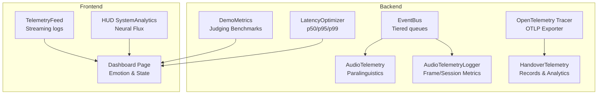
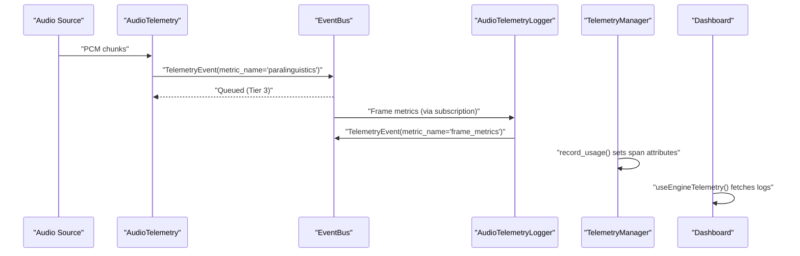
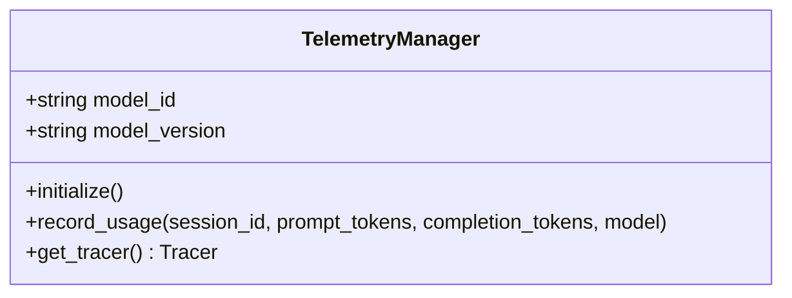
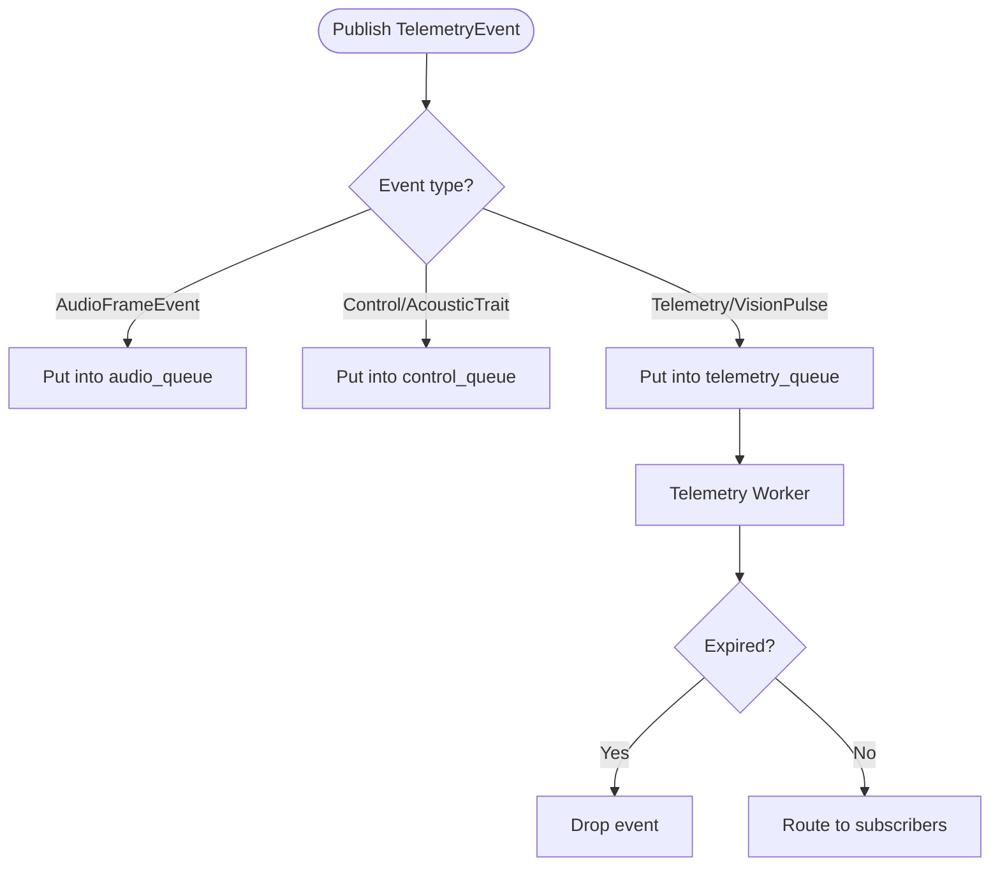
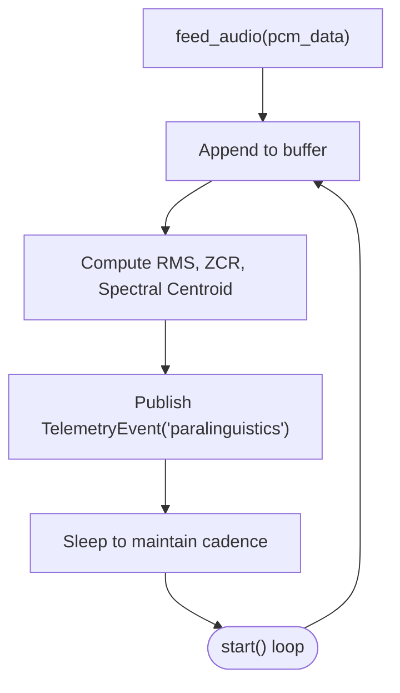
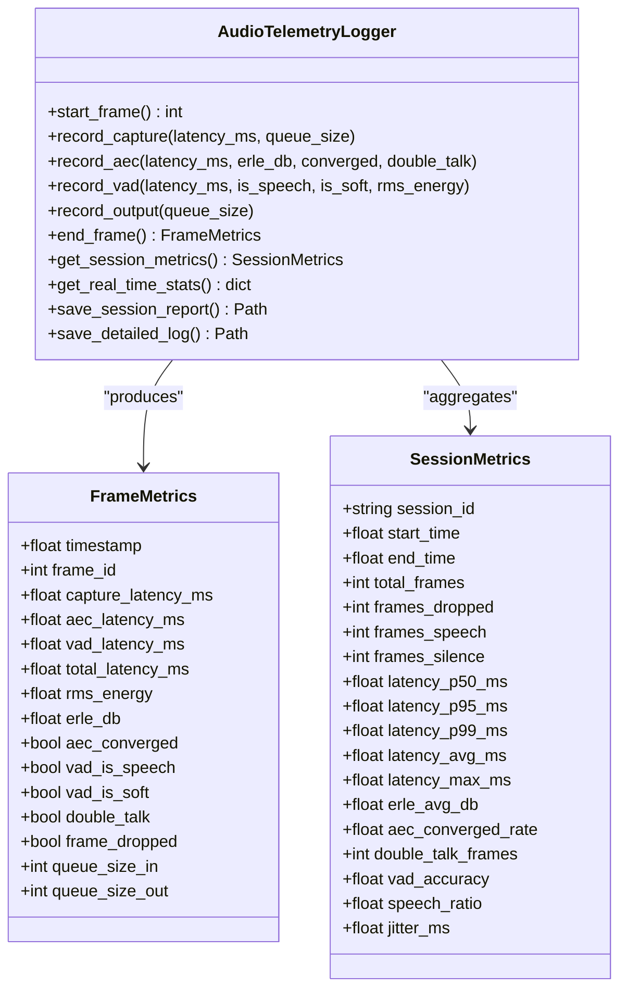
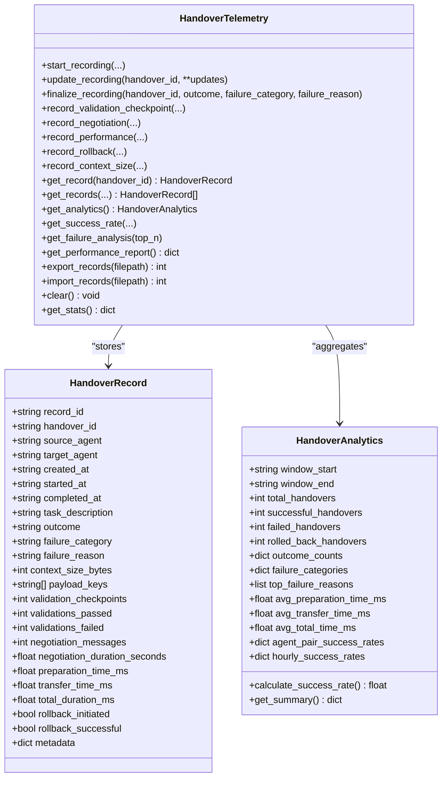
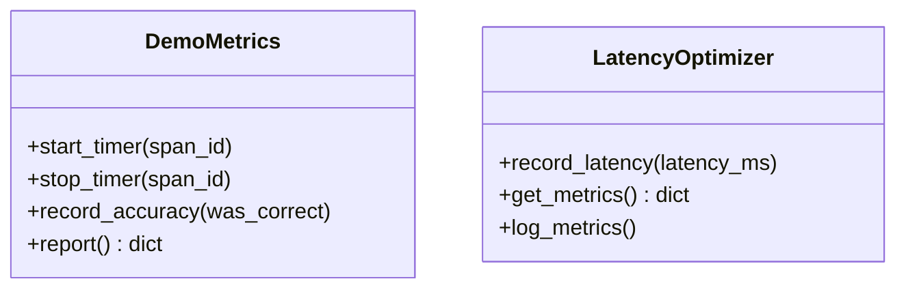
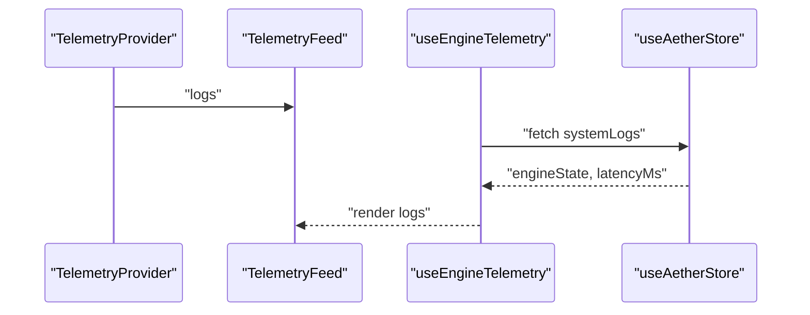
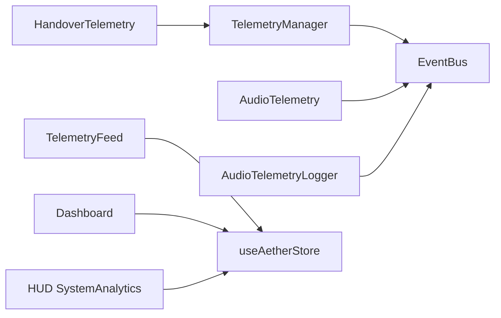

# Telemetry System

<cite>
**Referenced Files in This Document**
- [README.md](file://README.md)
- [core/infra/telemetry.py](file://core/infra/telemetry.py)
- [core/infra/event_bus.py](file://core/infra/event_bus.py)
- [core/audio/telemetry.py](file://core/audio/telemetry.py)
- [core/analytics/demo_metrics.py](file://core/analytics/demo_metrics.py)
- [core/analytics/latency.py](file://core/analytics/latency.py)
- [core/ai/handover_telemetry.py](file://core/ai/handover_telemetry.py)
- [apps/portal/src/hooks/useTelemetry.tsx](file://apps/portal/src/hooks/useTelemetry.tsx)
- [apps/portal/src/components/TelemetryFeed.tsx](file://apps/portal/src/components/TelemetryFeed.tsx)
- [apps/portal/src/dashboard/app/page.tsx](file://apps/portal/src/dashboard/app/page.tsx)
- [apps/portal/src/components/HUD/SystemAnalytics.tsx](file://apps/portal/src/components/HUD/SystemAnalytics.tsx)
- [tests/benchmarks/test_long_session.py](file://tests/benchmarks/test_long_session.py)
- [tests/benchmarks/test_event_bus_stress.py](file://tests/benchmarks/test_event_bus_stress.py)
</cite>

## Table of Contents
1. [Introduction](#introduction)
2. [Project Structure](#project-structure)
3. [Core Components](#core-components)
4. [Architecture Overview](#architecture-overview)
5. [Detailed Component Analysis](#detailed-component-analysis)
6. [Dependency Analysis](#dependency-analysis)
7. [Performance Considerations](#performance-considerations)
8. [Troubleshooting Guide](#troubleshooting-guide)
9. [Conclusion](#conclusion)
10. [Appendices](#appendices)

## Introduction
This document describes the telemetry collection and monitoring system powering the Aether Voice OS. It explains how telemetry data is collected, aggregated, and reported across audio, system, and agent handover domains. It covers supported telemetry types, data formats, and transmission protocols, and details integrations with the frontend dashboard and external analytics platforms. Guidance is included for configuring telemetry, defining custom metrics, exporting data, and optimizing performance and storage. Operational insights, error tracking, and privacy considerations are addressed alongside troubleshooting steps and best practices.

## Project Structure
The telemetry system spans backend infrastructure, audio pipeline telemetry, AI agent handover telemetry, and a Next.js dashboard for visualization and logs.

**Diagram sources**
- [core/infra/event_bus.py](file://core/infra/event_bus.py#L69-L152)
- [core/infra/telemetry.py](file://core/infra/telemetry.py#L14-L130)
- [core/audio/telemetry.py](file://core/audio/telemetry.py#L21-L441)
- [core/analytics/demo_metrics.py](file://core/analytics/demo_metrics.py#L9-L50)
- [core/analytics/latency.py](file://core/analytics/latency.py#L7-L40)
- [core/ai/handover_telemetry.py](file://core/ai/handover_telemetry.py#L295-L694)
- [apps/portal/src/components/TelemetryFeed.tsx](file://apps/portal/src/components/TelemetryFeed.tsx#L1-L40)
- [apps/portal/src/dashboard/app/page.tsx](file://apps/portal/src/dashboard/app/page.tsx#L1-L112)
- [apps/portal/src/components/HUD/SystemAnalytics.tsx](file://apps/portal/src/components/HUD/SystemAnalytics.tsx#L1-L88)

**Section sources**
- [README.md](file://README.md#L132-L158)
- [core/infra/event_bus.py](file://core/infra/event_bus.py#L69-L152)
- [core/infra/telemetry.py](file://core/infra/telemetry.py#L14-L130)
- [core/audio/telemetry.py](file://core/audio/telemetry.py#L21-L441)
- [core/analytics/demo_metrics.py](file://core/analytics/demo_metrics.py#L9-L50)
- [core/analytics/latency.py](file://core/analytics/latency.py#L7-L40)
- [core/ai/handover_telemetry.py](file://core/ai/handover_telemetry.py#L295-L694)
- [apps/portal/src/components/TelemetryFeed.tsx](file://apps/portal/src/components/TelemetryFeed.tsx#L1-L40)
- [apps/portal/src/dashboard/app/page.tsx](file://apps/portal/src/dashboard/app/page.tsx#L1-L112)
- [apps/portal/src/components/HUD/SystemAnalytics.tsx](file://apps/portal/src/components/HUD/SystemAnalytics.tsx#L1-L88)

## Core Components
- OpenTelemetry Telemetry Manager: Initializes and exports traces via OTLP to Arize/Phoenix, records token usage and cost, and attaches usage attributes to current spans.
- Event Bus: A tiered asynchronous event bus with dedicated queues for audio, control, and telemetry. Telemetry events are droppable by design to avoid starvation of higher-priority lanes.
- Audio Telemetry Engine: Periodically computes paralinguistic features (volume, pitch, spectral centroid) and publishes them as telemetry events.
- Audio Telemetry Logger: Tracks per-frame and session-level metrics (latency, ERLE, AEC convergence, VAD activity, jitter), publishes frame metrics, and optionally persists reports to disk.
- Handover Telemetry: Records agent handover operations, outcomes, performance, and analytics; integrates with OpenTelemetry spans for distributed tracing.
- Demo Metrics: Captures latency and accuracy for demonstration and judging scenarios.
- Latency Optimizer: Computes latency percentiles and logs summary metrics.
- Frontend Telemetry Feed and Dashboard: Streams and visualizes telemetry logs and system analytics.

**Section sources**
- [core/infra/telemetry.py](file://core/infra/telemetry.py#L14-L130)
- [core/infra/event_bus.py](file://core/infra/event_bus.py#L69-L152)
- [core/audio/telemetry.py](file://core/audio/telemetry.py#L21-L441)
- [core/analytics/demo_metrics.py](file://core/analytics/demo_metrics.py#L9-L50)
- [core/analytics/latency.py](file://core/analytics/latency.py#L7-L40)
- [core/ai/handover_telemetry.py](file://core/ai/handover_telemetry.py#L295-L694)
- [apps/portal/src/components/TelemetryFeed.tsx](file://apps/portal/src/components/TelemetryFeed.tsx#L1-L40)
- [apps/portal/src/dashboard/app/page.tsx](file://apps/portal/src/dashboard/app/page.tsx#L1-L112)

## Architecture Overview
The telemetry architecture follows a publish-subscribe pattern with explicit tiers and deadlines. Audio telemetry is generated at a fixed cadence and published to the event bus. The bus routes events to subscribers, who may aggregate metrics, export traces, or render dashboards. Telemetry spans integrate with OpenTelemetry for distributed tracing and cost attribution.

**Diagram sources**
- [core/audio/telemetry.py](file://core/audio/telemetry.py#L35-L93)
- [core/infra/event_bus.py](file://core/infra/event_bus.py#L90-L152)
- [core/audio/telemetry.py](file://core/audio/telemetry.py#L343-L354)
- [core/infra/telemetry.py](file://core/infra/telemetry.py#L77-L108)
- [apps/portal/src/dashboard/app/page.tsx](file://apps/portal/src/dashboard/app/page.tsx#L12-L13)

## Detailed Component Analysis

### OpenTelemetry Telemetry Manager
- Purpose: Initialize OpenTelemetry tracer provider, configure OTLP exporter, and attach usage attributes to spans.
- Environment configuration: Endpoint, space ID, and API key for Arize/Phoenix; debug mode switches processor to SimpleSpanProcessor.
- Usage recording: Computes estimated cost from prompt/completion tokens and sets span attributes for usage and cost.
- Fallback: On initialization failure, falls back to a no-op tracer.

**Diagram sources**
- [core/infra/telemetry.py](file://core/infra/telemetry.py#L14-L130)

**Section sources**
- [core/infra/telemetry.py](file://core/infra/telemetry.py#L14-L130)

### Event Bus and Telemetry Events
- Event types: AudioFrameEvent (Tier 1), ControlEvent (Tier 2), TelemetryEvent (Tier 3), AcousticTraitEvent (Tier 2), VisionPulseEvent (Tier 3).
- Queues: Three separate asyncio queues to prevent priority inversion.
- Dropping policy: Telemetry lane drops expired events; other lanes enforce stricter deadlines.
- Subscriber routing: Concurrent fan-out to registered callbacks.

**Diagram sources**
- [core/infra/event_bus.py](file://core/infra/event_bus.py#L69-L152)

**Section sources**
- [core/infra/event_bus.py](file://core/infra/event_bus.py#L69-L152)

### Audio Telemetry Engine
- Cadence: ~15 Hz (fixed interval).
- Features: RMS volume, pitch estimation via zero-crossing rate, spectral centroid.
- Publishing: Emits TelemetryEvent with metric_name "paralinguistics" and metadata including computed features.
- Integration: Works with EventBus to publish metrics periodically.

**Diagram sources**
- [core/audio/telemetry.py](file://core/audio/telemetry.py#L35-L93)

**Section sources**
- [core/audio/telemetry.py](file://core/audio/telemetry.py#L21-L93)

### Audio Telemetry Logger
- Per-frame metrics: capture latency, AEC latency/ERLE/convergence, VAD speech/soft, queue sizes, total latency, frame drops.
- Session metrics: percentiles (p50/p95/p99), average/max latency, ERLE average, convergence rate, double-talk frames, speech ratio, jitter.
- Real-time stats: exposes recent metrics for dashboard.
- Persistence: saves session report (JSON) and detailed frame log (CSV) on exit.

**Diagram sources**
- [core/audio/telemetry.py](file://core/audio/telemetry.py#L100-L394)

**Section sources**
- [core/audio/telemetry.py](file://core/audio/telemetry.py#L100-L394)

### Handover Telemetry
- Records: start/end timestamps, agents, task info, outcome, validation checkpoints, negotiation metrics, performance timings, rollback events, context size, and metadata.
- Analytics: success/failure counts, failure category distributions, performance averages, agent pair success rates, hourly trends.
- Distributed tracing: starts/ends OTLP spans with attributes and status; records usage attributes via TelemetryManager.
- Persistence: stores records in-memory with size limit, supports export/import to/from JSON.

**Diagram sources**
- [core/ai/handover_telemetry.py](file://core/ai/handover_telemetry.py#L97-L651)

**Section sources**
- [core/ai/handover_telemetry.py](file://core/ai/handover_telemetry.py#L295-L694)

### Demo Metrics and Latency Optimizer
- DemoMetrics: Tracks detection latency and accuracy for demonstration scenarios and produces a report suitable for dashboards.
- LatencyOptimizer: Maintains latency samples and computes p50/p95/p99 and average for performance reporting.

**Diagram sources**
- [core/analytics/demo_metrics.py](file://core/analytics/demo_metrics.py#L9-L50)
- [core/analytics/latency.py](file://core/analytics/latency.py#L7-L40)

**Section sources**
- [core/analytics/demo_metrics.py](file://core/analytics/demo_metrics.py#L9-L50)
- [core/analytics/latency.py](file://core/analytics/latency.py#L7-L40)

### Frontend Telemetry and Dashboard
- TelemetryFeed: Renders a scrolling list of log entries with fading effect and timestamps.
- useTelemetry: React context providing addLog/clearLogs to populate the feed.
- Dashboard: Integrates emotion waveform, state visualizer, and system logs; connects to engine telemetry hook.
- HUD SystemAnalytics: Visualizes neural flux, signal integrity, pitch, and spectral centroid.

**Diagram sources**
- [apps/portal/src/hooks/useTelemetry.tsx](file://apps/portal/src/hooks/useTelemetry.tsx#L24-L53)
- [apps/portal/src/components/TelemetryFeed.tsx](file://apps/portal/src/components/TelemetryFeed.tsx#L13-L40)
- [apps/portal/src/dashboard/app/page.tsx](file://apps/portal/src/dashboard/app/page.tsx#L12-L13)
- [apps/portal/src/components/HUD/SystemAnalytics.tsx](file://apps/portal/src/components/HUD/SystemAnalytics.tsx#L36-L88)

**Section sources**
- [apps/portal/src/hooks/useTelemetry.tsx](file://apps/portal/src/hooks/useTelemetry.tsx#L1-L53)
- [apps/portal/src/components/TelemetryFeed.tsx](file://apps/portal/src/components/TelemetryFeed.tsx#L1-L40)
- [apps/portal/src/dashboard/app/page.tsx](file://apps/portal/src/dashboard/app/page.tsx#L1-L112)
- [apps/portal/src/components/HUD/SystemAnalytics.tsx](file://apps/portal/src/components/HUD/SystemAnalytics.tsx#L1-L88)

## Dependency Analysis
- TelemetryManager depends on OpenTelemetry SDK and OTLP exporter; environment variables control endpoint and credentials.
- AudioTelemetry relies on EventBus and emits TelemetryEvent instances.
- AudioTelemetryLogger subscribes to TelemetryEvent and produces session metrics; optionally writes CSV/JSON.
- HandoverTelemetry integrates with TelemetryManager for usage recording and OpenTelemetry spans.
- Frontend components depend on React contexts and hooks to render telemetry streams.

**Diagram sources**
- [core/infra/telemetry.py](file://core/infra/telemetry.py#L14-L130)
- [core/infra/event_bus.py](file://core/infra/event_bus.py#L69-L152)
- [core/audio/telemetry.py](file://core/audio/telemetry.py#L21-L441)
- [core/ai/handover_telemetry.py](file://core/ai/handover_telemetry.py#L295-L694)
- [apps/portal/src/components/TelemetryFeed.tsx](file://apps/portal/src/components/TelemetryFeed.tsx#L1-L40)
- [apps/portal/src/dashboard/app/page.tsx](file://apps/portal/src/dashboard/app/page.tsx#L1-L112)
- [apps/portal/src/components/HUD/SystemAnalytics.tsx](file://apps/portal/src/components/HUD/SystemAnalytics.tsx#L1-L88)

**Section sources**
- [core/infra/telemetry.py](file://core/infra/telemetry.py#L14-L130)
- [core/infra/event_bus.py](file://core/infra/event_bus.py#L69-L152)
- [core/audio/telemetry.py](file://core/audio/telemetry.py#L21-L441)
- [core/ai/handover_telemetry.py](file://core/ai/handover_telemetry.py#L295-L694)
- [apps/portal/src/components/TelemetryFeed.tsx](file://apps/portal/src/components/TelemetryFeed.tsx#L1-L40)
- [apps/portal/src/dashboard/app/page.tsx](file://apps/portal/src/dashboard/app/page.tsx#L1-L112)
- [apps/portal/src/components/HUD/SystemAnalytics.tsx](file://apps/portal/src/components/HUD/SystemAnalytics.tsx#L1-L88)

## Performance Considerations
- Event Bus isolation: Telemetry lane does not starve audio/control lanes; tests validate sub-10ms audio latency under heavy telemetry load.
- Memory footprint: AudioTelemetryLogger uses bounded deques for frame metrics and latency history; session reports are persisted on exit.
- Throughput: Benchmarks simulate high-frequency telemetry publishing to detect memory growth and validate stability.
- Processor selection: BatchSpanProcessor in production versus SimpleSpanProcessor in debug mode balances performance and observability.

**Section sources**
- [tests/benchmarks/test_event_bus_stress.py](file://tests/benchmarks/test_event_bus_stress.py#L8-L75)
- [tests/benchmarks/test_long_session.py](file://tests/benchmarks/test_long_session.py#L10-L53)
- [core/audio/telemetry.py](file://core/audio/telemetry.py#L180-L200)
- [core/infra/telemetry.py](file://core/infra/telemetry.py#L56-L61)

## Troubleshooting Guide
- Telemetry sink initialization fails:
  - Symptom: Warning about failed telemetry initialization and fallback to no-op tracer.
  - Action: Verify environment variables for endpoint, space ID, and API key; confirm network connectivity to Arize/Phoenix.
- High CPU or memory usage:
  - Symptom: Elevated RSS/VMS during extended sessions.
  - Action: Reduce frontend visualizer FPS, disable debug mode, and validate audio pipeline stages (AEC/VAD/Jitter).
- Telemetry events dropped:
  - Symptom: Expiration warnings in telemetry lane.
  - Action: Increase latency budgets for telemetry events or reduce event frequency; ensure subscribers handle events promptly.
- Export/import handover records:
  - Symptom: Need to archive or restore telemetry data.
  - Action: Use export_records and import_records to manage JSON archives.

**Section sources**
- [core/infra/telemetry.py](file://core/infra/telemetry.py#L72-L76)
- [core/infra/event_bus.py](file://core/infra/event_bus.py#L126-L143)
- [tests/benchmarks/test_long_session.py](file://tests/benchmarks/test_long_session.py#L10-L53)
- [core/ai/handover_telemetry.py](file://core/ai/handover_telemetry.py#L608-L636)

## Conclusion
The Aether Voice OS telemetry system combines a tiered event bus, audio telemetry engines, OpenTelemetry tracing, and a reactive frontend dashboard to deliver comprehensive observability. It supports real-time metrics, session analytics, and agent handover insights, enabling operational excellence, performance tuning, and effective monitoring strategies.

## Appendices

### Supported Telemetry Types and Formats
- Audio paralinguistics: TelemetryEvent with metric_name "paralinguistics" and metadata including volume, pitch, and spectral centroid.
- Frame metrics: TelemetryEvent with metric_name "frame_metrics" and full FrameMetrics serialization.
- Handover records: Structured records with outcomes, performance, and analytics aggregates.
- Usage metrics: Token usage and estimated cost attached to current spans.

**Section sources**
- [core/audio/telemetry.py](file://core/audio/telemetry.py#L77-L88)
- [core/audio/telemetry.py](file://core/audio/telemetry.py#L346-L353)
- [core/ai/handover_telemetry.py](file://core/ai/handover_telemetry.py#L97-L171)
- [core/infra/telemetry.py](file://core/infra/telemetry.py#L77-L108)

### Transmission Protocols and Platforms
- OpenTelemetry OTLP: Traces exported to Arize/Phoenix via gRPC exporter; headers configured with space ID and API key when present.
- Event Bus: Async queues with explicit tiering and dropping policies for telemetry events.

**Section sources**
- [core/infra/telemetry.py](file://core/infra/telemetry.py#L28-L66)
- [core/infra/event_bus.py](file://core/infra/event_bus.py#L69-L101)

### Integration with Monitoring Dashboards and External Analytics
- Frontend dashboard integrates with engine telemetry hook to display emotion waveforms, state machine, and system logs.
- HUD visualizes neural flux, signal integrity, pitch, and spectral centroid.
- Demo metrics and latency optimizer provide ready-to-report KPIs for judging and performance reviews.

**Section sources**
- [apps/portal/src/dashboard/app/page.tsx](file://apps/portal/src/dashboard/app/page.tsx#L1-L112)
- [apps/portal/src/components/HUD/SystemAnalytics.tsx](file://apps/portal/src/components/HUD/SystemAnalytics.tsx#L1-L88)
- [core/analytics/demo_metrics.py](file://core/analytics/demo_metrics.py#L36-L49)
- [core/analytics/latency.py](file://core/analytics/latency.py#L19-L39)

### Examples: Configuration, Custom Metrics, and Data Export
- Telemetry configuration:
  - Environment variables for Arize/Phoenix endpoint, space ID, and API key.
  - Debug mode toggles processor type for development.
- Custom metric definition:
  - AudioTelemetryLogger: Extend FrameMetrics and SessionMetrics to track additional pipeline stages.
  - HandoverTelemetry: Add new fields to HandoverRecord and update analytics aggregation.
- Data export:
  - HandoverTelemetry.export_records and import_records for JSON archives.
  - AudioTelemetryLogger.save_session_report and save_detailed_log for CSV/JSON artifacts.

**Section sources**
- [core/infra/telemetry.py](file://core/infra/telemetry.py#L28-L61)
- [core/audio/telemetry.py](file://core/audio/telemetry.py#L100-L394)
- [core/ai/handover_telemetry.py](file://core/ai/handover_telemetry.py#L608-L636)

### Relationship with System Performance Monitoring, Error Tracking, and Operational Insights
- Performance monitoring:
  - LatencyOptimizer and AudioTelemetryLogger provide latency percentiles and jitter metrics.
  - Event Bus stress tests validate lane isolation and audio latency guarantees.
- Error tracking:
  - HandoverTelemetry captures failure categories and reasons; spans set error status with descriptions.
  - TelemetryEvent expiration indicates delivery or processing delays.
- Operational insights:
  - DemoMetrics and HandoverAnalytics summarize success rates, top failure categories, and agent pair performance.
  - Frontend dashboard displays real-time system logs and state.

**Section sources**
- [core/analytics/latency.py](file://core/analytics/latency.py#L19-L39)
- [core/audio/telemetry.py](file://core/audio/telemetry.py#L280-L340)
- [tests/benchmarks/test_event_bus_stress.py](file://tests/benchmarks/test_event_bus_stress.py#L8-L75)
- [core/ai/handover_telemetry.py](file://core/ai/handover_telemetry.py#L365-L425)
- [apps/portal/src/dashboard/app/page.tsx](file://apps/portal/src/dashboard/app/page.tsx#L1-L112)

### Data Privacy, Retention Policies, and Storage Optimization
- Privacy:
  - Audio telemetry focuses on mathematical features; no raw audio is stored by default in the described components.
  - Handover records include metadata; ensure sensitive data is redacted or anonymized before persistence.
- Retention:
  - In-memory limits on records and frame metrics; adjust max sizes according to operational needs.
- Storage optimization:
  - Use bounded deques and periodic CSV/JSON exports; disable debug mode in production to reduce overhead.

**Section sources**
- [core/audio/telemetry.py](file://core/audio/telemetry.py#L180-L200)
- [core/ai/handover_telemetry.py](file://core/ai/handover_telemetry.py#L306-L314)

### Best Practices for Telemetry Instrumentation and Monitoring Strategy
- Instrumentation:
  - Attach usage attributes to spans for cost visibility; keep metric names consistent and metadata structured.
  - Emit telemetry at appropriate cadences; avoid overwhelming the telemetry lane.
- Monitoring strategy:
  - Track latency percentiles and jitter; alert on p95/p99 regressions.
  - Monitor handover success rates and top failure categories; correlate with audio pipeline metrics.
  - Validate bus isolation under load; ensure audio deadlines are met.

**Section sources**
- [core/infra/telemetry.py](file://core/infra/telemetry.py#L77-L108)
- [core/analytics/latency.py](file://core/analytics/latency.py#L19-L39)
- [tests/benchmarks/test_event_bus_stress.py](file://tests/benchmarks/test_event_bus_stress.py#L8-L75)