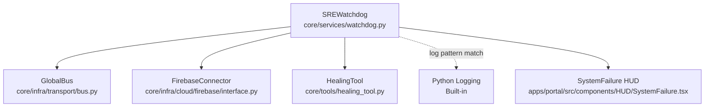
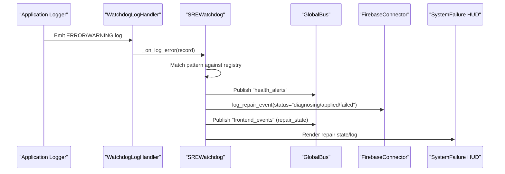
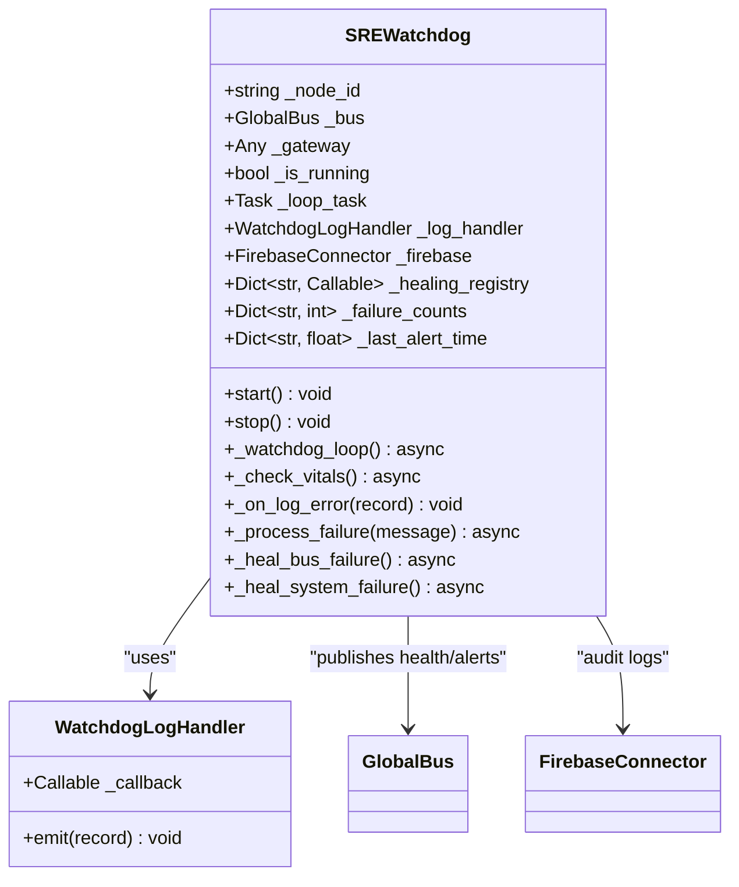
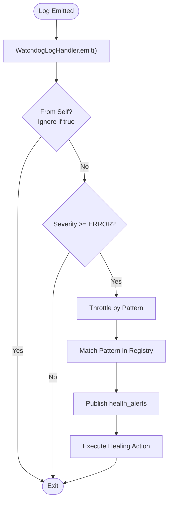
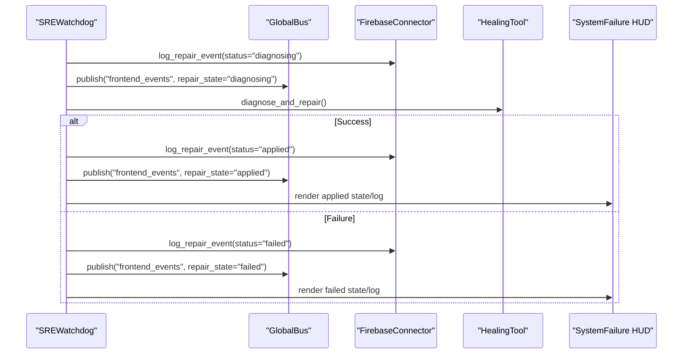
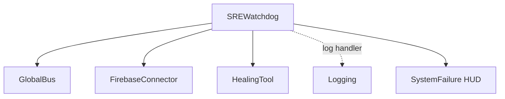

# Watchdog Service

<cite>
**Referenced Files in This Document**
- [watchdog.py](file://core/services/watchdog.py)
- [bus.py](file://core/infra/transport/bus.py)
- [healing_tool.py](file://core/tools/healing_tool.py)
- [interface.py](file://core/infra/cloud/firebase/interface.py)
- [SystemFailure.tsx](file://apps/portal/src/components/HUD/SystemFailure.tsx)
- [test_watchdog.py](file://tests/test_watchdog.py)
- [lifecycle.py](file://core/infra/lifecycle.py)
- [config.py](file://core/infra/config.py)
- [telemetry.py](file://core/infra/telemetry.py)
</cite>

## Table of Contents
1. [Introduction](#introduction)
2. [Project Structure](#project-structure)
3. [Core Components](#core-components)
4. [Architecture Overview](#architecture-overview)
5. [Detailed Component Analysis](#detailed-component-analysis)
6. [Dependency Analysis](#dependency-analysis)
7. [Performance Considerations](#performance-considerations)
8. [Troubleshooting Guide](#troubleshooting-guide)
9. [Conclusion](#conclusion)
10. [Appendices](#appendices)

## Introduction
The Watchdog service is the autonomous Site Reliability Engineer (SRE) layer for AetherOS. It continuously monitors system health, detects failures from log patterns, and executes automated healing actions. It integrates with the Global State Bus for cross-node communication, Firebase for persistent audit trails, and the frontend HUD for user visibility during repairs. This document explains the health check mechanisms, failure detection algorithms, automatic remediation processes, monitoring intervals, thresholds, alerting systems, integrations, and operational procedures.

## Project Structure
The Watchdog service is implemented as a standalone Python module with minimal external dependencies. It relies on:
- GlobalBus for distributed messaging and state
- FirebaseConnector for repair logging and audit trails
- HealingTool for autonomous diagnosis and repair proposals
- Logging framework for failure detection
- Frontend HUD for user feedback during repairs

**Diagram sources**
- [watchdog.py](file://core/services/watchdog.py#L39-L228)
- [bus.py](file://core/infra/transport/bus.py#L25-L200)
- [interface.py](file://core/infra/cloud/firebase/interface.py#L15-L259)
- [healing_tool.py](file://core/tools/healing_tool.py#L18-L148)
- [SystemFailure.tsx](file://apps/portal/src/components/HUD/SystemFailure.tsx#L83-L135)

**Section sources**
- [watchdog.py](file://core/services/watchdog.py#L1-L228)
- [bus.py](file://core/infra/transport/bus.py#L1-L200)
- [interface.py](file://core/infra/cloud/firebase/interface.py#L1-L259)
- [healing_tool.py](file://core/tools/healing_tool.py#L1-L148)
- [SystemFailure.tsx](file://apps/portal/src/components/HUD/SystemFailure.tsx#L1-L135)

## Core Components
- SREWatchdog: The central autonomous monitoring and healing orchestrator. It hooks into the logging system, periodically checks vitals, detects failure patterns, publishes health alerts, and executes healing protocols.
- WatchdogLogHandler: A custom logging handler that intercepts ERROR and higher severity logs and forwards them to the watchdog for analysis.
- Healing Registry: A pattern-to-action mapping that defines how specific log patterns are handled (e.g., Redis connection failures, timeouts, generic connection errors).
- Healing Protocols: Asynchronous actions executed upon pattern matches, including bus reconnection and autonomous diagnosis via the HealingTool.
- GlobalBus Integration: Publishing health alerts and repair state updates to channels for cross-node awareness and frontend display.
- Firebase Audit Trail: Logging repair events with status (diagnosing, applied, failed) for auditability and debugging.
- Frontend HUD: Visual feedback for repair states (diagnosing, applied, failed) and diagnostic logs.

**Section sources**
- [watchdog.py](file://core/services/watchdog.py#L21-L228)
- [bus.py](file://core/infra/transport/bus.py#L25-L200)
- [interface.py](file://core/infra/cloud/firebase/interface.py#L163-L186)
- [SystemFailure.tsx](file://apps/portal/src/components/HUD/SystemFailure.tsx#L83-L135)

## Architecture Overview
The Watchdog operates as a background task that:
- Hooks into the global logging system to capture errors and warnings.
- Periodically publishes system health status to the GlobalBus.
- Matches incoming log messages against a healing registry of regex patterns.
- Publishes health alerts and repair state updates to the GlobalBus.
- Executes healing actions asynchronously, including bus reconnection and autonomous diagnosis.
- Logs repair events to Firebase for auditability.
- Updates the frontend HUD with repair state and diagnostic logs.

**Diagram sources**
- [watchdog.py](file://core/services/watchdog.py#L119-L168)
- [bus.py](file://core/infra/transport/bus.py#L96-L108)
- [interface.py](file://core/infra/cloud/firebase/interface.py#L163-L186)
- [SystemFailure.tsx](file://apps/portal/src/components/HUD/SystemFailure.tsx#L83-L135)

## Detailed Component Analysis

### SREWatchdog Class
The SREWatchdog encapsulates the autonomous monitoring and healing logic. Key responsibilities:
- Initialization with node_id, optional GlobalBus, and optional gateway.
- Starting/stopping the watchdog loop and installing the logging handler.
- Periodic vitals check and health publishing to the GlobalBus.
- Pattern-based failure detection and throttling to prevent alert storms.
- Execution of healing protocols and asynchronous healing actions.
- Publishing health alerts and repair state updates to the GlobalBus.
- Logging repair events to Firebase and updating the frontend HUD.

**Diagram sources**
- [watchdog.py](file://core/services/watchdog.py#L39-L228)

**Section sources**
- [watchdog.py](file://core/services/watchdog.py#L39-L228)

### Health Check Mechanisms
- Log-based detection: The Watchdog installs a logging handler that intercepts ERROR and higher logs. It ignores logs originating from itself to prevent recursion.
- Pattern matching: A healing registry maps regex patterns to healing actions. Matching triggers throttling to limit repeated alerts.
- Periodic vitals: The watchdog publishes a periodic health message to the GlobalBus indicating system status.

**Diagram sources**
- [watchdog.py](file://core/services/watchdog.py#L21-L168)

**Section sources**
- [watchdog.py](file://core/services/watchdog.py#L21-L168)

### Failure Detection Algorithms
- Regex-based pattern matching: Patterns target common failure categories such as Redis connection failures, timeouts, and generic connection errors.
- Throttling: A per-pattern cooldown prevents excessive alerts within a short timeframe.
- Cross-thread safety: Uses asyncio loop to schedule healing actions safely from logging threads.

**Section sources**
- [watchdog.py](file://core/services/watchdog.py#L64-L72)
- [watchdog.py](file://core/services/watchdog.py#L131-L137)
- [watchdog.py](file://core/services/watchdog.py#L123-L126)

### Automatic Remediation Processes
- Bus failure recovery: Disconnects and reconnects the GlobalBus to restore connectivity.
- System failure diagnosis: Logs diagnosing state, publishes frontend repair state, triggers autonomous diagnosis via the HealingTool, logs applied/failure states, and publishes frontend updates.

**Diagram sources**
- [watchdog.py](file://core/services/watchdog.py#L180-L228)
- [healing_tool.py](file://core/tools/healing_tool.py#L18-L65)
- [interface.py](file://core/infra/cloud/firebase/interface.py#L163-L186)
- [SystemFailure.tsx](file://apps/portal/src/components/HUD/SystemFailure.tsx#L83-L135)

**Section sources**
- [watchdog.py](file://core/services/watchdog.py#L172-L228)
- [healing_tool.py](file://core/tools/healing_tool.py#L18-L65)

### Monitoring Intervals and Thresholds
- Health polling interval: The watchdog sleeps for a fixed interval between vitals checks.
- Throttling threshold: A per-pattern cooldown prevents alerts within a short timeframe.
- Message truncation: Health alert messages are truncated to a bounded length for safety.

**Section sources**
- [watchdog.py](file://core/services/watchdog.py#L101-L101)
- [watchdog.py](file://core/services/watchdog.py#L136-L136)
- [watchdog.py](file://core/services/watchdog.py#L152-L152)

### Alerting Systems
- Channels: Health alerts are published to a dedicated channel. Repair state updates are published to a frontend events channel.
- Payload: Alerts include node_id, severity, matched pattern, truncated message, and timestamp.
- Frontend: The HUD subscribes to repair state updates and renders diagnosing/applied/failed states with diagnostic logs.

**Section sources**
- [watchdog.py](file://core/services/watchdog.py#L144-L155)
- [watchdog.py](file://core/services/watchdog.py#L192-L214)
- [SystemFailure.tsx](file://apps/portal/src/components/HUD/SystemFailure.tsx#L83-L135)

### Integration with System Components and Dependency Tracking
- GlobalBus: Used for health publishing, alerting, and repair state updates.
- FirebaseConnector: Used for audit logging of repair events.
- HealingTool: Provides autonomous diagnosis and repair proposal pipeline.
- Logging: Hooked globally to capture errors and warnings.
- Frontend HUD: Receives repair state updates and displays diagnostic logs.

**Section sources**
- [watchdog.py](file://core/services/watchdog.py#L14-L16)
- [bus.py](file://core/infra/transport/bus.py#L25-L200)
- [interface.py](file://core/infra/cloud/firebase/interface.py#L15-L259)
- [healing_tool.py](file://core/tools/healing_tool.py#L1-L148)
- [SystemFailure.tsx](file://apps/portal/src/components/HUD/SystemFailure.tsx#L83-L135)

### Examples of Watchdog Configuration, Custom Health Checks, and Recovery Procedures
- Configuration: Instantiate the watchdog with a node_id and optional GlobalBus. Start the watchdog to install the logging handler and begin periodic checks.
- Custom health checks: Extend the healing registry with new regex patterns mapped to custom healing actions.
- Recovery procedures: Implement asynchronous healing actions such as bus reconnection or invoking the HealingTool for diagnosis and repair.

**Section sources**
- [watchdog.py](file://core/services/watchdog.py#L74-L86)
- [watchdog.py](file://core/services/watchdog.py#L64-L68)
- [watchdog.py](file://core/services/watchdog.py#L172-L178)
- [watchdog.py](file://core/services/watchdog.py#L180-L228)

### Relationship with Other System Services and Coordination Mechanisms
- Lifecycle Manager: Initializes and coordinates system startup/shutdown; the Watchdog can be started during boot and stopped gracefully on shutdown.
- Telemetry: While separate from Watchdog, telemetry can be used to correlate system health with performance metrics.
- Configuration: The Watchdog does not directly depend on configuration settings but can be configured via constructor parameters and environment-dependent components (e.g., Firebase credentials).

**Section sources**
- [lifecycle.py](file://core/infra/lifecycle.py#L21-L57)
- [telemetry.py](file://core/infra/telemetry.py#L14-L130)
- [config.py](file://core/infra/config.py#L102-L128)

## Dependency Analysis
The Watchdog has explicit dependencies on the GlobalBus and FirebaseConnector, and indirectly depends on the HealingTool. It integrates with the logging framework and the frontend HUD.

**Diagram sources**
- [watchdog.py](file://core/services/watchdog.py#L14-L16)
- [bus.py](file://core/infra/transport/bus.py#L25-L200)
- [interface.py](file://core/infra/cloud/firebase/interface.py#L15-L259)
- [healing_tool.py](file://core/tools/healing_tool.py#L1-L148)
- [SystemFailure.tsx](file://apps/portal/src/components/HUD/SystemFailure.tsx#L83-L135)

**Section sources**
- [watchdog.py](file://core/services/watchdog.py#L14-L16)
- [bus.py](file://core/infra/transport/bus.py#L25-L200)
- [interface.py](file://core/infra/cloud/firebase/interface.py#L15-L259)
- [healing_tool.py](file://core/tools/healing_tool.py#L1-L148)
- [SystemFailure.tsx](file://apps/portal/src/components/HUD/SystemFailure.tsx#L83-L135)

## Performance Considerations
- Logging overhead: Installing a global logging handler introduces minimal overhead. Ensure handlers are removed on shutdown.
- Threading safety: The watchdog schedules healing actions on the asyncio loop to avoid blocking or race conditions.
- Network I/O: Publishing to the GlobalBus and logging to Firebase are asynchronous and non-blocking from the main application thread.
- Tuning parameters: Adjust sleep intervals and throttling windows based on system load and acceptable alert frequency.

[No sources needed since this section provides general guidance]

## Troubleshooting Guide
Common issues and resolutions:
- Watchdog not triggering: Verify the logging handler is installed and that ERROR logs are not originating from the watchdog module itself.
- No GlobalBus connectivity: Ensure the GlobalBus is connected before starting the watchdog; otherwise, health alerts will not publish.
- Repair state not visible: Confirm the frontend is subscribed to the repair state channel and that the watchdog publishes frontend events.
- False positives: Adjust or remove overly broad regex patterns in the healing registry to reduce unnecessary alerts.
- Recovery failures: Review Firebase repair logs for failed statuses and inspect the HealingTool’s diagnosis output.

**Section sources**
- [watchdog.py](file://core/services/watchdog.py#L82-L86)
- [watchdog.py](file://core/services/watchdog.py#L144-L155)
- [watchdog.py](file://core/services/watchdog.py#L192-L214)
- [interface.py](file://core/infra/cloud/firebase/interface.py#L163-L186)

## Conclusion
The Watchdog service provides a robust, autonomous monitoring and healing layer for AetherOS. By combining log-based failure detection, pattern-matching, throttling, and automated remediation, it ensures system resilience and continuous operation. Its integration with the GlobalBus, Firebase, and the frontend HUD enables transparent, auditable, and user-visible recovery actions.

[No sources needed since this section summarizes without analyzing specific files]

## Appendices

### Operational Procedures and Maintenance Requirements
- Startup: Initialize the GlobalBus, then start the watchdog to install the logging handler and begin periodic checks.
- Shutdown: Stop the watchdog to cancel the loop task and remove the logging handler.
- Maintenance: Regularly review and refine the healing registry patterns, adjust throttling windows, and monitor repair logs for recurring issues.

**Section sources**
- [watchdog.py](file://core/services/watchdog.py#L74-L93)
- [lifecycle.py](file://core/infra/lifecycle.py#L21-L57)

### Example Test Coverage
- Real bus integration: Validates that the watchdog triggers healing actions via the GlobalBus on log events.
- System failure flow: Verifies diagnosing/applied/failed states and Firebase repair logging.

**Section sources**
- [test_watchdog.py](file://tests/test_watchdog.py#L19-L50)
- [test_watchdog.py](file://tests/test_watchdog.py#L52-L97)