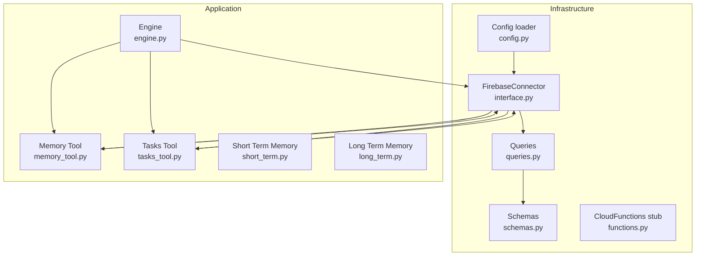
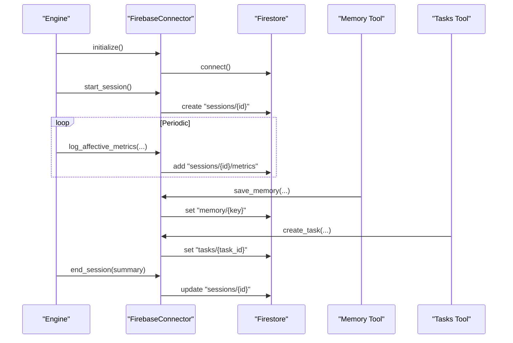
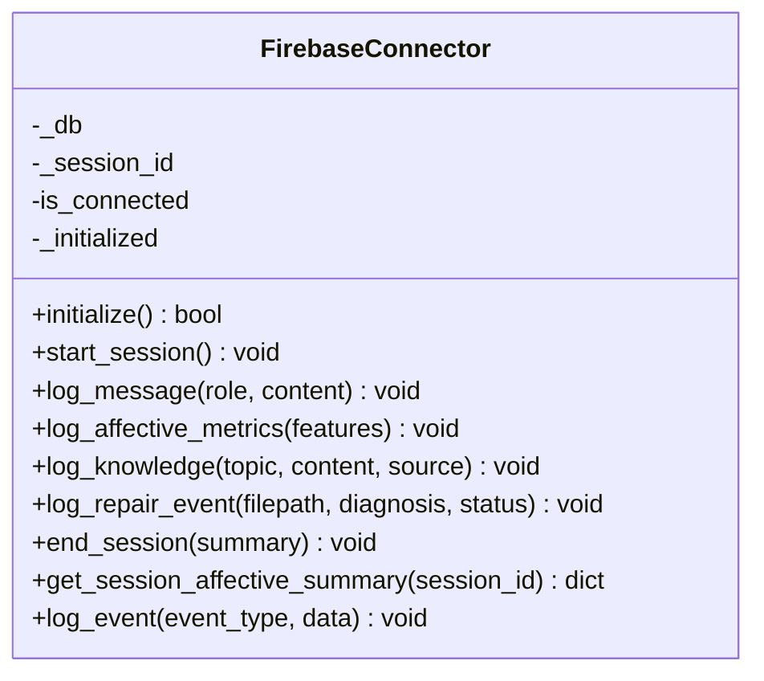
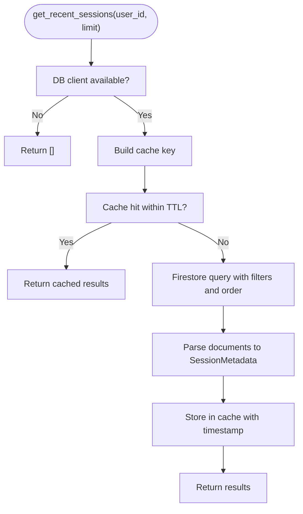
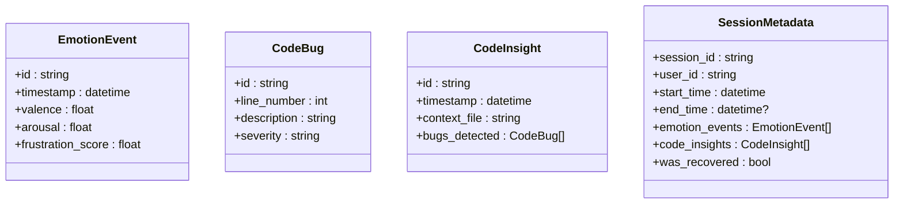
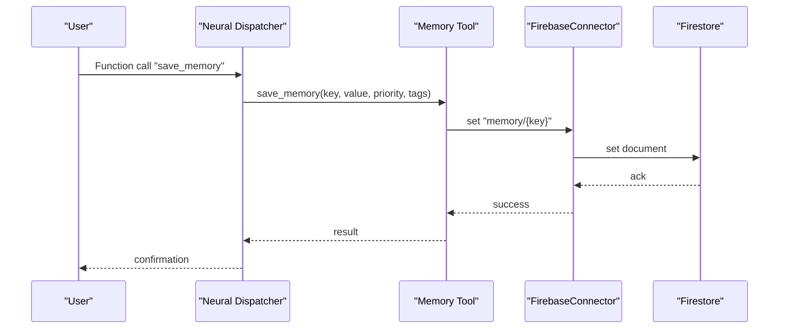
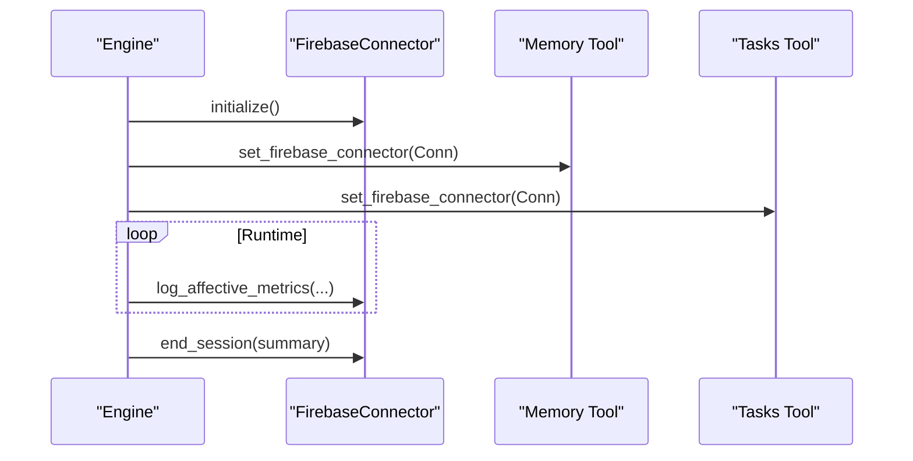
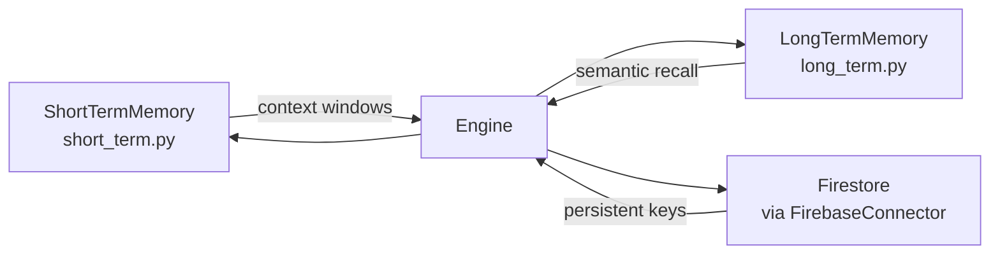
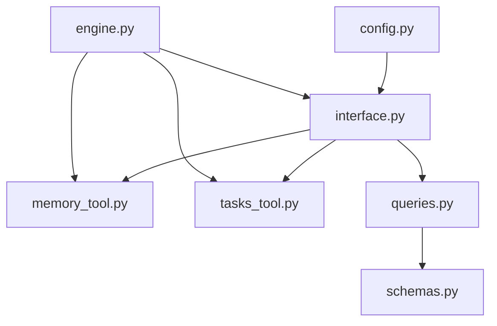

# Cloud Storage Integration

<cite>
**Referenced Files in This Document**
- [interface.py](file://core/infra/cloud/firebase/interface.py)
- [queries.py](file://core/infra/cloud/firebase/queries.py)
- [schemas.py](file://core/infra/cloud/firebase/schemas.py)
- [functions.py](file://core/infra/cloud/functions.py)
- [config.py](file://core/infra/config.py)
- [engine.py](file://core/engine.py)
- [memory_tool.py](file://core/tools/memory_tool.py)
- [tasks_tool.py](file://core/tools/tasks_tool.py)
- [long_term.py](file://core/memory/long_term.py)
- [short_term.py](file://core/memory/short_term.py)
- [test_firebase.py](file://infra/scripts/debug/test_firebase.py)
</cite>

## Table of Contents
1. [Introduction](#introduction)
2. [Project Structure](#project-structure)
3. [Core Components](#core-components)
4. [Architecture Overview](#architecture-overview)
5. [Detailed Component Analysis](#detailed-component-analysis)
6. [Dependency Analysis](#dependency-analysis)
7. [Performance Considerations](#performance-considerations)
8. [Troubleshooting Guide](#troubleshooting-guide)
9. [Conclusion](#conclusion)
10. [Appendices](#appendices)

## Introduction
This document describes the cloud storage integration built on Firebase within the Aether Live Agent system. It covers connection management, authentication, and data synchronization; the query system for cloud-based memory operations including CRUD and real-time updates; data schemas and models; integration patterns between local and cloud storage; sync and conflict-handling strategies; operational examples for backups and recovery; and guidance on scalability, offline behavior, and consistency.

## Project Structure
The Firebase integration resides under the infrastructure layer and is consumed by tools and engines that require persistent, cross-session memory and telemetry. Key areas:
- Firebase persistence layer: connection, session lifecycle, telemetry, and analytics logging
- Query layer: cached retrieval of recent sessions
- Schemas: Pydantic models for typed data exchange
- Tools: memory and tasks tools that persist user-facing state to Firestore
- Engine integration: injection of Firebase connector into tools and periodic telemetry logging
- Configuration: secure credential loading and environment-driven initialization

**Diagram sources**
- [interface.py](file://core/infra/cloud/firebase/interface.py#L15-L259)
- [queries.py](file://core/infra/cloud/firebase/queries.py#L20-L74)
- [schemas.py](file://core/infra/cloud/firebase/schemas.py#L8-L38)
- [functions.py](file://core/infra/cloud/functions.py#L6-L45)
- [config.py](file://core/infra/config.py#L102-L175)
- [engine.py](file://core/engine.py#L92-L140)
- [memory_tool.py](file://core/tools/memory_tool.py#L27-L330)
- [tasks_tool.py](file://core/tools/tasks_tool.py#L29-L325)
- [short_term.py](file://core/memory/short_term.py#L28-L72)
- [long_term.py](file://core/memory/long_term.py#L24-L74)

**Section sources**
- [interface.py](file://core/infra/cloud/firebase/interface.py#L15-L259)
- [queries.py](file://core/infra/cloud/firebase/queries.py#L20-L74)
- [schemas.py](file://core/infra/cloud/firebase/schemas.py#L8-L38)
- [functions.py](file://core/infra/cloud/functions.py#L6-L45)
- [config.py](file://core/infra/config.py#L102-L175)
- [engine.py](file://core/engine.py#L92-L140)
- [memory_tool.py](file://core/tools/memory_tool.py#L27-L330)
- [tasks_tool.py](file://core/tools/tasks_tool.py#L29-L325)
- [short_term.py](file://core/memory/short_term.py#L28-L72)
- [long_term.py](file://core/memory/long_term.py#L24-L74)

## Core Components
- FirebaseConnector: Manages Firestore connection, session lifecycle, and telemetry logging. Provides methods to initialize, start/end sessions, log messages, affective metrics, knowledge, repair events, and fetch summaries.
- Queries: Performs cached retrieval of recent sessions using Firestore queries and in-memory caching.
- Schemas: Defines typed models for emotion events, code insights, and session metadata.
- CloudFunctions: Stub for server-side triggers (e.g., session start, emotion aggregation).
- Config: Loads environment-based configuration and decodes Base64-encoded Firebase service account credentials.
- Tools: Memory and Tasks tools persist user data to Firestore and gracefully fall back when offline.
- Engine: Integrates Firebase into the runtime, injecting the connector into tools and emitting periodic telemetry.

**Section sources**
- [interface.py](file://core/infra/cloud/firebase/interface.py#L15-L259)
- [queries.py](file://core/infra/cloud/firebase/queries.py#L20-L74)
- [schemas.py](file://core/infra/cloud/firebase/schemas.py#L8-L38)
- [functions.py](file://core/infra/cloud/functions.py#L6-L45)
- [config.py](file://core/infra/config.py#L102-L175)
- [memory_tool.py](file://core/tools/memory_tool.py#L27-L330)
- [tasks_tool.py](file://core/tools/tasks_tool.py#L29-L325)
- [engine.py](file://core/engine.py#L92-L140)

## Architecture Overview
The system initializes Firebase using environment-provided credentials, creates a session document, and logs telemetry and user data into Firestore collections. Tools and the engine consume the connector to persist state and expose CRUD-like operations. Queries cache recent session metadata to reduce read pressure.

**Diagram sources**
- [engine.py](file://core/engine.py#L92-L140)
- [interface.py](file://core/infra/cloud/firebase/interface.py#L31-L203)
- [memory_tool.py](file://core/tools/memory_tool.py#L40-L92)
- [tasks_tool.py](file://core/tools/tasks_tool.py#L43-L86)

## Detailed Component Analysis

### FirebaseConnector
Responsibilities:
- Initialize connection using decoded Base64 credentials or default application credentials
- Manage session lifecycle (start, end)
- Log messages, affective metrics, knowledge entries, and repair events
- Aggregate affective telemetry for genetic optimization
- Emit generic events for analytics

Key behaviors:
- Connection initialization guards against reinitialization and logs outcomes
- Writes are executed off the main thread to avoid blocking
- Session-scoped subcollections are used for messages and metrics
- Graceful handling of disconnection states

**Diagram sources**
- [interface.py](file://core/infra/cloud/firebase/interface.py#L15-L259)

**Section sources**
- [interface.py](file://core/infra/cloud/firebase/interface.py#L31-L203)

### Queries and Session Metadata
Responsibilities:
- Retrieve recent sessions for a user with caching
- Use compound indexes to optimize ordering and filtering
- Apply TTL-based in-memory cache to reduce Firestore reads

**Diagram sources**
- [queries.py](file://core/infra/cloud/firebase/queries.py#L24-L74)
- [schemas.py](file://core/infra/cloud/firebase/schemas.py#L30-L38)

**Section sources**
- [queries.py](file://core/infra/cloud/firebase/queries.py#L24-L74)
- [schemas.py](file://core/infra/cloud/firebase/schemas.py#L30-L38)

### Data Schemas and Models
- EmotionEvent: Timestamped affective telemetry with valence, arousal, and derived metrics
- CodeBug: Structured bug report with severity and description
- CodeInsight: Container for bugs detected in a given context file
- SessionMetadata: Aggregated session-level metadata including emotion events and code insights

**Diagram sources**
- [schemas.py](file://core/infra/cloud/firebase/schemas.py#L8-L38)

**Section sources**
- [schemas.py](file://core/infra/cloud/firebase/schemas.py#L8-L38)

### Tools: Memory and Tasks
- Memory Tool
  - Persists key-value memory with priority and tags
  - Recalls, lists, semantic-searches, and prunes memories
  - Falls back to local behavior when offline
- Tasks Tool
  - Creates, lists, completes tasks
  - Adds notes with tagging
  - Operates offline with graceful degradation

**Diagram sources**
- [memory_tool.py](file://core/tools/memory_tool.py#L40-L92)
- [interface.py](file://core/infra/cloud/firebase/interface.py#L141-L161)

**Section sources**
- [memory_tool.py](file://core/tools/memory_tool.py#L40-L330)
- [tasks_tool.py](file://core/tools/tasks_tool.py#L43-L325)

### Engine Integration and Telemetry
- Engine injects FirebaseConnector into tools during initialization
- Periodically logs affective metrics to Firestore
- Ends session and persists summary on shutdown

**Diagram sources**
- [engine.py](file://core/engine.py#L138-L140)
- [engine.py](file://core/engine.py#L92-L95)
- [engine.py](file://core/engine.py#L238-L239)
- [interface.py](file://core/infra/cloud/firebase/interface.py#L114-L140)
- [interface.py](file://core/infra/cloud/firebase/interface.py#L187-L202)

**Section sources**
- [engine.py](file://core/engine.py#L92-L140)
- [engine.py](file://core/engine.py#L238-L239)

### Local Memory vs Cloud Storage Integration
- Short-term memory: sliding window for current context
- Long-term memory: vector-based persistence (local provider in this kernel)
- Cloud memory: key-value persistence via Firestore for cross-session continuity

**Diagram sources**
- [short_term.py](file://core/memory/short_term.py#L28-L72)
- [long_term.py](file://core/memory/long_term.py#L24-L74)
- [interface.py](file://core/infra/cloud/firebase/interface.py#L141-L161)

**Section sources**
- [short_term.py](file://core/memory/short_term.py#L28-L72)
- [long_term.py](file://core/memory/long_term.py#L24-L74)
- [memory_tool.py](file://core/tools/memory_tool.py#L40-L92)

## Dependency Analysis
- FirebaseConnector depends on configuration for credentials and uses firebase_admin/firestore
- Tools depend on FirebaseConnector for persistence and fall back when offline
- Queries depend on Schemas for typed results and Firestore client
- Engine orchestrates initialization and runtime logging

**Diagram sources**
- [config.py](file://core/infra/config.py#L102-L175)
- [interface.py](file://core/infra/cloud/firebase/interface.py#L15-L259)
- [memory_tool.py](file://core/tools/memory_tool.py#L27-L330)
- [tasks_tool.py](file://core/tools/tasks_tool.py#L29-L325)
- [queries.py](file://core/infra/cloud/firebase/queries.py#L20-L74)
- [schemas.py](file://core/infra/cloud/firebase/schemas.py#L8-L38)
- [engine.py](file://core/engine.py#L92-L140)

**Section sources**
- [config.py](file://core/infra/config.py#L102-L175)
- [interface.py](file://core/infra/cloud/firebase/interface.py#L15-L259)
- [memory_tool.py](file://core/tools/memory_tool.py#L27-L330)
- [tasks_tool.py](file://core/tools/tasks_tool.py#L29-L325)
- [queries.py](file://core/infra/cloud/firebase/queries.py#L20-L74)
- [schemas.py](file://core/infra/cloud/firebase/schemas.py#L8-L38)
- [engine.py](file://core/engine.py#L92-L140)

## Performance Considerations
- Asynchronous writes: Firestore operations are dispatched to threads to avoid blocking the event loop
- Caching: Recent sessions query results are cached with TTL to reduce read costs
- Indexing: Compound indexes are required for efficient session retrieval by user and time
- Batch operations: Prefer bulk writes for telemetry bursts; consider batching repair and knowledge logs
- Offline-first: Tools return graceful fallbacks when disconnected; local memory ensures continuity

[No sources needed since this section provides general guidance]

## Troubleshooting Guide
Common issues and resolutions:
- Initialization failures
  - Symptom: Connection fails and logs warning
  - Actions: Verify FIREBASE_CREDENTIALS_BASE64 decoding and environment availability; confirm default application credentials for local development
- Disconnected operations
  - Symptom: Tools return offline messages
  - Actions: Confirm connector is connected; ensure engine injected connector into tools
- Query failures
  - Symptom: Empty results or errors fetching recent sessions
  - Actions: Validate compound index on user_id and start_time; check cache TTL and invalidation
- Telemetry gaps
  - Symptom: Missing affective metrics
  - Actions: Ensure engine periodically invokes logging; verify connector session_id is set

**Section sources**
- [config.py](file://core/infra/config.py#L161-L175)
- [interface.py](file://core/infra/cloud/firebase/interface.py#L31-L60)
- [memory_tool.py](file://core/tools/memory_tool.py#L56-L63)
- [queries.py](file://core/infra/cloud/firebase/queries.py#L48-L73)
- [engine.py](file://core/engine.py#L92-L95)

## Conclusion
The Firebase integration provides a robust, extensible foundation for cloud persistence and real-time telemetry. It supports session-scoped subcollections, typed schemas, cached queries, and offline-safe tooling. The engine’s integration ensures continuous logging and clean session termination, while tools offer practical CRUD-like operations for memory and tasks.

[No sources needed since this section summarizes without analyzing specific files]

## Appendices

### Example Operations and Procedures
- Initialize and test Firebase connectivity
  - See: [test_firebase.py](file://infra/scripts/debug/test_firebase.py#L6-L20)
- Start a session and log affective metrics
  - See: [engine.py](file://core/engine.py#L92-L95), [interface.py](file://core/infra/cloud/firebase/interface.py#L62-L84)
- Persist user memory and recall
  - See: [memory_tool.py](file://core/tools/memory_tool.py#L40-L129)
- Create and manage tasks
  - See: [tasks_tool.py](file://core/tools/tasks_tool.py#L43-L181)
- Retrieve recent sessions with caching
  - See: [queries.py](file://core/infra/cloud/firebase/queries.py#L24-L74)

### Backup and Recovery Procedures
- Backup
  - Export Firestore collections using official tooling; schedule regular snapshots of sessions, memory, tasks, and knowledge collections
- Recovery
  - Restore snapshot into target project; reinitialize connector and re-run tools to reconcile local state with cloud state
- Audit trails
  - Repair events and knowledge entries are persisted for traceability

[No sources needed since this section provides general guidance]

### Scalability and Offline Mode
- Scalability
  - Use compound indexes for session queries; partition data by user_id and time; consider sharding large session subcollections
- Offline mode
  - Tools continue operating with local fallbacks; reconnect automatically and resume synchronization when network is restored

[No sources needed since this section provides general guidance]