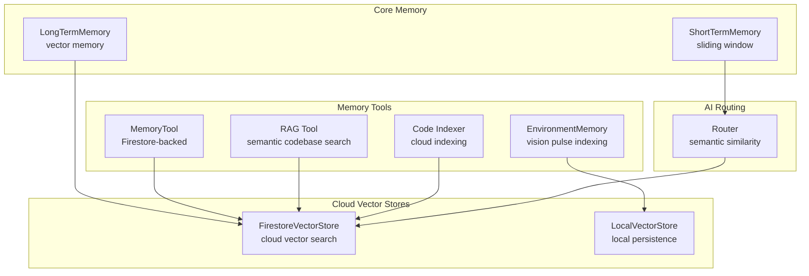
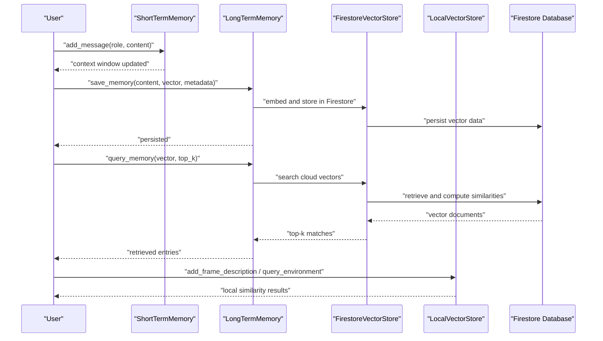
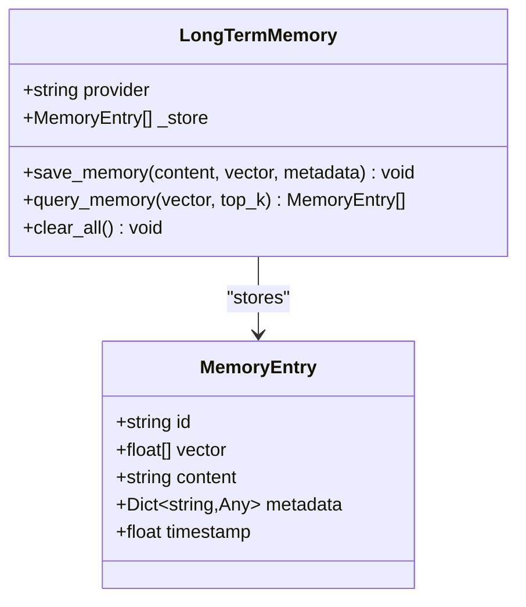
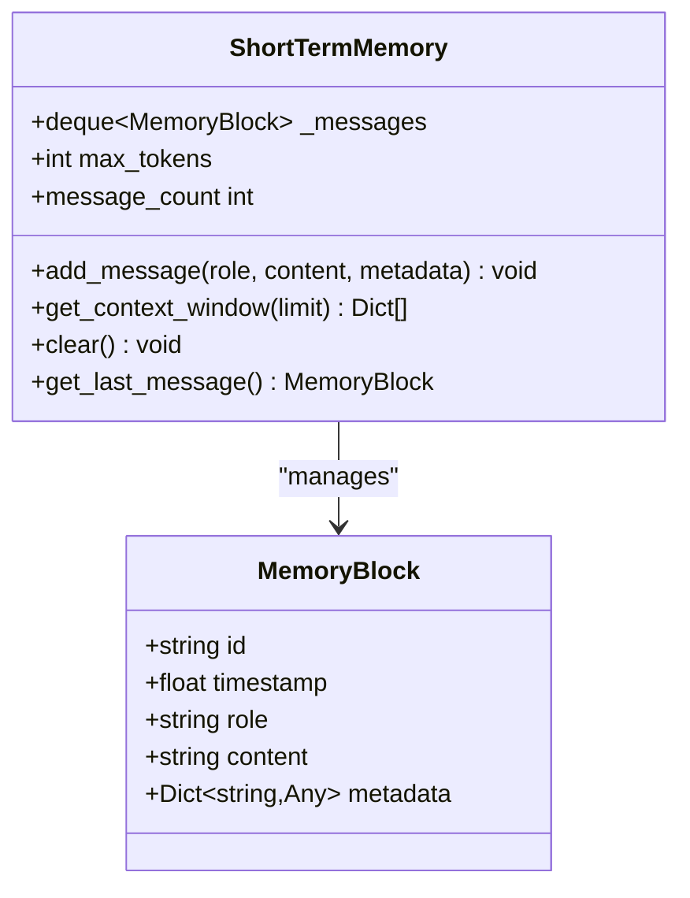
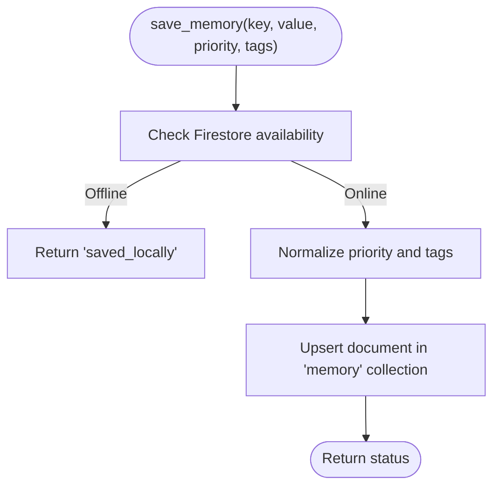
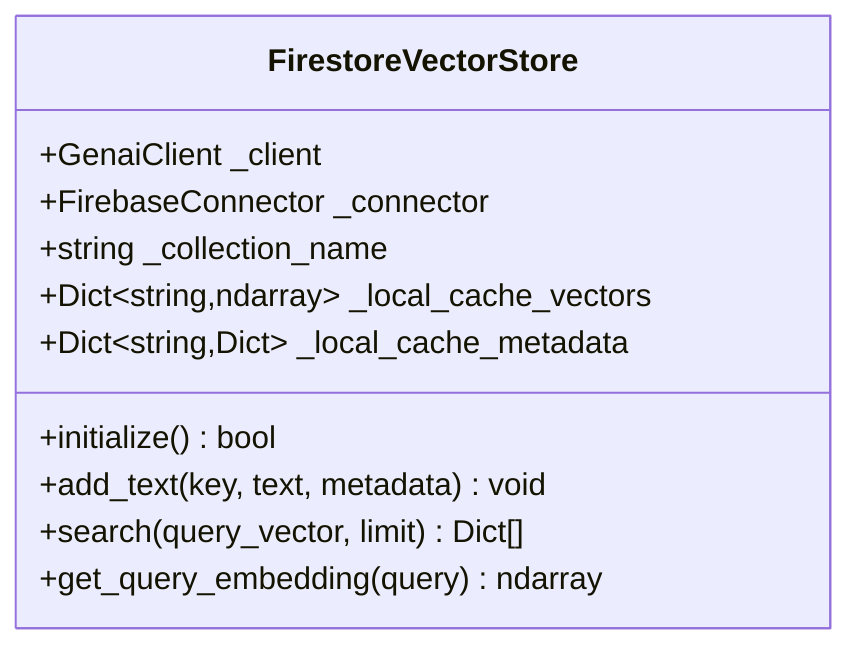
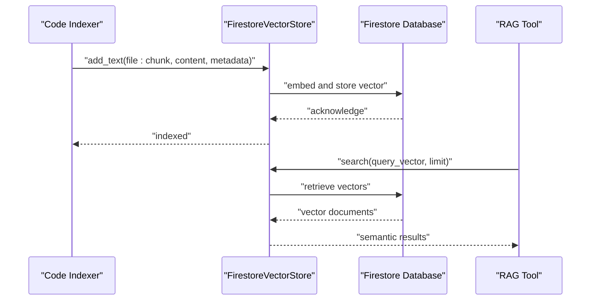
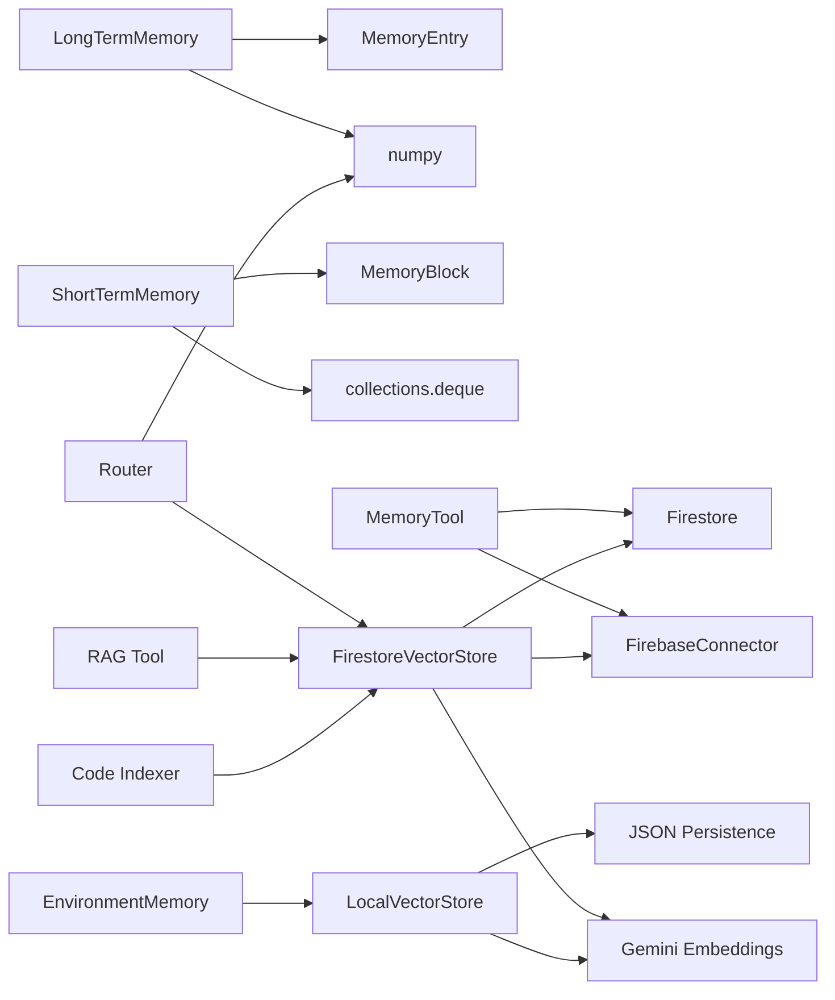

# Memory Management

<cite>
**Referenced Files in This Document**
- [long_term.py](file://core/memory/long_term.py)
- [short_term.py](file://core/memory/short_term.py)
- [memory_tool.py](file://core/tools/memory_tool.py)
- [vector_store.py](file://core/tools/vector_store.py)
- [firestore_vector_store.py](file://core/tools/firestore_vector_store.py)
- [environment_memory.py](file://core/tools/environment_memory.py)
- [router.py](file://core/ai/router.py)
- [rag_tool.py](file://core/tools/rag_tool.py)
- [code_indexer.py](file://core/tools/code_indexer.py)
- [engine.py](file://core/engine.py)
- [README.md](file://README.md)
- [stability_report.json](file://tests/reports/stability_report.json)
- [test_long_session.py](file://tests/benchmarks/test_long_session.py)
</cite>

## Update Summary
**Changes Made**
- Updated vector store architecture to reflect migration from LocalVectorStore to FirestoreVectorStore for cloud-based RAG capabilities
- Removed pickle-based persistence references and security warnings
- Updated RAG tool implementation to use FirestoreVectorStore as the primary vector store
- Revised environment memory to maintain LocalVectorStore for local visual indexing
- Updated architecture diagrams to reflect new cloud-native vector storage approach

## Table of Contents
1. [Introduction](#introduction)
2. [Project Structure](#project-structure)
3. [Core Components](#core-components)
4. [Architecture Overview](#architecture-overview)
5. [Detailed Component Analysis](#detailed-component-analysis)
6. [Dependency Analysis](#dependency-analysis)
7. [Performance Considerations](#performance-considerations)
8. [Troubleshooting Guide](#troubleshooting-guide)
9. [Conclusion](#conclusion)

## Introduction
This document explains the memory management system in Aether Voice OS, focusing on the dual-memory architecture composed of LongTermMemory and ShortTermMemory, the MemoryEntry data model, and the semantic search implementation using cosine similarity. The system has migrated to cloud-based vector storage using FirestoreVectorStore for enterprise scalability, replacing local pickle-based persistence with secure cloud storage. It covers memory operations (save, query, clear), persistence and retrieval patterns, lifecycle and retention strategies, and performance considerations for large-scale deployments.

## Project Structure
The memory system spans several modules with a modernized cloud-first architecture:
- core/memory: Dual-memory classes for short-term and long-term vector memory
- core/tools: Persistent memory tools, cloud vector stores, and environment memory
- core/ai: Semantic routing that leverages vector similarity
- core/tools: RAG tools utilizing FirestoreVectorStore for semantic codebase search
- tests: Benchmarks and reports validating memory stability and performance

**Diagram sources**
- [long_term.py](file://core/memory/long_term.py#L28-L89)
- [short_term.py](file://core/memory/short_term.py#L33-L82)
- [firestore_vector_store.py](file://core/tools/firestore_vector_store.py#L22-L129)
- [vector_store.py](file://core/tools/vector_store.py#L21-L113)
- [memory_tool.py](file://core/tools/memory_tool.py#L40-L328)
- [environment_memory.py](file://core/tools/environment_memory.py#L21-L94)
- [router.py](file://core/ai/router.py#L17-L106)
- [rag_tool.py](file://core/tools/rag_tool.py#L12-L109)
- [code_indexer.py](file://core/tools/code_indexer.py#L15-L220)
- [engine.py](file://core/engine.py#L105-L117)

**Section sources**
- [README.md](file://README.md#L132-L158)

## Core Components
- LongTermMemory: Vector-based permanent memory with cosine similarity search and clear-all functionality, now integrated with cloud vector storage.
- ShortTermMemory: High-frequency sliding window for recent interactions with configurable limits.
- MemoryEntry: Pydantic model representing a vectorized memory record.
- MemoryTool: Persistent memory backed by Firestore with save, recall, list, semantic search, and prune operations.
- FirestoreVectorStore: Cloud-native vector store using Google Cloud Firestore for enterprise scalability and security.
- LocalVectorStore: Lightweight local vector store for environment memory and development scenarios.
- EnvironmentMemory: Indexes and retrieves visual environment descriptions using LocalVectorStore.
- RAG Tool: Semantic search across codebase using FirestoreVectorStore for cloud-based RAG capabilities.

**Section sources**
- [long_term.py](file://core/memory/long_term.py#L14-L89)
- [short_term.py](file://core/memory/short_term.py#L15-L82)
- [memory_tool.py](file://core/tools/memory_tool.py#L40-L328)
- [firestore_vector_store.py](file://core/tools/firestore_vector_store.py#L22-L129)
- [vector_store.py](file://core/tools/vector_store.py#L21-L113)
- [environment_memory.py](file://core/tools/environment_memory.py#L21-L94)
- [rag_tool.py](file://core/tools/rag_tool.py#L12-L109)

## Architecture Overview
The dual-memory architecture has evolved to a cloud-first approach:
- Short-term memory maintains a rolling window of recent messages for immediate context.
- Long-term memory persists vectorized experiences using FirestoreVectorStore for semantic recall across sessions.
- Persistent memory tools provide durable storage with priority and tag-based categorization in Firestore.
- Cloud vector stores enable secure, scalable cosine similarity search for both local and cloud environments.
- Environment memory maintains LocalVectorStore for local visual description indexing.
- RAG tools utilize FirestoreVectorStore for semantic codebase search and discovery.

**Diagram sources**
- [short_term.py](file://core/memory/short_term.py#L46-L82)
- [long_term.py](file://core/memory/long_term.py#L41-L89)
- [firestore_vector_store.py](file://core/tools/firestore_vector_store.py#L37-L129)
- [vector_store.py](file://core/tools/vector_store.py#L67-L113)
- [engine.py](file://core/engine.py#L105-L117)

## Detailed Component Analysis

### LongTermMemory and MemoryEntry
- MemoryEntry fields: id, vector, content, metadata, timestamp.
- Operations:
  - save_memory: creates a MemoryEntry and appends to an internal list.
  - query_memory: computes cosine similarity against all stored vectors and returns top-k matches.
  - clear_all: resets the internal store.

**Diagram sources**
- [long_term.py](file://core/memory/long_term.py#L14-L89)

**Section sources**
- [long_term.py](file://core/memory/long_term.py#L14-L89)

### ShortTermMemory
- MemoryBlock fields: id, timestamp, role, content, metadata.
- Operations:
  - add_message: appends a MemoryBlock to a deque with optional metadata.
  - get_context_window: returns a formatted list of recent messages up to a limit.
  - clear: empties the deque.
  - get_last_message: returns the most recent MemoryBlock.
  - message_count: exposes current count.

**Diagram sources**
- [short_term.py](file://core/memory/short_term.py#L15-L82)

**Section sources**
- [short_term.py](file://core/memory/short_term.py#L15-L82)

### MemoryTool (Persistent Memory)
- Provides save, recall, list, semantic search, and prune operations.
- Integrates with Firestore; falls back to local behavior when offline.
- Supports priority levels and tags for categorization and pruning.

**Diagram sources**
- [memory_tool.py](file://core/tools/memory_tool.py#L40-L92)

**Section sources**
- [memory_tool.py](file://core/tools/memory_tool.py#L40-L328)

### FirestoreVectorStore (Cloud Vector Storage)
- **Updated**: Replaces LocalVectorStore for enterprise cloud-based RAG capabilities.
- Embeds text using Gemini and stores vectors in Firestore for scalable, secure persistence.
- Performs cosine similarity search with scan-and-compute approach for prototype implementation.
- Includes local caching for improved performance and offline capability.
- Eliminates pickle-based persistence security risks.

**Diagram sources**
- [firestore_vector_store.py](file://core/tools/firestore_vector_store.py#L22-L129)

**Section sources**
- [firestore_vector_store.py](file://core/tools/firestore_vector_store.py#L22-L129)

### LocalVectorStore (Local Persistence)
- Maintains lightweight local vector storage for environment memory and development scenarios.
- Uses JSON-based persistence instead of pickle for improved security.
- Supports load/save operations for development and testing environments.

**Section sources**
- [vector_store.py](file://core/tools/vector_store.py#L21-L113)

### EnvironmentMemory
- **Updated**: Now uses LocalVectorStore for local visual frame description indexing.
- Maintains backward compatibility with existing environment memory patterns.
- Adds metadata including timestamp and offset for temporal context.

**Section sources**
- [environment_memory.py](file://core/tools/environment_memory.py#L21-L94)

### RAG Tool and Code Indexer
- **Updated**: Both tools now utilize FirestoreVectorStore for cloud-based RAG capabilities.
- RAG Tool provides semantic search across the entire AetherOS codebase.
- Code Indexer builds semantic embeddings of the codebase and stores them in Firestore.
- Eliminates security risks associated with local pickle file persistence.

**Diagram sources**
- [rag_tool.py](file://core/tools/rag_tool.py#L26-L77)
- [code_indexer.py](file://core/tools/code_indexer.py#L90-L220)
- [firestore_vector_store.py](file://core/tools/firestore_vector_store.py#L37-L129)

**Section sources**
- [rag_tool.py](file://core/tools/rag_tool.py#L12-L109)
- [code_indexer.py](file://core/tools/code_indexer.py#L15-L220)

## Dependency Analysis
- LongTermMemory depends on numpy for cosine similarity and uses MemoryEntry for storage.
- ShortTermMemory uses collections.deque for efficient append/pop operations.
- MemoryTool depends on Firestore via FirebaseConnector and datetime/timezone for metadata.
- **Updated**: FirestoreVectorStore depends on Gemini embeddings and Firestore for cloud storage.
- **Updated**: RAG Tool and Code Indexer utilize FirestoreVectorStore for cloud-based RAG.
- LocalVectorStore maintains local-only dependencies for environment memory.
- Router demonstrates cosine similarity usage for agent selection against cloud-stored vectors.

**Diagram sources**
- [long_term.py](file://core/memory/long_term.py#L28-L89)
- [short_term.py](file://core/memory/short_term.py#L33-L82)
- [memory_tool.py](file://core/tools/memory_tool.py#L23-L37)
- [firestore_vector_store.py](file://core/tools/firestore_vector_store.py#L13-L17)
- [vector_store.py](file://core/tools/vector_store.py#L10-L16)
- [router.py](file://core/ai/router.py#L84-L106)
- [rag_tool.py](file://core/tools/rag_tool.py#L12-L16)
- [code_indexer.py](file://core/tools/code_indexer.py#L15-L16)
- [environment_memory.py](file://core/tools/environment_memory.py#L13)

**Section sources**
- [long_term.py](file://core/memory/long_term.py#L28-L89)
- [short_term.py](file://core/memory/short_term.py#L33-L82)
- [memory_tool.py](file://core/tools/memory_tool.py#L23-L37)
- [firestore_vector_store.py](file://core/tools/firestore_vector_store.py#L13-L17)
- [vector_store.py](file://core/tools/vector_store.py#L10-L16)
- [router.py](file://core/ai/router.py#L84-L106)
- [rag_tool.py](file://core/tools/rag_tool.py#L12-L16)
- [code_indexer.py](file://core/tools/code_indexer.py#L15-L16)
- [environment_memory.py](file://core/tools/environment_memory.py#L13)

## Performance Considerations
- **Updated**: Cloud vector storage eliminates pickle-based security risks while enabling enterprise scalability.
- Vector similarity cost: Long-term and environment queries iterate over stored vectors; top-k selection sorts results. For large-scale deployments:
  - FirestoreVectorStore provides automatic scaling and managed infrastructure.
  - Consider Firestore Vector Search Extension or Vertex AI Search for production vector operations.
  - Pre-filtering by tags or metadata to reduce candidate sets.
- **Updated**: FirestoreVectorStore includes local caching to reduce cloud dependency and improve performance.
- Memory growth: Benchmarks show stable memory behavior over long sessions; monitor cloud storage usage and apply pruning or retention policies.
- Embedding costs: Batch embedding requests and reuse cached embeddings where appropriate.
- Deque sizing: Tune max_messages and max_tokens to balance context quality and memory footprint.

## Troubleshooting Guide
Common issues and remedies:
- **Updated**: Firestore connectivity: Ensure proper Firebase configuration and network connectivity for cloud vector operations.
- **Updated**: MemoryTool falls back to local behavior; ensure credentials are configured for persistent storage.
- **Updated**: FirestoreVectorStore initialization failures: Verify API key configuration and Firestore project setup.
- High CPU usage: Verify PyAudio C extensions and reduce frontend visualizer FPS.
- Memory growth anomalies: Review long sessions and pruning operations; confirm periodic cleanup.
- **Updated**: Vector search performance: Monitor Firestore query costs and consider implementing pagination for large datasets.

**Section sources**
- [memory_tool.py](file://core/tools/memory_tool.py#L56-L63)
- [firestore_vector_store.py](file://core/tools/firestore_vector_store.py#L33-L35)
- [README.md](file://README.md#L244-L249)
- [stability_report.json](file://tests/reports/stability_report.json#L1-L66)
- [test_long_session.py](file://tests/benchmarks/test_long_session.py#L48-L69)

## Conclusion
Aether Voice OS has evolved its memory management system to a cloud-first architecture: ShortTermMemory for immediate context and LongTermMemory integrated with FirestoreVectorStore for persistent, vectorized recall. The migration eliminates pickle-based security risks while providing enterprise scalability through Firestore. MemoryTool and cloud vector stores offer semantic search and persistence, while EnvironmentMemory maintains LocalVectorStore for local visual context. RAG tools leverage FirestoreVectorStore for semantic codebase search, and the system scales efficiently for long sessions and large-scale usage with improved security and reliability.