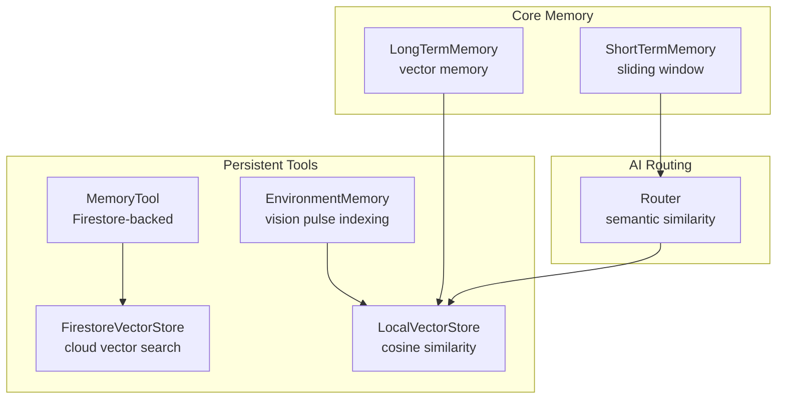
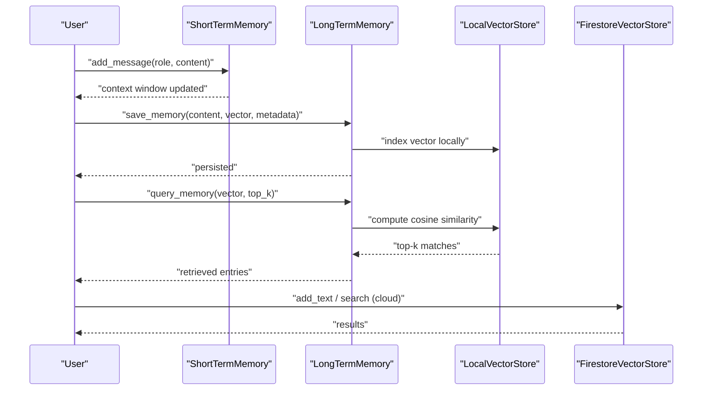
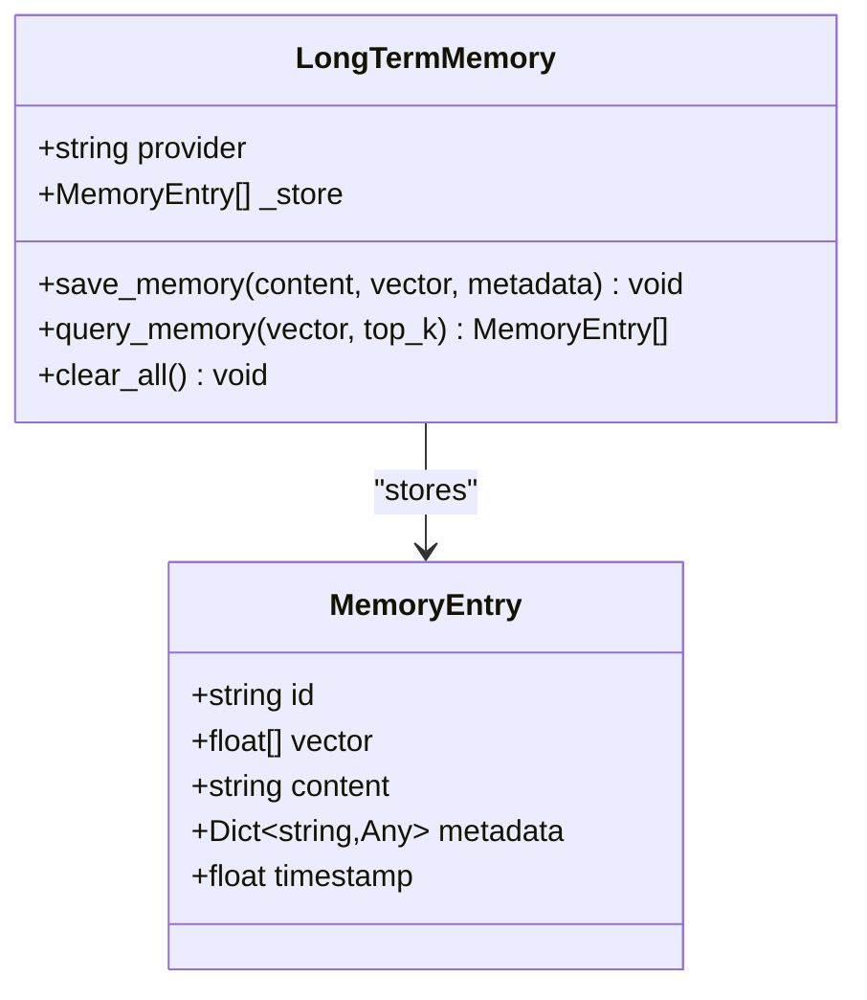
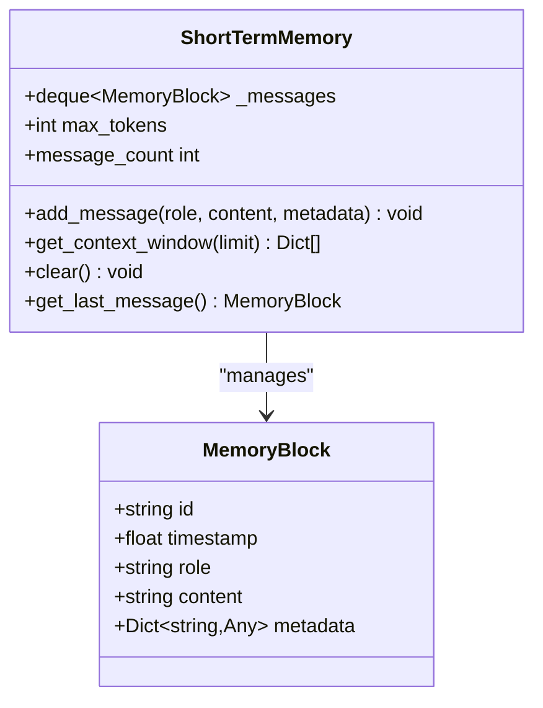
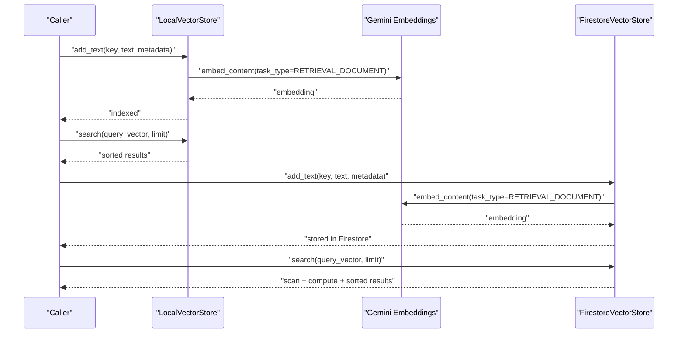
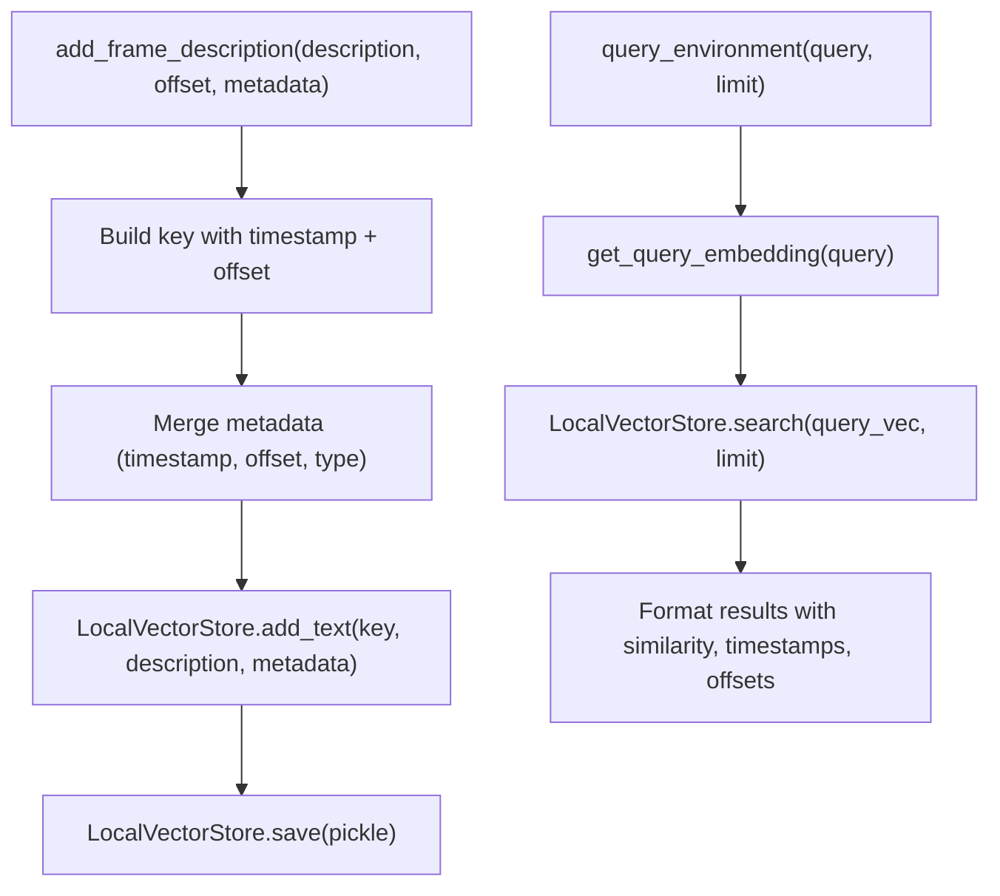
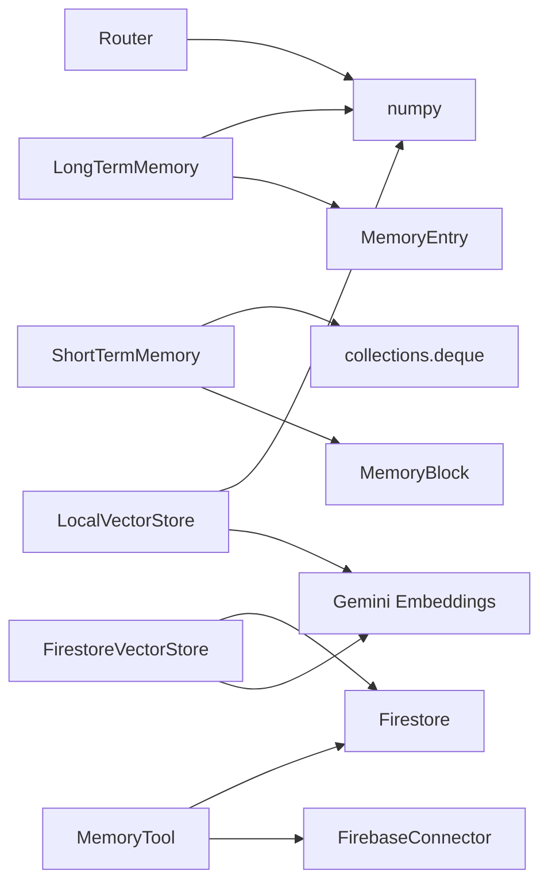

# Memory Management

<cite>
**Referenced Files in This Document**
- [long_term.py](file://core/memory/long_term.py)
- [short_term.py](file://core/memory/short_term.py)
- [memory_tool.py](file://core/tools/memory_tool.py)
- [vector_store.py](file://core/tools/vector_store.py)
- [firestore_vector_store.py](file://core/tools/firestore_vector_store.py)
- [environment_memory.py](file://core/tools/environment_memory.py)
- [router.py](file://core/ai/router.py)
- [README.md](file://README.md)
- [stability_report.json](file://tests/reports/stability_report.json)
- [test_long_session.py](file://tests/benchmarks/test_long_session.py)
</cite>

## Table of Contents
1. [Introduction](#introduction)
2. [Project Structure](#project-structure)
3. [Core Components](#core-components)
4. [Architecture Overview](#architecture-overview)
5. [Detailed Component Analysis](#detailed-component-analysis)
6. [Dependency Analysis](#dependency-analysis)
7. [Performance Considerations](#performance-considerations)
8. [Troubleshooting Guide](#troubleshooting-guide)
9. [Conclusion](#conclusion)

## Introduction
This document explains the memory management system in Aether Voice OS, focusing on the dual-memory architecture composed of LongTermMemory and ShortTermMemory, the MemoryEntry data model, and the semantic search implementation using cosine similarity. It also covers memory operations (save, query, clear), persistence and retrieval patterns, lifecycle and retention strategies, and performance considerations for large-scale deployments.

## Project Structure
The memory system spans several modules:
- core/memory: Dual-memory classes for short-term and long-term vector memory
- core/tools: Persistent memory tools, local/cloud vector stores, and environment memory
- core/ai: Semantic routing that leverages vector similarity
- tests: Benchmarks and reports validating memory stability and performance

**Diagram sources**
- [long_term.py](file://core/memory/long_term.py#L24-L73)
- [short_term.py](file://core/memory/short_term.py#L28-L71)
- [memory_tool.py](file://core/tools/memory_tool.py#L40-L329)
- [vector_store.py](file://core/tools/vector_store.py#L21-L112)
- [firestore_vector_store.py](file://core/tools/firestore_vector_store.py#L22-L129)
- [environment_memory.py](file://core/tools/environment_memory.py#L21-L94)
- [router.py](file://core/ai/router.py#L66-L83)

**Section sources**
- [README.md](file://README.md#L132-L158)

## Core Components
- LongTermMemory: Vector-based permanent memory with cosine similarity search and clear-all functionality.
- ShortTermMemory: High-frequency sliding window for recent interactions with configurable limits.
- MemoryEntry: Pydantic model representing a vectorized memory record.
- MemoryTool: Persistent memory backed by Firestore with save, recall, list, semantic search, and prune operations.
- LocalVectorStore and FirestoreVectorStore: Embedding generation and cosine similarity search for semantic retrieval.
- EnvironmentMemory: Indexes and retrieves visual environment descriptions using local vector storage.

**Section sources**
- [long_term.py](file://core/memory/long_term.py#L12-L73)
- [short_term.py](file://core/memory/short_term.py#L13-L71)
- [memory_tool.py](file://core/tools/memory_tool.py#L40-L329)
- [vector_store.py](file://core/tools/vector_store.py#L21-L112)
- [firestore_vector_store.py](file://core/tools/firestore_vector_store.py#L22-L129)
- [environment_memory.py](file://core/tools/environment_memory.py#L21-L94)

## Architecture Overview
The dual-memory architecture separates concerns:
- Short-term memory maintains a rolling window of recent messages for immediate context.
- Long-term memory persists vectorized experiences for semantic recall across sessions.
- Persistent memory tools provide durable storage with priority and tag-based categorization.
- Vector stores enable cosine similarity search for both local and cloud environments.
- Environment memory indexes visual descriptions to ground spatial and temporal context.

**Diagram sources**
- [short_term.py](file://core/memory/short_term.py#L38-L69)
- [long_term.py](file://core/memory/long_term.py#L36-L73)
- [vector_store.py](file://core/tools/vector_store.py#L66-L112)
- [firestore_vector_store.py](file://core/tools/firestore_vector_store.py#L37-L129)

## Detailed Component Analysis

### LongTermMemory and MemoryEntry
- MemoryEntry fields: id, vector, content, metadata, timestamp.
- Operations:
  - save_memory: creates a MemoryEntry and appends to an internal list.
  - query_memory: computes cosine similarity against all stored vectors and returns top-k matches.
  - clear_all: resets the internal store.

**Diagram sources**
- [long_term.py](file://core/memory/long_term.py#L12-L73)

**Section sources**
- [long_term.py](file://core/memory/long_term.py#L12-L73)

### ShortTermMemory
- MemoryBlock fields: id, timestamp, role, content, metadata.
- Operations:
  - add_message: appends a MemoryBlock to a deque with optional metadata.
  - get_context_window: returns a formatted list of recent messages up to a limit.
  - clear: empties the deque.
  - get_last_message: returns the most recent MemoryBlock.
  - message_count: exposes current count.

**Diagram sources**
- [short_term.py](file://core/memory/short_term.py#L13-L71)

**Section sources**
- [short_term.py](file://core/memory/short_term.py#L13-L71)

### MemoryTool (Persistent Memory)
- Provides save, recall, list, semantic search, and prune operations.
- Integrates with Firestore; falls back to local behavior when offline.
- Supports priority levels and tags for categorization and pruning.

**Diagram sources**
- [memory_tool.py](file://core/tools/memory_tool.py#L40-L92)

**Section sources**
- [memory_tool.py](file://core/tools/memory_tool.py#L40-L329)

### Vector Stores and Semantic Search
- LocalVectorStore: Embeds text and performs cosine similarity search; supports load/save via pickle.
- FirestoreVectorStore: Embeds and stores vectors in Firestore; performs similarity scan-and-compute.
- Router: Demonstrates cosine similarity for semantic routing against agent fingerprints.

**Diagram sources**
- [vector_store.py](file://core/tools/vector_store.py#L66-L112)
- [firestore_vector_store.py](file://core/tools/firestore_vector_store.py#L37-L129)
- [router.py](file://core/ai/router.py#L66-L83)

**Section sources**
- [vector_store.py](file://core/tools/vector_store.py#L21-L112)
- [firestore_vector_store.py](file://core/tools/firestore_vector_store.py#L22-L129)
- [router.py](file://core/ai/router.py#L66-L83)

### EnvironmentMemory
- Indexes visual frame descriptions using LocalVectorStore.
- Adds metadata including timestamp and offset.
- Retrieves similar frames using query embeddings and similarity scoring.

**Diagram sources**
- [environment_memory.py](file://core/tools/environment_memory.py#L30-L82)
- [vector_store.py](file://core/tools/vector_store.py#L66-L112)

**Section sources**
- [environment_memory.py](file://core/tools/environment_memory.py#L21-L94)

## Dependency Analysis
- LongTermMemory depends on numpy for cosine similarity and uses MemoryEntry for storage.
- ShortTermMemory uses collections.deque for efficient append/pop operations.
- MemoryTool depends on Firestore via FirebaseConnector and datetime/timezone for metadata.
- LocalVectorStore and FirestoreVectorStore depend on Gemini embeddings and numpy for similarity.
- Router demonstrates cosine similarity usage for agent selection.

**Diagram sources**
- [long_term.py](file://core/memory/long_term.py#L24-L73)
- [short_term.py](file://core/memory/short_term.py#L28-L71)
- [memory_tool.py](file://core/tools/memory_tool.py#L33-L37)
- [vector_store.py](file://core/tools/vector_store.py#L21-L112)
- [firestore_vector_store.py](file://core/tools/firestore_vector_store.py#L22-L129)
- [router.py](file://core/ai/router.py#L66-L83)

**Section sources**
- [long_term.py](file://core/memory/long_term.py#L24-L73)
- [short_term.py](file://core/memory/short_term.py#L28-L71)
- [memory_tool.py](file://core/tools/memory_tool.py#L33-L37)
- [vector_store.py](file://core/tools/vector_store.py#L21-L112)
- [firestore_vector_store.py](file://core/tools/firestore_vector_store.py#L22-L129)
- [router.py](file://core/ai/router.py#L66-L83)

## Performance Considerations
- Vector similarity cost: Long-term and environment queries iterate over stored vectors; top-k selection sorts results. For large-scale deployments, consider:
  - Indexing libraries (FAISS, Annoy) or cloud vector search extensions.
  - Pre-filtering by tags or metadata to reduce candidate sets.
- Memory growth: Benchmarks show stable memory behavior over long sessions; monitor RSS growth and apply pruning or retention policies.
- Embedding costs: Batch embedding requests and reuse cached embeddings where appropriate.
- Deque sizing: Tune max_messages and max_tokens to balance context quality and memory footprint.

[No sources needed since this section provides general guidance]

## Troubleshooting Guide
Common issues and remedies:
- Firebase offline: MemoryTool falls back to local behavior; ensure credentials are configured for persistent storage.
- High CPU usage: Verify PyAudio C extensions and reduce frontend visualizer FPS.
- Memory growth anomalies: Review long sessions and pruning operations; confirm periodic cleanup.

**Section sources**
- [memory_tool.py](file://core/tools/memory_tool.py#L56-L63)
- [README.md](file://README.md#L244-L249)
- [stability_report.json](file://tests/reports/stability_report.json#L1-L66)
- [test_long_session.py](file://tests/benchmarks/test_long_session.py#L48-L69)

## Conclusion
Aether Voice OS implements a robust dual-memory architecture: ShortTermMemory for immediate context and LongTermMemory for persistent, vectorized recall. MemoryTool and vector stores provide semantic search and persistence, while EnvironmentMemory extends grounding to visual context. By tuning retention, leveraging pruning, and optimizing vector operations, the system scales efficiently for long sessions and large-scale usage.