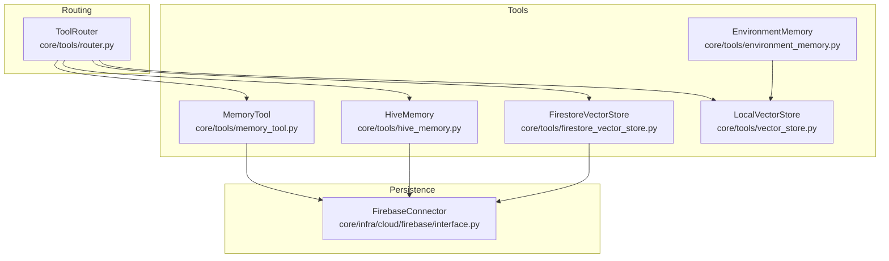
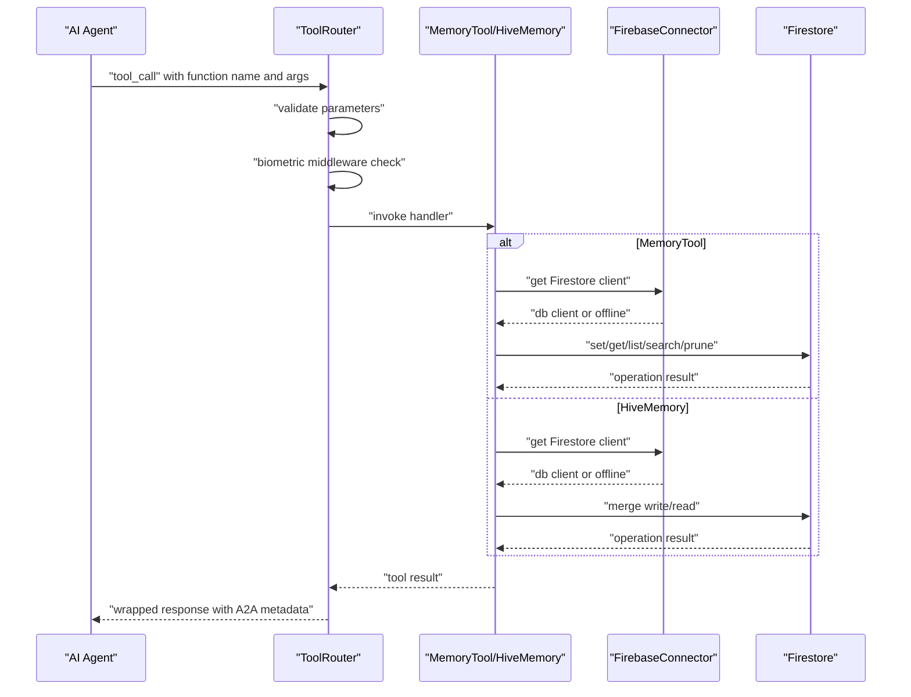
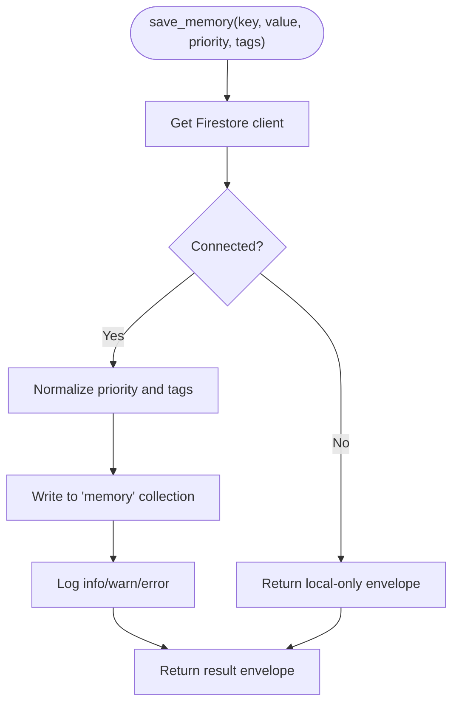
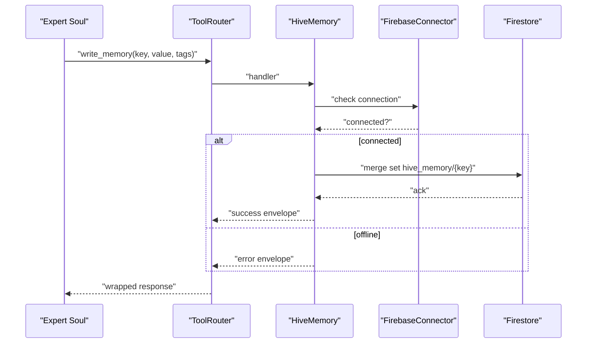
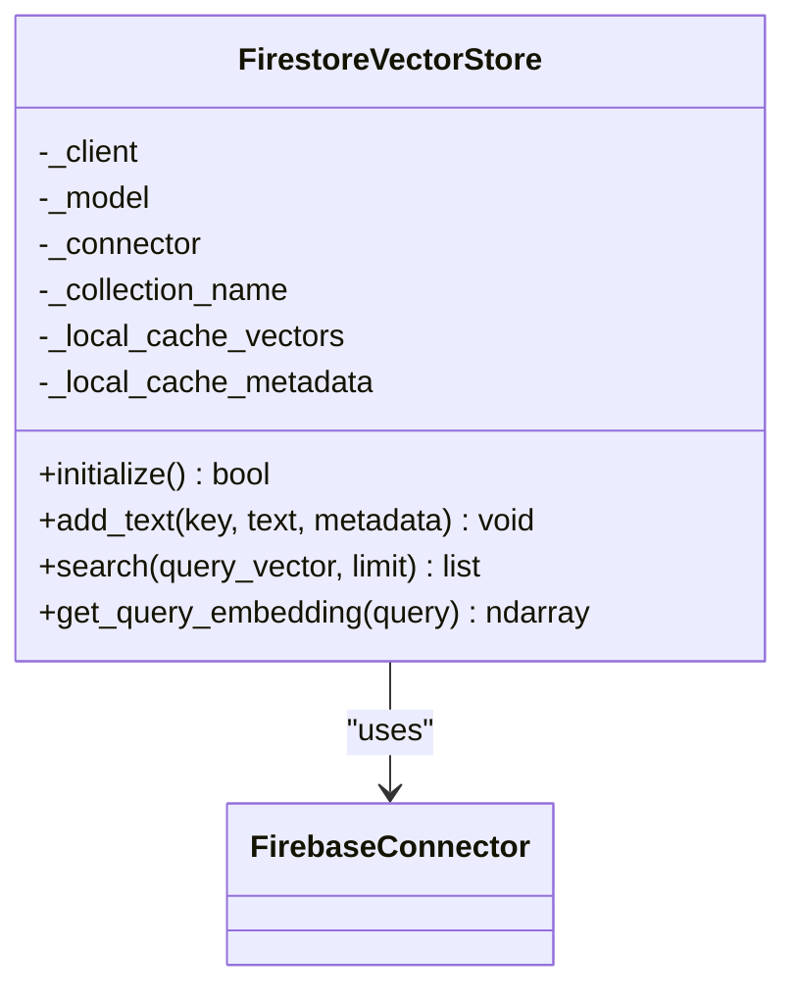
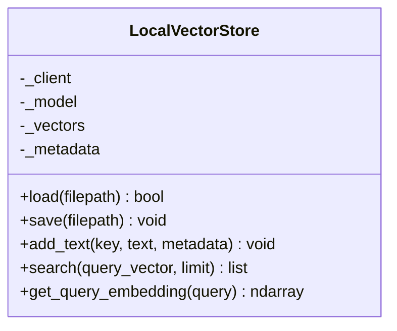
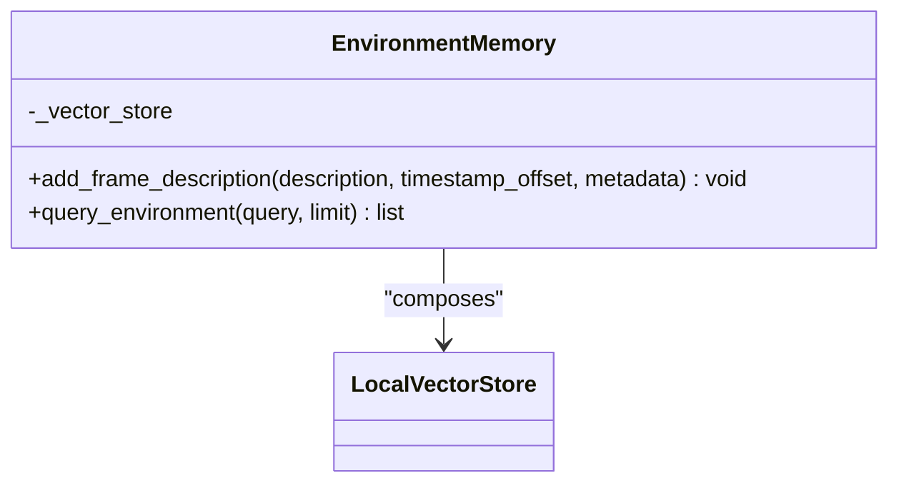
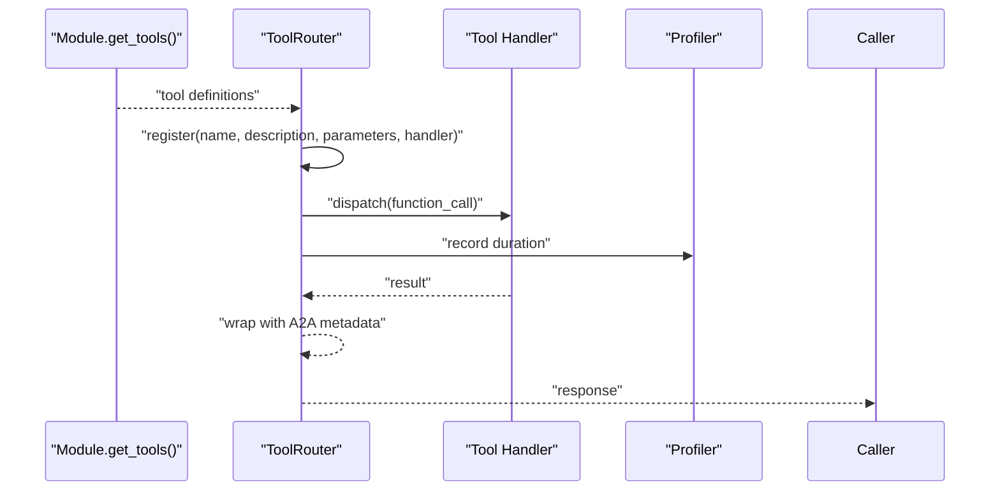
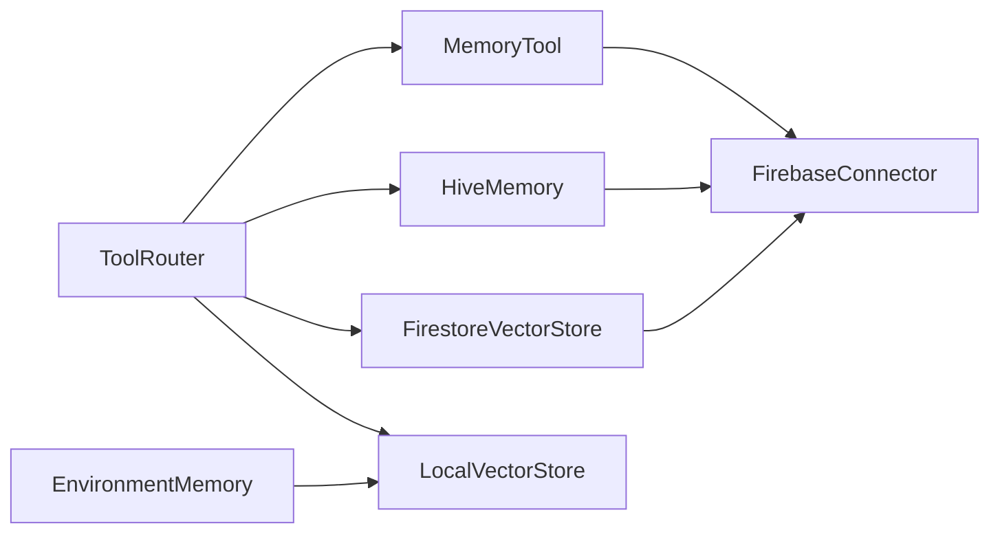

# Memory Tool System

<cite>
**Referenced Files in This Document**
- [memory_tool.py](file://core/tools/memory_tool.py)
- [hive_memory.py](file://core/tools/hive_memory.py)
- [firestore_vector_store.py](file://core/tools/firestore_vector_store.py)
- [vector_store.py](file://core/tools/vector_store.py)
- [environment_memory.py](file://core/tools/environment_memory.py)
- [router.py](file://core/tools/router.py)
- [interface.py](file://core/infra/cloud/firebase/interface.py)
- [test_memory_deep.py](file://tests/unit/test_memory_deep.py)
</cite>

## Table of Contents
1. [Introduction](#introduction)
2. [Project Structure](#project-structure)
3. [Core Components](#core-components)
4. [Architecture Overview](#architecture-overview)
5. [Detailed Component Analysis](#detailed-component-analysis)
6. [Dependency Analysis](#dependency-analysis)
7. [Performance Considerations](#performance-considerations)
8. [Troubleshooting Guide](#troubleshooting-guide)
9. [Conclusion](#conclusion)
10. [Appendices](#appendices)

## Introduction
This document describes the Memory Tool System that powers programmatic memory operations in the Aether Live Agent platform. It covers:
- The MemoryTool module for persistent session memory backed by Firestore
- The HiveMemory implementation for swarm intelligence and collaborative memory
- The FirestoreVectorStore integration for scalable vector storage and semantic search
- Tool registration, parameter validation, and error handling mechanisms
- Security considerations including biometric middleware
- Usage patterns in AI agent workflows, tool chaining, and memory manipulation
- Guidance for extending the system with custom memory providers and specialized operations

## Project Structure
The memory tool system is organized around modular tool modules, a central tool router, and a Firebase-backed persistence layer:
- MemoryTool: key-value memory with priority and tags
- HiveMemory: shared collective memory for expert collaboration
- Vector stores: local and cloud vector stores for semantic search
- Tool router: registers tools, validates parameters, and dispatches function calls
- FirebaseConnector: manages Firestore connectivity and session scoping

**Diagram sources**
- [memory_tool.py](file://core/tools/memory_tool.py#L1-L330)
- [hive_memory.py](file://core/tools/hive_memory.py#L1-L115)
- [vector_store.py](file://core/tools/vector_store.py#L1-L112)
- [firestore_vector_store.py](file://core/tools/firestore_vector_store.py#L1-L129)
- [environment_memory.py](file://core/tools/environment_memory.py#L1-L94)
- [router.py](file://core/tools/router.py#L1-L360)
- [interface.py](file://core/infra/cloud/firebase/interface.py#L1-L259)

**Section sources**
- [memory_tool.py](file://core/tools/memory_tool.py#L1-L330)
- [hive_memory.py](file://core/tools/hive_memory.py#L1-L115)
- [vector_store.py](file://core/tools/vector_store.py#L1-L112)
- [firestore_vector_store.py](file://core/tools/firestore_vector_store.py#L1-L129)
- [environment_memory.py](file://core/tools/environment_memory.py#L1-L94)
- [router.py](file://core/tools/router.py#L1-L360)
- [interface.py](file://core/infra/cloud/firebase/interface.py#L1-L259)

## Core Components
- MemoryTool: Provides save, recall, list, semantic search, and prune operations with priority and tags. It integrates with FirebaseConnector for persistence and falls back to local behavior when offline.
- HiveMemory: Enables writing and reading collective memory for expert collaboration, scoped to the current session.
- FirestoreVectorStore: Cloud-native vector store using Firestore for persistence and Gemini for embeddings, with cosine similarity search.
- LocalVectorStore: Lightweight local-first vector store for semantic routing and tool discovery.
- EnvironmentMemory: Semantic indexing and retrieval of visual environment states using LocalVectorStore.
- ToolRouter: Central dispatcher that registers tools, validates parameters, performs biometric middleware checks, and wraps responses with A2A metadata.

**Section sources**
- [memory_tool.py](file://core/tools/memory_tool.py#L40-L330)
- [hive_memory.py](file://core/tools/hive_memory.py#L25-L115)
- [firestore_vector_store.py](file://core/tools/firestore_vector_store.py#L22-L129)
- [vector_store.py](file://core/tools/vector_store.py#L21-L112)
- [environment_memory.py](file://core/tools/environment_memory.py#L21-L94)
- [router.py](file://core/tools/router.py#L120-L360)

## Architecture Overview
The system routes AI agent function calls to tool handlers, which may interact with Firestore via FirebaseConnector. MemoryTool and HiveMemory persist data to Firestore collections, while vector stores enable semantic search and tool discovery.

**Diagram sources**
- [router.py](file://core/tools/router.py#L234-L356)
- [memory_tool.py](file://core/tools/memory_tool.py#L33-L38)
- [hive_memory.py](file://core/tools/hive_memory.py#L20-L58)
- [interface.py](file://core/infra/cloud/firebase/interface.py#L31-L61)

## Detailed Component Analysis

### MemoryTool
MemoryTool provides five primary operations:
- save_memory: persists a key-value pair with priority and tags; falls back to local behavior when Firebase is unavailable
- recall_memory: retrieves a memory by key
- list_memories: lists memories with optional priority filter
- semantic_search: tag-based lookup using Firestore array_contains_any
- prune_memories: deletes all memories of a given priority

Key behaviors:
- Parameter validation and normalization (e.g., priority enum)
- Safe fallback when Firebase is offline
- Consistent result envelopes for downstream consumers
- Session scoping via FirebaseConnector

**Diagram sources**
- [memory_tool.py](file://core/tools/memory_tool.py#L40-L93)
- [memory_tool.py](file://core/tools/memory_tool.py#L33-L38)

**Section sources**
- [memory_tool.py](file://core/tools/memory_tool.py#L40-L330)

### HiveMemory
HiveMemory enables shared, session-scoped memory for expert collaboration:
- write_collective_memory: merges JSON-serializable value into hive_memory collection
- read_collective_memory: returns consistent envelope with value or error/not_found
- get_tools: registers write_memory and read_memory with ToolRouter

**Diagram sources**
- [hive_memory.py](file://core/tools/hive_memory.py#L25-L58)
- [hive_memory.py](file://core/tools/hive_memory.py#L81-L115)
- [interface.py](file://core/infra/cloud/firebase/interface.py#L31-L61)

**Section sources**
- [hive_memory.py](file://core/tools/hive_memory.py#L25-L115)

### FirestoreVectorStore
Cloud-native vector store using Firestore for persistence and Gemini for embeddings:
- add_text: generates embeddings and writes vectors with sanitized keys
- search: performs cosine similarity scan-and-compare (prototype)
- get_query_embedding: generates query embeddings

**Diagram sources**
- [firestore_vector_store.py](file://core/tools/firestore_vector_store.py#L22-L129)
- [interface.py](file://core/infra/cloud/firebase/interface.py#L15-L61)

**Section sources**
- [firestore_vector_store.py](file://core/tools/firestore_vector_store.py#L22-L129)

### LocalVectorStore
Local-first vector store for semantic routing and tool discovery:
- add_text: embeds and stores vectors and metadata
- search: computes cosine similarity and returns top-k results
- get_query_embedding: generates query embeddings

**Diagram sources**
- [vector_store.py](file://core/tools/vector_store.py#L21-L112)

**Section sources**
- [vector_store.py](file://core/tools/vector_store.py#L21-L112)

### EnvironmentMemory
Manages semantic indexing and retrieval of visual environment states:
- add_frame_description: indexes frame descriptions with metadata
- query_environment: searches visual history using LocalVectorStore
- Singleton access via get_env_memory

**Diagram sources**
- [environment_memory.py](file://core/tools/environment_memory.py#L21-L94)
- [vector_store.py](file://core/tools/vector_store.py#L21-L112)

**Section sources**
- [environment_memory.py](file://core/tools/environment_memory.py#L21-L94)

### ToolRouter Integration
ToolRouter registers tools and orchestrates execution:
- register_module: imports module-level get_tools() and registers handlers
- dispatch: validates parameters, applies biometric middleware, executes handler, and wraps results
- get_declarations: produces Gemini-compatible function declarations

**Diagram sources**
- [router.py](file://core/tools/router.py#L183-L200)
- [router.py](file://core/tools/router.py#L234-L356)

**Section sources**
- [router.py](file://core/tools/router.py#L120-L360)

## Dependency Analysis
- MemoryTool depends on FirebaseConnector for Firestore access and uses a module-level setter to inject the connector at startup.
- HiveMemory also depends on FirebaseConnector and writes to a dedicated hive_memory collection.
- FirestoreVectorStore composes FirebaseConnector and uses Gemini embeddings.
- LocalVectorStore is independent and used by ToolRouter for semantic recovery and by EnvironmentMemory for visual history.
- ToolRouter composes LocalVectorStore for semantic tool discovery and applies biometric middleware for sensitive tools.

**Diagram sources**
- [router.py](file://core/tools/router.py#L141-L144)
- [memory_tool.py](file://core/tools/memory_tool.py#L27-L31)
- [hive_memory.py](file://core/tools/hive_memory.py#L20-L22)
- [firestore_vector_store.py](file://core/tools/firestore_vector_store.py#L28-L35)
- [environment_memory.py](file://core/tools/environment_memory.py#L26-L28)
- [interface.py](file://core/infra/cloud/firebase/interface.py#L15-L61)

**Section sources**
- [memory_tool.py](file://core/tools/memory_tool.py#L27-L31)
- [hive_memory.py](file://core/tools/hive_memory.py#L20-L22)
- [firestore_vector_store.py](file://core/tools/firestore_vector_store.py#L28-L35)
- [router.py](file://core/tools/router.py#L141-L144)
- [environment_memory.py](file://core/tools/environment_memory.py#L26-L28)
- [interface.py](file://core/infra/cloud/firebase/interface.py#L15-L61)

## Performance Considerations
- MemoryTool and HiveMemory operations are Firestore-bound; latency depends on network and Firestore region support.
- FirestoreVectorStore implements a scan-and-compute approach for cosine similarity; production deployments should leverage Firebase Vector Search Extension or Vertex AI Search for large-scale vector search.
- LocalVectorStore persists to disk via pickle to avoid repeated embeddings; consider tuning save intervals for frequent updates.
- ToolRouter profiles tool execution times and maintains rolling windows to prevent memory leaks.

[No sources needed since this section provides general guidance]

## Troubleshooting Guide
Common issues and resolutions:
- Firebase offline: MemoryTool and HiveMemory return offline envelopes; ensure FirebaseConnector.initialize succeeds and is_connected is true.
- Unknown tool or semantic mismatch: ToolRouter attempts semantic recovery using LocalVectorStore; verify tool names and descriptions are indexed.
- Biometric middleware failures: Sensitive tools require biometric verification; confirm context includes biometric_verified flag.
- Argument validation errors: ToolRouter returns 400 with invalid arguments; verify parameter schemas from get_tools().

**Section sources**
- [memory_tool.py](file://core/tools/memory_tool.py#L57-L63)
- [hive_memory.py](file://core/tools/hive_memory.py#L37-L41)
- [router.py](file://core/tools/router.py#L250-L283)
- [router.py](file://core/tools/router.py#L288-L301)
- [router.py](file://core/tools/router.py#L344-L355)

## Conclusion
The Memory Tool System provides a cohesive, extensible foundation for memory operations across AI agents:
- Persistent memory with priority and tags
- Swarm intelligence via collective memory
- Scalable vector storage with cloud-native persistence
- Robust tool orchestration with parameter validation and security middleware
Future enhancements can include custom memory providers, advanced vector search backends, and richer semantic recovery.

[No sources needed since this section summarizes without analyzing specific files]

## Appendices

### Tool Registration and Parameter Validation
- MemoryTool.get_tools defines function declarations and required parameters for save, recall, list, semantic search, and prune.
- HiveMemory.get_tools defines write_memory and read_memory with required fields.
- ToolRouter.register_module loads tool definitions from modules and registers handlers.
- ToolRouter.dispatch validates parameters and applies biometric middleware for sensitive tools.

**Section sources**
- [memory_tool.py](file://core/tools/memory_tool.py#L246-L330)
- [hive_memory.py](file://core/tools/hive_memory.py#L81-L115)
- [router.py](file://core/tools/router.py#L183-L200)
- [router.py](file://core/tools/router.py#L234-L356)

### Security Considerations
- Biometric middleware protects sensitive tools by verifying biometric integrity using session context.
- FirebaseConnector manages secure credential initialization and session scoping.
- ToolRouter maintains a set of sensitive tools and applies middleware checks during dispatch.

**Section sources**
- [router.py](file://core/tools/router.py#L46-L85)
- [router.py](file://core/tools/router.py#L126-L133)
- [router.py](file://core/tools/router.py#L288-L301)
- [interface.py](file://core/infra/cloud/firebase/interface.py#L31-L61)

### Examples of Usage Patterns
- AI agent saves user preferences with priority and tags, then recalls them during subsequent turns.
- Expert souls write collective state for handoff continuity; subsequent experts read and extend the state.
- Tool chaining: EnvironmentMemory indexes visual frames; downstream tools query environment for spatial grounding.
- Memory manipulation: Pruning low-priority memories to maintain context budget; semantic search by tags for relevant knowledge.

**Section sources**
- [memory_tool.py](file://core/tools/memory_tool.py#L40-L243)
- [hive_memory.py](file://core/tools/hive_memory.py#L25-L78)
- [environment_memory.py](file://core/tools/environment_memory.py#L30-L82)

### Extending the System
- Implement a custom memory provider by following MemoryTool’s result envelope pattern and integrating with ToolRouter.register_module.
- Add specialized memory operations by defining handlers and function declarations in a new module and registering via ToolRouter.register_module.
- For vector search, implement a new vector store class compatible with LocalVectorStore.search and add_text signatures, then wire it into ToolRouter or domain-specific tools.

**Section sources**
- [memory_tool.py](file://core/tools/memory_tool.py#L246-L330)
- [router.py](file://core/tools/router.py#L183-L200)
- [vector_store.py](file://core/tools/vector_store.py#L83-L112)