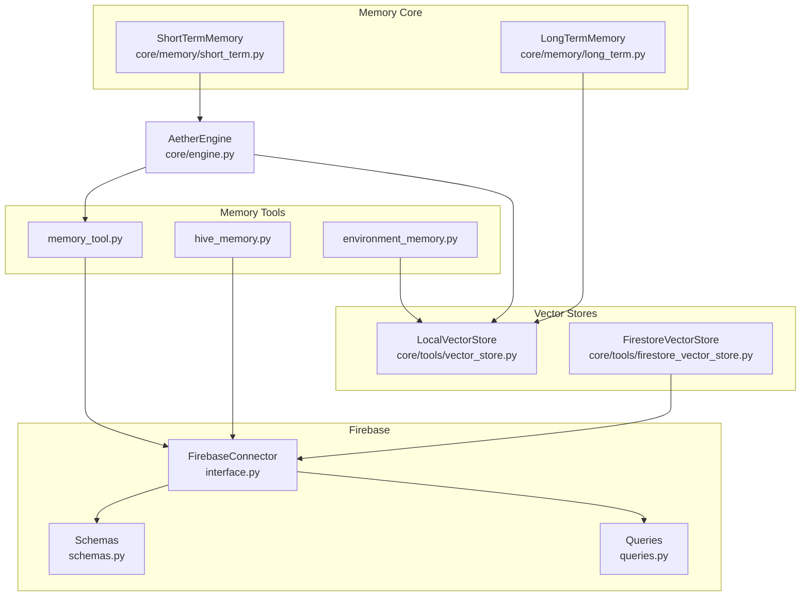
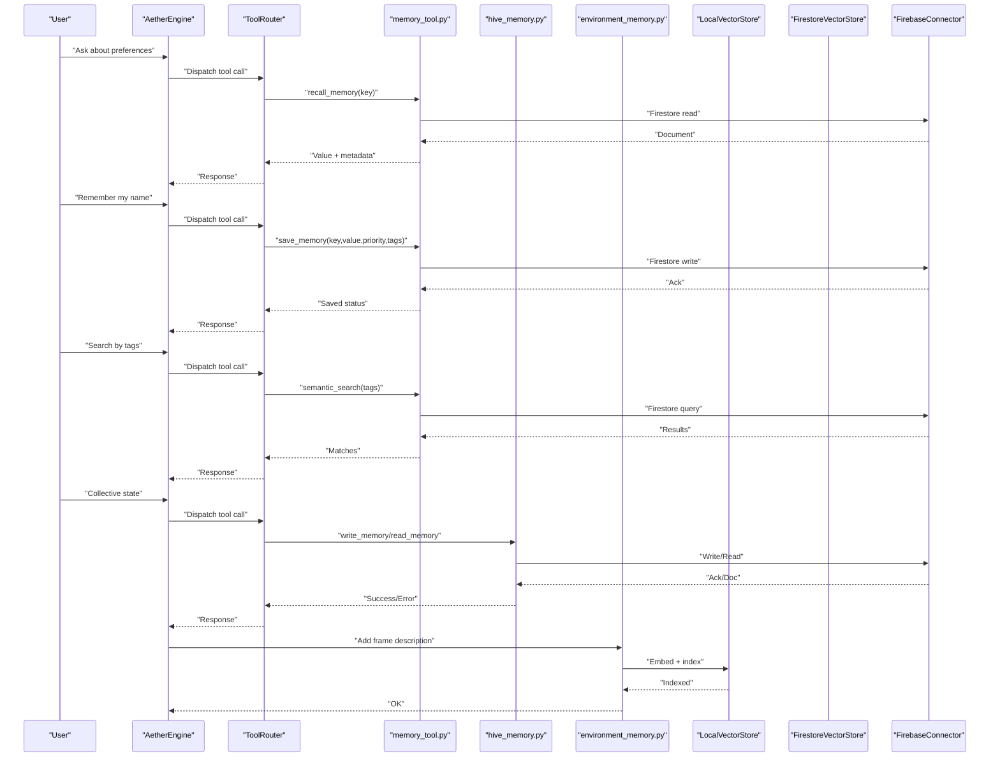
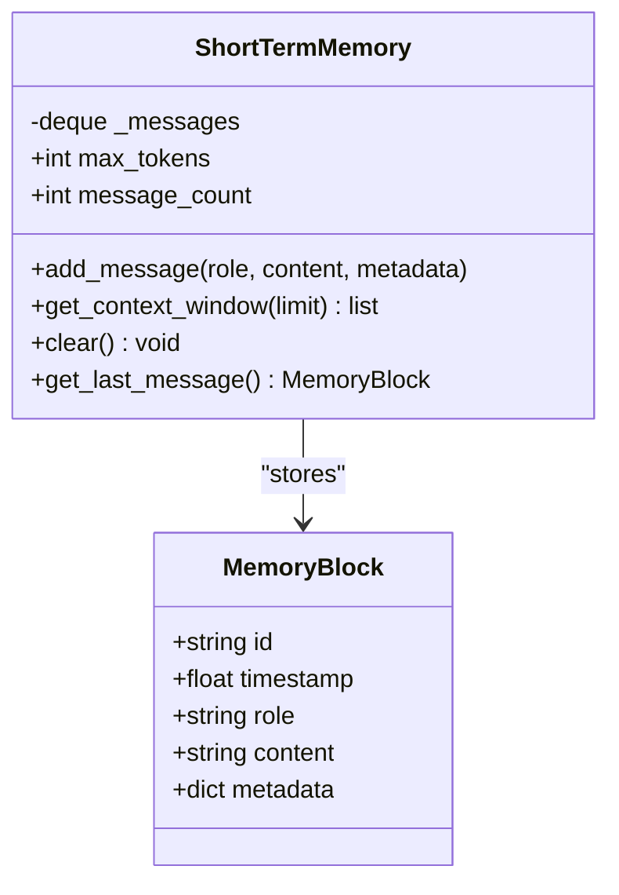
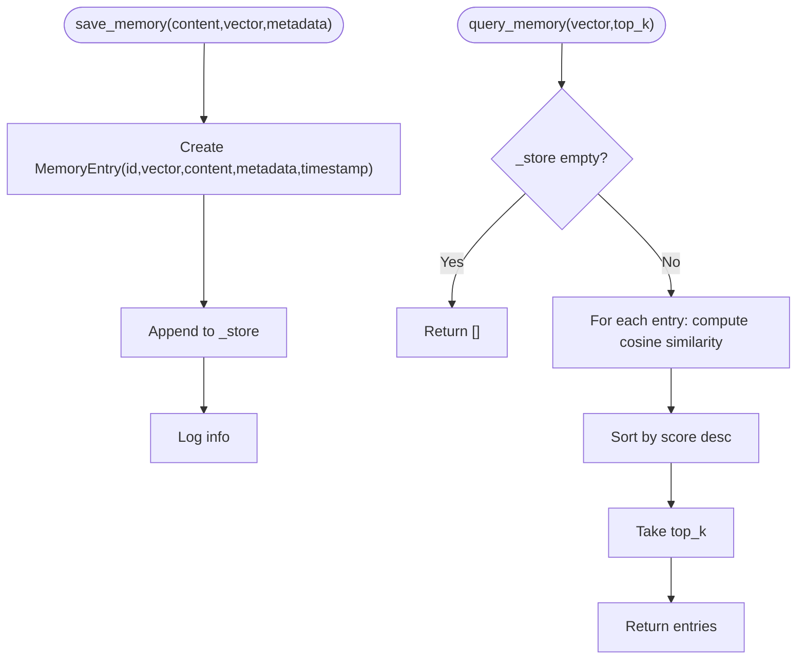
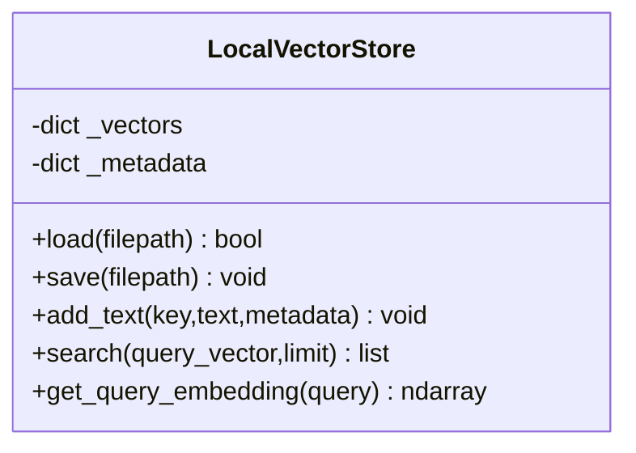
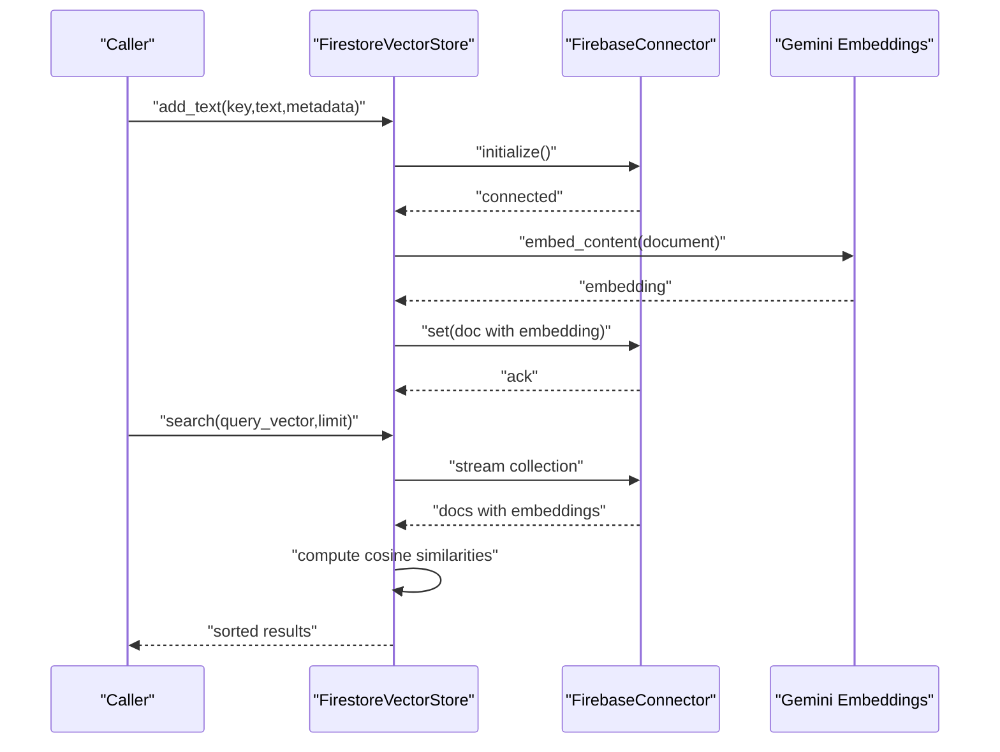
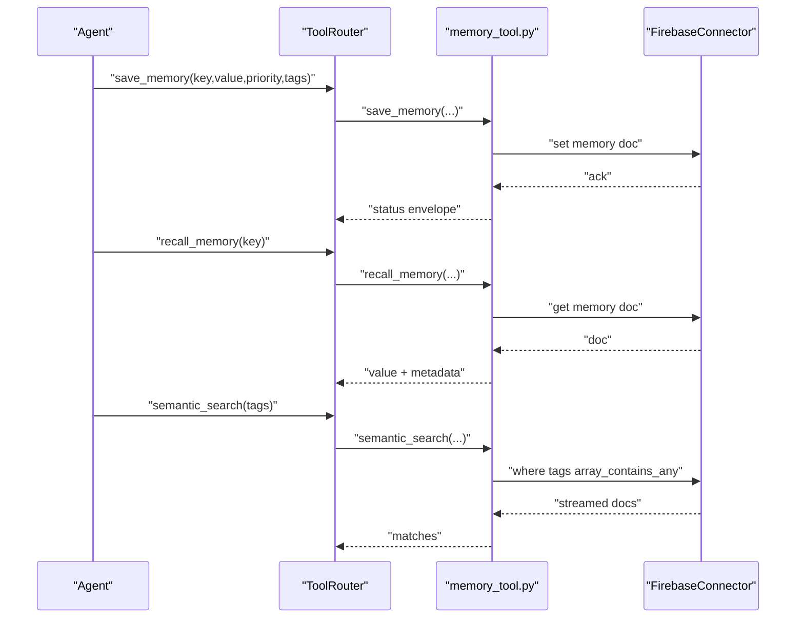
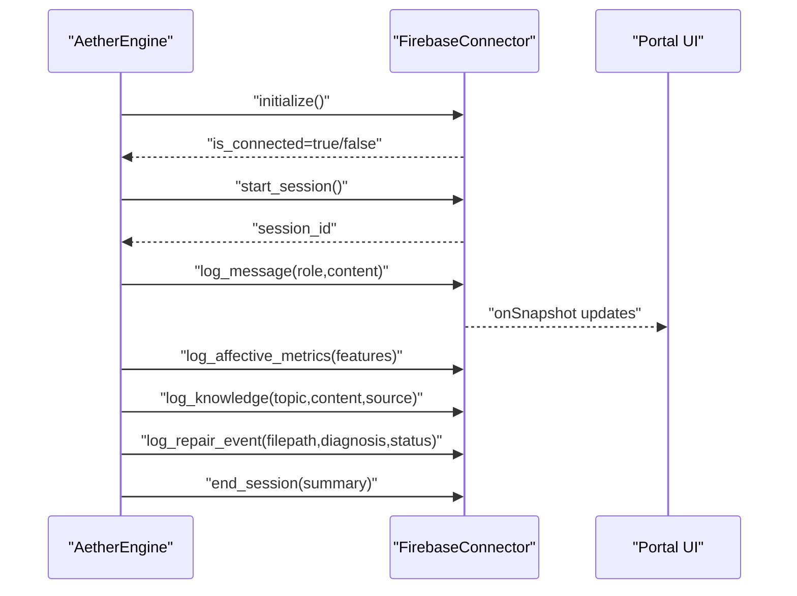
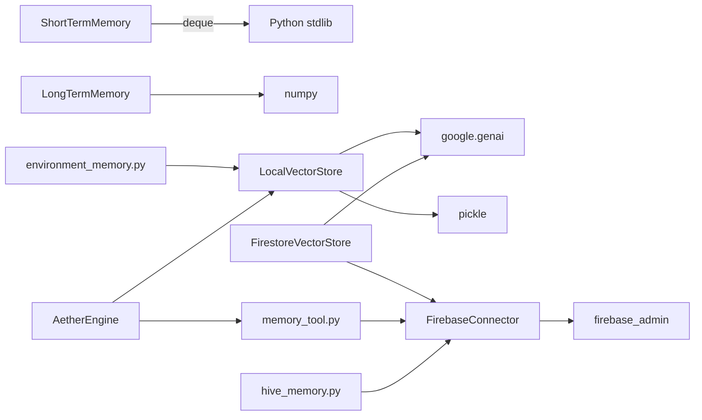

# Memory and Persistence

<cite>
**Referenced Files in This Document**
- [README.md](file://README.md)
- [core/memory/long_term.py](file://core/memory/long_term.py)
- [core/memory/short_term.py](file://core/memory/short_term.py)
- [core/tools/vector_store.py](file://core/tools/vector_store.py)
- [core/tools/firestore_vector_store.py](file://core/tools/firestore_vector_store.py)
- [core/tools/memory_tool.py](file://core/tools/memory_tool.py)
- [core/tools/environment_memory.py](file://core/tools/environment_memory.py)
- [core/tools/hive_memory.py](file://core/tools/hive_memory.py)
- [core/infra/cloud/firebase/interface.py](file://core/infra/cloud/firebase/interface.py)
- [core/infra/cloud/firebase/queries.py](file://core/infra/cloud/firebase/queries.py)
- [core/infra/cloud/firebase/schemas.py](file://core/infra/cloud/firebase/schemas.py)
- [core/infra/config.py](file://core/infra/config.py)
- [core/engine.py](file://core/engine.py)
- [.idx/memories.md](file://.idx/memories.md)
- [.idx/aether_v2_architecture.md](file://.idx/aether_v2_architecture.md)
</cite>

## Table of Contents
1. [Introduction](#introduction)
2. [Project Structure](#project-structure)
3. [Core Components](#core-components)
4. [Architecture Overview](#architecture-overview)
5. [Detailed Component Analysis](#detailed-component-analysis)
6. [Dependency Analysis](#dependency-analysis)
7. [Performance Considerations](#performance-considerations)
8. [Troubleshooting Guide](#troubleshooting-guide)
9. [Conclusion](#conclusion)
10. [Appendices](#appendices)

## Introduction
This document explains the memory and persistence system in Aether Voice OS, focusing on the dual-memory architecture: long-term vector memory and short-term working memory. It covers memory operations, retrieval mechanisms, semantic search, and the Firebase integration for cloud storage, real-time updates, and backup/recovery. It also documents the memory tool system, vector store implementations, embedding generation, similarity search algorithms, lifecycle management, retention policies, and data archival strategies. Privacy, security, and access control are addressed alongside practical troubleshooting and performance optimization guidance.

## Project Structure
The memory subsystem spans several modules:
- Short-term memory: in-memory sliding window for recent interactions
- Long-term memory: local vector memory with cosine similarity
- Vector stores: local and cloud-backed stores for semantic search
- Memory tools: persistent key-value memory and semantic search
- Firebase integration: cloud persistence, real-time streams, and audit trails
- Engine orchestration: wiring vector stores and tools into the AI pipeline

**Diagram sources**
- [core/memory/short_term.py](file://core/memory/short_term.py#L28-L72)
- [core/memory/long_term.py](file://core/memory/long_term.py#L24-L74)
- [core/tools/vector_store.py](file://core/tools/vector_store.py#L21-L112)
- [core/tools/firestore_vector_store.py](file://core/tools/firestore_vector_store.py#L22-L129)
- [core/tools/memory_tool.py](file://core/tools/memory_tool.py#L40-L330)
- [core/tools/hive_memory.py](file://core/tools/hive_memory.py#L25-L115)
- [core/tools/environment_memory.py](file://core/tools/environment_memory.py#L21-L94)
- [core/infra/cloud/firebase/interface.py](file://core/infra/cloud/firebase/interface.py#L15-L259)
- [core/infra/cloud/firebase/queries.py](file://core/infra/cloud/firebase/queries.py#L20-L74)
- [core/infra/cloud/firebase/schemas.py](file://core/infra/cloud/firebase/schemas.py#L30-L38)
- [core/engine.py](file://core/engine.py#L81-L91)

**Section sources**
- [README.md](file://README.md#L132-L158)
- [.idx/aether_v2_architecture.md](file://.idx/aether_v2_architecture.md#L1-L68)

## Core Components
- Short-Term Memory: Rolling deque of recent messages with role/content/metadata, used to constrain LLM context windows.
- Long-Term Vector Memory: Local vector store with cosine similarity for semantic recall.
- Local Vector Store: Embedding generation via Gemini and cosine similarity search with in-memory or persisted index.
- Firestore Vector Store: Cloud-backed vector store using Firestore and Gemini embeddings.
- Memory Tools: Persistent key-value memory with priority and tags; semantic search; listing and pruning.
- Hive Memory: Collective memory for expert souls across handoffs.
- Environment Memory: Semantic indexing of visual frames for spatial grounding.
- Firebase Connector: Initialization, session lifecycle, real-time logging, and audit trails.

**Section sources**
- [core/memory/short_term.py](file://core/memory/short_term.py#L28-L72)
- [core/memory/long_term.py](file://core/memory/long_term.py#L24-L74)
- [core/tools/vector_store.py](file://core/tools/vector_store.py#L21-L112)
- [core/tools/firestore_vector_store.py](file://core/tools/firestore_vector_store.py#L22-L129)
- [core/tools/memory_tool.py](file://core/tools/memory_tool.py#L40-L330)
- [core/tools/hive_memory.py](file://core/tools/hive_memory.py#L25-L115)
- [core/tools/environment_memory.py](file://core/tools/environment_memory.py#L21-L94)
- [core/infra/cloud/firebase/interface.py](file://core/infra/cloud/firebase/interface.py#L15-L259)

## Architecture Overview
The memory architecture integrates local and cloud components:
- Local-first vector indexing powers tool routing and semantic search.
- Persistent memory tools store user-centric facts with priority and tags.
- Firebase provides real-time streams, session logs, and audit trails.
- The engine wires vector stores and tools into the neural pipeline.

**Diagram sources**
- [core/engine.py](file://core/engine.py#L124-L151)
- [core/tools/memory_tool.py](file://core/tools/memory_tool.py#L40-L330)
- [core/tools/hive_memory.py](file://core/tools/hive_memory.py#L25-L115)
- [core/tools/environment_memory.py](file://core/tools/environment_memory.py#L30-L82)
- [core/tools/vector_store.py](file://core/tools/vector_store.py#L66-L112)
- [core/infra/cloud/firebase/interface.py](file://core/infra/cloud/firebase/interface.py#L62-L203)

## Detailed Component Analysis

### Short-Term Memory
- Purpose: Maintain a constrained, high-frequency context window for the current session.
- Operations: Add message blocks, retrieve formatted context window, clear memory, inspect last message.
- Constraints: Token and message count limits enforced by deque.

**Diagram sources**
- [core/memory/short_term.py](file://core/memory/short_term.py#L13-L72)

**Section sources**
- [core/memory/short_term.py](file://core/memory/short_term.py#L28-L72)

### Long-Term Vector Memory
- Purpose: Persistent semantic memory with cosine similarity search.
- Operations: Save memory entries with vectors and metadata; query nearest neighbors.
- Implementation: Local in-memory list with cosine similarity scoring.

**Diagram sources**
- [core/memory/long_term.py](file://core/memory/long_term.py#L36-L68)

**Section sources**
- [core/memory/long_term.py](file://core/memory/long_term.py#L24-L74)

### Local Vector Store
- Purpose: Lightweight, local-first semantic search with persistent index.
- Operations: Load/save index, embed text, search with cosine similarity, generate query embeddings.
- Persistence: Pickle-based index file for fast restarts.

**Diagram sources**
- [core/tools/vector_store.py](file://core/tools/vector_store.py#L21-L112)

**Section sources**
- [core/tools/vector_store.py](file://core/tools/vector_store.py#L21-L112)

### Firestore Vector Store
- Purpose: Cloud-native vector store for enterprise scalability.
- Operations: Initialize Firebase, embed and index text, semantic search via cosine similarity scan, query embedding generation.
- Notes: Prototype performs scan-and-compute; production guidance suggests vector search extensions.

**Diagram sources**
- [core/tools/firestore_vector_store.py](file://core/tools/firestore_vector_store.py#L33-L129)
- [core/infra/cloud/firebase/interface.py](file://core/infra/cloud/firebase/interface.py#L31-L61)

**Section sources**
- [core/tools/firestore_vector_store.py](file://core/tools/firestore_vector_store.py#L22-L129)

### Memory Tool System
- Purpose: Persistent, user-centric memory with priority and tags; supports saving, recalling, listing, semantic search, and pruning.
- Collections: memory collection for key-value pairs; hive_memory for expert collective state.
- Integration: Injects FirebaseConnector at startup; falls back to local behavior when offline.

**Diagram sources**
- [core/tools/memory_tool.py](file://core/tools/memory_tool.py#L40-L211)
- [core/infra/cloud/firebase/interface.py](file://core/infra/cloud/firebase/interface.py#L62-L113)

**Section sources**
- [core/tools/memory_tool.py](file://core/tools/memory_tool.py#L40-L330)

### Hive Collective Memory
- Purpose: Shared state for expert souls across agent handoffs.
- Operations: Write/read collective memory with tags and session scoping.

**Section sources**
- [core/tools/hive_memory.py](file://core/tools/hive_memory.py#L25-L115)

### Environment Memory
- Purpose: Semantic indexing of visual frames for spatial grounding.
- Operations: Add frame descriptions with metadata; query environment using embeddings.

**Section sources**
- [core/tools/environment_memory.py](file://core/tools/environment_memory.py#L21-L94)

### Firebase Integration
- Initialization: Secure credential handling and app initialization; graceful offline mode.
- Sessions: Create and manage session documents; real-time subcollections for messages and metrics.
- Logging: Affective telemetry, knowledge ingestion, repair events, and generic events.
- Queries: Recent sessions with in-memory caching and compound indexes.

**Diagram sources**
- [core/infra/cloud/firebase/interface.py](file://core/infra/cloud/firebase/interface.py#L31-L203)
- [core/infra/cloud/firebase/queries.py](file://core/infra/cloud/firebase/queries.py#L24-L74)
- [core/infra/cloud/firebase/schemas.py](file://core/infra/cloud/firebase/schemas.py#L30-L38)

**Section sources**
- [core/infra/cloud/firebase/interface.py](file://core/infra/cloud/firebase/interface.py#L15-L259)
- [core/infra/cloud/firebase/queries.py](file://core/infra/cloud/firebase/queries.py#L20-L74)
- [core/infra/cloud/firebase/schemas.py](file://core/infra/cloud/firebase/schemas.py#L30-L38)

### Engine Orchestration and Memory Wiring
- The engine loads a global local vector index and injects it into the tool router.
- Memory tools are registered and injected with FirebaseConnector.
- Affective metrics and session lifecycle are coordinated through Firebase.

**Section sources**
- [core/engine.py](file://core/engine.py#L81-L91)
- [core/engine.py](file://core/engine.py#L124-L151)
- [core/engine.py](file://core/engine.py#L92-L108)

## Dependency Analysis
- Short-term memory depends on standard library collections and time.
- Long-term memory depends on numpy for cosine similarity.
- Local vector store depends on google-genai and numpy; persists via pickle.
- Firestore vector store depends on firebase-admin and google-genai; uses FirebaseConnector.
- Memory tools depend on FirebaseConnector and Firestore collections.
- Hive memory depends on FirebaseConnector and hive_memory collection.
- Environment memory depends on LocalVectorStore and persistent index.
- FirebaseConnector depends on firebase_admin and configuration loading.

**Diagram sources**
- [core/memory/short_term.py](file://core/memory/short_term.py#L1-L72)
- [core/memory/long_term.py](file://core/memory/long_term.py#L1-L74)
- [core/tools/vector_store.py](file://core/tools/vector_store.py#L1-L112)
- [core/tools/firestore_vector_store.py](file://core/tools/firestore_vector_store.py#L1-L129)
- [core/tools/memory_tool.py](file://core/tools/memory_tool.py#L1-L330)
- [core/tools/hive_memory.py](file://core/tools/hive_memory.py#L1-L115)
- [core/tools/environment_memory.py](file://core/tools/environment_memory.py#L1-L94)
- [core/infra/cloud/firebase/interface.py](file://core/infra/cloud/firebase/interface.py#L1-L259)
- [core/engine.py](file://core/engine.py#L1-L240)

**Section sources**
- [core/memory/short_term.py](file://core/memory/short_term.py#L1-L72)
- [core/memory/long_term.py](file://core/memory/long_term.py#L1-L74)
- [core/tools/vector_store.py](file://core/tools/vector_store.py#L1-L112)
- [core/tools/firestore_vector_store.py](file://core/tools/firestore_vector_store.py#L1-L129)
- [core/tools/memory_tool.py](file://core/tools/memory_tool.py#L1-L330)
- [core/tools/hive_memory.py](file://core/tools/hive_memory.py#L1-L115)
- [core/tools/environment_memory.py](file://core/tools/environment_memory.py#L1-L94)
- [core/infra/cloud/firebase/interface.py](file://core/infra/cloud/firebase/interface.py#L1-L259)
- [core/engine.py](file://core/engine.py#L1-L240)

## Performance Considerations
- Local vector search: O(n) scan per query; keep index compact and prune low-priority memories regularly.
- Firestore vector search: Prototype performs scan-and-compute; consider migrating to vector search extensions or Vertex AI Search for large-scale deployments.
- Embedding generation: Batch operations and cache results where feasible; leverage local index persistence to avoid repeated embeddings.
- Memory tool queries: Use array_contains_any with reasonable tag sets; paginate and limit results.
- Firebase reads/writes: Use in-memory caches for recent sessions; offload heavy writes to background threads.
- Short-term memory: Tune max_messages and max_tokens to balance context quality and prompt size.

[No sources needed since this section provides general guidance]

## Troubleshooting Guide
- Firebase offline: Tools fall back to local behavior; verify credentials and connectivity.
- Initialization failures: Confirm FIREBASE_CREDENTIALS_BASE64 decoding and default credentials fallback.
- High CPU usage: Reduce frontend visualizer FPS; verify PyAudio C extensions; check for thread contention.
- Memory tool errors: Inspect Firestore rules and permissions; confirm collection existence.
- Vector store issues: Validate API key; check embedding model availability; verify index file integrity.
- Session logs not appearing: Ensure session started and subcollections configured; verify onSnapshot listeners.

**Section sources**
- [README.md](file://README.md#L244-L249)
- [core/infra/config.py](file://core/infra/config.py#L144-L158)
- [core/infra/cloud/firebase/interface.py](file://core/infra/cloud/firebase/interface.py#L31-L61)
- [core/tools/memory_tool.py](file://core/tools/memory_tool.py#L56-L92)
- [core/tools/vector_store.py](file://core/tools/vector_store.py#L30-L48)

## Conclusion
Aether Voice OS implements a robust dual-memory architecture combining short-term working memory for immediate context and long-term vector memory for persistent, semantic recall. The system leverages local vector stores for responsiveness and cloud-backed Firestore for scalability and real-time collaboration. Memory tools provide user-centric persistence with priority and tagging, while Firebase ensures session continuity, real-time updates, and auditability. With careful lifecycle management, retention policies, and performance tuning, the system scales from prototyping to enterprise-grade deployments.

[No sources needed since this section summarizes without analyzing specific files]

## Appendices

### Memory Operations and Query Patterns
- Save persistent memory: provide key, value, priority, and tags; stored in memory collection.
- Recall memory: retrieve by key; returns value and metadata.
- List memories: filter by priority and limit results.
- Semantic search: query by tags using array_contains_any.
- Prune memories: delete all memories of a given priority.
- Collective memory: write/read shared state for expert souls.
- Environment memory: index and query visual frame descriptions.

**Section sources**
- [core/tools/memory_tool.py](file://core/tools/memory_tool.py#L40-L244)
- [core/tools/hive_memory.py](file://core/tools/hive_memory.py#L25-L79)
- [core/tools/environment_memory.py](file://core/tools/environment_memory.py#L30-L82)

### Privacy, Security, and Access Control
- Credentials: Base64-encoded service account JSON supported; default credentials for local development.
- Authentication: Ed25519-based handshake for the gateway; BiometricMiddleware for sensitive tools.
- Firestore rules: Ensure restrictive rules; restrict access to session-scoped documents.
- Data minimization: Limit stored metadata; use tags to categorize without exposing sensitive content.
- Auditability: Repair events, affective metrics, and knowledge ingestion logged to Firestore.

**Section sources**
- [core/infra/config.py](file://core/infra/config.py#L94-L100)
- [core/infra/cloud/firebase/interface.py](file://core/infra/cloud/firebase/interface.py#L163-L203)
- [.idx/memories.md](file://.idx/memories.md#L169-L181)

### Memory Lifecycle Management and Retention
- Short-term memory: sliding window with message and token limits; clears on demand.
- Long-term memory: wipe-all operation for hard resets.
- Persistent memory: prune low-priority items; maintain tag taxonomy for discoverability.
- Vector index: load/save index to persist embeddings across restarts.
- Session lifecycle: start/end sessions; log telemetry and repair events.

**Section sources**
- [core/memory/short_term.py](file://core/memory/short_term.py#L61-L72)
- [core/memory/long_term.py](file://core/memory/long_term.py#L70-L74)
- [core/tools/vector_store.py](file://core/tools/vector_store.py#L30-L64)
- [core/infra/cloud/firebase/interface.py](file://core/infra/cloud/firebase/interface.py#L62-L203)