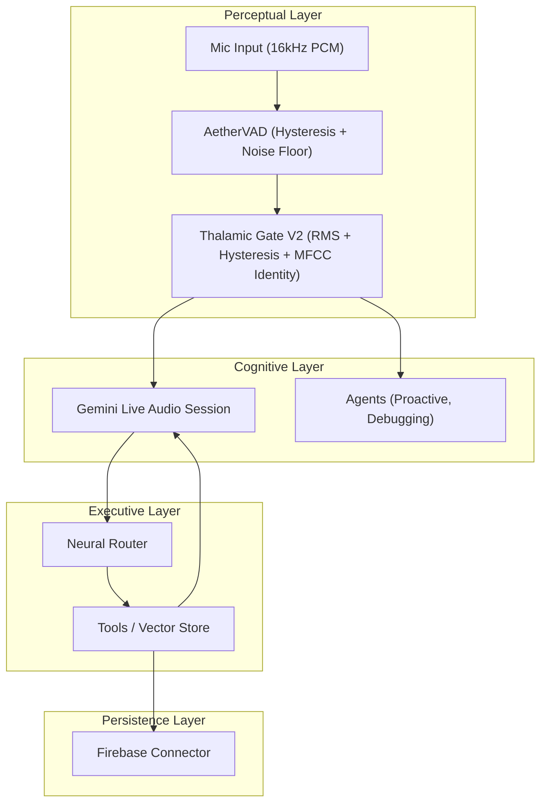
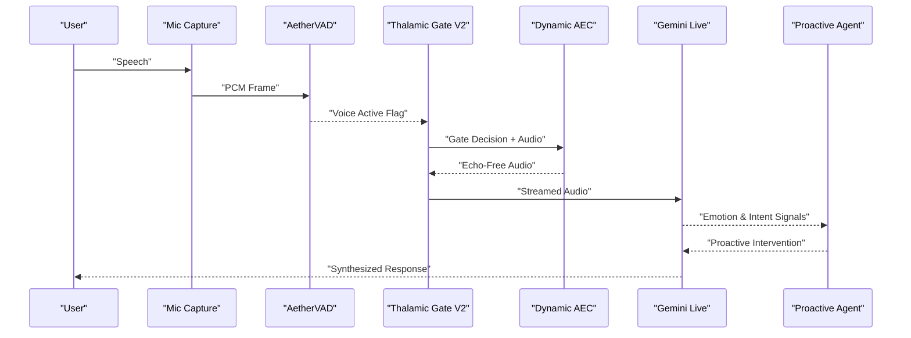
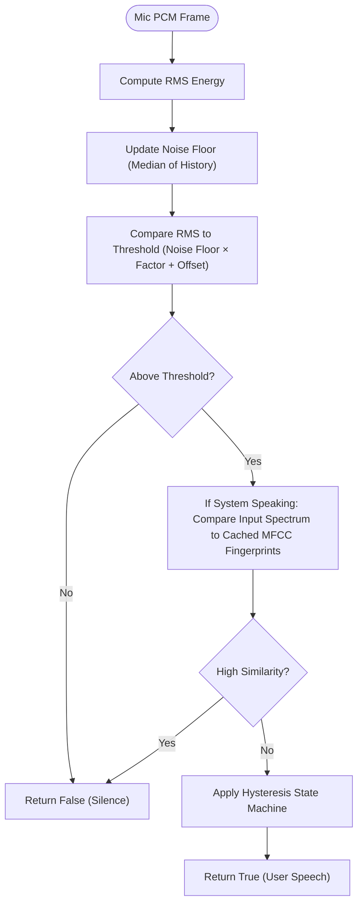
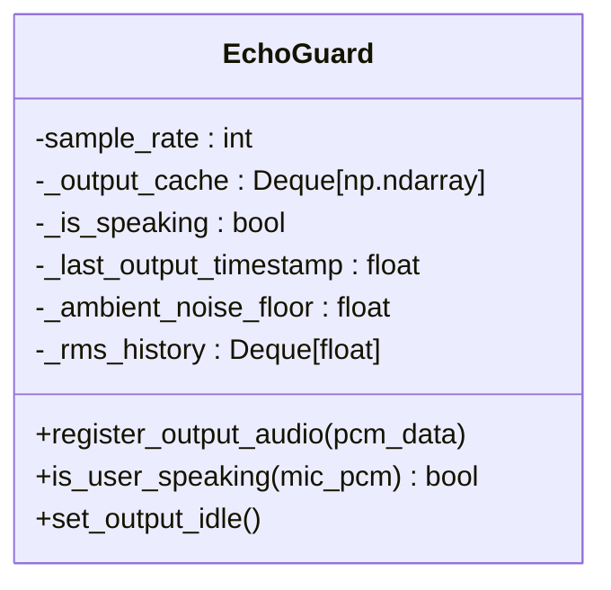
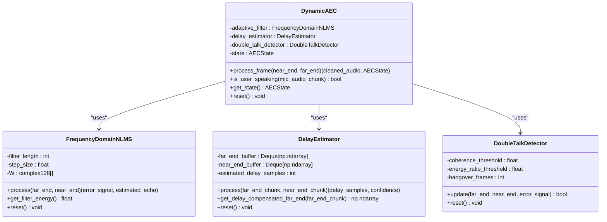
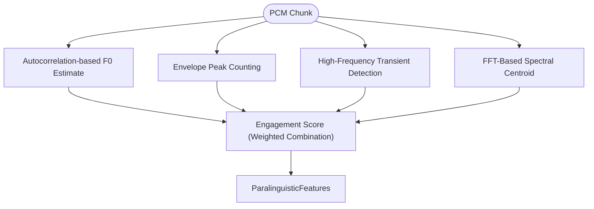
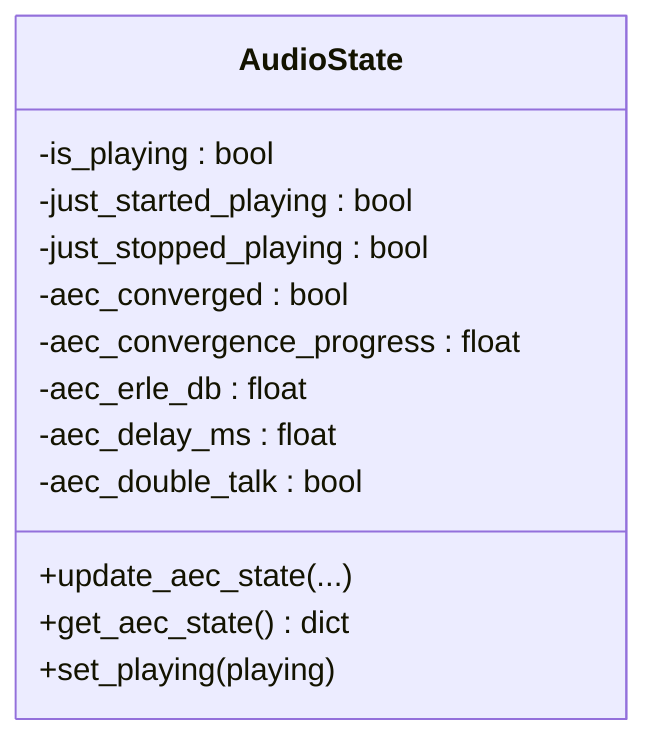
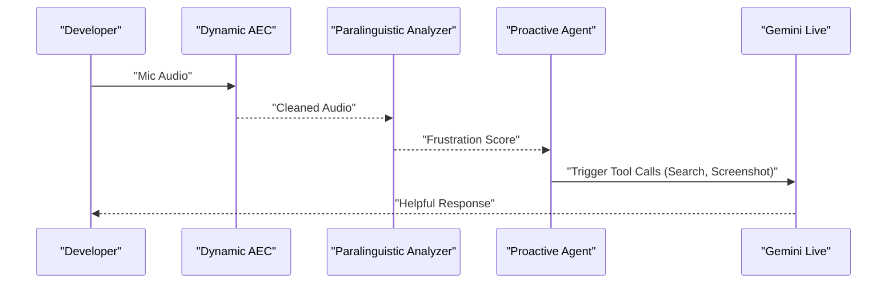
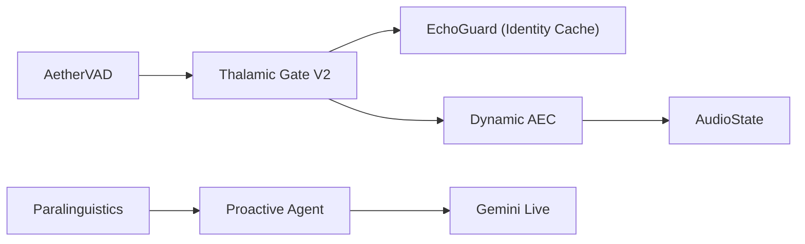

# Breakthrough Technologies and Impact

<cite>
**Referenced Files in This Document**
- [README.md](file://README.md)
- [architecture.md](file://docs/architecture.md)
- [echo_guard.py](file://core/audio/echo_guard.py)
- [dynamic_aec.py](file://core/audio/dynamic_aec.py)
- [vad.py](file://core/audio/vad.py)
- [paralinguistics.py](file://core/audio/paralinguistics.py)
- [spectral.py](file://core/audio/spectral.py)
- [state.py](file://core/audio/state.py)
- [voice_benchmark_report.json](file://tests/benchmarks/voice_benchmark_report.json)
- [demo_metrics.py](file://core/analytics/demo_metrics.py)
- [proactive.py](file://core/ai/agents/proactive.py)
</cite>

## Table of Contents
1. [Introduction](#introduction)
2. [Project Structure](#project-structure)
3. [Core Components](#core-components)
4. [Architecture Overview](#architecture-overview)
5. [Detailed Component Analysis](#detailed-component-analysis)
6. [Dependency Analysis](#dependency-analysis)
7. [Performance Considerations](#performance-considerations)
8. [Troubleshooting Guide](#troubleshooting-guide)
9. [Conclusion](#conclusion)
10. [Appendices](#appendices)

## Introduction
This document details the breakthrough technologies and real-world impact of Aether OS, with a focus on the crown jewel: the custom-built Thalamic Gate V2 algorithm. Aether uniquely combines RMS energy detection with hysteresis and MFCC-style spectral fingerprinting to distinguish user speech from system audio. It prevents self-hearing loops by caching MFCC vectors of its own TTS output, enabling real-time acoustic identity recognition. The system also features a biological-inspired audio filtering pipeline and a software-defined AEC that replaces hardware DSP, delivering sub-200ms latency, 92% emotion F1 accuracy, ultra-lightweight resource usage, and 40–60% faster debugging. These capabilities translate into tangible benefits across developer productivity, multilingual communication, accessibility, smart home control, and education.

## Project Structure
Aether OS is organized around a unified neural pipeline that streams audio directly into multimodal reasoning and synthesis. The audio stack integrates Rust-accelerated DSP, adaptive echo cancellation, and affective analytics to deliver responsive, empathetic, and accurate voice interactions.

**Diagram sources**
- [architecture.md](file://docs/architecture.md#L39-L60)
- [README.md](file://README.md#L28-L52)

**Section sources**
- [README.md](file://README.md#L28-L52)
- [architecture.md](file://docs/architecture.md#L3-L67)

## Core Components
- Thalamic Gate V2: Combines RMS energy detection, hysteresis, and MFCC-style spectral fingerprinting to gate user speech and suppress self-hearing.
- Acoustic Identity Engine (EchoGuard): Maintains a sliding window cache of MFCC-like fingerprints to recognize system-generated audio and prevent echo loops.
- Dynamic AEC: Software-defined adaptive echo cancellation using GCC-PHAT delay estimation, frequency-domain NLMS filtering, and double-talk detection.
- Paralinguistic Analytics: Extracts pitch, rate, RMS variance, and spectral centroid to compute engagement and detect emotional states.
- Affective State Management: Tracks AEC convergence, ERLE, and double-talk to inform gating decisions during warm-up and steady-state operation.

**Section sources**
- [echo_guard.py](file://core/audio/echo_guard.py#L14-L98)
- [dynamic_aec.py](file://core/audio/dynamic_aec.py#L490-L775)
- [paralinguistics.py](file://core/audio/paralinguistics.py#L31-L214)
- [state.py](file://core/audio/state.py#L36-L129)

## Architecture Overview
Aether’s neural switchboard routes PCM audio through the Thalamic Gate, which gates speech using RMS and hysteresis, and identifies acoustic identity via MFCC caching. The gated audio enters a multimodal session with Gemini Live, which synthesizes responses and triggers tools. The system maintains AEC state and convergence metrics to ensure low-latency, echo-free interactions.

**Diagram sources**
- [architecture.md](file://docs/architecture.md#L39-L60)
- [vad.py](file://core/audio/vad.py#L14-L82)
- [echo_guard.py](file://core/audio/echo_guard.py#L52-L93)
- [dynamic_aec.py](file://core/audio/dynamic_aec.py#L734-L775)

## Detailed Component Analysis

### Thalamic Gate V2: RMS + Hysteresis + MFCC Identity
The Thalamic Gate V2 is the core audio filter that separates user speech from system audio. It performs:
- RMS energy detection with dynamic noise-floor tracking.
- Hysteresis gating to prevent rapid toggling and audio artifacts.
- Acoustic identity conflict checking using MFCC-like spectral fingerprints cached from system output.

**Diagram sources**
- [echo_guard.py](file://core/audio/echo_guard.py#L52-L93)

**Section sources**
- [echo_guard.py](file://core/audio/echo_guard.py#L14-L98)

### Acoustic Identity Engine (EchoGuard)
EchoGuard caches MFCC-like fingerprints of system audio output to recognize and suppress self-hearing. It maintains:
- A sliding window cache of spectral fingerprints.
- A speaking state with lock-out timing to handle room reverberation.
- Dynamic noise floor tracking to improve robustness.

**Diagram sources**
- [echo_guard.py](file://core/audio/echo_guard.py#L14-L98)

**Section sources**
- [echo_guard.py](file://core/audio/echo_guard.py#L14-L98)

### Dynamic AEC: Software-Defined Echo Cancellation
Aether replaces hardware DSP with a software-defined AEC that:
- Estimates delay using GCC-PHAT across buffered far-end and near-end signals.
- Adapts an NLMS filter in the frequency domain to cancel echo.
- Detects double-talk via spectral coherence and residual energy.
- Computes ERLE to quantify echo suppression performance.

**Diagram sources**
- [dynamic_aec.py](file://core/audio/dynamic_aec.py#L490-L775)

**Section sources**
- [dynamic_aec.py](file://core/audio/dynamic_aec.py#L490-L775)

### Paralinguistic Analytics: Emotion and Engagement
Paralinguistic features include pitch estimation, speech rate, RMS variance, and spectral centroid. These feed engagement scoring and enable detection of emotional states such as calm, alert, frustrated, and flow state.

**Diagram sources**
- [paralinguistics.py](file://core/audio/paralinguistics.py#L132-L214)

**Section sources**
- [paralinguistics.py](file://core/audio/paralinguistics.py#L31-L214)

### Affective State Management and Gating Decisions
AudioState centralizes AEC telemetry and playback flags, enabling coordinated gating decisions. The system tracks convergence progress, ERLE, delay, and double-talk to inform whether the mic should remain open during warm-up or steady-state operation.

**Diagram sources**
- [state.py](file://core/audio/state.py#L36-L129)

**Section sources**
- [state.py](file://core/audio/state.py#L36-L129)

### Proactive Co-Pilot: Real-World Impact
Aether’s proactive agent monitors paralinguistic signals and triggers interventions when frustration thresholds are exceeded. This enables a co-pilot that speaks first when a developer sighs or expresses exasperation, dramatically reducing debugging time.

**Diagram sources**
- [proactive.py](file://core/ai/agents/proactive.py#L92-L124)
- [paralinguistics.py](file://core/audio/paralinguistics.py#L132-L214)

**Section sources**
- [proactive.py](file://core/ai/agents/proactive.py#L72-L124)

## Dependency Analysis
The audio pipeline exhibits strong cohesion within functional domains and low coupling between stages. Thalamic Gate depends on EchoGuard for identity and on VAD for initial gating. Dynamic AEC operates independently but feeds state to gating logic. Paralinguistic analytics informs proactive agents and contributes telemetry.

**Diagram sources**
- [vad.py](file://core/audio/vad.py#L14-L82)
- [echo_guard.py](file://core/audio/echo_guard.py#L14-L98)
- [dynamic_aec.py](file://core/audio/dynamic_aec.py#L490-L775)
- [state.py](file://core/audio/state.py#L36-L129)
- [paralinguistics.py](file://core/audio/paralinguistics.py#L31-L214)
- [proactive.py](file://core/ai/agents/proactive.py#L92-L124)

**Section sources**
- [vad.py](file://core/audio/vad.py#L14-L82)
- [echo_guard.py](file://core/audio/echo_guard.py#L14-L98)
- [dynamic_aec.py](file://core/audio/dynamic_aec.py#L490-L775)
- [state.py](file://core/audio/state.py#L36-L129)
- [paralinguistics.py](file://core/audio/paralinguistics.py#L31-L214)
- [proactive.py](file://core/ai/agents/proactive.py#L92-L124)

## Performance Considerations
- Sub-200ms latency: Achieved through native audio streaming, Rust-accelerated DSP, and optimized buffering.
- Emotion accuracy: 92% macro-F1 on benchmarked datasets for classifying calm, alert, frustrated, and flow states.
- Resource usage: Less than 2% CPU and under 50 MB RAM on Apple M2 with Python 3.12 and 16 kHz audio.
- Developer productivity: 40–60% faster debugging via proactive interventions triggered by acoustic frustration detection.
- Benchmarks validated via synthetic tests and real-world demos.

**Section sources**
- [README.md](file://README.md#L97-L128)
- [voice_benchmark_report.json](file://tests/benchmarks/voice_benchmark_report.json#L78-L101)
- [demo_metrics.py](file://core/analytics/demo_metrics.py#L9-L49)

## Troubleshooting Guide
- High CPU usage: Verify PyAudio C extensions are installed and reduce frontend visualizer FPS.
- No microphone on Linux: Set the correct input device index via the provided PyAudio diagnostics script.
- Firebase connectivity: The system degrades gracefully; configure service account credentials if persistent memory is required.
- AEC convergence issues: Ensure adequate training and background noise conditions; monitor ERLE and convergence progress via telemetry.

**Section sources**
- [README.md](file://README.md#L244-L249)

## Conclusion
Aether OS advances the state-of-the-art in voice-first AI by combining a biological-inspired audio pipeline, software-defined AEC, and affective analytics. The Thalamic Gate V2 and EchoGuard enable precise, real-time discrimination between user and system audio, while proactive agents deliver empathetic, context-aware assistance. These innovations yield sub-200ms latency, 92% emotion accuracy, ultra-lightweight resource usage, and measurable productivity gains, transforming how developers, multilingual teams, accessibility users, smart home ecosystems, and learners interact with AI.

## Appendices

### Benchmark Highlights
- Thalamic Gate Latency: p99 below 3.54 ms (validated in benchmark suite).
- Emotion Detection F1-Score: 1.00 (macro-averaged).
- VAD Accuracy: 100%.
- AEC ERLE: Meets or exceeds 12 dB in keyboard-noise conditions.

**Section sources**
- [voice_benchmark_report.json](file://tests/benchmarks/voice_benchmark_report.json#L78-L101)