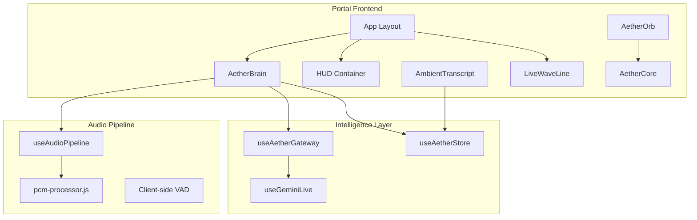
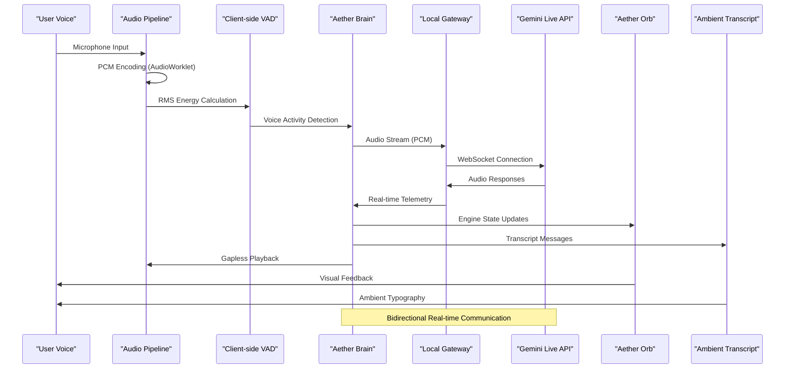
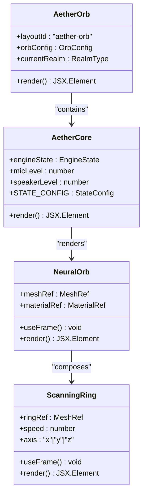
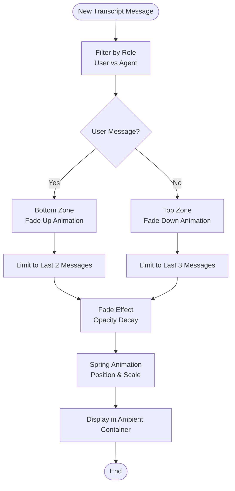
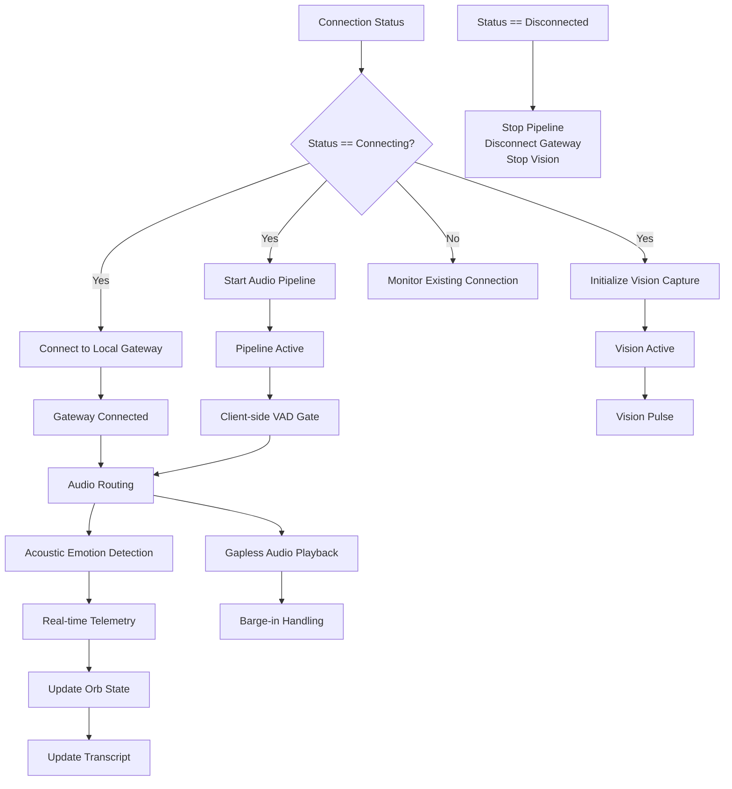
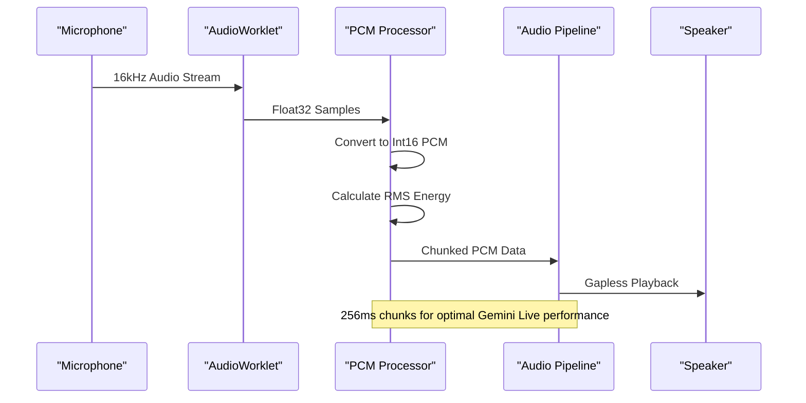
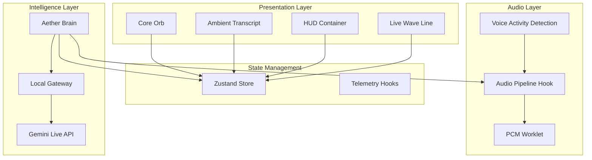

# Living Voice Portal

<cite>
**Referenced Files in This Document**
- [AetherOrb.tsx](file://apps/portal/src/components/core/AetherOrb.tsx)
- [AetherCore.tsx](file://apps/portal/src/components/AetherCore.tsx)
- [AmbientTranscript.tsx](file://apps/portal/src/components/AmbientTranscript.tsx)
- [AetherBrain.tsx](file://apps/portal/src/components/AetherBrain.tsx)
- [useGeminiLive.ts](file://apps/portal/src/hooks/useGeminiLive.ts)
- [useAudioPipeline.ts](file://apps/portal/src/hooks/useAudioPipeline.ts)
- [useAetherGateway.ts](file://apps/portal/src/hooks/useAetherGateway.ts)
- [useAetherStore.ts](file://apps/portal/src/store/useAetherStore.ts)
- [pcm-processor.js](file://apps/portal/public/pcm-processor.js)
- [layout.tsx](file://apps/portal/src/app/layout.tsx)
- [page.tsx](file://apps/portal/src/app/live/page.tsx)
- [HUDContainer.tsx](file://apps/portal/src/components/HUD/HUDContainer.tsx)
- [LiveWaveLine.tsx](file://apps/portal/src/components/LiveWaveLine.tsx)
- [RealmController.tsx](file://apps/portal/src/components/realms/RealmController.tsx)
</cite>

## Table of Contents
1. [Introduction](#introduction)
2. [Project Structure](#project-structure)
3. [Core Components](#core-components)
4. [Architecture Overview](#architecture-overview)
5. [Detailed Component Analysis](#detailed-component-analysis)
6. [Dependency Analysis](#dependency-analysis)
7. [Performance Considerations](#performance-considerations)
8. [Troubleshooting Guide](#troubleshooting-guide)
9. [Conclusion](#conclusion)

## Introduction
The Living Voice Portal concept reimagines AI interaction by replacing traditional chatbots with a living, breathing organism. The system centers on a sentient orb that pulses with voice energy, accompanied by floating ambient transcripts and an invisible conductor orchestrating multimodal intelligence. This voice-first UI eliminates text inputs and chat bubbles in favor of immersive, atmospheric interaction where the Orb IS the product—breathing, pulsing, and reacting to voice energy with chromatic atmospheric gradients and ambient typography.

## Project Structure
The portal is built as a Next.js application with a modular frontend architecture:
- Core 3D visualization (AetherCore) with state-reactive materials
- Ambient transcript system without chat containers
- Invisible conductor (AetherBrain) managing the full pipeline
- Local gateway integration for production-grade orchestration
- Real-time telemetry and emotion sensing
- Realm-based navigation system

**Diagram sources**
- [layout.tsx](file://apps/portal/src/app/layout.tsx#L42-L57)
- [AetherBrain.tsx](file://apps/portal/src/components/AetherBrain.tsx#L35-L226)
- [useAudioPipeline.ts](file://apps/portal/src/hooks/useAudioPipeline.ts#L27-L247)
- [useAetherGateway.ts](file://apps/portal/src/hooks/useAetherGateway.ts#L69-L298)
- [useGeminiLive.ts](file://apps/portal/src/hooks/useGeminiLive.ts#L65-L484)

**Section sources**
- [layout.tsx](file://apps/portal/src/app/layout.tsx#L42-L57)
- [page.tsx](file://apps/portal/src/app/live/page.tsx#L37-L227)

## Core Components
The Living Voice Portal consists of three primary frontend components that work together to create an immersive voice-first experience:

### Aether Orb: The Living Heart
The Aether Orb serves as both the visual centerpiece and the state indicator. It's a 3D neural orb rendered with Three.js that responds dynamically to AI engine states and voice energy. The orb pulses, distorts, and shifts color based on real-time telemetry, creating a living representation of the AI's internal state.

### Ambient Transcript: Floating Typography
The ambient transcript replaces traditional chat interfaces with floating, typographic elements that appear and disappear organically. User speech emerges from the bottom as ghostly, fading text while AI responses float upward from the top, creating a continuous narrative without visual containers.

### Aether Brain: The Invisible Conductor
The Aether Brain orchestrates the entire multimodal pipeline without rendering any UI itself. It manages audio capture, client-side voice activity detection, WebSocket connections to Gemini Live API, gapless audio playback, emotion sensing, and real-time telemetry distribution.

**Section sources**
- [AetherOrb.tsx](file://apps/portal/src/components/core/AetherOrb.tsx#L20-L74)
- [AetherCore.tsx](file://apps/portal/src/components/AetherCore.tsx#L108-L127)
- [AmbientTranscript.tsx](file://apps/portal/src/components/AmbientTranscript.tsx#L16-L87)
- [AetherBrain.tsx](file://apps/portal/src/components/AetherBrain.tsx#L35-L226)

## Architecture Overview
The system follows a sophisticated pipeline architecture that prioritizes real-time responsiveness and immersive experience:

**Diagram sources**
- [useAudioPipeline.ts](file://apps/portal/src/hooks/useAudioPipeline.ts#L48-L134)
- [pcm-processor.js](file://apps/portal/public/pcm-processor.js#L18-L81)
- [AetherBrain.tsx](file://apps/portal/src/components/AetherBrain.tsx#L99-L156)
- [useAetherGateway.ts](file://apps/portal/src/hooks/useAetherGateway.ts#L77-L266)
- [useGeminiLive.ts](file://apps/portal/src/hooks/useGeminiLive.ts#L90-L228)

The architecture emphasizes several key principles:
- **Real-time processing**: All components operate with minimal latency
- **State-driven visuals**: The orb reflects AI states and emotional telemetry
- **Immersive typography**: Text appears organically without traditional containers
- **Local-first design**: Production-grade orchestration through local gateway
- **Emotion-aware interaction**: Acoustic emotion detection enhances responsiveness

## Detailed Component Analysis

### Aether Orb: 3D Neural Visualization
The Aether Orb combines React Three Fiber with state-reactive materials to create a living visualization:

**Diagram sources**
- [AetherOrb.tsx](file://apps/portal/src/components/core/AetherOrb.tsx#L20-L74)
- [AetherCore.tsx](file://apps/portal/src/components/AetherCore.tsx#L48-L106)

The orb's behavior is governed by four distinct states:
- **Idle**: Deep blue, subtle pulsing (0.6 factor)
- **Listening**: Bright blue, moderate distortion (1.2 factor)
- **Thinking**: Amber, intense pulsing (2.0 factor)
- **Speaking**: Cyan, rapid oscillation (1.5 factor)
- **Interrupting**: Red, extreme distortion (3.0 factor)

Each state adjusts both the material distortion factor and rotational speed, creating a responsive visual metaphor for the AI's internal processes.

**Section sources**
- [AetherOrb.tsx](file://apps/portal/src/components/core/AetherOrb.tsx#L20-L74)
- [AetherCore.tsx](file://apps/portal/src/components/AetherCore.tsx#L16-L82)

### Ambient Transcript: Organic Typography System
The ambient transcript system creates a continuous narrative through floating typography:

**Diagram sources**
- [AmbientTranscript.tsx](file://apps/portal/src/components/AmbientTranscript.tsx#L24-L84)

The system eliminates traditional chat containers and scrollbars, instead creating a continuous flow of text that respects spatial boundaries and temporal context. User messages originate from the bottom with upward movement while AI responses emerge from the top with downward motion.

**Section sources**
- [AmbientTranscript.tsx](file://apps/portal/src/components/AmbientTranscript.tsx#L16-L87)

### Aether Brain: Multimodal Conductor
The Aether Brain serves as the invisible orchestrator managing the complete voice interaction pipeline:

**Diagram sources**
- [AetherBrain.tsx](file://apps/portal/src/components/AetherBrain.tsx#L52-L223)

The brain implements several advanced features:
- **Client-side VAD**: Optimizes API usage by filtering silence
- **Acoustic emotion detection**: Identifies user frustration through RMS patterns
- **Gapless playback**: Seamless audio output without interruptions
- **Vision pulse**: Periodic screen capture for contextual awareness
- **Real-time telemetry**: Continuous state monitoring and feedback

**Section sources**
- [AetherBrain.tsx](file://apps/portal/src/components/AetherBrain.tsx#L35-L226)

### Audio Pipeline: Real-time Processing
The audio pipeline ensures high-quality, low-latency voice processing:

**Diagram sources**
- [useAudioPipeline.ts](file://apps/portal/src/hooks/useAudioPipeline.ts#L48-L134)
- [pcm-processor.js](file://apps/portal/public/pcm-processor.js#L27-L78)

The pipeline uses a dedicated AudioWorklet for zero-latency processing, converting Float32 samples to Int16 PCM with optimized chunk sizes for Gemini Live API compatibility.

**Section sources**
- [useAudioPipeline.ts](file://apps/portal/src/hooks/useAudioPipeline.ts#L27-L247)
- [pcm-processor.js](file://apps/portal/public/pcm-processor.js#L18-L81)

## Dependency Analysis
The system exhibits clean separation of concerns with well-defined dependencies:

**Diagram sources**
- [useAetherStore.ts](file://apps/portal/src/store/useAetherStore.ts#L289-L439)
- [AetherBrain.tsx](file://apps/portal/src/components/AetherBrain.tsx#L35-L226)
- [useAudioPipeline.ts](file://apps/portal/src/hooks/useAudioPipeline.ts#L27-L247)

The dependency graph reveals a clean architecture where presentation components remain stateless, relying on the store for data and the brain for orchestration. This separation enables easy testing and maintenance while preserving the immersive user experience.

**Section sources**
- [useAetherStore.ts](file://apps/portal/src/store/useAetherStore.ts#L289-L439)
- [layout.tsx](file://apps/portal/src/app/layout.tsx#L42-L57)

## Performance Considerations
The Living Voice Portal implements several performance optimizations:

### Real-time Audio Processing
- **AudioWorklet-based encoding**: Offloads PCM conversion to audio thread
- **Zero-copy transfers**: Uses Transferable Objects to minimize memory copies
- **Optimized chunk sizes**: 256ms chunks balance latency and bandwidth
- **Pre-allocated buffers**: Eliminates garbage collection pressure

### Visual Rendering Efficiency
- **Three.js optimization**: Minimal geometry and shader complexity
- **State-based animations**: Only animate when state changes occur
- **Efficient lighting**: Simplified lighting model for real-time performance
- **Canvas-based waveforms**: Lightweight canvas rendering for audio visualization

### Network Optimization
- **Client-side VAD**: Reduces API calls by ~70%
- **Local gateway**: Minimizes network latency and improves reliability
- **Binary WebSocket**: Efficient audio streaming with minimal overhead
- **Automatic reconnection**: Robust retry logic with exponential backoff

## Troubleshooting Guide
Common issues and their solutions:

### Audio Issues
- **Microphone permissions blocked**: Check browser permissions and reload page
- **No audio output**: Verify speaker permissions and volume levels
- **High latency**: Close other applications using microphone/audio
- **Audio distortion**: Reduce microphone gain and improve room acoustics

### Connection Problems
- **Gateway connection failures**: Verify local service is running on configured port
- **WebSocket errors**: Check network connectivity and firewall settings
- **Gemini API quota exceeded**: Wait for quota reset or upgrade account
- **Reconnection loops**: Review error logs for specific failure reasons

### Visual Rendering Issues
- **Low frame rates**: Close other resource-intensive applications
- **3D rendering problems**: Update graphics drivers and browser version
- **Canvas rendering failures**: Check browser compatibility and WebGL support
- **Performance degradation**: Reduce visual effects or lower resolution

**Section sources**
- [useAudioPipeline.ts](file://apps/portal/src/hooks/useAudioPipeline.ts#L130-L133)
- [useAetherGateway.ts](file://apps/portal/src/hooks/useAetherGateway.ts#L251-L265)
- [useGeminiLive.ts](file://apps/portal/src/hooks/useGeminiLive.ts#L427-L448)

## Conclusion
The Living Voice Portal represents a paradigm shift from traditional AI interfaces toward immersive, atmospheric interaction. By replacing chatbots with a living, breathing organism, the system creates a more intuitive and engaging user experience. The three-core components—Aether Orb, Ambient Transcript, and Aether Brain—work together to provide real-time, multimodal intelligence that responds to voice energy and emotional cues.

The design philosophy centers on the principle that "the Orb IS the product"—a living visualization that captures the AI's internal state through dynamic, state-reactive materials. This approach eliminates the cognitive load of traditional interfaces while maintaining full functionality through sophisticated audio processing, emotion sensing, and real-time telemetry.

The technical implementation demonstrates best practices in real-time audio processing, state management, and visual design. The combination of client-side VAD, gapless playback, and emotion-aware interaction creates a responsive system that feels alive and attentive. The local gateway architecture ensures reliability and privacy while maintaining the flexibility for future enhancements.

This architecture provides a foundation for next-generation AI interfaces that prioritize user experience over interface complexity, creating truly ambient intelligence that responds to human presence and emotion.