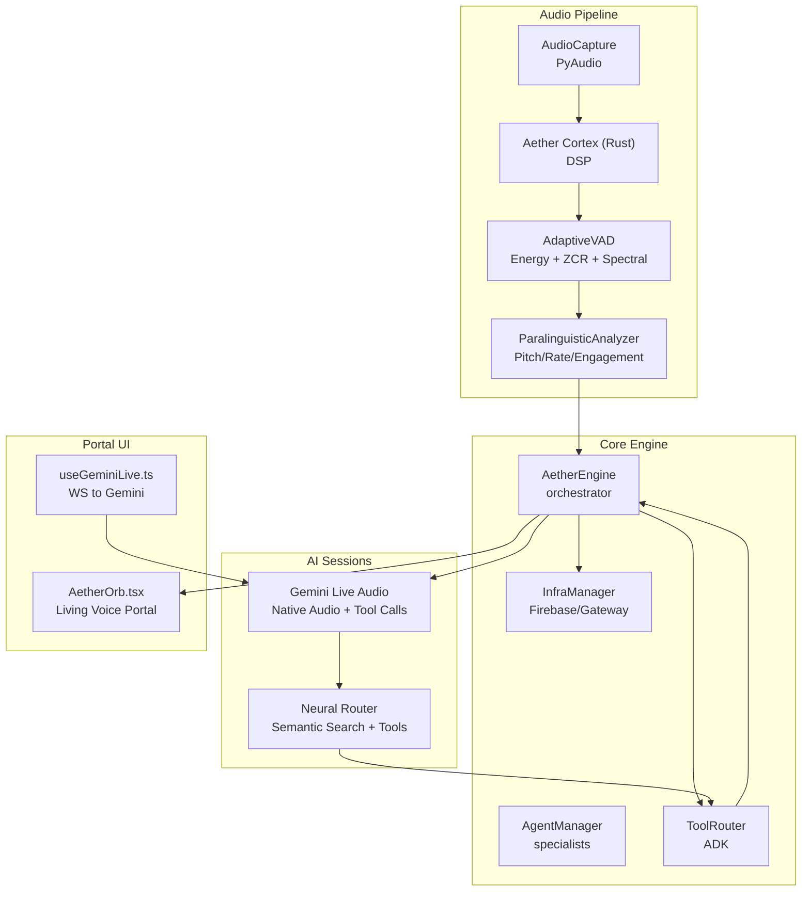
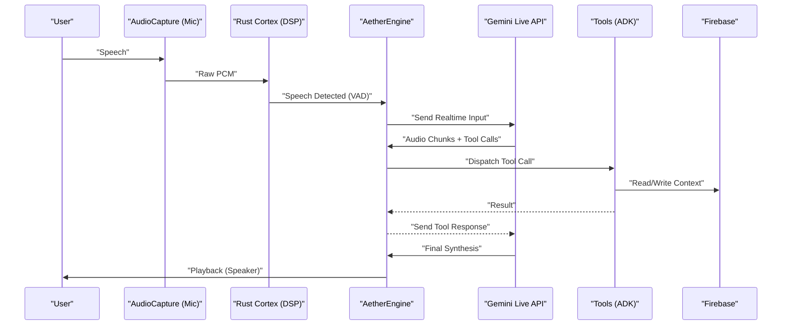
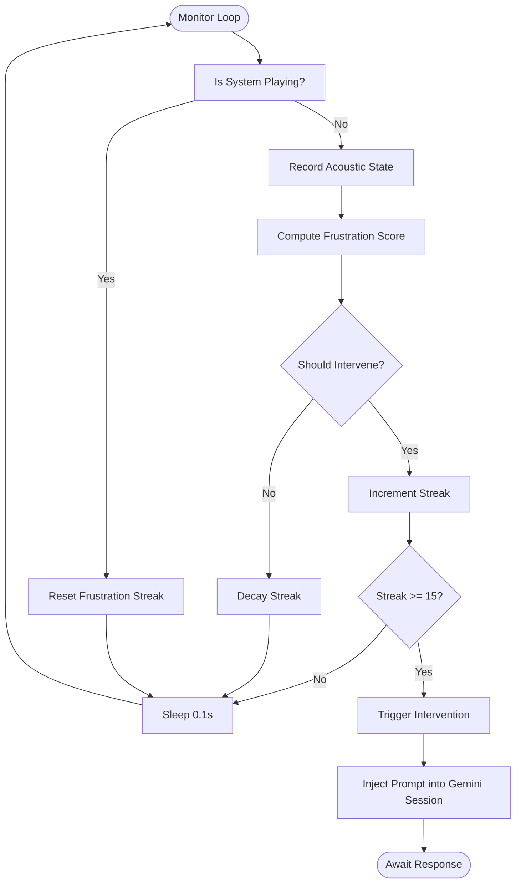
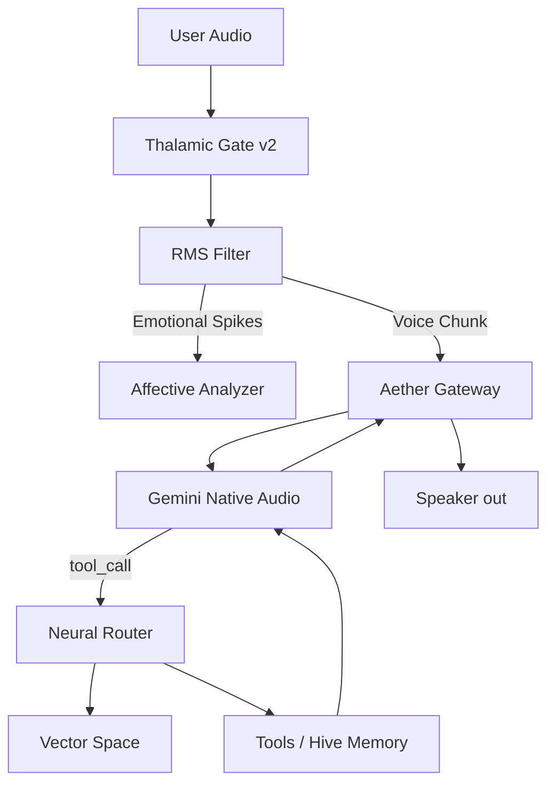
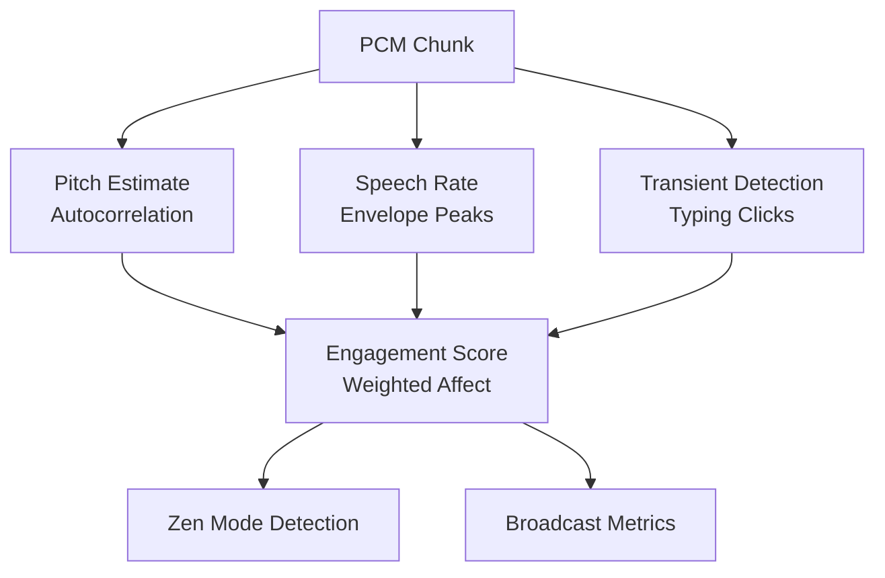
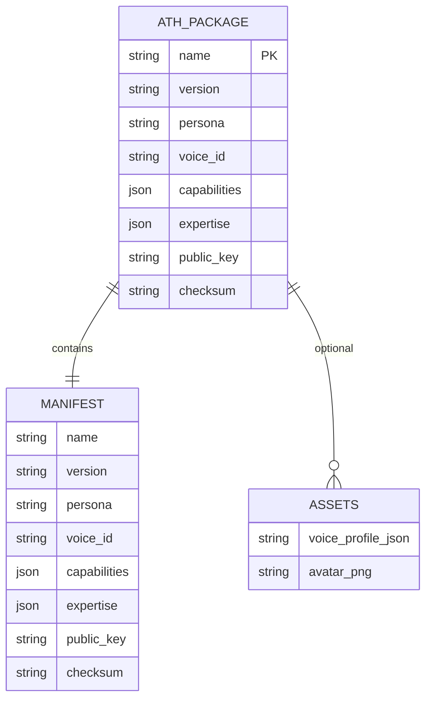
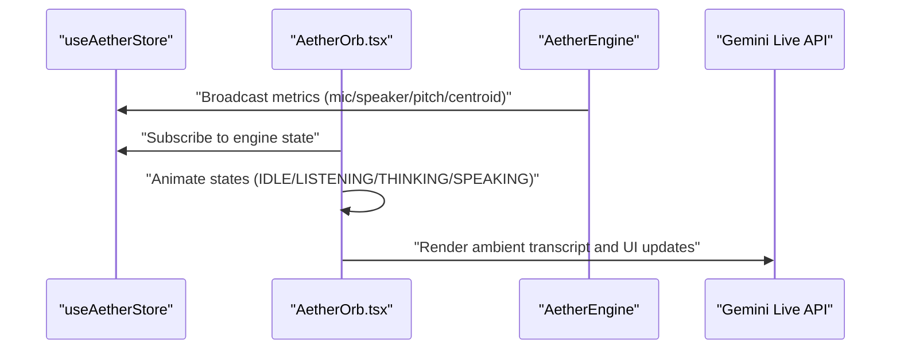
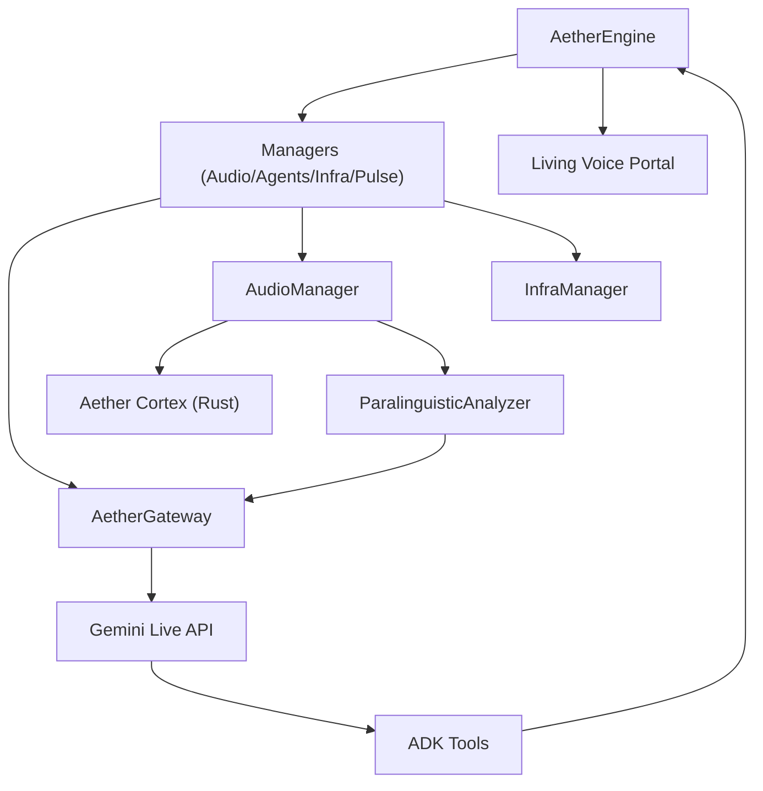

# Project Overview

<cite>
**Referenced Files in This Document**
- [README.md](file://README.md)
- [architecture.md](file://docs/architecture.md)
- [gateway_protocol.md](file://docs/gateway_protocol.md)
- [engine.py](file://core/engine.py)
- [thalamic.py](file://core/ai/thalamic.py)
- [processing.py](file://core/audio/processing.py)
- [paralinguistics.py](file://core/audio/paralinguistics.py)
- [baseline.py](file://core/emotion/baseline.py)
- [AetherOrb.tsx](file://apps/portal/src/components/AetherOrb.tsx)
- [Soul.md](file://brain/personas/Soul.md)
- [heartbeat.md](file://brain/personas/heartbeat.md)
- [ath_package_spec.md](file://docs/ath_package_spec.md)
- [cortex README](file://cortex/README.md)
</cite>

## Table of Contents
1. [Introduction](#introduction)
2. [Project Structure](#project-structure)
3. [Core Components](#core-components)
4. [Architecture Overview](#architecture-overview)
5. [Detailed Component Analysis](#detailed-component-analysis)
6. [Dependency Analysis](#dependency-analysis)
7. [Performance Considerations](#performance-considerations)
8. [Troubleshooting Guide](#troubleshooting-guide)
9. [Conclusion](#conclusion)
10. [Appendices](#appendices)

## Introduction
Aether Voice OS envisions a future where the UI layer is eliminated entirely, enabling seamless voice-native AI interaction. By leveraging sub-200ms latency and deep paralinguistic awareness, Aether transforms speech into real-time actions powered by Gemini Live audio. The project’s mission is to deliver a continuous audio stream that feels invisible, intuitive, and deeply empathetic.

Key value propositions:
- Sub-200ms end-to-end latency for frictionless voice interactions.
- Deep paralinguistic awareness enabling emotional AI and proactive interventions.
- Revolutionary neural interface design through the Neural Switchboard and Thalamic Gate V2.
- Living Voice Portal as a sentient, voice-first UI that replaces chat paradigms.

Target use cases:
- Developer co-pilot: Detects frustration and proactively fixes bugs.
- Multilingual assistant: Real-time translation across languages.
- Accessibility aid: Hands-free, visual-aware system interactions.
- Smart home control: Conversational control without wake words.
- Educational tutoring: Personalized, context-aware learning with emotional fatigue monitoring.

Breakthrough technologies:
- Thalamic Gate V2: Software-defined AEC with RMS hysteresis and MFCC spectral fingerprinting.
- Neural Switchboard: Pipeline architecture coordinating audio, cognition, action, and persistence.
- Aether Pack (.ath): Portable, signed identity packages for AI agents.
- Living Voice Portal: A sentient orb and ambient UI that reflects internal state and audio energy.

**Section sources**
- [README.md](file://README.md#L56-L129)
- [architecture.md](file://docs/architecture.md#L1-L67)
- [gateway_protocol.md](file://docs/gateway_protocol.md#L1-L125)

## Project Structure
Aether is organized as a monorepo with distinct layers:
- Core engine and orchestration: Python backend managing audio, agents, tools, and infrastructure.
- Audio processing and DSP: High-performance VAD, zero-crossing detection, and paralinguistic analytics.
- AI and agents: Specialized agents, proactive intervention, and multimodal sessions.
- Infrastructure: Gateway protocol, Firebase persistence, and telemetry.
- Frontend portal: Next.js application with a sentient orb and ambient UI.

**Diagram sources**
- [architecture.md](file://docs/architecture.md#L39-L60)
- [engine.py](file://core/engine.py#L26-L71)
- [processing.py](file://core/audio/processing.py#L107-L202)
- [paralinguistics.py](file://core/audio/paralinguistics.py#L31-L214)
- [AetherOrb.tsx](file://apps/portal/src/components/AetherOrb.tsx#L1-L258)

**Section sources**
- [architecture.md](file://docs/architecture.md#L1-L67)
- [engine.py](file://core/engine.py#L26-L71)

## Core Components
- AetherEngine: High-level orchestrator initializing managers, gateway, audio, infrastructure, and admin API. It coordinates the event bus, pulse, and cognitive scheduler, and delegates tool execution to the ADK.
- Thalamic Gate V2: Proactive intervention hub that monitors affective indices and triggers barge-in when user frustration exceeds a threshold, synthesizing targeted prompts into the Gemini session.
- Aether Cortex (Rust): High-performance DSP backend for VAD, zero-crossing detection, and other neural signal processing, with a Python bridge for fallback.
- Paralinguistic Analyzer: Extracts pitch, speech rate, RMS variance, spectral centroid, and engagement to compute affective states and detect zen mode.
- Aether Pack (.ath): Portable identity package for agents, including persona, skills, heartbeat routines, and integrity verification.
- Living Voice Portal: Next.js frontend featuring a sentient orb that visually reflects engine state, audio energy, and paralinguistic metrics.

Practical examples:
- Proactive intervention: When sustained frustration is detected, the Thalamic Gate injects a contextual prompt into the Gemini session to assist the user.
- Emotional AI: Paralinguistic features power affective scoring and broadcast telemetry to the portal for visual feedback.

**Section sources**
- [engine.py](file://core/engine.py#L26-L71)
- [thalamic.py](file://core/ai/thalamic.py#L11-L40)
- [processing.py](file://core/audio/processing.py#L107-L202)
- [paralinguistics.py](file://core/audio/paralinguistics.py#L31-L214)
- [ath_package_spec.md](file://docs/ath_package_spec.md#L1-L100)
- [AetherOrb.tsx](file://apps/portal/src/components/AetherOrb.tsx#L1-L258)

## Architecture Overview
Aether employs a Single-Modal Unified Pipeline leveraging Gemini 2.0 Multimodal Live to process audio understanding, reasoning, and synthesis in a single neural context. The nervous system comprises four layers:
- Perceptual Layer: Audio I/O with PyAudio capture, windowing, and Rust Cortex DSP.
- Cognitive Layer: WebSocket-based Gemini Live session with barge-in logic and real-time tool calls.
- Executive Layer: Tool routing, concurrent execution, and grounding via Google Search.
- Persistence Layer: Firebase connector, Aether Gateway handshake, and broadcast telemetry.

**Diagram sources**
- [architecture.md](file://docs/architecture.md#L39-L60)

**Section sources**
- [architecture.md](file://docs/architecture.md#L1-L67)

## Detailed Component Analysis

### Thalamic Gate V2: Proactive Intervention Engine
The Thalamic Gate monitors affective state and triggers proactive interventions when user frustration persists. It integrates with the audio state, emotion baseline calibration, and the Gemini Live session to inject contextual prompts.

**Diagram sources**
- [thalamic.py](file://core/ai/thalamic.py#L41-L80)
- [baseline.py](file://core/emotion/baseline.py#L9-L31)

**Section sources**
- [thalamic.py](file://core/ai/thalamic.py#L11-L40)
- [baseline.py](file://core/emotion/baseline.py#L9-L31)

### Neural Switchboard: Audio-to-Action Pipeline
The Neural Switchboard coordinates audio gating, emotional analytics, and tool execution through a structured pipeline. It bridges the perceptual layer (VAD and paralinguistics) to the cognitive layer (Gemini Live) and executive layer (ADK tools).

**Diagram sources**
- [README.md](file://README.md#L142-L158)
- [engine.py](file://core/engine.py#L92-L123)

**Section sources**
- [README.md](file://README.md#L138-L158)
- [engine.py](file://core/engine.py#L92-L123)

### Paralinguistic Analytics: Emotional AI Features
The Paralinguistic Analyzer extracts core features for affective computing, including pitch, speech rate, RMS variance, spectral centroid, and engagement. These features inform the Thalamic Gate and drive the Living Voice Portal’s visual state.

**Diagram sources**
- [paralinguistics.py](file://core/audio/paralinguistics.py#L132-L214)

**Section sources**
- [paralinguistics.py](file://core/audio/paralinguistics.py#L19-L30)
- [paralinguistics.py](file://core/audio/paralinguistics.py#L132-L214)

### Aether Pack (.ath): Agent Identity and Capabilities
The .ath package encapsulates an agent’s persona, skills, heartbeat routines, and integrity checks. It defines capabilities, voice preferences, and expertise scores for the Hive coordinator.

**Diagram sources**
- [ath_package_spec.md](file://docs/ath_package_spec.md#L10-L22)
- [ath_package_spec.md](file://docs/ath_package_spec.md#L26-L43)

**Section sources**
- [ath_package_spec.md](file://docs/ath_package_spec.md#L1-L100)

### Living Voice Portal: Sentient UI Experience
The Living Voice Portal replaces traditional chat interfaces with a sentient orb that pulses, glows, and reacts to voice energy and paralinguistic metrics. It renders engine state, audio levels, and affective telemetry.

**Diagram sources**
- [AetherOrb.tsx](file://apps/portal/src/components/AetherOrb.tsx#L1-L258)
- [engine.py](file://core/engine.py#L92-L123)

**Section sources**
- [AetherOrb.tsx](file://apps/portal/src/components/AetherOrb.tsx#L1-L258)
- [engine.py](file://core/engine.py#L92-L123)

## Dependency Analysis
Aether’s architecture emphasizes loose coupling and high cohesion across layers:
- Engine depends on managers for audio, agents, infrastructure, and pulse.
- Audio processing integrates Rust Cortex for performance with NumPy fallbacks.
- Paralinguistic analytics feed affective telemetry to the gateway and portal.
- The .ath package provides identity and capability contracts for agents.

**Diagram sources**
- [engine.py](file://core/engine.py#L26-L71)
- [processing.py](file://core/audio/processing.py#L38-L96)
- [paralinguistics.py](file://core/audio/paralinguistics.py#L31-L67)
- [gateway_protocol.md](file://docs/gateway_protocol.md#L37-L72)

**Section sources**
- [engine.py](file://core/engine.py#L26-L71)
- [processing.py](file://core/audio/processing.py#L38-L96)
- [paralinguistics.py](file://core/audio/paralinguistics.py#L31-L67)
- [gateway_protocol.md](file://docs/gateway_protocol.md#L37-L72)

## Performance Considerations
- Multithreading and structured concurrency prevent GIL blocking and ensure graceful shutdown.
- Zero-copy buffers and Rust-first DSP minimize overhead and maximize throughput.
- Adaptive VAD and hyper-threshold detection reduce false positives and improve responsiveness.
- Speculative pre-warming and deep handover reduce inter-agent latency.

[No sources needed since this section provides general guidance]

## Troubleshooting Guide
Common operational tips:
- Microphone access on Linux: set the correct input device index via the provided PyAudio script.
- Firebase availability: the system degrades gracefully; configure credentials for persistent memory.
- High CPU usage: verify compiled C extensions for PyAudio and reduce frontend visualizer FPS.

**Section sources**
- [README.md](file://README.md#L244-L249)

## Conclusion
Aether Voice OS redefines voice interaction by eliminating UI layers and introducing a living, empathetic neural interface. Through Thalamic Gate V2, paralinguistic analytics, and the Neural Switchboard, it achieves sub-200ms latency and proactive assistance. The Living Voice Portal and Aether Pack (.ath) complete the vision of a sentient, voice-first operating layer that feels alive and truly understands the user.

[No sources needed since this section summarizes without analyzing specific files]

## Appendices

### Conceptual Overview for Beginners
- Mission: Replace UI with a continuous audio stream for frictionless interaction.
- Core value: Sub-200ms latency and deep paralinguistic awareness.
- Revolutionary design: Neural Switchboard and Thalamic Gate V2 for self-aware audio filtering.
- Use cases: Developer co-pilot, multilingual assistant, accessibility aid, smart home control, education.

**Section sources**
- [README.md](file://README.md#L56-L129)

### Technical Details for Developers
- Architecture: Single-modal unified pipeline with Gemini Live audio.
- Technologies: Rust Cortex for DSP, Python for orchestration, Next.js for the portal.
- Protocols: Secure Ed25519 handshake and deep handover for agent transitions.
- Identity: .ath packages define persona, skills, and capabilities.

**Section sources**
- [architecture.md](file://docs/architecture.md#L1-L67)
- [gateway_protocol.md](file://docs/gateway_protocol.md#L1-L125)
- [ath_package_spec.md](file://docs/ath_package_spec.md#L1-L100)
- [cortex README](file://cortex/README.md#L1-L45)