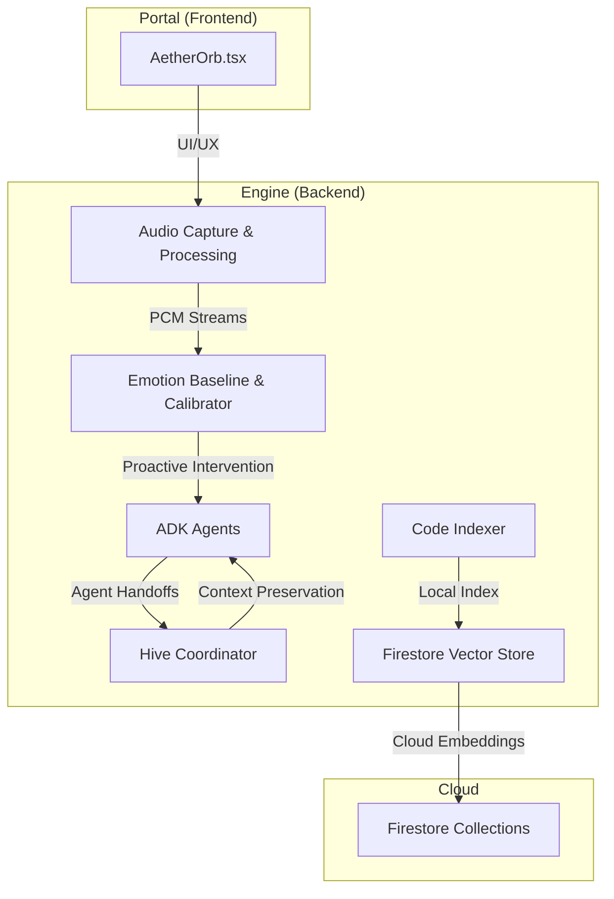
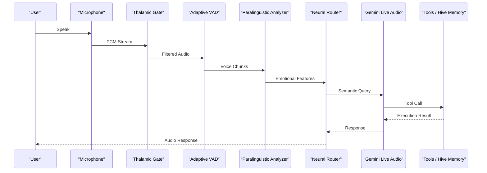
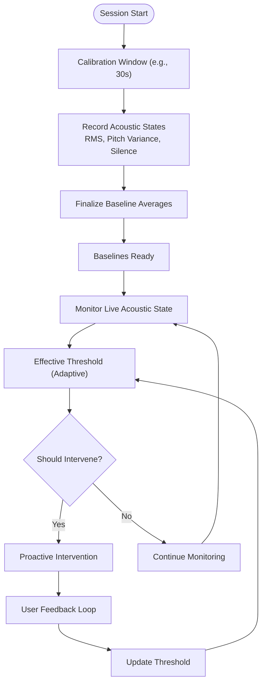
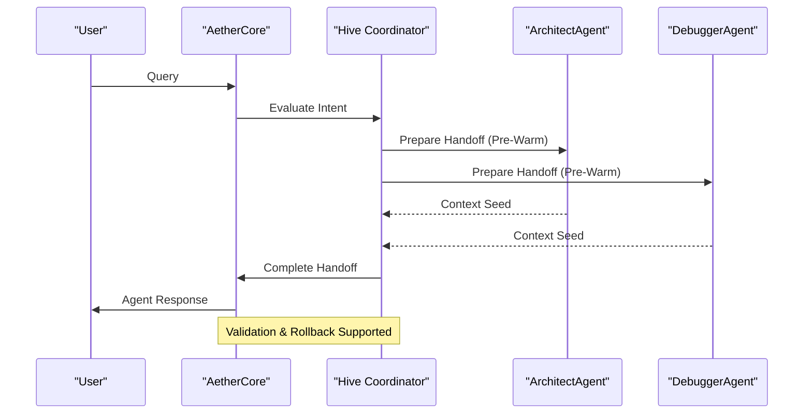
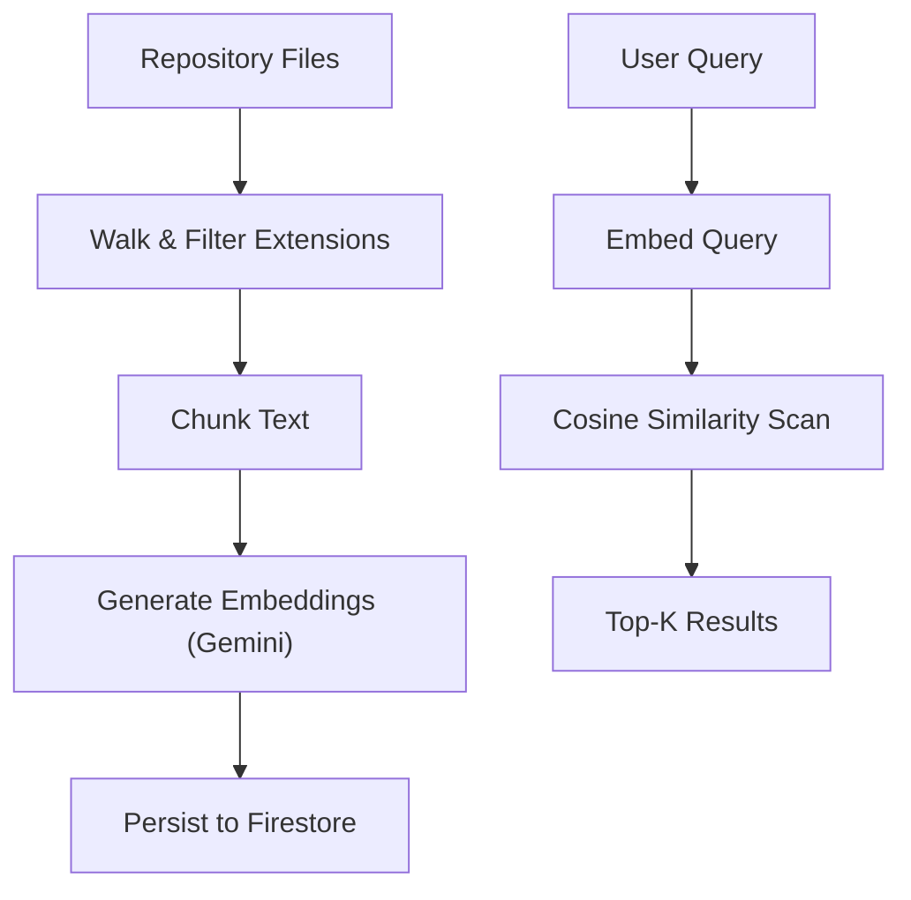
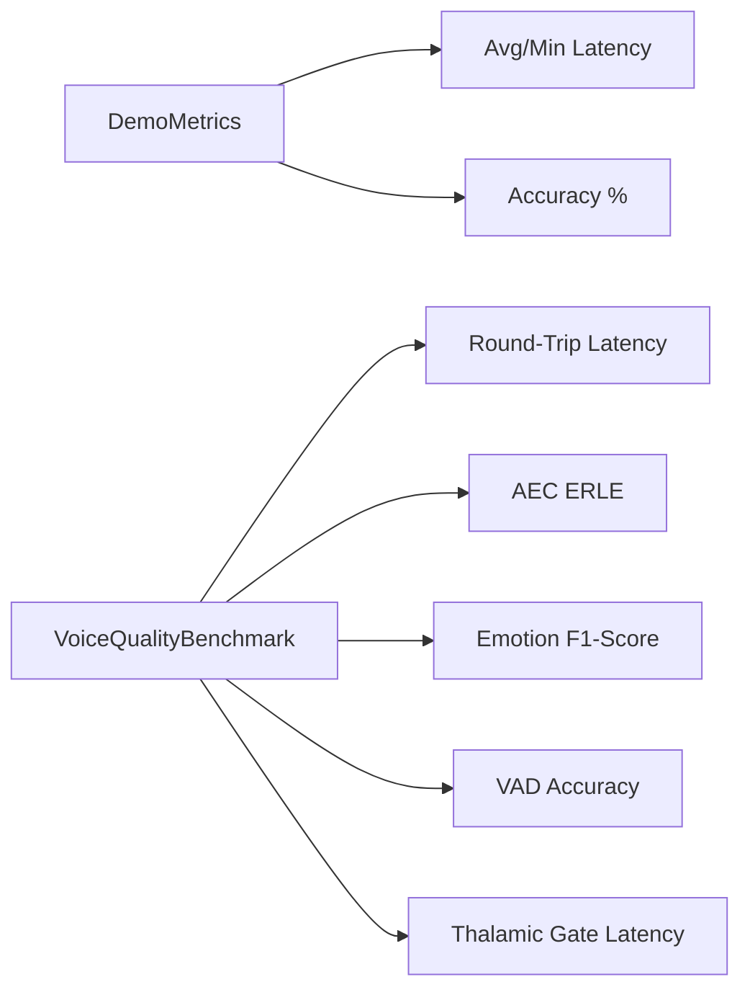
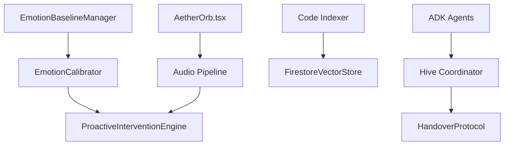

# Roadmap and Future Development

<cite>
**Referenced Files in This Document**
- [README.md](file://README.md)
- [ROADMAP.md](file://docs/ROADMAP.md)
- [baseline.py](file://core/emotion/baseline.py)
- [calibrator.py](file://core/emotion/calibrator.py)
- [adk_agents.py](file://core/ai/adk_agents.py)
- [code_indexer.py](file://core/tools/code_indexer.py)
- [firestore_vector_store.py](file://core/tools/firestore_vector_store.py)
- [hive.py](file://core/ai/hive.py)
- [handover_protocol.py](file://core/ai/handover_protocol.py)
- [demo_metrics.py](file://core/analytics/demo_metrics.py)
- [voice_quality_benchmark.py](file://tests/benchmarks/voice_quality_benchmark.py)
- [AetherOrb.tsx](file://apps/portal/src/components/AetherOrb.tsx)
</cite>

## Table of Contents
1. [Introduction](#introduction)
2. [Project Structure](#project-structure)
3. [Core Components](#core-components)
4. [Architecture Overview](#architecture-overview)
5. [Detailed Component Analysis](#detailed-component-analysis)
6. [Dependency Analysis](#dependency-analysis)
7. [Performance Considerations](#performance-considerations)
8. [Troubleshooting Guide](#troubleshooting-guide)
9. [Conclusion](#conclusion)
10. [Appendices](#appendices)

## Introduction
This document outlines the current development status and the strategic roadmap for Aether Voice OS, focusing on the transition from v2.1 alpha to v3.0. It consolidates the project’s achievements, ongoing enhancements, and future directions, including emotion calibration baseline, Google ADK multi-agent collaboration, local codebase vector indexing, and the expansion toward immersive audio-visual experiences. It also provides technical milestones, feature priorities, resource allocation plans, and innovation pipeline insights for stakeholders and developers.

## Project Structure
Aether Voice OS is organized as a monorepo integrating a backend audio engine, multimodal AI orchestration, cloud-native vector stores, and a cyberpunk web portal. The current alpha release (v2.x) demonstrates a production-grade voice-first pipeline with proactive intervention and multimodal sensing. The roadmap documents the next phases and future goals.

**Diagram sources**
- [AetherOrb.tsx](file://apps/portal/src/components/AetherOrb.tsx#L41-L74)
- [baseline.py](file://core/emotion/baseline.py#L9-L87)
- [calibrator.py](file://core/emotion/calibrator.py#L8-L65)
- [adk_agents.py](file://core/ai/adk_agents.py#L1-L77)
- [hive.py](file://core/ai/hive.py#L47-L124)
- [code_indexer.py](file://core/tools/code_indexer.py#L1-L131)
- [firestore_vector_store.py](file://core/tools/firestore_vector_store.py#L22-L129)

**Section sources**
- [README.md](file://README.md#L184-L250)
- [ROADMAP.md](file://docs/ROADMAP.md#L1-L59)

## Core Components
- Emotion Calibration Baseline: Implements a dynamic acoustic baseline for user sessions and adaptive thresholds for proactive intervention.
- Google ADK Multi-Agent Collaboration: Integrates Architect and Debugger agents with the Deep Handover Protocol for seamless expert handoffs.
- Local Codebase Vector Indexing: Provides a script to index the codebase into a vector store for semantic retrieval and context-aware actions.
- Cloud Vector Store: Uses Firestore-backed embeddings for scalable retrieval and RAG.
- Proactive Intervention Engine: Detects emotional states and initiates empathetic interventions grounded in code context.
- Audio Pipeline: Thalamic Gate AEC, VAD, and paralinguistic analysis form the foundation for low-latency, affective voice interactions.

**Section sources**
- [baseline.py](file://core/emotion/baseline.py#L9-L87)
- [calibrator.py](file://core/emotion/calibrator.py#L8-L65)
- [adk_agents.py](file://core/ai/adk_agents.py#L1-L77)
- [code_indexer.py](file://core/tools/code_indexer.py#L1-L131)
- [firestore_vector_store.py](file://core/tools/firestore_vector_store.py#L22-L129)
- [demo_metrics.py](file://core/analytics/demo_metrics.py#L9-L50)

## Architecture Overview
The system architecture centers on a neural switchboard pipeline that captures audio, applies the Thalamic Gate AEC, performs VAD and paralinguistic analysis, routes to the AI model, and executes tools or interventions. The portal renders an immersive, voice-first experience with a sentient orb and ambient transcripts.

**Diagram sources**
- [README.md](file://README.md#L142-L158)
- [AetherOrb.tsx](file://apps/portal/src/components/AetherOrb.tsx#L41-L74)

**Section sources**
- [README.md](file://README.md#L132-L180)

## Detailed Component Analysis

### Emotion Calibration Baseline and Proactive Intervention
- EmotionBaselineManager: Establishes a calibration window to compute baselines for RMS energy, pitch variance, and silence ratio, normalizing frustration scoring.
- EmotionCalibrator: Dynamically adjusts intervention thresholds based on user feedback and acoustic baselines, with stricter thresholds during calibration.

**Diagram sources**
- [baseline.py](file://core/emotion/baseline.py#L9-L87)
- [calibrator.py](file://core/emotion/calibrator.py#L8-L65)

**Section sources**
- [baseline.py](file://core/emotion/baseline.py#L9-L87)
- [calibrator.py](file://core/emotion/calibrator.py#L8-L65)

### Google ADK Multi-Agent Collaboration and Deep Handover Protocol
- ADK Agents: Architect and Debugger agents are wrapped as official ADK agents with curated tools and instructions.
- Hive Coordinator: Manages the Deep Handover Protocol, including negotiation, validation checkpoints, pre-warming, and rollback for reliable agent handoffs.
- Handover Protocol: Defines rich context models, negotiation messages, checkpoints, and snapshots for robust handover lifecycle management.

**Diagram sources**
- [adk_agents.py](file://core/ai/adk_agents.py#L1-L77)
- [hive.py](file://core/ai/hive.py#L181-L296)
- [handover_protocol.py](file://core/ai/handover_protocol.py#L107-L245)

**Section sources**
- [adk_agents.py](file://core/ai/adk_agents.py#L1-L77)
- [hive.py](file://core/ai/hive.py#L47-L124)
- [handover_protocol.py](file://core/ai/handover_protocol.py#L1-L200)

### Local Codebase Vector Indexing and Cloud Retrieval
- Code Indexer: Walks the repository, chunks text, generates embeddings via Gemini, and persists to Firestore for semantic search.
- Firestore Vector Store: Embeds and retrieves vectors, with a prototype similarity scan and guidance for production vector search extensions.

**Diagram sources**
- [code_indexer.py](file://core/tools/code_indexer.py#L56-L127)
- [firestore_vector_store.py](file://core/tools/firestore_vector_store.py#L37-L129)

**Section sources**
- [code_indexer.py](file://core/tools/code_indexer.py#L1-L131)
- [firestore_vector_store.py](file://core/tools/firestore_vector_store.py#L22-L129)

### Proactive Intervention Metrics and Benchmarks
- Demo Metrics: Tracks “Sigh-to-Intervention” latency and emotion accuracy for judge demonstrations.
- Voice Quality Benchmarks: Validates round-trip latency, AEC effectiveness, emotion detection F1-score, VAD accuracy, and Thalamic Gate latency.

**Diagram sources**
- [demo_metrics.py](file://core/analytics/demo_metrics.py#L9-L50)
- [voice_quality_benchmark.py](file://tests/benchmarks/voice_quality_benchmark.py#L222-L766)

**Section sources**
- [demo_metrics.py](file://core/analytics/demo_metrics.py#L9-L50)
- [voice_quality_benchmark.py](file://tests/benchmarks/voice_quality_benchmark.py#L1-L200)

## Dependency Analysis
- Emotion Baseline and Calibrator depend on acoustic state recording and feedback loops to refine intervention thresholds.
- ADK Agents rely on the Hive Coordinator for context preservation and handover orchestration.
- Vector indexing depends on Gemini embeddings and Firestore persistence.
- The portal UI integrates with the audio pipeline and telemetry for immersive feedback.

**Diagram sources**
- [baseline.py](file://core/emotion/baseline.py#L9-L87)
- [calibrator.py](file://core/emotion/calibrator.py#L8-L65)
- [adk_agents.py](file://core/ai/adk_agents.py#L1-L77)
- [hive.py](file://core/ai/hive.py#L47-L124)
- [handover_protocol.py](file://core/ai/handover_protocol.py#L107-L245)
- [code_indexer.py](file://core/tools/code_indexer.py#L56-L127)
- [firestore_vector_store.py](file://core/tools/firestore_vector_store.py#L22-L129)
- [AetherOrb.tsx](file://apps/portal/src/components/AetherOrb.tsx#L41-L74)

**Section sources**
- [README.md](file://README.md#L132-L180)

## Performance Considerations
- Latency Targets: Sub-200ms end-to-end, validated by benchmarks and demos.
- Resource Efficiency: Ultra-lightweight CPU and memory footprint compared to alternatives.
- Scalability: Firestore-backed embeddings and vector search readiness for enterprise-scale retrieval.
- AEC Convergence: ERLE targets and double-talk handling ensure robust echo cancellation under realistic conditions.

[No sources needed since this section provides general guidance]

## Troubleshooting Guide
- Microphone Issues: Set the correct input device index via environment variables and ensure PyAudio C extensions are compiled.
- Firebase Connectivity: The system degrades gracefully without persistent memory; configure credentials for Firestore when required.
- High CPU Usage: Verify PyAudio compilation and reduce frontend visualizer FPS.

**Section sources**
- [README.md](file://README.md#L244-L249)

## Conclusion
Aether Voice OS stands at a pivotal point, with v2.1 alpha delivering a production-grade voice-first system. The upcoming v3.0 roadmap expands the platform toward immersive audio-visual experiences, multi-party spatial conversations, AR/VR audio integration, and voice-to-code instantaneous tracking. The innovation pipeline emphasizes acoustic self-awareness, multimodal capabilities, and proactive intervention algorithms, supported by robust engineering practices, benchmark-driven validation, and scalable cloud infrastructure.

[No sources needed since this section summarizes without analyzing specific files]

## Appendices

### Current Development Status (v2.x Alpha)
- Core Voice Infrastructure: Completed.
- Visual UX (“Wispr Flow”): Completed.
- Firebase Cloud Native Backend: Completed.
- Google ADK & Skills Hub: Completed.
- Submission & Verification: Completed.

**Section sources**
- [ROADMAP.md](file://docs/ROADMAP.md#L9-L59)

### v2.1 Alpha Enhancements
- Emotion Calibration Baseline: Session-based acoustic baselines and adaptive thresholds for proactive intervention.
- Google ADK Multi-Agent Collaboration: Official ADK agents with Deep Handover Protocol for seamless expert handoffs.
- Local Codebase Vector Indexing: Scripted indexing into Firestore-backed embeddings for semantic retrieval.

**Section sources**
- [README.md](file://README.md#L235-L236)
- [baseline.py](file://core/emotion/baseline.py#L9-L87)
- [calibrator.py](file://core/emotion/calibrator.py#L8-L65)
- [adk_agents.py](file://core/ai/adk_agents.py#L1-L77)
- [code_indexer.py](file://core/tools/code_indexer.py#L1-L131)
- [firestore_vector_store.py](file://core/tools/firestore_vector_store.py#L22-L129)

### v3.0 Future Roadmap
- Multi-party Spatial Conversations: Enabling group interactions with spatial audio cues.
- AR/VR Audio Integration: Immersive audio-visual environments with spatial sound.
- Voice-to-Code Instantaneous Tracking: Real-time code awareness and intervention.

**Section sources**
- [README.md](file://README.md#L235-L236)

### Strategic Direction and Innovation Pipeline
- Acoustic Self-Awareness: Thalamic Gate AEC and MFCC fingerprinting for true acoustic identity.
- Multimodal Expansion: Native audio plus synchronized screen vision for richer context.
- Proactive Interventions: Empathetic, code-aware interventions with calibrated thresholds.
- Scalability and Performance: Firestore vector store, benchmark-driven latency targets, and convergence-focused AEC.

**Section sources**
- [README.md](file://README.md#L97-L128)
- [voice_quality_benchmark.py](file://tests/benchmarks/voice_quality_benchmark.py#L222-L766)

### Technical Milestones and Feature Priorities
- Emotion Baseline Finalization and Threshold Calibration: Priority 1.
- ADK Deep Handover Protocol Validation: Priority 1.
- Local Codebase Indexing and Cloud Retrieval: Priority 2.
- Portal UI Enhancements and Telemetry: Priority 2.
- AR/VR Audio Integration and Spatial Conversations: Priority 3.

[No sources needed since this section provides general guidance]

### Resource Allocation Plans
- Backend Audio and Emotion: Dedicated engineers for DSP, AEC, and paralinguistic analysis.
- AI Orchestration: Multi-agent system architects and protocol specialists.
- Vector Indexing and Retrieval: Platform engineers for embedding pipelines and Firestore integration.
- Frontend Portal: UI/UX designers and frontend developers for immersive experiences.
- QA and Benchmarks: Automation engineers for latency, accuracy, and stability validation.

[No sources needed since this section provides general guidance]