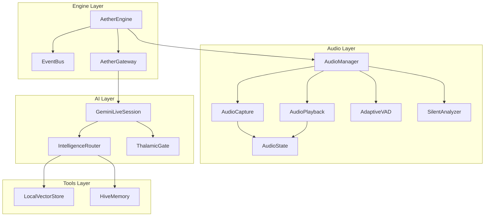
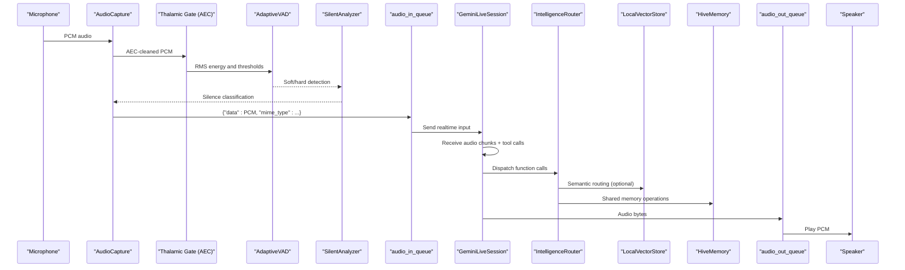
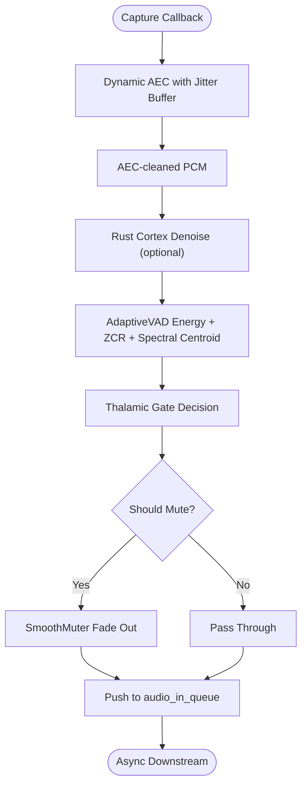
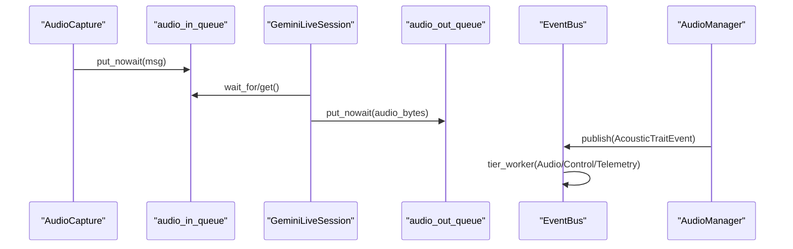
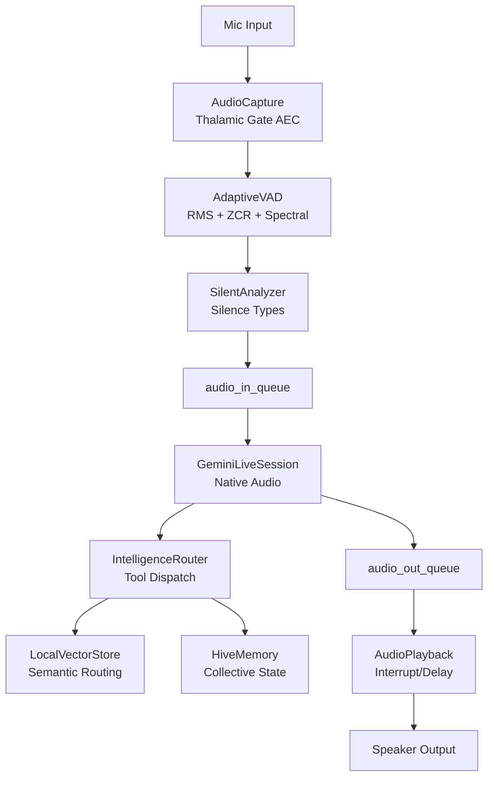
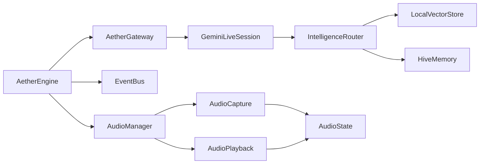

# System Architecture Overview

<cite>
**Referenced Files in This Document**
- [engine.py](file://core/engine.py)
- [gateway.py](file://core/infra/transport/gateway.py)
- [event_bus.py](file://core/infra/event_bus.py)
- [audio.py](file://core/logic/managers/audio.py)
- [capture.py](file://core/audio/capture.py)
- [processing.py](file://core/audio/processing.py)
- [state.py](file://core/audio/state.py)
- [echo_guard.py](file://core/audio/echo_guard.py)
- [thalamic.py](file://core/ai/thalamic.py)
- [session.py](file://core/ai/session.py)
- [router.py](file://core/ai/router.py)
- [vector_store.py](file://core/tools/vector_store.py)
- [hive_memory.py](file://core/tools/hive_memory.py)
- [playback.py](file://core/audio/playback.py)
- [architecture.md](file://docs/architecture.md)
- [perception.md](file://docs/perception.md)
</cite>

## Table of Contents
1. [Introduction](#introduction)
2. [Project Structure](#project-structure)
3. [Core Components](#core-components)
4. [Architecture Overview](#architecture-overview)
5. [Detailed Component Analysis](#detailed-component-analysis)
6. [Dependency Analysis](#dependency-analysis)
7. [Performance Considerations](#performance-considerations)
8. [Troubleshooting Guide](#troubleshooting-guide)
9. [Conclusion](#conclusion)

## Introduction
This document presents the system architecture of Aether OS with a focus on the distributed Pipeline Architecture and the new Thalamic Gate Audio Layer that powers the unified audio intelligence pipeline. The architecture follows an event-driven design where each stage operates as an independent task communicating via thread-safe queues bridged to asyncio. The pipeline spans from user audio input through RMS energy detection, hysteresis gating, affective analysis, and Gemini Native Audio integration, then to the Neural Router, Vector Space, Tools/Hive Memory, and back to speaker output. The approach replaces traditional hardware DSP with an innovative software-structured pipeline that leverages Rust-accelerated Cortex modules and Python-based orchestration.

## Project Structure
The Aether OS architecture is organized into layered modules:
- Engine: Orchestrates managers, event bus, and lifecycle.
- Transport: Gateway and session management for Gemini Live.
- Audio: Capture, processing, playback, and state management.
- AI: Thalamic Gate, router, and session coordination.
- Tools: Vector store and Hive memory for semantic routing and persistence.
- Infrastructure: Event bus and transport abstractions.

**Diagram sources**
- [engine.py](file://core/engine.py#L26-L120)
- [gateway.py](file://core/infra/transport/gateway.py#L99-L138)
- [audio.py](file://core/logic/managers/audio.py#L18-L98)
- [capture.py](file://core/audio/capture.py#L193-L575)
- [processing.py](file://core/audio/processing.py#L256-L508)
- [state.py](file://core/audio/state.py#L36-L129)
- [session.py](file://core/ai/session.py#L43-L236)
- [router.py](file://core/ai/router.py#L14-L84)
- [vector_store.py](file://core/tools/vector_store.py#L21-L112)
- [hive_memory.py](file://core/tools/hive_memory.py#L25-L115)

**Section sources**
- [engine.py](file://core/engine.py#L26-L120)
- [gateway.py](file://core/infra/transport/gateway.py#L99-L138)
- [audio.py](file://core/logic/managers/audio.py#L18-L98)
- [capture.py](file://core/audio/capture.py#L193-L575)
- [processing.py](file://core/audio/processing.py#L256-L508)
- [state.py](file://core/audio/state.py#L36-L129)
- [session.py](file://core/ai/session.py#L43-L236)
- [router.py](file://core/ai/router.py#L14-L84)
- [vector_store.py](file://core/tools/vector_store.py#L21-L112)
- [hive_memory.py](file://core/tools/hive_memory.py#L25-L115)

## Core Components
- AetherEngine: Central orchestrator initializing EventBus, Gateway, AudioManager, InfraManager, and CognitiveScheduler.
- AetherGateway: Owns audio queues and manages session state; exposes audio_in_queue and audio_out_queue for the pipeline.
- EventBus: Multi-tier worker system managing Audio, Control, and Telemetry queues.
- AudioManager: Coordinates capture, playback, VAD, and affective telemetry publishing.
- AudioCapture: Microphone capture with Thalamic Gate AEC logic in the callback; pushes to asyncio queue.
- AudioPlayback: Thread-safe speaker output feeding, with interrupt and drain mechanisms.
- GeminiLiveSession: Bidirectional audio session with Gemini; integrates Thalamic Gate V2 and tool dispatch.
- IntelligenceRouter: Hybrid routing combining keyword rules, embeddings, and fallback to the orchestrator.
- LocalVectorStore: Lightweight semantic search backed by Gemini embeddings.
- HiveMemory: Shared collective memory via Firebase for cross-agent state.
- AudioState: Thread-safe singleton for global audio state and AEC telemetry.
- AdaptiveVAD and SilentAnalyzer: Multi-feature voice activity detection and silence classification.
- EchoGuard: Software-defined acoustic identity and echo suppression.

**Section sources**
- [engine.py](file://core/engine.py#L26-L120)
- [gateway.py](file://core/infra/transport/gateway.py#L99-L138)
- [event_bus.py](file://core/infra/event_bus.py#L102-L124)
- [audio.py](file://core/logic/managers/audio.py#L18-L98)
- [capture.py](file://core/audio/capture.py#L193-L575)
- [processing.py](file://core/audio/processing.py#L256-L508)
- [state.py](file://core/audio/state.py#L36-L129)
- [echo_guard.py](file://core/audio/echo_guard.py#L14-L97)
- [session.py](file://core/ai/session.py#L43-L236)
- [thalamic.py](file://core/ai/thalamic.py#L11-L48)
- [router.py](file://core/ai/router.py#L14-L84)
- [vector_store.py](file://core/tools/vector_store.py#L21-L112)
- [hive_memory.py](file://core/tools/hive_memory.py#L25-L115)
- [playback.py](file://core/audio/playback.py#L151-L191)

## Architecture Overview
Aether OS employs a distributed, event-driven pipeline:
- Audio Intelligence Layer: Microphone capture with Thalamic Gate AEC and VAD, followed by affective analysis and telemetry.
- Cognitive Layer: Gemini Live session consumes PCM chunks, emits audio responses and tool calls, and coordinates barge-in.
- Executive Layer: IntelligenceRouter maps tool calls to handlers; parallel execution ensures non-blocking audio.
- Persistence Layer: LocalVectorStore for semantic routing; HiveMemory for shared state across agents.

**Diagram sources**
- [capture.py](file://core/audio/capture.py#L329-L509)
- [processing.py](file://core/audio/processing.py#L256-L508)
- [state.py](file://core/audio/state.py#L36-L129)
- [gateway.py](file://core/infra/transport/gateway.py#L112-L133)
- [session.py](file://core/ai/session.py#L237-L478)
- [router.py](file://core/ai/router.py#L22-L48)
- [vector_store.py](file://core/tools/vector_store.py#L66-L112)
- [hive_memory.py](file://core/tools/hive_memory.py#L25-L115)
- [playback.py](file://core/audio/playback.py#L151-L191)

**Section sources**
- [architecture.md](file://docs/architecture.md#L1-L67)
- [perception.md](file://docs/perfection.md#L1-L65)
- [gateway.py](file://core/infra/transport/gateway.py#L99-L138)
- [session.py](file://core/ai/session.py#L43-L236)
- [audio.py](file://core/logic/managers/audio.py#L18-L98)

## Detailed Component Analysis

### Thalamic Gate Audio Layer
The Thalamic Gate integrates software-defined AEC and echo suppression directly in the capture callback:
- RMS Energy Threshold and Dynamic Noise Floor Tracking prevent ambient triggers.
- Acoustic Identity Cache fingerprints system output and compares with incoming mic audio using spectral similarity.
- Hysteresis and Reverb Lockout avoid rapid toggling and late-room-reflection false positives.
- Rust-accelerated Cortex modules enhance performance for VAD and zero-crossing detection.

**Diagram sources**
- [capture.py](file://core/audio/capture.py#L329-L509)
- [processing.py](file://core/audio/processing.py#L256-L508)
- [echo_guard.py](file://core/audio/echo_guard.py#L14-L97)
- [state.py](file://core/audio/state.py#L36-L129)

**Section sources**
- [capture.py](file://core/audio/capture.py#L193-L575)
- [processing.py](file://core/audio/processing.py#L256-L508)
- [echo_guard.py](file://core/audio/echo_guard.py#L14-L97)
- [state.py](file://core/audio/state.py#L36-L129)

### Neural Switchboard Logic
Neural Switchboard Logic describes how stages operate independently and communicate via thread-safe queues bridged to asyncio:
- AudioCapture writes to audio_in_queue using call_soon_threadsafe to avoid thread hops.
- GeminiLiveSession reads from audio_in_queue and writes to audio_out_queue.
- EventBus workers process Audio, Control, and Telemetry tiers concurrently.
- AudioManager bridges affective telemetry to both legacy callbacks and the EventBus.

**Diagram sources**
- [capture.py](file://core/audio/capture.py#L298-L328)
- [gateway.py](file://core/infra/transport/gateway.py#L112-L133)
- [session.py](file://core/ai/session.py#L237-L478)
- [event_bus.py](file://core/infra/event_bus.py#L102-L124)
- [audio.py](file://core/logic/managers/audio.py#L72-L98)

**Section sources**
- [capture.py](file://core/audio/capture.py#L298-L328)
- [gateway.py](file://core/infra/transport/gateway.py#L112-L133)
- [session.py](file://core/ai/session.py#L237-L478)
- [event_bus.py](file://core/infra/event_bus.py#L102-L124)
- [audio.py](file://core/logic/managers/audio.py#L72-L98)

### Audio Processing Pipeline: From Mic to Speaker
The complete pipeline from microphone to speaker:
- Microphone capture with Thalamic Gate AEC and VAD.
- Affective analysis and silence classification.
- Queueing to GeminiLiveSession for audio understanding and synthesis.
- Tool dispatch and parallel execution.
- Output queue feeding speaker with interrupt/drain support.

**Diagram sources**
- [capture.py](file://core/audio/capture.py#L329-L509)
- [processing.py](file://core/audio/processing.py#L256-L508)
- [gateway.py](file://core/infra/transport/gateway.py#L112-L133)
- [session.py](file://core/ai/session.py#L237-L478)
- [router.py](file://core/ai/router.py#L22-L48)
- [vector_store.py](file://core/tools/vector_store.py#L66-L112)
- [hive_memory.py](file://core/tools/hive_memory.py#L25-L115)
- [playback.py](file://core/audio/playback.py#L151-L191)

**Section sources**
- [capture.py](file://core/audio/capture.py#L329-L509)
- [processing.py](file://core/audio/processing.py#L256-L508)
- [gateway.py](file://core/infra/transport/gateway.py#L112-L133)
- [session.py](file://core/ai/session.py#L237-L478)
- [router.py](file://core/ai/router.py#L22-L48)
- [vector_store.py](file://core/tools/vector_store.py#L66-L112)
- [hive_memory.py](file://core/tools/hive_memory.py#L25-L115)
- [playback.py](file://core/audio/playback.py#L151-L191)

### Innovative Software-Structured Approach
Aether OS replaces hardware DSP with a software-structured pipeline:
- Rust-accelerated Cortex modules (VAD, zero-crossing, spectral denoise) provide high-performance DSP.
- Python-based orchestration ensures flexibility and rapid iteration.
- Zero-copy buffer sharing between Python and Rust minimizes overhead.
- Structured concurrency with asyncio.TaskGroup guarantees safe shutdown and resource cleanup.

**Section sources**
- [processing.py](file://core/audio/processing.py#L38-L95)
- [engine.py](file://core/engine.py#L189-L240)

### Biological Inspiration
The pipeline draws parallels to the human auditory pathway:
- Cochlea → CochlearBuffer (RingBuffer).
- Synapse → energy_vad (neural activation threshold).
- Axon → find_zero_crossing (clean signal propagation).
- Thalamus → spectral_denoise (sensory noise filtering).

**Section sources**
- [processing.py](file://core/audio/processing.py#L14-L23)

## Dependency Analysis
The system exhibits loose coupling and clear separation of concerns:
- Engine depends on Gateway, EventBus, and Managers.
- Gateway owns audio queues and delegates to GeminiLiveSession.
- AudioManager encapsulates capture and playback lifecycles.
- Session depends on Router and ThalamicGate for proactive interventions.
- Router integrates with VectorStore and HiveMemory for semantic routing and persistence.

**Diagram sources**
- [engine.py](file://core/engine.py#L26-L120)
- [gateway.py](file://core/infra/transport/gateway.py#L99-L138)
- [audio.py](file://core/logic/managers/audio.py#L18-L98)
- [session.py](file://core/ai/session.py#L43-L236)
- [router.py](file://core/ai/router.py#L14-L84)
- [vector_store.py](file://core/tools/vector_store.py#L21-L112)
- [hive_memory.py](file://core/tools/hive_memory.py#L25-L115)
- [capture.py](file://core/audio/capture.py#L193-L575)
- [playback.py](file://core/audio/playback.py#L151-L191)
- [state.py](file://core/audio/state.py#L36-L129)

**Section sources**
- [engine.py](file://core/engine.py#L26-L120)
- [gateway.py](file://core/infra/transport/gateway.py#L99-L138)
- [audio.py](file://core/logic/managers/audio.py#L18-L98)
- [session.py](file://core/ai/session.py#L43-L236)
- [router.py](file://core/ai/router.py#L14-L84)
- [vector_store.py](file://core/tools/vector_store.py#L21-L112)
- [hive_memory.py](file://core/tools/hive_memory.py#L25-L115)
- [capture.py](file://core/audio/capture.py#L193-L575)
- [playback.py](file://core/audio/playback.py#L151-L191)
- [state.py](file://core/audio/state.py#L36-L129)

## Performance Considerations
- Multithreading: PyAudio runs in dedicated threads to avoid GIL contention.
- Structured Concurrency: TaskGroup ensures coordinated shutdown and resource cleanup.
- Zero-copy Buffers: NumPy arrays shared with Rust for minimal overhead.
- Adaptive Jitter Buffer: Maintains sub-200ms latency and smooth continuity.
- Parallel Tool Execution: Tool calls execute concurrently to avoid blocking audio.
- Queue Backpressure: Drop-oldest strategy on overflow to bound latency.

[No sources needed since this section provides general guidance]

## Troubleshooting Guide
Common issues and remedies:
- Audio Device Not Found: Verify microphone permissions and device availability; the capture layer raises a specific error with device listings.
- Queue Overflows: Monitor capture_queue_drops and adjust queue sizes or chunk sizes.
- Barge-in Delays: Confirm Zero-Crossing detection and playback drain logic; verify smooth muter ramp configuration.
- AEC Convergence Issues: Inspect jitter buffer depth and AEC parameters; ensure adequate hardware latency compensation.
- Tool Call Failures: Review parallel execution logs and function response broadcasting.

**Section sources**
- [capture.py](file://core/audio/capture.py#L511-L575)
- [playback.py](file://core/audio/playback.py#L151-L191)
- [session.py](file://core/ai/session.py#L493-L603)
- [audio.py](file://core/logic/managers/audio.py#L72-L98)

## Conclusion
Aether OS delivers a cohesive, event-driven audio pipeline powered by the Thalamic Gate Audio Layer and Gemini Native Audio. The distributed architecture enables independent, thread-safe stages communicating via queues, while the hybrid routing and vector memory layers provide intelligent tool orchestration and persistent context. The software-structured approach, leveraging Rust-accelerated Cortex modules and structured concurrency, achieves sub-200ms latency and robust barge-in behavior, aligning the system’s design with biological inspiration for perception and cognition.