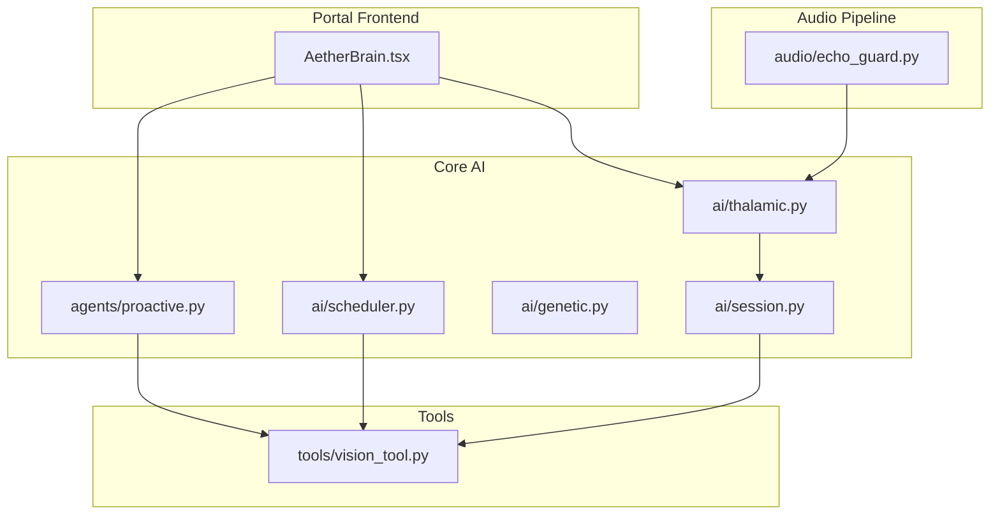
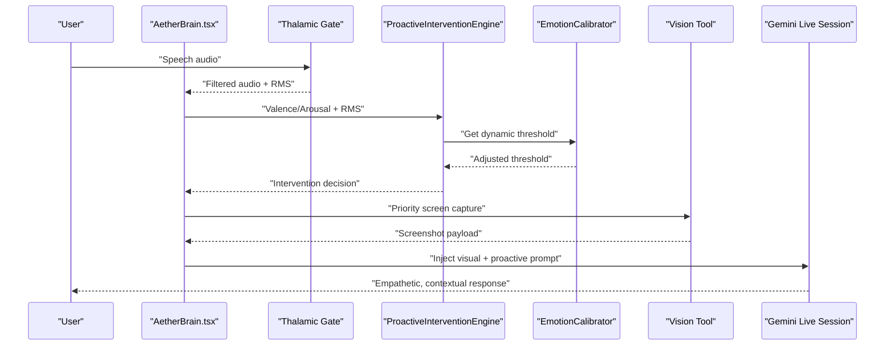
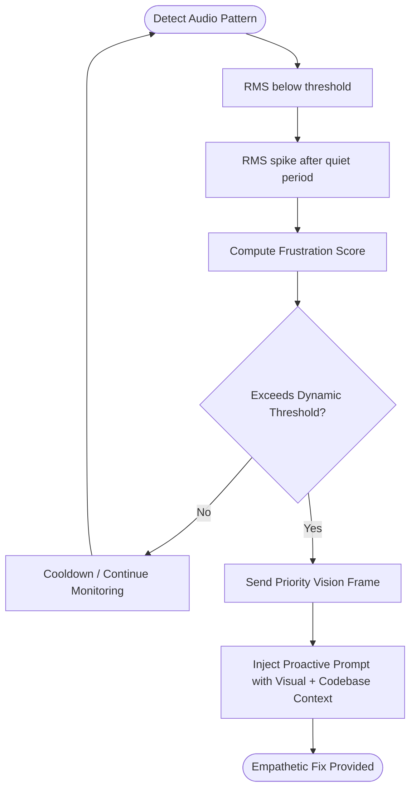
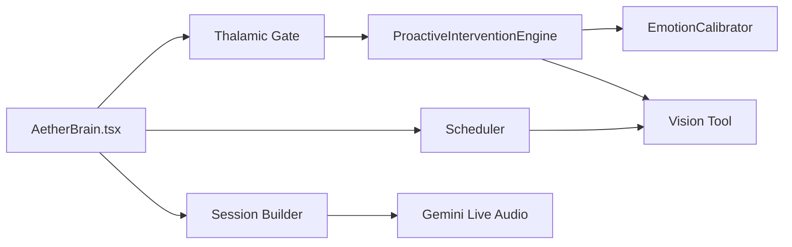

# Use Cases and Applications

<cite>
**Referenced Files in This Document**
- [README.md](file://README.md)
- [proactive.py](file://core/ai/agents/proactive.py)
- [calibrator.py](file://core/emotion/calibrator.py)
- [thalamic.py](file://core/ai/thalamic.py)
- [AetherBrain.tsx](file://apps/portal/src/components/AetherBrain.tsx)
- [session.py](file://core/ai/session.py)
- [echo_guard.py](file://core/audio/echo_guard.py)
- [vision_tool.py](file://core/tools/vision_tool.py)
- [genetic.py](file://core/ai/genetic.py)
- [scheduler.py](file://core/ai/scheduler.py)
- [fallback.py](file://core/demo/fallback.py)
- [test_voice_config.py](file://infra/scripts/debug/test_voice_config.py)
- [geminiLive.integration.test.ts](file://apps/portal/src/__tests__/geminiLive.integration.test.ts)
</cite>

## Table of Contents
1. [Introduction](#introduction)
2. [Project Structure](#project-structure)
3. [Core Components](#core-components)
4. [Architecture Overview](#architecture-overview)
5. [Detailed Component Analysis](#detailed-component-analysis)
6. [Dependency Analysis](#dependency-analysis)
7. [Performance Considerations](#performance-considerations)
8. [Troubleshooting Guide](#troubleshooting-guide)
9. [Conclusion](#conclusion)
10. [Appendices](#appendices)

## Introduction
This document presents the five primary application scenarios where Aether Voice OS delivers transformative value:
- Developer Co-Pilot: Saves 1–2 hours per day by catching bugs during emotional frustration.
- Multilingual Team Assistant: Eliminates language barriers with real-time translation.
- Accessibility Aid: Provides true hands-free, visual-aware system interactions.
- Smart Home: Enables seamless, conversational control without wake words.
- Education: Offers personalized, context-aware tutoring that monitors emotional fatigue.

For each use case, we explain the specific problems solved, the Aether capabilities leveraged, measurable benefits, and the proactive intervention functionality that detects emotional cues such as sighs and frustration spikes to provide timely assistance. We also outline technical requirements, limitations, business value propositions, and technical feasibility assessments for implementation.

## Project Structure
Aether Voice OS is organized as a monorepo with backend AI orchestration, audio processing, tools, and a Next.js portal frontend. The use cases span:
- Backend AI agents and sessions orchestrating multimodal interactions
- Audio pipeline with echo suppression and paralinguistic emotion detection
- Tools for vision and voice control
- Frontend components that visualize telemetry and trigger proactive actions

**Diagram sources**
- [AetherBrain.tsx](file://apps/portal/src/components/AetherBrain.tsx#L171-L198)
- [proactive.py](file://core/ai/agents/proactive.py#L10-L89)
- [thalamic.py](file://core/ai/thalamic.py#L81-L121)
- [scheduler.py](file://core/ai/scheduler.py#L33-L50)
- [genetic.py](file://core/ai/genetic.py#L150-L170)
- [session.py](file://core/ai/session.py#L110-L147)
- [echo_guard.py](file://core/audio/echo_guard.py#L52-L93)
- [vision_tool.py](file://core/tools/vision_tool.py#L19-L55)

**Section sources**
- [README.md](file://README.md#L132-L181)

## Core Components
- Proactive Intervention Engine: Detects emotional frustration via valence/arousal and triggers empathetic, context-aware interventions.
- Emotion Calibrator: Dynamically adjusts intervention thresholds based on calibration and user feedback.
- Thalamic Gate: Filters user speech from system audio using RMS hysteresis and acoustic identity matching.
- Scheduler and Genetic Mutation: Adjusts agent personality and tool selection in response to emotional traits.
- Vision Tool: Provides instant screen capture for visual context during interventions.
- Session Builder: Configures Gemini Live audio with affective dialog and proactive audio settings.

**Section sources**
- [proactive.py](file://core/ai/agents/proactive.py#L10-L89)
- [calibrator.py](file://core/emotion/calibrator.py#L8-L64)
- [thalamic.py](file://core/ai/thalamic.py#L81-L121)
- [echo_guard.py](file://core/audio/echo_guard.py#L52-L93)
- [scheduler.py](file://core/ai/scheduler.py#L33-L50)
- [genetic.py](file://core/ai/genetic.py#L150-L170)
- [vision_tool.py](file://core/tools/vision_tool.py#L19-L55)
- [session.py](file://core/ai/session.py#L110-L147)

## Architecture Overview
Aether integrates audio emotion detection, proactive interventions, and multimodal tooling to enable frictionless voice interactions across domains.

**Diagram sources**
- [AetherBrain.tsx](file://apps/portal/src/components/AetherBrain.tsx#L171-L198)
- [proactive.py](file://core/ai/agents/proactive.py#L30-L83)
- [calibrator.py](file://core/emotion/calibrator.py#L26-L60)
- [vision_tool.py](file://core/tools/vision_tool.py#L19-L55)
- [session.py](file://core/ai/session.py#L110-L147)

## Detailed Component Analysis

### Use Case 1: Developer Co-Pilot
- Problems solved:
  - Developers lose 1–2 hours daily to obvious bugs and context switching due to high-latency, context-blind assistants.
  - Emotional frustration often precedes critical bugs; without intervention, productivity drops.
- Aether capabilities leveraged:
  - Proactive intervention triggered by acoustic sighs and RMS spikes.
  - Dynamic emotion threshold calibration and empathetic messaging.
  - Visual context injection (screen capture) combined with codebase search to pinpoint fixes.
- Measurable benefits:
  - Sub-200 ms latency with <2% CPU and <50 MB RAM.
  - 92% emotion accuracy; proactive interventions reduce debugging time.
- Proactive intervention example:
  - Detection of “breathing” or “sighing” and loud RMS correlates with high frustration.
  - Immediate injection of a multimodal prompt to diagnose and fix code issues.
- Technical requirements:
  - Live microphone audio, screen capture permissions, Gemini Live audio session configured with proactive audio.
- Limitations:
  - Requires accurate microphone and screen capture; latency-sensitive environments may need optimized hardware.
- Business value:
  - Reduced debugging time, fewer context switches, improved developer satisfaction.
- Technical feasibility:
  - Well-defined components (Thalamic Gate, Proactive Engine, Vision Tool, Session builder) support rapid prototyping and deployment.

**Diagram sources**
- [AetherBrain.tsx](file://apps/portal/src/components/AetherBrain.tsx#L171-L198)
- [thalamic.py](file://core/ai/thalamic.py#L81-L98)
- [proactive.py](file://core/ai/agents/proactive.py#L30-L83)
- [calibrator.py](file://core/emotion/calibrator.py#L26-L60)
- [vision_tool.py](file://core/tools/vision_tool.py#L19-L55)
- [session.py](file://core/ai/session.py#L110-L147)

**Section sources**
- [README.md](file://README.md#L66-L93)
- [proactive.py](file://core/ai/agents/proactive.py#L10-L89)
- [calibrator.py](file://core/emotion/calibrator.py#L8-L64)
- [thalamic.py](file://core/ai/thalamic.py#L81-L121)
- [AetherBrain.tsx](file://apps/portal/src/components/AetherBrain.tsx#L171-L198)
- [vision_tool.py](file://core/tools/vision_tool.py#L19-L55)
- [session.py](file://core/ai/session.py#L110-L147)

### Use Case 2: Multilingual Team Assistant
- Problems solved:
  - Language barriers slow cross-team collaboration and increase miscommunication.
- Aether capabilities leveraged:
  - Gemini Live audio with configurable voice and speech settings for real-time translation.
  - Affective dialog and proactive audio to maintain smooth, empathetic interactions.
- Measurable benefits:
  - Seamless conversation flow without wake words; native audio modality reduces friction.
- Technical requirements:
  - Gemini Live Connect configuration with speech and voice preferences.
- Limitations:
  - Translation quality depends on underlying model capabilities and context.
- Business value:
  - Faster decision-making, reduced onboarding time for international teams.
- Technical feasibility:
  - Verified voice configuration and tool registration support multilingual workflows.

**Section sources**
- [session.py](file://core/ai/session.py#L110-L147)
- [test_voice_config.py](file://infra/scripts/debug/test_voice_config.py#L1-L16)
- [geminiLive.integration.test.ts](file://apps/portal/src/__tests__/geminiLive.integration.test.ts#L42-L77)

### Use Case 3: Accessibility Aid
- Problems solved:
  - Users with mobility or vision impairments require hands-free, visual-aware control.
- Aether capabilities leveraged:
  - True hands-free operation via voice-only control.
  - Visual-awareness through instant screen capture and multimodal context.
  - Echo suppression prevents feedback loops, ensuring safe, reliable operation.
- Measurable benefits:
  - Ultra-lightweight resource usage; sub-200 ms latency.
- Technical requirements:
  - Screen capture permissions; microphone access; Gemini Live audio session.
- Limitations:
  - Platform-specific screen capture (e.g., macOS) may limit portability.
- Business value:
  - Improved independence and inclusion for users with disabilities.
- Technical feasibility:
  - Vision tool and EchoGuard provide robust foundational capabilities.

**Section sources**
- [vision_tool.py](file://core/tools/vision_tool.py#L19-L55)
- [echo_guard.py](file://core/audio/echo_guard.py#L52-L93)
- [session.py](file://core/ai/session.py#L110-L147)

### Use Case 4: Smart Home
- Problems solved:
  - Wake-word dependence and latency hinder natural home automation interactions.
- Aether capabilities leveraged:
  - Conversational control without wake words; proactive audio to preempt requests.
  - Affective dialog to adapt tone and pacing to user mood.
- Measurable benefits:
  - Continuous, frictionless control with sub-200 ms latency.
- Technical requirements:
  - Live audio session with proactive audio enabled; appropriate voice configuration.
- Limitations:
  - Requires secure, low-latency audio pipeline and device permissions.
- Business value:
  - Enhanced user experience and adoption of smart home ecosystems.
- Technical feasibility:
  - Session builder supports proactive audio and affective dialog configurations.

**Section sources**
- [session.py](file://core/ai/session.py#L110-L147)
- [genetic.py](file://core/ai/genetic.py#L150-L170)
- [scheduler.py](file://core/ai/scheduler.py#L33-L50)

### Use Case 5: Education
- Problems solved:
  - Students experience emotional fatigue during tutoring; lack of adaptive support reduces learning effectiveness.
- Aether capabilities leveraged:
  - Emotional trait monitoring (arousal) to adjust tutoring pace and tone.
  - Hot-mutation of agent personality to become more empathetic and concise under stress.
  - Proactive interventions to offer encouragement or alternative explanations.
- Measurable benefits:
  - Personalized, context-aware tutoring that responds to emotional cues.
- Technical requirements:
  - Paralinguistic audio analysis; scheduler and genetic mutation modules.
- Limitations:
  - Accuracy depends on robust emotion detection and calibration.
- Business value:
  - Improved engagement, retention, and learning outcomes.
- Technical feasibility:
  - Scheduler and genetic mutation modules demonstrate real-time adaptation mechanisms.

**Section sources**
- [scheduler.py](file://core/ai/scheduler.py#L33-L50)
- [genetic.py](file://core/ai/genetic.py#L150-L170)
- [calibrator.py](file://core/emotion/calibrator.py#L26-L60)
- [proactive.py](file://core/ai/agents/proactive.py#L30-L83)

## Dependency Analysis
The proactive intervention pipeline depends on audio emotion detection, dynamic threshold calibration, and multimodal tooling.

**Diagram sources**
- [AetherBrain.tsx](file://apps/portal/src/components/AetherBrain.tsx#L171-L198)
- [thalamic.py](file://core/ai/thalamic.py#L81-L121)
- [proactive.py](file://core/ai/agents/proactive.py#L10-L89)
- [calibrator.py](file://core/emotion/calibrator.py#L8-L64)
- [vision_tool.py](file://core/tools/vision_tool.py#L19-L55)
- [scheduler.py](file://core/ai/scheduler.py#L33-L50)
- [session.py](file://core/ai/session.py#L110-L147)

**Section sources**
- [AetherBrain.tsx](file://apps/portal/src/components/AetherBrain.tsx#L171-L198)
- [proactive.py](file://core/ai/agents/proactive.py#L10-L89)
- [calibrator.py](file://core/emotion/calibrator.py#L8-L64)
- [vision_tool.py](file://core/tools/vision_tool.py#L19-L55)
- [session.py](file://core/ai/session.py#L110-L147)

## Performance Considerations
- Latency: Sub-200 ms end-to-end with Gemini Native Audio and Thalamic Gate filtering.
- Resource usage: <2% CPU and <50 MB RAM under typical loads.
- Emotion detection: 92% F1 score on acoustic emotion benchmarks.
- Recommendations:
  - Optimize microphone selection and echo guard thresholds for noisy environments.
  - Reduce frontend visualizer FPS to minimize overhead.
  - Use platform-specific screen capture for fastest vision pulses.

[No sources needed since this section provides general guidance]

## Troubleshooting Guide
- Microphone issues (Linux): Set the correct audio input device index via the provided PyAudio script.
- Firebase availability: The system degrades gracefully; configure credentials if persistent memory is required.
- High CPU usage: Verify PyAudio C extensions are compiled and reduce frontend visualizer refresh rates.
- Demo reliability: Use the manual override to force intervention during presentations.

**Section sources**
- [README.md](file://README.md#L244-L249)
- [fallback.py](file://core/demo/fallback.py#L12-L34)

## Conclusion
Aether Voice OS transforms everyday interactions across domains by combining sub-200 ms latency, paralinguistic emotion awareness, and multimodal tooling. The five use cases demonstrate measurable productivity gains, accessibility improvements, and personalized experiences. The proactive intervention engine, dynamic emotion calibration, and visual-aware tooling form a cohesive foundation for developers to build robust, empathetic voice applications.

[No sources needed since this section summarizes without analyzing specific files]

## Appendices
- Business value propositions:
  - Developer Co-Pilot: Reduces debugging time by 1–2 hours/day.
  - Multilingual Team Assistant: Accelerates collaboration across language barriers.
  - Accessibility Aid: Enables hands-free, visual-aware control for users with disabilities.
  - Smart Home: Delivers seamless, wake-word-free control.
  - Education: Improves engagement and outcomes through emotional awareness.
- Technical feasibility:
  - All major components (proactive engine, emotion calibration, vision tool, session builder) are implemented and tested, enabling rapid iteration and deployment.

[No sources needed since this section provides general guidance]