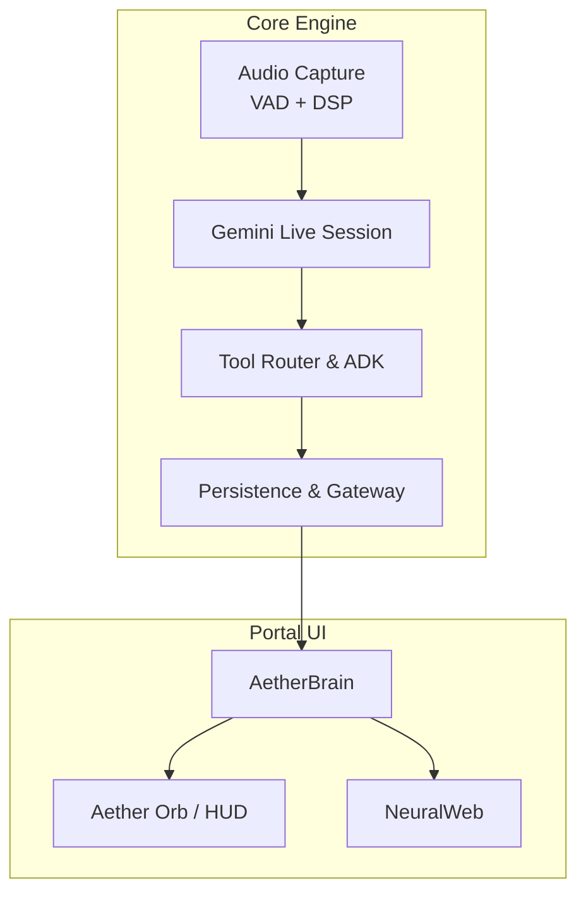
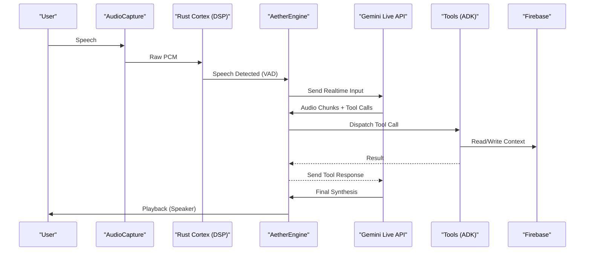
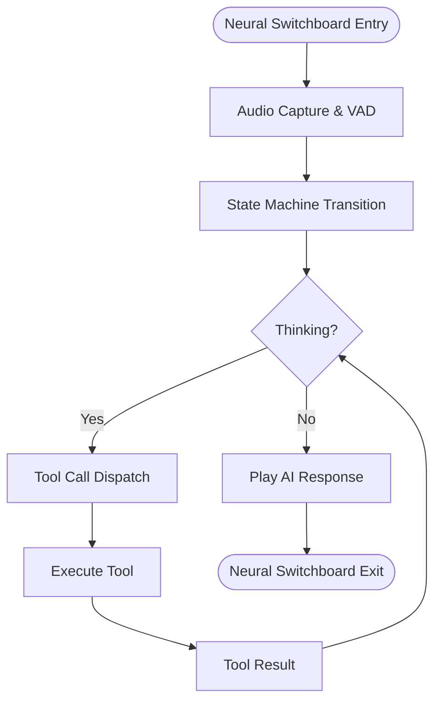
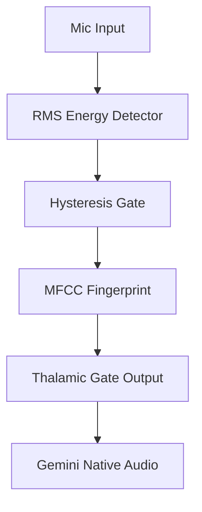
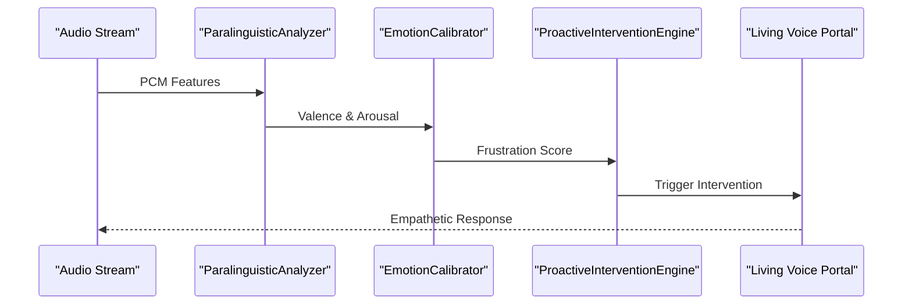
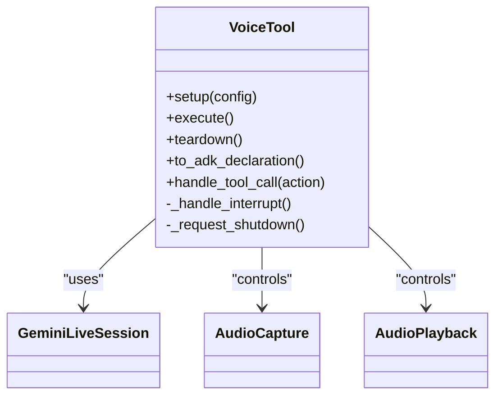
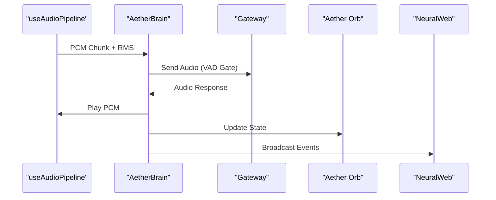
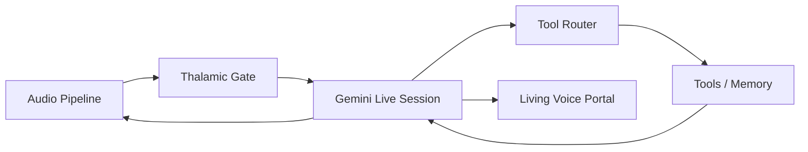

# Vision and Mission

<cite>
**Referenced Files in This Document**
- [README.md](file://README.md)
- [architecture.md](file://docs/architecture.md)
- [ROADMAP.md](file://docs/ROADMAP.md)
- [KERNEL.md](file://docs/KERNEL.md)
- [ath_package_spec.md](file://docs/ath_package_spec.md)
- [session.py](file://core/ai/session.py)
- [thalamic.py](file://core/ai/thalamic.py)
- [voice_tool.py](file://core/tools/voice_tool.py)
- [AetherBrain.tsx](file://apps/portal/src/components/AetherBrain.tsx)
- [useAudioPipeline.ts](file://apps/portal/src/hooks/useAudioPipeline.ts)
- [NeuralWeb.tsx](file://apps/portal/src/components/NeuralWeb.tsx)
- [paralinguistics.py](file://core/audio/paralinguistics.py)
- [baseline.py](file://core/emotion/baseline.py)
- [calibrator.py](file://core/emotion/calibrator.py)
- [proactive.py](file://core/ai/agents/proactive.py)
- [latency.py](file://core/analytics/latency.py)
- [bench_latency.py](file://tests/benchmarks/bench_latency.py)
</cite>

## Table of Contents
1. [Introduction](#introduction)
2. [Project Structure](#project-structure)
3. [Core Components](#core-components)
4. [Architecture Overview](#architecture-overview)
5. [Detailed Component Analysis](#detailed-component-analysis)
6. [Dependency Analysis](#dependency-analysis)
7. [Performance Considerations](#performance-considerations)
8. [Troubleshooting Guide](#troubleshooting-guide)
9. [Conclusion](#conclusion)

## Introduction
Aether Voice OS envisions a future where the UI layer is eliminated entirely. Interaction becomes a continuous audio stream powered by voice-native AI, turning speech into real-time actions using Gemini Live audio. The mission is to deliver sub-200ms latency with deep paralinguistic awareness, enabling a neural interface between thought and action. This paradigm shift moves beyond keyboards and touchscreens toward a frictionless, invisible medium that feels as natural as thinking itself.

The core problem addressed is threefold:
- High latency (300–500ms) making interactions feel robotic and interrupting flow
- Lack of context awareness, acting as simple Q&A bots without environmental understanding
- Absence of empathy and affective computing, with little to no emotional intelligence

Aether’s solution is revolutionary: a custom-built Thalamic Gate audio layer, a unified neural pipeline leveraging Gemini Live multimodal audio, and a proactive emotional AI system that detects frustration and intervenes automatically. The result is a “Living Voice Portal” — a sentient, breathing interface that replaces chatbots with a living, responsive entity.

## Project Structure
At a high level, Aether Voice OS is organized into:
- Core AI and audio engine powering the neural pipeline and real-time audio processing
- A frontend portal implementing the “Living Voice Portal” with immersive visualizations
- A package system (.ath) for portable, signed agent identities
- A roadmap and documentation guiding the journey from prototype to submission-grade system

**Diagram sources**
- [architecture.md](file://docs/architecture.md#L37-L60)
- [AetherBrain.tsx](file://apps/portal/src/components/AetherBrain.tsx#L82-L172)
- [NeuralWeb.tsx](file://apps/portal/src/components/NeuralWeb.tsx#L147-L158)

**Section sources**
- [README.md](file://README.md#L132-L161)
- [architecture.md](file://docs/architecture.md#L1-L67)

## Core Components
- Neural Switchboard: The central orchestration point where audio, cognition, and action converge. The term “Neural Switchboard” appears explicitly in the codebase and architecture docs, underscoring the system’s role as the nervous system hub.
- Aether Pack (.ath): A portable, signed identity package for AI agents, encapsulating persona, skills, and autonomous behaviors.
- Living Voice Portal: A voice-first UI replacing chat paradigms with a sentient orb, ambient transcripts, and atmospheric intelligence.

These components collectively enable the vision of seamless, voice-native interaction with sub-200ms latency and deep paralinguistic awareness.

**Section sources**
- [README.md](file://README.md#L162-L181)
- [ath_package_spec.md](file://docs/ath_package_spec.md#L1-L58)
- [session.py](file://core/ai/session.py#L390-L403)

## Architecture Overview
Aether’s architecture is a Single-Modal Unified Pipeline built around Gemini Live audio. The system captures audio, applies a Thalamic Gate V2 for real-time VAD and acoustic identity, streams to Gemini for multimodal reasoning and synthesis, routes tool calls, and plays back synthesized audio. The portal UI renders the “Living Voice Portal,” visualizing neural activity and state transitions.

**Diagram sources**
- [architecture.md](file://docs/architecture.md#L39-L60)

**Section sources**
- [architecture.md](file://docs/architecture.md#L1-L67)

## Detailed Component Analysis

### Neural Switchboard
The Neural Switchboard is the core orchestration layer where audio processing, state transitions, and tool execution intersect. It coordinates the audio pipeline, Gemini Live sessions, and tool dispatches, ensuring zero-friction, sub-200ms interactions.

**Diagram sources**
- [KERNEL.md](file://docs/KERNEL.md#L47-L62)
- [session.py](file://core/ai/session.py#L390-L403)

**Section sources**
- [session.py](file://core/ai/session.py#L390-L403)
- [KERNEL.md](file://docs/KERNEL.md#L47-L62)

### Thalamic Gate V2 and Acoustic Identity
The Thalamic Gate V2 combines RMS energy detection with hysteresis and MFCC spectral fingerprinting to distinguish user speech from system audio. This enables true acoustic self-awareness, preventing self-hearing loops and enabling sub-200ms latency.

**Diagram sources**
- [README.md](file://README.md#L110-L116)
- [architecture.md](file://docs/architecture.md#L11-L18)

**Section sources**
- [README.md](file://README.md#L99-L116)
- [architecture.md](file://docs/architecture.md#L11-L18)

### Proactive Intervention and Emotional AI
Aether’s proactive intervention engine detects frustration via paralinguistic features, calibrates baselines dynamically, and triggers empathetic, context-aware interventions. It integrates with the portal’s visualizations to reflect emotional states and neural activity.

**Diagram sources**
- [paralinguistics.py](file://core/audio/paralinguistics.py#L132-L213)
- [calibrator.py](file://core/emotion/calibrator.py#L51-L60)
- [proactive.py](file://core/ai/agents/proactive.py#L60-L83)
- [NeuralWeb.tsx](file://apps/portal/src/components/NeuralWeb.tsx#L147-L158)

**Section sources**
- [paralinguistics.py](file://core/audio/paralinguistics.py#L1-L213)
- [baseline.py](file://core/emotion/baseline.py#L1-L87)
- [calibrator.py](file://core/emotion/calibrator.py#L42-L64)
- [proactive.py](file://core/ai/agents/proactive.py#L1-L125)
- [NeuralWeb.tsx](file://apps/portal/src/components/NeuralWeb.tsx#L129-L158)

### Voice Tool and Full-Duplex Pipeline
The Voice Tool exposes a full-duplex audio lifecycle compatible with the Agent Development Kit (ADK). It manages capture, Gemini Live session, playback, and barge-in handling, forming the backbone of the “Living Voice Portal.”

**Diagram sources**
- [voice_tool.py](file://core/tools/voice_tool.py#L50-L235)

**Section sources**
- [voice_tool.py](file://core/tools/voice_tool.py#L1-L336)

### Portal Integration and Visual Feedback
The portal integrates the audio pipeline with visual feedback. The AetherBrain component synchronizes gateway status, streams PCM chunks, and handles playback. NeuralWeb renders reactive neural activity, pulsing with emotional and cognitive states.

**Diagram sources**
- [useAudioPipeline.ts](file://apps/portal/src/hooks/useAudioPipeline.ts#L1-L37)
- [AetherBrain.tsx](file://apps/portal/src/components/AetherBrain.tsx#L82-L172)
- [NeuralWeb.tsx](file://apps/portal/src/components/NeuralWeb.tsx#L147-L158)

**Section sources**
- [useAudioPipeline.ts](file://apps/portal/src/hooks/useAudioPipeline.ts#L1-L37)
- [AetherBrain.tsx](file://apps/portal/src/components/AetherBrain.tsx#L82-L172)
- [NeuralWeb.tsx](file://apps/portal/src/components/NeuralWeb.tsx#L129-L158)

## Dependency Analysis
Aether’s architecture emphasizes loose coupling and high cohesion across layers:
- Audio capture and DSP feed the Thalamic Gate, which gates audio to the Gemini Live session
- The session emits tool calls that are routed to tools and memory
- The portal consumes telemetry and events to render the Living Voice Portal

**Diagram sources**
- [architecture.md](file://docs/architecture.md#L39-L60)

**Section sources**
- [architecture.md](file://docs/architecture.md#L1-L67)

## Performance Considerations
Aether targets sub-200ms end-to-end latency with:
- Zero-copy buffers and structured concurrency to minimize overhead
- Multithreading for audio I/O and multilingual support
- Latency tracking and percentile metrics (p50/p95/p99) to maintain strict budgets

Benchmarking confirms internal processing remains under 10ms, leaving ~175ms for network and inference, validating the zero-friction promise.

**Section sources**
- [bench_latency.py](file://tests/benchmarks/bench_latency.py#L70-L83)
- [latency.py](file://core/analytics/latency.py#L1-L39)

## Troubleshooting Guide
Common operational checks:
- Verify microphone device selection and permissions
- Confirm Firebase credentials if persistent memory is required
- Reduce frontend visualizer FPS to lower CPU usage if needed

For latency-sensitive environments, ensure PyAudio C extensions are compiled and the audio pipeline runs without clipping emotion features.

**Section sources**
- [README.md](file://README.md#L244-L248)

## Conclusion
Aether Voice OS redefines the future of human-AI interaction by eliminating UI layers and embracing a continuous audio stream. Through the Neural Switchboard, Thalamic Gate V2, and proactive emotional AI, it achieves sub-200ms latency with deep paralinguistic awareness. The Living Voice Portal transforms interfaces into sentient, breathing organisms, while the .ath package system enables portable, signed agent identities. Together, these innovations represent the inevitable next phase beyond keyboards and touchscreens — a voice-native AI operating layer that feels alive.